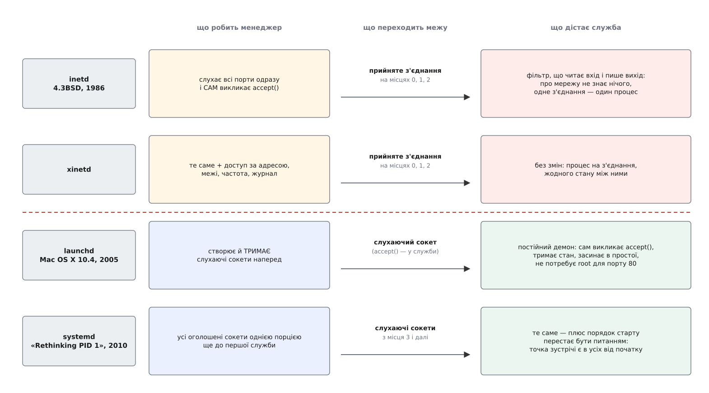

# 📜 Від inetd до systemd: хто тримає сокет

Думка «точка зустрічі може існувати без служби, яка її обслуговує» старша за сорок років, і за ці сорок років вона тричі змінювала зміст. Щоб побачити, що саме змінювалося, тримаймо перед очима два запитання до кожного кроку: **яку річ менеджер віддає службі** — і **хто викликає `accept()`**. Дати й назви тут другорядні; уся історія вміщується у відповіді на ці два запитання.

## 4.3BSD, 1986: один вартовий на всі порти

Клопіт, з якого все почалося, був не про порядок старту й не про відмови клієнтам. Він був про пам'ять. Кожна мережева послуга — передавання файлів, віддалений вхід, відлуння, час доби — це окрема програма, і кожна, щоб бути доступною, мусить жити: створити сокет, попросити ядро слухати й заснути в очікуванні з'єднання. Півтора десятка таких програм сплять роками, займаючи місце в машині, де пам'ять рахують мегабайтами, і кожна прокидається дай боже раз на тиждень.

Розв'язок, що з'явився в 4.3BSD (випуск 6 червня 1986 року; у переліку змін від 15 квітня 1986 року він згаданий як «новий сервер, що слухає на кількох портах і запускає потрібний сервер на вимогу»), звався `inetd`. Конкретне авторство коду в доступних джерелах не зафіксоване — тож імені тут не буде. Ідея ж проста до зухвальства: хай спить **один** процес замість п'ятнадцяти. `inetd` читає таблицю послуг, відкриває всі перелічені порти сам і чекає одразу на всіх — тим самим викликом, яким взагалі чекають на багатьох дескрипторах ([очікування на групі дескрипторів](topic:unix-linux/select-poll-epoll) — окрема давня механіка, що дозволяє одному процесові стежити за десятками джерел). Коли на якийсь порт приходить з'єднання, `inetd` розмножується й запускає ту програму, якій цей порт належить.

Тепер відповідь на наші два запитання. `accept()` викликає **сам `inetd`**; службі дістається вже прийняте, готове з'єднання. І віддає він його не через якийсь особливий канал, а найдешевшим способом: кладе дескриптор з'єднання на місця 0, 1 і 2 — туди, де за угодою живуть [стандартні потоки](topic:unix-linux/standard-streams), тобто те, звідки програма читає й куди пише, не питаючи, що там насправді.

Наслідок цього рішення варто відчути повністю. Програма, запущена з-під `inetd`, **узагалі не є мережевою**. Вона не знає про сокети, порти й адреси; вона читає зі входу й пише на вихід — рівно як фільтр у конвеєрі. Служба відлуння тут — це буквально `cat`. Уся культура маленьких програм, що з'єднуються потоками, безкоштовно поширилася на мережу: щоб віддати щось у світ, досить було написати звичайний фільтр і додати рядок у таблицю.

Ціна теж випливає з тієї самої відповіді. Раз `accept()` належить менеджерові, служба ніколи не бачить слухаючого сокета — а отже, не може обслуговувати друге з'єднання, не може тримати між з'єднаннями ані кешу, ані пулу, ані взагалі пам'яті. Одне з'єднання — один процес від першої до останньої інструкції. Це модель «процес на з'єднання», і вона чесно працює, поки з'єднань одиниці на годину.

Один виняток у цій картині цікавий тим, що він — зародок усього подальшого. Крім звичайного режиму `nowait`, де `inetd` приймає з'єднання й одразу вертається слухати далі, є режим `wait`, у якому менеджер віддає службі **сам сокет**, а не прийняте з'єднання, і перестає за ним стежити, доки нащадок не завершиться. Без цього не обійтися там, де `accept()` немає в природі — у послугах на дейтаграмах. Тобто передавання слухаючого сокета вміли вже 1986 року. Але вміли як окремий випадок для одного сокета й ціною сліпоти менеджера на весь час роботи служби.

## xinetd: та сама серцевина, інша збруя

Наступний крок додав до цієї моделі багато потрібного і нічого принципового. `xinetd` — розширений варіант тієї самої речі: доступ можна обмежити за адресою клієнта й за годиною доби, кожній послузі — свої межі на кількість одночасних з'єднань і на частоту, свій запис у журнал, своя мережева адреса для прив'язки.

Перевірмо його нашими двома запитаннями — і побачимо, що відповіді не змінилися. `accept()` викликає менеджер; службі йде готове з'єднання на стандартних потоках. А раз відповіді ті самі, то й стеля та сама: процес на з'єднання, жодного стану між ними. Тому впродовж 1990-х і 2000-х усе, що росло у навантаженні — веб-сервери, поштові сервери, бази, — з-під `inetd` пішло й повернулося до звичного «служба сама відкриває свій порт і живе вічно». А сама думка, що сокет може існувати без служби, лишилася при рідко вживаних дрібницях і тихо перетворилася на екзотику.

## launchd, 2005: сокет наперед, служба потім

Поворот стався там, звідки на той час мало хто чекав системних новацій. У Mac OS X 10.4 Tiger (2005) з'явився `launchd`, спроєктований і написаний Дейвом Заржицьким (Dave Zarzycki) — менеджер, що є водночас [першим процесом системи](topic:unix-linux/init-and-pid1), тобто предком усього живого й тим, хто ніколи не перезапускається.

Зміна в одному реченні: менеджер створює й **тримає слухаючі сокети наперед**, а `accept()` викликає **сама служба**. Через межу тепер переходить не з'єднання, а точка зустрічі.

З цієї одної перестановки випливають три різні речі, і жодна з них не була доступна попередній моделі.

Перша: служба знову стає **нормальним постійним демоном**. Вона дістає слухаючий сокет і крутить на ньому свій цикл: приймає скільки завгодно з'єднань, тримає пул, кеш і будь-який стан. Витрати «процес на кожне з'єднання» зникають — а виграш «точка зустрічі є завжди» лишається. До цієї миті ці дві речі здавалися альтернативами.

Друга: лінощі стають двобічними. Раз сокет живе без процесу, службу можна не тільки піднімати за першим клієнтом, а й **завершувати після простою** — сокет від цього нікуди не дінеться, і наступний клієнт підніме її знову. У моделі `inetd` завершення служби було нормою, але коштувало процесу на кожне з'єднання; тут воно стає рідкісною подією й не коштує нічого.

Третя стосується прав. Прив'язатися до порту, меншого за 1024, звичайному користувачеві ядро не дозволить. Доти це означало, що веб-сервер чи поштова служба мусить **стартувати** з-під `root` — хай навіть лише заради одного виклику `bind()` — і вже потім скидати права; сама ця послідовність і є класична [розділеність привілеїв](topic:unix-linux/privilege-separation), де небезпечну роботу виконує процес із мінімумом повноважень. Коли ж порт прив'язує менеджер, служба не потребує `root` **ніколи**: вона починає свою першу інструкцію вже під непривілейованим користувачем, тримаючи в руках готовий сокет на порту 80.

## systemd, 2010: те саме, але заради порядку старту

У квітні 2010 року Леннарт Поттерінг опублікував допис «Rethinking PID 1», де прямо назвав `launchd` найпомітнішою системою, що працює саме так, — і взявся зробити те саме для Linux разом із Каєм Зіверсом (Kay Sievers).

Але клопіт, який він розв'язував, був інший. `launchd` брався за лінощі: не тримати в пам'яті те, чим користуються двічі на місяць. `systemd` узяв ту саму механіку й повернув її проти **порядку старту**. Логіка тут коротка. Якщо менеджер створює геть усі оголошені сокети однією порцією ще до того, як запустить першу службу, то в мить старту будь-якої служби точки зустрічі є вже в усіх. А значить, питання «хто мусить піднятися раніше» просто зникає: усі можуть стартувати одночасно й звертатися одне до одного вільно, бо неготовність сусіда обертається очікуванням у черзі, а не відмовою.

Так один і той самий механізм за п'ять років зіграв дві різні ролі: у `launchd` він економив пам'ять, у `systemd` — розплітав граф залежностей і давав паралельне завантаження.

*Ліва половина кожного рядка — те, що робить менеджер, права — те, що дістає служба. Перелом посередині: об'єкт, що переходить межу, змінюється з прийнятого з'єднання на слухаючий сокет.*

Найцікавіше в цій історії — те, що **не** змінилося. Спосіб передавання весь цей час той самий, що й 1986 року: дескриптор переходить у нащадка при розмноженні й [переживає заміну образу програми](topic:unix-linux/exec-semantics), бо таблиця дескрипторів під час заміни не чиститься. Ніхто не додав ані нового системного виклику, ані спеціального каналу — усі чотири менеджери користуються тим, що було в системі від початку. Рухалися тільки домовленості: під якими числами лежать передані дескриптори, як служба про них дізнається — і, найголовніше, який саме об'єкт їй віддають.
