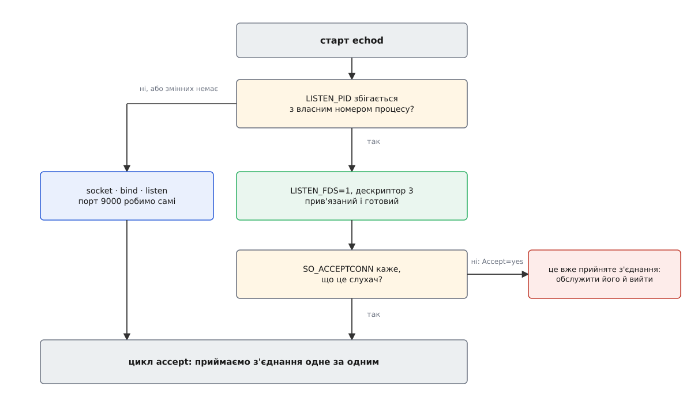

# ⚙️ Echo-служба на переданому сокеті: код, пара юнітів і перевірка

Найкоротший спосіб перестати вірити на слово, що порт може відповідати без служби, — зібрати таку службу самому: сотня рядків програми, два невеликі файли-юніти й десяток команд, після яких `ss` покаже, як один і той самий сокет по черзі належить то менеджерові, то службі, то їм обом одночасно. Бібліотека менеджера тут не знадобиться жодного разу: усе, що треба прочитати, лежить у двох змінних оточення.

## Що саме має робити програма

Обов'язків рівно два, і другий важить не менше за перший.

Перший — розпізнати передавання. Змінна `LISTEN_PID` мусить збігтися з власним номером процесу, `LISTEN_FDS` каже, скільки сокетів передали, а перший з них лежить під числом 3 (нуль, один і два зайняті стандартними потоками). Далі з цим дескриптором **нічого не роблять**: він приходить прив'язаним до адреси й уже в стані слухання, лишається тільки приймати з нього з'єднання.

Другий — уміти обійтися без передавання. Немає змінних або вони чужі — програма робить сокет сама, як робила б будь-яка звичайна служба. Ця гілка коштує десяток рядків і саме вона дозволяє запустити двійковий файл із-під налагоджувача, у контейнері з іншим наглядачем чи просто з оболонки, поки ви його пишете.

Ось обидві гілки в повній робочій програмі — сервер, що повертає клієнтові все надіслане.

:::tabs
```c
/* echod.c — echo-служба, яка вміє і підхопити переданий сокет, і зробити свій.
   Складання:  cc -O2 -Wall -o echod echod.c                                  */

#define _POSIX_C_SOURCE 200809L
#include <arpa/inet.h>
#include <errno.h>
#include <fcntl.h>
#include <netinet/in.h>
#include <signal.h>
#include <stdio.h>
#include <stdlib.h>
#include <string.h>
#include <sys/socket.h>
#include <unistd.h>

#define LISTEN_FDS_START 3
#define FALLBACK_PORT    9000

/* Скільки сокетів передали САМЕ НАМ. Заразом прибираємо змінні з оточення,
   щоб вони не поїхали далі — до наших власних нащадків.                    */
static int listen_fds(void)
{
    const char *pid = getenv("LISTEN_PID");
    const char *cnt = getenv("LISTEN_FDS");
    char self[32];
    int n;

    if (!pid || !cnt)
        return 0;

    snprintf(self, sizeof self, "%ld", (long) getpid());
    if (strcmp(pid, self) != 0)
        return 0;                  /* змінні дісталися нам у спадок від предка */

    n = atoi(cnt);
    unsetenv("LISTEN_PID");
    unsetenv("LISTEN_FDS");
    unsetenv("LISTEN_FDNAMES");
    return n;
}

/* Друга гілка: менеджера немає — сокет робимо самі. */
static int listen_myself(int port)
{
    struct sockaddr_in a = { .sin_family = AF_INET,
                             .sin_port   = htons(port),
                             .sin_addr   = { htonl(INADDR_LOOPBACK) } };
    int fd = socket(AF_INET, SOCK_STREAM, 0);
    int on = 1;

    if (fd < 0)                                         { perror("socket"); exit(1); }
    setsockopt(fd, SOL_SOCKET, SO_REUSEADDR, &on, sizeof on);
    if (bind(fd, (struct sockaddr *) &a, sizeof a) < 0)  { perror("bind");   exit(1); }
    if (listen(fd, 128) < 0)                             { perror("listen"); exit(1); }
    return fd;
}

/* Одне з'єднання: усе прочитане повертаємо назад, поки клієнт не піде. */
static void echo(int c)
{
    char buf[4096];

    for (;;) {
        ssize_t n = read(c, buf, sizeof buf);

        if (n == 0) return;                       /* клієнт закрив свій бік */
        if (n < 0) { if (errno == EINTR) continue; return; }

        for (ssize_t off = 0; off < n; ) {
            ssize_t w = write(c, buf + off, n - off);
            if (w < 0) { if (errno == EINTR) continue; return; }
            off += w;
        }
    }
}

int main(void)
{
    int n = listen_fds();
    int lfd;

    signal(SIGPIPE, SIG_IGN);      /* клієнт може зникнути посеред відповіді */

    if (n > 1) {
        fprintf(stderr, "передано %d сокетів, а ми вміємо один\n", n);
        return 1;
    }
    lfd = (n == 1) ? LISTEN_FDS_START           /* уже прив'язаний і слухає */
                   : listen_myself(FALLBACK_PORT);
    fcntl(lfd, F_SETFD, FD_CLOEXEC);            /* нащадкам сокет не потрібен */

    for (;;) {
        int c = accept(lfd, NULL, NULL);

        if (c < 0) {
            if (errno == EINTR || errno == ECONNABORTED)
                continue;
            perror("accept");
            return 1;
        }
        echo(c);
        close(c);
    }
}
```
```go
// echod.go — та сама служба ідіоматичним Go.
//   go build -o echod echod.go
package main

import (
	"io"
	"log"
	"net"
	"os"
	"strconv"
)

const listenFDsStart = 3

// Слухач, переданий менеджером, або nil, якщо нам нічого не передавали.
func inherited() net.Listener {
	if os.Getenv("LISTEN_PID") != strconv.Itoa(os.Getpid()) {
		return nil // змінні дісталися нам у спадок від предка
	}
	n, err := strconv.Atoi(os.Getenv("LISTEN_FDS"))
	if err != nil || n != 1 {
		return nil
	}
	os.Unsetenv("LISTEN_PID") // далі, до власних нащадків, вони не поїдуть
	os.Unsetenv("LISTEN_FDS")
	os.Unsetenv("LISTEN_FDNAMES")

	f := os.NewFile(listenFDsStart, "listen-fd") // уже прив'язаний і слухає
	defer f.Close()                              // FileListener узяв собі копію

	l, err := net.FileListener(f)
	if err != nil {
		log.Fatalf("переданий дескриптор не є слухачем: %v", err)
	}
	return l
}

func main() {
	l := inherited()
	if l == nil { // запустили руками — сокет робимо самі
		var err error
		if l, err = net.Listen("tcp", "127.0.0.1:9000"); err != nil {
			log.Fatal(err)
		}
	}

	for {
		c, err := l.Accept()
		if err != nil {
			log.Fatal(err)
		}
		go func() { // кожне з'єднання — своя горутина
			defer c.Close()
			io.Copy(c, c)
		}()
	}
}
```
:::

Дві дрібниці в цих текстах не косметичні. `net.FileListener` не забирає дескриптор собі, а робить із нього власну копію, тож вихідний `*os.File` треба закрити самому — інакше в таблиці лишиться зайве число, яке нікому не належить. І `SIGPIPE`: клієнт, що зник посеред відповіді, спричиняє цей сигнал, типова дія якого — смерть процесу. Під менеджером він і так знешкоджений — `IgnoreSIGPIPE=` усталено ввімкнено, — але з оболонки програма запуститься без цього захисту, тож знімати сигнал доводиться самому. У Go про це подбало середовище виконання: запис у закрите з'єднання просто повертає помилку, і [диспозиція сигналу](topic:unix-linux/signal-disposition) вас не обходить.

Різниця між двома текстами теж змістовна: варіант мовою C обслуговує з'єднання по черзі, бо `accept` стоїть в одному циклі з обробкою. Для проби цього досить, для служби — ні; звідси природний наступний крок — [чекати готовності відразу на багатьох дескрипторах](topic:unix-linux/select-poll-epoll), тобто `epoll`. У Go цей крок уже зроблено за вас, тому там і стоїть `go func()`.

## Обидві гілки — без жодного юніта

Перш ніж класти файли в `/etc`, обидві гілки перевіряються за півхвилини. Гілка «менеджера немає» — простим запуском:

```sh
$ ./echod &
$ sudo ss -lntp 'sport = :9000'
State   Recv-Q  Send-Q  Local Address:Port  Peer Address:Port  Process
LISTEN  0       128         127.0.0.1:9000       0.0.0.0:*     users:(("echod",pid=7701,fd=3))
$ printf 'без менеджера\n' | nc -q1 127.0.0.1 9000
без менеджера
```

Гілка передавання — окремим інструментом, який робить рівно те, що зробив би менеджер: створює сокет, виставляє змінні `LISTEN_FDS` і `LISTEN_PID` та замінює себе на вашу програму.

```sh
$ systemd-socket-activate -l 127.0.0.1:9000 ./echod &
$ printf 'через менеджера\n' | nc -q1 127.0.0.1 9000
через менеджера
```

Той самий інструмент відтворює й решту варіантів, які знадобляться далі: ключ `-a` дає поведінку `Accept=yes`, а `--datagram` — дейтаграмний сокет замість потокового.

## Два юніти

```ini
# /etc/systemd/system/echo.socket
[Unit]
Description=Сокет echo-служби

[Socket]
ListenStream=127.0.0.1:9000
FileDescriptorName=echo
Backlog=128

[Install]
WantedBy=sockets.target
```

```ini
# /etc/systemd/system/echo.service
[Unit]
Description=Echo-служба на переданому сокеті

[Service]
Type=simple
ExecStart=/usr/local/bin/echod
DynamicUser=yes
```

Найпомітніше тут — чого немає. Немає рядка `Sockets=`: коли імена юнітів збігаються з точністю до суфікса, дескриптори передаються самі, і посібник прямо радить цього налаштування не вживати. Немає й рядків залежності: сокет-юніт автоматично дістає `Before=` на службу, яку запускає, а служба — автоматичний `After=` на сокет, що її активував. Немає секції `[Install]` у службі, і це не недогляд: вмикають тут **сокет**, командою `systemctl enable echo.socket`, бо саме він має підніматися на старті системи. Немає й жодного ухилу в тло — служба працює на передньому плані, і `Type=simple` описує це чесно.

Чому не `Type=notify` — варте окремої фрази. Сповіщення про готовність існує, щоб інші юніти дізналися: до мене вже можна звертатися. Коли сокет створено наперед, звертатися можна було ще до появи процесу, тож чекати нема на що. `notify` лишається корисним там, де служба після старту довго розігрівається й не хоче, аби [політика перезапуску](topic:unix-linux/service-lifecycle) вважала її піднятою завчасно.

`DynamicUser=yes` тут не показуха, а прямий наслідок передавання: програма нічого не прив'язує, отже привілеї їй не потрібні взагалі, і [обліковий запис, створений на час роботи служби](topic:unix-linux/dynamic-service-users), закриває питання. `FileDescriptorName=echo` міняє ім'я, під яким дескриптор приїде в `LISTEN_FDNAMES` (усталено це було б `echo.socket`); наша програма імен не читає, бо один сокет розрізняти нема з чим. `Backlog=128` варто ставити свідомо: без нього значення величезне й мовчки обрізається [загальносистемним обмеженням](topic:unix-linux/sysctl-tunables) `net.core.somaxconn`, і глибина черги виявляється не тією, яку ви задумали.

## Перевірка

```sh
$ sudo systemctl daemon-reload
$ sudo systemctl start echo.socket
$ systemctl is-active echo.service
inactive
$ sudo ss -lntp 'sport = :9000'
State   Recv-Q  Send-Q  Local Address:Port  Peer Address:Port  Process
LISTEN  0       128         127.0.0.1:9000       0.0.0.0:*     users:(("systemd",pid=1,fd=31))
```

Порт слухає, служби немає, власник сокета — процес номер 1. Тепер перше з'єднання:

```sh
$ printf 'привіт\n' | nc -q1 127.0.0.1 9000
привіт
$ systemctl is-active echo.service
active
$ sudo ss -lntp 'sport = :9000'
LISTEN  0       128         127.0.0.1:9000       0.0.0.0:*     users:(("echod",pid=8412,fd=3),("systemd",pid=1,fd=31))
```

Два власники в останньому стовпчику — найцінніше, що видно в цій вправі. Сокет не переїхав і не подвоївся: той самий об'єкт ядра тепер названо двома різними числами у двох різних таблицях — числом 31 у менеджера й числом 3 у служби.

> 🔧 **Навіщо це.** Коли на питання «хто тримає порт 9000» `ss` відповідає двома процесами, звична дія «убити того, хто заважає» перестає працювати: служба зникне, а порт лишиться. Той самий стовпчик рятує й у зворотному випадку — забутий нащадок служби, якому сокет поїхав у спадок, світиться там третім записом, і це єдине місце, де його видно без розкопок у `/proc`.

Далі перевіряємо обидві зупинки. Спершу службу:

```sh
$ sudo systemctl stop echo.service
$ sudo ss -lntp 'sport = :9000'
LISTEN  0       128         127.0.0.1:9000       0.0.0.0:*     users:(("systemd",pid=1,fd=31))
$ printf 'ще раз\n' | nc -q1 127.0.0.1 9000
ще раз
```

Служби немає, порт відповідає, наступне з'єднання підняло її знову. Тепер зупиняємо сокет — і саме тут ховається неочевидне:

```sh
$ sudo systemctl stop echo.socket
$ sudo ss -lntp 'sport = :9000'
LISTEN  0       128         127.0.0.1:9000       0.0.0.0:*     users:(("echod",pid=8465,fd=3))
```

Порт живий, хоча сокет-юніт зупинено. Менеджер закрив **своє** число, а копія в живій службі нікуди не зникла, і об'єкт ядра живе, доки на нього посилається хоч один дескриптор. Посібник називає це прямо: служби можуть працювати далі після зупинки сокет-юніта, і зв'язатися з ними досі можна. Щоб машина справді перестала відповідати, треба зупинити обидва — і саме в такому порядку, бо зупинена першою служба одразу підніметься від наступного з'єднання:

```sh
$ sudo systemctl stop echo.socket echo.service
$ sudo ss -lntp 'sport = :9000'
State   Recv-Q  Send-Q  Local Address:Port  Peer Address:Port  Process
```

## Той самий двійковий файл із Accept=yes

Друга модель роздачі не потребує іншої програми — потрібна лише зміна в юнітах і одна перевірка в коді. Сокет дістає `Accept=yes`, а служба стає шаблоном (ім'я із `@` перед крапкою), з якого менеджер робить окремий примірник на кожне з'єднання:

```ini
# echo.socket
[Socket]
ListenStream=127.0.0.1:9000
Accept=yes
```

```ini
# echo@.service
[Service]
ExecStart=/usr/local/bin/echod
DynamicUser=yes
```

Протокол передавання лишився тим самим: `LISTEN_FDS=1`, дескриптор під числом 3. Змінилося те, **що** це за дескриптор — не слухач, а вже прийняте з'єднання (усталене ім'я для нього — `connection`). Програма може спитати про це саме ядро:

```c
/* Дескриптор 3 буває і слухачем, і вже прийнятим з'єднанням. */
static int is_listening(int fd)
{
    int val = 0;
    socklen_t len = sizeof val;

    if (getsockopt(fd, SOL_SOCKET, SO_ACCEPTCONN, &val, &len) < 0)
        return 0;
    return val;
}

    /* у main, одразу після listen_fds(): */
    if (n == 1 && !is_listening(LISTEN_FDS_START)) {
        echo(LISTEN_FDS_START);      /* нам дали саме з'єднання */
        return 0;
    }
```



*Три способи запуску сходяться в одному двійковому файлі, і всі три розрізняються двома питаннями: чи передавали нам щось і що саме передали.*

Ім'я примірника менеджер складає із самого з'єднання, тож кожен клієнт дістає власний юніт, а адреса того, хто прийшов, приїжджає в змінних `$REMOTE_ADDR` і `$REMOTE_PORT` — писати розбір адрес у програмі не треба. Ціна відома наперед: повний запуск програми на кожне з'єднання. Виправдана вона там, де з'єднання рідкі або де кожне варто ізолювати від сусідів; на потоці — ні. І ще одна межа, яку легко проґавити: для дейтаграмних сокетів (`ListenDatagram=`) значення `Accept=` просто ігнорується — увесь потік завжди обслуговує один примірник служби.

## Пастки

**Прив'язати вдруге.** Найчастіша: програма підхопила дескриптор і за звичкою пішла робити `bind` — а адресу вже зайняв менеджер тим самим сокетом, тож у відповідь прилітає `EADDRINUSE`. Симптом виглядає догори дриґом: руками все запускається, під менеджером — ні. Найшвидша перевірка — `strace -f -e trace=bind,listen systemd-socket-activate -l 9000 ./echod`: у гілці передавання жодного з цих викликів у самій службі бути не має.

**Забути звірку з власним номером процесу.** Оточення успадковує все піддерево, тому помічник, якого запустила служба, теж побачить `LISTEN_FDS=1` — і візьме своє число 3, під яким лежить щось геть інше, скажімо відкритий журнал. Служба почне писати відповіді клієнтів у файл, і причину шукатимуть де завгодно, тільки не тут. Звірка `LISTEN_PID` з `getpid()` це закриває, а прибирання змінних і позначка `FD_CLOEXEC` доводять справу до кінця: без позначки сокет [переживає заміну образу](topic:unix-linux/exec-semantics) в кожному нащадку, і тоді після зупинки обох юнітів порт лишиться зайнятим забутим онуком, а наступний `systemctl start echo.socket` впаде з тим самим `EADDRINUSE`.

**Отруйний запит.** Служба падає на певному запиті — а запит лежить у черзі сокета й дістанеться наступному примірникові, і наступному теж. Зовні це виглядає як «служба не стартує», хоча стартує вона бездоганно й гине вже на роботі. Обмеження частоти перезапусків із [політики перезапуску](topic:unix-linux/service-lifecycle) карусель зупинять, але причини не приберуть; прицільний важіль тут інший — `FlushPending=yes` у сокет-юніті, який після виходу служби чистить буфери сокета й відкидає з'єднання, що чекали. Діє він лише при `Accept=no` й усталено вимкнений.

**Дейтаграмний сокет мусить бути вичитаний.** З'єднань там немає, і активацію спричиняє перший пакет, що просто лежить у буфері приймання. Служба, яка піднялася й нічого не прочитала, лишає буфер непорожнім — менеджер бачить, що робота є, і піднімає її знову й знову. Правило просте: хоча б один `recv` до будь-яких інших дій.
