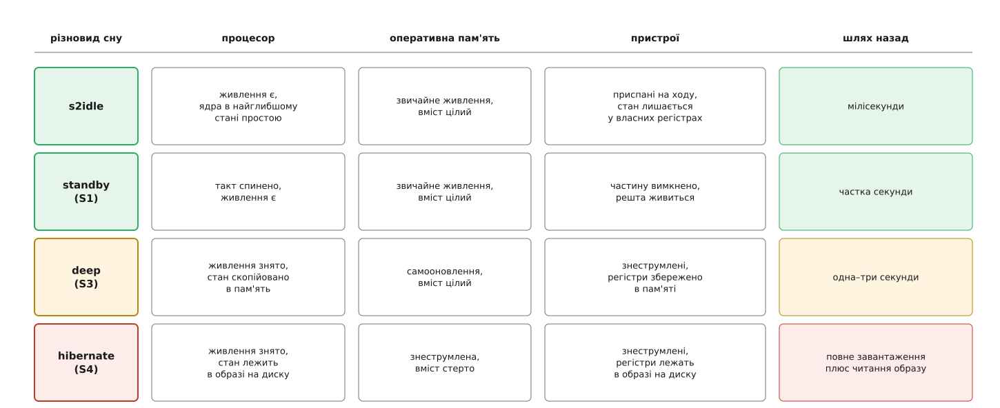
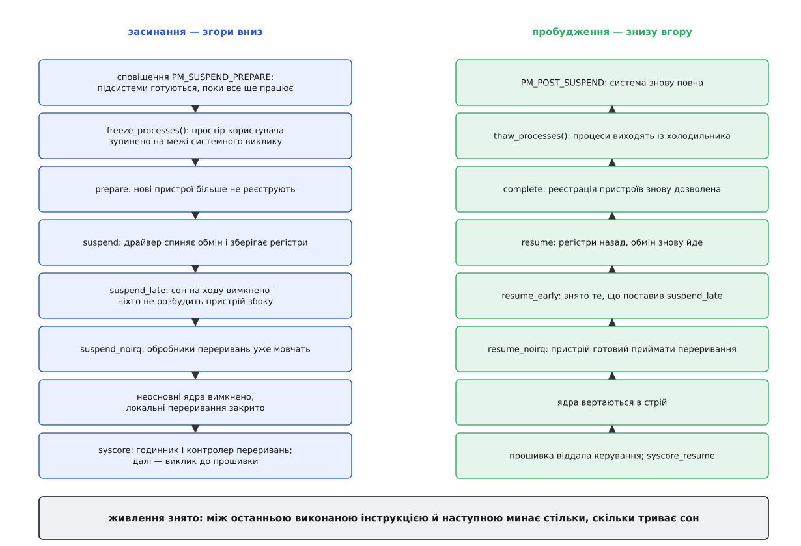
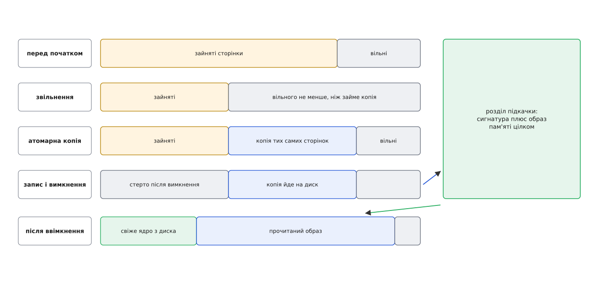

# Призупинення й пробудження: suspend, hibernate і стан пристроїв

<preknowlist>
- [Простій ядра процесора](topic:unix-linux/cpuidle-and-cstates) — процесор уміє зупинятися на різну глибину, і глибша зупинка коштує довшого повернення.
- [Модель пристроїв у sysfs](topic:unix-linux/sysfs-device-model) — дерево пристроїв «батько–дитина» й атрибути-файли, якими ядро показує свій стан і приймає команди.
- [Переривання, softirq і робочі черги](topic:unix-linux/interrupts-bottom-halves) — як залізо забирає керування в того, хто біжить, і що означає «обробники вимкнено».
- [Стани процесу](topic:unix-linux/process-states) — готовий до виконання, у перерваному сні, у неперервному сні.
- [Час у ядрі](topic:unix-linux/kernel-timekeeping) — монотонний годинник і джерела часу, які цокають лише поки залізо живиться.
- [Свопінг і витіснення сторінок](topic:unix-linux/swap-and-reclaim) — як ядро звільняє пам'ять і що таке розділ підкачки.
- [Кеш сторінок, fsync і довговічність запису](topic:unix-linux/page-cache-durability) — брудні сторінки й момент, коли записане справді лежить на носії.
- [Ланцюг завантаження](topic:unix-linux/boot-chain) — прошивка, завантажувач, ядро: повернення з гібернації починається саме звідти.
</preknowlist>

## Що з працюючої системи переживає ніч

Ви закрили кришку ввечері, відкрили вранці — курсор блимає там-таки, редактор тримає той самий незбережений абзац, програвач готовий грати з тієї самої секунди. За ніч машина з'їла кілька відсотків заряду: отже, щось усередині таки живилося, а щось — ні.

Звідси й питання, на якому тримається вся тема: **що з того, чим є працююча система, лежить у місці, яке пережило ніч, а що доведеться відтворити з нуля?**

Бо працююча система — це не одна річ, а три різні сховища стану, які тримаються по-різному:

- **регістри процесора** — лічильник команд, вершина стеку, покажчик на таблицю сторінок, налаштування контролера переривань. Це найменший за обсягом стан і найкрихкіший: він живе, доки на ядро подано напругу;
- **вміст оперативної пам'яті** — усі процеси, усі структури ядра, кеш сторінок. Мікросхема пам'яті тримає біти, доки її вміст періодично оновлюють, а на це теж потрібне живлення;
- **внутрішній стан пристроїв** — режим контролера накопичувача, конфігураційний простір шини, налаштована частота відеовиходу, увімкнене підсвічування, відкрита ізохронна передача. Це стан, який ядро не бачить безпосередньо: він лежить у регістрах чужих мікросхем.

Диск — четверте сховище, і єдине, яке тримає без струму взагалі; саме тому все, що має пережити знеструмлення, зрештою опиняється на ньому.

Тепер сформулюймо, чого ми взагалі хочемо. Не «щоб система вимкнулася й увімкнулася» — це ми вміємо і без окремої підсистеми. Ми хочемо, **щоб жодна програма не помітила перерви**: щоб відкритий файловий дескриптор лишився тим самим дескриптором, щоб змінна в купі мала те саме значення, щоб таймер, поставлений на п'ять секунд, не спрацював тричі. Єдине, чого приховати не вдасться, — це час, і саме про цю щілину програмам доведеться знати.

З такої вимоги випливає жорсткий наслідок: **усе, що ти знеструмив, доведеться відтворити з точністю до біта, і зробити це має той самий код, який знеструмлював.** Кожен крок униз створює борг, який хтось мусить повернути на шляху вгору. Тема призупинення — це облік цього боргу.

## Сходи сну: чим менше живлення, тим більший борг

Різновиди сну відрізняються не «глибиною» як абстракцією, а конкретним списком того, з чого знято напругу.

*Що глибше вниз, то більше клітинок каже «знеструмлено» — і то довший шлях назад, бо кожне знеструмлене місце треба наповнити наново.*

**s2idle** (у ядрі — рядок `freeze`) не знімає живлення ні з чого. Ядро просто зупиняє простір користувача, присипляє пристрої й заходить у цикл, де процесорні ядра сидять у найглибшому доступному стані простою й прокидаються лише на переривання, позначені як здатні будити. Це суто програмний сон: жодної прошивки він не питає й тому працює скрізь. Економія тут виходить не з того, що ми «наказали заснути», а з того, що **ніхто нічого не робить** — і якщо хоч один пристрій лишився в робочому режимі, платформа так і не дійде до свого низького стану, а ноутбук просто нагріється у сумці.

**deep** (в термінах ACPI — стан S3) — це справжнє знеструмлення. Живлення лишається на мікросхемах пам'яті, які переходять у самооновлення, і на невеликому острівці, який чекає події пробудження. Процесор гасне, тому весь його стан спершу копіюють у пам'ять. Стан S1 («standby») — історична сходинка між цими двома, її сучасне залізо майже не пропонує.

Тут варто сказати про сьогоднішній стан справ, бо він неочевидний: **багато сучасних ноутбуків узагалі не оголошують S3 у таблицях прошивки** — виробники замінили його на схему, яку Intel називає S0ix, а Microsoft — Modern Standby: формально система лишається ввімкненою, а вимиканням окремих доменів живлення керує не операційна система, а вбудований контролер. Для Linux це означає, що вибору немає: доступний лише s2idle, і скільки він зекономить, залежить від того, чи довели драйвери всі пристрої до потрібного стану. Звідси й репутація «ноутбук розряджається уві сні» — це не хиба самого механізму сну, а недосяжений низький стан платформи.

**hibernate** (S4) — окремий випадок, бо гасне й пам'ять. Її вміст мусить опинитися на диску, і це змінює задачу настільки, що на неї потрібен окремий розділ нижче.

> 🔧 **Навіщо це.** Коли ноутбук за ніч втрачає 30 % заряду, перше корисне питання — не «який драйвер винен», а «яким різновидом сну ми взагалі спали». Вміст файлів `/sys/power/state` і `/sys/power/mem_sleep` відповідає на нього за секунду: якщо в `mem_sleep` немає `deep`, машина фізично не вимикалася, і шукати треба пристрій, що не дав платформі стишитися. Повний перелік важелів — у вставці про [керування сном із простору користувача](topic:unix-linux/suspend-and-resume/api-sleep-controls.md).

## Спершу всі мусять завмерти

Перед тим як чіпати залізо, ядро зупиняє простір користувача. Причина не в акуратності, а в неможливості інакше.

Уявіть процес, який саме зараз пише у файл, поки драйвер накопичувача вже склав регістри контролера й вимкнув шину. Запис не має куди піти, а помилки з нізвідки програма не чекає. Для гібернації все ще різкіше: ми збираємося зробити знімок пам'яті й покласти його на диск, а потім відновити пам'ять із цього знімка. Якщо між знімком і записом бодай один процес змінить свою сторінку або, гірше, вміст диска, відновлена пам'ять описуватиме світ, якого вже немає.

Механізм зупинки називають **холодильником** (англ. *freezer*). Ядро вмикає загальносистемний прапорець і роздає всім процесам фальшивий сигнал — фальшивий тому, що обробник програми його не побачить: він потрібен лише для того, щоб вибити задачу зі сну й довести до межі повернення із системного виклику. Саме на цій межі задача викликає `try_to_freeze()`, потрапляє у функцію `__refrigerator()`, переходить у стан `TASK_FROZEN` і залишається там, доки її не розбудять явно.

Вибір саме цієї точки — суть механізму. На межі повернення в простір користувача задача **не тримає жодного замка ядра й не має незавершеного системного виклику**: заморозити її тут безпечно, а заморозити посеред виклику — означало б лишити ядро в напівстані. Потоки самого ядра за замовчуванням не заморожуються взагалі; ті нечисленні, яким це потрібно, оголошують себе такими явно й самі перевіряють прапорець у зручному місці циклу.

Звідси й найпоширеніший спосіб, у який призупинення провалюється: задача, що застрягла в **неперервному сні** — типово в очікуванні мережевої файлової системи, яка не відповідає, — не дійде до межі виклику, бо її нікуди не можна розбудити. Ядро чекає на неї обмежений час (за замовчуванням двадцять секунд, змінюється через `/sys/power/pm_freeze_timeout`), потім розморожує всіх і скасовує сон, залишивши в журналі ім'я винуватця.

Ще раніше за холодильник спрацьовують **сповіщення про призупинення** — черга зворотних викликів, яку ядро проходить, поки система ще цілком працездатна. Це єдина мить, коли підсистема може зробити щось «дороге»: виділити пам'ять, дочитати прошивку з диска, попередити свій драйвер. Для гібернації й звичайного сну події різні (`PM_HIBERNATION_PREPARE` проти `PM_SUSPEND_PREPARE`), і кожна має дзеркальну пару на шляху назад — щоб код, який щось відклав, мав де це підібрати, навіть якщо призупинення зірвалося на півдорозі.

## Пристрої лягають знизу вгору й у чотири прийоми

Далі йдуть пристрої, і тут порядок диктує фізика.

Пристрій висить на шині, шина — на контролері, контролер — на кореневому мості. Якщо приспати міст першим, драйвер миші вже не зможе достукатися до своєї мікросхеми, щоб зберегти її регістри. Тому ядро тримає всі пристрої в одному списку в порядку реєстрації — а він, за побудовою, іде від батьків до дітей — і присипляє його **з кінця**: спершу листя, потім гілки. Пробудження йде тим самим списком з початку: спершу оживає міст, і лише тоді має сенс будити те, що за ним.

Але одного проходу замало, і причина знову в перериваннях. Драйвер, який зберігає регістри, часто мусить для цього поговорити з пристроєм — а розмова на багатьох шинах сама спирається на переривання. Виходить порочна вимога: переривання мають бути ще живі, поки хтось зберігається, і вже мертві, поки хтось гасне. Розв'язок — розбити присипляння на прийоми й вимкнути обробники **між ними**:

- **prepare** — реєстрацію нових пристроїв заморожено, щоб список не мінявся під ногами;
- **suspend** — драйвер спиняє обмін, дочікує незавершені передачі, зберігає регістри у свою структуру в оперативній пам'яті. Тут ще можна спати, чекати й звертатися до заліза;
- **suspend_late** — [присипляння на ходу](topic:unix-linux/runtime-power-management) вже вимкнено, тобто ніхто не змінить стан пристрою «збоку», поки ми його складаємо;
- **suspend_noirq** — обробники переривань мовчать. Саме тут добивають те, що ділить лінію переривання з сусідом: інакше сусідній пристрій міг би смикнути спільну лінію й розбудити драйвер, який уже склав свої регістри.

Пробудження проходить ті самі чотири щаблі у зворотному порядку: `resume_noirq` повертає пристрій у стан, у якому він не збожеволіє від першого ж переривання, `resume_early` знімає обмеження, `resume` повертає регістри й обмін, `complete` дозволяє реєстрацію нового.

Зверніть увагу, **куди** драйвер кладе збережені регістри: у звичайну структуру в оперативній пам'яті. Для сну в пам'ять цього досить — пам'ять же й лишається живою. Для гібернації ця структура сама стає частиною образу на диску, і саме тому обидва сценарії користуються тим самим набором зворотних викликів: різниця лише в тому, куди зрештою поїде пам'ять.

## Остання інструкція

Коли пристрої складено, лишаються процесорні ядра. Неосновні [вимикають](topic:unix-linux/cpu-hotplug) або заганяють у стан, з якого їх підніме основне; на єдиному вцілілому ядрі закривають локальні переривання й проходять останній, найнижчий шар зворотних викликів — той, що зберігає лічильник часу, стан контролера переривань і решту речей, без яких ядро не є ядром.

І тоді виконується виклик до платформи. На машині з ACPI це означає виконати метод `_PTS` з таблиць прошивки, а потім записати номер потрібного стану в керуючий регістр живлення; на ARM — зробити виклик до прошивки за угодою PSCI. Магії тут немає: це звичайний запис у звичайний регістр. Самі номери станів і методи, які їх обслуговують, система не вигадує — вона читає їх із [таблиць, якими прошивка описує залізо](topic:programming/acpi-tables): там і перелік підтримуваних станів сну, і код, який треба виконати перед входом у кожен із них.

Незвичайне інше. **Інструкція, що йде за цим записом, виконається через вісім годин.** Для процесора між ними немає нічого — ані паузи, ані очікування: просто наступний такт настає наступного ранку. Уся підсистема призупинення існує заради того, щоб цей розрив був непомітним для всіх, хто вище.

*Кожен крок ліворуч має пару праворуч: те, що зняли останнім, ставлять першим.*

У s2idle цієї інструкції немає взагалі. Замість виклику до прошивки ядро крутить цикл: заганяє ядра процесора в найглибший стан простою, прокидається на переривання, перевіряє, чи хтось повідомив про подію пробудження, і, якщо ні, засинає знову. Тому s2idle і надійніший (нема чому не спрацювати в прошивці), і хиткіший в економії — вимикає ж не він, а окремі драйвери, кожен для свого пристрою.

## Гібернація: пам'ять не може зберегти саму себе

Тепер найцікавіше. Треба покласти на диск вміст оперативної пам'яті — а робить це програма, яка сама в цій пам'яті виконується. Щойно вона щось зробить, картина, яку вона зберігає, зміниться.

Розв'язок Linux — знімок усередині самої пам'яті:

1. **Звільнити місце.** Ядро витісняє сторінки й скидає кеші, доки образ не вкладеться в задану межу (за замовчуванням — приблизно дві п'ятих усієї пам'яті, регулюється через `/sys/power/image_size`), а вільного не лишиться щонайменше стільки, скільки цей образ займе.
2. **Заморозити всіх і приспати пристрої** — тими самими зворотними викликами, що й для звичайного сну.
3. **Зробити атомарну копію.** З вимкненими перериваннями, коли в системі не виконується більше нічого, ядро зберігає стан процесора й копіює всі сторінки, які мають вижити, у ті вільні, що приготувало на кроці 1. Атомарність тут буквальна: між першою й останньою скопійованою сторінкою не встигає статися нічого.
4. **Записати копію на диск.** Пристрої частково оживляють — рівно настільки, щоб працював накопичувач, — і копію пишуть у розділ підкачки, лишаючи в його заголовку сигнатуру «тут лежить образ».
5. **Вимкнути живлення.**

*Копія робиться в ту саму пам'ять, яку копіюють, — тому місце під неї треба звільнити наперед, а сама копія мусить бути неподільною дією.*

Повернення починається як звичайне ввімкнення: прошивка, завантажувач, **свіже ядро**, яке нічого не знає про попереднє життя. Воно читає параметр `resume=` (а для файла підкачки — ще й `resume_offset=`), знаходить сигнатуру й починає читати образ.

І одразу впирається в конфлікт: сторінки з образу мають лягти на ті самі фізичні адреси, з яких їх узяли, — а на частині цих адрес зараз лежить саме ядро-відновлювач. Тому образ спершу читають у будь-які вільні кадри, а потім керування передають короткому шматку коду, розміщеному свідомо поза межами образу. Цей шматок, уже без переривань і без таблиць сторінок, які могли б перестати бути дійсними, переносить сторінки на їхні законні місця й відновлює збережений стан процесора.

Далі стається річ, від якої легко втратити орієнтацію: **функція, що робила знімок, повертається вдруге** — як `fork()`, тільки з розривом у півдоби між двома поверненнями. Одна глобальна змінна каже коду, котре це з двох повернень: перше — «знімок готовий, пиши його на диск», друге — «ти щойно відновився, буди пристрої». Далі йде звичайне пробудження, а ядро-відновлювач просто зникає разом із пам'яттю, яку перезаписали.

З цієї механіки випливає кілька речей, які кусаються на практиці. Розділ підкачки має бути не менший за образ. Якщо підкачка зашифрована, ключ потрібен **до** відновлення, тобто відкривати [зашифрований том](topic:unix-linux/dm-crypt) мусить [initramfs](topic:unix-linux/initramfs). І найгостріше: образ містить кеш файлових систем, які були примонтовані. Якщо між знімком і відновленням хтось змінить ті самі файлові системи з іншої системи, відновлена пам'ять почне писати за застарілою картою — з наслідками, які лікуються лише перевіркою на цілісність.

Що дає **гібридний сон**: образ пишуть на диск, а потім усе одно засинають у пам'ять. Прокинулися звичайно — образ просто викидають; сів акумулятор — систему підняли з образу. Systemd додає до цього відкладений варіант: заснути в пам'ять, а через заданий час, поки заряду ще досить, прокинутися й перейти в гібернацію.

Історія цього механізму — окрема й повчальна: [як з'явився swsusp](topic:unix-linux/suspend-and-resume/hist-swsusp.md) і чому Linux має саме таку гібернацію, а не будь-яку іншу.

## Хто має право розбудити

Сон без пробудження — це вимкнення. Отже, частина заліза мусить лишатися здатною подати сигнал: контролер клавіатури, мережева карта з увімкненою функцією пробудження пакетом, кришка ноутбука, годинник реального часу.

Ядро веде облік таких **джерел пробудження**: кожен пристрій, що вміє будити, має в sysfs атрибут, яким це право вмикають і вимикають, і лічильник подій, які він подав.

Лічильник потрібен не для статистики, а через тонку гонку. Уявіть: демон керування живленням вирішив, що пора спати, і починає писати `mem` у `/sys/power/state`. Саме в цю мить ви натискаєте клавішу. Подія пробудження вже сталася, але система ще не спить — і зараз засне, проігнорувавши натиск, тобто на вигляд просто не прокинеться.

Розв'язок красивий у своїй простоті. Є файл `/sys/power/wakeup_count` із загальною кількістю зареєстрованих подій. Той, хто збирається присипляти систему, спершу читає це число, а потім записує його назад. **Запис удасться лише тоді, коли число не змінилося** — тобто відколи ми прочитали, нових подій не було. А після вдалого запису ядро скасує засинання, щойно надійде хоч одна подія. Гонка зникає, бо рішення «спати» тепер прив'язане до конкретного стану лічильника.

Ця конструкція прийшла з Android разом із ідеєю **опортуністичного сну**: система засинає щоразу, коли ніхто не тримає її явно, а не за окремою командою. У звичайному Linux ту саму роль виконують «заборонники» від служби керування сеансами — програвач фільму просить не присипляти машину, поки триває відтворення, і відпускає прохання, коли скінчив.

## Що бачить програма, коли система прокинулася

Контракт «ніхто нічого не помітить» має рівно одну діру, і вона в часі.

Монотонний годинник не рахує сон: він міряє час роботи, а система не працювала. Годинник `CLOCK_BOOTTIME` — рахує, бо міряє час від увімкнення разом із паузами. Стінний час після пробудження ядро бере з годинника реального часу, який живився від батарейки. Тому те саме очікування «п'ять секунд» дасть після пробудження різні результати залежно від того, який годинник ви взяли; а таймер, поставлений через окремі «будильникові» годинники, ще й здатен сам розбудити систему через апаратний годинник реального часу.

Далі — усе, що спиралося на зовнішній світ. Мережеві з'єднання за ніч померли, бо в співрозмовника таймери йшли своїм ходом; ваш сокет про це не знає, доки ви не спробуєте в нього написати. Токен доступу протух. Змонтована мережева тека відповідає помилками. Нічого з цього ядро полагодити не може — це та частина, з якою мусить рахуватися програма. Як саме — розібрано у вставці [програма, що переживає сон](topic:unix-linux/suspend-and-resume/proj-suspend-aware-program.md).

## Коли не спрацьовує

Призупинення ламається майже завжди в одному місці: у драйвері, який зберіг не все. Пристрій після пробудження живий, ядро вважає його справним, а він мовчить — бо втратив налаштування, яке ніхто не записав.

Шукати таке помагає властивість самої конструкції: спуск має чіткі щаблі, і ядро вміє спинитися на будь-якому з них, не йдучи глибше. Замовивши зупинку після холодильника, після присипляння пристроїв або перед викликом до прошивки, за кілька спроб визначають, який саме щабель ламає систему. Друга стандартна перешкода — консоль: вона теж пристрій і теж засинає, тому повідомлення про помилку на шляху вниз просто нікуди вивести, і його доводиться примусово лишати живим.

За цим і видно справжню природу теми. Кожна пара зворотних викликів драйвера — це маленьке твердження: «я вмію описати себе повністю й зібратися назад із цього опису». Система засинає рівно настільки надійно, наскільки чесне це твердження в найслабшого з її драйверів.
