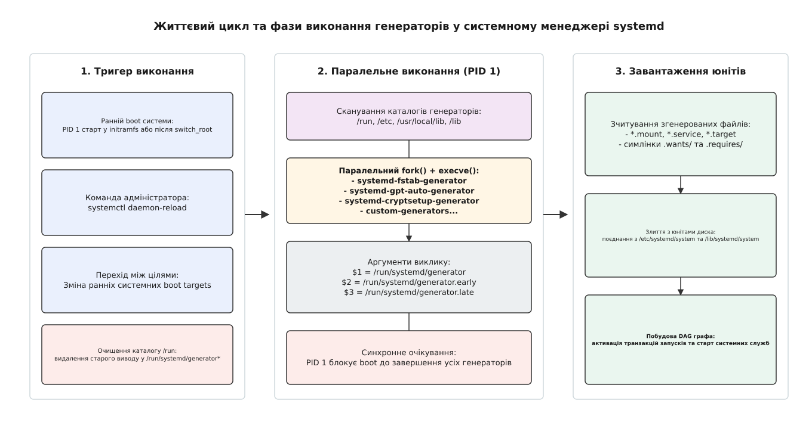
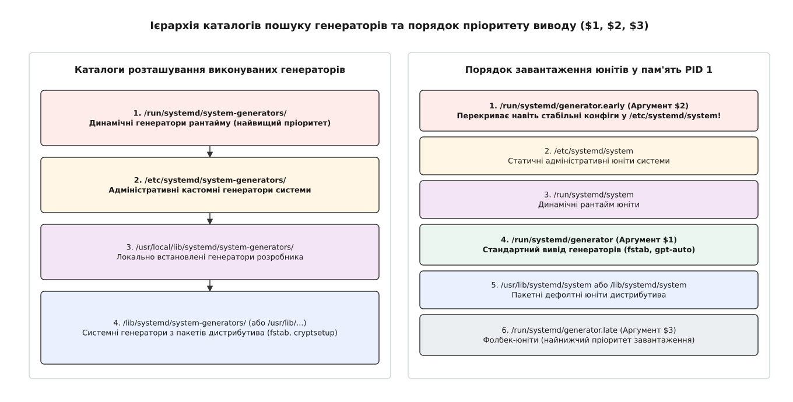

# Генератори systemd (/lib/systemd/system-generators/)

<preknowlist>
- [Модель systemd: юніти, залежності, цілі](book:unix-linux/systemd-model) — концепція юнітів як вузлів графа, типи юнітів та відмінність між порядком і залежністю.
- [Юніт-файли та синтаксис systemctl](book:unix-linux/systemd-systemctl-and-unit-files) — структура INI-подібних юнітів, секції `[Unit]`, `[Service]`, `[Install]` та механізм дроп-ін файлів.
- [Процес ініціалізації PID 1](book:unix-linux/init-and-pid1) — запуск першого процесу користувацького простору та його ролі в деревоподібній структурі процесів.
- [Параметри ядра та командний рядок bootloader](book:unix-linux/bootloader-and-cmdline) — механізм передачі `/proc/cmdline` від завантажувача до ядра і PID 1.
</preknowlist>

Коли системний менеджер systemd бере на себе управління завантаженням операційної системи Linux, він спирається на суворо декларативний граф залежностей, що складається із юніт-файлів у форматі INI. Однак реальна операційна система містить велику кількість конфігурацій, створених за іншими стандартами або в інший час: файлові системи у статичному файлі `/etc/fstab`, зашифровані LUKS-розділи у `/etc/crypttab`, таблиці розділів на дисках з розміткою GPT, а також опції завантаження ядра, що передаються завантажувачем через `/proc/cmdline`. Якби системний менеджер намагався безпосередньо парсити кожен із цих форматів усередині самого двійкового коду PID 1, це створило б надзвичайно складний, монолітний і вразливий процес, де найменша помилка в обробці рядка файлу `fstab` призводила б до катастрофи всієї операційної системи (Kernel Panic). Для вирішення цієї проблеми в архітектуру systemd було впроваджено концепцію **генераторів** (Generators) — виділених допоміжних виконуваних файлів, які прожують зовнішні джерела даних і динамічно транслюють їх у декларативні юніт-файли на самому початку процесу ініціалізації.

## Архітектурна дилема: декларативний граф проти статичних конфігурацій

Операційна система Linux вимагає швидкого, надійного та відтворюваного завантаження. Традиційні системи ініціалізації на кшталт SysVinit вирішували задачу зчитування файлів конфігурації шляхом виклику імперативних Shell-скриптів. Наприклад, спеціальний сценарій під час раннього завантаження зчитував `/etc/fstab` і почергово викликав команду `mount` для кожної файлової системи. Детальніше про цей історичний етап та передумови зміни підходу можна прочитати в [історії виникнення генераторів systemd](book:unix-linux/systemd-generator-architecture/hist-generators-evolution.md).

З переходом до systemd основою архітектури став спрямований ациклічний граф (DAG). У цій моделі кожна точка монтування файлової системи мусить бути описана юнітом типу `.mount`, кожен зашифрований том — юнітом `.service` (наприклад, `systemd-cryptsetup@.service`), а кожна віртуальна консоль — юнітом `getty@.service`. Кожен із цих юнітів має чітко визначені секції `[Unit]`, `[Mount]` або `[Service]`, а зв'язки між ними регулюються директивами `Requires=`, `Wants=`, `Before=` та `After=`.

Виникла фундаментальна суперечність: з одного боку, системний менеджер PID 1 повинен залишатися універсальним і чистим рушієм виконання графа юнітів, не захаращеним специфічними парсерами файлових форматів розметки диска чи параметрів конкретних файлових систем. З іншого боку, змусити системних адміністраторів вручну конвертувати традиційний файл `/etc/fstab` у десятки окремих юніт-файлів `.mount` було б порушенням зворотної сумісності та зручності використання Linux.

Архітектурне рішення systemd полягає у винесенні процедури підготовки та трансляції конфігурацій за межі PID 1. Генератори являють собою невеликі самостійні бінарні деталі або скрипти, що розміщуються у спеціально відведених системних каталогах (`/lib/systemd/system-generators/`). Вони виконуються PID 1 на найранніших фазах завантаження — до того, як системний менеджер почне будувати підсумковий граф юнітів у пам'яті та запускати перші сервіси.

Генератор зчитує вхідні дані (наприклад, парсить `/etc/fstab`), створює необхідні юніти `.mount` та `.swap` у тимчасовій оперативній пам'яті (`/run/systemd/generator/`) та автоматично створює символьні посилання у каталогах `.wants/` або `.requires/` (наприклад, у `local-fs.target.wants/`). Коли генератори завершують свою роботу, PID 1 зчитує згенеровані юніти разом зі статичними файлами з `/etc/systemd/system/` та `/lib/systemd/system/`, утворюючи єдиний цілісний граф залежностей. Сам PID 1 при цьому взагалі не знає про існування файлу `/etc/fstab` — для нього точки монтування з'явилися як звичайні декларативні юніти.

## Життєвий цикл та фази виконання генераторів

Генератори systemd є фазовими компонентами: вони не працюють як фонові демони і не залишаються у пам'яті системи після завершення своєї задачі. Системний менеджер викликає їх у строго визначені моменти часу, утворюючи синхронний бар'єр завантаження.


*Послідовність фаз виклику генераторів PID 1: від очищення оперативних каталогів у `/run` до паралельного виклику бінарників та злиття згенерованих юнітів у граф залежностей.*

Виконання генераторів тригерується у наступних системних ситуаціях:
1. **Рання фаза initramfs**: Коли система завантажується у початковому RAM-диску, PID 1 у середовищі initramfs викликає генератори для розпізнавання кореневого розділу (наприклад, за параметром ядра `root=UUID=...` або таблицею GPT).
2. **Перехід до основного rootfs (після switch_root)**: Під час старту PID 1 у реальній кореневій файловій системі генератори запускаються перед формуванням графа для цілей `sysinit.target` та `basic.target`.
3. **Перезавантаження конфігурації (`systemctl daemon-reload`)**: Коли адміністратор або автоматичний скрипт виконує команду `systemctl daemon-reload`, PID 1 повністю стирає попередній згенерований стан і повторно запускає всі генератори.

Процес виконання генераторів системним менеджером підпорядковується жорсткому алгоритму:
- **Крок 1: Очищення каталогів виводу**. PID 1 повністю видаляє вміст тимчасових оперативних каталогів `/run/systemd/generator/`, `/run/systemd/generator.early/` та `/run/systemd/generator.late/`. Це гарантує, що застарілі юніти від попередніх конфігурацій не залишаться у системі.
- **Крок 2: Сканування каталогів генераторів**. PID 1 оглядає всі каталоги розташування генераторів та збирає список виконуваних файлів з урахуванням маскування за іменами.
- **Крок 3: Паралельний запуск через `fork()` + `execve()`**. Системний менеджер запускає всі знайдені генератори одночасно. Кожному генератору передається три позиційні аргументи (шляхи до каталогів виводу).
- **Крок 4: Синхронне очікування**. PID 1 зупиняє свій власний цикл обробки подій і чекає завершення усіх дочірніх процесів генераторів. Завантаження системи не може рухатися далі, поки останній генератор не поверне код завершення.
- **Крок 5: Завантаження юнітів у граф**. Після завершення усіх генераторів PID 1 зчитує юніти з дисків та згенерованих каталогів у пам'яті, будує залежності та розпочинає виконання транзакцій запуску.

Паралельне виконання генераторів суттєво прискорює завантаження, проте створює вимогу: генератори не повинні залежати один від одного або розраховувати на порядок свого виконання відносно сусідніх генераторів.

## Ієрархія каталогів та три аргументи виводу

Для забезпечення гнучкості та можливості перевизначення (overriding) юнітів системний менеджер передає кожному генератору через аргументи командного рядка **три позиційні аргументи**: шляхи до трьох каталогів виводу у тимчасовій файловій системі RAM (`tmpfs` у `/run`).


*Структура каталогів розташування генераторів та схема перекриття трьох згенерованих шин каталогів ($1, $2, $3) щодо статичних конфігурацій системного менеджера.*

Детальна специфікація аргументів командного рядка виклику генератора:
- **Аргумент `$1` (`normal_dir`)**: Каталог стандартного виводу (`/run/systemd/generator`). Переважна більшість генераторів (зокрема `systemd-fstab-generator`) записують згенеровані юніти та символьні посилання саме сюди. Юніти з цього каталогу мають пріоритет вищий за системні дефолти пакетів (`/lib/systemd/system/`), але нижчий за локальні конфігурації адміністратора (`/etc/systemd/system/`).
- **Аргумент `$2` (`early_dir`)**: Каталог високого пріоритету (`/run/systemd/generator.early`). Юніти, поміщені сюди, мають найвищий пріоритет у всій операційній системі — вони перекривають навіть статичні конфігураційні файли у `/etc/systemd/system/`. Це використовується для екстреного маскування або примусової заміни юнітів (наприклад, при ін'єкції режимів відлагодження).
- **Аргумент `$3` (`late_dir`)**: Каталог найнижчого пріоритету (`/run/systemd/generator.late`). Юніти з цього каталогу застосовуються системним менеджером лише як запасні фолбеки (fallbacks), якщо юніт із таким ім'ям відсутній у всіх інших каталогах системи (включаючи дистрибутивний `/lib/systemd/system/`).

Результуючий порядок пошуку та завантаження юніт-файлів системним менеджером PID 1 має вигляд суворої ієрархії (від найвищого пріоритету до найнижчого):
1. `/run/systemd/generator.early` (Динамічний вивід генераторів — Аргумент `$2`)
2. `/etc/systemd/system` (Статичні юніти та дроп-ін файли адміністратора)
3. `/run/systemd/system` (Динамічні юніти рантайму)
4. `/run/systemd/generator` (Стандартний вивід генераторів — Аргумент `$1`)
5. `/usr/local/lib/systemd/system` (Локально встановлені юніти)
6. `/lib/systemd/system` або `/usr/lib/systemd/system` (Пакетні юніти за замовчуванням)
7. `/run/systemd/generator.late` (Фолбек вивід генераторів — Аргумент `$3`)

Паралельно з каталогами виводу існує ієрархія каталогів, де PID 1 шукає самі виконувані файли генераторів:
- `/run/systemd/system-generators/` — Динамічно створені генератори під час роботи.
- `/etc/systemd/system-generators/` — Локальні генератори, створені системним адміністратором.
- `/usr/local/lib/systemd/system-generators/` — Генератори локальних програмних комплексів.
- `/lib/systemd/system-generators/` (або `/usr/lib/systemd/system-generators/`) — Стандартні генератори, що постачаються у складі пакетів systemd та дистрибутива Linux.

Якщо файл з однаковим ім'ям (наприклад, `my-generator`) існує і у `/etc/systemd/system-generators/`, і у `/lib/systemd/system-generators/`, PID 1 виконує лише версію з `/etc/`, ігноруючи системну. Якщо ж у `/etc/systemd/system-generators/my-generator` створити символьне посилання на `/dev/null`, виконання цього генератора повністю маскується і скасовується.

Ознайомитися з повним довідником параметрів, змінних оточення та структур даних можна у [специфікації інтерфейсу та API генераторів systemd](book:unix-linux/systemd-generator-architecture/api-generator-interface.md).

## Аналіз ключових вбудованих генераторів systemd

У складі стандартного дистрибутива systemd постачається цілий ряд критично важливих системних генераторів, які забезпечують базове функціонування операційної системи Linux.

### 1. `systemd-fstab-generator`

Цей генератор відповідає за підтримку класичного стандарту POSIX/Linux щодо опису файлових систем у файлі `/etc/fstab`, а також обробку параметрів завантаження ядра `root=`, `rootfstype=`, `rootflags=`, `rw`/`ro`, `fstab=`.

Під час запуску `systemd-fstab-generator`:
- Парсить кожний нестандартний рядок `/etc/fstab`.
- Перетворює шлях моунта (наприклад, `/var/log`) у нормалізоване ім'я юніта systemd (`var-log.mount`).
- Формує секцію `[Mount]` із вказуванням `What=`, `Where=`, `Type=` та `Options=`.
- Автоматично аналізує спеціальні розширені опції systemd у `fstab`:
  - `nofail`: Якщо опцію вказано, генератор створює залежність `Wants=` замість `Requires=` у `local-fs.target.wants/`. Це означає, що відсутність накопичувача не зупинить завантаження системи.
  - `x-systemd.automount`: Додатково створює юніт автомонтування `var-log.automount`, який відкладає реальне монтування пристрою до першого звернення процесу до файлів каталогу.
  - `x-systemd.device-timeout=`: Задає максимальний час очікування появи блочного пристрою в `udev` перед фіксацією помилки завантаження.
  - `x-systemd.idle-timeout=`: Дозволяє автоматично розмонтовувати неактивні файлові системи після заданого періоду простою.
- Автоматично розраховує залежності: для файлової системи на мережевому диску (NFS/iSCSI або опція `_netdev`) генератор прив'язує юніт до `remote-fs.target` замість `local-fs.target`.

### 2. `systemd-gpt-auto-generator`

У сучасних комп'ютерах зі специфікацією UEFI та дисковою розміткою GPT цей генератор повністю усуває потребу в наявності файлу `/etc/fstab`.

Спираючись на специфікацію Discoverable Partitions Specification (DPS), `systemd-gpt-auto-generator`:
- Зчитує таблицю розділів GPT завантажувального накопичувача.
- Ідентифікує розділи за їхніми специфічними стандартизованими GUID типів (наприклад, GUID для Linux Root, Home, Swap, Variable Data, EFI System Partition).
- Автоматично ґенерує `.mount` юніти для `/boot`, `/efi`, `/home`, `/srv`, `/var`, `/var/tmp` та `.swap` юніти для розділів підкачки.
- Динамічно додає їх у граф завантаження системи без будь-якої ручної конфігурації у `/etc/`.

### 3. `systemd-cryptsetup-generator`

Відповідає за ініціалізацію зашифрованих блочних пристроїв LUKS. Генератор зчитує конфігураційний файл `/etc/crypttab`, а також параметри ядра `rd.luks.uuid=`, `rd.luks.name=`.

Для кожного зашифрованого тома генератор динамічно створює екземпляр служби `systemd-cryptsetup@name.service` та відповідний юніт блочного пристрою `.device`. Це гарантує, що служба розшифрування буде викликана саме тоді, коли фізичний диск з'явиться у системі під управлінням `udev`, і точно до того, як система спробує змонтувати файлову систему з цього тома.

### 4. `systemd-debug-generator`

Служить інструментом діагностики та порятунку системи. Він аналізує командний рядок ядра `/proc/cmdline` на наявність прапорців відлагодження:
- Якщо виявлено `systemd.debug_shell` або `debug`, генератор динамічно вмикає службу `systemd-debug-shell.service`, яка відкриває root-shell на 9-й віртуальній консолі (tty9) на найранніших етапах завантаження.
- Якщо виявлено `systemd.unit=custom.target`, генератор створює символьне посилання, яке перевизначає дефолтну ціль завантаження системи.
- Якщо виявлено `systemd.mask=service_name`, генератор створює символьне посилання на `/dev/null` у каталозі `$2` (`generator.early`), маскуючи вказаний сервіс від запуску.

### 5. `systemd-system-update-generator`

Відповідає за проведення безпечних офлайн-оновлень операційної системи. Якщо у корені файлової системи існує спеціальне символьне посилання або файл `/system-update`, цей генератор створює юніт, який redirect-ить стандартне завантаження системи з `default.target` на `system-update.target`. У результаті система завантажується у мінімальному захищеному режимі, виконує оновлення пакетів і автоматично перезавантажується.

## Обмеження, правила безпеки та архітектурні пастки

Розробка та використання генераторів вимагає дотримання суворих обмежень. Оскільки генератори виконуються безпосередньо системним менеджером PID 1 з привілеями `root` на ранніх етапах boot, помилка у коді генератора може призвести до важких наслідків для всієї системи.

### 1. Строга заборона використання D-Bus IPC

Найпоширенішою помилкою початківців при написанні генераторів є спроба викликати утиліти `systemctl`, `busctl` або надіслати запит до системного менеджера через IPC-шину D-Bus.

Під час виконання фази генераторів **шина D-Bus та сокет PID 1 ще не працюють і не прослуховують запити**. Спроба викликати `systemctl enable` або звернутися до D-Bus з усередині генератора призведе до нескінченного зависання (deadlock) генератора, а разом із ним — до повного зупинення завантаження всієї операційної системи. Генератор повинен працювати виключно з файловою системою: читати вхідні конфіги та писати вихідні юніти.

### 2. Критичні вимоги до швидкодії

Виконання генераторів є синхронним бар'єром для PID 1. Поки всі генератори не завершать свою роботу, системний менеджер не почне запускати жодної служби.

Генератор **не повинен**:
- Виконувати мережеві запити (DNS, HTTP, DHCP).
- Виконувати тривалі обчислення або опитування пристроїв у довгих циклах (busy loops).
- Чекати появу файлів чи пристроїв через `sleep()`.

Якщо генератор зависає або затримується на 30 секунд, завантаження усієї ОС затримується рівно на 30 секунд. Код генератора повинен бути максимально оптимізованим і розрахованим на виконання за мілісекунди.

### 3. Ідемпотентність та заборона модифікації постійного стану

Генератор повинен створювати та описувати файли **виключно у трьох наданих каталогах** (`$1`, `$2`, `$3`).

Категорично заборонено:
- Модифікувати постійні файли у `/etc`, `/var`, `/usr` або кореневому розділі.
- Створювати власні залишкові файли стану на диску.

Генератор повинен бути повністю ідемпотентним. При кожному виклику `systemctl daemon-reload` каталоги у `/run/systemd/generator*` очищаються до нуля, і генератор запускається знову. Він мусить коректно відтворювати свій вивід при кожному запуску незалежно від того, скільки разів його викликали.

### 4. Граційна обробка помилок

Якщо генератор завершується з ненульовим кодом помилки (`exit(EXIT_FAILURE)`), PID 1 фіксує це повідомлення у системному журналі або на консолі ядра (`kmsg`), однак **не зупиняє завантаження всієї системи**. Системний менеджер продовжує роботу з тими юнітами, які вдалося згенерувати іншим генераторам.

Генератор повинен самостійно перевіряти коректність вхідних даних (наприклад, чи існує конфігураційний файл) і, якщо конфігурації немає, миттєво повертати код `0` (`EXIT_SUCCESS`), не створюючи зайвого шуму у логах.

Практичний приклад розробки власного двійкового генератора з використанням мов C та C++ розібрано у [практичній проектній вставці](book:unix-linux/systemd-generator-architecture/proj-custom-generator.md).

## Методологія відлагодження та діагностики генераторів

При виникненні збоїв під час генерації юнітів системний інженер має у своєму розпорядженні декілька інструментів для відстеження та простеження поведінки генераторів:

1. **Увімкнення вербального логування PID 1**: Шляхом передачі параметрів ядра `systemd.log_level=debug systemd.log_target=console` під час завантаження завантажувача (GRUB чи systemd-boot) можна примусити PID 1 виводити точні моменти запуску кожного генератора та аргументи, що їм передаються.
2. **Аналіз логів генераторів через journalctl**: Повідомлення, надіслані генераторами у `stderr` під час завантаження, фіксуються в системному журналі. Для їх перегляду використовується команда:
   ```bash
   journalctl -b -u systemd-generators.service
   ```
3. **Вимірювання накладних витрат часу**: Оцінити вплив генераторів на загальну тривалість завантаження операційної системи можна за допомогою інструменту `systemd-analyze`:
   ```bash
   systemd-analyze critical-chain
   ```
4. **Ручний запуск у ізольованому середовищі**: Як описано в проектній вставці, генератор можна довільно запустити з правами звичайного користувача, передавши йому три тимчасові каталоги у `/tmp`, що дозволяє відлагодити парсинг конфігурацій без ризику пошкодити конфігурацію системи.

> 🔧 **Навіщо це.** Розуміння архітектури генераторів systemd дозволяє системним інженерам та розробникам embedded-систем інтегрувати динамічні конфігурації диска, мережі або апаратних модулів безпосередньо у граф systemd. Замість написання громіздких та повільних баш-скриптів автозапуску, ви можете створити невеликий двійковий генератор на C/C++, який під час завантаження зчитає перемикачі плати чи файли конфігурації та згенерує оптимальні юніти systemd. Це забезпечує максимальну швидкість старту системи, надійну ізоляцію процесів та чистий декларативний контроль стану операційної системи.
