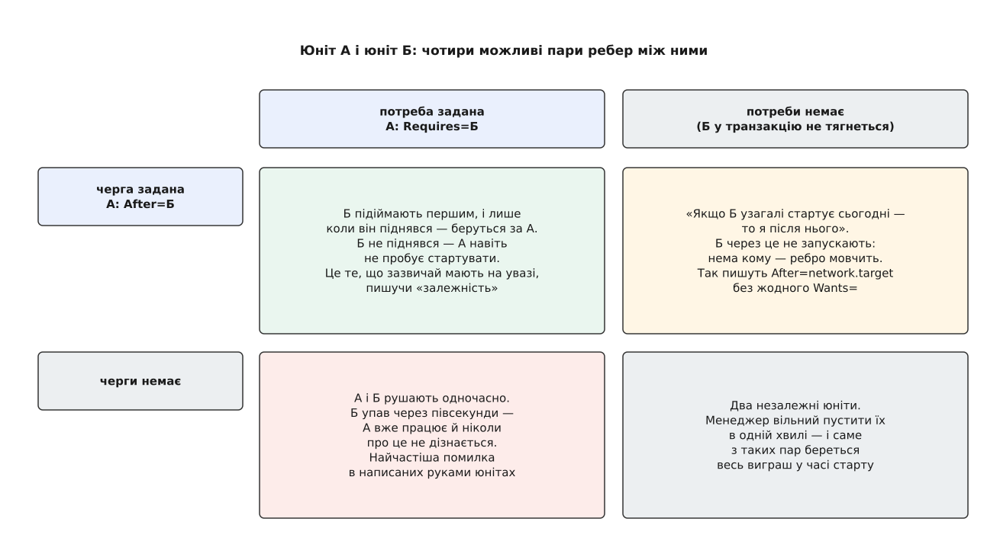
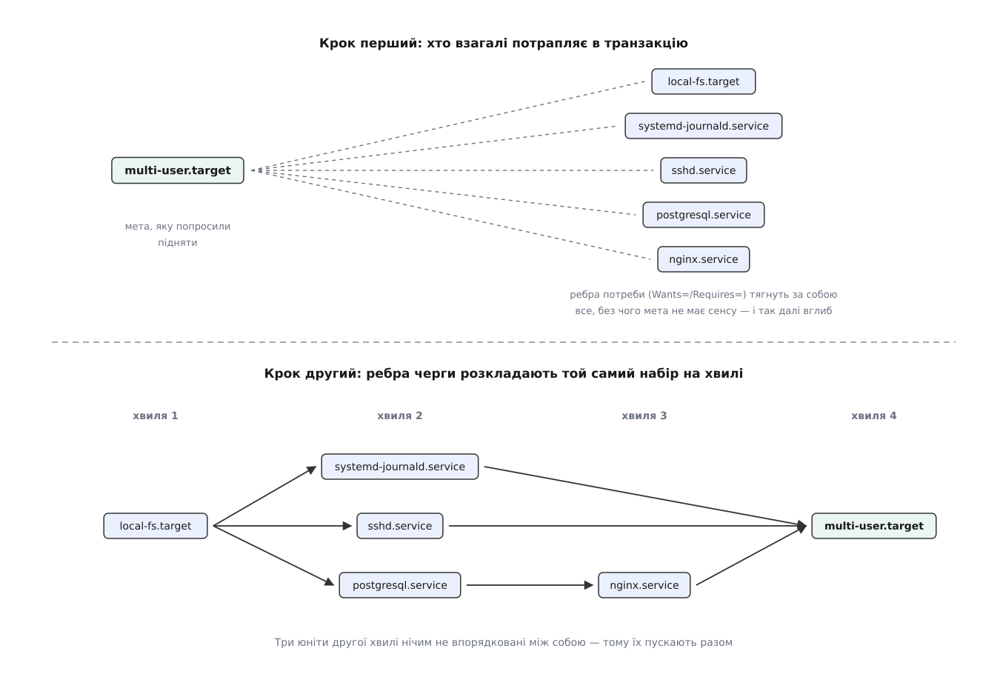
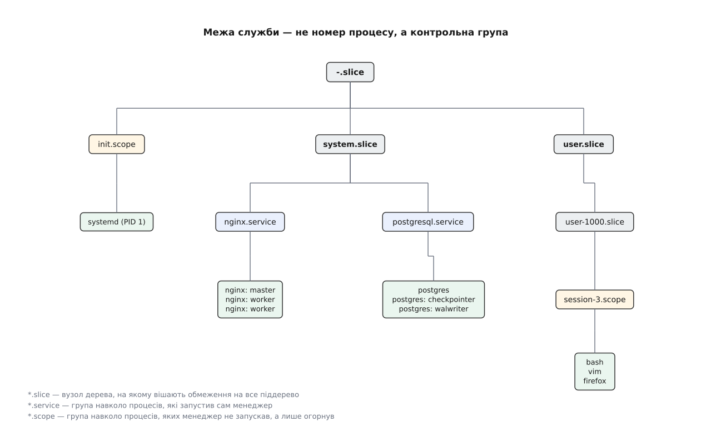

# systemd: юніти, залежності, цілі

<preknowlist>
- [Роль init і особливість PID 1](book:unix-linux/init-and-pid1) — перший процес запускають усі інші, він же приймає сиріт і не має права завершитися.
- [Процес: що це насправді](book:unix-linux/process-model) — процес є набором ресурсів ядра з номером-ідентифікатором, а не «програмою, що біжить».
- [fork: розмноження процесу](book:unix-linux/fork-semantics) — новий процес постає копією наявного, і між копіюванням та підміною коду є проміжок.
- [Демонізація: відхід у фон](book:unix-linux/daemonize) — стара домовленість, за якою служба двічі відгалужується й тим свідомо рве зв'язок із тим, хто її запустив.
- [cgroups: облік і обмеження ресурсів](book:unix-linux/cgroups) — ядро вміє групувати процеси в іменоване дерево, рахувати спожите й ставити межі на групу.
- [D-Bus: шина повідомлень простору користувача](book:unix-linux/dbus) — програми звертаються одна до одної за іменем на спільній шині, а не за номером процесу.
- [Монтування й дерево монтувань](book:unix-linux/mount-model) — файлові системи приєднують у точки дерева, і цей стан машина тримає в собі як список.
- [Топологічне сортування](book:algorithms/topological-sort) — з орієнтованого графа без циклів можна дістати порядок, у якому кожен вузол іде після всіх, від кого залежить.
</preknowlist>

На звичайній настільній машині між миттю, коли ядро передало керування першій програмі, і запрошенням до входу мусить піднятися десь півтори-дві сотні окремих справ: журнал, годинник, мережа, звук, друк, база даних, вебсервер, графічний вхід. Кожна — окрема програма, яку хтось має запустити. І майже кожна чогось потребує від інших: вебсервер безглуздий без бази, база не запишеться на диск, доки не змонтований розділ із даними, а розділ не з'явиться, доки не піднявся драйвер контролера.

Найпростіша відповідь — і історично перша — записати ці запуски як сценарії, пронумерувати їх і виконати один за одним. Вона працює. Але дві її вади лежать не в реалізації, а в самій ідеї, і саме з них виводиться все інше.

Перша на поверхні: час. Половина цих справ більшість свого часу нічого не робить, а чекає — на відповідь від диска, на адресу від сервера мережі, на пристрій, що ще не з'явився. Поки чекає одна, решта простоює, хоча процесорів у машині вісім.

Друга глибша. Номер у назві сценарію не каже, **чому** порядок саме такий. Він — уже готовий висновок чийогось міркування, а саме міркування ніде не записане. Тому ніхто не може довести, що два сусідні номери можна поміняти місцями чи виконати одночасно: причини, з якої їх колись розставили, у системі просто немає.

Обидві вади мають один корінь. У списку сценаріїв зберігається **результат** роздумів (порядок), а не самі **причини**. Порядок, виведений з причин, машина обчислить сама, і обчислить краще за людину — вона побачить усі місця, де впорядковувати не обов'язково. Причини ж, викинуті з опису, не відновить ніхто.

Звідси й уся конструкція, яку розглядаємо далі. Треба домовитися, з чого складається опис однієї речі; якими бувають причини; як із причин рахують порядок; що взагалі означає «служба піднялася»; і чим її тримають після того, як вона піднялася.

## Юніт — вузол, а не служба

Опис однієї речі, якою менеджер керує, звуть **юнітом** (англ. unit — одиниця). Слово навмисно безбарвне, і це не випадковість.

Могло б бути «служба» — але речі, що потребують одна одної, службами не вичерпуються. Розділ із даними — не служба, а вебсервер без нього не працює. Мережевий сокет — не служба, а служба, що його слухає, без нього безсила. Пристрій — не служба, а служба, яка ним керує, поза ним не має сенсу. Якщо кожен із цих сортів описувати окремим механізмом, то й залежності між сортами доведеться зшивати вручну, а це та сама втрата причин, від якої тікали.

Тому всі вони — вузли **одного** графа, і сорт вузла записаний суфіксом його імені: `.service` — процес чи група процесів, `.socket` — сокет, який відкриває сам менеджер, `.mount` і `.automount` — точка монтування, `.swap` — область довантаження, `.device` — пристрій, `.timer` — запуск за часом, `.path` — реакція на зміну у файловій системі, `.target` — про неї нижче, `.slice` і `.scope` — теж нижче, вони про межі, а не про запуск.

Частина цих вузлів має файл, який написала людина. Частина не має жодного файлу: `.device`-юніти менеджер створює з подій ядра про пристрої, `.mount`-юніти — з реального списку монтувань і з рядків `/etc/fstab`. Наслідок важливий: граф не є цілком рукотворним. Половина його вузлів з'являється й зникає сама, відображаючи те, що з машиною діється просто зараз.

Що саме можна написати у файлі юніта — від секцій і директив до правил перекриття окремими доважками — зібрано в [окремій довідці за директивами](book:unix-linux/systemd-model/api-unit-directives.md).

## Дві осі, які не можна плутати

Тепер про ребра. Тут лежить головна ідея всієї моделі, і водночас найчастіше джерело помилок.

Між двома юнітами бувають відносини двох цілком різних природ. Одна відповідає на питання «**чи потрібен** мені цей юніт узагалі» — тобто чи тягнути його в роботу разом зі мною і що робити, коли з ним щось сталося. Друга відповідає на питання «**чи мушу я чекати** на нього» — тобто чи можна нас двох пускати одночасно.

Природний порив — вважати їх одним і тим самим. Якщо мені потрібна база, то, звісно, я після бази. Але саме тут ховається вся паралельність. Паралельність — це і є свобода **не** впорядковувати те, що просто потребує одне одного. Якби потреба автоматично тягла чергу, кожне оголошене «мені потрібен X» додавало б у систему точку чекання, і граф швидко виродився б назад у список. Тому в systemd ці дві осі розділені жорстко й навмисно: у документації прямо сказано, що відносини потреби **не впливають** на порядок запуску. Потребу задають словами `Requires=`, `Wants=` і подібними; чергу — окремо, словами `After=` і `Before=`.

*Найнебезпечніша клітинка — ліва нижня: потребу оголосили, чергу забули, і збій потрібного юніта проходить непоміченим.*

Розділені осі дають чотири комбінації, і кожна має свій сенс. Разом обидва ребра — звичайний випадок «спершу база, потім вебсервер, і без бази вебсервера не буде». Сама лише черга без потреби — цілком осмислена річ і трапляється щодня: `After=network.target` без жодного `Wants=` каже «якщо мережу сьогодні піднімають, то я після неї», але сам мережу не піднімає. Сама лише потреба без черги — та комбінація, у якій ловляться помилки: обидва юніти рушають одночасно, потрібний падає через півсекунди, а той, хто його потребував, уже працює й ніколи про це не дізнається. Ні того, ні того — два незалежні вузли, і саме з таких пар складається виграш у часі.

Ребер потреби кілька, бо питання «що робити, коли з тим юнітом щось сталося» має кілька різних відповідей. `Wants=` — слабке: не піднявся — нічого страшного, працюємо далі; це робочий вид для переважної більшості випадків. `Requires=` — сильне: якщо потрібний юніт не піднявся і на нього є `After=`, наш не стартує; а коли потрібний юніт згодом явно зупинять, зупинять і наш. `Requisite=` нічого не запускає, а лише перевіряє: не піднято вже — негайна відмова. `BindsTo=` додає до `Requires=` реакцію на **раптову** смерть, а не тільки на явну зупинку — саме це потрібно, коли юніт прив'язаний до пристрою, який можна висмикнути. `PartOf=` поширює лише зупинку й перезапуск, і лише в один бік — так групують кілька служб під однією «головною». `Conflicts=` — взаємне виключення: запуск одного зупиняє інший.

## Ціль — це ім'я для стану

Серед сортів юнітів `.target` виглядає дивно: у нього немає ні процесу, ні коду, ні файлу, який він відкриває. Він не робить нічого.

І цього досить. Коли всі відносини звелися до ребер графа, «стан системи» — це просто набір ребер, а щоб набір ребер можна було назвати одним іменем, треба рівно одне: вузол, до якого їх приліпити. **Ціль** (англ. target — мішень, ціль) і є такий вузол: порожній усередині, вагомий назовні. Сказати «доведи систему до `graphical.target`» означає «підніми все, що ця вершина від себе тягне».

З цього безпосередньо випливають дві звички. По-перше, цілі служать **точками синхронізації**: `local-fs.target` означає «усі локальні файлові системи змонтовано», і будь-хто, кому потрібен уже змонтований диск, пише `After=local-fs.target`, не перелічуючи самих дисків. Вершина, порожня всередині, стала спільним іменем для умови, яку інакше довелося б виписувати щоразу.

По-друге, увімкнення служби перестало бути редагуванням чогось. Поряд із файлом цілі лежить каталог із суфіксом `.wants`, і символьне посилання в ньому — це рівно одне ребро `Wants=`, дописане ззовні. Тому `systemctl enable` не переписує ані файл служби, ані файл цілі: він створює посилання. Вимкнення — прибирає його. Пакунок, що ставить службу, і адміністратор, що її вмикає, більше не редагують один і той самий файл.

Цілі прийшли на місце **рівнів виконання** (англ. runlevel) — старих однознакових номерів, кожен з яких означав режим роботи машини. Заміна не є перейменуванням: номерів було сім, вони йшли підряд, і система могла перебувати рівно в одному з них; цілей стільки, скільки треба, вони вкладаються одна в одну, і активних одночасно — скільки завгодно. Чому шлях від номерів до вершин графа виявився таким довгим і хто його пройшов першим — [окрема розповідь](book:unix-linux/systemd-model/hist-from-runlevels-to-units.md).

## Транзакція: як із причин виходить порядок

Тепер зберемо це в дію. Ви кажете «підніми `multi-user.target`». Що відбувається далі.

Запит перетворюється на **роботу** — намір змінити стан одного юніта: запустити, зупинити, перезапустити, перечитати налаштування. Але одна робота рідко буває сама. Менеджер обходить від замовленого юніта всі ребра **потреби** і збирає замикання: усе, без чого мета не має сенсу, потім усе, без чого не мають сенсу вони, і так углиб. Набір робіт, зібраний за один запит, і є **транзакція**.

Перед тим як щось виконувати, набір перевіряють на суперечність. Ребра `Conflicts=` додають у транзакцію роботи зупинки, і може виявитися, що той самий юніт треба одночасно запустити й зупинити. Тоді роботи, які прийшли з `Wants=`, тихо відкидають — вони на те й слабкі; якщо ж суперечать обов'язкові, транзакція відхиляється цілком, і система лишається в тому стані, у якому була.

*Ребра потреби відповідають на «кого підіймати», ребра черги — на «в якій послідовності». Один набір, два різні обходи.*

І лише тепер до справи беруться ребра **черги**. На тому самому наборі вузлів вони утворюють окремий граф, і з нього треба дістати послідовність, у якій кожна робота йде після всіх, на кого вона чекає. Це рівно [топологічне сортування](book:algorithms/topological-sort) — з тією різницею, що менеджеру потрібен не один лінійний порядок, а розшарування: усі роботи, які зараз нікого не чекають, він пускає **одночасно**, дочікується їх, бере наступний шар. Виграш у часі береться саме звідси й ніде більше — з вузлів, між якими ребра черги ніхто не провів.

Лишається неприємний випадок. Ребра черги можуть замкнутися в коло — А після Б, Б після В, В після А. Топологічного порядку в такому графі не існує; це не збій програми, а властивість того, що описали. Менеджер знаходить коло, пише його в журнал і **викидає одну з робіт**, щоб розірвати цикл. Тут варто затямити одну річ: викинута робота не є винною. Вибирають її з міркувань графа, а не важливости, тож постраждати може цілком безневинна служба, а машина — піднятися покаліченою. Тому запис про цикл у журналі читають як помилку в описі, а не як повідомлення про службу, названу в ньому.

> 🔧 **Навіщо це.** Три різні скарги — «служба не стартує», «стартує, але падає», «стартує занадто рано» — потребують трьох різних поглядів, і плутати їх дорого. Перша живе в замиканні за потребою: юніт просто не потрапив у транзакцію. Друга — у ребрах черги: потрапив, але його пустили, коли потрібне ще не готове. Третя — в означенні готовности, про яку далі. Пройти всі три на власній машині — від перегляду транзакції до навмисно створеного циклу — [покроково розібрано окремо](book:unix-linux/systemd-model/proj-see-the-transaction.md).

## Що означає «служба піднялася»

Уся черга тримається на слові «після». Але «після» вимагає точної миті, у яку попередній юніт вважається піднятим — інакше ребро `After=` є обіцянкою без змісту.

Мить визначає директива `Type=`, і різні її значення — це різні **докази готовности**, від найслабшого до найсильнішого.

`Type=simple` оголошує службу піднятою одразу після відгалуження процесу — ще **до** того, як у ньому підмінили код. Менеджер тут не знає про службу нічого: ні що бінарник існує, ні що він запустився, ні тим паче що він готовий приймати роботу. `Type=exec` посуває мить на крок далі, до успішної підміни коду: тепер принаймні відомо, що програма існує й пішла виконуватися. `Type=forking` чекає, поки початковий процес завершиться, лишивши по собі відгалуженого нащадка, — це стара домовленість демонізації, і сильною її робить лише те, що добре написана служба відгалужується вже після того, як усе підготувала. `Type=oneshot` — для одноразової дії: піднято тоді, коли процес завершився. `Type=dbus` чекає, поки служба займе своє ім'я на шині повідомлень. `Type=notify` — найсильніший: служба сама надсилає менеджерові повідомлення `READY=1`, коли **вона вважає**, що готова.

Межа тут проходить посередині списку. У перших трьох випадках менеджер судить про готовність із того, що бачить ззовні, і майже завжди помиляється в бік «занадто рано». У трьох останніх сигнал подає сама служба, і лише тоді `After=` означає те, що ви думали, коли його писали.

Є й спосіб узагалі зняти питання. Якщо сокет відкриває менеджер **до** запуску служби, то той, хто до неї звертається, з'єднується успішно з першої секунди — з'єднання просто чекає в черзі сокета, поки служба справді підніметься. Питання «чи готова вона приймати» зникає разом із потребою впорядковувати тих, хто до неї звертається. Це [активація за сокетом](book:unix-linux/socket-activation), і вона знімає значну частину ребер черги з графа.

## Чим службу тримають

Останнє питання — найпростіше на слух і найважче в реалізації. Служба піднялася. Що саме менеджер тепер тримає?

«Процес із номером таким-то» — відповідь непридатна. Служба зазвичай не один процес: вебсервер тримає головний і кілька робітників, база — цілу купу помічників. Гірше: за старою домовленістю демонізації служба навмисно двічі відгалужується й рве зв'язок із тим, хто її запустив, — початковий процес, за яким менеджер стежив, завершується, а справжня служба лишається жити з іншим номером і з батьком PID 1. Номери процесів до того ж повторюються після переповнення лічильника. Питання «які процеси належать цій службі» через номери просто не має надійної відповіді.

Потрібна межа з іншою властивістю: така, з якої процес **не може вийти сам**. Саме таку дають контрольні групи ядра. Процес не переставляє себе в іншу групу — це може зробити лише привілейований керівник ззовні; кожен нащадок народжується в групі батька. Скільки б разів служба не відгалужувалася, з групи вона не втече.

Тому менеджер заводить кожній службі власну контрольну групу, названу іменем юніта, і кладе туди перший процес. Далі «процеси цієї служби» — це буквально «вміст цієї групи», питання з точною відповіддю в будь-яку мить. Звідси надійна зупинка (припинити всіх у групі, а не вгадувати номери), звідси облік спожитого процесора й пам'яті на службу, звідси обмеження ресурсів.

*Служба, зріз і обсяг — це три ролі одного механізму: група навколо запущеного менеджером, вузол для обмежень і група навколо чужих процесів.*

Тут же пояснюються два останні сорти юнітів. **Зріз** (`.slice`) — це проміжний вузол дерева груп, потрібний, щоб вішати обмеження на цілу гілку: `system.slice` для системних служб, `user.slice` для всього, що належить людям. **Обсяг** (`.scope`) — група навколо процесів, яких менеджер **не запускав**: сеанс людини, що увійшла, або контейнер, створений чужим інструментом. Їх лише огортають групою заднім числом, щоб вони теж мали межу, облік і обмеження. Що менеджер робить із цією межею далі — стежить за виходом, рахує спроби, вирішує, чи перезапускати, — тема [життєвого циклу служби](book:unix-linux/service-lifecycle).

## Наслідок, що виходить за межі завантаження

Механізм описано. Тепер видно те, що з окремих його частин не читалося.

Той самий рушій обслуговує й вимкнення — з тим самим графом, тільки ребра черги читають у зворотний бік: хто стартував після Б, той зупиняється до Б. Через це неохайно описані залежності мстяться двічі, і вдруге болючіше: машина, яка при старті лише щось пропустила, при вимкненні зависає на хвилину, бо чекає юніт, який ніхто не впорядкував.

Але важливіше інше. Юніт — просто вузол із ребрами, а вузли приходять не лише з написаних файлів: рядок у таблиці файлових систем стає вузлом, пристрій, що з'явився, стає вузлом. Це означає, що механізм не має нічого спільного саме з завантаженням. Увімкнення живлення перестало бути окремою фазою з окремими правилами — воно є просто **першою транзакцією** з довгого ряду. Вставлена флешка додає вузол і запускає ту саму машинерію, що й старт системи; викликана вручну команда `systemctl start` породжує транзакцію того самого сорту. Різниця між «система вантажиться» і «система працює» звелася до розміру транзакції, і в цьому й полягав задум.
