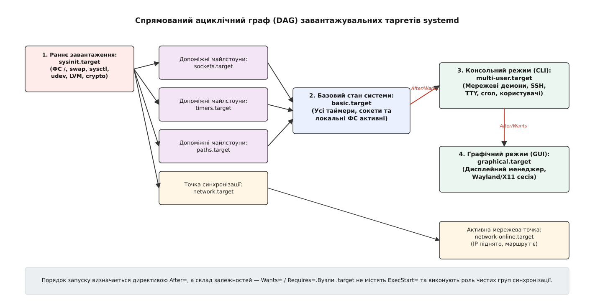
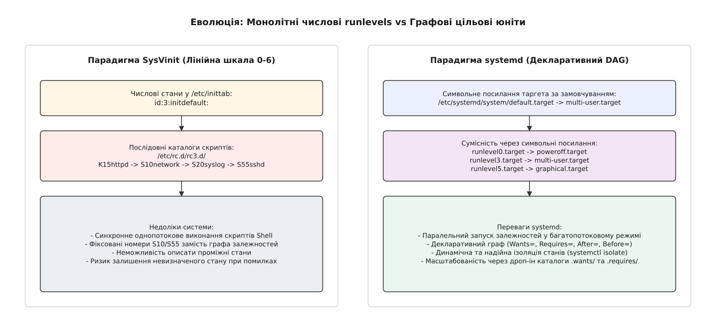
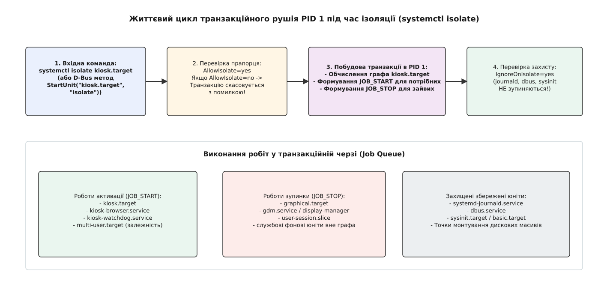

# Цільові юніти (target) та ізоляція рівнів виконання systemd

<preknowlist>
- [Модель systemd: юніти, залежності, цілі](topic:unix-linux/systemd-model) — концепція юнітів як вузлів спрямованого ациклічного графа (DAG) та відмінність між впорядкуванням і залежністю.
- [Системний менеджер systemd: unit-файли та systemctl](topic:unix-linux/systemd-systemctl-and-unit-files) — анатомія юніт-файлів, секції INI, джерела оверридів та клієнт-серверна взаємодія через D-Bus.
- [Роль init і особливість PID 1](topic:unix-linux/init-and-pid1) — призначення першого процесу у просторі користувача та обробка сигналів завершення.
- [Послідовність завантаження Linux](topic:unix-linux/boot-chain) — етапи від старта ядра до ініціалізації середовища користувача.
</preknowlist>

Коли сервери під управлінням Linux переходять із фонового консольного режиму у виділений аварійно-діагностичний стан або у повноцінне графічне середовище, зупинка десятків фонових служб та безпечний запуск нових вимагають суворого контролю транзакцій. У класичних системах ініціалізації ця задача вирішувалася почерговим запуском Shell-скриптів за числовими номерами рівнів виконання, однак відсутність потокобезпечного графа залежностей призводила до блокувань і непередбачуваного поведінки при помилках. У системному менеджері systemd цю роль виконують цільові юніти (`.target`, від англ. *target* — ціль/мета) — невиконувані вузли групування та синхронізації, що формують стани системи та забезпечують транзакційну ізоляцію.

---

## Концепція цільових юнітів: вузли синхронізації без командного рядка execution

Головна відмінність target-юнітів від інших типів юнітів у системному менеджері systemd (таких як `.service`, `.socket`, `.mount`, `.device` чи `.timer`) полягає у принциповій відсутності власного бінарного командного рядка для виконання. У конфігураційній секції `.target` повністю відсутні ключі `ExecStart=`, `ExecReload=` чи `ExecStop=`. Таргет-юніт сам по собі не створює нових процесів у просторі користувача, не відкриває системних сокетів і не виділяє окремих контрольних груп ресурсів (cgroups v2) ядра Linux.

Таргет-юніт слугує **логічним вузлом групування та синхронізації** у спрямованому ациклічному графі (DAG — Directed Acyclic Graph, від грец. *ді* — двократний, *а-цикл* — без кругообігу). Він об'єднує групу пов'язаних юнітів під єдиною назвою та виступає контрольною точкою (milestone, від англ. *milestone* — веха/показчик), досягнення якої свідчить про успішне завершення певного етапу ініціалізації операційної системи.


*Спрямований ациклічний граф (DAG) системних таргетів та ключові майлстоуни завантаження.*

### Активні цільові стани проти пасивних точок синхронізації

Усі target-юніти у системному менеджері systemd поділяються на дві ключові архітектурні категорії за семантикою їх використання та поведінкою під час роботи системи:

1. **Активні цільові стани (State Targets)**:
   Ці юніти призначені для визначення загального цілісного операційного стану системи. Прикладами є `multi-user.target` (багатокористувацький консольний режим), `graphical.target` (графічний режим з дисплейним менеджером) або `rescue.target` (однокористувацький режим відновлення). До таких таргетів застосовується операція ізоляції станів (`systemctl isolate`), яка примусово зупиняє всі служби, відсутні у графі залежностей даного таргета.

2. **Пасивні точки синхронізації (Passive Synchronization Targets)**:
   Призначені для групування супутніх служб за функціональною ознакою та координації порядку їх запуску під час ініціалізації. Прикладами є `network.target` (мережеві інтерфейси ініціалізовані), `sockets.target` (усі системні сокети відкриті) або `timers.target` (періодичні таймери активовані). Такі таргети проходять етап активації під час завантаження і залишаються у стані `active (waited)` без процедури ізоляції.

### Декларативне формування графа: Залежності та Впорядкування

Зв'язки між цільовим таргетом та юнітами, що до нього входять, описуються комбінацією двох незалежних вимірів: **залежностями володіння** (`Wants=`, `Requires=`, `BindsTo=`, `Conflicts=`) та **залежностями часового впорядкування** (`Before=`, `After=`).

```ini
[Unit]
Description=My Custom Operational Target
Documentation=man:systemd.special(7)

# 1. Залежності володіння (Склад транзакції)
Wants=syslog.service network.target
Requires=dbus.service
Conflicts=rescue.target

# 2. Часове впорядкування (Послідовність станів)
After=sysinit.target basic.target
Before=graphical.target

AllowIsolate=yes
```

#### Розбір системних директив секції [Unit]

- `Wants=`: Оголошує м'яку залежність. Усі юніти, вказані у даному ключі, автоматично додаються до транзакції завантаження під час активації таргета. Якщо один із залежних юнітів зазнає помилки під час запуску, це **не призводить** до збою або зупинки самого цільового таргета.
- `Requires=`: Оголошує жорстку залежність. Якщо залежний юніт не вдалося запустити або він несподівано аварійно завершує роботу, системний менеджер PID 1 автоматично переводить таргет-юніт у стан помилки.
- `BindsTo=`: Оголошує сильну залежність зв'язування. Окрім правил `Requires=`, дана директива відстежує стан залежного юніта у реальному часі: якщо пристрій або служба зникає з системи, таргет негайно зупиняється.
- `Conflicts=`: Оголошує негативну залежність. При активації таргета PID 1 формує примусові роботи зупинки (`JOB_STOP`) для всіх юнітів, вказаних у цьому списку.

#### Механізм симлінків: каталоги .wants/ та .requires/

Для розширення складу таргета без внесення змін у його системний файл конфігурації systemd использует механізм каталожних оверридів. Коли служба оголошує у своїй секції `[Install]` директиву `WantedBy=multi-user.target`, виконання утиліти `systemctl enable foo.service` створює символьне посилання у відповідному каталозі:

```
/etc/systemd/system/multi-user.target.wants/
└── foo.service -> /lib/systemd/system/foo.service
```

Під час побудови графа завантаження системний менеджер PID 1 сканує каталоги `<target>.wants/` та `<target>.requires/` у всіх шляхах конфігурації (`/run/systemd/system/`, `/etc/systemd/system/`, `/usr/lib/systemd/system/`) та автоматично додає знайдені юніти до списку залежностей відповідного таргета.

---

## Еволюція від SysVinit Runlevels до цільових юнітів systemd

У традиційних операційних системах UNIX та ранніх версіях Linux стан системи визначався глобальним числом від `0` до `6` — рівнем виконання (runlevel, від англ. *run level*). Перехід між рівнями супроводжувався виконанням текстових сценаріїв із каталогу `/etc/rc<N>.d/`. Докладний аналіз історичних передумов та обмежень цієї системи наведено в [історичному екскурсі про виникнення цільових юнітів](topic:unix-linux/systemd-target-units-and-boot-targets/hist-runlevels-to-targets.md).


*Порівняння лінійної послідовності SysVinit з декларативним графом цільових юнітів systemd.*

Для забезпечення повної зворотної сумісності з інструментами адміністрування та скриптами автоматизації systemd надає прямі відповідники числовим рівням SysVinit у вигляді символьних посилань на спеціальні цільові юніти:

| Числовий рівень SysV | Символьний таргет systemd | Основний системний target-юніт | Призначення стану |
| :---: | :--- | :--- | :--- |
| `0` | `runlevel0.target` | `poweroff.target` | Зупинка системи та вимкнення живлення |
| `1`, `S`, `single` | `runlevel1.target` | `rescue.target` | Режим однокористувацького відновлення (sulogin) |
| `2` | `runlevel2.target` | `multi-user.target` | Багатокористувацький режим (у Debian — повноцінний) |
| `3` | `runlevel3.target` | `multi-user.target` | Багатокористувацький консольний режим із мережею |
| `4` | `runlevel4.target` | `multi-user.target` | Зарезервований користувацький режим |
| `5` | `runlevel5.target` | `graphical.target` | Повноцінний графічний режим (GUI) |
| `6` | `runlevel6.target` | `reboot.target` | Перезавантаження операційної системи |

### Генератор сумісності systemd-sysv-generator

Під час завантаження системи systemd запускає спеціальний генератор `systemd-sysv-generator`. Він парсить заголовочні коментарі LSB (Linux Standard Base) у класичних скриптах `/etc/init.d/` (`# Required-Start:`, `# Required-Stop:`, `# Default-Start:`) та динамічно створює у каталозі `/run/systemd/generator/` обгортки юнітів із відповідними прив'язками до `runlevelN.target`.

### Визначення таргета за замовчуванням: default.target

Замість конфігураційного рядка `id:3:initdefault:` у файлі `/etc/inittab`, у systemd за замовчуванням використовується символьне посилання `/etc/systemd/system/default.target`. 

При старті системи PID 1 зчитує це посилання і приймає вказаний таргет як кінцеву мета-мета завантаження. Наприклад, якщо `default.target` вказує на `graphical.target`, PID 1 будує транзакцію завантаження для активації всього графа залежностей графічного режиму.

Зміна таргета за замовчуванням виконується безпечним перезаписом символьного посилання:

```bash
# Перевірка поточного завантажувального таргета
systemctl get-default

# Встановлення консольного режиму за замовчуванням
systemctl set-default multi-user.target
```

Передачу цільового таргета можна також виконати безпосередньо через командний рядок ядра під час виклику завантажувача (GRUB чи systemd-boot) за допомогою параметра `systemd.unit=`:

```
kernel /vmlinuz-6.6.0 root=/dev/sda2 ro systemd.unit=multi-user.target
```

---

## Транзакційний рушій PID 1 та механізм ізоляції станів (`systemctl isolate`)

Однією з найпотужніших можливостей systemd є процедура **ізоляції станів** (State Isolation). Виконання команди `systemctl isolate <target>` дозволяє миттєво перевести операційную систему з одного операційного стану в інший — наприклад, з повноцінного графічного режиму `graphical.target` у режим діагностики `rescue.target` або у спеціалізований графічний термінал.


*Схема роботи транзакційного рушія PID 1 під час виконання операції ізоляції.*

### Алгоритм роботи транзакційного рушія (Transaction Engine)

Коли адміністратор або зовнішній процес надсилає команду ізоляції, системний менеджер PID 1 виконує наступні кроки:

1. **Перевірка дозволу ізоляції (`AllowIsolate=`)**:
   PID 1 зчитує конфігурацію цільового таргета. Якщо у секції `[Unit]` відсутня директива `AllowIsolate=yes`, операція негайно відхиляється з помилкою `Access denied: Unit cannot be isolated`. Це запобігає випадковій ізоляції пасивних майлстоунів на кшталт `network.target`.

2. **Побудова нового транзакційного графа (Transaction Construction)**:
   Менеджер будує повне транзитивне замикання залежностей для вказаного цільового таргета (включаючи всі юніти, вказані у `Wants=`, `Requires=`, `BindsTo=` та в каталогах `.wants/`).

3. **Формування транзакційних робіт (Job Queue Allocation)**:
   Для кожного юніта в системі PID 1 визначає необхідну дію:
   - Якщо юніт належить до нового графа і не активований — створюється робота `JOB_START`.
   - Якщо юніт вже активований і належить до нового графа — створюється `JOB_NOP` (no operation).
   - Якщо юніт активований, але **не належить** до нового графа залежностей — створюється робота `JOB_STOP`.

4. **Фільтрація захищених системних юнітів (`IgnoreOnIsolate=`)**:
   Щоб запобігти аварійному завершенню роботи самого системного менеджера під час масової зупинки служб, systemd перевіряє прапорець `IgnoreOnIsolate=yes`. 
   
   Юніти, у яких встановлено цей прапорець (наприклад, `systemd-journald.service`, `dbus.service`, `sysinit.target`, `basic.target`, а також критичні точки монтування дискових масивів), **виключаються зі списку зупинки** і продовжують функціонувати незалежно від цільового таргета.

Огляд конкретних конфігураційних синтаксисів та повного переліку системних команд наведено в [довіднику зі специфікацій директив та команд target-юнітів](topic:unix-linux/systemd-target-units-and-boot-targets/api-target-unit-spec.md).

---

## Каскадна ієрархія завантаження та ключові майлстоуни

Процес ініціалізації операційної системи від моменту передачі управління від ядра PID 1 до появи вікна входу у систему являє собою послідовне проходження каскаду системних target-юнітів.

```
[ kernel start ]
       │
       ▼
 emergency.target (при помилках)
       │
       ▼
  sysinit.target (монтування ФС, udev, sysctl, swap, crypto)
       │
       ▼
  basic.target   (сокети, таймери, шляхи, cgroups)
       │
       ▼
 multi-user.target (мережеві демони, SSH, TTY, авторизація)
       │
       ▼
 graphical.target  (Display Manager, Wayland/X11 сесія)
```

### Покроковий розбір майлстоунів завантаження

1. **`sysinit.target` (System Initialization)**:
   Перший фундаментальний майлстоун у просторі користувача. Забезпечує монтування файлових систем (`/`, `/proc`, `/sys`, `/dev`), ініціалізацію пристроїв через `systemd-udevd`, завантаження параметрів ядра через `sysctl`, активацію дискових масивів RAID/LVM, увімкнення підсистеми віртуальної пам'яті (swap) та налаштування шифрованих томів LUKS.

2. **`basic.target` (Basic System Milestone)**:
   Наступний етап, який підтверджує готовність базових системних сервісів. На цьому рівні завершується активація допоміжних груп таргетів:
   - `sockets.target`: створення та прослуховування міжпроцесних сокетів (Socket Activation);
   - `timers.target`: запуск системних таймерів (заміна cron);
   - `paths.target`: моніторинг файлових шляхів (inotify);
   - `slices.target`: створення ієрархії контрольних груп cgroups v2 для обмеження ресурсів.

3. **`multi-user.target` (Multi-User System)**:
   Основний завантажувальний стан для серверних систем без графічного інтерфейсу. Включає запуск мережевого стека, демона SSH (`sshd.service`), системного логування, фонових служб бази даних та консольних служб авторизації (`getty@tty1.service`).

4. **`graphical.target` (Graphical Display Environment)**:
   Найвищий стан у стандартній ієрархії завантаження настільних ОС. Він успадковує всі залежності `multi-user.target` і додатково запускає графічний дисплейний менеджер (GDM, SDDM, LightDM), який ініціалізує графічний сервер X11 або сесію Wayland.

### Спеціалізовані аварійні та службові таргети

Окрім основних завантажувальних таргетів, systemd визначає спеціалізовані вузли для обробки виняткових ситуацій та завершення роботи:

- **`emergency.target`**:
  Найбільш мінімалістичний режим відновлення. Запускається, якщо PID 1 не може змонтувати кореневу файлову систему або прочитати `/etc/fstab`. Не монтує локальні диски та відкриває екстрену оболочку `sulogin` безпосередньо в консолі ядра.
- **`rescue.target`**:
  Однокористувацький режим відновлення. Монтує всі локальні файлові системи у режимі читання-запису, але не запускає мережеві служби та багатокористувацькі демони.
- **`shutdown.target`**, **`reboot.target`**, **`poweroff.target`**:
  Спеціальні таргети завершення роботи. Перехід у `poweroff.target` викликає зупинку всіх активних служб у зворотному порядку впорядкування `After=`, розмонтування дискових масивів та виклик системного syscall `reboot(RB_POWER_OFF)`.

---

## Пасивні точки синхронізації: мережа, час та файлові системи

Одним із найпоширеніших джерел конфігураційних помилок при написанні власних юнітів є неправильне розуміння семантики пасивних таргетів синхронізації.

### Розмежування network.target та network-online.target

Операційні системи використовують два різних цільових юніти для мережевої підсистеми, які мають кардинально різне призначення:

```
[ Мережеві демони ] ────> network.target (Мережевий стек готовий)
                               │
                               ▼
[ Мережевий менеджер ] ─> (Очікування DHCP/IP) ─> network-online.target (IP згенеровано)
                                                        │
                                                        ▼
                                            [ NFS / Мережеві бэкапи ]
```

#### 1. network.target (Мережева підсистема ініціалізована)
Цей таргет є пасивною точкою синхронізації. Його досягнення означає лише те, що мережевий менеджер (systemd-networkd, NetworkManager) запущений і мережева підсистема ядра готова до прийому конфігурацій. 

⚠️ **Помилка**: Встановлення залежності `After=network.target` у юніті веб-сервера **не гарантує**, що мережевий інтерфейс уже отримав IP-адресу через DHCP або встановив з'єднання з Wi-Fi!

#### 2. network-online.target (Мережеве з'єднання повністю підняте)
Цей таргет є активним майлстоуном, який утримує процес завантаження залежних служб доти, доки мережевий менеджер явно не підтвердить, що принаймні один мережевий інтерфейс отримав IP-адресу і маршрут за замовчуванням є активним (за це відповідає служба `systemd-networkd-wait-online.service` або `NetworkManager-wait-online.service`).

Юніти, яким критично необхідне активне мережеве з'єднання для самого факту запуску (наприклад, моунти мережевих файлових систем NFS/CIFS, клієнти VPN або розподлені бази даних), мають явно вказувати:

```ini
[Unit]
Description=NFS Remote Filesystem Mount
Wants=network-online.target
After=network-online.target
```

---

## Проектування власних target-юнітів та практичне застосування

Створення власних цільових юнітів відкриває можливості для побудови гнучких архітектур вкладених систем, промислових контролерів та пристроїв спеціального призначення (Appliance Nodes).

> 🔧 **Навіщо це.**
> Створення власного target-юніта дозволяє відокремити бізнес-логіку пристрою від стандартного розгортання ОС. Наприклад, у платах банкоматів або інформаційних терміналів створення `kiosk.target` дозволяє гарантувати, що при переході у робочий режим будуть зупинені всі засоби налагодження, консолі авторизації та фонові оновлення, залишивши активним лише захищений контейнер графічного додатка та системний контролер.

Детальний приклад створення власного цільового таргета для інфокіоску та програмне переключення станів мовами C та C++ з використанням D-Bus API наведено в [практичному проекті створення кіоск-таргета та програмної ізоляції](topic:unix-linux/systemd-target-units-and-boot-targets/proj-custom-target-and-isolation.md).

### Інструменти аналізу та візуалізації графа таргетів

Для дослідження топології та ієрархії цільових юнітів у дистрибутивах Linux використовуються штатні інструменти утиліти `systemd-analyze`:

```bash
# Деревовидний вивід залежностей для поточного завантаження
systemctl list-dependencies --all default.target

# Генерація векторного графа SVG залежностей усіх таргетів
systemd-analyze dot --to-pattern='*.target' --from-pattern='*.target' | dot -Tsvg -o targets-graph.svg

# Аналіз тривалості завантаження до досягнення ключових майлстоунів
systemd-analyze critical-chain
```

Команда `systemd-analyze critical-chain` виводить найдовший часовий ланцюг завантаження із зазначенням точного часу, витраченого на досягнення кожної точки синхронізації (`sysinit.target`, `basic.target`, `multi-user.target`), що робить цільові юніти прозорим інструментом профілювання продуктивності операційної системи.
