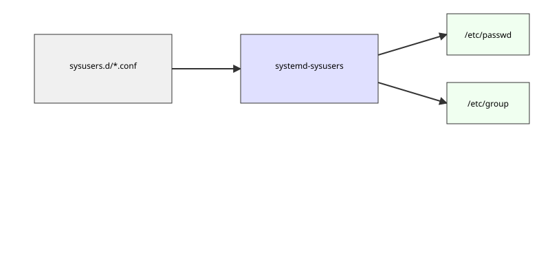

# Декларативний опис службових облікових записів: systemd-sysusers

<preknowlist>
- [Концепції ядра Linux](book:unix-linux/kernel-and-userspace) — базові поняття системних викликів та VFS.
</preknowlist>

## Вступ до systemd-sysusers

У традиційних Unix-системах створення службових користувачів і груп зазвичай виконується за допомогою скриптів оболонки під час встановлення пакетів, використовуючи команди на зразок `useradd`, `groupadd` або `usermod`. Цей імперативний підхід має низку недоліків: він залежить від наявності відповідних утиліт, може призводити до розбіжностей у UID/GID на різних машинах, ускладнює створення атомарних або відтворюваних образів систем і загалом робить процес менш прозорим.

З появою `systemd`, з'явився новий інструмент для вирішення цієї проблеми — **systemd-sysusers**. Ця утиліта дозволяє декларативно описувати системних користувачів, групи та їхнє членство за допомогою простих конфігураційних файлів у форматі `sysusers.d`. Замість того, щоб вказувати *як* створити користувача (викликаючи команди), розробники пакетів або адміністратори вказують *яким має бути стан* системи. При завантаженні системи або при встановленні пакету, `systemd-sysusers` зчитує ці конфігурації та гарантує, що відповідні записи існують у `/etc/passwd` та `/etc/group`.

Цей механізм має ключове значення для сучасних Linux-дистрибутивів, систем "без стану" (stateless systems) та контейнерів. Він забезпечує стабільність UID та GID для службових акаунтів, дозволяє легко керувати правами доступу і робить процес розгортання системи значно більш передбачуваним та безпечним.

## Архітектура та принцип роботи

`systemd-sysusers` — це не фоновий процес (демон), а одноразова утиліта, яка запускається під час завантаження системи. За її запуск відповідає юніт `systemd-sysusers.service`, який зазвичай активується на ранньому етапі завантаження (перед монтуванням локальних файлових систем або відразу після нього), щоб гарантувати наявність усіх необхідних користувачів та груп до запуску інших сервісів, які можуть від них залежати.


*Рис. 1. Схема зчитування конфігурацій sysusers.d та оновлення системних файлів*

### Каталоги конфігурації sysusers.d

Конфігураційні файли `systemd-sysusers` мають розширення `.conf` і зчитуються з декількох каталогів у певному порядку пріоритету:

1. **/etc/sysusers.d/*.conf**: Конфігурації адміністратора системи. Мають найвищий пріоритет.
2. **/run/sysusers.d/*.conf**: Тимчасові конфігурації (створюються динамічно).
3. **/usr/lib/sysusers.d/*.conf**: Конфігурації з пакетів, надані розробниками або дистрибутивом.

Файли в каталозі `/etc/sysusers.d` перекривають файли з такою ж назвою в `/usr/lib/sysusers.d`. Якщо адміністратор хоче скасувати конфігурацію, що постачається з пакетом (наприклад, `pkg.conf`), він може створити порожній файл `/etc/sysusers.d/pkg.conf` або символічне посилання на `/dev/null`.

### Формат конфігураційних файлів

Формат файлів `sysusers.d` є дуже простим і легко читається. Кожен рядок представляє одне правило і складається з декількох полів, розділених пробілами або табуляцією:

```text
Тип  Назва  ID  Коментар  Домашній_каталог  Оболонка
```

Поля можуть бути пропущені або замінені символом `-`, що означає значення за замовчуванням.
Основні типи (перше поле) включають:

*   **u**: Створити користувача (user).
*   **g**: Створити групу (group).
*   **m**: Додати користувача до групи (member).

Розглянемо кожен тип детальніше.

#### Тип 'u': Створення користувача

Директива `u` використовується для створення системного користувача. Вона також автоматично створює однойменну групу, до якої належить користувач, якщо інше не вказано або якщо така група ще не існує.

Синтаксис:
```text
u  НАЗВА  [ID]  [КОМЕНТАР]  [ДОМАШНІЙ_КАТАЛОГ]  [ОБОЛОНКА]
```

*   **НАЗВА**: Ім'я користувача (має відповідати стандартним правилам іменування користувачів в Linux).
*   **ID**: UID, який потрібно призначити користувачеві. Якщо вказано `-`, `systemd-sysusers` автоматично вибере вільний системний UID (зазвичай в діапазоні від 1 до 999). Також можна вказати формат `UID:GID`, щоб явно задати ідентифікатор групи.
*   **КОМЕНТАР**: Поле GECOS, яке зазвичай містить повне ім'я або опис служби.
*   **ДОМАШНІЙ_КАТАЛОГ**: Шлях до домашнього каталогу користувача. Якщо `-` або не вказано, використовується `/`. Зауважте, що `systemd-sysusers` *не* створює цей каталог, він лише записує шлях у `/etc/passwd`. Створення каталогу зазвичай покладається на `systemd-tmpfiles`.
*   **ОБОЛОНКА**: Шлях до оболонки (shell). Для системних користувачів за замовчуванням використовується `/usr/sbin/nologin` (або подібне, що забороняє інтерактивний вхід).

**Приклад:**
```text
# Створити користувача 'nginx' з автоматичним UID, коментарем і домом
u nginx - "Nginx web server" /var/cache/nginx
```

Цей запис додасть `nginx` до `/etc/passwd` із випадковим системним UID, групою `nginx` (яка також буде створена, якщо не існує), домашнім каталогом `/var/cache/nginx` та оболонкою `/usr/sbin/nologin`.

#### Тип 'g': Створення групи

Директива `g` створює системну групу.

Синтаксис:
```text
g  НАЗВА  [ID]
```

*   **НАЗВА**: Назва групи.
*   **ID**: GID групи. Якщо `-`, вибирається вільний системний GID.

**Приклад:**
```text
# Створити групу 'docker' зі специфічним GID 999
g docker 999
```

Якщо група `docker` уже існує, але має інший GID, і цей рядок виконується, поведінка залежить від того, наскільки суворо налаштовано систему (зазвичай `systemd-sysusers` не змінює існуючі ідентифікатори, щоб уникнути конфліктів доступу на існуючих файлах).

#### Тип 'm': Додавання користувача до групи

Директива `m` управляє членством. Вона додає існуючого або новоствореного користувача до вказаної групи.

Синтаксис:
```text
m  КОРИСТУВАЧ  ГРУПА
```

*   **КОРИСТУВАЧ**: Ім'я користувача.
*   **ГРУПА**: Назва групи, до якої він додається.

Обидва — і користувач, і група — мають бути описані (через `u` та `g`) у цьому ж або іншому конфігураційному файлі `sysusers.d`, або вже існувати в системі.

**Приклад:**
```text
# Додати користувача 'john' до групи 'docker'
m john docker
```
Це оновлює запис у `/etc/group`, додаючи `john` до списку членів групи `docker`.

## Механізм призначення UID та GID

Одна з найважливіших функцій `systemd-sysusers` полягає у безпечному та детермінованому (за можливості) призначенні UID та GID. Коли в конфігурації вказано `-` замість конкретного ID, утиліта сканує файли `/etc/passwd` та `/etc/group` для пошуку першого вільного ідентифікатора у системному діапазоні.

Системний діапазон визначається конфігурацією системи (зазвичай у файлі `/etc/login.defs`), і за замовчуванням це ідентифікатори до 999 або 499 (залежно від дистрибутива). `systemd` намагається розподіляти ідентифікатори послідовно або хешувати ім'я користувача, щоб при різних встановленнях на різних машинах один і той самий сервіс з більшою ймовірністю отримав однаковий UID (хоча це не гарантується, якщо ідентифікатор вже зайнятий).

Якщо в файлі `sysusers.d` явно задано конкретний ID (наприклад, `u myapp 450`), `systemd-sysusers` намагатиметься створити користувача саме з цим UID. Якщо цей UID вже використовується *іншим* користувачем, `sysusers` згенерує попередження і відмовиться створювати користувача, або створить його з динамічним UID, що залежить від конкретних версій і налаштувань.

## Генерація /etc/passwd та /etc/group

`systemd-sysusers` працює безпосередньо з текстовими файлами бази даних користувачів. Під час свого запуску він читає конфігурації з `/usr/lib/sysusers.d/`, `/etc/sysusers.d/` тощо, і порівнює їх з поточним станом у `/etc/passwd` та `/etc/group`.

1. **Аналіз конфігурацій**: Всі файли зчитуються та об'єднуються в єдиний внутрішній список. Конфлікти (наприклад, два файли визначають різних користувачів з одним іменем) вирішуються на користь файлу з вищим пріоритетом (наприклад, `/etc/` перекриває `/usr/lib/`).
2. **Перевірка поточного стану**: Зчитуються бази даних користувачів.
3. **Застосування змін**: Якщо користувача або групи не існує, `systemd-sysusers` додає відповідні рядки у `/etc/passwd`, `/etc/shadow`, `/etc/group` та `/etc/gshadow`.

Важливо відзначити, що `systemd-sysusers` створює записи у файлах тіней (`shadow`, `gshadow`) із заблокованими паролями (наприклад, `!` або `*` у полі пароля). Це гарантує, що ці системні акаунти не можуть бути використані для інтерактивного входу по паролю, що є критично важливим для безпеки.

## Інтеграція зі збиранням пакетів

Для мейнтейнерів дистрибутивів (наприклад, в Arch Linux, Fedora, Debian) `systemd-sysusers` пропонує значне спрощення. Раніше, при створенні RPM або DEB пакету, скрипти `pre-install` (preinst) мали містити перевірки на існування користувача і виклики `useradd`.

З `sysusers`, розробник просто кладе файл `.conf` в пакет. Наприклад:
`/usr/lib/sysusers.d/postgres.conf`:
```text
u postgres - "PostgreSQL database server" /var/lib/postgres
```

Менеджер пакетів під час встановлення пакету просто викликає `systemd-sysusers postgres.conf`, і користувач створюється. Більше того, це дозволяє системному адміністратору заздалегідь переглянути, які користувачі будуть створені пакетом, просто подивившись у файл конфігурації перед встановленням. Це втілює принцип "Інфраструктура як код" (Infrastructure as Code) на базовому рівні операційної системи.

## Відладка та перевірка

Системний адміністратор може використовувати команду `systemd-sysusers` у ручному режимі для перевірки або застосування конфігурацій.

*   `systemd-sysusers --cat-config`: Виводить об'єднану конфігурацію з усіх каталогів, дозволяючи побачити кінцевий результат після врахування всіх перекриттів і пріоритетів.
*   `systemd-sysusers my-service.conf`: Застосовує конкретний конфігураційний файл, створюючи користувачів, якщо вони відсутні.

Логи роботи утиліти під час завантаження системи можна переглянути через `journalctl`:
```bash
journalctl -u systemd-sysusers.service
```

## Висновок

`systemd-sysusers` представляє сучасний підхід до управління службовими акаунтами в Linux. Заміна скриптів, що містять команди-дії, на декларативні конфігураційні файли, робить систему більш надійною, безпечною та простішою в управлінні. Цей підхід зменшує ймовірність помилок, покращує відтворюваність середовищ (наприклад, у хмарних образах та контейнерах) і повністю відповідає загальній філософії `systemd` щодо стандартизації та спрощення внутрішніх механізмів ОС.
