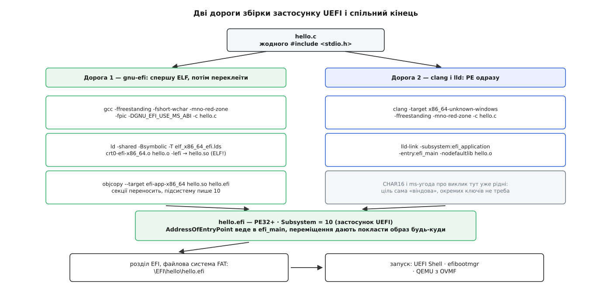

# ⚙️ Власний застосунок UEFI: hello, файл із розділу — і жодної операційної системи

Тут ми пишемо, збираємо й запускаємо програму на C, яка виводить рядок, знаходить розділ, з якого взяли її саму, відкриває там файл і показує його розмір — на машині, де ще немає ні ядра, ні бібліотек, ні бодай одного процесу. Півсторінки коду показують устрій прошивки чесніше за будь-який опис: одразу видно, звідки береться кожна можливість і чим за неї платять.

Робота ділиться навпіл дуже нерівно. Код короткий і майже нудний. Складне тут інше — змусити звичний інструментарій Linux видати файл, який прошивка взагалі погодиться завантажити.

## Чому на виході мусить бути PE32+ з підсистемою 10

Завантажувач усередині прошивки знає один формат виконуваного файлу, і це не [ELF](topic:unix-linux/elf-structure) — рідний для Linux формат із його заголовком, сегментами й адресою точки входу. Це PE: заголовок, таблиця секцій, таблиця переміщень. Тож перше, що треба від інструментарію, — не оптимізації, а правильний контейнер.

Друге — поле `Subsystem` у цьому заголовку. Число 10 означає «застосунок»: образ вантажать, викликають, а коли він повертає керування, вивантажують назад. Числа 11 і 12 позначають драйвери прошивки — ті, навпаки, лишаються в пам'яті й підвішують свої протоколи. Одне число вирішує долю образу, і проставити його треба саме під час збірки.

Третє — переміщення. Прошивка не знає наперед, де буде вільне місце: карта пам'яті складається на цій конкретній машині за мілісекунди до запуску. Отже, образ не має права покладатися на жодну адресу і мусить нести з собою перелік місць, які треба полагодити після розкладання в пам'яті.

Із цих трьох вимог і виростають дві дороги збірки.



*Ліва дорога працює на будь-якому старому інструментарії, права коротша, але потребує свіжого clang і lld.*

**Дорога gnu-efi** — це хитрість. Ми збираємо звичайний спільний об'єкт ELF (`-fpic`, `-shared`, `-Bsymbolic` і власний лінкер-скрипт), у якому вже є всі переміщення, а потім `objcopy` переносить секції в PE-контейнер і пише підсистему. Найцікавіше тут — `crt0-efi-x86_64.o`: справжня точка входу такого образу не ваш `efi_main`. Стартовий стуб спершу сам проходить по ELF-переміщеннях і лагодить їх, і лише тоді викликає вас. Тобто про переміщення домовляються не з прошивкою, а між своїми — прошивці лишається майже порожня таблиця. Якщо ваш `objcopy` не знає псевдоцілі `efi-app-x86_64`, її замінює пара `--target pei-x86-64 --subsystem 10`.

**Дорога clang** коротша, бо PE для нього — звичайна ціль. `-target x86_64-unknown-windows` каже породжувати PE, `lld-link -subsystem:efi_application` пише в заголовок десятку, `-entry:efi_main` робить вашу функцію справжньою точкою входу. Тут не потрібні ні `-fshort-wchar`, ні позначка на угоду про виклик: обидві речі для «віндової» цілі рідні.

Хай яка дорога, результат варто перевірити ще до першого завантаження — це економить години дивних симптомів. `objdump -f hello.efi` має показати формат `pei-x86-64`, а `objdump -p hello.efi` — рядок `Subsystem 00000000a`, тобто ту саму десятку, і непорожню таблицю переміщень. Найчастіша тиха поразка виглядає так: файл зібрався, формат правильний, а підсистема лишилася нульовою чи трійкою від консольної програми Windows. Прошивка на такий образ просто не реагує — жодного слова на екрані, машина йде пробувати наступний варіант завантаження, і шукати помилку ви починаєте в коді, якого вона взагалі не виконувала.

## Код

Задум простий. Замість перебирати всі файлові системи машини й гадати, яка з них наша, ми питаємо в прошивки: з якого пристрою взяли мене? Відповідь дає протокол завантаженого образу, навішений на дескриптор нашої власної програми. У ньому є поле `DeviceHandle` — дескриптор того розділу. На ньому ж висить протокол простої файлової системи, бо розділ EFI відформатований у FAT, а її прошивка вміє. Саме так шукає свої налаштування будь-який справжній завантажувач.

```c
#include <efi.h>

/* Імена протоколів — випадкові 128-бітні числа, ніхто ні з ким не домовлявся */
static EFI_GUID li_guid   = {0x5b1b31a1,0x9562,0x11d2,{0x8e,0x3f,0,0xa0,0xc9,0x69,0x72,0x3b}};
static EFI_GUID fs_guid   = {0x964e5b22,0x6459,0x11d2,{0x8e,0x39,0,0xa0,0xc9,0x69,0x72,0x3b}};
static EFI_GUID info_guid = {0x09576e92,0x6d3f,0x11d2,{0x8e,0x39,0,0xa0,0xc9,0x69,0x72,0x3b}};

static EFI_SYSTEM_TABLE *ST;

static void say(const CHAR16 *s)
{
        ST->ConOut->OutputString(ST->ConOut, (CHAR16 *)s);
}

/* printf немає й не буде: десяткове число складаємо руками, одразу в CHAR16 */
static void say_u64(UINT64 v)
{
        CHAR16 buf[21];
        int i = 20;

        buf[i] = L'\0';
        do {
                buf[--i] = (CHAR16)(L'0' + v % 10);
                v /= 10;
        } while (v);
        say(&buf[i]);
}

EFI_STATUS EFIAPI efi_main(EFI_HANDLE image, EFI_SYSTEM_TABLE *st)
{
        EFI_BOOT_SERVICES *bs = st->BootServices;
        EFI_LOADED_IMAGE_PROTOCOL *li;
        EFI_SIMPLE_FILE_SYSTEM_PROTOCOL *fs;
        EFI_FILE_PROTOCOL *root, *file;
        EFI_FILE_INFO *info;
        EFI_STATUS rc;
        UINTN sz = 0;

        ST = st;
        bs->SetWatchdogTimer(0, 0, 0, NULL);    /* перше, що робимо, — знімаємо вирок */
        say(L"привіт із прошивки\r\n");

        rc = bs->HandleProtocol(image, &li_guid, (void **)&li);
        if (rc != EFI_SUCCESS) goto out;        /* хто я і звідки мене взяли */

        rc = bs->HandleProtocol(li->DeviceHandle, &fs_guid, (void **)&fs);
        if (rc != EFI_SUCCESS) goto out;        /* той самий розділ як файлова система */

        rc = fs->OpenVolume(fs, &root);
        if (rc != EFI_SUCCESS) goto out;

        rc = root->Open(root, &file, L"\\EFI\\hello\\note.txt", EFI_FILE_MODE_READ, 0);
        if (rc != EFI_SUCCESS) goto out;

        /* два виклики: спершу питаємо розмір буфера, потім даємо буфер */
        rc = file->GetInfo(file, &info_guid, &sz, NULL);
        if (rc != EFI_BUFFER_TOO_SMALL) { rc = EFI_DEVICE_ERROR; goto out; }
        rc = bs->AllocatePool(EfiLoaderData, sz, (void **)&info);
        if (rc != EFI_SUCCESS) goto out;
        rc = file->GetInfo(file, &info_guid, &sz, info);
        if (rc != EFI_SUCCESS) goto out;

        say(L"розмір файлу: ");
        say_u64(info->FileSize);
        say(L" байтів\r\n");

        bs->FreePool(info);
        file->Close(file);
        root->Close(root);
out:
        if (rc != EFI_SUCCESS)
                say(L"не вдалося\r\n");
        bs->Stall(3 * 1000 * 1000);             /* 3 секунди, щоб устигнути прочитати */
        return rc;
}
```

> 🔧 **Навіщо це.** Подвійний виклик `GetInfo` — не примха цього протоколу, а загальна форма всього, що в UEFI повертає дані змінної довжини: спершу викликаєш із нульовим розміром і дістаєш `EFI_BUFFER_TOO_SMALL` разом із потрібним числом, тоді береш пам'ять і викликаєш удруге. Так само влаштовані отримання карти пам'яті, перелік дескрипторів і читання змінної прошивки. Причина одна: власного розподільника в програми немає, тож пам'ять під відповідь мусить брати той, хто питає, а не той, хто відповідає.

## Покласти й запустити

Файл має лягти на службовий розділ — той самий, що описаний у [таблиці розділів](topic:unix-linux/disk-partitions) окремим типом і відформатований у FAT, бо це єдина [файлова система](topic:unix-linux/filesystem-families), яку прошивка зобов'язана читати. Далі є два способи її туди спрямувати.

```bash
sudo mkdir -p /boot/efi/EFI/hello
sudo cp hello.efi /boot/efi/EFI/hello/
echo 'кілька байтів тексту' | sudo tee /boot/efi/EFI/hello/note.txt >/dev/null

# спосіб 1: іменований запис у незалежній пам'яті прошивки
sudo efibootmgr -c -d /dev/nvme0n1 -p 1 -L "hello" -l '\EFI\hello\hello.efi'

# спосіб 2: нічого не реєструвати — покласти під наперед відомим іменем,
# яке прошивка пробує сама, коли записів про цей носій немає
sudo cp hello.efi /boot/efi/EFI/BOOT/BOOTX64.EFI
```

Але правити записи завантаження задля програми, яку ви щойно змінили, — марна трата хвилин. Куди швидше крутити її у віртуальній машині з прошивкою OVMF, збіркою тієї самої EDK II. Каталог на диску подають туди як віртуальну FAT, тож перезбирання й запуск — це два рядки поспіль без жодного монтування:

```bash
mkdir -p esp/EFI/BOOT esp/EFI/hello
cp hello.efi esp/EFI/BOOT/BOOTX64.EFI          # запасний шлях: запуститься само
cp hello.efi note.txt esp/EFI/hello/

qemu-system-x86_64 -machine q35 -m 256 -net none \
  -drive if=pflash,format=raw,readonly=on,file=/usr/share/OVMF/OVMF_CODE.fd \
  -drive if=pflash,format=raw,file=OVMF_VARS.fd \
  -drive format=raw,file=fat:rw:esp
```

Якщо ж хочеться руками — у більшості збірок OVMF є оболонка UEFI: у ній розділи видно як `fs0:`, `fs1:`, і програма запускається як за старих часів, набором імені.

Налагоджувача тут не буде, і це варто прийняти одразу: покрокове виконання чужої прошивки — задача не на вечір. Замість нього працюють три речі. Вивід у консоль плюс `Stall` — щоб текст не змило наступним екраном. Ключ `-serial stdio`, бо в багатьох збірках OVMF консоль дублюється в послідовний порт, і тоді рядки програми осідають у вашому терміналі, звідки їх можна порівнювати між прогонами. І власний канал прошивки: налагоджувальні збірки OVMF пишуть свій потік у порт `0x402`, який QEMU відводить у файл ключами `-debugcon file:ovmf.log -global isa-debugcon.iobase=0x402`. Саме там видно, що прошивка думає про ваш образ, коли на екрані не з'явилося нічого.

## Де воно ламається

**Рядки.** Консоль приймає лише `CHAR16`, тобто UTF-16. У Linux `wchar_t` завширшки чотири байти, тож без `-fshort-wchar` літерал `L"привіт"` виходить удвічі ширшим за очікуваний, і прошивка читає його як один символ, за яким одразу нуль. Симптом ні на що не схожий: на екрані з'являється рівно одна літера. І `\n` тут сам по собі опускає рядок, але не повертає каретку на початок — потрібне `\r\n`, інакше текст поповзе сходами вправо.

**Сторожовий таймер.** Прошивка заводить його на п'ять хвилин, перш ніж викликати вашу точку входу, і в цьому є сенс: якщо образ завис, машина мусить сама з цього вийти. Але поки ви читаєте з повільного носія або чекаєте натиску клавіші, п'ять хвилин минають, і машина перезавантажується — без жодного повідомлення, тож причина виглядає цілковито містичною. `SetWatchdogTimer(0, 0, 0, NULL)` першим рядком знімає це питання назавжди.

**Повернення.** `return` із `efi_main` — це не «кінець функції», а вихід із програми: прошивка вивантажує образ, і вашого коду більше немає в пам'яті. Лишитися жити застосунок не може за визначенням — для цього існує підсистема драйвера з іншим числом у заголовку та іншим контрактом. А повернутий код прошивка сприймає всерйоз: невдалий статус для менеджера завантаження означає, що варіант не спрацював, і він піде пробувати наступний.

**Жодної libc.** Тут немає нічого з того, що зазвичай дає [бібліотека між програмою й ядром](topic:unix-linux/libc-as-gateway), — та й самого ядра немає. Але компілятор про це не знає до кінця: навіть із `-ffreestanding` він має право перетворити ініціалізацію структури або обнулення масиву на виклик `memset`, а копіювання — на `memcpy`. Лінкування тоді падає з незрозумілим «undefined reference to memset» у коді, де ви не писали жодного `mem`. Лікується або власними реалізаціями цих двох функцій, або тими, що дає gnu-efi.

**Червона зона.** Угода System V дозволяє функції безкарно тримати дані у 128 байтах нижче за верхівку стека — обробники сигналів там не з'являються. Тут це припущення хибне: код виконується з живими перериваннями прошивки, а їхні обробники кладуть свої кадри на той самий стек і затоптують цю ділянку. Тому `-mno-red-zone` не порада, а вимога, і порушення дає збої, які не відтворюються.

**Угода про виклик.** На x86-64 UEFI користується угодою Microsoft — перші аргументи в `rcx`, `rdx`, `r8`, `r9` і тридцять два байти запасу на стеку, — тоді як ваш компілятор під Linux [за замовчуванням складає аргументи інакше](topic:programming/calling-convention). Кожен виклик через системну таблицю перетинає цю межу. У gnu-efi її закриває `-DGNU_EFI_USE_MS_ABI`, після чого `EFIAPI` розгортається в атрибут `ms_abi`; забути цей ключ означає дістати падіння на першому ж рядку, виведеному на екран.

І остання річ, яку варто знати наперед: зібраний отак образ не запуститься на машині з увімкненою [перевіркою підпису](topic:unix-linux/secure-boot), бо підписувати його нікому. Для дослідів це вимикають у налаштуваннях прошивки або просто беруть QEMU, де перевірки немає взагалі.
