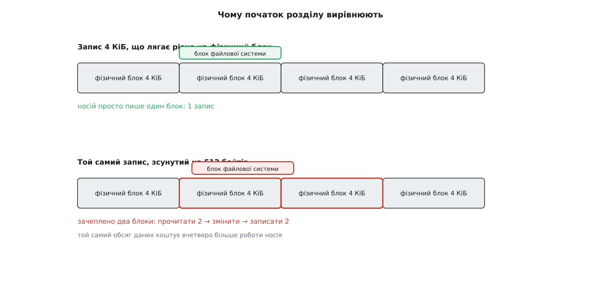
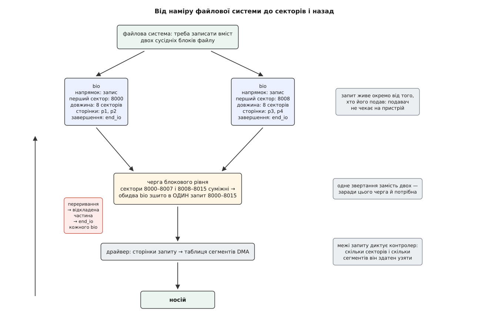
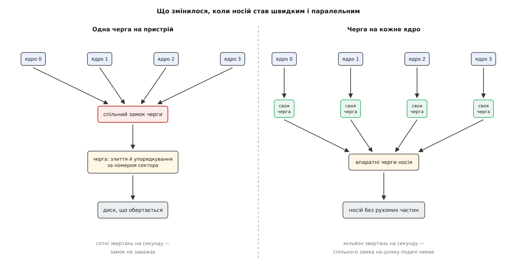

# Блоковий пристрій: сектори, блоки й черга запитів

<preknowlist>
- [Файл пристрою: символьний і блоковий](topic:unix-linux/device-file-model) — доступ до заліза йде через вузол у `/dev`, і вузли поділені на два класи за тим, як із них беруть дані.
- [Сторінковий кеш і довговічність запису](topic:unix-linux/page-cache-durability) — вміст файлів живе в пам'яті сторінками, і брудна сторінка колись мусить дійти до носія.
- [Сторінкова пам'ять і MMU](topic:unix-linux/paging-and-mmu) — пам'ять роздано сторінками, і фізична адреса сторінки не має нічого спільного з віртуальною.
- [DMA і відображення буферів](topic:unix-linux/dma-and-buffers) — пристрій переносить дані сам, звертаючись до пам'яті власними адресами, а не вказівниками програми.
- [Переривання й відкладені частини](topic:unix-linux/interrupts-bottom-halves) — залізо повідомляє про завершення перериванням, і довгу роботу з обробника виносять у відкладену частину.
- [Замки в ядрі](topic:unix-linux/kernel-locking) — спільна структура під замком стає вузьким місцем, коли до неї одночасно тягнеться багато ядер процесора.
</preknowlist>

## Байт, якого носій не вміє

Програма відкрила великий файл, відступила на мільйон байтів від початку й змінила там один байт. Здається, робота на один такт: знайти місце, покласти нове значення.

Носій так не вміє. І магнітна пластина, і мікросхема пам'яті записують дані не окремими байтами, а цілими порціями — і не з примхи виробника. Записана порція несе, крім самих даних, ще й службовий обвіс: розмітку, за якою головка впізнає початок, і код виправлення помилок. Обвіс коштує місця, і чим дрібніша порція, тим більшу частку вона віддає під нього. Головне ж — код виправлення рахують по всій порції відразу: змінився один байт — код більше не сходиться, тож його треба перерахувати, а для цього треба мати перед очима всю порцію.

Отже, «записати байт» фізично означає: прочитати порцію цілком, підмінити в ній байт, перерахувати код, записати порцію назад. Носій робить це охоче, але сказати йому «запиши байт» немає як — у його словнику такого дієслова просто немає.

Тому носій показує себе назовні тим, чим він є: **пронумерованим масивом однакових порцій**. Порцію звуть сектором (лат. *sector* — відрізок, від *secare* — різати), а її номер — це і є адреса. Весь інтерфейс складається з двох дієслів: прочитати N секторів починаючи з номера K у задані сторінки пам'яті, записати задані сторінки в N секторів починаючи з номера K.

Пристрій, який розмовляє цією мовою, у Linux звуть **блоковим**. Уся подальша конструкція ядра — від файлової системи до драйвера — виросла з того, що дрібнішого й гнучкішого звертання просто не існує.

## Два розміри, які легко переплутати

Усередині блокового рівня ядра сектор має сталий розмір — **512 байтів, завжди**. Номер сектора в запиті, довжина запиту, зсуви розділів — усе це арифметика в одиницях по 512 байтів, незалежно від того, якими порціями оперує саме залізо. Це не властивість носія, а внутрішня одиниця нумерації: одна на всіх, щоб код блокового рівня не мусив перераховувати адреси під кожен пристрій.

Сам пристрій оголошує про себе два інші числа.

**Логічний розмір блока** — найдрібніше звертання, яке пристрій погоджується прийняти. **Фізичний розмір блока** — порція, якою він насправді читає й пише всередині.

Довго ці числа збігалися: 512 і 512. Потім щільність запису зросла настільки, що службовий обвіс на кожні 512 байтів став з'їдати відчутну частку пластини, а слабкий код виправлення перестав давати раду з помилками. Виробники перейшли на фізичний сектор у 4096 байтів: один великий сектор потребує менше службового обвісу, ніж вісім дрібних, і при цьому дозволяє сильніший код виправлення. Назву «Advanced Format» галузева асоціація IDEMA затвердила в грудні 2009 року, а з січня 2011-го всі нові платформи жорстких дисків виходили вже з чотирикілобайтним фізичним сектором — це задокументована галузева домовленість, а не оцінка заднім числом.

Ламати сумісність зі старими системами ніхто не наважився, тож більшість таких дисків лишили логічний розмір рівним 512: назовні — мільярди півкілобайтових секторів, усередині — чотирикілобайтові блоки. Таке поєднання звуть 512e (від *emulation*). Ціна за сумісність відома наперед: коли надходить запис, що не лягає рівно на межу фізичного блока, пристрій мусить прочитати зачеплені блоки, підмінити в них шматок і записати назад.



*Вирівняний запис лягає в один фізичний блок; зсунутий на пів кілобайта зачіпає два — і кожен із них носій мусить спершу прочитати.*

Звідси наслідок, що коштував людям чимало нервів. Таблиця розділів у старому стилі за традицією починала перший розділ із сектора 63 — числа непарного й на 8 не кратного. Файлова система працює блоками по 4 КіБ і чесно вирівнює їх відносно початку **розділу**, — а розділ зсунутий відносно початку **диска** на 63 · 512 байтів. Кожен її блок роз'їжджався по двох фізичних:

```
початок розділу       = сектор 63          = 32256 байтів
32256 / 4096          = 7.875              — не ціле
блок ФС №0 лежить у   байтах 32256 … 36351
фізичний блок 7       = байти 28672 … 32767
фізичний блок 8       = байти 32768 … 36863
                        → зачеплено два блоки замість одного
```

Один запис перетворювався на два читання й два записи. Саме тому сучасні засоби розмітки ставлять початок першого розділу на межу 1 МіБ (сектор 2048): це число кратне будь-якому правдоподібному фізичному блокові, тож питання знімається наперед і назавжди.

> 🔧 **Навіщо це.** Перш ніж винуватити файлову систему в повільному записі, варто глянути на пару чисел: логічний і фізичний розміри блока в `/sys/block/<пристрій>/queue/`, а зсув вирівнювання — поверхом вище, у `/sys/block/<пристрій>/alignment_offset` і в такому самому файлі самого розділу. Диск, що показує логічний 512 при фізичному 4096, разом із розділом, який починається з непарного сектора, дає рівний і невблаганний програш на кожному дрібному записі — і жодне налаштування файлової системи його не викупить. Що саме показує й що дозволяє змінити цей каталог, зібрано в [переліку властивостей черги](topic:unix-linux/block-device-model/api-queue-attributes.md): розміри блоків і межі одного запиту, глибина черги, ознака обертання, стан кеша запису.

## Запит як окрема річ

Найпростіше було б, щоб файлова система просто гукала функцію драйвера й чекала на повернення. Так не роблять, і причин три.

Перша — час. Звертання до носія триває мільйони тактів процесора. Тримати весь цей час потік у ядрі заблокованим означає марнувати процесор на порожнє чекання; отже, запит мусить пережити того, хто його подав, і повідомити про завершення потім.

Друга — пам'ять. Дані переносить сам пристрій, а він не розуміє вказівників програми: він ходить у пам'ять власними адресами. Ба більше, мегабайт даних, суцільний з погляду файлу, у фізичній пам'яті розкиданий десятками окремих сторінок. Отже, запит мусить нести не «вказівник і довжину», а **перелік сторінок**.

Третя — вигода від сусідства: два запити на суміжні сектори варто виконати як один, а зробити це можна, лише коли обидва існують як окремі речі, що їх є де покласти поруч.

Тому запит у Linux — окрема структура, `bio`. У ній: напрямок (читання чи запис), номер першого сектора, довжина, вектор сегментів «сторінка + зсув + довжина» і функція, яку слід гукнути після завершення. Подавач створює `bio`, віддає його блоковому рівню й іде далі.



*Намір файлової системи розпадається на окремі запити, які блоковий рівень зшиває назад — але вже за критерієм носія, а не файлу.*

## Чому між ними стоїть черга

Тепер порахуймо, скільки коштує одне звертання до диска, що обертається.

**Умова: диск на 7200 обертів за хвилину, середній перехід головки 8 мс, швидкість передавання 150 МБ/с, запит на 4 КіБ.**

```
перехід головки              ≈ 8 мс
пів оберту (чекання сектора) = 60 / 7200 / 2 = 4.17 мс
передавання 4096 байтів      = 4096 / 150e6  = 0.027 мс
────────────────────────────────────────────────────
разом                        ≈ 12.2 мс
з них корисної передачі      ≈ 0.2 %
```

Корисна робота — дві десятих відсотка. Решта — доїхати й дочекатися. З цього одразу випливають дві речі, які варто зробити з запитом, перш ніж віддавати його носієві.

**Злити.** Якщо два запити просять суміжні сектори, з них варто зробити один: перехід і чекання оплачуються один раз замість двох.

**Упорядкувати.** Якщо запитів кілька й вони розкидані по диску, головка має обійти їх за один прохід у одному напрямку, а не метатися. Саме через цю картинку — головка йде поверхами, підбираючи попутних — упорядкувальник запитів десятиліттями звали ліфтом.

Але і злиття, і впорядкування можливі тільки тоді, коли є **з чого вибирати**: над одним-єдиним запитом нічого не зробиш. Значить, запити мусять десь накопичуватися перед видачею. Це й є черга блокового пристрою — не технічна дрібниця, а єдине місце, де вигоду від сусідства взагалі можна взяти.

Тут виникає тонкість, яка спершу здається безглуздою. Коли потік починає подавати запити, блоковий рівень **навмисно притримує** їх на коротку мить, замість негайно віддавати драйверові. Логіка проста: програма, яка читає файл, рідко зупиняється на одному блоці — наступний запит на сусідні сектори прилетить за мікросекунди, і краще заплатити цю мікросекунду затримки, ніж дванадцять мілісекунд на друге звертання. Цей навмисний затик так і зветься — заглушка (англ. *plug*): чергу «затикають» на час подання пакета запитів і «розтикають», віддаючи все разом.

Коли новий `bio` лягає в чергу, блоковий рівень шукає, чи немає там уже запиту, до якого його можна причепити: ззаду — якщо новий починається там, де попередній закінчився, спереду — якщо навпаки. Зшиті `bio` живуть далі як один **запит** (`request`) — ланцюжок із суцільним діапазоном секторів.

Скільки саме злиттів сталося насправді, ядро чесно рахує й показує — тож твердження «черга економить звертання» можна не брати на віру, а [поміряти власною програмою](topic:unix-linux/block-device-model/proj-watch-merges.md): подати той самий обсяг даних суцільно й вроздріб і подивитися на лічильники злиттів і на кількість запитів, що дійшли до носія.

## Межі одного запиту

Зшивати без кінця не вийде: приймальна спроможність контролера скінченна, і в кількох різних вимірах одразу.

Є стеля на розмір одного запиту в секторах — скільки байтів контролер погоджується перенести за одну операцію. Є стеля на кількість **сегментів** — окремих шматків пам'яті в таблиці розсіяного передавання, яку драйвер віддає пристроєві; таблиця має скінченний розмір, і кожна несуміжна в фізичній пам'яті сторінка з'їдає рядок. Є заборонені межі: дехто з контролерів не вміє одним сегментом перетнути певну адресну межу, тож сегмент, який на неї налазить, доводиться різати надвоє.

Коли чергове злиття порушило б хоч одну з цих меж, блоковий рівень злиття не робить, а завеликий `bio` розрізає на кілька запитів. Через це черга — не лише місце вигоди, а й перекладач: саме тут абстрактне «файловій системі потрібні ось ці блоки» перетворюється на послідовність операцій, які конкретне залізо здатне фізично проковтнути.

## Порядок, який доводиться повертати силоміць

Черга переставляє запити місцями — у цьому весь її сенс. Але з переставляння випливає неприємність: **послідовність записів не зберігається**. Файлова система з журналом уся тримається на протилежному: запис у журнал мусить дійти до носія **раніше** за зміну самих даних, інакше після зненацького вимкнення живлення журнал описуватиме те, чого не сталося.

Гірше того: навіть віддавши запит носієві й отримавши підтвердження, ядро ще не має гарантії. Носій має власний кеш запису й підтверджує прийом, щойно дані лягли в цей кеш, — на пластині або в мікросхемі їх може ще не бути.

Тому в блокового рівня є два позначення понад звичайні читання й запис. Одне — **скидання** (`flush`): порожній запит зі змістом «усе, що ти вже підтвердив, доведи до стійкого носія й аж тоді відзвітуй». Друге — позначка на конкретному записі, що йому заборонено спинятися в кеші пристрою. Блоковий рівень сам розкладає обидва на послідовність операцій, зрозумілу конкретному контролерові, і сам стежить, щоб ці операції не переставили місцями з чим не слід. Саме на цій парі позначень стоїть уся довговічність запису — від `fsync` у програмі до узгодженості журналу файлової системи.

## Завершення

Пристрій, упоравшись, смикає лінію переривання. Обробник переривання робить мінімум — знімає ознаку, ставить роботу в чергу, — а решту виконує відкладена частина: обходить `bio` завершеного запиту й гукає в кожного функцію завершення. Та вже розбирається, що це означало: позначити сторінку чистою, розбудити процес, що чекав на читання, поставити наступний крок конвеєра.

Блоковий рівень намагається виконати цю відкладену частину **близько до того ядра процесора, яке подавало запит**: типово — на будь-якому з ядер, що ділять із ним кеш, а за окремим налаштуванням і точно на ньому самому. Мотив дуже приземлений: структури запиту, сторінки й стан подавача ще лежать у спільному з ним кеші, і зробити роботу там — дешевше, ніж тягнути дані на інший бік процесора.

## Коли черга сама стала вузьким місцем

Уся описана конструкція народилася під диск, що обертається, і під його число: кількасот звертань на секунду. Одна черга на пристрій, один замок на цю чергу — і ніякої біди: замок тримають мікросекунди, а пристрій відповідає мілісекундами, тож черга ніколи не була найповільнішою ланкою.

Твердотільний носій зламав кожну з цих передумов одразу.

По-перше, звертань стало на три порядки більше — сотні тисяч і мільйони на секунду. Замок, що коштував нуль на тлі мілісекунди, на тлі десятка мікросекунд коштує вже помітну частку, а на тридцяти ядрах, які всі товчуться в один рядок кеша, — більшу частину.

По-друге, впорядкування за номером сектора втратило сенс. У флеш-носія немає головки, якій треба їхати; ба більше, всередині є шар перетворення адрес, і сусідні номери секторів можуть лежати в різних мікросхемах. Сортувати нема чого й нема за чим.

По-третє — і це головне — сам носій усередині паралельний і назовні показує **кілька незалежних апаратних черг**. Зводити запити з тридцяти ядер в одну програмну чергу, щоб потім розкидати їх по багатьох апаратних, — робота, яка лише псує те, що залізо вміло від початку.



*Одна черга під замком була дешевою, поки пристрій відповідав мілісекундами; на мікросекундах ціна замка стає видимою.*

Відповіддю став блоковий рівень із багатьма чергами. Подання розкладено на два яруси: **програмна черга на кожне ядро процесора** — своя, а отже без спільного замка на найгарячішому шляху; і **апаратні черги**, за якими розподілено вже готові запити й кількість яких визначає носій. Дизайн описали Матіас Бʼйорлінг, Єнс Аксбо, Девід Нелланс і Філіпп Бонне на конференції SYSTOR 2013; у ядро код увійшов у випуску 3.13 на початку 2014 року, а стару одночергову підсистему разом із її впорядкувальниками прибрали остаточно у випуску 5.0 у 2019-му.

Разом зі старою чергою змінився й статус упорядкування: воно перестало бути обов'язковим ярусом і стало підключеним вибором. Для швидкого носія звичний вибір — не впорядковувати взагалі, бо перекладати запити місцями коштує дорожче за виграш; для повільного одночергового заліза, навпаки, потрібен упорядкувальник, який ще й ділить пропускну здатність між процесами. Це окрема тема з власною логікою — [планувальники блокового введення-виведення](topic:unix-linux/io-schedulers) вирішують не «як швидше дійти до сектора», а «чиї запити пропустити першими»; чому саме так склалася їхня історія, розібрано в [нарисі про шлях від ліфта до багатьох черг](topic:unix-linux/block-device-model/hist-elevator-to-blkmq.md).

## Де модель протікає

Обіцянка блокового пристрою навмисно тонка: пронумеровані сектори й два дієслова. Але за тонкою обіцянкою поволі зникло те, на чому трималися старі висновки.

Номер сектора більше не каже, де дані лежать: шар перетворення адрес усередині твердотільного носія переставляє блоки як завгодно. Носій же, зі свого боку, не має способу дізнатися, які з блоків файлова система вже вважає порожніми, — а без цього він змушений старанно зберігати сміття. Дірку затуляє окреме, третє дієслово: [повідомлення про непотрібні блоки](topic:unix-linux/discard-and-trim). Щоб ядро не тлумачило один носій за міркою іншого, кожен блоковий пристрій несе ознаку «обертається чи ні» — і саме за нею вмикаються або мовчать усі здогади, побудовані на геометрії.

Зате тонкість обіцянки має інший бік, і він виявився важливішим за всі протікання. Виконати «два дієслова над пронумерованими секторами» може будь-хто: [розділ](topic:unix-linux/disk-partitions) — це той самий диск із доданим зсувом, [пристрій-петля](topic:unix-linux/loop-device) — звичайний файл, [device mapper](topic:unix-linux/device-mapper) — цілий драйвер, що на кожен сектор дає власну відповідь, шифруючи, дзеркалячи чи підставляючи знімок. Жоден із них не має ані пластини, ані мікросхеми пам'яті. Модель, вигадана під фізику магнітного запису, пережила саму цю фізику саме тому, що ніколи нічого про неї не обіцяла.
