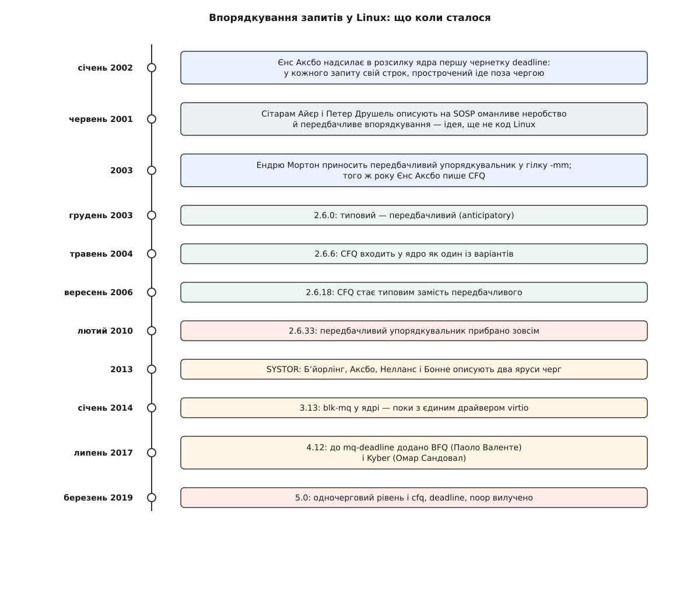

# 📜 Ліфт, який їхав сімнадцять років

Шар, що вирішував, у якому порядку запити підуть на носій, у Linux десятиліттями звали ліфтом — і за ці роки він устиг обрости трьома суперницькими впорядкувальниками, посваритися з ними, а потім розсипатися цілком, бо зникла та частина заліза, заради якої його взагалі будували. Історія варта переказу тим, що майже кожен її поворот був наслідком не моди, а зміни співвідношення двох чисел: скільки коштує звертання до носія й скільки коштує процесорний такт.

## Звідки взявся ліфт

На обертовому диску час звертання майже цілком з'їдає переїзд головки з доріжки на доріжку. Коли запитів у черзі кілька й вони розкидані по пластині, різниця між «обійти їх за один прохід у одному напрямку» і «метатися туди-сюди» — це десятки мілісекунд, тобто десятки мільйонів процесорних тактів. Вигода настільки груба, що заради неї не шкода будь-яких обчислень.

Хід, яким її беруть, у літературі звуть SCAN: головка їде в один бік, дорогою обслуговуючи все, що трапляється на шляху, доходить до краю й повертає. Це в точності поведінка ліфта в будинку, і побутова назва прижилася міцніше за наукову. Найраніший опублікований розбір цього ходу зазвичай зводять до першого тому Кнутового «Мистецтва програмування» — точка відліку тут радше умовна, ніж строго встановлена.

У Linux назва стала буквальною: підсистема жила у файлі `elevator.c`, її інтерфейс описувала структура `elevator_t`, а вибрати потрібний варіант при завантаженні можна було параметром `elevator=`. Слово протрималося в коді довше за саму ідею сортування — і трапляється там донині.

## Строк, щоб ніхто не голодував

Чисте сортування має ваду, помітну лише під навантаженням. Якщо в чергу рівним струмком надходять запити близько до поточного положення головки, то запит, що лежить на далекому краю пластини, ліфт не візьме ніколи: щоразу знайдеться ближчий. Процес, який його чекає, просто стоїть — і чим краще працює сортування, тим довше.

Ліки запропонував Єнс Аксбо (Jens Axboe): у січні 2002 року він надіслав у розсилку розробників ядра чернетку впорядкувальника **deadline**, який тримає запити відразу в двох порядках. В одному вони відсортовані за номером сектора — це звичний ліфт. У другому вишикувані за строком, до якого мусять бути обслужені; коли строк найстаршого спливає, впорядкувальник кидає сортування й бере саме його. Код доробляли й вигладжували в гілці 2.5.

Строки навмисно несиметричні: читанню дають близько 500 мілісекунд, запису — близько 5 секунд. Причина не в примсі. На читанні зазвичай хтось стоїть і чекає безпосередньо, а запис до цієї миті вже прийнято, підтверджено програмі й відкладено в пам'яті — тому затримка запису болить у рази менше. Чому запис узагалі можна відкласти й що це коштує, розібрано в [сторінковому кеші й довговічності запису](book:unix-linux/page-cache-durability): брудна сторінка живе в пам'яті, а на носій потрапляє пізніше й уже без глядача.

## Оманливе неробство

Далі виявилося, що ліфт можна обдурити, навіть не намагаючись. У 2001 році Сітарам Айєр (Sitaram Iyer) і Петер Друшель (Peter Druschel) виступили на 18-му симпозіумі SOSP із доповіддю про **оманливе неробство** (deceptive idleness). Картина така: процес читає файл послідовно й синхронно. Він подає один запит і чекає на відповідь — інших подати не може, бо ще не знає, що читатиме далі. Черга порожніє, впорядкувальник вирішує, що цей процес закінчив, і везе головку на інший край пластини до чужого запиту. За мить процес отримує відповідь і просить наступний сектор — сусідній до попереднього, — і головку доводиться везти назад.

Пропозиція авторів була наскрізь контрінтуїтивна: **не робити нічого**. Обслуживши запит, потриматися кілька мілісекунд без діла, ставлячи на те, що цей самий процес зараз попросить сусідній сектор. Простій процесора виглядає марнотратством, але переїзд головки коштує в тисячі разів більше, тож ставка окупається.

Тут варто розділити три різні речі. Ідею і її вимірювання дали Айєр із Друшелем у 2001-му. Робочий код для Linux написали інші люди: упорядкувальник **anticipatory** зробили Нік Піггін (Nick Piggin) і Ендрю Мортон (Andrew Morton), і на початку 2003 року Мортон приніс його у свою гілку `-mm`. А типовим для всіх він став із випуском 2.6.0 наприкінці 2003-го.

## Питання, якого ніхто не ставив: чиї це запити

Deadline і anticipatory сперечалися про одне й те саме — як швидше дійти до сектора. Обидва мовчали про інше: коли на диск тиснуть десять процесів, чиї запити пропустити першими. Один процес, що ллє суцільний потік читань, легко забирає весь носій, і вся система стає повільною й смиканою, хоча кожне окреме звертання цілком собі швидке.

Розмову про це почав Андреа Арканджелі (Andrea Arcangeli) у лютому 2003 року, запропонувавши стохастичну справедливу чергу для дискового введення-виведення. Того ж року Єнс Аксбо написав **CFQ** — Completely Fair Queueing, «цілком справедлива черга». Задум простий і зовсім не про сектори: у кожного процесу власна черга, і носій дістається їм по черзі скибками часу. У ядро CFQ увійшов у випуску 2.6.6 (травень 2004-го) як один із варіантів, а типовим став із 2.6.18 (вересень 2006-го), відсунувши anticipatory.

Іронія в тому, що скибку часу неможливо зробити корисною без того самого чекання: якщо процес під час своєї скибки на мить замовк, треба потерпіти, а не віддавати носій наступному, — інакше скибка нічого не гарантує. Тож CFQ увібрав головний прийом anticipatory, і той лишився без власної роботи. У випуску 2.6.33 на початку 2010-го його прибрали остаточно.

## Коли зникла головка

Твердотільний носій вибив із-під усієї споруди обидві її підпори одночасно.

Перша: сортувати нема за чим. Головки немає, переїзду немає, а всередині ще й сидить шар перетворення адрес, після якого сусідні номери секторів можуть лежати в різних мікросхемах. Обчислювати оптимальний обхід — значить платити тактами за виграш, якого не існує.

Друга, серйозніша: перевернулося співвідношення швидкостей. Уся конструкція мовчки припускала, що носій у тисячі разів повільніший за процесор, тож будь-яка спритність по дорозі безкоштовна. Обертовий диск робить сотні операцій на секунду — на такому тлі одна спільна черга з одним замком не заважає нікому. Носій на кілька сотень тисяч операцій за секунду перетворює цей замок на стіну: усі ядра процесора б'ються за одну структуру, і що більше ядер, то гірше. Чому спільна структура під замком поводиться саме так, розібрано в [замках у ядрі](book:unix-linux/kernel-locking).

## Два яруси черг

Виміряли й описали це на конференції SYSTOR 2013 Матіас Бʼйорлінг (Matias Bjørling), Єнс Аксбо, Девід Нелланс (David Nellans) і Філіпп Бонне (Philippe Bonnet) у праці «Linux block IO: introducing multi-queue SSD access on multi-core systems». Ліки — не розумніший упорядкувальник, а прибрати спільне місце: подання розкласти на програмні черги, по одній на ядро процесора, а нижче — стільки апаратних черг, скільки має сам носій.

Код увійшов у ядро у випуску 3.13 (19 січня 2014 року) — але тоді на новий інтерфейс був переведений єдиний драйвер, virtio для віртуальних машин. Переїзд решти, і насамперед величезної підсистеми SCSI, розтягнувся на роки: стаття, код і справжнє поширення тут розділені п'ятьма роками, і плутати їх не варто.

## Упорядкування як вибір

У новій конструкції впорядкувальника спершу не було взагалі — запити йшли просто вниз. Скоро з'ясувалося, що повільне одночергове залізо нікуди не поділося: картки пам'яті, звичайні диски, дешеві контролери досі потребують і сортування, і поділу між процесами. Тож у випуску 4.12 (липень 2017-го) до вже наявного `mq-deadline` додали ще двох: **BFQ** Паоло Валенте (Paolo Valente) — продовження лінії CFQ, де процесам роздають не скибки часу, а бюджети в секторах, — і **Kyber** Омара Сандовала (Omar Sandoval), навмисно крихітний, що сам підбирає глибину черги під заданий цільовий час відповіді.

Відтоді впорядкування перестало бути обов'язковим ярусом і стало властивістю конкретного пристрою: що саме увімкнено, видно й міняється у `/sys/block/<пристрій>/queue/scheduler`. Як ці правила влаштовані зсередини — окрема тема, [планувальники блокового введення-виведення](book:unix-linux/io-schedulers).

Стару одночергову підсистему вилучили у випуску 5.0 (3 березня 2019 року), і разом із нею пішли `cfq`, `deadline` та `noop` — не тому, що виявилися поганими, а тому, що були написані під інтерфейс, якого більше немає. Логіка їхня вціліла під іншими іменами.

*Сімнадцять років в одному стовпці: кожен поворот — відповідь на зміну співвідношення між ціною звертання до носія й ціною процесорного такту.*
