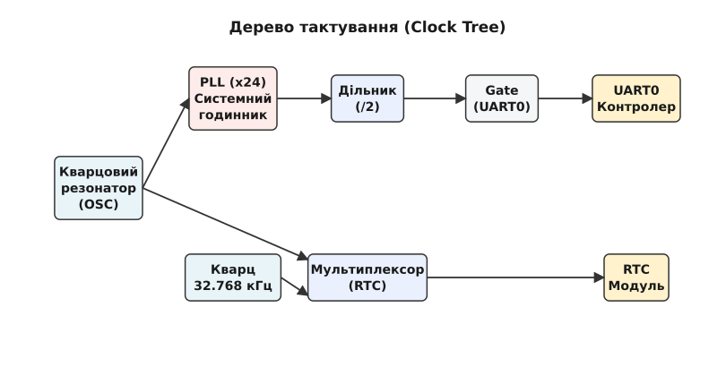

# Каркас тактування: хто роздає, ділить і вимикає такти пристроїв

<details>
<summary>Що треба знати перед читанням</summary>

*   **Апаратні основи:** Що таке тактовий сигнал, кварцовий резонатор (Crystal Oscillator) та PLL (Phase-Locked Loop).
*   **Дерево пристроїв (Device Tree):** Базове розуміння синтаксису DTS (вузли, властивості `clocks`).
*   **Основи драйверів:** Як драйвери Linux ініціалізують пристрої та керують живленням.
</details>

Уявіть сучасну систему на кристалі (SoC): вона має десятки, а то й сотні периферійних модулів (UART, SPI, USB, GPU). Кожному з них потрібен тактовий сигнал для роботи, але частоти різняться на порядки: контролер USB працює в домені 480 МГц, контролер I2C бере десятки мегагерц і вже сам виводить із них сотні кілогерц на лінії, а RTC живиться від 32.768 кГц. До того ж заради енергоефективності ми не хочемо тактувати блоки, які наразі простоюють. Звідси виникає **нетривіальна проблема**: як ефективно керувати тактуванням такої безлічі вузлів, які отримують сигнал від кількох спільних генераторів (через систему дільників і мультиплексорів), не створюючи хаосу в ядрі операційної системи? 

Для розв'язання цієї проблеми в ядрі Linux розроблено **Common Clock Framework (CCF)**.

## Модель дерева тактування у CCF

В апаратній реалізації тактові сигнали поширюються у вигляді дерева. У корені знаходяться фізичні генератори (кварцові резонатори, OSC), сигнал від яких помножується через PLL, а потім розходиться гілками через дільники (dividers) і мультиплексори (muxes) до кінцевих споживачів — периферійних контролерів (через ключі — gates).


*Спрощене дерево тактування від резонатора до периферії: одні й ті самі будівельні блоки — PLL, дільник, мультиплексор, ключ — складаються в різні гілки.*

CCF відображає цю апаратну структуру в програмну абстракцію. У ядрі кожен тактовий вузол представлений структурою `struct clk_hw` (апаратна частина) та `struct clk` (клієнтський інтерфейс). 

### Типи тактових вузлів

CCF стандартизує основні будівельні блоки дерева тактування:

1.  **Fixed Rate Clock:** Генератор фіксованої частоти (наприклад, зовнішній кварц 24 МГц). Не керується програмно.
2.  **Gate Clock:** Простий ключ, який може лише вмикати (`enable`) або вимикати (`disable`) проходження сигналу далі.
3.  **Divider Clock:** Дільник частоти. Програмно можна налаштувати коефіцієнт ділення.
4.  **Mux Clock:** Мультиплексор, який дозволяє обрати одне з кількох батьківських джерел тактування (зміна батька, reparenting).
5.  **Fixed Factor Clock:** Дільник або помножувач із фіксованим, апаратним коефіцієнтом, який не можна змінити.
6.  **PLL (Phase-Locked Loop):** Комплексний блок для помноження частоти з високою точністю. 

Часто в складних SoC один регістр може містити одразу мультиплексор, дільник і ключ для конкретного пристрою (так званий *composite clock*).

## Життєвий цикл тактування: підготовка та увімкнення

Щоб подати тактовий сигнал на пристрій, драйвер не смикає регістри напряму, а просить про це CCF. CCF розділяє процес на два етапи для безпечного використання в різних контекстах ядра:

1.  **`clk_prepare(clk)` / `clk_unprepare(clk)`:**
    Ці функції можуть **засинати (sleep)**. Вони використовуються для операцій, що потребують часу або блокувань (наприклад, увімкнення зовнішнього PLL через повільну шину I2C або очікування стабілізації PLL). Їх *не можна* викликати з обробників переривань.

2.  **`clk_enable(clk)` / `clk_disable(clk)`:**
    Ці функції **не засинають** (використовують spinlocks). Зазвичай вони лише перемикають біт Gate-вузла у відображеному в пам'ять регістрі SoC. Їх можна швидко викликати в атомарному контексті (наприклад, в обробнику переривань).

Для зручності драйвери найчастіше використовують об'єднані виклики: `clk_prepare_enable()` та `clk_disable_unprepare()`.

CCF автоматично піклується про **батьківські вузли**. Якщо ви вмикаєте UART0, CCF гарантує, що увімкнуться і його батьківський дільник, і PLL, від якого той живиться, підраховуючи посилання (reference counting). Якщо всі дочірні вузли PLL будуть вимкнені, CCF вимкне і сам PLL для економії енергії.

## Керування частотою (`clk_set_rate`)

Периферія часто вимагає конкретної частоти. Наприклад, драйвер аудіо (I2S) може вимагати частоту 11.2896 МГц. Драйвер викликає `clk_set_rate(clk, 11289600)`.

Що робить CCF:
1. CCF перевіряє поточний вузол. Якщо це дільник, він намагається підібрати коефіцієнт ділення так, щоб отримати найближчу частоту від батьківського вузла.
2. Якщо виставлено прапор `CLK_SET_RATE_PARENT`, CCF може попросити змінити частоту *батьківського* вузла (наприклад, переналаштувати PLL), щоб задовольнити запит дочірнього. Це потужний механізм, але він вимагає обережності, адже зміна частоти PLL вплине на всі інші пристрої, що від нього живляться.

Для перевірки, яку реальну частоту можна отримати (оскільки ідеальне ділення не завжди можливе), використовується `clk_round_rate()`, а дізнатися поточну — `clk_get_rate()`.

## Інтеграція з Device Tree

Сучасні системи не зашивають зв'язки пристроїв із тактовими лініями в код драйвера — вони описані в [дереві пристроїв](book:unix-linux/device-tree).

Контролер тактування (Clock Controller / CCU) описується як постачальник (provider):
```dts
ccu: clock-controller@1c20000 {
    compatible = "vendor,soc-ccu";
    reg = <0x01c20000 0x400>;
    #clock-cells = <1>; /* 1 клітинка для ідентифікатора годинника */
};
```

А споживач (наприклад, UART) просто посилається на потрібний йому тактовий сигнал за ідентифікатором (наприклад, макрос `CLK_UART0` = 42):
```dts
uart0: serial@1c28000 {
    compatible = "vendor,uart";
    ...
    clocks = <&ccu CLK_UART0>;
    clock-names = "baud";
};
```

Драйвер UART використовує функцію `devm_clk_get(dev, "baud")`, яка читає Device Tree, знаходить вказаний вузол у CCU і повертає `struct clk *` для керування. Драйверу абсолютно неважливо, чи цей сигнал приходить напряму від кварцу, чи через каскад із двох PLL та трьох дільників — CCF бере всю маршрутизацію на себе.

## Підсумок

Common Clock Framework перетворює хаос ручного запису в регістри SoC на струнке, стандартизоване дерево об'єктів. Він забезпечує правильну послідовність увімкнення апаратних блоків, підраховує посилання для енергоефективності та дозволяє зручно описувати конфігурацію тактування в Device Tree.
