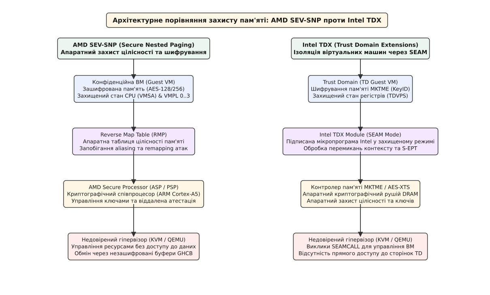
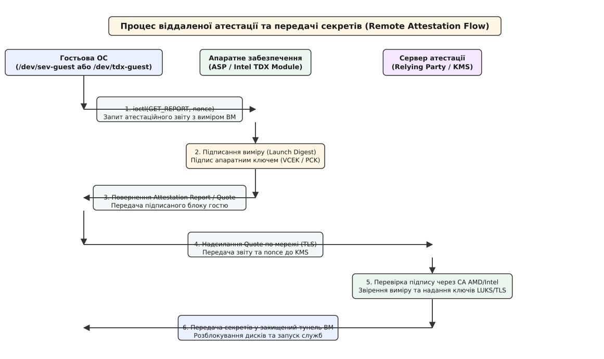

# Конфіденційні обчислення: AMD SEV-SNP та Intel TDX

<preknowlist>
- [Концепції ядра Linux](book:unix-linux/kernel-and-userspace) — системні виклики, простори виконання та межа між ядром і користувацькими програмами.
- [Прошивка UEFI](book:unix-linux/uefi-firmware) — організація завантажувального середовища, системний розділ EFI та інтерфейси прошивки.
- [Виміряне завантаження та PCR](book:unix-linux/measured-boot-pcr) — концепції криптографічного вимірювання завантаження, кореня довіри (Root of Trust) та атестації.
</preknowlist>

Коли операційна система виконується у публічній хмарі, компрометація хостового гіпервізора або зловмисні дії адміністратора центру обробки даних (ЦОД) повністю відкривають вміст оперативної пам'яті гостьової віртуальної машини (ВМ). У класичній архітектурі віртуалізації x86-64 гіпервізор (KVM, Xen, Hyper-V) працює з найвищими привілеями апаратного забезпечення (`Ring 0` у режимі VMX Root). Це дає йому безумовний і безперешкодний доступ до внутрішніх таблиць сторінок, виділених блоків DRAM та регістрів центрального процесора всіх гостьових систем. 

Традиційні засоби захисту — шифрування накопичувачів у стані спокою (LUKS) та шифрування мережевого трафіку (TLS) — залишають критичні дані беззахисними під час їх обробки в DRAM. Зловмисник із доступом до хостового ядра може зчитати приватні ключі розшифрування прямо з пам'яті гостя в момент запуску додатку. Конфіденційні обчислення (Confidential Computing) змінюють цю фундаментальну модель загроз, повністю вилучаючи гіпервізор і хостове середовище з межі довіри (Trusted Computing Base, TCB) за допомогою апаратного шифрування та криптографічної ізоляції пам'яті.

Двома провідними апаратними реалізаціями цієї технології для серверів архітектури x86-64 є AMD SEV-SNP (Secure Encrypted Virtualization - Secure Nested Paging) та Intel TDX (Trust Domain Extensions).

---

## 1. Модель загроз у хмарі та межі традиційної віртуалізації

Класична модель безпеки операційних систем спирається на ієрархічне кільцеве розмежування привілеїв: апаратура вважається повністю довіреною, операційна система хоста або гіпервізор контролює всі апаратні ресурси, а віртуальні машини ізольовані одна від одної засобами програмного керування ядра. У конфіденційних обчисленнях ця модель перевертається: **вся хостова інфраструктура вважається потенційно ворожим і недовіреним середовищем**.

Модель загроз конфіденційних обчислень охоплює чотири основні вектори атак:

1. **Повна компрометація гіпервізора**: Зловмисник, що отримав root-доступ до ядра хоста або процесів QEMU/KVM, вичитує ключі шифрування, бази даних, паролі та приватні ключі TLS безпосередньо з фізичної пам'яті гостьової ОС.
2. **Маніпуляція станом CPU**: Гіпервізор перехоплює виконання ВМ під час переривань (VM Exit) і модифікує значення векторних, системних або загальних регістрів процесора, змушуючи гостя відхилитися від нормальної логіки виконання.
3. **Атаки на цілісність таблиць сторінок**: Гіпервізор маніпулює вкладеними таблицями сторінок (Nested Page Tables, NPT в AMD або Extended Page Tables, EPT в Intel), підміняючи фізичні адреси (memory aliasing attack), щоб змусити гостьову ОС зчитати чужий код чи перезаписати критичні структури даних.
4. **Фізичні атаки на шину DRAM**: Зчитування вмісту модулів оперативної пам'яті DIMM за допомогою апаратних міжплатних аналізаторів шини або здійснення атак класу «холодне завантаження» (cold boot attack) із заморожуванням чіпів RAM.

```
Традиційна віртуалізація:               Конфіденційні обчислення (TEE):

+-----------------------+               +-----------------------+
|  Guest VM 1  |  VM 2  |               | Confidential Guest VM |
+-----------------------+               +-----------------------+
|  Untrusted Hypervisor | (Повний доступ)|   Апаратний рушій    | (Криптографічна
|     (KVM / QEMU)      |==============>|   шифрування DRAM     |  ізоляція)
+-----------------------+               +-----------------------+
|  Physical Hardware    |               |  Untrusted Host/KVM   | (Доступ заблоковано)
+-----------------------+               +-----------------------+
```

Для нейтралізації цих загроз апаратура процесора бере на себе обов'язок криптографічної ізоляції. Гостьова ВМ стає ізольованим «коконом» (Trust Domain або Encrypted VM), до пам'яті та регістрів якого гіпервізор не має доступу навіть за наявності найвищих привілеїв хоста.

---

## 2. Апаратний фундамент прозорого шифрування DRAM

Основою захисту даних у процесі обробки є прозоре inline-шифрування оперативної пам'яті. Центральний процесор інтегрує криптографічний співпроцесор безпосередньо в контролер пам'яті (Memory Controller). Кожна кеш-лінія (64 байти), що витісняється з L3-кешу у фізичну DRAM, шифрується алгоритмом AES-XTS. Під час зчитування вона розшифровується і повертається у внутрішній кеш процесора.

Для детального ознайомлення з апаратним устроєм контролерів пам'яті, алгоритмами адресації та роботою AES-XTS зверніться до вставки про [апаратні рушії шифрування](book:unix-linux/confidential-computing-sev-tdx/comp-memory-encryption-engines.md).

Зв'язок між фізичною адресою сторінки та відповідним ключем шифрування визначається старшими бітами фізичної адреси:
- **AMD EPYC**: Використовує спеціальний біт шифрування **C-bit** (Encrypted Bit, зазвичай 47-й або 51-й біт фізичної адреси). Якщо `C-bit = 1`, контролер пам'яті застосовує унікальний ключ даної ВМ. Якщо `C-bit = 0`, дані вважаються незашифрованими (для DMA-обміну з пристроями).
- **Intel Xeon**: Використовує технологію MKTME (Multi-Key Total Memory Encryption), де під **KeyID** виділяється від 6 до 9 старших бітів фізичної адреси, що дозволяє апаратурі одночасно підтримувати сотні унікальних ключів шифрування для різних Trust Domains.

Історичний шлях розвитку TEE — від статичних крипточіпів TPM і прикладних анклавів Intel SGX до повноцінної ізоляції віртуальних машин — розкрито у вставці про [історію розвитку TEE](book:unix-linux/confidential-computing-sev-tdx/hist-confidential-computing.md).

---

## 3. Апаратна архітектура AMD SEV-SNP

Технологія AMD SEV пройшла чотири послідовні покоління еволюції: 
- **SME (Secure Memory Encryption)**: Шифрування всієї DRAM єдиним системним ключем для захисту від фізичного викрадення модулів пам'яті.
- **SEV (Secure Encrypted Virtualization)**: Виділення унікальних ключів шифрування пам'яті для кожної ВМ за її ідентифікатором простору адрес (ASID).
- **SEV-ES (Encrypted State)**: Шифрування та апаратний захист стану регістрів CPU при виході в гіпервізор (VM Exit) через структуру VMSA (Virtual Machine Save Area).
- **SEV-SNP (Secure Nested Paging)**: Додавання апаратного захисту цілісності пам'яті та запобігання атакам підміни сторінок.

Головною інновацією SEV-SNP є гарантія **цілісності пам'яті** (memory integrity protection), яка унеможливлює атаки зловмисного гіпервізора на підміну сторінок.

### Таблиця зворотного відображення RMP (Reverse Map Table)

У звичайній віртуалізації гіпервізор контролює вкладені таблиці сторінок (NPT), перетворюючи гостьові фізичні адреси (GPA) на хостові фізичні адреси (HPA). Гіпервізор міг змінити NPT так, щоб дві різні GPA гостя вказували на одну й ту саму HPA (aliasing), змушуючи ВМ перезаписувати власні структури даних або виконувати чужий код.

SEV-SNP вводить апаратну структуру даних — **Reverse Map Table (RMP)**. RMP живе у виділеній захищеній області DRAM хоста і перевіряється мікрокодом CPU при кожному зверненні до пам'яті. Для кожної фізичної сторінки 4 КБ в RMP зберігаються такі метадані:

| Поле RMP | Опис та семантика |
| :--- | :--- |
| `GPA` | Гостьова фізична адреса, якій однозначно належить ця сторінка |
| `ASID` | Ідентифікатор віртуальної машини-власника |
| `VMPL` | Рівень привілеїв усередині ВМ (Virtual Machine Privilege Level 0..3) |
| `Validated` | Прапор апаратної перевірки (встановлюється інструкцією `PVALIDATE`) |
| `Page Size` | Розмір сторінки (4 КБ або 2 МБ) |

Якщо гіпервізор намагається відобразити фізичну сторінку HPA, яка вже належить ВМ з ASID=5, на іншу ВМ або змінити її GPA в NPT, апаратура відмовляє в доступі: перевірка RMP не проходить, і про це повідомляється — гіпервізорові як вкладена помилка сторінки (nested page fault) з ознакою порушення RMP, гостеві — як виключення `#VC`.

```
Схема перевірки цілісності через RMP в AMD SEV-SNP:

Guest GPA ---> [ Nested Page Table (NPT) ] ---> HPA (Запит до DRAM)
                      (Гіпервізор)                    |
                                                      v
                                        [ Перевірка RMP апаратурою ]
                                        * Перевірка: Owner(HPA) == ASID?
                                        * Перевірка: GPA(NPT) == RMP.GPA?
                                        * Перевірка: Validated == 1?
                                                      |
                                       +--------------+--------------+
                                       |                             |
                                  (Збігається)                (Розбіжність)
                                       v                             v
                               Доступ дозволено          Порушення RMP: доступ відмовлено
```

### Інструкції `PVALIDATE`, `RMPUPDATE` та `RMPADJUST`

Для управління станом сторінок в RMP апаратура AMD SEV-SNP надає набір спеціалізованих інструкцій:
- **`RMPUPDATE`**: Виконується гіпервізором хоста для передачі фізичної сторінки HPA у володіння конкретної ВМ з вказанням її ASID та GPA.
- **`PVALIDATE`**: Виконується гостьовою операційною системою усередині ВМ. Вона підтверджує, що мапування сторінки в таблиці сторінок гостя є дійсним. Якщо гіпервізор спробує підмінити розмір сторінки (наприклад, видати 2 МБ сторінку замість 4 КБ), виклик `PVALIDATE` поверне код помилки `FAIL_SIZEMISMATCH`.
- **`RMPADJUST`**: Виконується ядром ВМ для зміни рівнів привілеїв VMPL або дозволів читання/запису/виконання для конкретної сторінки.

### Рівні привілеїв VMPL та модуль SVSM

SEV-SNP вводить чотири рівні привілеїв усередині гостьової ВМ: **VMPL0, VMPL1, VMPL2, VMPL3**. 
- `VMPL0` має найвищі привілеї; у ньому працює захищений модуль SVSM — Secure Virtual Machine Service Module.
- `VMPL1` — рівень, на якому виконується решта гостя: і ядро Linux, і його користувацькі програми (їх між собою розділяють звичні кільця `Ring 0`/`Ring 3`, а не VMPL).
- `VMPL2` та `VMPL3` лишаються вільними для додаткової ізоляції всередині гостя, якщо вона комусь потрібна.

Без SVSM гість працює цілком на `VMPL0`. VMPL — не заміна кільцям процесора, а окрема вісь дозволів на сторінки пам'яті.

Модуль SVSM у VMPL0 дозволяє ізолювати реалізацію віртуального TPM (vTPM) та процедури атестації від основного гостьового ядра Linux. Навіть якщо зловмисник зможе скомпрометувати гостьове ядро Linux у VMPL1, він не матиме доступу до секретів і ключів vTPM, що живуть у VMPL0.

---

## 4. Апаратна архітектура Intel TDX

Підхід Intel TDX (Trust Domain Extensions) будується довкола поняття **Trust Domain (TD)** — конфіденційної віртуальної машини, ізольованої від гіпервізора KVM та інших ВМ.

### Модуль Intel TDX (SEAM Mode)

На відміну від AMD, де значна частина логіки реалізована в мікропрограмі криптографічного співпроцесора ASP, Intel реалізувала управління TDX через спеціальний модуль — **Intel TDX Module**.

Цей модуль є цифрово підписаною мікропрограмою Intel, яка завантажується в захищену область оперативної пам'яті (SEAMRR — Secure Arbitration Mode Range Register) при старті сервера. Модуль виконується у спеціальному режимі CPU — **SEAM (Secure Arbitration Mode)**, який є розширенням VMX:

- Гіпервізор викликає функції TDX Module за допомогою нової інструкції **`SEAMCALL`**.
- Гостьова ВМ (TD) викликає функції модуля за допомогою інструкції **`TDCALL`**.

```
Розподіл режимів виконання в Intel TDX:

+-------------------------------------------------------------------+
|                     Non-Root Mode (Гостьові ВМ)                   |
|  +-----------------------------+  +----------------------------+  |
|  | Standard Guest VM (KVM)     |  | Trust Domain (TD Guest)    |  |
|  +-----------------------------+  +----------------------------+  |
+-------------------------------------------------------------------+
|                     Root Mode (Управління хостом)                 |
|  +-----------------------------+  +----------------------------+  |
|  | Host Kernel / KVM Hypervisor|  | Intel TDX Module (SEAM)    |  |
|  | (Виклики SEAMCALL)          |  | (Ізольована мікропрограма) |  |
|  +-----------------------------+  +----------------------------+  |
+-------------------------------------------------------------------+
```

TDX Module повністю контролює створення, запуск, перемикання контексту та знищення Trust Domains. Життєвий цикл TD включає виконання послідовності команд: `TDH.MNG.INIT` (ініціалізація структури управління TD), `TDH.MEM.PAGE.ADD` (додавання початкових сторінок пам'яті) та `TDH.MR.FINALIZE` (фіксація початкового виміру MRTD). Сам гіпервізор KVM втрачає можливість прямого читання пам'яті TD і не може модифікувати її регістри.

### Захищений стан регістрів та Secure EPT (S-EPT)

Стан процесорних регістрів TD при переході в гіпервізор (VM Exit) автоматично зберігається у захищену структуру **TDVPS (TD Virtual Processor State)**, а самі регістри зануляються модулем TDX. 

Для захисту цілісності таблиць сторінок TDX Module використовує **Secure EPT (S-EPT)**. Таблиці S-EPT зберігаються у пам'яті, зашифрованій ключем модуля TDX, і гіпервізор не може змінювати їх довільно. Будь-яке мапування нової сторінки вимагає виклику `SEAMCALL` та виконання інструкції прийняття сторінки гостем — `TDG.MEM.PAGE.ACCEPT`.


*Архітектурні рубежі захисту пам'яті: ізоляція гостьових віртуальних машин через апаратні таблиці цілісності (RMP) в AMD SEV-SNP та підписаний модуль SEAM в Intel TDX.*

---

## 5. Віддалена атестація та ланцюг довіри

Шифрування пам'яті гарантує ізоляцію, але не доводить володарю даних, що ВМ запущена на справжньому обладнанні з увімкненим SEV-SNP/TDX і що її початковий код не було модифіковано зловмисним гіпервізором. Для цього застосовується **віддалена атестація (Remote Attestation)**.

### Процес криптографічного вимірювання (Launch Digest)

Під час завантаження ВМ прошивка апаратного кореня довіри — співпроцесор ASP в AMD, модуль TDX в Intel — обчислює підсумковий криптографічний хеш SHA-384 початкового стану системи:
- Початкового коду прошивки OVMF/UEFI.
- Початкового образу ядра та initramfs (якщо вони завантажуються прямо прошивкою).
- Конфігураційних параметрів та кількості vCPU.

Цей хеш називається **Launch Measurement** (у SEV-SNP) або **MRTD (Measurement of TD)** (у TDX). Зміна хостом бодай одного байта у прошивці ВМ призведе до відмінності у хеші виміру.

### Формування та перевірка Attestation Report


*Схема обміну даними між гостьовою ОС, апаратними модулями процесора та зовнішнім сервером атестації для безпечної ін'єкції ключів.*

Процес підтвердження довіри відбувається у шість кроків:

1. **Генерація запиту**: Гостьова ОС під час старту генерує криптографічний `nonce` (64 байти випадкових даних або хеш ефемерного ключа TLS) і звертається до ядра Linux.
2. **Апаратний підпис**: Ядро передає запит до апаратури. В AMD SEV-SNP співпроцесор ASP підписує вимір і nonce унікальним апаратним ключем **VCEK (Versioned Chip Endorsement Key)**, похідним від секрету саме цього кристала й поточного рівня TCB. В Intel TDX модуль спершу видає локальний `TDREPORT` із симетричним підписом HMAC, а службовий SGX-анклав котирування перетворює його на `TD Quote`, підписаний ключем атестації, ланцюг сертифікатів якого веде до **PCK (Provisioning Certification Key)**.
3. **Отримання звіту**: Гостьова ОС отримує підписаний бінарний блок (Attestation Report / TD Quote). Докладну розкладку полів та ioctl-виклики описано у вставці про [інтерфейси віддаленої атестації](book:unix-linux/confidential-computing-sev-tdx/api-guest-attestation.md).
4. **Надсилання до KMS**: Звіт надсилається зовнішньому сервісу атестації (Relying Party / Key Management Service).
5. **Перевірка сертифікатів**: Сервер атестації перевіряє цифровий підпис звіту через кореневі сертифікати AMD Root CA або Intel Root CA, переконується у справжності процесора і зіставляє отриманий Launch Measurement з еталонним хешем.
6. **Ін'єкція секретів (Secret Injection)**: Якщо перевірка успішна, KMS відкриває захищений тунель (TLS) з ВМ і передає ключі розшифрування дисків LUKS або секрети додатку.

Практичну реалізацію програми на C та C++ для зчитування звіту з `/dev/sev-guest` та `/dev/tdx-guest` наведено у вставці про [отримання атестаційного звіту](book:unix-linux/confidential-computing-sev-tdx/proj-guest-report-fetch.md).

---

## 6. Захист від переривань та обробка апаратних виключень

Одним із найскладніших векторів атак на конфіденційні ВМ є асиметрична маніпуляція перериваннями (Interrupt Injection & IPI Attacks). У традиційній віртуалізації гіпервізор може довільно надсилати апаратні переривання (IRQ) та міжпроцесорні сигнали (IPI) у будь-який момент виконання гостя.

### Захист переривань у SEV-SNP (Secure AVIC)

У технології AMD SEV-SNP для протидії атакам на переривання застосовується механізм **Secure AVIC (Advanced Virtual Interrupt Controller)**:
- Гіпервізор більше не має прямого доступу до віртуальних регістрів APIC гостя.
- Процесор перевіряє, чи має гіпервізор право ін'єктувати конкретний вектор переривання.
- Якщо гіпервізор намагається спровокувати шторм переривань для аналізу побічних каналів кешу (Side-Channel Timing Attack), апаратура SEV-SNP блокує несанкціоновані вектори та генерує безпечне виключення у гостьовому ядрі.

### Проксі-обробка переривань в Intel TDX

В Intel TDX зовнішнє переривання не потрапляє в Trust Domain напряму: воно спричиняє вихід із домену, і керування проходить через модуль TDX у режимі SEAM, який зберігає та затирає стан TD, перш ніж віддати процесор хостовому KVM. Назад вектор потрапляє лише на вході в домен — хост виконує `SEAMCALL[TDH.VP.ENTER]`, а модуль TDX подає у віртуальний APIC домену тільки те, що дозволяє конфігурація TD.

---

## 7. Інтеграція з ядром Linux та KVM

Підтримка SEV-SNP та TDX вимагала фундаментальних змін у будові ядра Linux — як з боку хостового KVM, так і з боку гостьової ОС.

### Зміни в хостовому ядрі: Підсистема `guest_memfd`

Історично KVM керував пам'яттю ВМ через звичайний адресний простір процесів користувача (через виклики `mmap()` у QEMU). Це означало, що ядро хоста завжди мало анонімні сторінки (`struct page`), які можна було зчитати або витіснити у swap.

Для конфіденційних ВМ у Linux 6.8 було представлено нову підсистему пам'яті ядра — **`guest_memfd` (Guest Memory File Descriptor)**. `guest_memfd` створює приватні анонімні файлові дескриптори, які підключені безпосередньо до апаратних механізмів RMP/S-EPT:
- Сторінки, виділені через `guest_memfd`, не мають мапування у віртуальний адресний простір хостового ядра або процесів QEMU.
- Ядро хоста позбавлене прямих вказівників на ці сторінки, що унеможливлює випадковий або навмисний витік даних через системні виклики `read()`, `write()` чи `/proc/self/mem`.

:::tabs
```c
/* Приклад створення приватного буфера пам'яті ВМ через KVM ioctl у Linux 6.8+ */
struct kvm_create_guest_memfd guest_memfd_args = {
    .size = 8 * 1024 * 1024 * 1024ULL, /* 8 ГБ */
    .flags = 0,
};
int guest_memfd = ioctl(kvm_vm_fd, KVM_CREATE_GUEST_MEMFD, &guest_memfd_args);
```
```cpp
/* Реалізація виклику KVM_CREATE_GUEST_MEMFD у сучасному C++23/RAII wrapper */
namespace kvm {

struct GuestMemfdConfig {
    uint64_t size_bytes{8 * 1024 * 1024 * 1024ULL};
    uint64_t flags{0};
};

[[nodiscard]] auto create_private_guest_memfd(int vm_fd, const GuestMemfdConfig& cfg) 
    -> std::expected<int, std::system_error> 
{
    kvm_create_guest_memfd args{.size = cfg.size_bytes, .flags = cfg.flags};
    int memfd = ::ioctl(vm_fd, KVM_CREATE_GUEST_MEMFD, &args);
    if (memfd < 0) {
        return std::unexpected(std::system_error(errno, std::generic_category(), "KVM_CREATE_GUEST_MEMFD failed"));
    }
    return memfd;
}

} // namespace kvm
```
:::

### Зміни в гостьовому ядрі: Розділення Private та Shared пам'яті

Гостьове ядро Linux усвідомлює, що воно працює в режимі шифрування. Увесь адресний простір гостя за замовчуванням є **приватним (Private / Encrypted)**.

Проте для взаємодії з апаратурою та гіпервізором (наприклад, для передачі пакетів через мережеві драйвери `virtio-net` або блочний пристрій `virtio-blk`) деякі буфери повинні бути **спільними (Shared / Unencrypted)**:
1. Гостьове ядро скидає біт `C-bit` (або виключає біти `KeyID`) у своїх таблицях сторінок для обраної ділянки пам'яті.
2. Гостьове ядро повідомляє гіпервізор про зміну статусу сторінки через виклик GHCB (в AMD) або `TDCALL[TDG.MEM.PAGE.ATTR.SET]` (в Intel).
3. Операції прямого доступу до пам'яті (DMA) виконуються через спеціальний буфер під назвою **SWIOTLB (Software Input Output Translation Lookaside Buffer)**. Дані копіюються з приватної пам'яті ядра в незашифрований буфер SWIOTLB, звідки їх вичитує гіпервізор.

---

## 8. Екосистема Cloud-Native та Конфіденційні Контейнери (CoCo)

Розвиток конфіденційних обчислень вийшов далеко за межі простих віртуальних машин. У сучасній хмарній екосистемі під егідою Cloud Native Computing Foundation (CNCF) активно розвивається проєкт **Confidential Containers (CoCo)**.

Проєкт CoCo інтегрує технології AMD SEV-SNP та Intel TDX із середовищем оркестрації Kubernetes:
- Кожен Kubernetes Pod запускається усередині окремої конфіденційної ВМ за допомогою легковажного гіпервізора Kata Containers.
- Зображення контейнерів (Container Images) шифруються розробником і розпаковуються безпосередньо всередині зашифрованої пам'яті ВМ після проходження віддаленої атестації.
- Вузли Kubernetes Worker та оператори платформи позбавлені можливості оглядати вміст файлових систем та змінних оточення контейнерів.

---

## 9. Ціна безпеки та накладні витрати

Конфіденційні обчислення забезпечують криптографічний захист, проте вимагають певних ресурсних компромісів.

### Накладні витрати на продуктивність

1. **Затримка DRAM (Memory Latency)**: Контролер пам'яті витрачає додаткові такти процесора на шифрування та розшифрування сторінок за допомогою AES-XTS. Для обчислювальних задач (CPU-bound) зниження продуктивності становить не більше **1–3%**.
2. **Виходи з ВМ (VM Exit Overhead)**: Збереження та відновлення захищеного стану регістрів (VMSA / TDVPS), а також виконання апаратних перевірок RMP при кожному VM Exit створюють додаткові затримки. Для задач із високою інтенсивністю вводу-виводу (I/O-bound, наприклад баз даних із тисячами мережевих пакетів) зниження швидкості може досягати **5–12%**.
3. **Копіювання SWIOTLB**: Необхідність копіювання даних через bounce-буфери SWIOTLB додатково завантажує шину пам'яті та CPU.

### Витрати оперативної пам'яті хоста

Таблиця цілісності RMP в AMD SEV-SNP потребує виділення неперервної ділянки системної пам'яті хоста при завантаженні. На кожну фізичну сторінку 4 КБ припадає запис на 16 байтів, тобто RMP забирає приблизно **1/256 від загального обсягу DRAM хоста** (для сервера з 512 ГБ оперативної пам'яті — близько 2 ГБ фізичної DRAM).

---

## 10. Практичний запуск конфіденційної ВМ у QEMU/KVM

Створення віртуальної машини з підтримкою SEV-SNP у сучасних дистрибутивах Linux виконується шляхом передачі спеціалізованих об'єктів командного рядка QEMU:

```bash
qemu-system-x86_64 \
    -enable-kvm \
    -cpu EPYC-v4 \
    -machine q35,confidential-guest-support=sev0,memory-backend=ram1 \
    -object memory-backend-memfd,id=ram1,size=8G \
    -object sev-snp-guest,id=sev0,cbitpos=51,reduced-phys-bits=1 \
    -drive if=pflash,format=raw,readonly=on,file=/usr/share/OVMF/OVMF_CODE.fd \
    -drive if=pflash,format=raw,file=/tmp/OVMF_VARS.fd \
    -netdev user,id=net0 -device virtio-net-pci,netdev=net0
```

У цьому прикладі параметр `confidential-guest-support=sev0` активує ізоляцію SEV-SNP — і саме він змушує QEMU просити в KVM приватну пам'ять через `guest_memfd`; значення `cbitpos` мусить збігатися з номером C-bit конкретного процесора, а прошивка OVMF забезпечує вимірювання початкового стану завантаження ВМ.

AMD SEV-SNP та Intel TDX змінили фундамент хмарної безпеки: вони перетворили фізичне залізо ЦОД на криптографічний бар'єр, який гарантує недоторканність даних навіть у разі повного контролю зловмисника над хостовою операційною системою.
