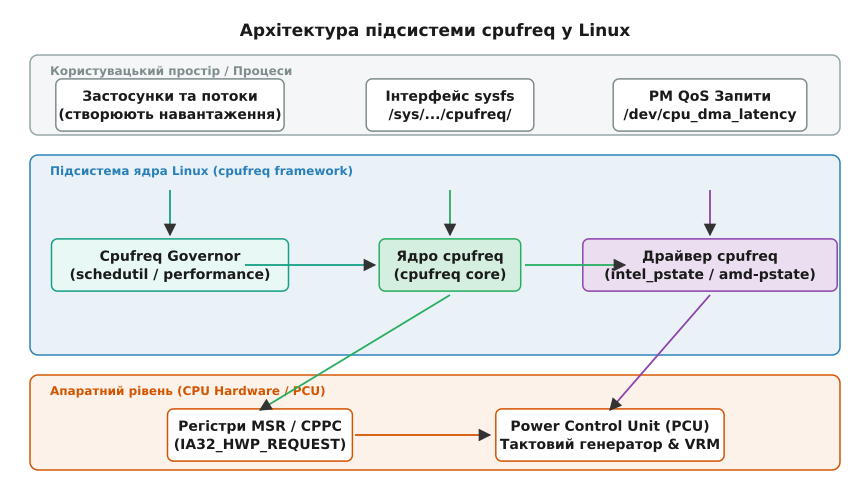
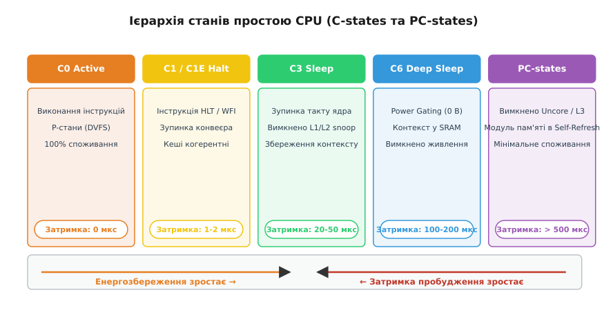
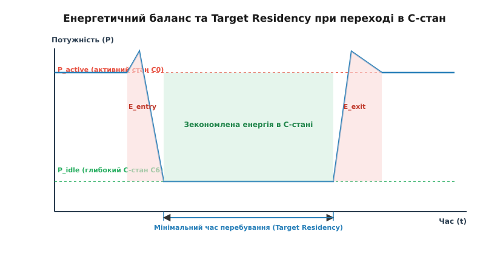
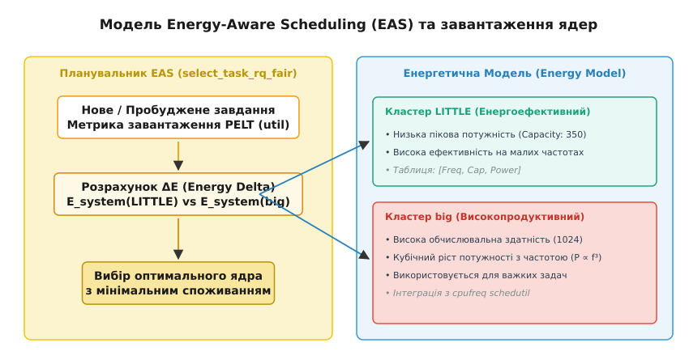

# Управління частотою та станами CPU (cpufreq, cpuidle)

<preknowlist>
- [Модель планувальника завдань](book:unix-linux/scheduler-model) — концепція завантаженості задач (PELT), черги виконання та вибір ядра select_task_rq_fair.
- [Таблиці ACPI та AML](book:unix-linux/acpi-tables-and-namespace) — специфікація станів живлення P-states, C-states та CPPC у таблицях FADT/DSDT/SSDT.
- [Обробка переривань та нижні половини](book:unix-linux/interrupts-bottom-halves) — як обробка переривань розбуджує процесор із режимів простою (CONFIG_NO_HZ).
</preknowlist>

Коли сучасний багатоядерний процесор працює на піковому завантаженні, його електрична потужність може перевищувати 250 Вт, вимагаючи інтенсивного відведення тепла. Проте у серверних стійках під час низького навантаження або у мобільних пристроях така дисипація енергії призведе до миттєвого розряду акумулятора та теплового пошкодження компонентів. Операційна система не може сприймати процесор як простий бінарний перемикач, що або виконує обчислення на максимальній частоті, або крутиться у нескінченному холостому циклі. Для забезпечення оптимального балансу між швидкодією та енергоспоживанням ядро Linux реалізує багаторівневу підсистему управління живленням. Вона пов'язує метрики завантаженості з планувальника завдань із низькорівневими апаратними регістрами керування частотою, напругою та глибокими станами сну.

## 1. Фізична та апаратна основа управління живленням (DVFS і C-states)

В основі цифрової логіки сучасних процесорів лежать КМОН-транзистори (CMOS). Електричне споживання КМОН-структури складається з двох частин: статичної потужності витоку `P_stat = V_dd · I_leak` та динамічної потужності `P_dyn = α · C_eq · V_dd² · f`. Динамічне споживання виникає під час перезарядки паразитних ємностей вентилів `C_eq` із тактовою частотою `f` при напрузі живлення `V_dd`.

Зв'язок між тактовою частотою та напругою є фундаментальним: щоб транзистори встигали перемикатися за коротший період тактового сигналу `t_clk = 1/f`, необхідно підвищувати напругу живлення `V_dd`. Оскільки динамічна потужність залежить від напруги у квадраті (`V_dd²`), лінійне зниження частоти дозволяє пропорційно знизити напругу, що дає кубічне зменшення енергоспоживання (`P_dyn ∝ f³`). Цей принцип лежить в основі технології **Dynamic Voltage and Frequency Scaling (DVFS)**.

Історія виникнення технологій DVFS, стандартизації ACPI та переходу від BIOS-контролю до автономних апаратних регуляторів висвітлена у [історичному екскурсі](book:unix-linux/cpufreq-and-cpuidle/hist-dvfs-and-acpi-origin.md).

З точки зору апаратури та специфікації ACPI, поведінка процесорного ядра поділяється на два класи станів:
1. **P-стани (Performance States)**: Стани продуктивності, які застосовуються під час активної роботи ядра (стан `C0`). Стан `P0` відповідає максимальній частоті та напрузі, а `P1`, `P2` ... `Pn` — станам зі зниженою частотою для збереження енергії.
2. **C-стани (Power / Idle States)**: Стани простою, які застосовуються тоді, коли на даному ядрі немає жодної задачі для виконання. У стані `C1` зупиняється подача тактового сигналу на конвеєр інструкцій, а у станах `C3`/`C6` повністю відключається напруга живлення ядра (Power Gating).

Детальний математичний аналіз залежності напруги від частоти, показника EDP та розрахунку енергетичного балансу наведено у [математичному розборі](book:unix-linux/cpufreq-and-cpuidle/math-dvfs-power-and-residency.md).

Загальна архітектура підсистеми cpufreq відображає взаємодію між користувацьким простором, планувальником, регуляторами та апаратними регістрами:


*Взаємодія між шарами користувацького простору, підсистемою cpufreq у ядрі Linux та апаратними MSR-регістрами процесора.*

## 2. Підсистема cpufreq: Динамічне управління частотою та напругою (DVFS)

Підсистема **cpufreq** відповідає за вибір та встановлення P-станів (частоти та напруги) під час виконання коду в активному стані `C0`. Вона складається з трьох програмних шарів ядра: ядра підсистеми (`cpufreq core`), апаратного драйвера (`cpufreq driver`) та алгоритму прийняття рішень (`cpufreq governor`).

Структура `struct cpufreq_policy` у вихідному коді ядра (`include/linux/cpufreq.h`) об'єднує маску логічних ядер, які ділять спільне тактове джерело (домен частот), поточні межі `min`/`max`, вказівник на активний регулятор та апаратний драйвер.

:::tabs
```c
struct cpufreq_policy {
    cpumask_var_t           cpus;          /* Ядра домену частоти */
    unsigned int            min;           /* Мінімальна частота (кГц) */
    unsigned int            max;           /* Максимальна частота (кГц) */
    unsigned int            cur;           /* Поточна частота ядра */
    struct cpufreq_governor *governor;     /* Активний регулятор */
    struct cpufreq_driver   *driver;       /* Апаратний драйвер */
    void                    *driver_data;
};
```
```cpp
struct cpufreq_policy {
    cpumask_var_t           cpus;          // Ядра домену частоти
    unsigned int            min;           // Мінімальна частота (кГц)
    unsigned int            max;           // Максимальна частота (кГц)
    unsigned int            cur;           // Поточна частота ядра
    struct cpufreq_governor *governor;     // Активний регулятор
    struct cpufreq_driver   *driver;       // Апаратний драйвер
    void                    *driver_data;
};
```
:::

### 2.1. Апаратні драйвери: acpi-cpufreq, intel_pstate та amd-pstate

Драйвер cpufreq є проміжним шаром між ядром Linux та апаратурою. Залежно від архітектури системи використовуються наступні драйвери:

* **`acpi-cpufreq`**: Традиційний драйвер, який зчитує доступні P-стани з таблиць ACPI `_PSS` у BIOS та записує вибраний індекс P-стану в регістр `IA32_PERF_CTL` (0x199); драйвер існує лише для x86.
* **`intel_pstate`**: Спеціалізований драйвер для сучасних процесорів Intel (починаючи з архітектури Sandy Bridge / Skylake). Працює у двох режимах:
  * *Active mode (HWP)*: Апаратний режим (Intel Speed Shift). Драйвер передає процесору лише підказки EPP (Energy Performance Preference) через регістр `IA32_HWP_REQUEST` (0x774), а внутрішній мікроконтролер PCU самостійно перемикає частоту кожну мілісекунду.
  * *Passive mode*: Драйвер відключає апаратний регулятор PCU і надає традиційний інтерфейс P-станів для регулятора `schedutil`.
* **`amd-pstate`**: Сучасний драйвер для процесорів AMD Zen (працює через інтерфейс ACPI CPPC - Collaborative Processor Performance Control). Він забезпечує точне управління частотою з дрібним кроком замість грубих фіксованих таблиць.

Порівняльна характеристика протоколів управління P-станами:

| Протокол / Драйвер | Спосіб управління | Гранулярність | Затримка реакції | Інтеграція з планувальником |
| :--- | :--- | :--- | :--- | :--- |
| `acpi-cpufreq` | Програмний (ACPI `_PSS`) | Дискретні табличні P-стани | 10–100 мкс на сам перехід, але рішення — не частіше за період опитування | Низька (через polling) |
| `intel_pstate` (HWP) | Апаратний (MSR `0x774`) | Неперервна (кроки 100 МГц) | 1–2 мс автономного циклу, без участі ОС | Висока (через EPP підказки) |
| `amd-pstate` (CPPC) | Апаратно-програмний | Абстрактна шкала 0–255 | < 1 мс | Повна (інтеграція з `schedutil`) |

Для розрахунку реальної апаратної частоти у проміжку часу драйвери зчитують вільнобіжні апаратні лічильники x86 `IA32_MPERF` (0xE7, лічильник базових тактів) та `IA32_APERF` (0xE8, лічильник фактичних виконаних тактів). Фактична середня частота обчислюється як:

```
f_actual = f_base · (ΔAPERF / ΔMPERF)
```

### 2.2. Алгоритми регуляторів (Governors) та інтеграція з schedutil

Регулятор (governor) прийняття рішень обчислює необхідну частоту на основі завантаженості ядра:

* **`performance`**: Утримує максимально доступну P-стан частоту, мінімізуючи затримку виконання.
* **`powersave`**: Утримує мінімально можливу частоту для економії енергії.
* **`ondemand`**: Періодично (через таймерні кванти) опитує завантаженість ядра. Якщо завантаження перевищує поріг (80%), частота миттєво зростає до максимуму.
* **`conservative`**: Збільшує та зменшує частоту ступенчасто (покроково), запобігаючи різким сплескам струму.
* **`schedutil`**: Сучасний регулятор за замовчуванням, який усунув недоліки опитувальних таймерів.

Регулятор `schedutil` спирається безпосередньо на дані планувальника CFS. Щоразу, коли змінюється стан черги виконання ядра, `schedutil` отримує сповіщення із поточним значенням завантаженості **PELT (Per-Entity Load Tracking)**. Необхідна частота обчислюється за формулою:

```
f_target = 1.25 · f_max · (util / util_max)
```

Завдяки цьому `schedutil` змінює частоту безпосередньо у момент пробудження або завершення потоку, усуваючи затримки опитування.

## 3. Підсистема cpuidle: Управління станами простою (C-states)

Коли на логічному ядрі немає активних задач для виконання, планувальник викликає функцію `do_idle()`, яка через `cpuidle_idle_call()` передає управління підсистемі **cpuidle**. Замість виконання даремного циклу порожніх інструкцій, `cpuidle` вибирає найбільш енергетично вигідний C-стан простою.

Послідовність викликів у циклі простою ядра виглядає так:

```
do_idle()                     # Локальні переривання вже вимкнено
 └── cpuidle_idle_call()
      ├── cpuidle_select()     # Викликає governor (menu або teo) для вибору C-стану
      ├── cpuidle_enter()      # Передає керування драйверові обраного стану
      │    └── target_state->enter()  # Апаратний метод (наприклад, intel_idle)
      │         └── MWAIT / HLT       # Виконує інструкцію MWAIT або HLT
      └── local_irq_enable()   # Пробудження від апаратного переривання
```

Під час роботи режиму tickless (`CONFIG_NO_HZ_IDLE`) ядро перед входом у C-стан зупиняє періодичне таймерне переривання `sched_tick`, запобігаючи зайвим пробудженням на кожному такті.

### 3.1. Ієрархія C-станів та Package C-states

C-стани утворюють сувору ієрархію — від найлегших, із мікросекундним виходом, до найглибших:


*Ієрархічний перехід від активного стану C0 до глибоких станів простою C6 та комплексу Package C-states.*

* **C0 (Active)**: Ядро активно виконує інструкції. Застосовуються регулятори cpufreq та P-стани.
* **C1 / C1E (Halt)**: Виконується інструкція `HLT` (x86) або `WFI` (ARM). Тактування виконавчого конвеєра припиняється, але кеші L1/L2 залишаються під напругою та зберігають когерентність. Затримка виходу становить 1–2 мікросекунди.
* **C3 (Sleep)**: Зупиняються внутрішні тактові генератори ядра. Вимикається шина перевірки когерентності кешу (snoop logic). Затримка виходу — 20–50 мікросекунд.
* **C6 / C7 (Deep Sleep / Power Gating)**: Напруга живлення ядра падає до нуля (Power Gating). Архітектурний стан регістрів зберігається у спеціальному виділеному SRAM-масиві, а вміст кешів L1/L2 скидається в L3 або системну пам'ять. Затримка виходу досягає 100–200 мікросекунд.
* **Package C-states (PC-states)**: Коли всі фізичні ядра процесорного сокета переходять у стан `C6`, весь сокет (включаючи загальний кеш L3, системний агент Uncore та контролери пам'яті) переходить у стан `PC6`/`PC10`, вимикаючи більшу частину живлення кристала.

### 3.2. Компроміс між затримкою та енергією: Target Residency

Кожен перехід у C-стан супроводжується витратами енергії на збереження та відновлення контексту (`E_entry` та `E_exit`).


*Графік залежності споживаної потужності від часу при переході в C-стан. Заштрихована зелена зона показує реальне збереження енергії лише після перевищення Target Residency.*

Критерій доцільності переходу у глибокий стан визначається показником **Target Residency (цільовий час перебування)**:

```
T_residency = (E_entry + E_exit) / (P_active - P_idle)
```

Якщо ядро проспить менше ніж `T_residency`, енергетичні втрати на вхід і вихід перевищать зекономлену в C-стані енергію.

### 3.3. Регулятори cpuidle: menu проти teo

Для вибору C-стану підсистема cpuidle використовує регулятори:

1. **`menu` governor**: Стандартний регулятор для систем із `CONFIG_NO_HZ`. Він передбачає тривалість простою на основі часу до наступного таймерного переривання (`tick_nohz_get_sleep_length()`) та ковзної середньої для несподіваних апаратних переривань.
2. **`teo` governor (Timer Events Oriented)**: Новіший регулятор (з ядра 5.1). Він фокусується безпосередньо на статистиці подій системного таймера. `teo` краще підходить для мережевих серверів та систем із непередбачуваними сплесками коротких переривань, запобігаючи помилковим виборам глибоких станів `C6`.

Докладний опис усіх атрибутів sysfs, параметрів debugfs та структур даних MSR наведено в [довіднику API](book:unix-linux/cpufreq-and-cpuidle/api-cpufreq-cpuidle-sysfs.md).

## 4. Energy-Aware Scheduling (EAS) та гетерогенні архітектури

Поява гетерогенних архітектур (ARM big.LITTLE / DynamIQ з ядрами Cortex-X та Cortex-A, а також Intel Hybrid з P-cores та E-cores) змінила класичний підхід до балансування навантаження. Простий рівномірний розподіл задач між усіма ядрами призводив до невиправданих витрат енергії.

Для розв'язання цієї проблеми в ядро Linux було впроваджено парадигму **Energy-Aware Scheduling (EAS)**.


*Схема роботи планувальника EAS з використанням Енергетичної Моделі (EM) для вибору між кластерами LITTLE та big.*

EAS спирається на **Енергетичну Модель (Energy Model, EM)** платформи, яка містить таблиці співвідношення продуктивності (capacity) та споживаної потужності для кожної частоти кожного кластера ядер.

Під час вибору ядра для пробудженого завдання функція `select_task_rq_fair()` у моді EAS виконує такі кроки:
1. Оцінює поточне завантаження PELT для задачі (`util`).
2. Розраховує прогнозну енергію всієї системи `E_system`, якщо задача буде розміщена на енергоефективному ядрі `LITTLE`.
3. Розраховує прогнозну енергію `E_system`, якщо задача буде розміщена на потужному ядрі `big`.
4. Якщо виграш в енергоспоживанні `ΔE` перевищує встановлений поріг (energy margin), задача призначається на ядро `LITTLE`.

EAS функціонує лише тоді, коли у якості регулятора cpufreq використовується `schedutil`, оскільки обидва механізми оперують спільною шкалою продуктивності PELT (від 0 до 1024).

## 5. Простеження через ftrace, RAPL та обмеження потужності

Для інженерів системного рівня важливо не лише налаштовувати регулятори, а й простежувати точну дисипацію енергії та переходи станів у реальному часі.

### 5.1. Трасування подій через ftrace та tracepoints

Ядро Linux містить вбудовані точки трасування (tracepoints) підсистеми управління живленням, які можна спостерігати через `ftrace` або `eBPF`:

* `/sys/kernel/tracing/events/power/cpu_frequency`: Фіксує кожну зміну частоти ядра регулятором (поля: `state` — нова частота в кГц, `cpu_id` — номер ядра).
* `/sys/kernel/tracing/events/power/cpu_idle`: Фіксує вхід та вихід із C-станів (поля: `state` — індекс C-стану або `4294967295` для виходу, `cpu_id`).

Приклад швидкого збору подій через командну строку:

```bash
# Увімкнути трасування подій cpufreq та cpuidle
echo 1 > /sys/kernel/tracing/events/power/cpu_frequency/enable
echo 1 > /sys/kernel/tracing/events/power/cpu_idle/enable
cat /sys/kernel/tracing/trace_pipe
```

### 5.2. Апаратне обмеження потужності RAPL та поверхонь powercap

Сучасні процесори підтримують апаратний механізм **RAPL (Running Average Power Limit)**, який експортується через підсистему ядра `powercap` у `/sys/class/powercap/intel-rapl/`.

Він надає можливість задавати суворі часові вікна споживання потужності:
* **PL1 (Power Limit 1)**: Довготривалий термальний ліміт (Thermal Design Power, TDP), який процесор не повинен перевищувати при тривалому навантаженні.
* **PL2 (Power Limit 2)**: Короткотривалий турбо-ліміт (зазвичай 1.25–1.5 від PL1), який дозволено перевищувати протягом кількох секунд (Tau window).

Запис значення потужності у мікроватах у файл `/sys/class/powercap/intel-rapl/intel-rapl:0/constraint_0_power_limit_uw` дозволяє обмежувати енергоспоживання сокета на рівні ядра без модифікації застосунків.

## 6. Низькозатримковий тюнінг, PM QoS та інструменти розробника

У багатьох практичних сценаріях стандартні алгоритми енергозбереження викликають неприпустимі затримки. Наприклад, перехід ядра зі стану `C6` в `C0` забирає до 200 мікросекунд, що унеможливлює виконання задач реального часу з жорсткими часовими рамками.

### 6.1. Тюнінг затримок та PM QoS

Для оптимізації систем під мінімальну затримку використовують наступні підходи:

1. **Параметри завантаження ядра**:
   * `processor.max_cstate=1` та `intel_idle.max_cstate=1`: Обмежують глибину C-станів на рівні ядра, дозволяючи лише стани `C0` та `C1`.
   * `idle=poll`: Забороняє перехід у будь-які C-стани. Простоюючи, ядро крутить нескінченний цикл з інструкцією `PAUSE`. Це зводить затримку виходу до нуля, але тримає споживання на рівні повного навантаження.
2. **Програмний інтерфейс PM QoS**:
   Застосунки користувацького простору можуть динамічно забороняти глибокі C-стани через спецпристрій `/dev/cpu_dma_latency`. Запис 32-бітного значення `0` у цей файл утримує затримку виходу на рівні 0 мікросекунд доти, доки файловий дескриптор залишається відкритим.

Внутрішньо ядро обробляє кілька одночасних запитів PM QoS через список пріоритетів `struct pm_qos_constraints`: ядро вибирає найсуворішу (найменшу) затримку серед усіх активних файлових дескрипторів користувацького простору.

Практичні приклади реалізації фіксації затримок через PM QoS та керування регуляторами мовами C та C++ наведено у [практичному проєкті](book:unix-linux/cpufreq-and-cpuidle/proj-cpufreq-governor-and-qos.md).

### 6.2. Утиліти моніторингу користувацького простору

Для аналізу та діагностики підсистем cpufreq і cpuidle використовуються наступні системні інструменти:

* **`cpupower`**: Утиліта для перегляду та оперативної зміни поточних регуляторів та частотних меж (`cpupower frequency-info`, `cpupower frequency-set -g performance`).
* **`turbostat`**: Низькорівнева утиліта Intel/Linux, яка зчитує MSR-регістри у реальному часі. Вона показує точні частоти турбо-бусту, споживану потужність у ватах (RAPL) та точний відсоток часу, проведений кожним ядром у станах `C1`, `C6`, `PC6`.
* **`powertop`**: Утиліта аналізу енергоспоживання, яка виявляє процеси, що викликають найбільше несподіваних пробуджень (Wakeups/sec) і перешкоджають переходу CPU у Package C-states.

Управління частотою та станами простою CPU в Linux — це високоадаптивний механізм, який об'єднує фізичні закони напівпровідників, оптимізаційні алгоритми планування завдань та апаратні мікроконтролери для досягнення максимальної обчислювальної ефективності.
