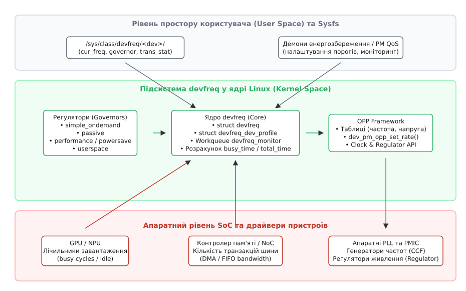
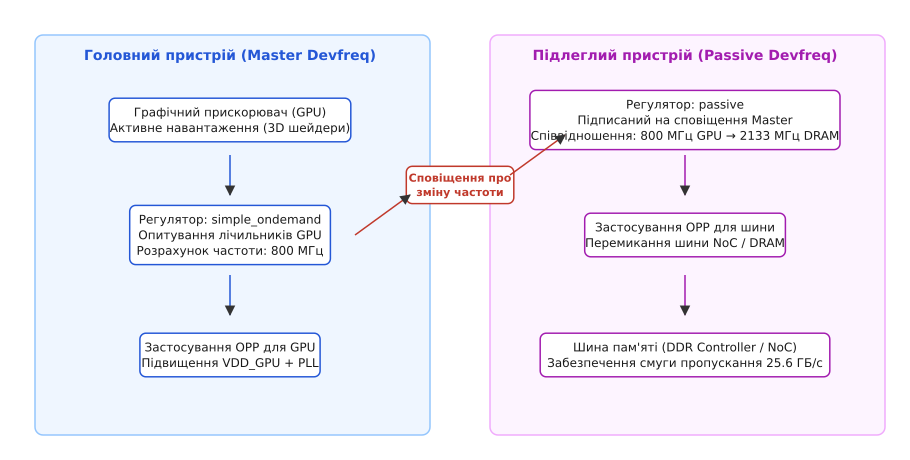

# devfreq: DVFS для не-CPU пристроїв

<preknowlist>
- [Таблиці робочих точок (OPP)](topic:unix-linux/opp-tables) — дискретні безпечні комбінації частоти, напруги та рівнів продуктивності для апаратних блоків.
- [Масштабування частоти процесора cpufreq](topic:unix-linux/cpufreq-and-cpuidle) — принципи динамічного регулювання напруги та частоти для ядер CPU.
- [Каркас тактування Common Clock Framework](topic:unix-linux/clock-framework) — дерево тактових сигналів, дільники та PLL у ядрі Linux.
- [Підсистема регуляторів напруги](topic:unix-linux/regulator-framework) — керування лініями живлення мікросхем PMIC та перемикання напруг.
- [Присипляння пристрою на ходу: runtime PM](topic:unix-linux/runtime-power-management) — переведення окремих периферійних блоків у стан низького споживання під час простою.
</preknowlist>

Коли мобільний пристрій або автономний вбудований комп'ютер починає рендерити складну тривимірну сцену, обробляти відеопотік високої роздільної здатності або виконувати обчислення нейромережі, центральний процесор (CPU) генерує лише невелику частку сумарного навантаження на систему. Левову частку енергії споживають графічний процесор (GPU), нейронний співпроцесор (NPU), блок обробки сигналів камер (ISP) та, що найважливіше, внутрішня системна шина разом із контролером оперативної пам'яті (DRAM / Network-on-Chip). Якщо зафіксувати тактову частоту шини пам'яті на максимумі, наприклад на рівні 2133 МГц при напрузі 1.1 В, акумулятор розрядиться за лічені години, навіть якщо екран показує статичний робочий стіл. Якщо ж примусово скинути її частоту до 200 МГц для економії струму, пропускна здатність впаде вдесятеро, викликаючи пропуск кадрів інтерфейсу та збої обробки кадрів камери в реальному часі.

Підсистема ядра Linux `cpufreq` була створена виключно для центральних процесорів, чиє навантаження операційна система бачить безпосередньо через черги планувальника потоків. Для розв'язання проблеми адаптивного енергоспоживання периферійних пристроїв, співпроцесорів та системних шин у ядрі існує спеціалізований каркас **devfreq** (від англ. *device frequency*).

---

## Фізичні основи DVFS та специфіка не-CPU пристроїв

Енергоспоживання сучасних цифрових мікросхем, побудованих за технологією комплементарних транзисторів метал-оксид-напівпровідник (КМОН, англ. *CMOS*), складається з двох ключових компонентів: статичного витоку струму та динамічного споживання під час перемикання логічних вентилів:

```
P_total = P_dyn + P_stat
P_dyn = α · C · V² · f
P_stat = I_leak · V
```

У цій формулі:
* `α` — фактор активності (частка вентилів, що змінюють стан за один такт);
* `C` — сумарна паразитна ємність навантаження провідників і затворів транзисторів;
* `V` — напруга живлення логічного домену (VDD);
* `f` — тактова частота перемикання;
* `I_leak` — струм витоку через закриті p-n переходи та підзатворний діелектрик.

Затримка розповсюдження логічного сигналу в КМОН-вентилі визначається часом перезаряджання ємності навантаження струмом насичення транзистора:

```
t_pd ≈ (C · V) / (k · (V - V_th)²)
```

де `V_th` — порогова напруга відкриття транзистора, а `k` — технологічний коефіцієнт провідності каналу. З цієї формули випливає фундаментальне обмеження цифрової схемотехніки: зі зниженням напруги живлення `V` затримка `t_pd` стрімко зростає. Щоб мікросхема могла стабільно працювати на високій тактовій частоті (де період такту `T = 1 / f` є дуже коротким), напруга `V` повинна бути відповідно збільшена.

Оскільки динамічна потужність `P_dyn` залежить від напруги **квадратично**, а для підвищення тактової частоти `f` фізично необхідно пропорційно піднімати напругу `V`, сумарна динамічна потужність масштабується приблизно пропорційно кубу робочого стану (`P_dyn ∝ f³`). Зниження частоти вдвічі дозволяє знизити напругу живлення, що зменшує миттєву споживану потужність у чотири-вісім разів.

Цей принцип лежить в основі динамічного масштабування напруги та частоти (DVFS, англ. *Dynamic Voltage and Frequency Scaling*).

```
f_target > f_current:  V_new = V(f_target)  →  Затримка стабілізації PMIC  →  f_new = f_target
f_target < f_current:  f_new = f_target    →  Затримка стабілізації PLL   →  V_new = V(f_target)
```

Порушення наведеної послідовності призводить до апаратного збою: якщо підняти частоту до підняття напруги, логічні сигнали не встигатимуть розповсюджуватися комбінаційними схемами до приходу наступного фронту тактового сигналу (*timing violation*), що спричинить запис пошкоджених даних у регістри.

Крім того, підвищення температури кристала експоненційно збільшує струм витоку `I_leak`. За високих напруг і частот кристал може увійти в режим теплового розгону (*thermal runaway*), коли ріст температури збільшує витік, що своєю чергою ще сильніше нагріває кристал аж до його фізичної деградації.

### Чому каркас cpufreq не підходить для периферії

На перший погляд може здатися, що механізм DVFS однаковий для будь-якого компонента кремнієвого кристала. Проте між центральним процесором і периферійним пристроєм існує фундаментальна різниця в способі спостереження за навантаженням та архітектурній поведінці:

1. **Відсутність потоків ОС у планувальнику**: Планувальник Linux (CFS / EEVDF) відстежує завантаження ядер CPU на основі черг виконання процесів, часу перебування в стані простою (`idle`) та метрик PELT (*Per-Entity Load Tracking*). Периферійні пристрої (GPU, NPU, DSP, контролери шин) є автономними апаратними блоками. Ядро не виконує на них код процесів безпосередньо, а лише надсилає пакети завдань через кільцеві буфери DMA або дескриптори черг.
2. **Апаратні лічильники активності**: Справжній ступінь зайнятості графічного прискорювача чи шини пам'яті можна дізнатися лише шляхом прямого зчитування спеціалізованих регістрів кристала — лічильників зайнятих та загальних тактів (*busy cycles* vs *total cycles*), лічильників транзакцій AXI/NoC або глибини черг апаратних FIFO.
3. **Каскадна залежність підсистем**: Частота шини пам'яті безпосередньо впливає на затримку доступу та смугу пропускання для десятків клієнтів одночасно (CPU, GPU, контролер дисплея, контролер камери). Якщо GPU переходить у режим максимальної продуктивності, шина пам'яті зобов'язана пропорційно підвищити свою пропускну здатність, навіть якщо сам центральний процесор перебуває у глибокому сні.
4. **Асинхронні межі тактування (Clock Domain Crossing)**: Периферійні блоки працюють на власних незалежних тактових доменах і взаємодіють із системною шиною через черги FIFO узгодження частот (CDC). Зміна тактової частоти одного IP-блоку вимагає динамічного коригування пропускної здатності мостів і комутаторів без зупинки роботи сусідніх блоків.

Через ці фундаментальні відмінності в ядрі Linux виникла потреба в окремій підсистемі, що детально описано у вставці [📜 Історія появи devfreq](topic:unix-linux/devfreq-framework/hist-devfreq-origin.md).

---

## Архітектура підсистеми devfreq

Каркас devfreq побудований за модульним принципом із чітким розділенням обов'язків між апаратно-залежним драйвером пристрою, центральним ядром підсистеми, регуляторами та допоміжними фреймворками ядра.


*Архітектурні рівні підсистеми devfreq: драйвер пристрою зчитує лічильники зайнятості, регулятор обчислює цільову частоту, а OPP-фреймворк безпечно змінює напругу та тактову частоту.*

### Ключові структури даних ядра

Взаємодія між драйвером конкретного обладнання та каркасом devfreq базується на структурі профілю пристрою `struct devfreq_dev_profile`, визначеній у заголовному файлі `<linux/devfreq.h>`:

```c
struct devfreq_dev_profile {
    unsigned long initial_freq;
    unsigned int polling_ms;
    int (*target)(struct device *dev, unsigned long *freq, u32 flags);
    int (*get_dev_status)(struct device *dev, struct devfreq_dev_status *stat);
    int (*get_cur_freq)(struct device *dev, unsigned long *freq);
    void (*exit)(struct device *dev);
    unsigned long *freq_table;
    unsigned int max_state;
    bool is_cooling;
};
```

Драйвер заповнює цей профіль під час ініціалізації:
* `initial_freq` задає початкову робочу частоту в герцах, на якій пристрій стартує до запуску алгоритмів регулювання.
* `polling_ms` задає бажаний період опитування лічильників завантаження в мілісекундах (зазвичай від 10 до 100 мс). Якщо значення дорівнює 0, пристрій використовує подієво-орієнтований моніторинг.
* `get_dev_status` — критична функція зворотного виклику. Вона звертається до апаратних регістрів мікросхеми та заповнює структуру вимірювань `struct devfreq_dev_status`:

```c
struct devfreq_dev_status {
    unsigned long total_time;
    unsigned long busy_time;
    unsigned long current_frequency;
    void *private_data;
};
```

Значення `total_time` та `busy_time` не обов'язково повинні вимірюватися в мілісекундах. Це можуть бути сирі апаратні такти лічильника або мікросекунди — регулятор цікавить виключно їхнє співвідношення `busy_time / total_time`.

* `target` — функція перемикання робочого стану. Регулятор передає в неї бажану цільову частоту `freq`. Драйвер узгоджує її з таблицею OPP та викликає перемикання генератора тактових сигналів (CCF) і регулятора напруги (Regulator Framework).

Практичний приклад написання повноцінного драйвера з обробкою апаратних лічильників наведено у вставці [⚙️ Реалізація devfreq-драйвера](topic:unix-linux/devfreq-framework/proj-devfreq-driver.md).

### Механізм моніторингу навантаження

Ядро devfreq створює відкладену робочу чергу (*delayed workqueue*), яка періодично виконує функцію `devfreq_monitor_work`:

1. **Запуск таймера**: Таймер черги спрацьовує через кожні `polling_ms` мілісекунд.
2. **Блокування екземпляра**: devfreq захоплює внутрішній м'ютекс `df->lock`, запобігаючи одночасній модифікації стану з боку файлової системи `sysfs` чи обробників подій живлення.
3. **Збір статистики**: Викликається функція `get_dev_status()` відповідного драйвера для отримання свіжих значень `busy_time` та `total_time`.
4. **Обчислення регулятором**: Отримані метрики передаються активному регулятору через виклик `get_target_freq()`, який повертає нове рекомендоване значення тактової частоти.
5. **Фільтрація та перевірка обмежень**: Отримана цільова частота обмежується діапазоном `[min_freq, max_freq]`, вимогами підсистеми PM QoS та обмеженнями термічного тротлінгу.
6. **Застосування стану**: Якщо нова частота відрізняється від поточної, викликається функція драйвера `target()`.
7. **Оновлення статистики**: devfreq фіксує перехід у матриці `trans_stat` і розсилає сповіщення через ланцюжок `srcu_notifier_call_chain()`.
8. **Планування наступного циклу**: Якщо моніторинг залишається активним, таймер робочої черги планується на наступний інтервал `polling_ms`.

Для мінімізації впливу таймерів на енергозбереження під час бездіяльності системи devfreq підтримує відкладені таймери (*deferrable timers*), які не будять центральний процесор із глибоких станів сну `C-states`, якщо система не виконує активної роботи.

Повний перелік системних викликів, функцій реєстрації та атрибутів зібрано у вставці [📋 Довідник інтерфейсів devfreq](topic:unix-linux/devfreq-framework/api-devfreq-reference.md).

---

## Регулятори (Governors) підсистеми devfreq

Регулятор — це програмний алгоритм, який аналізує динаміку завантаження пристрою та ухвалює рішення щодо підвищення або зниження тактової частоти.

### 1. Регулятор `simple_ondemand`

Найпоширеніший регулятор для більшості апаратних блоків (GPU, NPU, ISP). Його алгоритм спирається на два пороги завантаження:
* `upthreshold` (поріг розгону, за замовчуванням 90%);
* `downdifferential` (диференціал зниження, за замовчуванням 5%).

Розрахунок відсотка завантаження пристрою здійснюється за формулою:

```
load = (busy_time · 100) / total_time
```

Логіка ухвалення рішення базується на трьох сценаріях:

1. **Перевищення верхнього порогу (`load > upthreshold`)**:
Пристрій перевантажений і ризикує стати "пляшковим горлом" для конвеєра обробки. Регулятор намагається розрахувати нову частоту так, щоб за умови збереження поточного обсягу корисних операцій завантаження знизилося до цільового рівня (зазвичай до рівня `upthreshold`):

```
target_freq = (current_freq · load · 100) / upthreshold
```

Якщо розраховане значення перевищує можливості кристала, воно автоматично насичується до максимальної частоти `max_freq`.

2. **Недовантаження нижче порогу скидання (`load < (upthreshold - downdifferential)`)**:
Пристрій виконує мало роботи і витрачає зайву енергію на високій напрузі. Регулятор обчислює зменшену частоту:

```
target_freq = (current_freq · load · 100) / (upthreshold - downdifferential)
```

3. **Зона гістерезису (`(upthreshold - downdifferential) ≤ load ≤ upthreshold`)**:
Завантаження перебуває у допустимих межах нормальної роботи. Частота залишається незмінною (`target_freq = current_freq`).

Наявність розриву `downdifferential` створює **гістерезис** (грец. *hysteresis* — запізнювання). Без гістерезису пристрій постійно перемикався б між сусідніми частотами, генеруючи надмірні затримки стабілізації PLL та втрачаючи енергію на перехідні процеси напруги.

### 2. Регулятори `performance` та `powersave`

Статичні регулятори, які ігнорують вимірювання лічильників:
* `performance` примусово фіксує пристрій на максимально дозволеній частоті `max_freq`. Використовується під час тестування продуктивності, бенчмаркінгу або виконання критичних до затримок завдань реального часу.
* `powersave` примусово фіксує пристрій на мінімально можливій частоті `min_freq`. Застосовується в екстремальних режимах збереження заряду батареї.

### 3. Регулятор `userspace`

Передає повний контроль над вибором робочої точки демонам простору користувача. Частота встановлюється записом конкретного значення у файл `/sys/class/devfreq/<dev>/userspace/set_freq`. Це дозволяє створювати складні користувацькі профілі енергоспоживання, інтегровані з графічними оболонками (наприклад, перемикання профілів GPU в Android HAL або ігрових режимах).

### 4. Регулятор `passive` та каскадне масштабування шин

Особливе місце посідає регулятор `passive`. Він розроблений для підлеглих пристроїв (шини пам'яті, матриці комутації NoC, спільні кеш-пам'яті останнього рівня LLC), які не мають власних надійних лічильників або чиє завантаження є прямим наслідком активності іншого провідного пристрою (*master*).


*Взаємодія головного пристрою (GPU) та підлеглого контролера пам'яті (NoC/DRAM) через регулятор passive для забезпечення необхідної пропускної здатності шини.*

У такій конфігурації підлеглий devfreq-пристрій не запускає власний таймер опитування. Замість цього він реєструє слухача подій (*notifier callback*) на зміну стану провідного пристрою. Коли графічний процесор під керуванням `simple_ondemand` перемикається з 200 МГц на 800 МГц, ядро devfreq генерує сповіщення `DEVFREQ_NOTIFY_POST_TRANSITION`. Регулятор `passive` контролера пам'яті перехоплює цю подію і за заздалегідь визначеною таблицею відповідності переводить шину оперативної пам'яті, наприклад, з 400 МГц на 2133 МГц.

---

## Взаємодія з Operating Performance Points (OPP) Framework

Підсистема devfreq не змінює апаратні регістри PLL та лінії живлення PMIC напряму. Усі операції з дискретними робочими точками делегуються каркасу **OPP Framework**.

### Опис робочих точок у Device Tree

У сучасних ядрах Linux таблиця OPP описується за стандартом `operating-points-v2`:

```dts
gpu_opp_table: opp-table-gpu {
    compatible = "operating-points-v2";

    opp-200000000 {
        opp-hz = /bits/ 64 <200000000>;
        opp-microvolt = <800000>;
        opp-supported-hw = <0x1>;
    };
    opp-400000000 {
        opp-hz = /bits/ 64 <400000000>;
        opp-microvolt = <900000>;
        opp-supported-hw = <0x1>;
    };
    opp-800000000 {
        opp-hz = /bits/ 64 <800000000>;
        opp-microvolt = <1050000>;
        opp-supported-hw = <0x1>;
    };
};
```

Коли регулятор розраховує цільову частоту, наприклад 350 МГц, драйвер пристрою викликає функцію `devfreq_recommended_opp(dev, &freq, flags)`. OPP Framework переглядає зареєстровану таблицю та повертає найближчу безпечну робочу точку з частотою не менше ніж 400 МГц і необхідною напругою 0.9 В.

### Атомарне застосування стану через `dev_pm_opp_set_rate`

Виклик `dev_pm_opp_set_rate(dev, freq)` повністю інкапсулює складну логіку узгодження живлення:
1. Запитує у підсистеми регуляторів напруги `regulator_set_voltage()`.
2. Очікує стабілізації вихідної напруги перетворювача PMIC (затримка наростання напруги *slew rate*).
3. Змінює коефіцієнти множення та ділення PLL через `clk_set_rate()`.
4. У разі зниження частоти операції виконуються у зворотному порядку, гарантуючи, що кристал жодної наносекунди не працюватиме на завищеній частоті при заниженій напрузі.

> 🔧 **Навіщо це.**
> Розділення логіки між devfreq та OPP дозволяє одному й тому самому драйверу GPU або контролера пам'яті працювати на десятках різних плат. Розробнику драйвера не потрібно знати, яка саме мікросхема PMIC встановлена на конкретній платі і якими лініями тактування керує процесор — усе апаратне сполучення описується у файлі Device Tree, а devfreq та OPP забезпечують безпомилкове керування на льоту.

---

## Моніторинг та керування через Sysfs

Кожен пристрій, зареєстрований у каркасі devfreq, створює каталог у `/sys/class/devfreq/<ім'я_пристрою>/`. Цей інтерфейс надає вичерпну діагностичну інформацію про поведінку підсистеми:

```
/sys/class/devfreq/10040000.bus-controller/
├── available_frequencies
├── available_governors
├── cur_freq
├── governor
├── max_freq
├── min_freq
├── polling_interval
├── target_freq
├── trans_stat
└── timer
```

### Аналіз матриці переходів (`trans_stat`)

Одним із найпотужніших інструментів аналізу енергетичної поведінки є псевдофайл `trans_stat`. Він відображає таблицю переходів між усіма доступними частотами та сумарний час перебування в кожному стані:

```
From  :   To
      :  100000000  200000000  400000000  800000000   Time(ms)
 100000000:          0         12          0          2     542000
 200000000:         10          0         45          1     120500
 400000000:          1         35          0         88      45300
 800000000:          3          9         87          0      12200
Total transition : 293
```

Ця статистика дозволяє виявити типові проблеми конфігурації:
* Якщо час перебування зосереджений виключно на крайніх значеннях (100 МГц та 800 МГц), а проміжні стани мають нульовий час, це свідчить про занадто агресивний поріг `upthreshold` або неефективний інтервал опитування.
* Якщо загальна кількість переходів `Total transition` зростає зі швидкістю сотень перемикань на секунду, система страждає від паразитного "брязкання частот" (*frequency thrashing*), що призводить до перевитрати енергії на перезаряджання ємностей ліній живлення.

---

## Системна енергетична оптимізація мобільних та вбудованих SoC

У складних гетерогенних системах devfreq не функціонує ізольовано, а інтегрується в загальну екосистему керування живленням ядра Linux:

### 1. DVFS шини пам'яті (Memory Bus Scaling)

Масштабування частоти контролера оперативної пам'яті (DDR Controller) є однією з найскладніших задач у ядрі. Зміна частоти шини DDR вимагає:
* Перемикання множників внутрішніх PLL контролера пам'яті.
* Адаптації часових затримок пам'яті (*CAS Latency*, *tRP*, *tRCD*, *tRAS*), оскільки при зниженні тактової частоти кількість тактів затримки має динамічно перераховуватися.
* Короткочасного переведення мікросхем DRAM у режим самоосвіження (*self-refresh*) на час блокування PLL, щоб уникнути пошкодження даних під час нестабільності тактового сигналу.

Devfreq-драйвери шин пам'яті координують цей процес під захистом локальних блокувань, гарантуючи збереження цілісності пам'яті при кожному перемиканні робочої точки.

### 2. Теплове тротління через Thermal Framework

У разі інтенсивного навантаження температура кристала SoC може досягти критичної межі (`T_j > 85 °C`). Підсистема контролю температури (Thermal Management Framework) повинна терміново знизити виділення тепла.

Devfreq підтримує автоматичну реєстрацію пристроїв як охолоджувачів (*cooling devices*) через виклик `devfreq_cooling_register()`. Коли тепловий сенсор фіксує перегрів:
1. Тепловий регулятор (наприклад, `step_wise` або `power_allocator`) надсилає запит на обмеження продуктивності.
2. Каркас охолодження devfreq примусово занижує атрибут `max_freq` для GPU або NPU.
3. Регулятор `simple_ondemand` втрачає можливість підвищувати частоту вище встановленого теплового ліміту, що стабілізує температуру кристала без аварійного вимкнення пристрою.

### 3. Гарантії якості обслуговування (PM QoS)

Деякі апаратні процеси мають жорсткі вимоги до затримок. Наприклад, контролер дисплея, що формує вихідний сигнал на панель із частотою 60 Гц, повинен безперервно зчитувати пікселі з фреймбуфера в пам'яті. Якщо шина пам'яті знизить частоту до мінімуму, буфер дисплея спорожніє, викликаючи мерехтіння або зрив синхронізації (*display underflow*).

Для запобігання таким збоям використовується підсистема **PM QoS** (Power Management Quality of Service). Драйвер дисплея встановлює обмеження мінімальної пропускної здатності шини:

```c
pm_qos_add_request(&disp_qos, PM_QOS_MEMORY_BANDWIDTH, 1200000); /* 1.2 ГБ/с */
```

Каркас devfreq автоматично враховує вимоги PM QoS і обмежує значення `min_freq`, не дозволяючи регулятору опустити частоту нижче рівня, необхідного для стабільної роботи критичної периферії.

### 4. Динамічне усунення брязкання частот (Frequency Thrashing Mitigation)

У мобільних системах характер навантаження часто буває імпульсним (*bursty*). Наприклад, під час скролінгу веб-сторінки користувач торкається екрана на кілька мілісекунд, викликаючи сплеск рендерингу, після чого навантаження спадає до нуля.

Якщо регулятор реагує надто різко, тактова частота починає стрибати між максимумом і мінімумом кілька разів на секунду. Кожне перемикання робочої точки супроводжується витратами енергії на перезаряджання вихідних конденсаторів перетворювача PMIC та затримками очікування фіксації частоти PLL (*phase lock time*), яка може становити від 10 до 150 мікросекунд.

Для згладжування імпульсного навантаження сучасні регулятори застосовують фільтрацію на основі експоненційного ковзного середнього (EMA, англ. *Exponential Moving Average*):

```
smoothed_load = β · load_current + (1 - β) · load_previous
```

де `β ∈ (0, 1]` — ваговий коефіцієнт згладжування (зазвичай `β ≈ 0.3...0.5`). Використання згладженого завантаження разом із розширеним інтервалом гістерезису `downdifferential` дозволяє уникнути непотрібних перемикань при короткочасних провалах навантаження, забезпечуючи плавну роботу інтерфейсу без втрати енергоефективності.

---

Підсистема `devfreq` формує фундамент для енергоефективної роботи сучасного гетерогенного обладнання під керуванням Linux. Відокремлюючи механізми апаратного моніторингу завантаження від евристичних алгоритмів регулювання та спираючись на уніфіковані таблиці робочих точок OPP, devfreq забезпечує динамічний баланс між максимальною продуктивністю та мінімальним енергоспоживанням складних систем на кристалі.
