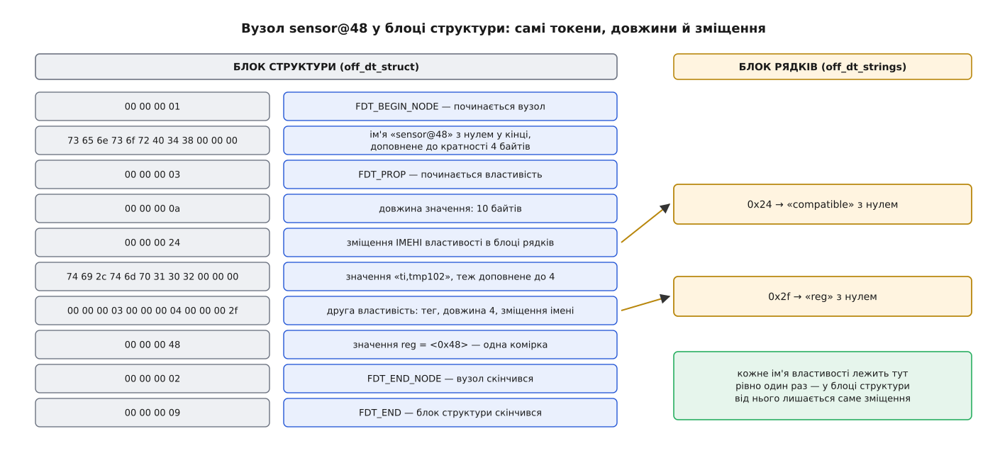

# 📋 Формат дерева пристроїв: синтаксис, властивості, блоб і команди

Тут зібрано сам формат як довідник: із чого складається текст `.dts`, які властивості стандартизовані й що кожна означає, що лежить усередині скомпільованого `.dtb` побайтово і якими командами це збирають, розбирають та перевіряють.

## Синтаксис .dts

Файл починається директивою версії, далі йде рівно одне дерево з коренем `/`.

```dts
/dts-v1/;
#include <dt-bindings/interrupt-controller/irq.h>

/ {
        model = "Acme Widget rev B";
        compatible = "acme,widget-b", "acme,widget";
        #address-cells = <1>;
        #size-cells = <1>;

        soc {
                compatible = "simple-bus";
                #address-cells = <1>;
                #size-cells = <1>;
                ranges;

                i2c0: i2c@e0004000 {
                        compatible = "cdns,i2c-r1p10";
                        reg = <0xe0004000 0x1000>;
                        #address-cells = <1>;
                        #size-cells = <0>;
                };
        };
};
```

| Запис | Що це |
|---|---|
| `i2c@e0004000` | ім'я вузла й адреса-одиниця: до 31 символу з набору `0-9 a-z A-Z , . _ + -`, після `@` — перше число з `reg` шістнадцятково, без `0x` і без ведучих нулів |
| `i2c0:` перед іменем | мітка; існує лише в тексті — у блоб вона потрапляє як phandle або як запис у `__symbols__` |
| `&i2c0 { … };` на верхньому рівні | доповнення вузла, оголошеного раніше — у підключеному `.dtsi` або в базовому дереві |
| `/delete-node/ &i2c0;`, `/delete-property/ clocks;` | прибрати вузол чи властивість, які прийшли з підключеного файлу |
| `/memreserve/ 0x10000000 0x100000;` | ділянка пам'яті, яку чіпати не можна; іде в окремий блок блоба, а не у вузол |
| `/include/ "board.dtsi"` або `#include` | підключення; другу форму розкриває препроцесор C ще до `dtc` |

Значення властивості — це масив байтів, а синтаксис лише каже, як його набрати:

| Запис | Тип | Приклад |
|---|---|---|
| `"текст"` | рядок із нулем у кінці | `status = "okay";` |
| `"a", "b"` | список рядків, склеєних через нулі | `compatible = "nxp,pca9548", "nxp,pca954x";` |
| `<…>` | масив 32-бітних комірок | `reg = <0xe0004000 0x1000>;` |
| `/bits/ 8 <…>`, `/bits/ 64 <…>` | той самий масив з іншою шириною елемента | `local-mac-address = /bits/ 8 <0x00 0x11 0x22>;` |
| `[…]` | сирі байти шістнадцятково | `mac-address = [00 11 22 33 44 55];` |
| `<&мітка>` | phandle — число, яким компілятор замінює мітку | `interrupt-parent = <&intc>;` |
| `<&мітка 38>` | phandle зі специфікатором: скільки чисел іде за ним, вирішує ціль | `clocks = <&clkc 38>;` |
| нічого після імені | булева властивість: важить сама її наявність | `interrupt-controller;` |

Окремої 64-бітної форми в `<>` немає: широке число просто займає дві сусідні комірки, старша перша.

## Хто задає кількість комірок

Формат звертання оголошує **постачальник** ресурсу, а той, хто посилається, лише дотримується. Це те саме правило, що для `reg`, тільки в кількох подобах.

| Властивість у постачальника | Що вона задає | Хто на неї спирається |
|---|---|---|
| `#address-cells`, `#size-cells` | скільки комірок займають адреса й розмір у `reg` **дітей** | `reg`, `ranges`, `dma-ranges` |
| `#interrupt-cells` (у вузла з `interrupt-controller`) | довжину специфікатора переривання | `interrupts`, `interrupts-extended` |
| `#clock-cells` | `0` — контролер дає один такт; `1` — після посилання йде його номер | `clocks`, `assigned-clocks` |
| `#gpio-cells` (у вузла з `gpio-controller`) | зазвичай `2`: номер лінії й прапорці | `gpios`, `*-gpios` |
| `#dma-cells`, `#pwm-cells`, `#phy-cells`, `#reset-cells`, `#power-domain-cells`, `#io-channel-cells` | те саме для решти родин ресурсів | `dmas`, `pwms`, `phys`, `resets`, `power-domains`, `io-channels` |

`#address-cells` і `#size-cells` спека вимагає писати явно: вони діють рівно на один рівень униз і не успадковуються через голову батька.

Паралельно до кожного такого масиву можна класти список імен — `clock-names`, `interrupt-names`, `dma-names`, `reg-names`, `pinctrl-names`. Тоді драйвер бере ресурс за іменем, а не за порядковим номером, і додавання нового такту посередині списку нічого не ламає.

## Стандартні властивості

| Властивість | Тип | Що означає |
|---|---|---|
| `compatible` | список рядків | програмна модель пристрою, від найконкретнішої до найзагальнішої; форма `виробник,модель` |
| `model` | рядок | конкретна модель плати або мікросхеми, теж `виробник,модель` |
| `reg` | комірки | адреси й розміри ресурсів у системі координат батька |
| `ranges` | порожня або трійки | переклад дитячих адрес у батьківські: `<дитяча батьківська довжина>`; порожня означає «збігаються один в один» |
| `dma-ranges` | порожня або трійки | те саме для адрес, якими бачить пам'ять [пристрій, що ходить у неї сам](book:unix-linux/dma-and-buffers) |
| `dma-coherent` | булева | доступ пристрою до пам'яті когерентний із кешем процесора |
| `phandle` | одна комірка | числовий ідентифікатор вузла; у тексті його не пишуть — `dtc` проставляє сам під мітку |
| `status` | рядок | чи придатний пристрій до вжитку на цій платі |
| `interrupts` | комірки | специфікатори переривань у форматі контролера-батька |
| `interrupt-parent` | phandle | який контролер тлумачить `interrupts`; без нього беруть контролер батьківського вузла |
| `interrupts-extended` | phandle + комірки | те саме, але контролер названо в кожному елементі; має перевагу над `interrupts` |
| `interrupt-controller` | булева | цей вузол сам роздає переривання |
| `interrupt-map`, `interrupt-map-mask` | комірки | перекладає переривання дітей у переривання іншого контролера — так описують, наприклад, лінії `INTA…INTD` мосту PCI |
| `device_type` | рядок | застаріла; лишилася тільки на вузлах `cpu` і `memory` |
| `name` | рядок | застаріла остаточно: ім'я вузла й так є в дереві |

Ресурсні властивості спільні для всіх родин заліза: `clocks` і `clock-frequency`, `*-supply` (регулятор живлення — `vcc-supply`, `vdda-supply`), `gpios` і `*-gpios`, `resets`, `power-domains`, `dmas`, `memory-region`, `pinctrl-0` з `pinctrl-names`.

`status` має п'ять значень, і різниця між ними не косметична:

| Значення | Що означає |
|---|---|
| `"okay"` | пристрій робочий; відсутність властивості означає те саме |
| `"disabled"` | зараз не працює, але може: виводи не розведені на цій платі, блок вимкнено |
| `"reserved"` | працює, але вам його чіпати не можна — ним володіє прошивка або інший процесор |
| `"fail"` | не працює: виявлено серйозну помилку, одужання не очікується |
| `"fail-sss"` | те саме, де `sss` — деталі помилки, специфічні для пристрою |

## Верхній рівень: чотири особливі розділи

```dts
/ {
        #address-cells = <2>;
        #size-cells = <2>;

        memory@0 {
                device_type = "memory";                  /* саме так, інакше не знайдуть */
                reg = <0x0 0x00000000 0x0 0x40000000>;   /* 1 ГіБ від нуля */
        };

        chosen {
                bootargs = "console=ttyPS0,115200 root=/dev/mmcblk0p2 rw";
                stdout-path = "serial0:115200n8";
                linux,initrd-start = <0x0 0x08000000>;
                linux,initrd-end   = <0x0 0x08c00000>;
        };

        aliases {
                serial0 = &uart1;
                ethernet0 = &gem0;
        };

        reserved-memory {
                #address-cells = <2>;
                #size-cells = <2>;
                ranges;

                fw@7f000000 {
                        reg = <0x0 0x7f000000 0x0 0x01000000>;
                        no-map;              /* ядру не можна навіть відображати */
                };

                pool: cma_pool {
                        compatible = "shared-dma-pool";
                        reusable;            /* поки не треба — хай працює під сторінки */
                        size = <0x0 0x08000000>;
                        alignment = <0x0 0x00100000>;
                        alloc-ranges = <0x0 0x30000000 0x0 0x40000000>;
                };
        };
};
```

**`/memory`** — єдине джерело знання про оперативну пам'ять: пари «адреса, розмір», а `device_type = "memory"` тут обов'язковий, бо саме за ним ядро знаходить вузол у ще нерозкладеному блобі.

**`/chosen`** — не залізо, а те, що передає прошивка:

| Властивість | Що містить |
|---|---|
| `bootargs` | [командний рядок ядра](book:unix-linux/bootloader-and-cmdline) |
| `stdout-path` | шлях або аліас консолі; двокрапка обриває шлях, решта — параметри (`serial0:115200n8`) |
| `stdin-path` | те саме для вводу |
| `linux,initrd-start`, `linux,initrd-end` | межі [початкового образу кореня](book:unix-linux/initramfs) у фізичній пам'яті — конвенція Linux, у спеці її немає |
| `rng-seed`, `kaslr-seed` | ентропія від прошивки; ядро зчитує її й затирає — теж конвенція Linux |

**`/aliases`** — короткі імена для шляхів: ім'я від 1 до 31 символу з малих літер, цифр і дефісів, значення — повний шлях у дереві (`&uart1` компілятор перетворить на нього сам). Саме звідси беруться `serial0` у `stdout-path` і нумерація портів, стала між збірками.

**`/reserved-memory`** — ділянки, які не належать ядру. Дитина задає або `reg` (жорстко ця адреса), або `size` з необов'язковими `alignment` та `alloc-ranges` (хай виберуть за мене в цих межах). `no-map` означає «не створювати відображень і не читати наперед» — так тримають пам'ять іншого процесора; `reusable` — навпаки, «поки не треба, вживайте під що завгодно». Одночасно обидва не ставлять. Пристрій прив'язується до ділянки властивістю `memory-region = <&pool>;`, а `compatible = "shared-dma-pool"` робить із неї [пул суцільної фізичної пам'яті](book:unix-linux/cma-contiguous-allocator).

## Що всередині .dtb

Блоб починається сорокабайтним заголовком із десяти 32-бітних полів:

| Зміщення | Поле | Значення |
|---|---|---|
| `0x00` | `magic` | `0xd00dfeed` |
| `0x04` | `totalsize` | розмір усього блоба в байтах |
| `0x08` | `off_dt_struct` | зміщення блоку структури |
| `0x0c` | `off_dt_strings` | зміщення блоку рядків |
| `0x10` | `off_mem_rsvmap` | зміщення блоку зарезервованої пам'яті |
| `0x14` | `version` | версія формату; нинішня — `17` |
| `0x18` | `last_comp_version` | найстаріша версія, з якою цей блоб сумісний, — `16` |
| `0x1c` | `boot_cpuid_phys` | фізичний номер процесора, на якому стартує ядро (з версії 2) |
| `0x20` | `size_dt_strings` | довжина блоку рядків (з версії 3) |
| `0x24` | `size_dt_struct` | довжина блоку структури (з версії 17) |

Усі числа в блобі — старшим байтом уперед, незалежно від машини. ARM і RISC-V молодшобайтні, тож простим розіменуванням поле не прочитати: скрізь потрібна перестановка (`be32_to_cpu`, `fdt32_to_cpu`). Блок зарезервованої пам'яті — пари 64-бітних чисел «адреса, розмір» з парою нулів у кінці; це те, що набралося з `/memreserve/`.

Блок структури — плаский потік токенів:

| Токен | Значення | Що йде за ним |
|---|---|---|
| `FDT_BEGIN_NODE` | `0x00000001` | ім'я вузла рядком із нулем, доповнене до кратності 4 байтів |
| `FDT_PROP` | `0x00000003` | `len`, `nameoff`, далі `len` байтів значення з доповненням до 4 |
| `FDT_END_NODE` | `0x00000002` | нічого |
| `FDT_NOP` | `0x00000004` | нічого: заповнювач, яким затирають те, що видалили |
| `FDT_END` | `0x00000009` | нічого; кінець блоку структури |



*Імена властивостей винесені в окремий блок і згадуються зміщенням; у самому потоці немає жодного вказівника — лише довжини, за якими можна перестрибнути незрозуміле.*

> 🔧 **Навіщо це.** `FDT_NOP` і поля довжини існують заради правки на місці. Завантажувач, який хоче дописати `bootargs` чи виправити розмір пам'яті у вже завантаженому блобі, не переносить нічого: старий запис затирається токенами `FDT_NOP`, новий іде в запас, залишений ключем `-p`. Тому блоб для U-Boot компілюють із запасом — інакше `fdt set` упреться в `FDT_ERR_NOSPACE`.

## Команди

```sh
dtc -I dts -O dtb -o board.dtb board.dts          # зібрати
dtc -I dtb -O dts -o back.dts board.dtb           # розібрати назад: міток уже не буде
dtc -@ -I dts -O dtb -o sensor.dtbo sensor.dts    # накладка — з таблицею символів
dtc -I fs -O dts /sys/firmware/devicetree/base    # витягти дерево з живої системи
```

| Ключ | Дія |
|---|---|
| `-I dts\|dtb\|fs` | вхід: текст, блоб або каталог у стилі `/proc/device-tree` |
| `-O dts\|dtb\|asm\|yaml` | вихід |
| `-@` | «Enable generation of symbols»: додає вузол `__symbols__` — мітка → шлях; без нього в **базовому** дереві накладці нема до чого чіплятися |
| `/plugin/;` у джерелі | не ключ, а директива: сама вмикає `__fixups__` і `__local_fixups__` — таблиці, якими посилання накладки пришивають до базового дерева |
| `-A` | завести аліас на кожну мітку автоматично |
| `-V 17` | версія блоба на виході |
| `-p N`, `-S N`, `-a N` | запас: доповнення, мінімальна довжина блоба, вирівнювання |
| `-i шлях` | де шукати підключення |
| `-W`, `-E` | вмикати й вимикати попередження та помилки (`-Wno-unit_address_vs_reg`) |
| `-s` | впорядкувати вузли й властивості — щоб два блоби можна було чесно порівняти |
| `-H legacy\|epapr\|both` | у якому вигляді записувати phandle |
| `-f`, `-q` | видати результат попри помилки; притишити діагностику |

Дрібні операції над готовим блобом робить набір `libfdt`:

```sh
fdtdump board.dtb                                 # заголовок, зміщення й сирий вміст
fdtget -t s board.dtb /chosen bootargs
fdtget -p board.dtb /soc/i2c@e0004000             # перелічити властивості вузла
fdtget -l board.dtb /soc                          # перелічити дочірні вузли
fdtput -t x board.dtb /soc/i2c@e0004000/sensor@48 reg 0x49
fdtoverlay -i board.dtb -o merged.dtb sensor.dtbo
```

Формат ключа `-t` — необов'язковий розмір елемента (`b` — 1 байт, `h` — 2, `l` — 4) і тип: `i` знакове, `u` беззнакове, `x` шістнадцяткове, `s` рядок, `r` сирі байти. `fdtdump` — інструмент розбору, а не довідник: для читанного вигляду беруть `dtc -I dtb -O dts`.

У дереві ядра збірка й перевірка виглядають так:

```sh
make dtbs                                         # зібрати всі .dtb цієї архітектури
make dt_binding_check                             # звірити самі схеми з метасхемою
make dtbs_check                                   # звірити скомпільовані дерева зі схемами
make dt_binding_check DT_SCHEMA_FILES=trivial-devices.yaml
```

Перевірку виконує окремий пакет `dtschema` (`pip3 install dtschema`), який приносить `dt-validate`, `dt-doc-validate` і `dt-mk-schema`. Порядок команд не довільний: `make dtbs_check` мовчки пропускає схеми, які самі не пройшли перевірку, тому спершу йде `dt_binding_check` — інакше здається, що зауважень нема, а насправді схему просто не читали.

Схема прив'язки — звичайний JSON Schema у форматі YAML, який описує рівно один рядок `compatible`:

```yaml
$id: http://devicetree.org/schemas/hwmon/ti,tmp102.yaml#
$schema: http://devicetree.org/meta-schemas/core.yaml#

title: TI TMP102 temperature sensor

maintainers:
  - Ім'я Прізвище <mail@example.org>

properties:
  compatible:
    const: ti,tmp102
  reg:
    maxItems: 1
  interrupts:
    maxItems: 1
  vcc-supply: true

required:
  - compatible
  - reg

additionalProperties: false
```

Останній рядок і робить схему корисною: `additionalProperties: false` перетворює будь-яку властивість, якої в описі немає, на помилку — а саме нею й виявляється друкарська помилка в імені, яку інакше не помітив би ніхто, бо драйвер просто не знайшов би [своєї лінії переривання](book:unix-linux/interrupts-bottom-halves) й мовчки працював би не так.
