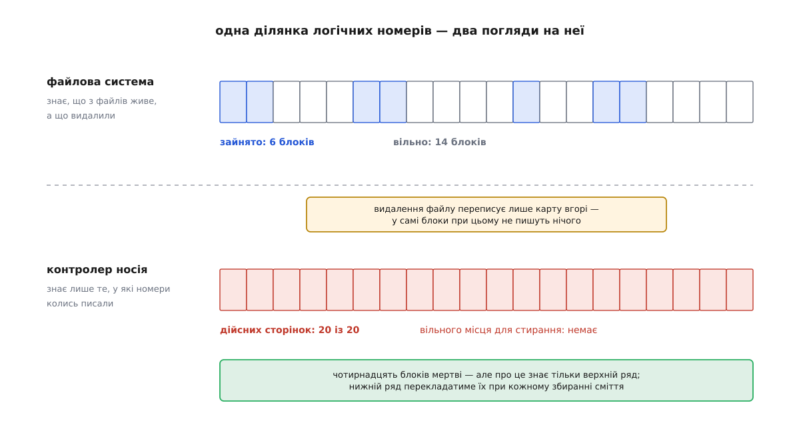
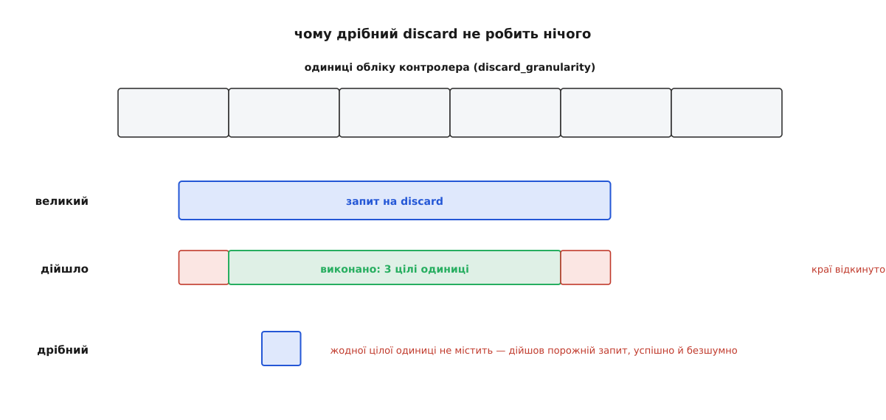
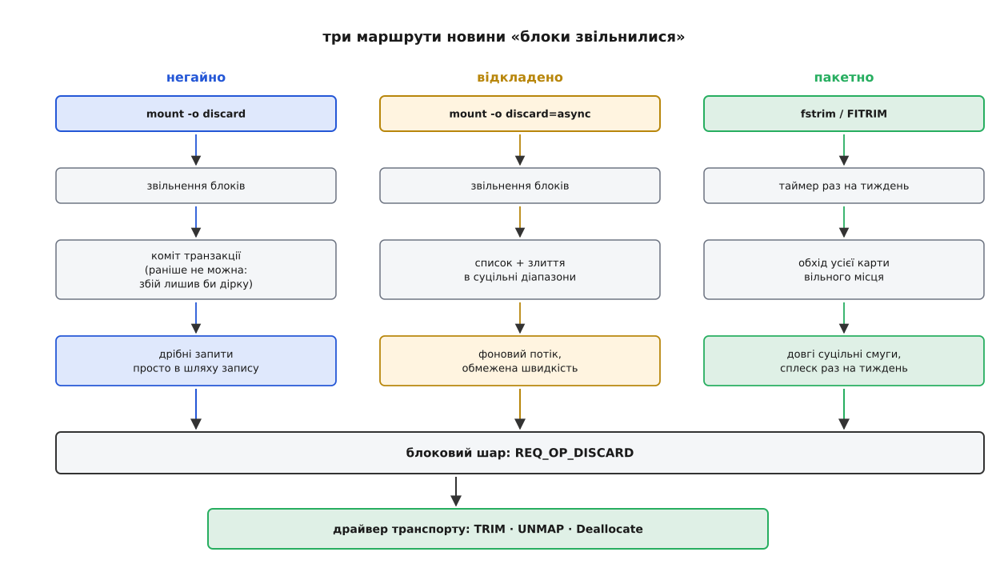

# Discard і TRIM: як файлова система каже носієві, що блоки більше не потрібні

<preknowlist>
- [Блоковий пристрій](book:unix-linux/block-device-model) — носій, який ядро бачить як масив пронумерованих блоків однакового розміру; звернутися можна лише за номером, і операцій усього дві — прочитати й записати.
- [Розміщення блоків файлу](book:unix-linux/file-block-allocation) — хто й коли обирає номери блоків під файл і де записано, які блоки зайняті, а які вільні.
- [Журналювання й узгодженість](book:unix-linux/journaling-consistency) — зміна метаданих стає остаточною лише після фіксації транзакції, а до того може відкотитися.
- [Кеш сторінок і довговічність](book:unix-linux/page-cache-durability) — запис лягає в пам'ять, а на носій його виносить окрема пізніша робота.
- [Шар трансляції флешу (FTL)](book:algorithms/ftl-flash-translation) — усередині твердотільного носія є таблиця «логічний номер → фізичне місце», і фізичне місце вільно переїжджає без відома системи.
- [NAND і NOR](book:electronics/nand-nor) — у флеші пишуть сторінками, стирають великими блоками, і записати вдруге в непорожню сторінку не можна.
</preknowlist>

Видалення файлу не чіпає його вмісту. Воно міняє кілька байтів у каталозі й кілька бітів у карті вільного місця — і на цьому все; байти лишаються там, де лежали. Зазвичай із цього роблять висновок про безпеку: мовляв, дані ще можна відновити. Але є другий наслідок, значно буденніший, і стосується він не таємниць, а швидкости.

Річ у тім, що «вільно» — це поняття, яке існує тільки в голові файлової системи. Носієві його ніхто не повідомляє, бо повідомити нема чим: інтерфейс блокового пристрою має рівно дві дії — прочитати блок із номером N і записати блок із номером N. Слова «блок N більше нікому не потрібен» у цьому словнику немає.

Довгі десятиліття воно й не було потрібне. На обертовому диску сектор завжди щось містить, запис іде поверх старого вмісту в те саме фізичне місце, і питання «чи потрібне те, що там зараз лежить» диск ніколи собі не ставить. Порожній сектор і сектор зі сміттям для нього однакові: обидва коштують однаково, обидва перезапишуться однаково швидко. Незнання диска нічого не коштувало.

Флеш зламав цю симетрію.

## Чому носієві не байдуже

У флеші запис і стирання — різні за розміром дії. Записати можна сторінку (одиниці кілобайтів), а стерти — тільки цілий блок стирання, що складається з сотень таких сторінок. І записати в сторінку, де вже щось є, не можна взагалі: спершу стирання, і то всього блока разом із сусідами.

Звідси головне рішення в будь-якому SSD: контролер ніколи не пише на місце. Коли система просить перезаписати логічний блок, контролер кладе новий вміст у вільну сторінку деінде, а в своїй таблиці міняє запис «логічний номер → фізичне місце» на нову адресу. Стара сторінка стає недійсною — вона зайнята, але на неї вже ніхто не вказує.

Недійсні сторінки накопичуються, вільні кінчаються, і рано чи пізно контролер мусить звільняти місце сам: обрати блок стирання, вичитати з нього ті сторінки, що ще дійсні, перекласти їх в інше місце й аж тоді стерти блок цілком. Це [збирання сміття](book:algorithms/flash-garbage-collection) — і його ціна вимірюється саме тим, скільки сторінок довелося перекласти.

А тепер найважливіше. Звідки контролер знає, яка сторінка дійсна? Єдине його джерело правди — власна таблиця. Сторінка дійсна тоді й лише тоді, коли на неї зараз указує якийсь логічний номер. Іншого критерію в контролера немає й бути не може: він не читає каталогів, не знає, де inode, і не має жодного уявлення про те, що таке файл.

Ось тут і відкривається прірва. Коли файлова система звільняє блоки, вона міняє свої власні структури — але не пише в ці блоки нічого. Таблиця контролера лишається незмінною: кожен логічний номер, у який колись писали, і далі вказує на свою сторінку, і кожна така сторінка й далі дійсна. Носій, який одного разу заповнили, для власного контролера лишається заповненим назавжди — хоч би скільки разів ви потім усе видаляли.



*Одна й та сама ділянка логічних номерів очима файлової системи й очима контролера: звільнення файлу міняє тільки верхній ряд, бо нижній ряд про нього не дізнається.*

Наслідок видно на числах. Візьмімо блок стирання з 256 сторінок, у якому насправді потрібні лише 64 сторінки, а решта 192 належать давно видаленим файлам.

**Скільки коштує звільнити один блок стирання**

```
блок стирання      = 256 сторінок
насправді потрібні = 64 сторінки, решта 192 належать видаленим файлам

контролер про видалення не знає:
   дійсних сторінок за його таблицею = 256
   перекласти перед стиранням        = 256
   звільнено корисних сторінок       = 256 - 256 = 0     ← стирати цей блок
                                                            узагалі немає сенсу

контролер про видалення знає:
   дійсних сторінок за його таблицею = 64
   перекласти перед стиранням        = 64
   звільнено корисних сторінок       = 256 - 64  = 192

підсилення запису в другому випадку — скільки сторінок носій пише насправді
на кожну сторінку, яку йому дала система:
   WA = (192 від системи + 64 перекладених) / 192 ≈ 1.33
```

Різниця не в тридцяти відсотках — вона якісна. Поки контролер вважає всі сторінки дійсними, у нього немає жодного блока, який вигідно стирати; він тримається лише на заводському запасі сторінок, які системі ніколи не показували. Коли запас вичерпується, кожен запис від системи перетворюється на низку перекладань, і носій, який учора видавав гігабайти за секунду, починає гальмувати на порядок. Повний розбір цього коефіцієнта — у статті про [підсилення запису](book:algorithms/write-amplification); тут важливо лише те, що чисельник у ньому задає система, а знаменник — знання контролера.

Отже, потрібна третя дія.

## Третя дія і три її імені

Дія проста: «логічні номери з N до M більше нічого не означають, у їхні сторінки ніхто не зазирне». Контролер, отримавши таке, викреслює ці номери зі своєї таблиці — і сторінки, на які вони вказували, миттю стають недійсними, тобто дармовим здобутком для найближчого збирання сміття.

У трьох великих родинах носіїв ця дія називається по-різному, бо додавали її в три різні стандарти:

- **ATA** — команда `DATA SET MANAGEMENT` (код операції 06h) з увімкненою ознакою TRIM; саме її ім'я стало побутовою назвою всього явища;
- **SCSI** — команда `UNMAP`, а також `WRITE SAME` з піднятим прапорцем UNMAP;
- **NVMe** — команда `Dataset Management` з атрибутом Deallocate.

Історію того, як TRIM з'явився в комітеті T13 наприкінці 2000-х, як його підхоплювали операційні системи й чому перша спроба поставити його в чергу закінчилася занесенням цілих серій дисків до чорного списку ядра, винесено [окремо](book:unix-linux/discard-and-trim/hist-trim-birth.md) — там і дати, і назви моделей, і те, чим саме псувалися дані.

Linux не показує цих трьох імен нікому вище драйвера. У блоковому шарі є одна операція — `REQ_OP_DISCARD`, і саме її бачать файлові системи, device mapper і RAID. Драйвер транспорту наприкінці шляху перекладає її на ту команду, яку розуміє його шина. Тому в ядрі, у сисфсі й у документації всюди стоїть слово **discard**, а «TRIM» лишається розмовною назвою його ATA-втілення.

> 🔧 **Навіщо це.** Коли `fstrim` каже «операція не підтримується», винен не завжди носій. Ланцюг довгий — файлова система, шари device mapper, RAID, транспорт, драйвер — і будь-яка ланка може не вміти передати discard далі. Дивитися треба не на модель диска, а на `/sys/block/<пристрій>/queue/discard_max_bytes` того шару, до якого ви звертаєтеся: нуль означає «звідси й нижче discard не проходить», і шукати обрив треба саме там.

## Дозвіл, а не наказ

Тепер найважливіша риса discard, з якої випливає майже вся його подальша незручність: це **не наказ**. Стандарти дозволяють пристроєві виконати команду частково або не виконати зовсім, і жодного способу поскаржитися немає — discard, що не зробив нічого, повертає успіх.

Причина не в недбалості комітетів. Викреслення номера з таблиці — це зміна тієї самої таблиці, яку контролер тримає в пам'яті й періодично зберігає; discard на пів терабайта означав би мільйони правок і секунди зайнятости. Тому реальні пристрої обробляють discard як пораду: щось викреслюють одразу, щось відкладають, а надто дрібне ігнорують.

З цього негайно випливає питання, на яке немає єдиної відповіді: **що прочитається з блока, який щойно віддали через discard?** Стандарт розрізняє три класи пристроїв:

- **недетермінований** — читання може повернути що завгодно, і двічі поспіль різне;
- **детермінований** (DRAT, deterministic read after trim) — читання повертає щоразу те саме, але що саме — не обумовлено;
- **детермінований із нулями** (RZAT, read zero after trim) — читання повертає нулі.

Ця невизначеність робить discard непридатним для двох речей, до яких його весь час хочеться прикласти. По-перше, це **не спосіб занулити діапазон**: ядро колись мало ознаку `discard_zeroes_data` і покладалося на неї, але від версії 4.12 її прибрали як ненадійну — тепер вона завжди читається нулем, а зануленням займається окрема операція `REQ_OP_WRITE_ZEROES`, яку пристрій або виконує сам, або ядро емулює записом нулів. По-друге, це **не стирання даних**: пристрій має повне право лишити сторінки на місці, а таблицю правити ліниво, і надійне знищення робиться зовсім іншими командами — про них коротко нижче.

## Чому дрібний discard зникає безслідно

Друга незручність — розмір. Контролер веде свою таблицю не посекторно: одиниця обліку в нього своя, і вона зазвичай куди більша за сектор. Викреслити пів такої одиниці неможливо — це означало б розбити один запис таблиці на два, тобто збільшити таблицю замість того, щоб її зменшити.

Пристрій повідомляє цей розмір у `discard_granularity`, і блоковий шар діє за очевидною логікою: підрізає ваш запит до внутрішніх меж пристрою, а неповні краї просто відкидає. Запит, що не містить жодної цілої одиниці, перетворюється на порожній — успішно й безшумно.



*Неповні краї запиту відкидаються, бо контролер не вміє викреслити частину одиниці обліку; дрібний запит цілком складається з країв і зникає весь.*

Звідси випливає правило, яке визначає всю подальшу конструкцію: **discard має сенс великими суцільними діапазонами**. Один запит на 256 МіБ звільненого місця спрацює повністю; шістдесят чотири тисячі окремих запитів по 4 КіБ на пристрої з одиницею в мегабайт не зроблять нічого, зате чесно з'їдять час.

Ще два сисфсні числа добудовують картину: `discard_max_hw_bytes` — стеля, яку заявив сам пристрій для одного запиту, а `discard_max_bytes` — програмна стеля, яку ядро дозволяє вам опустити. Опускати доводиться тому, що великий discard на деяких носіях виконується секундами, і на цей час пристрій перестає відповідати на все інше.

## Три способи сказати

Знання про звільнені блоки живе у файловій системі. Донести його вниз можна трьома різними стратегіями, і вони відрізняються не результатом, а тим, коли платиться ціна.



*Той самий факт «блоки звільнилися» доходить до пристрою трьома різними маршрутами; відрізняються вони моментом і розміром запитів, а не змістом повідомлення.*

**Негайно.** Файлова система, змонтована з `-o discard`, видає discard на кожну звільнену ділянку. Але не в мить звільнення: ext4 відкладає його до фіксації транзакції, у якій це звільнення стало остаточним. Порядок тут не косметичний. Якби discard пішов раніше за коміт, збій між ними лишив би на носії файлову систему, яка після відкоту вважає блоки зайнятими, а їхній вміст уже втрачено — тобто файл, що існує в метаданих і не існує у флеші. Ціна цього режиму — дрібні розкидані запити просто на шляху запису; на старих SATA-носіях TRIM ще й не ставав у чергу NCQ, тож кожен такий запит змушував пристрій спорожнити чергу й зупинити все інше.

**Відкладено, але автоматично.** Btrfs від версії ядра 5.6 має режим `discard=async`: звільнені ділянки складаються в список, зливаються в суцільні діапазони, і окремий фоновий потік видає їх із обмеженням швидкости, яке крутиться через сисфс. Це той самий «негайно», з якого прибрали головну ваду — присутність у гарячому шляху. Від версії 6.2 btrfs вмикає його самотужки на носіях, що заявляють підтримку.

**Пакетно.** Найдешевший спосіб — не стежити за звільненнями взагалі, а раз на якийсь час обійти карту вільного місця цілком і віддати вниз усе, що в ній вільне. Це системний виклик `ioctl` із запитом `FITRIM` (з'явився в ядрі 2.6.37), яким користується `fstrim` із пакета util-linux, а в більшості дистрибутивів його раз на тиждень запускає таймер systemd:

```sh
$ sudo fstrim -v /
/: 214.7 GiB (230549069824 bytes) trimmed

$ systemctl status fstrim.timer
     Trigger: Mon 2026-08-10 00:41:12 EEST; 2 days left
```

Число у виводі — не «звільнено місця», а «стільки байтів файлова система віддала вниз як непотрібні». Пристрій міг викреслити менше; повторний запуск за хвилину покаже приблизно те саме число, бо файлова система щоразу проходить карту наново й не пам'ятає, що вже віддавала.

Пакетний шлях виграє саме тим, чого бракує негайному: за тиждень звільнене місце встигає скластися в довгі суцільні смуги, а це рівно та форма, яку пристрій обробляє з користю. Тому типовий вибір дистрибутива — тижневий `fstrim`, а `-o discard` лишається для випадків, де звільнене місце комусь потрібне негайно — і такі випадки цікаві тим, що флеш у них ні до чого.

Є ще четвертий, «сирий» шлях повз файлову систему — команда `blkdiscard` і той самий запит `ioctl` під нею, який приймає просто пару чисел:

```c
uint64_t range[2] = { offset, length };   /* байтові зсув і довжина */
if (ioctl(fd, BLKDISCARD, range) < 0)
        perror("BLKDISCARD");
```

Ним користується `mkfs`, коли перед створенням файлової системи віддає весь пристрій, і `swapon` для розділу підкачки. Повний перелік цих інтерфейсів — прапорці `fstrim` і `blkdiscard`, запити `ioctl`, сисфсні файли, параметри монтування різних файлових систем і те, як `fallocate` пробиває діру у файлі, — зібрано [окремо](book:unix-linux/discard-and-trim/api-discard-controls.md), щоб не переказувати тут таблиці.

## Чому discard важить і без флешу

Досі здавалося, що вся справа в NAND. Насправді ні: між файловою системою й носієм майже завжди стоять шари, для яких «цей блок більше не потрібен» — цінна новина сама собою.

Кожен шар [device mapper](book:unix-linux/device-mapper) мусить окремо вирішити, що робити з discard, і рішення в них різні:

- **тонке виділення** (dm-thin) не передає discard далі, а **споживає** його: почувши, що ділянку звільнено, воно повертає її фізичні шматки в спільний пул, звідки їх візьме інший том. Тут discard — єдиний канал, яким місце взагалі може повернутися нагору; без нього тонкий том лише росте. Те саме стосується образів віртуальних машин: гість, який робить `fstrim`, зменшує файл образу на хості. Механіку самого пулу розібрано в статті про [тонке виділення](book:unix-linux/dm-thin-provisioning);
- **шифрування** (dm-crypt) типово discard **не пропускає** взагалі. Причина не технічна: карта викреслених ділянок повторює карту зайнятости файлової системи, а вона видна ззовні без жодного ключа. Тобто наскрізний discard на зашифрованому томі показує сторонньому, скільки там даних і як вони розкладені. Дозвіл вмикається явно, і це свідомий обмін приватности на швидкість — [dm-crypt](book:unix-linux/dm-crypt);
- **логічні томи** LVM віддають discard униз лише з увімкненим `issue_discards`, бо звільнений екстент може ще знадобитися знімкові — [LVM і знімки](book:unix-linux/lvm-and-snapshots);
- **loop-пристрій** перекладає discard у пробивання діри у файлі-підкладці, тож файл-образ і справді худне — [loop-пристрій](book:unix-linux/loop-device).

> 🔧 **Навіщо це.** Саме звідси береться правило експлуатації сховищ із тонким виділенням: `fstrim` там не «оптимізація для SSD», а обов'язкова операція обліку. Пул, у якому гості ніколи не роблять trim, вичерпається фізично при вільному місці всередині кожного гостя — і зупиниться весь, разом із тими, хто нічого не видаляв.

## Чим за це платять

Discard не безкоштовний, і ціна в нього трьох сортів.

**Час.** Кожен запит проходить увесь стек і займає пристрій. У негайному режимі це час просто в шляху запису; у пакетному — сплеск раз на тиждень, який на великій файловій системі відчутний. Обмежувачі швидкости в асинхронному режимі btrfs існують саме тому, що необмежений потік discard уміє задушити робоче навантаження.

**Відновлення.** Поки блоки просто позначені вільними, вміст лежить на місці, і утиліта відновлення має шанс. Після discard шанс зникає — не завжди миттєво, але надійно: пристрій має право віддавати нулі одразу, а стерти сторінки може будь-якої секунди. Практично це означає, що на носії з увімкненим trim «видалив помилково» майже не має продовження.

**Витік розкладки.** Про нього вже йшлося на прикладі шифрування, але він ширший: пристрій, який знає, які логічні номери мертві, знає й карту зайнятости — а ця карта сама собою є даними.

І симетрична пересторога, яку постійно плутають: **discard — не знищення даних**. Пристрій нічого не зобов'язаний стирати, а зобов'язаний лише перестати вважати сторінки потрібними. Для справжнього знищення існують окремі команди — ATA `SECURITY ERASE`, ATA `SANITIZE`, NVMe `Sanitize` — які виконує сама прошивка над усіма фізичними сторінками, зокрема й тими, що система ніколи не бачила; у Linux до них ведуть окремі шляхи, розібрані в статті про [надійне стирання носія](book:unix-linux/secure-erase-and-sanitize). Плутанина тут коштує дорого: людина робить `blkdiscard` і вважає диск чистим, тоді як прошивка лише поправила таблицю.

## Що це за операція

Варто побачити discard у ряду з рештою блокового інтерфейсу. `read` і `write` — накази з перевірюваним результатом: після успішного `write` прочитається саме те, що записали, інакше пристрій зламаний. Discard же не обіцяє нічого спостережного: він не гарантує ні звільненого місця, ні змісту наступного читання, ні навіть того, що взагалі щось зробив.

Він і не мусить. Його зміст — не змінити стан носія, а зняти з носія зобов'язання. Це єдина команда в блоковому словнику, чий предмет — не дані, а **обов'язок їх зберігати**: система відмовляється від вимоги, а що з цією свободою зробить пристрій і коли — його справа. Тому й перевірити його не можна тим самим способом, яким перевіряють запис, і тому вся інженерія навколо нього — вирівнювання, злиття, обмеження швидкости, вибір між негайним і тижневим — це не боротьба за коректність, а торгівля: скільки роботи ми готові вкласти, щоб пристрій отримав корисне знання вчасно.
