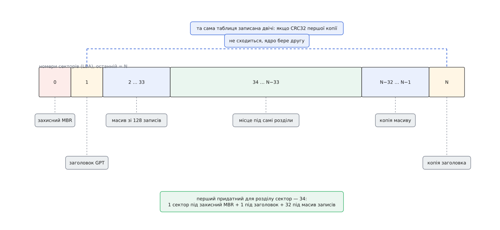
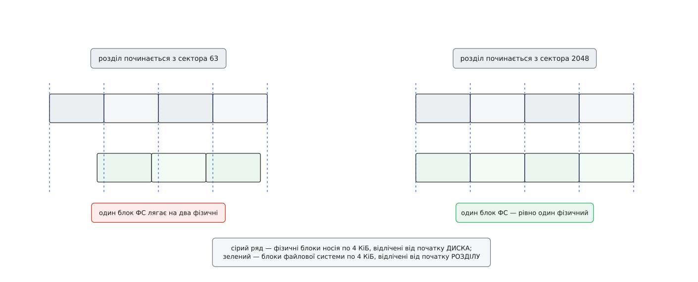
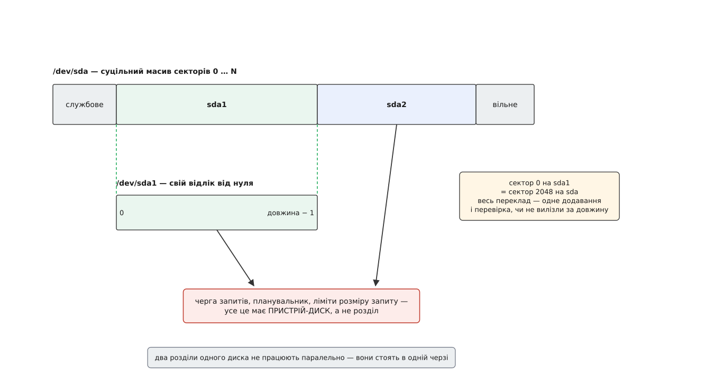

# Розділи диска: таблиця розділів, вирівнювання й що з цього бачить ядро

<preknowlist>
- [Блоковий пристрій: сектори, блоки й черга запитів](topic:unix-linux/block-device-model) — носій адресується пронумерованими секторами, і логічний розмір блока в нього може відрізнятися від фізичного.
- [Файл пристрою: символьний і блоковий](topic:unix-linux/device-file-model) — доступ до носія йде через вузол у `/dev`.
- [Старший і молодший номери пристрою](topic:unix-linux/major-minor-numbers) — вузол у `/dev` позначає драйвер і конкретний екземпляр парою чисел.
- [Монтування й дерево монтувань](topic:unix-linux/mount-model) — файлова система приєднується до дерева каталогів із конкретного блокового пристрою.
- [Керуючий канал до драйвера: ioctl](topic:unix-linux/ioctl-interface) — команди, які не лягають у читання й запис, передають окремим викликом.
- [CRC](topic:communications/crc) — коротка контрольна сума, що ловить спотворення блока даних.
</preknowlist>

## Диск, який хочеться поділити

Новий накопичувач показує себе однією суцільною стрічкою пронумерованих секторів: від нуля до кількох мільярдів, і жодних внутрішніх меж. Одна стрічка — одне сховище. Але одного сховища майже ніколи не досить. Систему хочеться тримати окремо від даних, щоб перевстановлення не зачепило фотографій. Поруч із Linux має жити ще одна операційна система зі своїм, несумісним форматом. Частину місця варто віддати під простір підкачки, який узагалі не файлова система.

Здається, що все це вирішує одна файлова система з кількома теками всередині. Не вирішує. Тека — це запис усередині однієї файлової системи, тобто всередині однієї структури, яку веде один і той самий код. А потрібна незалежність поверхом нижче: різні формати запису, різні моменти створення й знищення, різні права на монтування — і головне, щоб зруйнована структура одного сховища не тягла за собою друге. Таку незалежність дає лише поділ самих адрес: ось цей діапазон секторів твій, і більше нічий.

Отже, треба десь записати, де починається й де закінчується кожен шматок. І записувати це доводиться на самому диску. Якби межі зберігалися десь у системі, накопичувач, переставлений в іншу машину, перетворився б на нерозбірливе місиво: сектори є, а де в них проходять кордони — невідомо. Диск мусить пояснювати сам себе.

Звідси випливає й друга вимога. Місце, де лежить це пояснення, має бути відоме наперед — до будь-якого читання, ще тоді, коли про диск не знають нічого. Правило «шукати десь усередині» не працює: щоб знайти, треба вже вміти читати. Придатний вибір фактично один — найперший сектор.

## Перший сектор і чотири рядки

Найперший сектор диска має 512 байтів, і ці 512 байтів у світі персональних комп'ютерів довелося ділити між двома різними мешканцями. Прошивка після ввімкнення зчитує саме цей сектор і передає керування коду в ньому, тож на початку сидить перший шматок завантажувача — 446 байтів. Останні два байти зайняті сталою міткою `0x55 0xAA`, за якою прошивка впізнає, що сектор осмислений. Лишається рівно 64 байти.

У ці 64 байти вклали таблицю з чотирьох записів по 16 байтів. Кожен запис — це прапорець завантажуваності, однобайтовий код типу, номер першого сектора розділу (4 байти), кількість секторів (4 байти) і рудиментарні координати в старій системі «циліндр–головка–сектор». Уся розмітка диска — 64 байти, і чотири розділи там не з філософських міркувань, а тому, що більше не влізло.

Цю схему звуть **MBR** (англ. *master boot record* — головний завантажувальний запис). Її ввели разом із PC DOS 2.0 у березні 1983 року, щоб дати раду десятимегабайтному диску нового тоді IBM PC XT — це задокументована обставина; ім'я автора коду й точна дата написання ходять переважно з довідкових джерел і надійного первинного підтвердження не мають. Звідки взялися решта чисел і як людство з них вибиралося, зібрано окремо — [від чотирьох рядків до GPT](topic:unix-linux/disk-partitions/hist-mbr-to-gpt.md): чому розмітка міряла диск циліндрами й головками, як з'явився розширений розділ, що саме зупинило зростання MBR і як таблиця розділів опинилася в специфікації прошивки.

Чотирьох записів швидко забракло, і замість переробки схеми до неї приробили обхід. Один із чотирьох розділів оголошують контейнером, а всередині нього роблять однозв'язний список: на початку кожної ланки лежить свій міні-сектор із двома записами — сам розділ і посилання на наступну ланку. Так з'явилися логічні розділи. Працює, але крихко: обрив ланцюга губить усе, що було за ним.

Друга межа виявилася жорсткішою. На номер сектора відведено чотири байти:

```
номерів сектора            = 2³²
розмір сектора             = 512 байтів
місткість                  = 2³² · 512 = 2 199 023 255 552 байтів = 2 ТіБ
```

Диск на 3 ТБ MBR описати просто не може: числа немає. І є ще третя вада, тихіша за перші дві. У таблиці немає ані контрольної суми, ані резервної копії. Один зіпсований байт у 64-байтовому шматку — і межі розділів стають правдоподібним сміттям, яке ніхто не відрізнить від справжніх.

## Таблиця, яка знає, що вона ціла

Заміну розробила Intel наприкінці 1990-х як частину EFI — середовища прошивки для нової тоді платформи Itanium; згодом ця специфікація стала UEFI, і опис таблиці досі живе в її п'ятому розділі. Схему звуть **GPT** (англ. *GUID partition table* — таблиця розділів із глобально унікальними ідентифікаторами).

Порядок у ній такий. Найперший сектор — той самий MBR, але навмисне порожній за змістом: у ньому один-єдиний запис типу `0xEE`, що оголошує весь диск зайнятим невідомим розділом. Це не сумісність, а пастка для необережності: старий інструмент, який про GPT не чув, побачить не порожній диск, який кортить розмітити, а зайнятий чимось незрозумілим — і, найімовірніше, відступиться. Такий MBR і звуть захисним.

Далі йде заголовок — сектор 1. У ньому підпис `EFI PART`, версія, розмір заголовка, власний номер сектора й номер сектора резервної копії, перший і останній сектори, доступні під розділи, унікальний ідентифікатор усього диска, номер сектора, з якого починається масив записів, кількість записів і розмір одного запису. І два числа CRC32: контрольна сума самого заголовка й контрольна сума всього масиву записів.

Масив записів іде одразу за заголовком. Специфікація вимагає відвести під нього щонайменше 16384 байти, і при звичних 128 записах по 128 байтів це виходить рівно:

```
розмір одного запису   = 128 байтів
кількість записів      = 128
масив                  = 128 · 128 = 16384 байтів
секторів по 512        = 16384 / 512 = 32
сектор 0               захисний MBR
сектор 1               заголовок
сектори 2 … 33         масив записів
перший придатний       = 34
```

Наприкінці диска все це повторено дзеркально: спершу копія масиву, а на найостаннішому секторі — копія заголовка. Кінець диска вибрано не з естетики: це єдине місце, яке можна знайти, знаючи лише місткість пристрою, і воно найдалі від початку, тож одна локальна аварія навряд чи зачепить обидві копії.



*Дві копії таблиці на протилежних кінцях диска; кожна прикрита контрольними сумами, тож зіпсована копія не видає себе за справжню.*

Саме контрольні суми змінюють характер таблиці. Раніше вона могла бути «майже правильною» — і тоді ніхто не помічав біди, поки не втрачали дані. Тепер таблиця або сходиться, або ні: досить одного зіпсованого байта, щоб CRC32 не збігся, і ядро візьме резервну копію замість першої. Це не виправляє диск, але прибирає найгірший стан — тихе користування сміттям.

Один запис розділу описує сам розділ шістьма речами: ідентифікатор **типу**, ідентифікатор **самого розділу**, перший сектор, останній сектор (включно), 64 біти прапорців і назва — 36 одиниць коду UTF-16LE. Точні зсуви полів, розміри й найуживаніші значення зібрано в [розкладці полів GPT](topic:unix-linux/disk-partitions/api-gpt-layout.md).

Обидва ідентифікатори варті окремої уваги, бо їх легко переплутати. Ідентифікатор типу каже не «яка тут файлова система», а **яка в розділу роль**: службовий розділ прошивки, простір підкачки, корінь системи для конкретної архітектури процесора. Це домовленість, записана в [Discoverable Partitions Specification](https://uapi-group.org/specifications/specs/discoverable_partitions_specification/); на неї спирається `systemd-gpt-auto-generator`, що вміє знайти й змонтувати корінь, `/home` та підкачку взагалі без `/etc/fstab` і без параметра `root=` у командному рядку ядра. Ідентифікатор самого розділу натомість унікальний і не змінюється при переміщенні диска — на ньому тримаються стійкі імена в `/dev/disk/by-partuuid/`, які, на відміну від `sda1`, не роз'їжджаються від того, що в машину додали ще один накопичувач.

Прочитати таблицю власноруч — найкоротший шлях перестати вважати її магією: [розбір GPT із сирого пристрою](topic:unix-linux/disk-partitions/proj-parse-gpt.md) показує це кодом — від перевірки підпису й CRC32 до переліку розділів із їхніми межами.

## Число, з якого починається розділ

Запис розділу зводиться, по суті, до пари чисел: перший сектор і останній. Друге з них ні на що, крім місткості, не впливає. А от перше — впливає на все, що зверху, і саме тут ховається найдорожча помилка розмітки.

Причина в тому, що поверхи міряють довжину від різних нулів. Носій усередині працює фізичними блоками — на сучасних дисках це 4096 байтів — і відлічує їх від початку **диска**. Файлова система теж працює блоками, найчастіше теж по 4096 байтів, але відлічує їх від початку **розділу**, бо про диск вона нічого не знає. Отже, дві однакові сітки накладені одна на одну зі зсувом, який дорівнює позиції розділу. Збігатимуться вони тільки тоді, коли цей зсув кратний фізичному блокові.

Історія показала, що буває інакше. Старі засоби розмітки ставили перший розділ на сектор 63: у системі «циліндр–головка–сектор» на доріжці було 63 сектори, перша доріжка йшла під завантажувальний код, і розділ починався з наступної. Число красиве в старій арифметиці й нікчемне в новій:

```
початок розділу = 63 · 512 = 32256 байтів
32256 / 4096    = 7.875     — не ціле
```

Сітки роз'їхалися на 0.875 блока. Кожен блок файлової системи від того лежить одразу в двох фізичних, тож найпростіший запис перетворюється на дві порції роботи носія замість однієї — рівно, назавжди й без жодного способу це надолужити налаштуваннями зверху.



*Зсув початку розділу задає фазу для всієї сітки згори: некратний зсув розсовує кожен блок файлової системи на два фізичні.*

Сучасна домовленість — починати перший розділ із сектора 2048, тобто рівно з мегабайта. Число здається завеликим для заголовка, який займає 34 сектори, але його вибирали не під заголовок:

```
2048 · 512     = 1048576 = 1 МіБ
1048576 / 4096   = 256      — фізичний блок диска
1048576 / 8192   = 128      — сторінка флешпам'яті
1048576 / 131072 = 8        — блок стирання 128 КіБ
1048576 / 65536  = 16       — смуга RAID 64 КіБ
```

Мегабайт кратний усім правдоподібним внутрішнім одиницям одразу — і тим, що всередині твердотільних накопичувачів, і смузі [програмного RAID](topic:unix-linux/md-raid), і екстенту [логічного тому LVM](topic:unix-linux/lvm-and-snapshots). Тому питання вирівнювання знімають наперед і більше до нього не повертаються.

> 🔧 **Навіщо це.** Диск, що дістався в спадок від старої системи, часто зберігає стару розмітку навіть після переустановлення, бо таблицю ніхто не переписував. Два числа з `/sys/block/<пристрій>/<розділ>/start` і `/sys/block/<пристрій>/queue/physical_block_size` вирішують питання за секунду — тільки одиниці в них різні: `start` рахує сектори по 512 байтів завжди, `physical_block_size` подає байти. Тож множимо перше на 512 і ділимо на друге: лишилась остача — машина віддає частину швидкості запису ні за що. Ядро рахує це й саме — `/sys/block/<пристрій>/<розділ>/alignment_offset` показує, на скільки байтів розділ промахнувся повз межу фізичного блока; нуль там означає, що все гаразд.

## Що з цього бачить ядро

Головне про таблицю розділів у Linux звучить несподівано: ядро її не веде. Немає підсистеми розділів, немає структури, яку ядро підтримувало б у злагодженому стані. Є лише **розбирачі** — невеликі файли в `block/partitions/`, по одному на схему: `msdos.c`, `efi.c`, а поруч ще з десяток для розміток, які колись вигадали Amiga, Atari, Mac, Sun і SGI. Кожен розбирач уміє одне: подивитися на перші сектори щойно з'явленого диска й сказати, чи впізнає він тут свою схему, і якщо так — повернути перелік меж.

Що ядро робить із цим переліком, іще простіше. На кожен запис воно заводить окремий блоковий пристрій, у якого від диска відрізняються рівно два числа: початок і довжина. Читання сектора 0 з `sda1` — це читання сектора 2048 з `sda` плюс перевірка, що запит не виліз за довжину. Весь механізм розділу — одне додавання й одна перевірка.



*Розділ не додає нового пристрою — він додає вікно з переліченими адресами на вже наявний.*

З цієї простоти випливають два висновки, які на практиці важать більше за всі подробиці формату.

Перший: **розділ не має власної черги**. Черга запитів, планувальник, обмеження на розмір одного запиту — усе це властивості диска. Два розділи одного накопичувача не працюють паралельно: вони стоять в одній черзі й змагаються за один пристрій. Дати їм різні політики обслуговування теж не вийде — [планувальник блокового вводу-виводу](topic:unix-linux/io-schedulers) вибирають на диск, а не на розділ.

Другий: **розділ нікого ні від кого не захищає**. Ізоляція існує рівно доти, доки звертаються через вузол розділу. Той, хто відкрив `/dev/sda` і пише за зсувом, пише куди завгодно, включно з чужою файловою системою й самою таблицею. Це не діра, а прямий наслідок конструкції: вікно — це арифметика, а не паркан.

Іменують розділи додаванням номера до імені диска: `sda1`, `sda2`. Якщо ім'я диска закінчується цифрою, між ними ставлять літеру `p` — звідси `nvme0n1p1` і `mmcblk0p1`, інакше вийшла б каша з двох чисел підряд. Номер береться з позиції запису в таблиці, а не з розташування на диску, тож розділ 3 цілком може фізично лежати перед розділом 1. Старший номер розділи ділять із диском, бо драйвер той самий; різняться вони молодшим — [номером екземпляра](topic:unix-linux/major-minor-numbers).

## Коли таблиця змінюється під живою системою

Таблиця на диску змінилася — ядро про це не знає. Воно розбирало сектори тоді, коли пристрій з'явився, і жодного стеження за ними не веде. Сказати треба явно, і способів два; різниця між ними і є суттю проблеми.

Перший — `ioctl` на `BLKRRPART`: «викинь усе, що знаєш про розділи цього диска, і розбери його наново». Якщо хоч один розділ змонтований або відданий під підкачку, виклик повертає `EBUSY` — і це правильна відмова, а не примха. Файлова система вже тримає в пам'яті свої структури, розраховані на певні межі; підмінити межі під нею означає навести її на чужі сектори.

Другий — `ioctl` на `BLKPG`, точкова операція над **одним** розділом: додати, видалити, змінити розмір. Саме цим користуються `partx --add`, `partx --update` і `resizepart`. Зайнятий сусід тут не заважає: додати новий розділ можна, не чіпаючи змонтованого. Ціна — довіра: ядро бере передані межі на віру й не звіряє їх із тим, що записано на диску. Помилитися в числі означає накласти одне вікно на інше й отримати дві файлові системи, що пишуть в одні сектори.

Звідси й порядок дій, коли розділ збільшують на працюючій машині: спершу таблиця на диску (`sfdisk` чи `parted`), потім ядро (`partx --update`), і аж тоді файлова система (`resize2fs`, `xfs_growfs`). Пропустити середній крок — найчастіша помилка: таблиця вже нова, файлова система вже хоче рости, а вікно ядра лишилося старим, і запис за його межу впирається в помилку вводу-виводу.

## Розділи без таблиці й таблиця без розділів

Механізм «вікна зі зсувом» ніяк не прив'язаний до фізичного диска, тож його застосовують і там, де диска немає. Файл-образ системи містить усередині повноцінну таблицю; `losetup -P` створює [loop-пристрій](topic:unix-linux/loop-device), розбирає таблицю всередині файлу й дає `loop0p1`, `loop0p2` — ті самі вікна, тільки над файлом. Якщо розмічений носій опинився всередині логічного тому чи шифрованого шару, `kpartx` робить те саме руками: на кожен розділ створює лінійну ціль [device mapper](topic:unix-linux/device-mapper), тобто буквально відображення «мої сектори з нуля — на його сектори зі зсуву».

Працює і зворотне. Таблиця розділів не обов'язкова взагалі: `mkfs.ext4 /dev/sdb` цілком законний, файлова система почнеться з нульового сектора й ніколи не дізнається, що таке розділ. Так роблять для дисків, які завжди йдуть цілком — під один том сховища або всередині віртуальної машини, де ділити нічого.

Наостанок — пастка, на якій спотикаються найчастіше саме через дзеркальність GPT. Диск скопіювали посекторно на більший, і копія завантажується як ні в чому не бувало: перша таблиця на місці, перший сектор той самий. Але резервна копія залишилася там, де був кінець **старого** диска, тобто десь усередині нового. Заголовок при цьому чесно каже, що дзеркало має лежати на останньому секторі, — і не знаходить його там. Поки жива перша копія, ніхто нічого не помічає; біда виявляється рівно тоді, коли перша копія знадобиться замінити. Лікується це одним рухом — `sgdisk -e` переносить дзеркало в новий кінець і перераховує контрольні суми, — але зробити цей рух треба до аварії, а не після.
