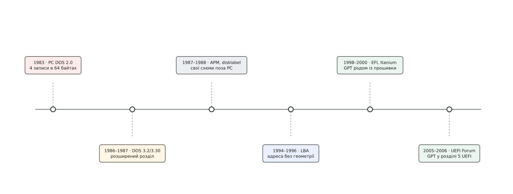
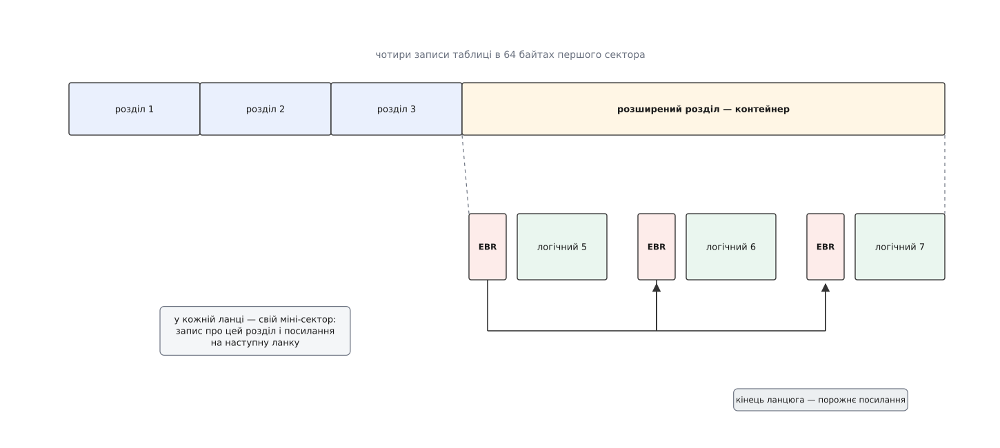

# 📜 Від чотирьох рядків до GPT

Історія розмітки диска — це історія чисел, які колись здавалися щедрими, а потім по черзі ставали стінами: чотири записи, десять біт на циліндр, тридцять два біти на номер сектора. Кожне з них має конкретну причину появи й конкретну дату, коли вперлися в нього лобом; заміна прийшла звідти, звідки її не чекали, — з проєкту серверної прошивки для процесора, який не вижив.

## Десять мегабайтів, які нікуди не вміщалися

До 1983 року персональний комп'ютер IBM знав дискети. Дискета — це одне сховище, і питання «де межа» на ній не стоїть узагалі. Разом із IBM PC XT з'явився вінчестер на 10 МБ, і одразу стало ясно, що віддавати десять мегабайтів одній файловій системі FAT марнотратно, а тримати на одній машині ще одну операційну систему з іншим форматом запису — узагалі неможливо.

Розв'язок увійшов у PC DOS 2.0 у березні 1983 року: перший сектор диска оголосили службовим і поклали в нього опис меж. Це задокументована обставина. А от авторство самого коду **MBR** (англ. *master boot record* — головний завантажувальний запис) надійно не підтверджене: довідкові джерела називають ім'я інженера IBM і навіть місяць написання, але первинного документа за цим не стоїть, тож правильний статус тут — «переказ, не встановлений факт».

Розмір таблиці ніхто не проєктував — його вирахували відніманням. Сектор має 512 байтів. Прошивка після ввімкнення читає цей сектор і стрибає на його початок, тож на код завантажувача треба лишити скільки-небудь пристойний шматок: віддали 446 байтів. Останні два байти — стала мітка `0x55 0xAA`, за якою прошивка впізнає осмислений сектор. Далі проста арифметика:

```
сектор             = 512 байтів
код завантажувача  = 446
мітка кінця        = 2
лишається          = 512 − 446 − 2 = 64 байти
запис про розділ   = 16 байтів
записів            = 64 / 16 = 4
```

Чотири розділи — не задум, а решта від ділення. Ця обставина визначала розмітку персональних комп'ютерів наступні двадцять із гаком років.



*Кожна дата — це або нове число, або обхід старого.*

## Циліндр, головка, сектор

Запис про розділ 1983 року вказував межі не номером сектора, а трійкою «циліндр–головка–сектор» (**CHS**, англ. *cylinder–head–sector*). Це не примха: тодішній контролер справді керував механікою напряму, і адреса була буквальною інструкцією — на який циліндр вести каретку, яку з головок увімкнути, який сектор дочекатися під нею. Диск не приховував своєї геометрії, і програма мусила її знати.

Біти на поля розподілили нерівно, і саме звідси пішли всі подальші лиха. У перериванні BIOS на дисковий доступ під номер циліндра відвели 10 біт, під головку — 8, під сектор у доріжці — 6 (з нумерацією від одиниці). Інтерфейс ATA поділив ті самі 28 біт по-своєму: 16 на циліндр, 4 на головку, 8 на сектор. Реально працювало лише перетинання двох обмежень — менше з кожної пари:

```
циліндрів  min(1024, 65536) = 1024
головок    min(256, 16)     = 16
секторів   min(63, 255)     = 63
місткість  1024 · 16 · 63 · 512 = 528 482 304 байтів ≈ 504 МіБ
```

Перша стіна — приблизно 504 МіБ — постала наприкінці 1980-х. Її обійшли обманом: BIOS почав *перекладати* геометрію, показуючи операційній системі вигадані 255 головок замість справжніх шістнадцяти й ділячи на них справжні циліндри. Числа стали брехнею, зате поміщалися. Так виторгували ще один поверх:

```
1024 · 255 · 63 · 512 = 8 422 686 720 байтів ≈ 7.84 ГіБ
```

І це вже була стеля самої ідеї: перекладати далі не було чого. Вихід — прибрати геометрію з адресації взагалі й нумерувати сектори підряд, від нуля: **LBA** (англ. *logical block addressing* — логічна адресація блоків). Диск і без того давно брехав про свою геометрію — сучасні накопичувачі мають різну кількість секторів на зовнішніх і внутрішніх доріжках, тож «циліндр 300, головка 2» ще з 1990-х не означало жодного фізичного місця. Прошивка отримала розширений набір дискових команд, який приймає лінійний номер, а DOS і Windows навчилися ним користуватися десь у середині 1990-х. Остаточну крапку поставив стандарт ATA-6 на початку 2000-х: він оголосив CHS-адресацію застарілою й додав 48-бітний лінійний номер.

Поля CHS у записі про розділ при цьому нікуди не поділися — вони й досі там, заповнені або справжніми числами, або сталою-заглушкою. Це типова доля формату, який не можна змінити: мертві поля лишаються назавжди, бо хтось десь досі їх читає. Те, що диск сьогодні — це просто пронумерована стрічка секторів, обговорено в [моделі блокового пристрою](topic:unix-linux/block-device-model).

## Ланцюг замість переробки

Чотирьох записів забракло швидше за адресні біти. Правильний вихід — переробити таблицю — вимагав би узгодження між IBM, Microsoft і виробниками прошивок; замість цього до схеми приробили обхід, і зробили це у два прийоми: підтримка розширеного розділу з'явилася в DOS 3.2, а вкладені логічні диски всередині нього — в DOS 3.30.

Ідея така. Один із чотирьох записів оголошують не розділом, а контейнером: «ось цей діапазон секторів зайнятий, дивись усередину». А всередині кладуть однозв'язний список. На початку кожної ланки лежить власний міні-сектор із двома записами: перший описує сам логічний розділ, другий вказує, де починається наступна ланка. Порожній другий запис означає кінець.



*Обхід межі в чотири записи: контейнер плюс список, кожна ланка знає лише наступну.*

Ціна такого обходу видна одразу. Щоб дізнатися про останній логічний розділ, треба прочитати всі попередні — довільного доступу до розмітки більше немає. Один зіпсований міні-сектор обриває ланцюг, і все, що було далі, зникає, хоч дані лежать неушкоджені. Порядок ланок жорстко прив'язаний до порядку на диску, тож видалити розділ із середини, не переставляючи решту, не вийде. Класична латка: розв'язує сьогоднішню задачу, а платить за неї кожен наступний.

## Стіна на два тебібайти

Проти останньої межі латок не знайшлося. Номер першого сектора й кількість секторів у записі про розділ мають по чотири байти:

```
номерів сектора    = 2³² = 4 294 967 296
розмір сектора     = 512 байтів
межа               = 2³² · 512 = 2 199 023 255 552 байтів = 2 ТіБ
```

Диск на 3 ТБ описати нічим: потрібного числа в таблиці не існує. Обійти це можна хіба переходом на сектори по 4096 байтів — і такі диски з'явилися, — але виграш там разовий і вимагає, щоб усе, аж до прошивки, узгоджено вважало сектор учетверо більшим.

До цього додалася вада, яку в 1983 році просто не бачили за проблему. У 64-байтовій таблиці немає ані контрольної суми, ані копії. Один перекинутий біт перетворює межі розділів на правдоподібне сміття, і жоден інструмент не відрізнить його від справжньої розмітки — бо відрізняти нічим.

## Заміна прийшла не від операційних систем, а від прошивки

Нову таблицю зробили не ті, хто мучився зі старою. У 1998 році Intel почала переробляти прошивку персонального комп'ютера з нуля — спершу під назвою Intel Boot Initiative, згодом **EFI** (англ. *extensible firmware interface* — розширюваний інтерфейс прошивки). Мотив був не дисковий: під новий процесор Itanium робили серверні машини, а старий BIOS із його шістнадцятибітним реальним режимом і адресацією через переривання для них не годився принципово. Розмітка диска потрапила в цю роботу побічно — прошивка мусить сама знайти на диску розділ, з якого вантажитися, отже мусить розуміти таблицю. Брати MBR із його стінами в наперед новішу систему ніхто не хотів.

Так з'явилася **GPT** (англ. *GUID partition table* — таблиця розділів із глобально унікальними ідентифікаторами): 64-бітні номери секторів, сотня з гаком записів замість чотирьох, контрольні суми CRC32 і повна копія всієї таблиці в кінці диска. Перші машини на Itanium вийшли 2001 року з EFI 1.02, а машини на Itanium 2 у 2002-му — з EFI 1.10.

Дальша доля специфікації важлива для розуміння того, чому GPT сьогодні всюди. У липні 2005 року Intel припинила розвивати EFI власними силами й передала специфікацію новоствореному галузевому об'єднанню — Unified EFI Forum; версія 2.0 вийшла на початку 2006 року вже під назвою **UEFI**. Опис таблиці розділів переїхав у цей загальногалузевий документ і живе в його п'ятому розділі досі. Тобто GPT перестала бути форматом однієї компанії й стала обов'язковою частиною того, що вміє [прошивка кожної сучасної машини](topic:unix-linux/uefi-firmware) — а звідти вже й частиною [ланцюга завантаження](topic:unix-linux/boot-chain) будь-якої операційної системи. Itanium при цьому комерційно провалився; його таблиця розділів пережила його на десятиліття.

## Схеми, яких більше немає

Світ персональних комп'ютерів був не єдиним, і MBR — не єдиною спробою. Кожна велика платформа мала свою розмітку.

**BSD disklabel** з'явився у випуску 4.3BSD-Tahoe наприкінці 1980-х: замість описувати диск в окремій таблиці, ядро тримало опис розділів у мітці на самому носії, з розділами-літерами й усталеними ролями (`a` — корінь, `b` — підкачка, `c` — увесь диск). На персональних комп'ютерах BSD не міг замінити MBR і не намагався: диск ділили на MBR-«шматки», а всередині свого шматка розкладали власну мітку. Схема в схемі.

**Apple Partition Map** прийшла з Macintosh II 1987 року й починалася не з таблиці, а з опису драйверів: перший блок містив мапу, за якою ПЗУ підвантажувало код для доступу до самого носія, ще нічого не знаючи про файлові системи на ньому. У Sun на робочих станціях SPARC була своя мітка тому з таблицею на вісім розділів, теж намертво прив'язана до власної прошивки.

Зникли вони всі з однієї причини, і причина не технічна. Жодна з цих схем не програла MBR у якості — навпаки, майже кожна була охайнішою. Але кожна жила рівно доти, доки жила прошивка, що вміла її читати. Коли Apple перейшла на процесори Intel і звичайну для галузі прошивку, APM просто не мала більше де існувати; Sun з їхньою мітками пішли слідом за SPARC-станціями; BSD-мітку витіснила не мода, а те, що GPT давала все те саме без вкладення в чужу схему. Формат розмітки — це домовленість між прошивкою й операційною системою, і виживає в ньому не найкращий, а той, який зобов'язана розуміти прошивка. Саме тому MBR прожив двадцять років попри всі свої стіни, і саме тому GPT замінила його за десятиліття — не тому, що краща, а тому, що опинилася в специфікації, яку виконують усі.
