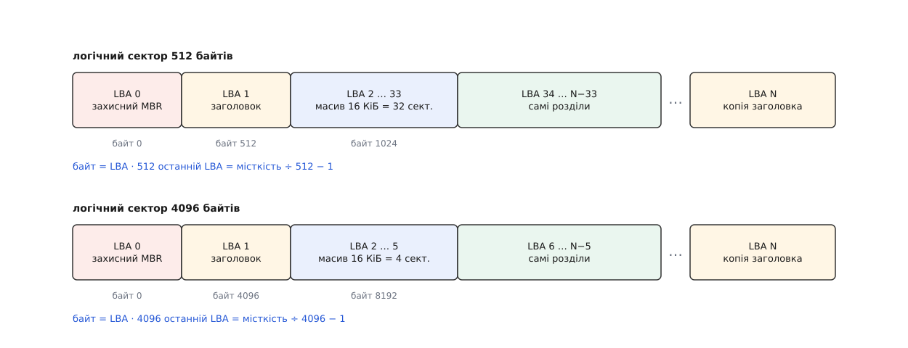

# ⚙️ Прочитати GPT власноруч: від підпису до переліку розділів

Напишемо програму, яка відкриває `/dev/sda` — або звичайний файл-образ — і друкує перелік розділів: межі, розмір, тип, назву. Без `lsblk`, без `libblkid`, без жодної бібліотеки, що знає про таблиці розділів. Інтерес тут не спортивний: усе, що робить ядро, розбираючи GPT, зводиться до двох читань і двох контрольних сум, і поки ці чотири дії лишаються чорною скринькою, «диск чомусь не бачиться» звучить як вирок, а не як діагноз.

## Порядок, у якому не можна переставити кроки

Заголовок GPT сам каже, де лежить решта таблиці: у ньому записано, з якого сектора починається масив записів, скільки їх і який завбільшки кожен. Виглядає як зручність — прочитав заголовок, узяв три числа, читаєш масив. Насправді це і є те місце, де програма-розбирач найлегше стає зброєю проти власної машини, бо всі три числа приходять із того самого носія, чию справність ми ще не перевіряли.

Звідси єдиний правильний порядок. Спершу підпис — вісім байтів `EFI PART` у секторі 1; не збігся, читати далі нема сенсу. Потім контрольна сума самого заголовка: беремо стільки байтів, скільки він сам про себе каже (поле `header_size`, зазвичай 92), обнулюємо в копії чотири байти поля суми — саме так її і рахували при записі, бо інакше значення залежало б від самого себе — і звіряємо. Тільки після цього числам із заголовка можна вірити, і аж тоді читати масив записів і рахувати другу суму, тепер уже по ньому.

Є ще одна перевірка, менш очевидна: заголовок мусить знати власне місце. У полі `my_lba` записано номер сектора, у якому він лежить; якщо взяли ми його з сектора 1, а він каже «я з сектора 976773167» — це не заголовок цього диска, а копія з іншого, і межі в ній чужі. Так само чинить ядро — у `block/partitions/efi.c` перевірка `my_lba` стоїть поруч із перевіркою суми.

Обидві суми — це [CRC32](book:communications/crc): короткий залишок від ділення потоку байтів на сталий поліном, який ловить будь-яку одиничну зміну й майже будь-яку групову. UEFI бере той самий різновид, що в Ethernet і `zlib`: відбитий поліном `0xEDB88320`, початкове значення з самих одиниць, наприкінці — інверсія. У ядрі це видно дослівно: `efi_crc32()` — це `crc32(~0L, buf, len) ^ ~0L`.

Не зійшлася сума — не здаємося: таблиця записана двічі, і другу копію заголовка кладуть у найостанніший сектор пристрою. Тому нам потрібна місткість, а не лише файл: номер останнього сектора — це `місткість ÷ розмір_сектора − 1`.

> 🔧 **Навіщо це.** Якщо повірити числам до перевірки суми, чотири байти поля `num_partition_entries` замовлять пам'ять під `4294967295 × 128` байтів — близько 512 ГіБ на одну вставлену флешку. Ядро тут обережне, а от саморобний розбирач падає на першому ж покаліченому носії. Тому і в нашому коді після перевірки суми стоїть ще й груба стеля на кількість записів: заголовок міг лишитися цілим, але безглуздим.

## Код

Основна мова тут — C: ідеться про сирі структури з диска, де важать точні зсуви й порядок байтів, а читати найзручніше через `pread`, який бере зсув окремим аргументом і не рухає поточної позиції у файлі. Другою вкладкою — той самий розбір на Python, коли треба швидко зазирнути у файл-образ і не хочеться нічого складати.

:::tabs
```c
/* gptdump.c — перелік розділів GPT із сирого пристрою або файлу-образу.
   Складання: cc -O2 -Wall -Wextra -o gptdump gptdump.c
   Запуск:    sudo ./gptdump /dev/sda        ./gptdump disk.img [розмір-сектора] */
#define _FILE_OFFSET_BITS 64     /* інакше на 32-бітній збірці зсув понад 2 ГіБ не читається */
#define _DEFAULT_SOURCE
#include <endian.h>
#include <errno.h>
#include <fcntl.h>
#include <inttypes.h>
#include <stddef.h>
#include <stdint.h>
#include <stdio.h>
#include <stdlib.h>
#include <string.h>
#include <sys/ioctl.h>
#include <sys/mount.h>          /* BLKSSZGET, BLKGETSIZE64 */
#include <sys/stat.h>
#include <unistd.h>

struct gpt_header {              /* рівно 92 байти на диску */
    char     signature[8];       /*  0  "EFI PART"                     */
    uint32_t revision;           /*  8                                 */
    uint32_t header_size;        /* 12  скільки байтів накриває сума   */
    uint32_t header_crc32;       /* 16  на час рахунку — нулі          */
    uint32_t reserved;           /* 20                                 */
    uint64_t my_lba;             /* 24  де лежить сам заголовок        */
    uint64_t alternate_lba;      /* 32  де лежить його копія           */
    uint64_t first_usable_lba;   /* 40                                 */
    uint64_t last_usable_lba;    /* 48                                 */
    uint8_t  disk_guid[16];      /* 56                                 */
    uint64_t entry_lba;          /* 72  сектор, з якого йде масив      */
    uint32_t num_entries;        /* 80                                 */
    uint32_t entry_size;         /* 84                                 */
    uint32_t array_crc32;        /* 88                                 */
} __attribute__((packed));
_Static_assert(sizeof(struct gpt_header) == 92, "без packed вийде 96");

struct gpt_entry {               /* рівно 128 байтів */
    uint8_t  type_guid[16];
    uint8_t  part_guid[16];
    uint64_t first_lba;
    uint64_t last_lba;           /* ВКЛЮЧНО */
    uint64_t attrs;
    uint8_t  name[72];           /* UTF-16LE, 36 знаків */
} __attribute__((packed));
_Static_assert(sizeof(struct gpt_entry) == 128, "запис мусить бути 128 байтів");

/* CRC32 з UEFI — той самий, що в Ethernet і zlib */
static uint32_t crc32_le(const void *buf, size_t len)
{
    const uint8_t *p = buf;
    uint32_t crc = 0xFFFFFFFFu;
    for (size_t i = 0; i < len; i++) {
        crc ^= p[i];
        for (int k = 0; k < 8; k++)
            crc = (crc >> 1) ^ (0xEDB88320u & (0u - (crc & 1u)));
    }
    return ~crc;
}

/* pread має право віддати менше, ніж просили, — дочитуємо */
static int read_exact(int fd, void *buf, size_t len, uint64_t off)
{
    uint8_t *p = buf;
    while (len) {
        ssize_t n = pread(fd, p, len, (off_t)off);
        if (n < 0) { if (errno == EINTR) continue; return -1; }
        if (n == 0) { errno = EIO; return -1; }        /* пристрій коротший, ніж обіцяв */
        p += n; off += (uint64_t)n; len -= (size_t)n;
    }
    return 0;
}

/* Логічний сектор і місткість: у пристрою питаємо ядро, у файлу беремо розмір */
static void geometry(int fd, uint32_t *ss, uint64_t *bytes)
{
    struct stat st;
    int lss = 0;
    *ss = 512; *bytes = 0;
    if (fstat(fd, &st) != 0) return;
    if (S_ISBLK(st.st_mode)) {
        if (ioctl(fd, BLKSSZGET, &lss) == 0 && lss > 0) *ss = (uint32_t)lss;
        if (ioctl(fd, BLKGETSIZE64, bytes) != 0) *bytes = 0;
    } else {
        *bytes = (uint64_t)st.st_size;
    }
}

/* Перші три поля GUID записані від молодшого байта, останні два — просто масив */
static void guid_str(const uint8_t *g, char *out)
{
    snprintf(out, 37, "%02X%02X%02X%02X-%02X%02X-%02X%02X-%02X%02X-%02X%02X%02X%02X%02X%02X",
             g[3], g[2], g[1], g[0], g[5], g[4], g[7], g[6],
             g[8], g[9], g[10], g[11], g[12], g[13], g[14], g[15]);
}

static void name_utf8(const uint8_t *src, char *dst, size_t cap)
{
    size_t o = 0;
    for (int i = 0; i < 36 && o + 4 < cap; i++) {
        uint32_t c = (uint32_t)src[2 * i] | ((uint32_t)src[2 * i + 1] << 8);
        if (c == 0) break;                                   /* назва скінчилася */
        if (c >= 0xD800 && c < 0xDC00 && i + 1 < 36) {        /* сурогатна пара */
            uint32_t lo = (uint32_t)src[2 * i + 2] | ((uint32_t)src[2 * i + 3] << 8);
            if (lo >= 0xDC00 && lo < 0xE000) {
                c = 0x10000 + ((c - 0xD800) << 10) + (lo - 0xDC00);
                i++;
            }
        }
        if (c < 0x80) {
            dst[o++] = (char)c;
        } else if (c < 0x800) {
            dst[o++] = (char)(0xC0 | (c >> 6));
            dst[o++] = (char)(0x80 | (c & 0x3F));
        } else if (c < 0x10000) {
            dst[o++] = (char)(0xE0 | (c >> 12));
            dst[o++] = (char)(0x80 | ((c >> 6) & 0x3F));
            dst[o++] = (char)(0x80 | (c & 0x3F));
        } else {
            dst[o++] = (char)(0xF0 | (c >> 18));
            dst[o++] = (char)(0x80 | ((c >> 12) & 0x3F));
            dst[o++] = (char)(0x80 | ((c >> 6) & 0x3F));
            dst[o++] = (char)(0x80 | (c & 0x3F));
        }
    }
    dst[o] = '\0';
}

/* Заголовок із сектора lba, перевірений цілком. 0 — не сходиться. */
static int read_header(int fd, uint64_t lba, uint32_t ss, struct gpt_header *out)
{
    uint8_t *sect = malloc(ss);
    int ok = 0;
    if (!sect) return 0;
    if (read_exact(fd, sect, ss, lba * (uint64_t)ss) == 0) {
        const struct gpt_header *h = (const struct gpt_header *)sect;
        uint32_t hsize = le32toh(h->header_size);
        if (memcmp(h->signature, "EFI PART", 8) == 0 &&
            hsize >= sizeof(*h) && hsize <= ss &&
            le64toh(h->my_lba) == lba) {
            uint32_t want = le32toh(h->header_crc32);
            memset(sect + offsetof(struct gpt_header, header_crc32), 0, 4);
            if (crc32_le(sect, hsize) == want) {
                memcpy(out, sect, sizeof(*out));
                ok = 1;
            }
        }
    }
    free(sect);
    return ok;
}

int main(int argc, char **argv)
{
    static const uint8_t zero[16] = { 0 };
    struct gpt_header h;
    const char *src = "основна";
    uint32_t ss, n, esz;
    uint64_t bytes, last;
    uint8_t *arr;
    size_t pt;
    char g[37], name[3 * 36 + 1];
    int fd;

    if (argc < 2) {
        fprintf(stderr, "вжиток: %s <пристрій|образ> [розмір-сектора]\n", argv[0]);
        return 2;
    }
    if ((fd = open(argv[1], O_RDONLY)) < 0) { perror(argv[1]); return 1; }

    geometry(fd, &ss, &bytes);
    if (argc > 2) ss = (uint32_t)strtoul(argv[2], NULL, 10);
    if (ss < 512 || bytes < 3 * (uint64_t)ss) {
        fprintf(stderr, "неправдоподібна геометрія: сектор %" PRIu32 ", місткість %" PRIu64 "\n",
                ss, bytes);
        return 1;
    }
    last = bytes / ss - 1;

    if (!read_header(fd, 1, ss, &h)) {                 /* основна копія не зійшлася */
        src = "РЕЗЕРВНА";
        if (!read_header(fd, last, ss, &h)) {
            fprintf(stderr, "GPT не знайдено: жодна з копій не сходиться\n");
            return 1;
        }
    }

    n = le32toh(h.num_entries);
    esz = le32toh(h.entry_size);
    if (n == 0 || n > 4096 || esz < sizeof(struct gpt_entry) || esz % 128) {
        fprintf(stderr, "неправдоподібний масив: %" PRIu32 " × %" PRIu32 "\n", n, esz);
        return 1;
    }
    pt = (size_t)n * esz;
    if (!(arr = malloc(pt))) { fprintf(stderr, "мало пам'яті\n"); return 1; }
    if (read_exact(fd, arr, pt, le64toh(h.entry_lba) * (uint64_t)ss) != 0) {
        perror("масив записів");
        return 1;
    }
    if (crc32_le(arr, pt) != le32toh(h.array_crc32)) {
        fprintf(stderr, "CRC32 масиву записів не сходиться\n");
        return 1;
    }

    guid_str(h.disk_guid, g);
    printf("сектор %" PRIu32 " Б · останній LBA %" PRIu64 " · копія таблиці: %s\n", ss, last, src);
    printf("диск %s · записів %" PRIu32 " по %" PRIu32 " Б\n\n", g, n, esz);

    for (uint32_t i = 0; i < n; i++) {
        const struct gpt_entry *e = (const struct gpt_entry *)(arr + (size_t)i * esz);
        uint64_t a, b;
        if (memcmp(e->type_guid, zero, 16) == 0) continue;    /* порожній запис */
        a = le64toh(e->first_lba);
        b = le64toh(e->last_lba);
        guid_str(e->type_guid, g);
        name_utf8(e->name, name, sizeof(name));
        printf("%2" PRIu32 " %10" PRIu64 " %10" PRIu64 " %9.1f МіБ  %s  %s\n",
               i + 1, a, b, (double)(b - a + 1) * ss / 1048576.0, g, name);
    }

    free(arr);
    close(fd);
    return 0;
}
```
```py
#!/usr/bin/env python3
"""gpt.py — перелік розділів GPT із файлу-образу або блокового пристрою.
   Запуск: sudo ./gpt.py /dev/sda      ./gpt.py disk.img [розмір-сектора]"""
import fcntl, os, stat, struct, sys, uuid, zlib

HDR = "<8sIIII QQQQ 16s Q III"          # 92 байти заголовка
ENT = "<16s16s QQQ 72s"                 # 128 байтів одного запису
BLKSSZGET, BLKGETSIZE64 = 0x1268, 0x80081272


def geometry(f):
    """У пристрою сектор і місткість питаємо в ядра, у файлу — беремо розмір."""
    st = os.fstat(f.fileno())
    if stat.S_ISBLK(st.st_mode):
        ss = struct.unpack("i", fcntl.ioctl(f, BLKSSZGET, b"\0" * 4))[0]
        size = struct.unpack("Q", fcntl.ioctl(f, BLKGETSIZE64, b"\0" * 8))[0]
        return ss, size
    return 512, st.st_size


def read_header(f, lba, ss):
    """Прочитати й перевірити заголовок у секторі lba. Не сходиться — None."""
    f.seek(lba * ss)
    sect = f.read(ss)
    if len(sect) < 92 or sect[:8] != b"EFI PART":
        return None
    (_sig, _rev, hsize, hcrc, _res, my, alt, first, last,
     disk, ent_lba, n, esz, acrc) = struct.unpack_from(HDR, sect)
    if not 92 <= hsize <= ss:
        return None
    body = bytearray(sect[:hsize])
    body[16:20] = b"\0\0\0\0"                   # поле суми на час рахунку — нулі
    if zlib.crc32(body) & 0xFFFFFFFF != hcrc:
        return None
    if my != lba:                               # заголовок мусить знати власне місце
        return None
    return dict(alt=alt, first=first, last=last, disk=uuid.UUID(bytes_le=disk),
                ent_lba=ent_lba, n=n, esz=esz, acrc=acrc)


def read_entries(f, h, ss):
    if h["esz"] < 128 or h["esz"] % 128 or not 0 < h["n"] <= 4096:
        raise ValueError("неправдоподібні розміри масиву записів")
    f.seek(h["ent_lba"] * ss)
    raw = f.read(h["n"] * h["esz"])
    if len(raw) != h["n"] * h["esz"]:
        raise ValueError("масив записів обірвано")
    if zlib.crc32(raw) & 0xFFFFFFFF != h["acrc"]:
        raise ValueError("CRC32 масиву записів не сходиться")
    for i in range(h["n"]):
        tg, pg, a, b, attrs, nm = struct.unpack_from(ENT, raw, i * h["esz"])
        if tg == b"\0" * 16:                    # порожній запис
            continue
        yield i + 1, uuid.UUID(bytes_le=tg), uuid.UUID(bytes_le=pg), a, b, attrs, \
            nm.decode("utf-16-le").split("\0")[0]


def main(path, ss_arg=0):
    with open(path, "rb") as f:
        ss, size = geometry(f)
        ss = ss_arg or ss
        last = size // ss - 1
        h, src = read_header(f, 1, ss), "основна"
        if h is None:                           # основна копія не зійшлася
            h, src = read_header(f, last, ss), "РЕЗЕРВНА"
        if h is None:
            sys.exit("GPT не знайдено: жодна з копій не сходиться")
        print("сектор %d Б · останній LBA %d · копія таблиці: %s" % (ss, last, src))
        print("диск %s · записів %d по %d Б\n" % (str(h["disk"]).upper(), h["n"], h["esz"]))
        for n, tg, pg, a, b, attrs, name in read_entries(f, h, ss):
            mib = (b - a + 1) * ss / 1048576.0   # останній сектор — ВКЛЮЧНО
            print("%2d %10d %10d %9.1f МіБ  %s  %s" % (n, a, b, mib, str(tg).upper(), name))


if __name__ == "__main__":
    main(sys.argv[1], int(sys.argv[2]) if len(sys.argv) > 2 else 0)
```
:::

## Що воно каже

Пробувати краще на образі, а не на робочому диску: файл, розмічений `sgdisk`, для нашої програми нічим не відрізняється від пристрою — а якщо потрібен справжній вузол у `/dev`, той самий файл підставляє [loop-пристрій](book:unix-linux/loop-device), який усе читання й запис пересилає у файл. Ось вивід на образі, зібраному для перевірки:

```
сектор 512 Б · останній LBA 131071 · копія таблиці: основна
диск 8FD49EBA-EF69-4037-84A7-7B890574AE31 · записів 128 по 128 Б

 1         34       2081       1.0 МіБ  C12A7328-F81F-11D2-BA4B-00A0C93EC93B  EFI System
 2       2082       6177       2.0 МіБ  0657FD6D-A4AB-43C4-84E5-0933C84B4F4F  swap
 3       6178     131038      61.0 МіБ  4F68BCE3-E8CD-4DB1-96E7-FBCAF984B709  корінь системи
```

Перший розділ починається з сектора 34, бо 32 сектори пішли під масив записів, ще два — під захисний MBR і заголовок. GUID типу в третьому рядку означає не «ext4» і не «файлова система»: це роль «корінь для x86-64» із [Discoverable Partitions Specification](https://uapi-group.org/specifications/specs/discoverable_partitions_specification/), за якою `systemd` знаходить корінь без `/etc/fstab`.

А тепер найцікавіше — зіпсуємо в образі один-єдиний байт усередині основного заголовка й запустимо ще раз:

```
сектор 512 Б · останній LBA 131071 · копія таблиці: РЕЗЕРВНА
диск 8FD49EBA-EF69-4037-84A7-7B890574AE31 · записів 128 по 128 Б

 1         34       2081       1.0 МіБ  C12A7328-F81F-11D2-BA4B-00A0C93EC93B  EFI System
 2       2082       6177       2.0 МіБ  0657FD6D-A4AB-43C4-84E5-0933C84B4F4F  swap
 3       6178     131038      61.0 МіБ  4F68BCE3-E8CD-4DB1-96E7-FBCAF984B709  корінь системи
```

Змінилося одне слово в першому рядку — межі, розміри й типи ті самі, бо взято їх із другої копії. Заради цієї миті все й затівалося: одна арифметична дія над байтами відрізняє «цілу таблицю» від «правдоподібного сміття», і ніякого іншого захисту в розмітки немає. Зіпсований байт при цьому лежав у полі `first_usable_lba` — числі, яке жоден із трьох розділів не використовує; сума впіймала його однаково, бо накриває заголовок цілком.

## Пастки

**Структура на диску й структура в пам'яті — різні речі.** Поля заголовка закінчуються на 92-му байті, але компілятор вирівнює розмір усієї структури на 8, бо всередині є `uint64_t`, — і `sizeof` без `packed` тихо дає 96. Жоден зсув усередині від цього не з'їде, все читатиметься правильно, і зламається рівно одне: сума, порахована по `sizeof(...)` замість `header_size`. Тому в коді стоять `__attribute__((packed))` і `_Static_assert` — щоб хибне число впало на складанні, а не через півроку на чужому диску. Загальне правило [вирівнювання полів](book:programming/memory-alignment) працює проти нас щоразу, коли структура описує зовнішній формат.

**Числа на диску — молодшим байтом уперед.** Усі поля GPT записані в [порядку від молодшого байта](book:programming/bits-bytes-endianness), тож на x86 їх можна читати «як є» — і саме тому помилку не видно роками, доки код не потрапить на big-endian машину. `le32toh`/`le64toh` на x86 не коштують нічого й розгортаються в порожнє місце, а на іншій архітектурі рятують. GUID до цього правила має власну примху: перші три поля записані від молодшого байта, останні вісім — просто масив, тож надрукований підряд він виглядатиме правдоподібно й буде неправильним.

**Сектор не завжди 512.** Це головна причина, чому в коді немає жодної константи 512 у розрахунках зсувів: усі числа в таблиці — номери секторів, а байтовий зсув виходить множенням на логічний розмір блока, який дає `BLKSSZGET`. На накопичувачі з логічним сектором 4096 заголовок так само лежить у секторі 1 — але це вже 4096-й байт, масив займає не 32 сектори, а чотири, і перший придатний сектор виявляється шостим, а не тридцять четвертим.



*Таблиця скрізь однакова, арифметика — ні: заголовок завжди в LBA 1, але це 512-й байт на одному пристрої й 4096-й на іншому.*

**Читання буферизоване й читання пряме — різні вимоги.** Наш `pread` іде через кеш сторінок, і ядро дозволяє йому будь-який зсув і будь-яку довжину. Але щойно до `open` додається `O_DIRECT` — а це доречно, коли треба гарантовано побачити носій, а не залишки чужого кешу, — [прямий ввід-вивід](book:unix-linux/buffered-and-direct-io) вимагає, щоб зсув, довжина й **адреса буфера** ділилися на логічний розмір блока; буфер тоді беруть через `posix_memalign`. Ядро перевіряє це одним виразом і на невиконання відповідає `EINVAL`, без пояснень.

**Останній сектор — включно.** У записі лежить не довжина, а номер останнього сектора, і він належить розділу. Розмір — це `(last − first + 1) × сектор`; забута одиниця дає помилку рівно в один сектор, яку ніхто не помічає, поки не порівняє свої числа з `blockdev --getsz`.

**Шістдесят чотири біти прапорців ми прочитали й не показали.** Дарма: саме там лежить відповідь на питання, чому розділ змонтувався тільки для читання або не змонтувався взагалі. Молодші біти визначає UEFI — нульовий позначає розділ, потрібний самій платформі, тож форматувати його не можна, а другий лишили під завантаження в режимі BIOS. Старші шістнадцять віддані типові розділу, і для тих типів, які шукає `systemd`, значення записані в [Discoverable Partitions Specification](https://uapi-group.org/specifications/specs/discoverable_partitions_specification/): біт 63 забороняє автоматичне монтування, біт 60 монтує лише для читання, біт 59 просить розтягнути файлову систему на весь розділ. Додати до виводу один шістнадцятковий стовпчик — робота на два рядки, а користі від нього більше, ніж від назви.

## Коли не сходиться жодна копія

Цінність чотирьох перевірок не в тому, що вони друкують розділи, а в тому, що кожна невдача називає свою причину.

Немає підпису ні в секторі 1, ні в останньому — байти на місці, але не ті. Або перші сектори перезаписали чужим: `mkfs` на цілий диск, `dd` з образу, необережний установник. Або з диском усе гаразд, а помилилися ми — узяли не той розмір сектора, і читаємо байт 512 там, де заголовок лежить із 4096-го; це перевіряється швидше за все інше, командою `blockdev --getss`.

Підпис є, а сума заголовка не сходиться — зіпсовано лічені байти в самому заголовку, і резервна копія майже напевно ціла: це 92 байти на протилежному кінці диска, куди одна локальна аварія не дістає. Заголовок цілий, а не сходиться сума масиву — побито вже записи, і рятує та сама друга копія, бо масив продубльовано разом із заголовком.

Мовчать обидві копії — таблиці немає, і жоден інструмент розмітки її не поверне. Далі шукають не таблицю, а самі файлові системи: `wipefs -n` показує всі знайдені на пристрої підписи, не чіпаючи їх, а відновлювачі на кшталт `testdisk` перебирають сектори в пошуках суперблоків і будують межі з того, що лежить усередині розділів.

## Скільки це коштує

Уся робота — два читання: один сектор і 16 КіБ масиву. Далі CRC32 по 92 байтах заголовка, CRC32 по 16384 байтах масиву й цикл на 128 кроків. Ані місткість диска, ані кількість розділів на це не впливають: розбір таблиці на терабайтному накопичувачі коштує рівно стільки ж, скільки на флешці, — частки мілісекунди й жодного звертання за межі перших тридцяти чотирьох секторів, поки з ними все гаразд.

Найдешевший спосіб переконатися, що розбір правильний, — звірити вивід із `sgdisk -p` і `blkid`. Якщо числа збіглися до сектора, лишається вміння, якого не дає жоден інструмент: там, де `parted` каже «таблиця пошкоджена», відмовила одна конкретна перевірка з чотирьох — і тепер зрозуміло, яка саме й що з нею робити.
