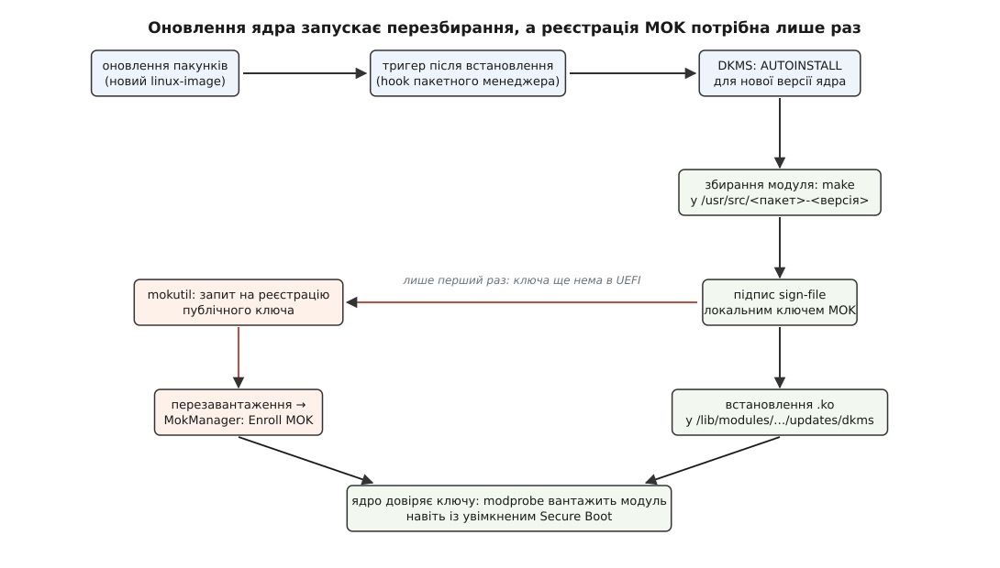

# DKMS: перезбирання й підписування позадеревних модулів під кожне ядро

<preknowlist>
- [Модулі ядра](topic:unix-linux/kernel-modules) — що таке файл `.ko`, як його завантажують (`modprobe`) і вивантажують (`rmmod`).
- [Ланцюг завантаження](topic:unix-linux/boot-chain) — коли і як ядро отримує керування та ініціалізує обладнання.
- [Конфігурація й збірка ядра](topic:unix-linux/kernel-config-and-build) — дерево вихідних кодів ядра і різниця між модулем усередині дерева (in-tree) та поза ним (out-of-tree).
- [Підпис модулів ядра](topic:unix-linux/module-signing) — чому ядро відмовляється вантажити код без довіреного підпису.
- [Secure Boot](topic:unix-linux/secure-boot) — перевірений ланцюг завантаження UEFI і перевірка цифрових підписів.
</preknowlist>

Уявіть ситуацію: ви щойно налаштували ідеальну робочу станцію з відеокартою NVIDIA (закритого коду) або розгорнули масив ZFS для зберігання даних. Усе працює чудово, продуктивність на висоті. Через кілька тижнів ваш пакетний менеджер (`apt`, `dnf` або `pacman`) пропонує оновити систему, зокрема встановити нове ядро Linux, що містить важливі виправлення безпеки. Ви погоджуєтеся, перезавантажуєте комп'ютер... і вас зустрічає чорний екран або повідомлення про те, що дисковий пул не знайдено. Що сталося? Проблема в тому, що драйвер NVIDIA або модуль ZFS збиралися спеціально для попередньої версії ядра (наприклад, `6.5.0-41-generic`). Нове ядро (`6.5.0-42-generic`) відмовляється завантажувати модулі, скомпільовані для іншої версії. Щоб не лишати цю прикру, але типову ситуацію на плечах адміністратора, в екосистемі Linux з'явився механізм автоматизації — **DKMS**.

## Що таке DKMS і як він вирішує проблему

**DKMS** (Dynamic Kernel Module Support) — це фреймворк, який дозволяє автоматично перезбирати сторонні (out-of-tree) модулі ядра при кожному оновленні або зміні версії ядра в системі.

Традиційний підхід полягав би в тому, щоб після кожного оновлення ядра адміністратор вручну заходив у теку з вихідним кодом драйвера, запускав `make clean`, `make`, а потім `make install`. Це не лише дратує, а й критично знижує надійність системи (якщо графічне середовище залежить від модуля, користувач навіть не зможе нормально завантажитись, щоб виконати ці команди).

DKMS інтегрується в систему на рівні пакетного менеджера або хуків (hooks) оновлення ядра. Коли встановлюється новий пакунок `linux-image` (або еквівалентний), тригер викликає DKMS, який знаходить усі зареєстровані вихідні коди сторонніх модулів і прозоро компілює їх для нового ядра ще *до* того, як відбудеться перезавантаження.

### Архітектура та принцип роботи

Життєвий цикл модуля в DKMS складається з чітко визначених станів:

1. **Source (Вихідні коди)**: Вихідні коди модуля лежать у системі, зазвичай у `/usr/src/<module>-<version>/`. Там само обов'язково лежить файл конфігурації `dkms.conf`.
2. **Added (Додано)**: Модуль зареєстровано в базі даних DKMS. DKMS знає про його існування, але ще не збирав.
3. **Built (Зібрано)**: Модуль скомпільовано для певної версії ядра (і певної архітектури).
4. **Installed (Встановлено)**: Скомпільований файл `.ko` скопійовано у відповідну теку модулів ядра (зазвичай `/lib/modules/<kernel-version>/updates/dkms/`) і готовий до завантаження.

Цим станам відповідають команди, які приймає утиліта `dkms` (add, build, install, uninstall, remove).

## Конфігурація: анатомія `dkms.conf`

Щоб DKMS міг працювати з вихідним кодом модуля, йому потрібні інструкції. Вони містяться у файлі `dkms.conf`. Це звичайний текстовий файл: DKMS підключає його через `source`, тож усередині — просто присвоєння змінних у синтаксисі shell.

Розглянемо базовий приклад `dkms.conf` для гіпотетичного драйвера `my_device_driver` версії `1.0`:

```bash
PACKAGE_NAME="my_device_driver"
PACKAGE_VERSION="1.0"

# Описуємо, скільки модулів збирається і як вони називаються
BUILT_MODULE_NAME[0]="my_device"
# Вказуємо шлях, куди встановити зібраний модуль всередині /lib/modules/...
DEST_MODULE_LOCATION[0]="/kernel/drivers/misc"

# Опціонально: автоматично встановлювати при завантаженні системи/оновленні ядра
AUTOINSTALL="yes"

# Команда для збирання. Якщо не вказана, за замовчуванням виконується make
MAKE[0]="make -C $kernel_source_dir M=$dkms_tree/$PACKAGE_NAME/$PACKAGE_VERSION/build"
# Команда для очищення
CLEAN="make -C $kernel_source_dir M=$dkms_tree/$PACKAGE_NAME/$PACKAGE_VERSION/build clean"
```

### Ключові параметри:
- `PACKAGE_NAME` та `PACKAGE_VERSION`: Обов'язкові змінні, що ідентифікують модуль.
- `BUILT_MODULE_NAME[i]`: Назва згенерованого `.ko` файлу (без розширення). Якщо проєкт компілює кілька модулів, використовуються масиви (`[0]`, `[1]`, і т.д.).
- `DEST_MODULE_LOCATION[i]`: Шлях у структурі `/lib/modules/$kernel_version/`, куди слід скопіювати файл (хоча часто сучасний DKMS ігнорує це і кладе все в `/updates/dkms/`).
- `AUTOINSTALL="yes"`: Вкрай важлива опція. Саме вона каже скриптам-тригерам, що запускаються при оновленні ядра: "Так, цей модуль треба автоматично зібрати і встановити для нового ядра".

## Робота з утилітою DKMS (CLI)

Зазвичай DKMS працює непомітно у фоні під час встановлення пакетів `apt` чи `dnf`. Проте адміністратору часто потрібно втручатись вручну, особливо при розробці власного драйвера або при усуненні несправностей.

Подивитися поточний стан усіх відомих DKMS модулів:

```bash
$ dkms status
nvidia, 535.183.01, 6.8.0-35-generic, x86_64: installed
nvidia, 535.183.01, 6.8.0-36-generic, x86_64: installed
zfs, 2.2.2, 6.8.0-35-generic, x86_64: installed
zfs, 2.2.2, 6.8.0-36-generic, x86_64: installed
my_device_driver, 1.0: added
```

Як бачимо, драйвери `nvidia` та `zfs` встановлені для двох версій ядер. А от наш `my_device_driver` лише `added` (доданий, але не зібраний).

Пройдемо цикл ручного встановлення:

1. **Додавання** (якщо вихідні коди ще не в `/usr/src`): Зазвичай адміністратор копіює теку самостійно `sudo cp -R ./my_device_driver-1.0 /usr/src/`, а потім викликає:
   `sudo dkms add -m my_device_driver -v 1.0`

2. **Збирання**:
   `sudo dkms build -m my_device_driver -v 1.0 -k 6.8.0-36-generic`
   *(Якщо не вказати `-k`, DKMS візьме версію поточного запущеного ядра, що повертає `uname -r`)*.

3. **Встановлення**:
   `sudo dkms install -m my_device_driver -v 1.0 -k 6.8.0-36-generic`
   Тепер `dkms status` покаже `installed`. Модуль можна завантажувати через `modprobe`.

4. **Видалення** (щоб очистити систему):
   `sudo dkms uninstall -m my_device_driver -v 1.0` (видаляє зібраний `.ko` з теки ядра, статус стає `built`).
   `sudo dkms remove -m my_device_driver -v 1.0 --all` (повністю стирає з бази DKMS і видаляє скомпільовані файли).

## Проблема Secure Boot і підписування модулів (MOK)

Найбільший головний біль під час використання DKMS у сучасних системах виникає через **Secure Boot**. Ця технологія (що є частиною UEFI) створена для того, щоб не дозволити зловмисному коду завантажитись на етапі старту ОС.

У дистрибутивному ядрі увімкнений Secure Boot переводить систему в режим lockdown, і ядро *відмовляється* завантажувати будь-які модулі (файли `.ko`), які не мають криптографічного цифрового підпису, що відповідає ключу, якому довіряє саме ядро. Модулі перевіряє не UEFI: його справа — довести керування до ядра, а підписи `.ko` звіряє вже ядро, і тільки якщо зібране з примусовою перевіркою.

Усі "in-tree" модулі підписані ключами розробників дистрибутива (наприклад, ключем Canonical для Ubuntu), і сертифікат цього ключа вшитий у ядро. Але коли DKMS локально на вашому комп'ютері збирає "out-of-tree" модуль (той же драйвер NVIDIA), він не має доступу до приватного ключа Canonical, щоб підписати його! Отже, ядро заблокує завантаження цього свіжозібраного модуля з помилкою типу `Lockdown: modprobe: unsigned module loading is restricted`.

### Як DKMS вирішує це через Machine Owner Key (MOK)

Щоб обійти цю проблему легальним і безпечним шляхом, існує механізм MOK (Ключ власника машини).

1. **Генерація ключа**: Якщо система бачить увімкнений Secure Boot, під час встановлення DKMS-пакета (наприклад, драйвера) генерується локальна пара RSA-ключів (публічний і приватний). Зазвичай вони лежать у `/var/lib/shim-signed/mok/`.
2. **Підписування**: DKMS конфігурується так, щоб після кожної локальної компіляції викликати утиліту (зазвичай `scripts/sign-file` із пакета заголовків ядра), яка підписує новий модуль щойно згенерованим приватним ключем.
3. **Реєстрація MOK**: Система (через утиліту `mokutil`) подає запит в інфраструктуру завантаження `shim` на реєстрацію вашого нового публічного ключа. Оскільки це дія, яка порушує периметр безпеки, її *неможливо* виконати суто зсередини запущеної ОС. Користувачу пропонується придумати тимчасовий пароль.
4. **MokManager під час перезавантаження**: При наступному перезавантаженні комп'ютера (ще до старту Linux, на рівні UEFI) завантажувач `shim` перехоплює керування, бачить запит на новий ключ і запускає синій екран **MokManager**. Користувач повинен фізично сидіти за клавіатурою, вибрати `Enroll MOK`, ввести раніше придуманий пароль і підтвердити реєстрацію ключа. Це доводить, що ключ додає реальний "власник машини" (через фізичну присутність), а не віддалений вірус.

Реєстрація MOK засвідчує ключ на рівні завантаження — але звідси ще не випливає, що його прийме саме ядро. Ключі з MOK ядро складає в кільце `.platform`, а воно, за описом у `security/integrity/Kconfig`, заведене «для перевірки образу ядра, завантаженого через `kexec`, і, можливо, підпису початкового образу пам'яті» — при завантаженні модулів його не опитують. Розрив закрили у ядрі **5.18** (2022): там з'явилося окреме кільце `.machine` (`CONFIG_INTEGRITY_MACHINE_KEYRING`, той самий `Kconfig`), прив'язане до `.secondary_trusted_keys`, — і лише через нього MOK починає важити при [перевірці підписів модулів](topic:unix-linux/module-signing). З ядра 6.4 є ще й вимикач `CONFIG_INTEGRITY_CA_MACHINE_KEYRING`: коли він увімкнений, у `.machine` пускають тільки ключі з ознакою центру сертифікації, решта MOK лишаються в `.platform` — тобто марними для модулів.

Дистрибутиви, на які й розраховані описані вище скрипти, мали цю довіру задовго до 5.18 — власними патчами: Ubuntu давно вносить ключі MOK у `.secondary_trusted_keys` і довіряє цьому кільцю при перевірці модулів, а сучасні збірки Ubuntu й Fedora тримають уже штатний `CONFIG_INTEGRITY_MACHINE_KEYRING`. Тому на дистрибутивному ядрі усі модулі, які DKMS буде перезбирати й підписувати цим локальним ключем — у тому числі при майбутніх оновленнях ядра, — вантажитимуться без додаткових запитів пароля в UEFI. А от на самостійно зібраному ванільному ядрі, старішому за 5.18 або зібраному без `CONFIG_INTEGRITY_MACHINE_KEYRING`, сама лише реєстрація MOK підпису модулів не рятує: ключ буде в UEFI, а ядро його все одно не спитає.

*(Примітка: У деяких дистрибутивах DKMS потрібно явно налаштовувати на підписування, додаючи команди в `dkms.conf`, але в сучасних Ubuntu/Fedora скрипти DKMS визначають наявність ключів MOK і виконують підпис автоматично).*


*Оновлення пакунка з ядром запускає тригер, а далі DKMS сам проходить збирання, підпис і встановлення. Гілка MOK (червона) відгалужується лише перший раз: поки публічного ключа немає в UEFI, його реєструють через `mokutil` і синій екран MokManager при перезавантаженні.*

## Підсумок

Без DKMS екосистема сторонніх модулів Linux була б суцільним жахом ручного обслуговування після кожного оновлення ядра. Завдяки інкапсуляції етапів (add, build, install) і надійній інтеграції з пакетними менеджерами та системою підписування MOK, використання закритих графічних драйверів, специфічних файлових систем або модулів віртуалізації стало стабільним і майже непомітним для пересічного адміністратора.
