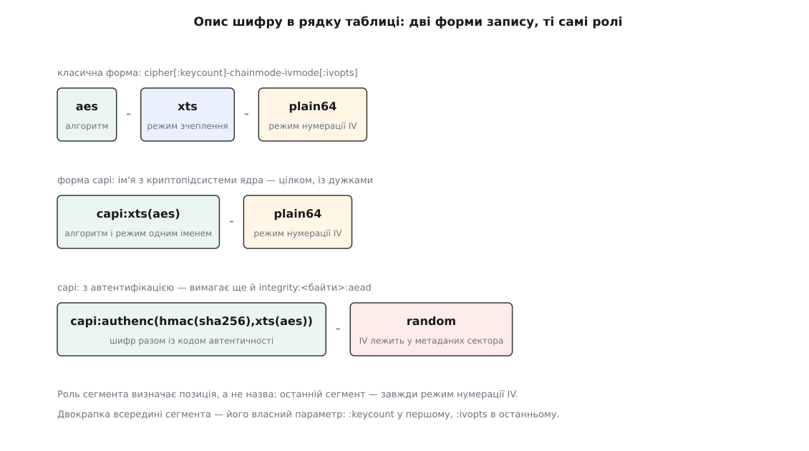

# 📋 Рядок таблиці цілі crypt: шифр, ключ, прапорці

Повна граматика аргументів цілі `crypt` — усе, що взагалі можна написати в її рядку таблиці, і що кожне слово означає для ядра. Потрібно це в трьох випадках: прочитати чужий вивід `dmsetup table`, зібрати шифрований пристрій без cryptsetup або зрозуміти, який саме рядок cryptsetup склав за вашими ключами командного рядка. Звірено з `drivers/md/dm-crypt.c`, документацією ядра `admin-guide/device-mapper/dm-crypt` і сторінками `cryptsetup-open(8)` / `cryptsetup-luksFormat(8)`.

## Рядок цілком

```
<шифр> <ключ> <зсув IV> <пристрій> <зсув> [<к-сть опцій> <опції>…]
```

П'ять полів обов'язкові й позиційні, хвіст — необов'язковий і влаштований так само, як у решти цілей [device mapper](topic:unix-linux/device-mapper): спершу число, потім рівно стільки слів.

| поле | одиниця | що означає |
| --- | --- | --- |
| `<шифр>` | рядок | алгоритм, режим зчеплення й режим нумерації IV — разом, однією з двох граматик нижче |
| `<ключ>` | шістнадцятково або посилання | сам матеріал ключа; довжину ядро бере з довжини цього поля, окремого параметра розміру немає |
| `<зсув IV>` | сектори по 512 Б | число, яке додається до номера сектора **перед** тим, як із нього зроблять IV |
| `<пристрій>` | шлях або `<старший>:<молодший>` | носій із шифротекстом |
| `<зсув>` | сектори по 512 Б | з якого сектора носія починаються зашифровані дані |

Два «зсуви» в одному рядку — різні речі, і переплутати їх означає не відкрити том. `<зсув>` зміщує **дані**: сектор 0 нашого пристрою лежить на носії за цим номером. `<зсув IV>` зміщує **нумерацію**: він не рухає жодного байта, лише міняє число, що входить у шифр. У томі LUKS перший дорівнює довжині заголовка, а другий — нулю, бо нумерація починається наново від початку даних.

Необов'язкових аргументів ядро приймає **не більше дев'яти** — так оголошено обмеження в конструкторі цілі:

```c
static const struct dm_arg _args[] = {
        {0, 9, "Invalid number of feature args"},
};
```

## Опис шифру: дві граматики

```
cipher[:keycount]-chainmode-ivmode[:ivopts]      класична форма
capi:<ім'я з криптопідсистеми ядра>-ivmode[:ivopts]
```



*Роль сегмента задає позиція, а не назва: останній сегмент — завжди режим нумерації IV. Усе, що стоїть перед ним у формі `capi:`, ядро не розбирає — воно передає це ім'я криптопідсистемі як є.*

Класична форма зручна, але описує лише те, що складається з трьох частин у сталому порядку. Форма `capi:` знімає це обмеження: після префікса йде **ім'я алгоритму так, як його розуміє [криптографічна підсистема ядра](topic:unix-linux/kernel-crypto-api)**, разом із дужками й вкладеністю. Це єдиний спосіб дістатися до конструкцій, у яких шифрування поєднане з автентифікацією.

| запис | що вийде |
| --- | --- |
| `aes-xts-plain64` | звичайний вибір для LUKS2 |
| `aes-cbc-essiv:sha256` | давніший вибір; `sha256` тут — параметр режиму нумерації, не шифру |
| `capi:xts(aes)-plain64` | те саме, що перший рядок, іншими словами |
| `capi:gcm(aes)-random` | автентифіковане шифрування, вимагає `integrity:<байти>:aead` |
| `capi:authenc(hmac(sha256),xts(aes))-random` | шифр і код автентичності окремими алгоритмами |
| `capi:rfc7539(chacha20,poly1305)-random` | потокова пара замість блокового шифру |

Необов'язковий `:keycount` після назви алгоритму вмикає **багатоключовий режим сумісності**: у полі ключа лежить стільки ключів підряд, і сектор шифрується тим із них, який відповідає його номерові. Ця можливість лишилася в рядку рівно для того, щоб читати томи loop-AES, де ключів шістдесят чотири.

## Режими нумерації IV

Останній сегмент вирішує, що саме подають шифрові як відмінність між секторами. Половина цього списку існує заради сумісності з чужими форматами, і братися за неї варто тільки тоді, коли треба відкрити готовий том.

| режим | що подають | коли вживають |
| --- | --- | --- |
| `plain` | номер сектора, 32 біти, молодшим байтом уперед | старі томи; за 2 ТіБ номер переповнюється й повторюється |
| `plain64` | те саме, 64 біти | сучасний вибір за замовчуванням |
| `plain64be` | 64 біти, старшим байтом уперед, у **кінці** буфера | сумісність із чужими реалізаціями |
| `essiv` | номер сектора, зашифрований ключем, похідним від головного через хеш у `:ivopts` | CBC-томи; робить IV непередбачуваним |
| `benbi` | лічильник «вузьких блоків», що починається з одиниці, старшим байтом уперед | режим LRW |
| `null` | самі нулі | сумісність із застарілим loop_fish2 |
| `lmk` | схема loop-AES: IV виводять із сектора й окремого ключа | читання томів loop-AES |
| `tcw` | схема TrueCrypt до версії 4.1: IV із ключа й номера плюс вибілювання через CRC32 | читання старих томів TrueCrypt |
| `eboiv` | зашифрований зсув у байтах | сумісність із BitLocker у режимі CBC |
| `elephant` | те саме плюс дифузор Elephant | сумісність із BitLocker |
| `random` | свіжі випадкові байти на кожен запис | **лише** з автентифікованим шифруванням |

`random` вибивається з ряду й пояснює, чому решта режимів узагалі виглядає так дивно. Випадковий IV не можна відтворити при читанні — його доводиться десь зберегти, а вільного місця в секторі немає. Тому цей режим працює тільки тоді, коли під сектором є місце під метадані: ядро тоді забирає під IV частину того самого поля, куди лягає код автентичності. Усі інші режими виводять IV із номера сектора саме тому, що зберігати їм ніде — це не вибір криптографа, а наслідок [обіцянки блокового пристрою](topic:unix-linux/block-device-model) не міняти довжини.

## Ключ

| форма | приклад | зауваження |
| --- | --- | --- |
| шістнадцятково | `babebabebabebabebabebabebabebabe` | дві цифри на байт; довжина поля і є довжиною ключа |
| посилання на кільце | `:32:logon:cryptsetup:my_key` | `:<байтів>:<тип>:<опис>` — розмір **у байтах**, опис може містити двокрапки |
| `-` | `-` | ключа немає (нульова довжина) — так виглядає ціль, у якої ключ вилучили |

Типи ключа — `logon`, `user`, а за наявності відповідних параметрів збірки ядра ще `encrypted` і `trusted`. Сенс форми з посиланням у тому, що ключ бере з [кільця ключів ядра](topic:unix-linux/kernel-keyrings) саме ядро: у рядку таблиці лежить лише ім'я, тож ключ не проходить ані через аргументи процесу, ані через вивід `dmsetup`.

Розмір ключа для XTS **подвійний**: режим бере два ключі, один на дані й один на номер сектора. Тому `aes-xts-plain64` із 512-бітним ключем — це AES-256, а не AES-512; чому саме так, розібрано в темі про [AES-XTS](topic:programming/aes-xts).

## Прапорці

| прапорець | дія | від якого ядра |
| --- | --- | --- |
| `allow_discards` | пропускати запити `discard` крізь шифр | 3.1 |
| `same_cpu_crypt` | шифрувати на тому ж процесорі, що подав запит, а не в незакріпленій черзі | — |
| `submit_from_crypt_cpus` | не передавати запис окремому потокові після шифрування | — |
| `no_read_workqueue` | обробляти читання прямо в контексті виклику, обминаючи чергу | 5.9 |
| `no_write_workqueue` | те саме для запису; для зонованих носіїв із зовнішнім керуванням вмикається само | 5.9 |
| `high_priority` | підняти пріоритет робочих черг і потоку запису | 6.10 |
| `iv_large_sectors` | рахувати номер для IV у `sector_size`, а не в секторах по 512 Б | — |

Прочерк стоїть там, де `cryptsetup(8)` не називає мінімальної версії: ці прапорці є в ядрі давно.

| параметр | значення |
| --- | --- |
| `integrity:<байти>:<тип>` | скільки байтів метаданих припадає на сектор і хто їх заповнює: `none` — [окремий шар нижче](topic:unix-linux/dm-integrity), `aead` — сам шифр. Верхня межа розміру мітки — 480 байтів |
| `integrity_key_size:<байти>` | окремий розмір ключа автентичності, коли алгоритм із загорнутим ключем не дозволяє вивести його з головного |
| `sector_size:<байти>` | одиниця шифрування: степінь двійки від 512 до 4096; довжина пристрою мусить бути їй кратна |

`allow_discards` і `iv_large_sectors` виглядають однаково нешкідливо, але обидва міняють більше, ніж здається. Перший робить зайняті ділянки відрізнюваними від вільних: носій живе довше й працює швидше, зате заповненість тому стає видною й без ключа — обмін, розібраний у темі про [discard і TRIM](topic:unix-linux/discard-and-trim). Другий міняє нумерацію, тобто **сам шифротекст**: том, створений з ним, без нього не прочитається.

## Що з цього ставить cryptsetup

| ключ cryptsetup | що з'являється в рядку |
| --- | --- |
| `--cipher` / `-c` | поле `<шифр>` дослівно |
| `--key-size` / `-s` (у бітах) | довжина поля `<ключ>`; для XTS задають подвоєне значення |
| `--sector-size` | `sector_size:<байти>` |
| `--iv-large-sectors` | `iv_large_sectors` (лише для типу `plain`) |
| `--allow-discards` | `allow_discards` |
| `--perf-same_cpu_crypt` та інші `--perf-*` | однойменний прапорець без префікса |
| `--integrity` | `integrity:<байти>:<тип>` |
| `--offset` / `-o` | поле `<зсув>`: для типу `plain` — при відмиканні, для LUKS — при `luksFormat`, де він задає зсув даних у томі |
| `--skip` / `-p` | поле `<зсув IV>` (лише для типу `plain`) |
| `--volume-key-keyring` | форма ключа з посиланням на кільце |

Для тому LUKS перші два ключі задають **при створенні** тому й потім не змінюють: вони записані в заголовок, і саме звідти cryptsetup бере їх при кожному відмиканні. Прапорці продуктивности, навпаки, задають при відмиканні, і кожне відмикання може бути іншим.

## Що показують table і status

`dmsetup table` повертає рядок у точно тому самому вигляді, у якому його можна подати назад, а прапорці ядро друкує **у власному сталому порядку**, не в тому, у якому їх подали:

```
allow_discards · same_cpu_crypt · high_priority · submit_from_crypt_cpus ·
no_read_workqueue · no_write_workqueue · integrity:… · sector_size:… ·
iv_large_sectors · integrity_key_size:…
```

`dmsetup status` для `crypt` не показує **нічого** — ціль повертає порожній рядок, бо змінного стану в неї немає. Це не вада виводу: лічильника помилок, ознаки пошкодження чи будь-якої іншої динаміки в цій цілі просто не існує, і `dmsetup status` чесно це відображає.

Ключ у виводі `table` за замовчуванням затерто нулями — показати справжній просить `--showkeys`. Коли ключ узято з кільця, затирати нема чого: у рядку й так лежить лише посилання.

## Мінімальний робочий виклик

Ціль не знає ані про паролі, ані про заголовки — їй досить рядка. Найкоротший спосіб це побачити — зібрати пристрій руками над [пристроєм зворотної петлі](topic:unix-linux/loop-device):

```sh
truncate -s 64M /tmp/disk.img
loop=$(losetup --find --show /tmp/disk.img)

# ключ: 512 бітів = 64 байти = 128 шістнадцяткових цифр (XTS бере два по 256)
key=$(head -c 64 /dev/urandom | xxd -p -c 64)

# поля: <шифр> <ключ> <зсув IV> <пристрій> <зсув> <к-сть опцій> <опції>
dmsetup create demo --table \
  "0 $(blockdev --getsz $loop) crypt aes-xts-plain64 $key 0 $loop 0 1 sector_size:4096"

dmsetup table demo            # ключ затерто нулями
dmsetup status demo           # порожньо: змінного стану немає
dmsetup remove demo && losetup -d $loop
```

Ключ тут узято з [джерела випадковости ядра](topic:unix-linux/random-devices) і ніде не збережено — після `remove` том не відкрити ніколи. Саме цю прогалину й закриває заголовок LUKS: він не додає до рядка нічого, крім способу дістати той самий ключ удруге.
