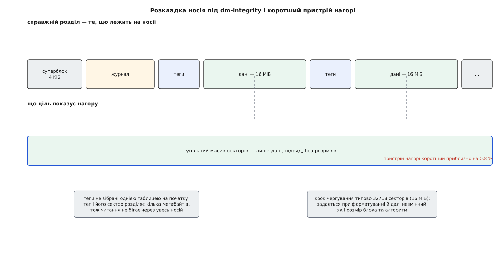
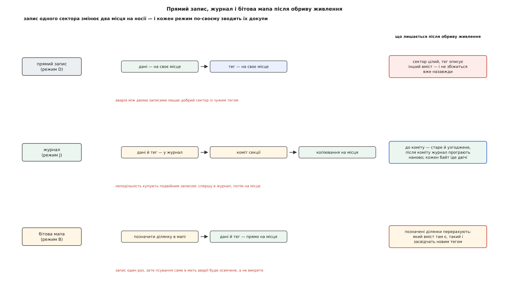
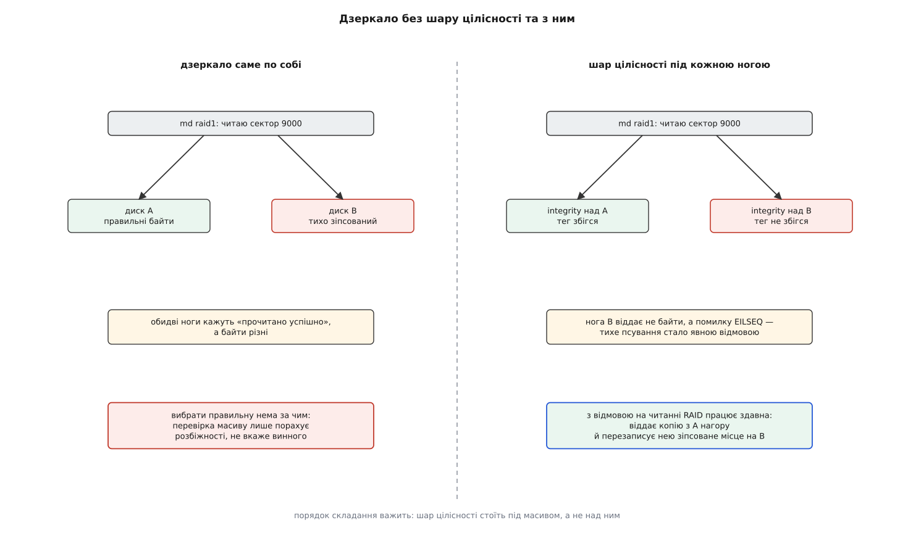

# dm-integrity: контрольні суми на записуваному блоковому пристрої

<preknowlist>
- [Блоковий пристрій: сектори, блоки й черга запитів](topic:unix-linux/block-device-model) — носій для ядра це масив пронумерованих секторів однакового розміру, а кожне звернення до нього оформлене окремою структурою з номером, довжиною й сторінками пам'яті.
- [Device mapper: блоковий пристрій, зібраний із шарів](topic:unix-linux/device-mapper) — між файловою системою й носієм можна поставити код, який дістає кожен запит; що саме він робить, задає рядок таблиці.
- [Контрольні суми](topic:communications/checksums) — коротке число, пораховане з даних так, що при зміні даних воно майже напевно перестає збігатися.
- [CRC](topic:communications/crc) — контрольна сума на остачі від ділення многочленів: дуже дешева й розрахована саме на випадкові спотворення.
- [HMAC і коди автентичності повідомлень](topic:communications/hmac) — згортка даних із секретним ключем; без ключа правильне значення не підібрати.
- [Журналювання й узгодженість після збою](topic:unix-linux/journaling-consistency) — щоб дві пов'язані зміни пережили обрив живлення разом, їх спершу пишуть в окремий журнал, а вже потім на місце.
</preknowlist>

Диск уміє помилятися тихо. Кожен сектор на носії несе власний код виправлення помилок, і коли комірки підвели, контролер здебільшого або лагодить дані сам, або чесно каже «не прочитав». Через це «диск повернув неправильні байти й не поскаржився» звучить як щось майже неможливе.

Але список того, чого сектор не бачить, короткий і неприємний. Прошивка записала правильні дані не за тією адресою — на обох місцях лежать бездоганні сектори, просто не ті. Контролер відзвітував про запис, який насправді не дійшов до носія, — на місці лишилося вчорашнє, і воно теж бездоганне. Байт перекрутився в кабелі, в мікросхемі кеша контролера, в пам'яті самого комп'ютера — і на носій приїхало сміття, яке чесно накрили правильним кодом виправлення. У кожному з цих випадків сектор читається **успішно**: код виправлення сходиться, бо він порахований уже після псування.

Отже, власна перевірка носія накриває носій — і не накриває ані шлях до нього, ані адресацію. Усе, що зіпсувалося поза комірками, пропливає нагору у вигляді правдоподібних байтів, і файлова система приймає їх без жодного сумніву.

Потрібен вердикт іншого роду. Не «читання вдалося», а «це те саме, що сюди писали».

## Чому дерево гешів тут не годиться

Такий вердикт уже вміє видавати [dm-verity](topic:unix-linux/dm-verity): він тримає над розділом дерево Меркла й перед видачею кожного блока піднімається від нього до кореня. Уся сила цієї конструкції — у тому, що корінь лежить **поза** пристроєм і ніколи не змінюється: тридцять два байти приїжджають у підписаному командному рядку ядра.

Спробуймо тим самим накрити пристрій, у який пишуть. Запис одного блока міняє його геш, а отже, й блок нульового рівня над ним, і блок першого рівня, і, зрештою, корінь. Новий корінь треба десь тримати — а єдине доступне місце це той самий пристрій. І щойно корінь ліг на пристрій, він перестав бути коренем: хто підмінив блок, той підмінить і корінь, а перевірка сумлінно підтвердить підміну.

Тут доведеться зробити вибір, і саме він визначає все далі. Або пристрій незмінний, опора зовнішня — і тоді ловимо навіть свідому підміну. Або пристрій записуваний, опора лежить на ньому самому — і тоді ловимо псування, а зловмисника лише почасти.

З другого вибору відразу випливає й форма. Дерево було потрібне рівно для того, щоб звести мільйон блоків до одного зовнішнього числа; коли зовнішнього числа немає, вертикаль ні до чого. Лишається пласке рішення: **на кожен сектор — своя коротка сума, покладена поруч із ним**. Це і є ціль `integrity` у [device mapper](topic:unix-linux/device-mapper).

Дійти до неї пробували двічі. У 2012–2013 роках Дмитро Касаткін пропонував ціль із такою самою назвою: HMAC на кожен блок, ключ із кільця ключів ядра, метадані на тому самому або на окремому пристрої — і в ядро вона не ввійшла. Та, що ввійшла у випуску 4.12 навесні 2017 року, — робота Мікулаша Паточки з Red Hat, супровідника device mapper, і тісно пов'язана з роботою над автентифікованим шифруванням диска. Як задум ішов від захисту окремих файлів до шару, що стоїть під файловою системою й нічого про файли не знає, розказано окремо: [дві спроби зробити цілісність блоковим шаром](topic:unix-linux/dm-integrity/hist-two-attempts.md).

## Куди подіти зайві байти

Сектор має рівно 512 байтів, блок — 512, 1024, 2048 або 4096. Вільного місця в ньому немає жодного біта: [модель блокового пристрою](topic:unix-linux/block-device-model) саме на тому й стоїть, що сектори однакові й пронумеровані підряд. Отже, теги мусять лягти кудись іще, і варіантів рівно три.

Перший — зробити сектор більшим. Диски корпоративного класу вміють форматуватися на 520 байтів замість 512, і зайві вісім байтів везуть із собою на кожному кроці; блоковий шар Linux має для цього окремий механізм — [профіль цілісності пристрою](topic:unix-linux/block-integrity-profile). Розв'язок гарний і недоступний: він вимагає саме такого заліза. dm-integrity уміє ним користуватися, коли воно є (вбудований режим), але жити мусить і без нього.

Другий — окремий пристрій під метадані. Зручно, коли є швидкий носій під теги й повільний під дані.

Третій, типовий, — відрізати частину того самого носія. Ціль показує нагору пристрій, **коротший** за справжній, а різницю тримає під службове. Це перше, що видно неозброєним оком: `integritysetup open` дає `/dev/mapper/…` відчутно меншого обсягу, ніж розділ під ним.

Розкладка виходить така. На початку — суперблок на чотири кілобайти з усіма параметрами формату. За ним журнал. А далі решта носія порізана на однакові відтинки, у кожному з яких спершу йде жменя секторів із тегами, а за ними ті сектори даних, які ці теги описують. Крок чергування типово 32768 секторів, тобто шістнадцять мегабайтів.

Чергування тут не примха оформлення. Якби всі теги лежали однією таблицею на початку носія, кожне читання даних тягнуло б за собою ще одне звернення в геть інший кінець диска. При чергуванні тег віддалений від свого сектора на мегабайти — на обертовому диску це коротке переміщення головки замість кидка через увесь диск, на твердотільному просто сусідня ділянка.



*Тег лежить за кілька мегабайтів від свого сектора, а не в окремій таблиці на початку носія; нагору при цьому видно суцільний масив секторів без розривів і приблизно на відсоток коротший.*

Скільки це коштує місця, рахується просто.

**Розділ на 1 ТіБ, блок 512 байтів, crc32c — тег 4 байти на блок.**

```
блоків даних   = 1099511627776 / 512   = 2147483648
місця під теги = 2147483648 · 4 Б      = 8 ГіБ
частка         = 4 / 512               = 0.78 %
```

Візьмемо блок на 4096 байтів — той самий чотирибайтовий тег накриє увосьмеро більше даних, і накладні витрати впадуть до 0.1 %. Плата — зернистість: одна невідповідність тепер забирає чотири кілобайти замість пів. І запис, менший за блок, перетворюється на «прочитати блок цілком, звірити, змінити, перерахувати тег, записати» — те саме читання-перед-записом, що й у будь-якій системі з великою одиницею контролю.

## Дві зміни, які мусять статися разом

Досі йшлося про перевірку. Але найдорожче в цьому шарі коштує запис.

Записати один сектор через цей шар означає змінити **два** місця на носії: сам сектор і його тег у сусідньому відтинку. Жоден накопичувач не вміє зробити два віддалені записи неподільно. Отже, між ними є проміжок, і в цей проміжок може влучити обрив живлення.

Розберімо обидва порядки. Записався тег, не записалися дані — тег описує вміст, якого на носії немає. Записалися дані, не записався тег — тег описує вміст, якого на носії вже немає. Різні випадки, наслідок один: **цілком добрий сектор оголошено зіпсованим**. І оголошено назавжди, бо ніхто цей тег більше не перерахує.

Виходить пастка. Засіб проти рідкісного тихого псування перетворює кожен обрив живлення на гарантоване й невиправне псування — і саме там, де система найбільше на нього чутлива: у щойно записаних даних, куди [журнал файлової системи](topic:unix-linux/journaling-consistency) прийде відновлюватися й дістане замість байтів помилку.

Тому, ще до будь-яких перевірок, ціль мусить розв'язати задачу: **дані і їхній тег зобов'язані з'явитися на носії як одна неподільна зміна**. Розв'язок відомий, і він на поверх нижчий за той самий прийом у файлових системах — журнал.

Ціль пише дані **разом із тегом** у журнал на початку носія, комітить секцію журналу, і аж тоді копіює те й те на свої місця. Аварія до коміту — журнал ігнорують, на носії лишається старе, а старе узгоджене саме з собою. Аварія після коміту — при наступному відкритті ціль програє журнал наново й доводить копіювання до кінця. Третього не дано, і в обох випадках тег і дані сходяться.

Одна деталь робить сам коміт дешевим. Кожен 512-байтовий сектор журналу закінчується восьмибайтовим ідентифікатором коміту, однаковим для всієї секції. Щоб зрозуміти, чи секція записалася цілком, не потрібні ані окрема контрольна сума журналу, ані другий прохід: досить перевірити, що ідентифікатор скрізь той самий. Обірваний запис лишає в хвості старе значення — і секція просто не вважається закоміченою.

Ціна журналу — та сама, що завжди: **кожен байт лягає на носій двічі**. Це не відсотки, це рази.

> 🔧 **Навіщо це.** Коли зашифрований том із увімкненою цілісністю показує вдвічі меншу швидкість запису, ніж такий самий без неї, винною зазвичай призначають криптографію — і шукають, чим її прискорити. Шукати нема чого: AES з апаратними командами віддає гігабайти на секунду й у баланс майже не входить. Удвічі меншу швидкість дає журнал, який пише все двічі. Отже, і важіль тут інший: або відмовитися від журналу свідомо, знаючи, що саме віддаєш, або лишити його й планувати обсяг запису під удвічі більший потік.

## Дешевший режим і що він віддає

Журнал не єдина відповідь. З випуску ядра 5.2 є режим бітової мапи: замість писати все двічі, ціль тримає мапу ділянок і перед першим записом у ділянку ставить її біт. Далі дані й тег ідуть просто на свої місця, у будь-якому порядку, без жодної синхронізації. При охайному вимкненні мапа очищується.

Після аварії лишаються підняті біти — ділянки, де дані й теги могли розійтися. Що з ними робить ціль: **перераховує теги** з того, що зараз лежить на носії.

Ось де ховається розплата. Перерахунок не перевіряє — він **засвідчує**. Хай там що опинилося зараз у тих секторах, воно дістане правильний тег і надалі читатиметься як бездоганне. Гарантія міняє форму: замість «кожне читання звірене» стає «кожне читання звірене, крім ділянок, які були в роботі під час аварії, — там прийнято на віру».

Тому режим і вибирають за тим, чого саме бояться. Журнал — коли найнебезпечніший момент це і є сама аварія: обірваний запис, недописаний блок, збрехане підтвердження. Бітова мапа — коли головний ворог це повільне псування комірок на тлі рівної роботи, а обриви живлення рідкісні й машина за ними доглянута.



*Прямий запис узагалі не зводить дані з тегом і тому в чистому вигляді придатний лише там, де неподільність забезпечив хтось інший; журнал купує її подвійним записом; бітова мапа не купує, а домовляється не питати про підозрілі ділянки.*

## Хто рахує тег

Алгоритм задають параметром `internal_hash`, і вибір тут не між «швидше й повільніше», а між «від чого захищаємося».

Типовий вибір — **crc32c**. Чотири байти, апаратна команда на x86-64 і на ARMv8, тобто в бюджет читання практично не входить. Ловить рівно те, задля чого все затівалося: перевернутий біт, запис не за тією адресою, загублений запис, сміття з контролера. Не ловить нікого, хто діє свідомо: CRC — відома функція від даних, і той, хто змінив сектор, перерахує суму за мікросекунду.

Другий вибір — **HMAC-SHA256 з ключем**. Тепер підробити тег без ключа не вийде, і підміна сектора на носії стає видимою, навіть якщо її зробили навмисно. У згортку при цьому йдуть дані **разом із номером сектора** — тому сектор не можна ще й переставити: на новому місці його тег не підійде до нового номера.

Але однієї властивості не буде за жодного алгоритму — **свіжості**. Зовнішньої опори немає, а це означає, що тег засвідчує лише «цю пару колись писали сюди», не «її писали останньою». Хто зберіг учора трійку «номер сектора, дані, тег» і поклав її назад сьогодні, дістане бездоганну перевірку: трійка справжня, підписана справжнім ключем. Так відкочують назад скасований дозвіл, витрачений лічильник, залатаний виконуваний файл. Ось точна межа між двома цілями: dm-verity таке ловить, бо його корінь приходить ззовні й описує весь пристрій одним числом, а dm-integrity ззовні не має нічого. Це не недогляд, а та сама ціна за право писати.

Є й третій випадок: **не рахувати нічого**. Без `internal_hash` ціль не обчислює тегів, а лише зберігає ті байти, які їй передає шар вище, і повертає їх при читанні. Саме так улаштоване автентифіковане шифрування: [dm-crypt](topic:unix-linux/dm-crypt) у режимі AEAD дістає з шифру і шифротекст, і код автентичності, але подіти цей код нікуди — сектор заповнений під зав'язку. Місце під нього резервує dm-integrity знизу. У `cryptsetup` це один прапорець — `luksFormat --type luks2 --integrity hmac-sha256`, — за яким збирається стос із двох dm-пристроїв; можливість досі позначена як експериментальна й помітно повільна, бо до подвійного запису журналу додається HMAC над кожним сектором. Що таке [AEAD і чому шифрування без коду автентичності лишає двері відчиненими](topic:communications/authenticated-encryption), розібрано окремо.

## Що бачить той, хто вище

Коли тег не збігся, ціль не віддає прочитаного взагалі — вона повертає помилку й пише в журнал ядра рядок `Checksum failed at sector 0x…`. Помилка при цьому не звичайна `EIO`, а `EILSEQ`, «неприпустима послідовність байтів». Різниця не косметична: `EIO` каже «я не зміг прочитати», `EILSEQ` каже «я прочитав, і це не те, що сюди писали».

Програмі нагорі файлова система однаково віддасть `EIO` — розрізнення потрібне не їй. Воно потрібне сусідньому шарові ядра, і саме на ньому вся конструкція окупається.

Повний перелік полів рядка таблиці, необов'язкових параметрів, формат суперблока й команди `integritysetup` зібрано в довідці: [таблиця й інтерфейс dm-integrity](topic:unix-linux/dm-integrity/api-integrity-table.md).

## Навіщо це під дзеркалом

Візьмімо [дзеркало з двох дисків](topic:unix-linux/md-raid). Один із них тихо зіпсував сектор. Масив читає, дістає дві відповіді, обидві успішні, байти різні — і не має жодного способу сказати, котра правильна. Перевірка масиву в такому стані вміє лише полічити розбіжності; вказати винного їй нема чим, бо надлишковість дає порівняння, а не вердикт.

Тепер поставмо шар цілісності **під кожен диск масиву**, а не над масивом. Зіпсована нога більше не віддає байтів — вона віддає помилку читання. А з помилкою читання RAID уміє працювати від народження: узяти дані з іншої копії, віддати їх нагору й записати добрі байти назад на ту ногу, що збрехала. Тихе псування перетворилося на явну відмову — і в цьому весь виграш.



*Без тегів масив має дві відповіді й жодного вердикту; з тегами зіпсована нога вибуває сама, і надлишковість нарешті стає придатною для лагодження, а не лише для порівняння.*

Порядок складання тут не деталь смаку, а умова роботи: шар цілісності мусить стояти під масивом. Над масивом він повідомляв би «масив віддав сміття» — правда, з якої нічого не випливає, бо копії лишилися нижче й недосяжні.

Складати руками не обов'язково. У LVM це вбудовано: `lvcreate --type raid1 --raidintegrity y` заводить під кожен образ окремий службовий том із тегами, а `--raidintegritymode bitmap` перемикає режим із журнального на дешевший. Місця під це треба близько чотирьох мегабайтів на кожні п'ятсот мегабайтів даних — ті самі 0.8 % — і окремо на кожен образ масиву. Одне обмеження варто знати наперед: перед заміною чи відбудовою диска цілісність доводиться тимчасово вимикати й потім вмикати назад.

## Ціна входу: пристрій треба спершу засіяти

Свіжий пристрій має в області метаданих випадкове сміття. Отже, доти, доки теги не пораховані для **всіх** блоків, будь-яке читання скаржитиметься. Звідси два шляхи.

Прямий — записати пристрій цілком: `integritysetup format` саме це й робить, і на великому диску це години. Прапорець, який пропускає затирання, лишає пристрій із неправильними тегами — тобто придатним тільки для того, хто негайно перезапише його весь.

Другий шлях — фоновий перерахунок. Ядро само проходить пристрій і рахує теги з того, що там уже лежить. Це дає дуже привабливу річ — увімкнути цілісність над **наявними даними**, нічого нікуди не переливаючи, — і водночас чесно слабку: перерахунок так само засвідчує все, що встигло зіпсуватися до вмикання. З ключем HMAC цей режим типово заборонений, і не з обережності: масово підписати справжнім ключем невідомо що означає власноруч знецінити підпис.

Побачити всю механіку руками нескладно: досить файлу, [підкладеного як блоковий пристрій](topic:unix-linux/loop-device), одного зіпсованого байта й погляду в `dmesg`, а далі — того самого над двома ногами дзеркала. Дослід розписано окремо: [зібрати integrity, зіпсувати байт і дати дзеркалу його полагодити](topic:unix-linux/dm-integrity/proj-integrity-by-hand.md).

## Де закінчується цей шар

Ту саму роботу вміють робити файлові системи, які тримають контрольні суми даних у себе. Їхня перевага принципова: файлова система знає, **кому** належить блок, тому вміє не лише виявити псування, а й назвати постраждалий файл, а маючи власну надлишковість — сама взяти добру копію. Біда в тому, що це вміють не всі: ext4 і XFS покривають сумами свої метадані, а дані користувача — ніколи. [Родини файлових систем](topic:unix-linux/filesystem-families) різняться саме тут, і коли потрібної властивості в обраній системі немає, шар нижче лишається єдиним способом її дістати.

Отже, три сусідні відповіді розходяться за тим, чим кожна платить. dm-verity замикає пристрій на читання й дістає взамін зовнішню опору — захист від свідомої підміни. Контрольні суми у файловій системі не вимагають нічого замикати, але доступні лише там, де їх передбачили. dm-integrity не вимагає ані незмінності, ані згоди файлової системи — і платить за це втратою свіжості й подвійним записом.

## Що з цього виходить

Уся тема тримається на одному питанні: де лежить опора. Винесеш її назовні — здобудеш захист від злого умислу й утратиш право писати. Лишиш на пристрої — здобудеш право писати й утратиш свіжість, а разом із нею й захист від відкату.

І щойно опора лягла поруч із даними, з'являється друга задача, якої в незмінному пристрої не існує зовсім: тепер дані та їхній опис змінюються **разом**, а носій не вміє змінювати два місця одночасно. Журнал, бітова мапа, ідентифікатор коміту в кожному секторі журналу, фоновий перерахунок — це все відповіді на неї одну, і саме вона, а не арифметика контрольних сум, визначає, скільки цей шар коштує.
