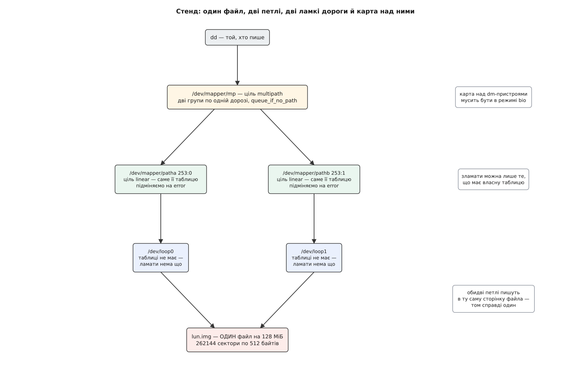

# ⚙️ Multipath на двох петльових пристроях: зламати дорогу руками

Карта multipath поводиться на стенді з одного файла так само, як на дисковій полиці за сто тисяч доларів: так само перемикається при відмові, так само не повертає дорогу назад без стороннього втручання й так само вішає процеси в черзі, з якої нема виходу. Заліза тут немає зовсім, а от помилки, на яких горять із живим сховищем, — справжні, і кожну видно за хвилину.

## Дві дороги до одного файла

Дорога для карти — це просто блоковий пристрій, крізь який можна дістатися до тих самих секторів. [Петльовий пристрій](topic:unix-linux/loop-device) вдає блоковий пристрій, а читання й запис пересилає у звичайний файл. Отже, дві петлі, наведені на **один** файл, — це буквально дві дороги до одного тому: команди йдуть різними пристроями, а сектори під ними ті самі.

`losetup` таке дозволяє, і довідка навіть попереджає, що кілька петель на один файл — річ небезпечна, з утратою даних включно. Попередження слушне, і саме воно пояснює, навіщо потрібна карта: небезпека в тому, що двоє незалежних писарів затруть один одного, не підозрюючи про існування сусіда. Карта multipath на те й потрібна, щоб писар лишався один — вона **обирає** дорогу, а не додає їх.

Тільки самих петель замало. Щоб дорогу зламати, треба підмінити те, що за нею стоїть, а петльовому пристрою нема чого підміняти: у нього немає таблиці, є лише файл. Таблиця є в [device mapper](topic:unix-linux/device-mapper) — тож кожну петлю загортаємо в тривіальну ціль `linear`, і саме цей проміжний шар стає тим, що ми ламатимемо. Виходить чотири пристрої на дві дороги, і зайвих серед них немає.



*Ламати можна лише той шар, у якого є власна таблиця, — тому дорога складається з двох пристроїв, а не з одного.*

```sh
#!/bin/sh
set -eu

WORK=/var/tmp/mplab
IMG=$WORK/lun.img

mkdir -p "$WORK"
truncate -s 128M "$IMG"            # файл заявленої довжини, поки що порожній
modprobe dm-multipath
modprobe dm-round-robin

LOOP_A=$(losetup -f --show "$IMG") # /dev/loop0
LOOP_B=$(losetup -f --show "$IMG") # /dev/loop1 — ТОЙ САМИЙ файл
SZ=$(blockdev --getsz "$LOOP_A")   # 262144 — довжина В СЕКТОРАХ

dmsetup create patha --table "0 $SZ linear $LOOP_A 0"
dmsetup create pathb --table "0 $SZ linear $LOOP_B 0"
```

Файл беремо [розріджений](topic:unix-linux/sparse-files): `truncate` створює файл заявленої довжини, під яким спершу немає жодного блока, і місце на диску витрачається лише під те, що справді запишуть.

Число `SZ` варте окремого погляду. `blockdev --getsz` віддає довжину в [секторах](topic:unix-linux/block-device-model) по 512 байтів незалежно від того, якими блоками оперує носій, — а таблиця device mapper міряє довжину саме ними. Тому число лягає в рядок без жодного перерахунку, а підставлені туди байти дали б таблицю в 512 разів довшу за носій — і `dmsetup` відмовився б ще на завантаженні таблиці, поскаржившись, що пристрій замалий для цілі.

## Рядок карти, число за числом

```sh
dmsetup create mp <<EOF
0 $SZ multipath 3 queue_if_no_path queue_mode bio 0 2 1 round-robin 0 1 1 /dev/mapper/patha 1 round-robin 0 1 1 /dev/mapper/pathb 1
EOF
```

Рядок читається зліва направо як послідовність лічильників: кожне число каже, скільки слів іде за ним.

```
0 262144 multipath      відрізок пристрою й ціль
3 queue_if_no_path
  queue_mode bio        три слова властивостей: одне слово + два
0                       обробників заліза немає — нема кому казати ALUA
2 1                     дві групи пріоритету, робоча — перша
round-robin 0           селектор першої групи й нуль його аргументів
1 1                     одна дорога в групі, одне число на дорогу
/dev/mapper/patha 1     сама дорога й те число: скільки запитів поспіль їй давати
round-robin 0 1 1
  /dev/mapper/pathb 1   друга група, так само
```

`queue_mode bio` тут не прикраса: без нього стенд не збереться взагалі, і замість пристрою вийде

```
device-mapper: table: table load rejected: including non-request-stackable devices
device-mapper: ioctl: error adding target to table
```

За замовчуванням ціль `multipath` працює запитоорієнтовано — обирає дорогу для вже склеєного запиту, — а запитоорієнтований device mapper відмовляється ставати над пристроями, які не мають власної черги запитів. Петля таку чергу має, а `linear` — ні: усі звичайні цілі device mapper пропускають крізь себе окремі `bio`. Одна властивість у рядку рятує стенд, і те, що вона взагалі існує, — прямий наслідок історії з двома режимами роботи цілі.

Тепер подивімося на карту очима ядра:

```sh
$ dmsetup table mp
0 262144 multipath 3 queue_if_no_path queue_mode bio 0 2 1 round-robin 0 1 1 253:0 1 round-robin 0 1 1 253:1 1
```

Імена доріг зникли: ядро запам'ятало пристрої [парою чисел](topic:unix-linux/major-minor-numbers), а шлях був лише способом їх назвати. Далі всюди фігуруватимуть саме числа (253 — старший номер device mapper на цій машині; на вашій може бути інший).

## Ламаємо дорогу

Зламати — означає підмінити таблицю `patha` на ціль `error`, яка відповідає помилкою на будь-який запит:

```sh
dmsetup suspend --nolockfs patha
dmsetup load patha --table "0 $SZ error"
dmsetup resume patha
```

`--nolockfs` тут не оптимізація: без нього `suspend` спробує заморозити файлову систему на пристрої, а на окремій дорозі жодної файлової системи немає — вона живе поверх карти, а не поверх дороги. Те саме однією командою робить `dmsetup wipe_table --nolockfs patha`.

Пишемо крізь карту:

```sh
$ dd if=/dev/urandom of=/dev/mapper/mp bs=4096 count=256 oflag=direct status=none
$ echo $?
0
```

Помилки не було. Перший запит пішов першою групою, дістав `EIO`, ціль позначила дорогу несправною й повторила його другою — за мікросекунди й нікому не поскаржившись. Слід лишився у двох місцях:

```
$ dmesg | tail -1
device-mapper: multipath: mp: Failing path 253:0.

$ dmsetup status mp
0 262144 multipath 2 0 0 0 2 2 E 0 1 0 253:0 F 1 A 0 1 0 253:1 A 0
```

Стан читається так само лічильниками, але числа в ньому інші, ніж у таблиці:

```
2 0 0        два власні числа цілі: чи чекають запити на активацію групи (ні) і скільки разів групу активували (0)
0            обробників заліза немає
2 2          дві групи, робоча тепер ДРУГА (до аварії тут стояло «2 1»)
E 0 1 0      перша група: enabled, селектор мовчить, одна дорога, нуль її чисел
253:0 F 1    дорога несправна (F), падала один раз
A 0 1 0      друга група: active
253:1 A 0    дорога жива (A), не падала жодного разу
```

Одна й та сама літера `A` означає різне залежно від місця: у групи це «саме сюди зараз ідуть запити», у дороги — «жива». А група, з якої всі дороги повипадали, лишається `E`: її ніхто не вимикав, у ній просто нікого немає.

## Дорога не повертається сама

Повертаємо `patha` на місце:

```sh
dmsetup suspend --nolockfs patha
dmsetup load patha --table "0 $SZ linear $LOOP_A 0"
dmsetup resume patha
```

Пристрій знову справний — і в карті не змінилося нічого: `253:0` як був `F`, так і лишився. Ядро на несправну дорогу запитів не шле, а отже, ніяк не дізнається, що вона ожила. Сказати мусить хтось ззовні:

```sh
$ dmsetup message mp 0 reinstate_path 253:0
$ dmsetup status mp
0 262144 multipath 2 0 0 0 2 2 E 0 1 0 253:0 A 1 A 0 1 0 253:1 A 0
```

Дорога знову `A`, лічильник падінь лишився `1` — його ніхто не обнуляє. А от робочою й далі стоїть **друга** група, хоч перша вже ціла. Це не недогляд: ядро тримається правила не міняти групу, поки в поточній є хоч одна жива дорога, бо на справжній полиці кожне перемикання означає передавання тому з контролера на контролер. Повернення до кращої групи — рішення, а не механізм, і ухвалює його той, хто знає політику:

```sh
dmsetup message mp 0 switch_group 1
```

На робочій машині обидві ці команди шле демон, коли його перевірка достукалася до дороги. Інших способів повернути дорогу в карту не існує взагалі: ядро вміє лише викреслювати.

## Черга, з якої не виходять

Лишилося перевірити властивість `queue_if_no_path`. Ламаємо обидві дороги й пишемо:

```sh
$ dmsetup wipe_table --nolockfs patha
$ dmsetup wipe_table --nolockfs pathb
$ dd if=/dev/zero of=/dev/mapper/mp bs=4096 count=1 oflag=direct status=none &
[1] 5123
$ sleep 1; ps -o pid=,stat=,comm= -p 5123
   5123 D    dd
$ kill -9 5123; sleep 1; ps -o stat= -p 5123
   D
```

Запис іде повз кеш ([прямим вводом-виводом](topic:unix-linux/buffered-and-direct-io)), тож `dd` чекає на справжнє завершення. Живих доріг немає, віддавати помилку нагору заборонено — запит лежить у черзі, а процес стоїть у [непереривному сні](topic:unix-linux/process-states), звідки його не витягає навіть SIGKILL. Годину, добу — байдуже: терміну тут немає.

Виходів рівно два: повернути дорогу або зняти прапорець.

```sh
$ dmsetup message mp 0 fail_if_no_path
$ wait 5123; echo $?
137
$ dmsetup table mp | cut -d' ' -f4-6
2 queue_mode bio
```

Прапорець зник із рядка властивостей, черга миттю спорожніла помилками. Код `137` — це 128 + 9: щойно запит віддав помилку, процес вийшов із ядра, і аж там його наздогнав той SIGKILL, який хвилину тому нічого не міг удіяти. Без убивства `dd` натомість написав би `dd: error writing '/dev/mapper/mp': Input/output error`.

Саме цю одну команду й шле демон, коли вичерпав `no_path_retry`, — ніякої особливої дії в нього немає. Назад прапорець теж ставлять руками, `dmsetup message mp 0 queue_if_no_path`; сам він не відновиться, і карта, яка одного разу здалася, помилок більше не притримує.

## Прибирання

Порядок обернений до складання, і перший рядок — не забобон:

```sh
dmsetup message mp 0 fail_if_no_path   # поки прапорець стоїть, а доріг немає, remove зависне
dmsetup remove mp
dmsetup remove patha pathb
losetup -d "$LOOP_A" "$LOOP_B"
losetup -j "$IMG"                      # має бути порожньо
rm -rf "$WORK"
```

Передостання перевірка теж не зайва: від'єднання петлі, яку ще хтось тримає, з часів Linux 3.7 **ліниве** — помилки не буде, пристрій лише позначать, а відпустять, коли його закриє останній користувач.

## Пастки

**`fail_path` — не поламана дорога.** Команда `dmsetup message mp 0 fail_path 253:0` позначає дорогу несправною без жодної помилки вводу-виводу. Стан карти виглядає так само, і для перевірки реакції демона цього досить — але вона нічого не каже про те, чи справді повторюється запит, який десь унизу отримав `EIO`. Це дві різні речі, і плутати їх на випробуванні означає перевірити не те.

**Число, яке ядро мовчки виправляє.** Останній аргумент дороги — скільки запитів поспіль давати їй, перш ніж перейти на наступну. Історично там писали `1000`; сучасне ядро вважає будь-яке значення понад `1` застарілим, ставить `1` і пише про це в журнал. `dmsetup table` покаже вам `1` — бо він показує стан ядра, а не те, що ви йому подали.

**Гикання замість смерті.** Дорога, яка то падає, то повертається, шкідливіша за мертву, і відтворюється тут-таки: замість `error` покладіть у `patha` ціль `flakey`, яка задану кількість секунд працює нормально, а наступну задану кількість віддає помилки, — `dmsetup load patha --table "0 $SZ flakey $LOOP_A 0 5 5"`. Разом із демоном це показує роботу карантину: механізму, який вимикає дорогу, що впала забагато разів за вікно часу.

**Дві петлі на один файл — лише на цьому стенді.** Стенд безпечний рівно тому, що карта тримає живою одну дорогу за раз. Змонтуйте обидві петлі напряму, без карти, — і дві файлові системи почнуть незалежно правити одні й ті самі метадані, а це і є та втрата даних, якою лякає довідка `losetup`.

> 🔧 **Навіщо це.** Півгодини на цьому стенді змінюють читання файла налаштувань. Стає видно, що кожен ключ у ньому робить рівно одну з трьох речей: додає слово в рядок властивостей карти, шле карті повідомлення або не робить у ядрі нічого взагалі, а живе цілком у демоні. Найважливіші ключі — `no_path_retry` і `failback` — саме з третьої групи: у ядрі немає ані таймера, ані поняття «краща група, до якої слід повернутися». Той, хто раз бачив дорогу, яка лишається `F` після власноручного полагодження, більше ніколи не питає, навіщо на машині з готовою картою ще й демон.
