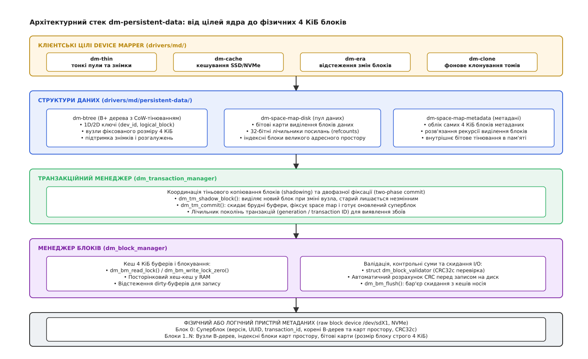
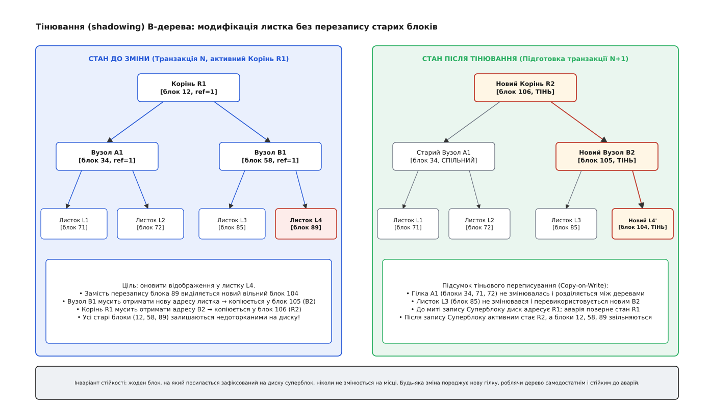
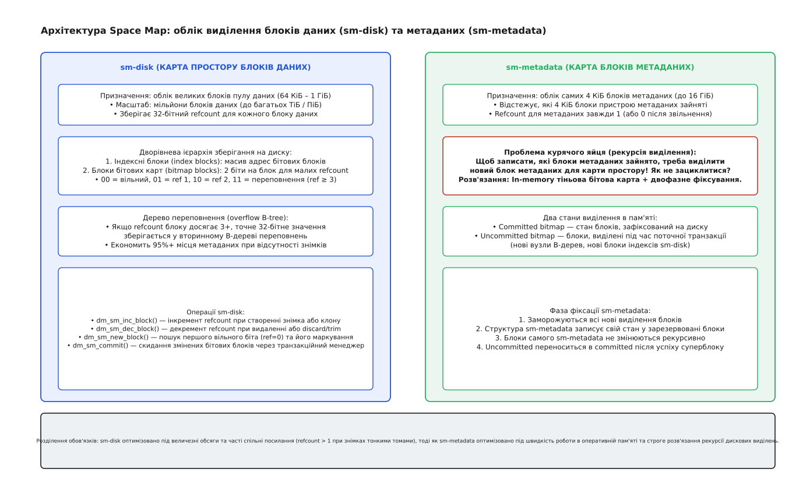
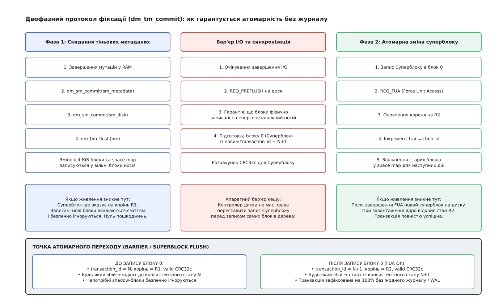

# persistent-data: транзакційні метадані device mapper

<preknowlist>
- [Блоковий пристрій](book:unix-linux/block-device-model) — носій, який ядро бачить як масив пронумерованих секторів однакового розміру; операції зводяться до читання та запису блоків за номером.
- [Device mapper](book:unix-linux/device-mapper) — підсистема ядра Linux для конструювання віртуальних блокових пристроїв із довільною логікою відображення секторів.
- [Копіювання при записі](book:unix-linux/copy-on-write) — принцип відкладеного дублювання спільних ресурсів, коли фізичне копіювання блоку відбувається лише в момент першої модифікації.
- [B-дерево](book:algorithms/b-tree) — збалансоване дерево пошуку з широкими дисковими вузлами, що мінімізує кількість звернень до накопичувача при випадковому доступі.
- [Тонке виділення (dm-thin)](book:unix-linux/dm-thin-provisioning) — механізм віртуалізації томів, де фізичне місце з пулу виділяється за фактом надходження запитів на запис.
</preknowlist>

Коли сотні віртуальних машин одночасно здійснюють випадковий запис зі швидкістю ста тисяч операцій на секунду у спільний пул тонкого виділення, кожен перший запис у новий діапазон адрес змушує ядро виділити фізичний блок на накопичувачі та негайно оновити таблицю трансляції логічних адрес у фізичні. Якщо в мікросекундному проміжку між записом даних у комірки флеш-пам'яті та оновленням покажчика на блоковому носії раптово зникає електроживлення, файлова система всередині віртуальної машини (наприклад, ext4 або XFS) стає безсилою: її власний журнал транзакцій розрахований на надійність нижнього блокового рівня, тоді як сам блоковий рівень утратив карту розміщення секторів.

Традиційні підходи підсистеми [Device Mapper](book:unix-linux/device-mapper) не могли розв'язати цю проблему. Звичайні таблиці лінійного відображення конструюються в оперативній пам'яті під час завантаження ядра й залишаються статичними; вони не вміють зберігати динамічні зміни на диск. Наївна спроба застосувати класичне журналювання з випереджальним записом (англ. *Write-Ahead Logging*, WAL) на рівні блокового драйвера призвела б до катастрофічного падіння продуктивності: кожне виділення блоку вимагало б подвійного запису на накопичувач — спочатку в кільцевий журнал метаданих, а потім у саму таблицю відображень, що вдвічі знизило б пропускну здатність накопичувачів і прискорило зношування SSD.

Для подолання цієї суперечності в ядрі Linux було створено спеціалізовану бібліотеку `dm-persistent-data` (розташовану в дереві вихідних кодів за шляхом `drivers/md/persistent-data/`). Вона надає транзакційний рушій збереження складних дискових структур, який гарантує абсолютну стійкість до раптових аварій живлення без використання журналів, спираючись на механізм тіньового копіювання B-дерев і дворівневі карти простору. Детальніше про передумови створення цієї системи можна дізнатися у вставці з [історією переходу від статичних таблиць до B-дерев](book:unix-linux/dm-persistent-data/hist-btree-device-mapper.md).

## Багаторівнева архітектура бібліотеки

Бібліотека `dm-persistent-data` не є самостійним блоковим пристроєм. Це внутрішній каркас ядра, що розділяє обов'язки між п'ятьма чітко розмежованими рівнями абстракції. Кожен рівень відповідає за окрему задачу: від низькорівневої буферизації секторів до підтримки багатовимірних пошукових дерев.



*Багаторівневий стек persistent-data: цілі Device Mapper спираються на B-дерева та карти простору, які координуються транзакційним менеджером і буферизуються менеджером 4 КіБ блоків.*

На найвищому рівні розташовані клієнтські модулі ядра — цілі Device Mapper:
- `dm-thin`: забезпечує тонке виділення томів і створення миттєвих знімків зі спільним використанням блоків даних.
- `dm-cache`: керує дворівневим кешуванням повільних накопичувачів (HDD) на швидких твердотільних дисках (NVMe/SSD).
- `dm-era`: відстежує модифікацію блоків між часовими інтервалами (епохами) для створення інкрементних резервних копій.
- `dm-clone`: реалізує фоновий перенос даних із віддаленого або повільного джерела на локальний накопичувач із можливістю негайного доступу на запис.

Під клієнтськими цілями працює рівень структур даних: B-дерева (`dm-btree`) та карти простору (`dm-space-map`). Вони перетворюють складні логічні зв'язки (наприклад, пару «ідентифікатор віртуального пристрою плюс логічний сектор») у фізичні номери блоків і підтримують 32-бітні лічильники спільних посилань.

Координацію змін здійснює транзакційний менеджер (`dm_transaction_manager`). Він реалізує концепцію тіньового копіювання (англ. *shadowing*): під час поточної транзакції жоден раніше зафіксований блок не перезаписується на місці; усі модифікації спрямовуються у свіжовиділені порожні блоки. Транзакційний менеджер керує життєвим циклом поколінь транзакцій і забезпечує атомарну двофазну фіксацію.

Нижче працює менеджер блоків (`dm_block_manager`). Він відповідає за кешування блоків розміром рівно 4 КіБ в оперативній пам'яті, контроль конкурентного доступу через блокування читання-запису, верифікацію контрольних сум CRC32c та відправку пакетів операцій введення-виведення на фізичний пристрій метаданих.

Найнижчим рівнем є фізичний або логічний пристрій метаданих (зазвичай виділений розділ швидкого SSD обсягом від кількох сотень мегабайтів до 16 ГіБ). На ньому блок з індексом 0 зарезервовано під суперблок, а всі наступні блоки 1..N містять вузли дерев, бітові карти та лічильники посилань.

## Менеджер блоків: буферизація, блокування та валідація

Фундаментом усіх дискових операцій у `dm-persistent-data` є фіксований квант метаданих — блок розміром рівно 4096 байтів (`DM_BM_BLOCK_SIZE = 4096`). Цей розмір обрано не випадково: він збігається зі стандартним розміром сторінки віртуальної пам'яті архітектури x86-64 та фізичним розміром сектора сучасних накопичувачів Advanced Format (4Kn), що усуває накладні витрати на читання-модифікацію-запис на рівні контролера накопичувача.

Менеджер блоків (`struct dm_block_manager`) підтримує внутрішній хеш-кеш оперативної пам'яті (`dm_buffer_cache`). Коли клієнтському модулю потрібно звернутися до вузла дерева або бітової карти, він не формує низькорівневий запит `bio` самостійно, а запитує відповідний блок у менеджера блоків через один із двох типів блокувань:

1. **Розділене блокування читання (`dm_bm_read_lock`).** Дозволяє багатьом потокам одночасно читати вміст блоку. Якщо блок уже завантажено в кеш і його контрольна сума перевірена, доступ надається миттєво без звернення до диска. Якщо блок відсутній у пам'яті, потік призупиняється до завершення дискового читання та успішної валідації.
2. **Ексклюзивне блокування запису (`dm_bm_write_lock` та `dm_bm_write_lock_zero`).** Надає виключний доступ одному потоку для внесення змін. Варіант `dm_bm_write_lock_zero` оптимізовано для щойно виділених блоків: він не витрачає час на читання старого сміття з накопичувача, а миттєво занулює виділений буфер у пам'яті ядра.

Захист від прихованого пошкодження даних (англ. *silent data corruption*) та неповного запису секторів реалізовано через структуру валідаторів `struct dm_block_validator`. Кожен структурний тип метаданих надає власну пару функцій зворотного виклику:

```
[Читання з носія]  →  check()              → перевірка magic та розрахунок CRC32c
[Запис на носій]    →  prepare_for_write()  → розрахунок CRC32c і запис у заголовок
```

Перед тим як передати модифікований 4 КіБ буфер драйверу блокового пристрою, менеджер блоків викликає функцію `prepare_for_write`. Вона обчислює контрольну суму за алгоритмом CRC32c від усього вмісту блоку, за винятком перших чотирьох байтів, і записує отримане значення у поле заголовка. Під час зчитування блоку з носія метод `check` заново підраховує контрольну суму та порівнює її зі значенням у заголовку. Якщо сума не збігається (наприклад, через збій контролера диска або пошкодження комірки флеш-пам'яті), ядро негайно перериває операцію з помилкою `-EILSEQ`, блокуючи поширення пошкоджених адрес по дереву.

Після завершення модифікації буфера потік викликає `dm_bm_unlock`. Блок залишається в оперативній пам'яті у стані «брудного» (англ. *dirty*) буфера доти, доки транзакційний менеджер не ініціює операцію групового скидання `dm_bm_flush()`.

## B-дерева з тіньовим копіюванням при записі

Для організації пошуку серед мільйонів логічних відображень бібліотека використовує B+ дерева (`dm-btree`). У B+ дереві всі користувацькі значення зберігаються виключно в листках, тоді як внутрішні вузли містять лише навігаційні ключі та адреси дочірніх блоків.

Кожен вузол дерева розташовується рівно в одному 4 КіБ блоці й описується структурою `struct btree_node`. Вузол складається зі стандартного заголовка, відсортованого масиву 64-бітних ключів `keys` та масиву відповідних значень `values`:

```c
struct btree_node {
    struct node_header header;
    __le64 keys[0];
    /* Після масиву ключів розташовано масив значень values */
} __packed;
```

Завдяки фіксованому розміру блоку 4096 байтів коефіцієнт розгалуження (англ. *fan-out*) дерева є надзвичайно високим. Для одновимірного дерева з 64-бітним ключем (8 байтів) і 64-бітною адресою блоку даних (8 байтів) один внутрішній вузол вміщує близько 250 дочірніх покажчиків:

```
Місткість вузла:   N ≈ (4096 − 32 байта заголовка) / (8 + 8 байтів) ≈ 254 записи
Глибина 2 рівні:   254 · 254 ≈ 64 516 блоків даних (4 ГіБ при блоці 64 КіБ)
Глибина 3 рівні:   254 · 254 · 254 ≈ 16 387 064 блоки даних (1 ТіБ при блоці 64 КіБ)
Глибина 4 рівні:   254⁴ ≈ 4,16 · 10⁹ блоків даних (266 ПіБ при блоці 64 КіБ)
```

Це означає, що для пошуку будь-якого блоку в пулі обсягом у кілька терабайтів ядру потрібно прочитати максимум 3–4 вузли, більшість із яких (корінь і верхні індекси) постійно перебувають у RAM-кеші менеджера блоків.

Головна відмінність реалізації `dm-btree` від класичних дискових B-дерев полягає у повній відмові від модифікації вузлів на місці (англ. *in-place update*). Замість цього застосовується тіньове копіювання при записі (англ. *shadow copy-on-write*).



*Тіньове копіювання B-дерева: модифікація листка L4 породжує ланцюг нових блоків L4', B2 та R2, тоді як стара гілка R1-B1-L4 залишається незмінною для зафіксованого стану.*

Коли клієнтська ціль вставляє нове відображення або змінює наявне, алгоритм виконує прохід уздовж хребта дерева (англ. *tree spine*):

1. Алгоритм спускається від кореня `R1` (блок 12) до внутрішнього вузла `B1` (блок 58) і далі до цільового листка `L4` (блок 89).
2. Замість внесення змін у блок 89 транзакційний менеджер запитує у карти простору метаданих новий вільний блок 104. Дані листка копіюються у новий блок, і в нього записується змінене значення. Цей блок стає тіньовим листком `L4'`.
3. Оскільки адреса листка змінилася з 89 на 104, батьківський вузол `B1` також потребує оновлення. Блок 58 не можна змінювати, тому виділяється новий блок 105, куди копіюється вміст `B1` із заміною покажчика на блок 104. Новий вузол стає `B2`.
4. Зміна адреси вузла `B2` піднімається до кореня. Виділяється новий блок 106, який стає новим коренем `R2`, що посилається на незмінений вузол `A1` (блок 34) та новий вузол `B2` (блок 105).

Усі вузли, які не зазнали змін (наприклад, гілка `A1` з листками `L1` та `L2`), залишаються спільними для старого та нового дерев. Доки нова транзакція не зафіксована в суперблоці, на диску одночасно співіснують обидва корені: старий корінь `R1` представляє узгоджений стан минулого, а новий корінь `R2` формує стан майбутнього покоління.

## Карти простору: розв'язання проблеми курячого яйця

Для відстеження виділених блоків та кількості посилань на них бібліотека використовує інтерфейс карт простору `struct dm_space_map`. У типовому сховищі існують дві принципово різні категорії блоків, і для кожної з них створено власну реалізацію:

1. **`dm-space-map-disk` (карта простору даних):** обслуговує гігантські адресні простори пулу даних (сотні мільйонів блоків розміром від 64 КіБ до 1 ГіБ).
2. **`dm-space-map-metadata` (карта простору метаданих):** обслуговує невеликий адресний простір самих 4 КіБ блоків метаданих (до 16 ГіБ).



*Архітектура Space Map: sm-disk використовує дворівневі бітові карти з B-деревом переповнень refcount, а sm-metadata використовує подвійну бітову карту в RAM для розриву рекурсії.*

### Організація `sm-disk`

У пулі тонкого виділення кожен блок даних може бути розділений між десятками знімків. Тому для кожного блоку необхідно зберігати точний 32-бітний лічильник посилань (`refcount`). Якби система виділяла по 4 байти на кожен блок безпосередньо в масиві, карта простору для накопичувача на 16 ТіБ із блоком 64 КіБ займала б 1 ГіБ метаданих, навіть якщо всі блоки використовуються лише одним томом.

Щоб мінімізувати накладні витрати, `sm-disk` застосовує дворівневу схему:
- **Індексні блоки (index blocks):** містять масив адрес дискових блоків бітових карт.
- **Блоки бітових карт (bitmap blocks):** виділяють рівно 2 біти на кожен блок даних:
  - `00` (числове значення 0) — блок вільний.
  - `01` (числове значення 1) — блок зайнятий одним томом (типовий випадок для 95%+ блоків).
  - `10` (числове значення 2) — блок розділено між двома томами (наприклад, оригіналом і одним знімком).
  - `11` (числове значення 3) — переповнення: блок має 3 або більше спільних посилань.

Якщо для блоку фіксується стан переповнення (`11`), його точне 32-бітне значення лічильника посилань зберігається в окремому B-дереві переповнень (англ. *overflow B-tree*), де ключем є номер блоку даних, а значенням — повний `uint32_t`. Це дозволяє утримувати компактність бітових карт і витрачати додаткові метадані лише на ті блоки, для яких справді створено каскад знімків.

### Організація `sm-metadata` та рекурсивне зациклення

Під час проектування карти простору для самих блоків метаданих розробники зіткнулися з фундаментальною проблемою «курячого яйця»:

> **Рекурсивна дилема метаданих:** Щоб записати на диск інформацію про те, які блоки метаданих зайняті новими вузлами B-дерева, карта простору повинна виділити новий 4 КіБ блок для власної бітової карти. Але виділення нового блоку змінює стан самої карти простору, що вимагає виділення ще одного блоку, призводячи до нескінченної рекурсії.

Для розв'язання цієї проблеми модуль `dm-space-map-metadata` відмовився від використання складних дискових дерев усередині самого себе й застосував спеціальну двофазну схему з тінюванням у пам'яті.

У структурі `sm-metadata` блоки мають лічильник посилань, який може дорівнювати лише `0` (вільний) або `1` (зайнятий), оскільки вузли метаданих ніколи не розділяються між різними пулами. В оперативній пам'яті підтримуються дві паралельні бітові карти:
- **Зафіксована карта (committed bitmap):** відображає стан блоків, збережений у поточному суперблоці на диску.
- **Незафіксована карта (uncommitted bitmap):** відображає всі нові блоки, виділені під час поточної незавершеної транзакції (тіньові вузли B-дерев, нові блоки `sm-disk`).

Під час роботи транзакції всі операції виділення блоків виконуються виключно в оперативній пам'яті через незафіксовану бітову карту, не породжуючи жодних дискових операцій запису для самої `sm-metadata`. Лише під час фіксації транзакції, коли структура B-дерев уже сформована, `sm-metadata` копіює накопичені зміни у наперед виділені фіксовані блоки метаданих за один лінійний прохід без рекурсії.

## Транзакційний менеджер та двофазна фіксація

Транзакційний менеджер (`dm_transaction_manager`) зв'язує докупи менеджер блоків, карти простору та дерева у єдиний атомарний механізм. Його завдання — гарантувати, що перехід системи від покоління транзакції `N` до покоління `N+1` відбудеться за принципом «усе або нічого».



*Двофазний протокол фіксації: запис усіх тіньових блоків завершується апаратним бар'єром I/O, після чого запис суперблоку з REQ_FUA атомарно активує новий стан.*

Фіксація транзакції виконується викликом `dm_tm_commit()` і складається з двох послідовних фаз, розділених апаратним бар'єром введення-виведення.

### Фаза 1: Скидання тіньових метаданих на носій

1. Клієнтська ціль завершує внесення змін до B-дерев у пам'яті.
2. Викликається метод `dm_sm_commit(sm_metadata)`, який серіалізує стан бітових карт метаданих у тіньові блоки.
3. Викликається метод `dm_sm_commit(sm_disk)`, який скидає зміни індексних блоків і бітових карт пулу даних.
4. Менеджер блоків викликає `dm_bm_flush()`. Усі накопичені в пам'яті брудні 4 КіБ буфери (нові тіньові вузли дерев, блоки карт простору) записуються у відповідні вільні сектори накопичувача.
5. Ядро надсилає запит із прапорцем `REQ_PREFLUSH`. Цей запит змушує внутрішній енергозалежний кеш диска (RAM контролера SSD або HDD) примусово скинути всі отримані сектори на фізичний енергонезалежний носій.

На цьому етапі всі нові дані фізично записані на диск, але активний суперблок (блок 0) усе ще містить номер старого кореневого вузла `R1` та старий ідентифікатор транзакції `transaction_id = N`.

### Фаза 2: Атомарне оновлення суперблоку

1. Транзакційний менеджер формує оновлену структуру суперблоку:
   - Встановлює новий монотонний лічильник покоління: `trans_id = N + 1`.
   - Записує фізичні адреси нових коренів B-дерев (наприклад, блок 106 для `R2`).
   - Записує серіалізовані корені карт простору `metadata_space_map_root` та `data_space_map_root`.
   - Обчислює свіжу контрольну суму CRC32c для блоку 0.
2. Сформований суперблок відправляється на запис у блок 0 із прапорцем примусового доступу до носія `REQ_FUA` (англ. *Force Unit Access*). Прапорець `REQ_FUA` гарантує, що операція запису вважається завершеною лише тоді, коли сектор 0 фізично ліг на магнітні пластини або у комірки флеш-пам'яті, минаючи будь-які проміжні кеші.
3. Після успішного завершення операції запису суперблоку транзакція `N+1` вважається зафіксованою.
4. Транзакційний менеджер звільняє старі блоки (блоки 12, 58, 89), які більше не використовуються новим деревом, позначаючи їх вільними у карті простору метаданих для використання в майбутніх транзакціях `N+2`.

## Доведення аварійної стійкості без журналювання

Аварійна стійкість `dm-persistent-data` базується на простому інваріанті: **жоден блок, на який прямо чи опосередковано посилається зафіксований на диску суперблок, ніколи не змінюється на місці**.

Розглянемо поведінку системи за умови раптового зникнення електроживлення у будь-який момент часу:

**Випадок 1: Аварія під час виконання Фази 1 (скидання тіньових блоків).**
Якщо живлення вимикається під час запису змінених вузлів дерева чи бітових карт, частина нових блоків може записатися на диск, а частина — втратитися. Проте фізичний блок 0 (суперблок) усе ще містить `transaction_id = N` і посилається на старий корінь `R1`. Під час повторного запуску ядро зчитує блок 0, перевіряє його CRC32c і монтує дерево `R1`. Усі блоки, які встигли записатися під час невдалої транзакції `N+1`, просто ігноруються як нерозподілені й будуть перезаписані під час наступних виділень. Жоден файл, зафіксований у стані `N`, не втрачає узгодженості.

**Випадок 2: Аварія під час запису суперблоку (Фаза 2).**
Якщо збій стається безпосередньо під час запису блоку 0, можливі два варіанти:
- Сектор 0 не встиг записатися або записався частково (англ. *torn write*). При наступному завантаженні валідатор виявить невідповідність контрольної суми CRC32c. Ядро розпізнає пошкодження, відмовиться монтувати пошкоджений блок і перейде в режим захисту, сигналізуючи про необхідність використання утиліти відновлення або резервного суперблоку.
- Сектор 0 успішно записався на носій (підтверджено апаратним сигналом FUA). У такому разі при старті ядро бачить валідний суперблок із `transaction_id = N + 1`, успішно перевіряє контрольну суму та завантажує дерево з новим коренем `R2`. Усі вузли, на які посилається `R2`, гарантовано були скинуті на диск і зафіксовані ще на Фазі 1.

У системі відсутня потреба у складній фазі відновлення журналу (англ. *journal replay*), яка у традиційних файлових системах може тривати від кількох секунд до десятків хвилин після аварії. Час монтування метаданих `dm-persistent-data` після аварійного відключення становить частки мілісекунди, оскільки система завжди перебуває у готовому до читання стані.

## Споживачі бібліотеки в ядрі Linux

Чотири ключові модулі ядра використовують `dm-persistent-data` як універсальний транзакційний бекенд:

### 1. Тонке виділення (`dm-thin`)
Модуль `dm-thin` організовує простір за допомогою дворівневого B-дерева:
- **Дерево пристроїв (device tree):** кореневе B-дерево, де ключем є 64-бітний числовий ідентифікатор віртуального тонкого тому (`dev_id`). Значенням листка є корінь персонального дерева відображень для цього конкретного пристрою.
- **Дерево відображень (mapping tree):** персональне дерево віртуального тому, де ключем є логічний номер блоку віртуального диска, а значенням — 64-бітний номер фізичного блоку в пулі даних разом із часовою міткою створення.

Створення знімка (англ. *snapshot*) у такій схемі відбувається за `O(log N)`: транзакційний менеджер просто дублює запис у дереві пристроїв, призначаючи новому `snap_id` копію покажчика на корінь дерева відображень оригіналу, та збільшує лічильники посилань у карті простору `sm-disk`.

### 2. Кешування блокових пристроїв (`dm-cache`)
Модуль `dm-cache` використовує транзакційні дерева для збереження стану швидкого SSD-кешу:
- Зберігає B-дерево відповідності між блоками повільного накопичувача (англ. *origin device*) та блоками швидкого кешу (англ. *fast cache device*).
- Веде облік бітових масивів «чистих» та «брудних» блоків (англ. *dirty bits*), гарантуючи, що після збою живлення ядро точно знає, які змінені блоки кешу ще не були скинуті на основний накопичувач.

### 3. Відстеження модифікацій для бекапів (`dm-era`)
Модуль `dm-era` фіксує, які саме блоки зазнали запису протягом визначеного адміністратором періоду (епохи). Метадані зберігають масив бітових карт для кожної епохи. Під час створення інкрементного бекапу програма резервного копіювання запитує в `dm-era` список блоків, змінених з моменту попередньої епохи, що дозволяє передавати по мережі лише змінені гігабайти замість повного копіювання багатотерабайтного накопичувача.

### 4. Фонове клонування томів (`dm-clone`)
Модуль `dm-clone` дозволяє миттєво змонтувати новий блоковий пристрій, дані якого фізично розташовані на віддаленому сховищі. B-дерево метаданих відстежує стан кожного блоку: «ще не скопійовано» або «клоновано локально». Якщо надходить запит на читання нескопійованого блоку, модуль прозоро зчитує його з віддаленого носія та одночасно записує на локальний диск, відмічаючи це в дереві.

Повний опис програмних структур ядра та функцій виклику наведено у [повному довіднику структур та викликів persistent-data](book:unix-linux/dm-persistent-data/api-persistent-data.md).

## Інструменти простору користувача: діагностика та аварійне відновлення

Для обслуговування, верифікації та відновлення метаданих поза простором ядра розроблено набір утиліт `thin-provisioning-tools`. Ці інструменти взаємодіють із блоковим носієм метаданих напряму, оминаючи драйвери ядра, коли пул призупинено (`dmsetup suspend`) або повністю деактивовано.

### Перевірка цілісності: `thin_check`

Утиліта `thin_check` виконує повний аудит структур даних:
1. Перевіряє правильність контрольних сум CRC32c у кожному блоці метаданих.
2. Виконує рекурсивний обхід усіх B-дерев, контролюючи строгу відсортованість ключів і балансування вузлів.
3. Звіряє кількість знайдених посилань на блоки даних із лічильниками у карті простору `sm-disk`.
4. Якщо ядро зафіксувало збій і встановило в суперблоці прапорець `NEEDS_CHECK`, утиліта з опцією `--clear-needs-check-flag` очищає цей біт після успішної перевірки, дозволяючи ядру повторно активувати пул у режимі запису.

### Експорт та імпорт: `thin_dump` та `thin_restore`

Утиліта `thin_dump` транслює двійкові структури B-дерев у відкритий текстовий формат XML. Це дозволяє адміністратору побачити точну карту розміщення томів і знімків:

```bash
# Дамп метаданих призупиненого пулу у текстовий XML-файл
thin_dump -f xml /dev/mapper/vg0-pool0_tmeta > pool_metadata.xml
```

Приклад структури XML-дампу:

```xml
<superblock uuid="a1b2c3d4-e5f6..." time="42" transaction="1058" data_block_size="128" nr_data_blocks="65536">
  <device dev_id="1">
    <range_mapping origin_begin="0" data_begin="1024" length="256" time="40"/>
    <range_mapping origin_begin="512" data_begin="4096" length="128" time="42"/>
  </device>
</superblock>
```

Утиліта `thin_restore` виконує зворотну операцію: вона зчитує XML-опис і заново будує валідні двійкові B-дерева, карти простору та суперблок на новому розділі метаданих. Це дозволяє відновлювати працездатність сховища навіть у випадках, коли розмір старого пристрою метаданих виявився замалим і його потрібно мігрувати на більший диск.

### Аварійний ремонт: `thin_repair`

Якщо частина пристрою метаданих зазнала незворотного фізичного пошкодження (наприклад, згоріли блоки в районі старого суперблоку), стандартний драйвер ядра відмовиться монтувати такий пул. У цій ситуації застосовується утиліта `thin_repair`.

`thin_repair` не покладається на цілісність суперблоку. Вона виконує лінійне сканування всього розділу метаданих від першого до останнього сектора, знаходить усі збережені вузли B-дерев за їхніми валідними заголовками та модульними контрольними сумами CRC32c, реконструює зв'язки між батьківськими та дочірніми вузлами й формує абсолютно новий валідний суперблок на новому цільовому пристрої:

```bash
# Аварійне витягування уцілілих дерев на новий чистий розділ
thin_repair -i /dev/mapper/vg0-pool0_tmeta_corrupted -o /dev/mapper/vg0-pool0_tmeta_repaired
```

## Інженерна ціна та продуктивність

Архітектурна елегантність тіньового копіювання не є безкоштовною: за відмову від журналу доводиться платити додатковими ресурсами в інших вузлах системи.

### 1. Посилення запису метаданих (Metadata Write Amplification)
Під час модифікації хоча б одного 8-байтового відображення в листку B-дерева ядро не може просто записати 8 байтів на диск. Воно змушене виділити й записати повністю новий 4 КіБ блок листка, новий 4 КіБ блок батьківського вузла, новий 4 КіБ блок кореня дерева відображень та новий 4 КіБ блок верхнього дерева пристроїв. Одне точкове оновлення може викликати запис від 16 до 24 КіБ метаданих.

Для мінімізації цієї ціни ядро застосовує агресивне **пакетування транзакцій (transaction batching)**. Усі операції виділення блоків групуються в оперативній пам'яті протягом певного часового вікна (за умовчанням до кількох сотень мілісекунд) або до накопичення певної кількості змін. Завдяки цьому тисячі паралельних записів у різні віртуальні томи скидаються на диск в одній спільній транзакції, розподіляючи накладні витрати на запис спільних верхніх вузлів дерева.

### 2. Фрагментація простору метаданих
Оскільки кожна нова транзакція виділяє блоки в різних вільних місцях розділу метаданих, вузли B-дерева з часом втрачають фізичну послідовність. Для механічних дисків (HDD) це спричиняло деградацію швидкості через необхідність постійного переміщення голівок. Для сучасних твердотільних накопичувачів (NVMe SSD) випадковий доступ до 4 КіБ блоків метаданих виконується практично без затримок, тому розміщення розділу метаданих на швидкому SSD є обов'язковим стандартом експлуатації.

### 3. Ризик вичерпання простору метаданих
Якщо простір метаданих заповнюється на 100%, ядро не має куди записати тіньові блоки для наступної транзакції. У такій ситуації ціль Device Mapper негайно переводить увесь пул у режим «лише для читання» (англ. *read-only error mode*), блокуючи будь-які подальші операції запису для всіх користувацьких віртуальних машин. Адміністратори зобов'язані завчасно моніторити рівень заповнення метаданих через LVM2 (`lvs -a`) та своєчасно розширювати розділ метаданих.
