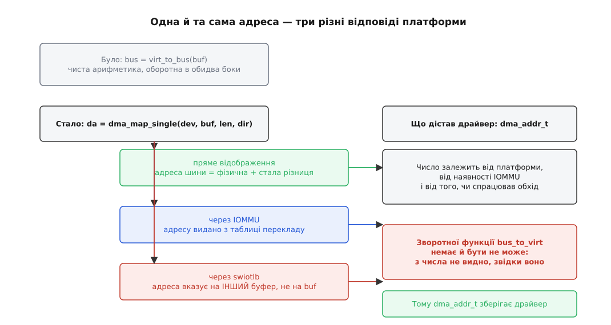

# 📜 Звідки взявся DMA API: як віднімання адрес перетворилося на передачу володіння

Двадцять років тому драйвер здобував адресу для пристрою одним рядком арифметики, і цей рядок був правильний — доки Linux жив на одній архітектурі. Історія DMA API — це історія того, як припущення «адреса шини і є фізична адреса» ламалося тричі поспіль, і як після третього разу з інтерфейсу зникла зворотна функція.

## Макрос, який був відніманням

У ранніх ядрах драйвер писав так:

```c
unsigned long bus = virt_to_bus(buf);   /* дай пристроєві число */
void *back    = bus_to_virt(bus);       /* і повернися назад */
```

На типовому PC це були два макроси, що додавали й віднімали сталу — зсув між віртуальними адресами ядра й фізичними. Пристрій на шині ISA чи ранній PCI виставляв на адресні лінії рівно ту саму фізичну адресу, яку бачив контролер пам'яті. Ніякого перекладу між ними не було, тож і функція була оборотна: з адреси шини однозначно діставалася адреса в ядрі.

Важливо, що це не було недбальством. Поки припущення тримається, простий макрос — правильне інженерне рішення: жодних викликів, жодного стану, нічого запам'ятовувати. Проблема з'явилася не тоді, коли макрос визнали поганим, а тоді, коли Linux поїхав туди, де він брехав.

## Три речі, які зламали припущення

Перший удар прийшов від машин Sun. Порт на SPARC (а надто на 64-бітну SPARC, кінець 1990-х) зіткнувся з тим, що між пристроєм і пам'яттю там стоїть окремий перекладач адрес — [IOMMU](topic:programming/iommu). Пристрій на такій машині взагалі не називає фізичних адрес: він називає числа, які IOMMU перекладе за своєю таблицею, і кожне таке число мусить бути спершу в цю таблицю внесене й потім вилучене. Арифметичний макрос тут не має що обчислювати — потрібна дія, а не формула.

Другий удар — обсяг пам'яті. Коли на серверах з'явилося більше чотирьох гігабайтів, виявилося, що безліч контролерів має регістр адреси на 32 біти й фізично не дотягується до верхньої пам'яті. Адреса, яку віддав макрос, могла бути технічно правильною й водночас недосяжною для того, кому її дали.

Третій удар — вбудовані системи. На багатьох системах-на-кристалі периферійна шина бачить оперативну пам'ять зі свого початку відліку, а процесор — зі свого; між двома поглядами стала різниця, і вона в кожного виробника своя. Тут макрос ще можна було б переписати під платформу, але ставало ясно, що кожна нова платформа означатиме новий макрос, а драйвер мусить лишатися одним.

Офіційне ставлення ядра до цих функцій зафіксовано в документі `Documentation/core-api/dma-api-howto.rst` (раніше `DMA-API-HOWTO.txt`) і не змінювалося роками: драйвери, переведені на новий інтерфейс, не мають уживати ні `virt_to_bus()`, ні `bus_to_virt()`, а самі функції планують прибрати повністю — деякі порти їх уже не надають, «бо коректно підтримати їх неможливо».

## 2.4: спершу зробили це для PCI

Заміну збудували не одразу загальною. У ядрах серії 2.4 (перший випуск — січень 2001 року) з'явилася сім'я викликів, прив'язана до шини PCI:

```c
void *cpu = pci_alloc_consistent(pdev, size, &dma_handle);
dma_addr_t da = pci_map_single(pdev, buf, len, PCI_DMA_TODEVICE);
```

Разом із ними в дерево лягла настанова `Documentation/DMA-mapping.txt` — під нею стоять три підписи: Девід С. Міллер (David S. Miller), Річард Гендерсон (Richard Henderson) і Якуб Єлінек (Jakub Jelinek); ці ж імена й досі очолюють нинішній `DMA-API-HOWTO`. Міллер супроводжував порт на SPARC і мережевий стек — тобто інтерфейс писала людина, яку припущення «шина = фізика» пекло щодня.

Ключове слово тих документів — **динамічне** відображення: адреси беруться лише на час передачі й віддаються після неї. Саме звідси походить нинішнє правило володіння буфером, і воно з'явилося не з міркувань чистоти, а тому, що запис у таблиці IOMMU — обмежений ресурс, який мусить хтось звільняти.

## Itanium і буфер, що прикидається пам'яттю

Окремою ниткою в ту саму купу впав механізм підмінних буферів. Файл `kernel/dma/swiotlb.c` досі несе свою початкову шапку, і вона читається як документ: авторські права 2000 року — Асіт Маллік (Asit Mallick) і Ґоутам Рао (Goutham Rao) з Intel, а також Hewlett-Packard за підписом Девіда Мосберґера-Танґа (David Mosberger-Tang), який вів порт Linux на IA-64. Перший рядок опису пояснює й назву: це запасний варіант «для платформ, що не мають апаратних I/O TLB» — тобто програмна імітація того самого перекладача адрес, який на дорогих чипсетах був залізом. Звідси *software I/O TLB*, swiotlb.

Itanium був першою масовою платформою, де великий обсяг пам'яті зустрівся з 32-бітними контролерами на одній материнській платі, тож саме там ідея «якщо не дотягується — перепишімо через нижній буфер» знадобилася найраніше. Пізніше механізм перестав бути особливістю однієї архітектури: у тій самій шапці є рядок `03/05/07 davidm — Switch from PCI-DMA to generic device DMA API`, тобто 7 травня 2003 року swiotlb перевели з PCI-інтерфейсу на загальний, а наступний рядок за 2004 рік підписаний `ak` — Анді Кляйн (Andi Kleen), який тягнув x86-64. Сьогодні під підмінні буфери ядро типово відкладає 64 МіБ на старті.

## 2.6: інтерфейс поверх пристрою, а не поверх шини

Узагальнення сталося в серії 2.5, що стала 2.6 (грудень 2003). Ідея була проста й трималася на тому, що якраз тоді дозріло: модель пристроїв ядра — спільна структура `struct device`, під яку підводили всі шини одразу (про неї є [модель пристроїв у sysfs](topic:unix-linux/sysfs-device-model)). Якщо є одна структура на будь-який пристрій будь-якої шини, то й DMA-виклики можна прив'язати до неї, а не до `struct pci_dev`:

```c
void *cpu = dma_alloc_coherent(dev, size, &dma_handle, GFP_KERNEL);
dma_addr_t da = dma_map_single(dev, buf, len, DMA_TO_DEVICE);
```

Джонатан Корбет описував цей перехід у серії про портування драйверів на 2.6 (LWN, 2003): новий набір функцій «не специфічний для жодної конкретної шини», більшість імен віддзеркалює старі PCI-ові, тож переписати драйвер здебільшого означало замінити префікс. Разом із цим переробили й списки сегментів: `struct scatterlist` перестав тримати вказівник на байти й став описувати сторінки — інакше буфер у верхній пам'яті просто не мав як бути названий.

## Чому зворотної функції більше немає

Ось у чому справжня втрата, і вона не про синтаксис. Подивімося, що тепер стоїть за одним викликом.



*Одне й те саме число могло народитися трьома різними способами, і по самому числу нізащо не сказати, яким саме.*

Якщо працює IOMMU, повернене число — це індекс у таблиці, яку ядро щойно заповнило; та сама фізична сторінка за годину дістане інше число, а те саме число завтра вказуватиме на іншу сторінку. Якщо спрацював swiotlb, число взагалі вказує **не на буфер драйвера**, а на службову ділянку в нижній пам'яті; байти туди перепишуть, і оригінальний буфер до кінця передачі стоятиме осторонь.

Тому оберненої операції не існує не з недогляду, а за будовою: відображення — це не перетворення числа, а створення тимчасового зв'язку, і по одному лише результату вихідних даних не відновити. Звідси й обов'язок драйвера: `dma_addr_t`, здобутий при відображенні, треба **зберегти самому** — у дескрипторі кільця, у структурі запиту, будь-де, — бо `dma_unmap_*` вимагає рівно те число, яке було видане. Драйвер, що спробує «перерахувати» його заново, звільнить не той запис у таблиці IOMMU, і пристрій продовжить писати в пам'ять, яку ядро вже вважає вільною.

## Довгі проводи

Старі виклики не викидали різко — їх лишили обгортками. Позначені як застарілі, вони жили в заголовку `include/linux/pci-dma-compat.h`: `pci_map_single` розгортався просто у `dma_map_single(&pdev->dev, …)`. Це прямий наслідок звички ядра не ламати тих, хто ще не переїхав, — [про сталість інтерфейсів у Linux](topic:unix-linux/kernel-abi-stability) варто читати окремо, бо всередині ядра ця сталість зовсім не така тверда, як назовні.

Заголовок вижив шістнадцять років. Коміт із назвою «PCI: Remove the deprecated 'pci-dma-compat.h' API» лежить у дереві з 30 березня 2022 року, підтверджений супровідником DMA-шару Крістофом Гелльвіґом (Christoph Hellwig) — тобто прибрано це у 5.18. Ще раніше, у 2016-му, ті самі помічники стягли з архітектур у спільний файл; заголовок останні роки був суто транзитною зупинкою.

Сама пара `virt_to_bus`/`bus_to_virt` теж дійшла кінця: у нинішньому `include/asm-generic/io.h` їх немає — там лишилися тільки `virt_to_phys` і `phys_to_virt`, які чесно кажуть, що перетворюють. На x86 доживає вузький уламок `isa_virt_to_bus()` для старої шини ISA, де припущення «шина = фізика» досі істинне й перевірене часом.

Підсумок цієї історії дивно практичний. Функція зникла не тому, що була погано названа, а тому, що описувала світ, у якому між пристроєм і пам'яттю нічого не стоїть. Щойно там з'явився хтось третій — таблиця перекладу, підмінний буфер, зсув шини, — арифметика перестала бути можливою в принципі, і на її місце стала не краща формула, а розмова: попроси, збережи те, що дали, поверни, коли скінчив.
