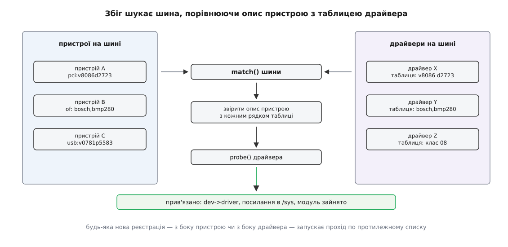
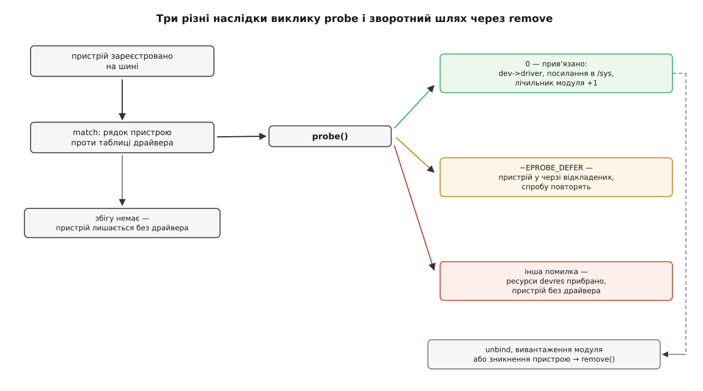
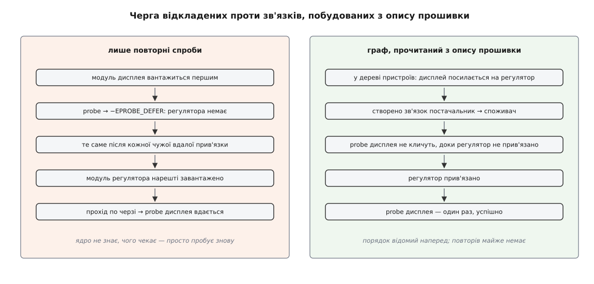

# Прив'язка драйвера до пристрою: probe, збіг за таблицею й відкладена спроба

<preknowlist>
- [Модель пристроїв у sysfs](topic:unix-linux/sysfs-device-model) — пристрій, драйвер і шина як три окремі об'єкти ядра, видні як каталоги в `/sys`.
- [Модулі ядра](topic:unix-linux/kernel-modules) — модуль подають ядру з простору користувача; ядро лише лінкує поданий образ і кличе його функцію ініціалізації.
- [Файл пристрою](topic:unix-linux/device-file-model) — що таке вузол у `/dev`, символьний і блоковий, і чому він не з'являється сам собою.
- [Дерево пристроїв](topic:unix-linux/device-tree) — як прошивка описує залізо, якого не можна знайти опитуванням шини.
- [Ядро й простір користувача](topic:unix-linux/kernel-and-userspace) — де межа привілею: probe виконується всередині ядра, а керують ним ззовні.
</preknowlist>

Модуль завантажено — `lsmod` його показує. Пристрій у системі є — його каталог видно в `/sys`. А не працює нічого, і в журналі ядра жодної скарги.

Ця картина здається безглуздою лише доти, доки ми вважаємо, що «завантажити драйвер» і «керувати пристроєм» — те саме. Насправді це дві різні події, розділені в часі, а між ними стоїть окреме рішення ядра: ось цей шматок коду відповідає за оцей шматок заліза. Доки рішення не ухвалене, код лежить у пам'яті без діла, а пристрій — у дереві без господаря. Ухвалення цього рішення й запис його наслідків і звуть **прив'язкою** (англ. *binding* — зв'язування).

## Дві реєстрації, які нічого не знають одна про одну

Спершу подивімося, звідки в системі беруться дві сторони майбутньої пари.

Пристрій з'являється тоді, коли хтось його зареєстрував. Код контролера PCI опитав свою шину й дістав від мікросхеми ідентифікатор виробника; хаб повідомив, що в порт USB щось встромили; код розбору опису від прошивки прочитав черговий вузол і створив за ним об'єкт. Спільне тут одне: хтось із боку заліза створив у ядрі структуру `struct device` й повісив її на конкретну шину.

Драйвер з'являється зовсім інакше — з коду. Коли модуль завантажують, його функція ініціалізації кличе реєстрацію: «я драйвер для шини PCI, ось мої ознаки». Драйвер, вбудований у ядро, робить те саме на своєму етапі старту.

Ці дві події не узгоджені між собою нічим. Флешку можна встромити і до, і після того, як завантажився `usb-storage`. Сенсор, описаний у дереві пристроїв, існує з першої секунди роботи ядра, а його драйвер може приїхати модулем із кореневої файлової системи через десять секунд. Отже, механізм зв'язування мусить однаково працювати з обох боків — і саме таким його й зробили.

Третьою стороною виступає шина (`struct bus_type`). Вона тримає два списки — своїх пристроїв і своїх драйверів — і функцію `match()`, яка вміє сказати, чи пасує конкретна пара. Реєстрація з будь-якого боку запускає прохід по протилежному списку: новий пристрій перебирає всі драйвери шини, новий драйвер перебирає всі її пристрої.



*Ані пристрій, ані драйвер не шукають одне одного: шукає шина, і робить це з обох боків симетрично — тому черговість появи сторін не має значення.*

Звідси перший практичний висновок: порядок завантаження модулів не впливає на те, **чи** знайдеться драйвер. Він впливає лише на те, **коли** це станеться.

## За чим порівнюють

Тепер головне питання: що саме звіряє `match()`.

З боку драйвера це статичний масив ознак у сирцях — перелік того, з чим драйвер береться працювати:

```c
static const struct of_device_id bmp280_of_match[] = {
	{ .compatible = "bosch,bmp280" },
	{ .compatible = "bosch,bme280" },
	{ }
};
MODULE_DEVICE_TABLE(of, bmp280_of_match);
```

Порожній елемент у кінці — не оздоба: таблиця не несе своєї довжини, і ядро перебирає її, доки не натрапить на обнулений рядок. Для PCI такий самий масив складається з чисел виробника й пристрою, для USB — з ідентифікаторів або з класу, підкласу й протоколу інтерфейсу, для шини I²C — з рядка-імені. Місця, які драйверові байдужі, позначають «будь-що».

З боку пристрою є його власний опис, складений у тому самому словнику: числа з конфігураційного простору PCI, дескриптор інтерфейсу USB, рядок `compatible` з дерева пристроїв, ідентифікатор із таблиць ACPI.

Тому `match()` — не одна функція на все ядро, а метод кожної шини: шина PCI порівнює числа з масками, шина I²C — рядки, шина USB заглядає в дескриптори. Спільним лишається тільки каркас: **опис пристрою проти таблиці драйвера**. Той самий масив ознак служить ще й для автоматичного підвантаження модуля — макрос `MODULE_DEVICE_TABLE` перетворює його на рядки-аліаси всередині файла `.ko`, і за ними [модуль знаходять на диску](topic:unix-linux/kernel-modules) ще до того, як його код узагалі потрапив у пам'ять.

Важливо чітко бачити, чим збіг **не** є. Ідентифікатор — це обіцянка, а не доказ. Виробник міг перевикористати числа на іншій мікросхемі; опис у дереві пристроїв міг скласти автор плати, і він міг помилитися; один і той самий `compatible` носять сумісні між собою чипи з дрібними відмінностями. Збіг за таблицею дає лише **кандидата** — і на цьому його роль закінчується.

## probe: єдиний момент, коли драйвер бачить залізо

Кандидат сам собою нічого не запускає. Шина кличе функцію `probe()` драйвера — і от вона вже має справу з реальністю.

Усередині `probe` драйвер робить чотири принципово різні речі, і кожна може не вдатися. Він бере ресурси, приписані пристроєві: діапазон регістрів, лінію переривання, тактовий сигнал, регулятор живлення, лінії GPIO. Він перевіряє, що це справді воно — читає регістр ідентифікації мікросхеми й порівнює з очікуваним. Він готує свій внутрішній стан. І аж наприкінці реєструє пристрій у тій підсистемі, до якої той належить, — і лише тоді назовні з'являється те, чим користуються люди: вузол у `/dev`, мережевий інтерфейс, вузол вводу.

Останнє варто підкреслити окремо. Вузол у `/dev` створює не «драйвер узагалі» і не факт завантаження модуля, а конкретний **успішний** `probe` для конкретного примірника заліза. Дві однакові плати — два виклики `probe`, два вузли.

```c
static int sensor_probe(struct i2c_client *client)
{
	struct iio_dev *indio;
	struct sensor *st;
	int ret;

	indio = devm_iio_device_alloc(&client->dev, sizeof(*st));
	if (!indio)
		return -ENOMEM;
	st = iio_priv(indio);

	st->vdd = devm_regulator_get(&client->dev, "vdd");
	if (IS_ERR(st->vdd))
		return dev_err_probe(&client->dev, PTR_ERR(st->vdd),
				     "немає регулятора живлення\n");

	ret = i2c_smbus_read_byte_data(client, REG_WHO_AM_I);
	if (ret < 0)
		return ret;
	if (ret != CHIP_ID)
		return -ENODEV;

	return devm_iio_device_register(&client->dev, indio);
}
```

Тут видно три різні відмови, і різниця між ними принципова. `-ENOMEM` — збій системи. `-ENODEV` — «за таблицею схоже, але мікросхема відповіла не те; це не моє». А помилка від регулятора може означати ще й третє, і про це — далі. Помічник `dev_err_probe()` (з'явився в ядрі 2020 року, автор Анджей Хайда) саме тому й існує: він пише зрозуміле повідомлення в журнал, але мовчить, коли причина відмови — «ще зарано», інакше журнал завантаження перетворився б на потік однакових скарг.

Прив'язку ядро записує **тільки** після того, як `probe` повернув нуль. У структурі пристрою з'являється покажчик на драйвер, у `/sys` — пара символьних посилань в обидва боки, а лічильник використання модуля зростає на одиницю. Ось звідки береться відмова `rmmod: Module is in use`: доки хоч один пристрій прив'язаний, код драйвера не можна прибрати з пам'яті.



*Відмова probe не ламає модель: пристрій лишається в дереві без драйвера, і це коректний, видимий ззовні стан.*

> 🔧 **Навіщо це.** «Пристрій не працює» — це насправді три різні стани, і `/sys` їх розрізняє за секунду. Каталогу пристрою немає взагалі — залізо не знайшли, питання до шини, прошивки чи опису плати. Каталог є, посилання `driver` в ньому немає — драйвера для цих ознак у системі немає або його `probe` відмовив. Посилання `driver` є — прив'язка відбулася, і проблема вже не тут, а в самому драйвері або в його налаштуваннях. Три команди замість годин здогадів.

## Хто прибирає за невдалим probe

Ланцюжок захоплень усередині `probe` породжує неприємну симетрію: якщо шоста дія не вдалася, треба акуратно скасувати п'ять попередніх — і рівно те саме доведеться робити ще раз при відв'язці. Написані окремо, ці два шляхи розходяться при першій же правці, а ціна помилки висока: забута лінія переривання лишається зайнятою назавжди, і наступна спроба провалиться вже з іншої причини, ніж перша.

Тому ресурси беруть через функції з префіксом `devm_`: узятий ресурс записується у список, прив'язаний до самого пристрою. Далі ядро розмотує цей список само — і коли `probe` повернув помилку, і коли пристрій відв'язують. Через це сучасний `probe` закінчується простим `return 0` без сходів прибирання, а функції `remove` у драйвера часто немає взагалі. [Керовані ресурси драйвера](topic:unix-linux/devres-managed-resources) — окремий механізм із власними правилами часу життя; для прив'язки досить знати, що невдалий `probe` не лишає по собі сміття.

## Ніхто не знає правильного порядку

Досі ми мовчки припускали, що все, потрібне драйверові, вже є. На шині PCI це майже завжди правда: пристрої самоописові, а залежності неглибокі. Але візьмімо контролер дисплея на однокристальній системі. Йому потрібні регулятор живлення, тактовий сигнал від контролера тактів, лінія GPIO для скидання й лінія переривання від контролера переривань. Кожен із цих чотирьох — окремий пристрій зі своїм драйвером, і кожен драйвер може бути модулем, який завантажать колись потім.

Правильного порядку не існує наперед. Він різний для кожної плати, а плат тисячі; і навіть на одній платі порядок залежить від того, які модулі є в початковому образі, а які приїдуть із кореневої файлової системи.

Історично цю проблему розв'язували глобальним порядком: етапи ініціалізації та черговість лінкування визначали, хто стартує раніше. Схема тримається, доки конфігурація одна; вона розсипалася, щойно той самий драйвер почали вживати на різних платах з різними зв'язками. [Як від жорсткого порядку прийшли до відкладеної спроби](topic:unix-linux/driver-probe-and-binding/hist-ordering-problem.md) — окрема історія з датами й іменами: файли опису плат, вибух конфігурацій в ARM, механізм відкладення 2011–2012 років і зв'язки між пристроями через десять років по тому.

Розв'язок виявився напрочуд простим. Драйвер, який бачить, що потрібного йому постачальника ще немає на світі, повертає не помилку, а окремий код `-EPROBE_DEFER` — «спробуй мене пізніше». Ядро ставить такий пристрій в окрему чергу, а щоразу, коли **будь-яка** прив'язка в системі завершилася успіхом, переносить усю чергу в робочу й проходить її знову в окремому потоці.

Тригер обрано не навмання: успішний `probe` — єдина подія, після якої в системі може з'явитися новий постачальник. Отже, повторювати спроби має сенс саме після нього (і ще після реєстрації нового драйвера). Система сходиться до правильного стану, хоча ніхто ніде не будував графа залежностей.

За це платять роботою. Пристрій із довгим ланцюжком залежностей пробують і десять разів; журнал завантаження густішає; а головне — пристрій, чий постачальник не з'явиться ніколи (модуль не встановлено, опис плати неповний), лишається в черзі мовчки, без жодної помилки. Саме цей випадок і породжує ту сцену, з якої ми почали. Дивитися на нього треба в налагоджувальному файлі:

**Умова: пристрій `1-0076` на шині I²C не показує вузла, драйвер завантажено.**

```
$ cat /sys/kernel/debug/devices_deferred
1-0076	supplier regulator@1 not ready
```

Пристрій чекає, і чекатиме вічно. Другий стовпчик — не ім'я драйвера, а причина: туди лягає те, що драйвер сказав через `dev_err_probe()`. Драйвер, який просто повернув `-EPROBE_DEFER`, лишає стовпчик порожнім, і тоді, якого ресурсу забракло, покаже хіба `dmesg` із увімкненим виведенням причин.

## Коли порядок можна прочитати наперед

Механізм повторних спроб працює, але він сліпий: ядро не знає, чого чекає, тому пробує все й знову. Тим часом потрібне знання вже лежить у нього перед очима. Посилання з вузла дисплея на вузол регулятора в дереві пристроїв — це і є залежність, записана явно, ще до будь-якого `probe`.

Звідси наступний крок: пройти опис від прошивки заздалегідь, витягти з нього посилання й побудувати між пристроями явні зв'язки «постачальник → споживач». Маючи такий зв'язок, ядро просто не кличе `probe` споживача, доки постачальника не прив'язано. Це роблять [зв'язки між пристроями](topic:unix-linux/device-links), а частину, яка будує їх із опису прошивки, звуть `fw_devlink`; типово її увімкнули у версії 5.13 (2021 рік, автор Саравана Каннан) — у 5.12 таку спробу зробили, але відкотили.



*Обидва шляхи ведуть до однакового результату; різниця в кількості марної роботи й у тому, чи знає ядро, чого саме бракує.*

Вигода не лише в економії. Порядок спроб фактично повторює граф залежностей, модулі можна вантажити в будь-якій черговості, а ядро тепер розрізняє «постачальника ще немає» і «постачальника не буде»: у першому випадку є кого чекати. Цикл в описі — коли два вузли посилаються один на одного — не вішає систему: такі зв'язки переводять у м'який режим і повертаються до звичайних повторних спроб.

Ті самі зв'язки працюють і поза прив'язкою: вони задають порядок [присипляння й пробудження пристроїв](topic:unix-linux/runtime-power-management), бо постачальника не можна вимкнути раніше за споживача.

Код `-EPROBE_DEFER` при цьому нікуди не подівся й не подінеться. Зв'язки будують із того, що **записано** в описі; залежність, яку драйвер виявляє вже на ходу — чужий блок мікрокоду, який ще не завантажили, або перетворювач сигналу, знайдений іншим шляхом, — лишається справою відкладеної спроби.

## Прив'язка вручну

Автоматичне рішення не завжди те, якого хочуть від системи. Пристрій треба віддати віртуальній машині; новий драйвер треба випробувати замість штатного; плата з нестандартним ідентифікатором потребує драйвера, який про неї не знає.

Тому прив'язка — не подія, а **стан**, яким можна керувати ззовні. У `/sys` є файли, куди пишуть ім'я пристрою, щоб відв'язати його або прив'язати назад; є спосіб додати драйверові новий ідентифікатор на ходу; є спосіб навпаки — записати в самому пристрої ім'я драйвера, який єдиний матиме право його взяти (з'явився 2014 року для PCI, автор Алекс Вільямсон, згодом і на інших шинах). Останній спосіб надійніший за додавання ідентифікаторів: він не залежить від того, хто встиг першим. Точний перелік цих файлів, їхній формат і параметри ядра, що впливають на прив'язку, зібрано окремо — [важелі керування прив'язкою](topic:unix-linux/driver-probe-and-binding/api-binding-controls.md).

Одне застереження варте того, щоб сказати його прямо: відв'язка виконує повноцінний `remove()` незалежно від того, чи хтось зараз користується пристроєм. Для змонтованого диска або активного мережевого інтерфейсу це закінчиться погано. Ядро тут не сперечається з адміністратором.

Побачити всі описані стани на живому прикладі — від таблиці ознак до навмисного відкладення й ручної відв'язки — можна на невеликому власному драйвері: [збираємо драйвер і спостерігаємо за прив'язкою](topic:unix-linux/driver-probe-and-binding/proj-probe-driver.md).

## Коли probe довгий

Лишилася одна властивість, яка впливає на все, що бачить простір користувача. Типово `probe` викликають синхронно, у контексті того, хто зареєстрував сторону: функція ініціалізації модуля не повернеться, доки не спробували всі підхожі пристрої. Драйвер, який чекає розкручування диска чи вантажить мікрокод із файлової системи, тримає на собі весь етап завантаження.

Тому драйвер може попросити асинхронну спробу — тоді ядро віддає `probe` окремому потоку, а реєстрація повертається негайно. Те саме можна нав'язати ззовні: списком імен драйверів у командному рядку ядра або параметром модуля під час завантаження. Робота над цим ішла з 2014–2015 років і починалася як спосіб пришвидшити старт систем із повільними драйверами.

Для програм назовні звідси випливає правило, про яке легко забути: успішне повернення `modprobe` не означає, що пристрій готовий. Прив'язка могла ще не статися, а могла статися й пізніше, коли з'явиться постачальник. Чекати треба не на завершення команди, а на подію від ядра — на ту саму, яку слухає [служба іменування пристроїв](topic:unix-linux/udev-rules). Пристрій у Unix з'являється не тоді, коли завантажили код, а тоді, коли ядро записало, що цей код за нього відповідає.
