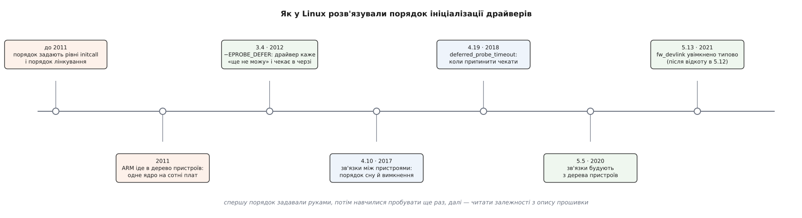

# 📜 Історія порядку: як ядро перестало вгадувати, кого запускати першим

Це історія однієї відмови: замість шукати правильний порядок ініціалізації драйверів, Linux дозволив драйверові сказати «зараз не можу» — і саме ця відмова від сортування виявилася розв'язком. Нижче — звідки взялася задача, чому вона вибухнула саме на ARM близько 2011 року, і як за наступне десятиліття «спробуй ще раз» доросло до «прочитай залежності з опису прошивки».

*Порядок спершу задавали руками, потім навчилися пробувати ще раз, далі — читати залежності з опису прошивки*

## Порядок, зашитий у збірку

У ранньому ядрі порядок запуску вбудованих драйверів був властивістю не системи, а збірки. Кожна ініціалізаційна функція потрапляла в один із рівнів [initcall](topic:unix-linux/kernel-initcalls) — `core`, `postcore`, `arch`, `subsys`, `fs`, `device`, `late`, — і ядро проходило рівні один за одним. Усередині рівня порядок визначався порядком лінкування, тобто фактично послідовністю каталогів у `drivers/Makefile`. Хочеш, щоб контролер живлення піднявся раніше за екран, — або переносиш його реєстрацію на щабель вище (`subsys_initcall` замість `device_initcall`), або пересуваєш рядок у Makefile.

На персональному комп'ютері це майже не боліло: PCI сам перелічує пристрої, а залежності між ними здебільшого не виходять за межі шини. Боліло у вбудованих системах, де плата описувалася файлом на C — `arch/arm/mach-*/board-*.c`, — у якому вручну перелічені всі мікросхеми, лінії живлення й тактові сигнали. Тут залежність «екран не запуститься без регулятора з i2c-розширювача» була справжньою, а єдиним інструментом для неї — щаблі initcall.

У цієї схеми було дві фатальні вади. Перша: щабель — це глобальна властивість, і щоб полагодити одну плату, треба посунути драйвер для всіх. Друга гірша: [модулі ядра](topic:unix-linux/kernel-modules) взагалі не мають щаблів — модуль ініціалізується тоді, коли його завантажили, і жоден `subsys_initcall` цього не впорядкує. Сам Ґрант Лайклі (Grant Likely) в описі свого патча назве це прямо: керування порядком через initcall — «повний хак», який до того ж «навіть віддалено не покриває» випадок драйверів у модулях (перевірено за текстом коміта d1c3414c у мейнлайні).

## 2011: ARM іде в дерево пристроїв

Вибухнуло, коли файлів плат стало забагато. Кожна нова плата — новий файл на C у дереві ядра, з майже тим самим вмістом, що й у сусіда; галузь ARM у ядрі роздувалася швидше за будь-яку іншу. Відповіддю стало перенесення опису апаратури з коду в дані — [дерево пристроїв](topic:unix-linux/device-tree), уже випробуване на PowerPC, — і консолідація ARM-плат в окремому дереві супроводу (arm-soc). Роботи розгорнулися саме близько 2011 року; поширене твердження, що спусковим гачком була різка критика Лінуса Торвальдса на адресу потоку коду плат навесні 2011-го, добре відоме зі списків розсилки, але точних листів тут не перевірено — це правдоподібний, а не документований у цій вставці факт. Напрямок робіт, натомість, видно з самого дерева ядра.

І тут задача обернулася гострим боком. Коли плата описана даними, одне й те саме ядро обслуговує сотні різних плат, а пристрої створюються обходом дерева — у порядку вузлів, який ніхто не підбирав під залежності. Важіль, яким досі впорядковували ініціалізацію (пересунути initcall, пересунути рядок у Makefile), зник рівно тоді, коли став найпотрібніший: одного правильного порядку більше не існувало, бо ядро було одне, а плат — багато.

## Патч, який перевернув задачу

Розв'язок Лайклі не шукає порядку. Він дозволяє драйверові, який не дістав потрібного ресурсу, повернути з `probe` особливий код помилки й потрапити в чергу відкладених — щоб ядро спробувало ще раз після того, як прив'яжеться хтось інший. Реєстрація драйверів може відбуватися в будь-якому порядку; жодних щаблів.

Патч дозрівав не один захід, і його власний журнал змін це фіксує. У другій редакції з'явилося блокування й вилучення пристрою з черги під час `device_del`. У третій запуск робочої черги відклали до `late_initcall`, щоб основна маса probe встигла відпрацювати до першого повтору. У четвертій Манджунат (Manjunath) додав окрему робочу чергу — і, найважливіше, `-EAGAIN` замінили на власний код `-EPROBE_DEFER`.

> 🔧 **Навіщо це.** `-EAGAIN` у ядрі означає надто багато різного: його може повернути будь-який вкладений виклик усередині `probe`, і драйвер віддав би його ядру ненавмисно — а ядро прочитало б це як «відклади мене» й тримало б пристрій у черзі назавжди. Окремий код (517, з внутрішнього діапазону, який ніколи не витікає в простір користувача) робить намір однозначним: відкладення трапляється лише тоді, коли драйвер справді його попросив.

Коміт «drivercore: Add driver probe deferral mechanism» датований 5 березня 2012 року, застосований Ґреґом Кроа-Гартманом (Greg Kroah-Hartman) 8 березня, з рецензіями Марка Брауна (Mark Brown), Девіда Дейні (David Daney) й Арнда Берґмана (Arnd Bergmann); уперше вийшов у ядрі 3.4 — усе це звірено з git-історією мейнлайну. Перші редакції ходили списками ще восени 2011-го (жовтень наводять найчастіше) — журнал змін підтверджує щонайменше три доробки до злиття, але саму дату першої публікації тут не перевірено за архівом.

Ціна розв'язку видна одразу: ядро не знає, чого саме бракує. Воно знає лише, що спроба не вдалася, і що після кожної чужої вдалої прив'язки має сенс пройтися чергою ще раз.

## Коли перестати чекати

З незнання випливає наступна проблема: пристрій, чий постачальник не з'явиться ніколи, лежить у черзі мовчки й вічно. Для системи, яка мусить завантажитися до оболонки навіть зі зламаним датчиком, це погано. У липні 2018 року Роб Геррінг (Rob Herring) додав параметр `deferred_probe_timeout` — «дозволити припиняти відкладену спробу після ініціалізації» (ядро 4.19).

Далі почалися хитання, показові самі по собі. У лютому 2020-го Джон Столц (John Stultz) підняв типове значення до довшого, якщо ядро зібране з підтримкою модулів: коли драйвери модульні, кінець initcall-ів не означає нічого, бо потрібний модуль може приїхати з кореневої файлової системи пізніше. У квітні того ж року він сам повернув типове значення до нуля — наслідки в реальних системах виявилися гіршими за проблему. У вікні злиття 5.19 Саравана Каннан (Saravana Kannan) скасував це скасування (1 червня 2022) і за два дні (3 червня) знову виставив нуль, полагодивши натомість взаємодію з `wait_for_device_probe()`. Дати й підписи звірені з git-історією. Документація ядра описує сам параметр коротко: значення 0 припиняє чекання наприкінці initcall-ів, від'ємне значення означає нескінченне очікування.

## Друга хвиля: знати залежність, а не вгадувати її

Паралельно визріла інша лінія. 30 жовтня 2016 року Рафаель Й. Висоцький (Rafael J. Wysocki, польський розробник з Intel) додав до ядра відстеження функційних залежностей — зв'язки між пристроями, що вийшли в 4.10. Мотив був не про probe, а про [сон і пробудження](topic:unix-linux/suspend-and-resume): дерево «батько → дитина» бреше про справжні залежності, коли пристрій живиться від регулятора з іншої шини, і вимикати їх треба в правильному порядку. Але той самий зв'язок «постачальник → споживач» так само добре впорядковує й прив'язку.

Далі Саравана Каннан з Google поставив питання, яке заднім числом здається очевидним: дерево пристроїв уже містить ці залежності. Кожне посилання на регулятор, тактовий сигнал, лінію GPIO чи контролер переривань — це запис «мені потрібен ось той вузол». З вересня 2019-го пішли патчі, що будують зв'язки прямо з властивостей дерева (вийшли в 5.5), а в листопаді 2020-го з'явилася основа — зв'язки між вузлами опису прошивки (fwnode), які існують ще до того, як створено `struct device` (5.11). Саме це робить порядок відомим наперед, а не постфактум.

Увімкнення `fw_devlink` типово вийшло драматичним. Коміт від 17 грудня 2020 року потрапив у вікно злиття 5.12 — і зламав завантаження на реальних системах, тож 18 лютого 2021-го Ґреґ Кроа-Гартман його скасував. Саравана повернув усе назад 2 березня, і за git-родоводом це повернення в 5.12 не входить, а входить у 5.13 (червень 2021). Тож поширене «типово з 5.12» вірне щодо наміру й хибне щодо того, яке ядро отримали користувачі.

Відкладена спроба після цього не зникла — вона стала запасним шляхом там, де опис прошивки мовчить: у пристроях, створених вручну, або на платформах, де дерева пристроїв немає. Змінилося інше: якщо раніше пристрій у черзі відкладених був звичайним станом раннього завантаження, то тепер це радше сигнал, що постачальника справді немає. Натомість з'явився новий клас помилок, якого не існувало, доки всі просто пробували знову: цикл у графі залежностей, який ядро мусить виявити й розірвати, інакше жоден із двох пристроїв не дочекається іншого.
