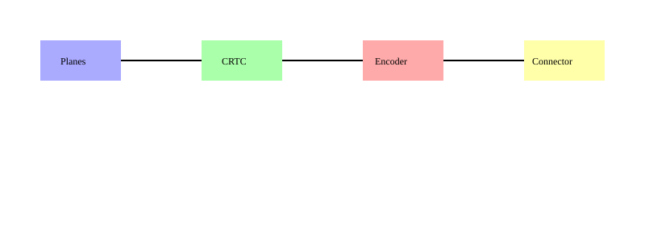

# Прямий рендеринг ядра DRM/KMS: атомне перемикання режимів

<preknowlist>
- [Концепції ядра Linux](book:unix-linux/kernel-and-userspace) — базові поняття системних викликів та VFS.
</preknowlist>

## 1. Вступ та історичний контекст

Графічна підсистема операційних систем на базі ядра Linux пройшла довгий і складний шлях еволюції. На світанку епохи відкритих операційних систем графіка забезпечувалася виключно простором користувача (user-space). X Window System (чи просто X11) напряму взаємодіяла з апаратним забезпеченням, монополізуючи доступ до відеокарти. Такий підхід мав суттєві недоліки: відсутність безпеки (X-сервер працював з правами root), неможливість коректної багатозадачності при роботі з графікою та високі затримки.

З розвитком 3D-графіки та появою потреби у прискоренні рендерингу (hardware acceleration), архітектура почала змінюватися. Було створено Direct Rendering Infrastructure (DRI), яка дозволила OpenGL-застосункам безпосередньо взаємодіяти з відеокартою, минаючи X-сервер для операцій малювання. Проте, керування відеорежимами, пам'яттю та ресурсами дисплея залишалося хаотичним.

Саме для вирішення цих фундаментальних проблем у ядрі Linux з'явився Direct Rendering Manager (DRM). Початково DRM був лише невеликим модулем, що арбітрував доступ до відеокарти для множинних DRI-клієнтів. Однак з часом він перетворився на потужну і розгалужену підсистему, яка повністю контролює графічне апаратне забезпечення.

Наступним логічним кроком стала поява Kernel Mode Setting (KMS) — технології, що перенесла завдання встановлення відеорежимів (роздільна здатність, частота оновлення, глибина кольору) з простору користувача безпосередньо в ядро. Це забезпечило швидке та безшовне перемикання віртуальних консолей, красивий завантажувальний екран (splash screen) без мерехтіння та надійний контроль за станом дисплея у випадках падіння графічного сервера.

Найсучаснішим етапом розвитку KMS є Atomic KMS (атомне KMS), яке ми детально розглянемо у цій статті. Воно вирішує проблеми часткових оновлень дисплея (tearing) та спрощує розробку драйверів, забезпечуючи транзакційний підхід до зміни стану дисплейного конвеєра.

## 2. Архітектура Direct Rendering Manager (DRM)

DRM — це підсистема ядра Linux, яка відповідає за взаємодію з сучасними відеокартами. Вона надає уніфікований інтерфейс (через спеціальні файли пристроїв, зазвичай `/dev/dri/cardX`), за допомогою якого програми простору користувача можуть надсилати команди графічному процесору, управляти відеопам'яттю та конфігурувати дисплеї.

DRM розділяється на дві основні частини:
1. **DRM Core (ядро DRM):** Надає базовий API та загальну інфраструктуру для всіх драйверів. Воно обробляє реєстрацію пристроїв, створення файлових дескрипторів, загальні (generic) ioctl-виклики та керує об'єктами (CRTC, конектори тощо).
2. **DRM Drivers (драйвери DRM):** Специфічні для апаратного забезпечення модулі (наприклад, `amdgpu`, `i915`, `nouveau`), які реалізують взаємодію з конкретними GPU. Вони розширюють базовий API своїми власними ioctl-викликами для специфічних операцій (наприклад, управління шейдерами чи специфічними чергами команд).

### 2.1. Управління пам'яттю: GEM та TTM

Для того, щоб GPU міг рендерити зображення, він потребує доступу до пам'яті. Управління відеопам'яттю — складна задача, враховуючи наявність різних типів пам'яті (VRAM на самій відеокарті, GART/GTT — системна пам'ять, доступна GPU). DRM використовує два основних менеджери пам'яті:

*   **GEM (Graphics Execution Manager):** Розроблений компанією Intel, GEM пропонує простий і елегантний API для створення буферів у пам'яті, управління їхнім кешуванням та синхронізацією. Він ідеально підходить для інтегрованої графіки (Unified Memory Architecture), де GPU та CPU використовують спільну фізичну пам'ять.
*   **TTM (Translation Table Maps):** Більш складний і потужний менеджер пам'яті, створений переважно для дискретних відеокарт (наприклад, драйверами `radeon`, `nouveau`). TTM вміє переміщувати буфери між відеопам'яттю (VRAM) та системною пам'яттю (RAM) у фоновому режимі, що необхідно при нестачі VRAM. Сучасні драйвери часто використовують GEM API для взаємодії з користувачем, а під капотом використовують TTM для управління переміщенням буферів.

## 3. Kernel Mode Setting (KMS)

KMS — це підсистема в рамках DRM, яка повністю відповідає за дисплейний конвеєр (display pipeline). Її завдання — взяти пікселі з буферів пам'яті і правильно відправити їх на фізичні роз'єми екрана.



Для абстрагування різноманітного апаратного забезпечення, KMS визначає кілька ключових об'єктів:

### 3.1. Planes (Площини)

Площина (Plane) — це джерело пікселів. Вона представляє певний буфер у пам'яті, який містить зображення, готове для відображення на екрані. Апаратно це відповідає блокам "overlay" або "sprite" всередині дисплейного контролера GPU.

Площини бувають кількох типів:
*   **Primary Plane (Основна площина):** Площина, яка використовується для відображення основного фону робочого столу. Кожен CRTC обов'язково повинен мати хоча б одну активну основну площину.
*   **Cursor Plane (Площина курсора):** Спеціальна легковагова площина, оптимізована для відображення апаратного курсора миші. Її використання зменшує затримки та знижує навантаження на систему, оскільки переміщення курсора не вимагає перемальовування основної площини.
*   **Overlay/Sprite Planes (Оверлейні площини):** Додаткові площини, які апаратно накладаються поверх (або під) основною. Вони часто використовуються для відображення відео або 3D-ігор у віконному режимі без необхідності їх копіювання в основний буфер робочого столу (Direct Scanout).

### 3.2. CRTC (Cathode Ray Tube Controller)

Назва CRTC залишилася як данина історії епохи ЕПТ-моніторів (CRT). У сучасному KMS, CRTC абстрагує апаратний блок дисплейного контролера (display engine/controller), який відповідає за:
1. Зчитування даних з однієї або кількох площин (Planes).
2. Змішування (blending) цих площин (з урахуванням альфа-каналу, масштабування).
3. Генерування хронометражних сигналів (timings) відеорежиму — VSYNC, HSYNC, vblank, hblank.

Кожен CRTC генерує рівно один потік пікселів і може працювати з одним конкретним відеорежимом у даний момент часу. Кількість CRTC на відеокарті визначає максимальну кількість незалежних екранів, до яких можна одночасно виводити різне зображення.

### 3.3. Encoders (Енкодери)

CRTC видає "сирий" потік пікселів і сигналів синхронізації у внутрішньому форматі відеокарти. Цей потік потрібно перетворити у формат, зрозумілий для конкретного фізичного інтерфейсу (наприклад, TMDS для HDMI/DVI, LVDS для старих екранів ноутбуків, DisplayPort, VGA). За це перетворення відповідає Енкодер (Encoder).

Енкодер бере дані з CRTC і перетворює їх у специфічні електричні сигнали. Один CRTC може бути підключений до різних енкодерів, але зазвичай один енкодер обслуговує лише один тип роз'єму.

### 3.4. Connectors (Конектори)

Конектор абстрагує фізичний роз'єм на задній панелі відеокарти (HDMI, DisplayPort, DVI, VGA тощо). Конектори відповідають за:
*   Визначення статусу підключення (plugged, unplugged).
*   Зчитування EDID (Extended Display Identification Data) монітора по шині I2C. EDID містить інформацію про виробника монітора, його фізичні розміри та список підтримуваних відеорежимів.
*   Управління властивостями з'єднання (наприклад, увімкнення/вимкнення аудіо по HDMI, управління яскравістю панелі ноутбука через DPCD).

В процесі роботи KMS, програма простору користувача (наприклад, композитор Wayland або X-сервер) створює ланцюжок (pipeline):
**Plane -> CRTC -> Encoder -> Connector**

## 4. Від Legacy KMS до Atomic KMS

Початковий (Legacy) API KMS використовував безліч окремих ioctl-викликів для кожної операції. Наприклад:
*   `DRM_IOCTL_MODE_SETCRTC` — встановити режим для CRTC (і прив'язати його до конекторів і буфера).
*   `DRM_IOCTL_MODE_SETPLANE` — перемістити або оновити площину.
*   `DRM_IOCTL_MODE_CURSOR` — оновити апаратний курсор.
*   `DRM_IOCTL_MODE_PAGE_FLIP` — запланувати перемикання буферів (Page Flip) при наступному вертикальному синхроімпульсі (VBlank).

### Проблеми Legacy KMS

1.  **Відсутність атомарності:** Якщо композитор хотів одночасно перемістити вікно (на Overlay Plane), курсор (на Cursor Plane) і оновити фон (на Primary Plane), він мусив викликати три окремі ioctl. Це могло призвести до того, що одні оновлення встигали застосуватися до початку кадру, а інші — ні. Результат — розриви зображення (tearing) або візуальні артефакти (наприклад, курсор "відстає" від вікна, яке він тягне).
2.  **Проблема тестування (Check and Commit):** Композитор не міг заздалегідь перевірити, чи підтримує апаратне забезпечення певну конфігурацію площин без ризику застосувати її. Деякі GPU підтримують масштабування лише на певних площинах, або обмежені у кількості площин, які можуть працювати одночасно з певною роздільною здатністю, через обмеження пропускної здатності пам'яті (memory bandwidth). Виклик `SETCRTC` або `SETPLANE` у разі невдачі залишав дисплей у невизначеному або чорному стані. Це змушувало композитори писати купу специфічного для драйверів коду або відмовлятися від апаратного прискорення.

### Рішення: Atomic KMS

Atomic KMS (введено в ядрі Linux 4.2) повністю змінює парадигму. Замість окремих ioctl для кожної дії, з'явився єдиний універсальний виклик — `DRM_IOCTL_MODE_ATOMIC`.

Atomic API базується на концепції **властивостей (Properties)**. Кожен об'єкт (Plane, CRTC, Connector) має набір властивостей (наприклад, ідентифікатор буфера `FB_ID`, координати `SRC_X`, `CRTC_Y`, стан ввімкнення `ACTIVE`).

Зміна стану дисплея тепер відбувається транзакційно:
1.  **Збірка стану:** Програма простору користувача створює список змін властивостей для будь-якої кількості об'єктів.
2.  **DRM_MODE_ATOMIC_TEST_ONLY (Перевірка):** Користувач може викликати ioctl з прапорцем `TEST_ONLY`. Ядро (і драйвер) проходять через весь процес валідації нової конфігурації, перевіряють наявність ресурсів (пропускної здатності, PLL, конвеєрів масштабування) і повертають результат (OK або Error). При цьому *жодних апаратних змін не відбувається*. Це дозволяє композиторам безболісно шукати оптимальні апаратні конфігурації.
3.  **Atomic Commit (Застосування):** Якщо тест пройшов успішно, користувач викликає той самий ioctl без прапорця `TEST_ONLY`. Ядро гарантує, що *всі* зміни будуть застосовані атомарно, синхронно з VBlank, виключаючи будь-які розриви зображення (tearing). Якщо якась частина конфігурації з якихось причин не застосується в останній момент, драйвер відкотить стан до попереднього (наскільки це можливо апаратно).

### Виклик `drmModeAtomicCommit`

Бібліотека `libdrm` надає обгортку для цього ioctl. Ось як концептуально виглядає робота з Atomic KMS (псевдокод на C):

```c
#include <xf86drm.h>
#include <xf86drmMode.h>

// 1. Алокація атомного запиту
drmModeAtomicReqPtr req = drmModeAtomicAlloc();

// 2. Додавання змін властивостей до запиту
// Встановлюємо новий буфер (fb_id) для Primary Plane
drmModeAtomicAddProperty(req, plane_id, prop_fb_id, new_fb_id);
// Змінюємо координати площини курсора
drmModeAtomicAddProperty(req, cursor_plane_id, prop_crtc_x, mouse_x);
drmModeAtomicAddProperty(req, cursor_plane_id, prop_crtc_y, mouse_y);

// 3. Фаза перевірки (Check)
uint32_t flags = DRM_MODE_ATOMIC_TEST_ONLY;
int ret = drmModeAtomicCommit(drm_fd, req, flags, NULL);

if (ret == 0) {
    // 4. Апаратне забезпечення підтримує цю конфігурацію, комітимо зміни
    flags = DRM_MODE_ATOMIC_NONBLOCK | DRM_MODE_PAGE_FLIP_EVENT;
    drmModeAtomicCommit(drm_fd, req, flags, user_data_pointer);
} else {
    // Апаратне забезпечення не може обробити такий запит
    // (наприклад, не вистачає смуги пропускання пам'яті).
    // Композитор може зробити fallback (відмалювати курсор
    // в основний буфер програмно за допомогою OpenGL/Vulkan).
}

drmModeAtomicFree(req);
```

Прапорець `DRM_MODE_ATOMIC_NONBLOCK` говорить ядру, що виклик не повинен блокувати потік виконання. Ядро планує атомарне оновлення на найближчий VBlank і повертає управління програмі.
Коли VBlank настає і апаратні регістри оновлюються, ядро генерує подію (event) у файловому дескрипторі DRM (завдяки прапорцю `DRM_MODE_PAGE_FLIP_EVENT`). Композитор зчитує цю подію і знає, що новий кадр відображається, і можна починати рендеринг наступного.

## 5. PRIME: dma-buf Sharing та багатографічні системи

Сучасні комп'ютерні системи (особливо ноутбуки) часто оснащені двома графічними процесорами: інтегрованим (iGPU, енергоефективним) та дискретним (dGPU, високопродуктивним). Технології NVIDIA Optimus та AMD Switchable Graphics дозволяють перемикатися між ними.

У Linux ця функціональність реалізована через технологію **PRIME** (назва походить від Optimus Prime), яка базується на механізмі ядра **dma-buf**.

### Що таке dma-buf?

dma-buf — це фреймворк ядра Linux, який дозволяє різним драйверам пристроїв безкопіювально (zero-copy) ділитися буферами пам'яті (Direct Memory Access). Замість того, щоб копіювати дані з пам'яті одного пристрою в пам'ять іншого через CPU, dma-buf дозволяє одному пристрою "експортувати" буфер, перетворюючи його у звичайний файловий дескриптор (fd). Інший пристрій може "імпортувати" цей fd і налаштувати свої таблиці сторінок (MMU/IOMMU) так, щоб читати чи писати прямо в цей буфер.

### Як працює PRIME (Offloading)

В архітектурі гібридної графіки екран фізично підключений до інтегрованої карти (iGPU). Дискретна карта (dGPU) не має фізичного підключення до екрана (вона є headless/displayless).

Щоб запустити вимогливу 3D-гру на dGPU і вивести її на екран:
1.  Композитор Wayland/X11 (працює на iGPU) запитує у dGPU створення буфера для гри.
2.  Гра (через Vulkan/OpenGL) рендерить 3D-сцену в цей буфер відеопам'яті dGPU.
3.  Коли кадр готовий, dGPU експортує цей буфер за допомогою PRIME (dma-buf) і передає файловий дескриптор композитору.
4.  Композитор імпортує dma-buf в iGPU.
5.  Якщо iGPU та dGPU мають доступ до спільної системної пам'яті (GART/GTT), копіювання може і не відбуватися (iGPU просто зчитує відрендерений буфер). Якщо ж dGPU має власну ізольовану VRAM, ядро за допомогою DMA движків (DMA engines) автоматично копіює дані з VRAM dGPU в системну пам'ять iGPU (Reverse PRIME).
6.  Композитор використовує KMS Atomic API, щоб призначити цей імпортований буфер як Plane на CRTC iGPU.

Таким чином досягається безкопіювальний (або з мінімальним копіюванням за допомогою DMA, без участі CPU) обмін кадрами між двома абсолютно різними відеокартами, якими керують різні DRM драйвери.

## 6. Висновок

Direct Rendering Manager у поєднанні з Atomic KMS та PRIME створює надійний, високопродуктивний та гнучкий фундамент для сучасної графіки в Linux. Атомарність забезпечує ідеально гладке зображення без розривів (tearing), а концепція Properties дозволяє легко розширювати API для нових апаратних можливостей (наприклад, підтримка HDR, колірних профілів, змінної частоти оновлення VRR/FreeSync) без зміни ядра підсистеми. Розуміння дисплейного конвеєра KMS є критично важливим для розробників сучасних композиторів (Mutter, KWin, wlroots) та драйверів графіки в ядрі Linux.
