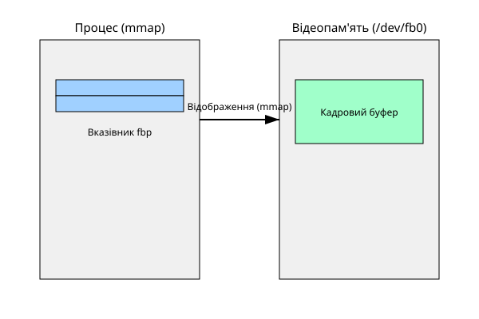

<preknowlist>

Що треба знати перед читанням

- Базове розуміння файлових дескрипторів і спеціальних файлів пристроїв у Linux (`/dev`).
- Розуміння системного виклику `ioctl` для взаємодії з драйверами.
- Знання системного виклику `mmap` для відображення пам'яті в адресний простір процесу.

</preknowlist>

Коли операційна система Linux завантажується, їй потрібно виводити текст або логотип на екран ще до того, як завантажаться складні графічні сервери, такі як X11 або Wayland. В індустрії вбудованих систем (embedded) або для інформаційних терміналів і кіосків часто виникає схожа нетривіальна проблема: як просто й без зайвих залежностей намалювати пікселі на екрані, маючи мінімум ресурсів і без розгортання повноцінного віконного середовища?

Відповіддю на це в Linux традиційно був інтерфейс кадрового буфера (Framebuffer), відомий у системі як пристрій `/dev/fb0`. Кадровий буфер абстрагує графічне обладнання, дозволяючи програмному забезпеченню отримувати доступ до відеопам'яті так само, як до звичайного лінійного масиву байтів у пам'яті, приховуючи низькорівневі деталі роботи з регістрами відеокарти.

## Пристрій /dev/fb0 і принципи роботи

Інтерфейс fbdev представляє графічний адаптер як символьний пристрій `/dev/fb0` (можуть бути й інші: `fb1`, `fb2` тощо). Замість того, щоб малювати примітиви (лінії, прямокутники) апаратно, програма обчислює їх самостійно і просто записує кольори пікселів безпосередньо у відеопам'яті. 

Це досягається двома кроками:
1. Отримання параметрів екрана (роздільної здатності, глибини кольору) через `ioctl`.
2. Відображення пам'яті кадрового буфера в адресний простір процесу за допомогою `mmap`.

[Деталі структур API кадрового буфера](book:unix-linux/fbdev-interface/api-fbdev-structs.md)

Після `mmap`, малювання на екрані стає тривіальною операцією запису в пам'ять. Кожен піксель має певне зміщення у цьому масиві, яке обчислюється за формулою:
`offset = (y * line_length) + (x * bytes_per_pixel)`

*Після `mmap` запис за вказівником у процесі потрапляє просто в кадровий буфер — жодного копіювання чи окремого виклику «показати» не потрібно.*

[Приклад C-програми для малювання у fb0](book:unix-linux/fbdev-interface/proj-raw-fb-draw.md)

## Занепад застарілого fbdev і перехід до DRM/KMS

Попри свою простоту і популярність, fbdev мав серйозні недоліки. Він не підтримував апаратного прискорення 3D-графіки, керування кількома дисплеями було обмеженим, а синхронізація з розгорткою трималася на необов'язкових розширеннях — перемиканні сторінок через `FBIOPAN_DISPLAY` і нестандартному `FBIO_WAITFORVSYNC`, який реалізовували не всі драйвери. Спільного, гарантованого всіма драйверами способу малювати без розривів (tearing) fbdev так і не дав. 

Тому екосистема Linux перейшла на новий стек: Direct Rendering Manager (DRM) та Kernel Mode Setting (KMS). DRM/KMS надає тонке і сучасне управління дисплеями, площинами (planes) і буферами, що дозволяє композитним менеджерам і графічним серверам ефективно розподіляти ресурси GPU.

[Історія переходу від fbdev до DRM](book:unix-linux/fbdev-interface/hist-fbdev-to-drm.md)

## Емуляція fbdev у DRM (DRM_FBDEV_EMULATION)

Щоб зберегти сумісність із величезною кількістю старих програм (наприклад, консольних утиліт, завантажувальних сплеск-екранів або простих embedded GUI), ядро Linux надає шар емуляції. Якщо увімкнено опцію ядра `DRM_FBDEV_EMULATION`, драйвер DRM автоматично створює пристрій `/dev/fb0`.

Для програм користувача цей емульований пристрій виглядає точно так само, як старий апаратний fbdev: він приймає ті самі `ioctl` виклики і дозволяє `mmap`. Однак усередині ядро транслює ці звернення у виклики DRM, керуючи простим буфером (dumb buffer) у відеопам'яті та оновлюючи екран через механізми KMS. Це дає змогу сучасним системам повністю відмовитися від старих драйверів `fbdev` у ядрі, зберігаючи при цьому зворотну сумісність для простого користувацького ПЗ.
