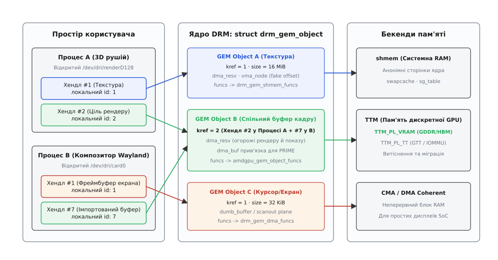
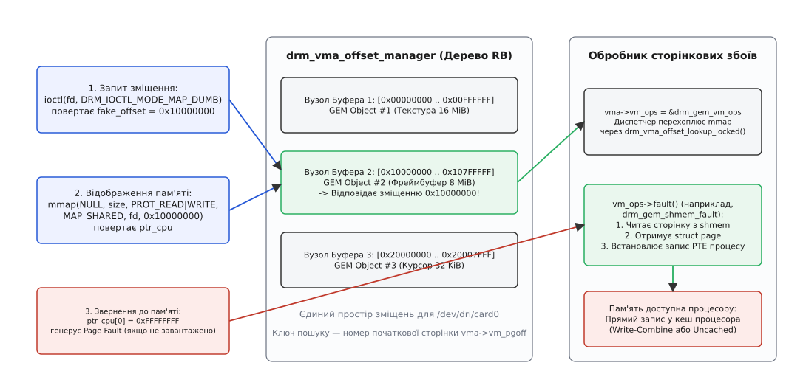
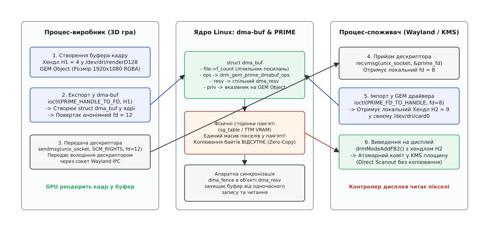
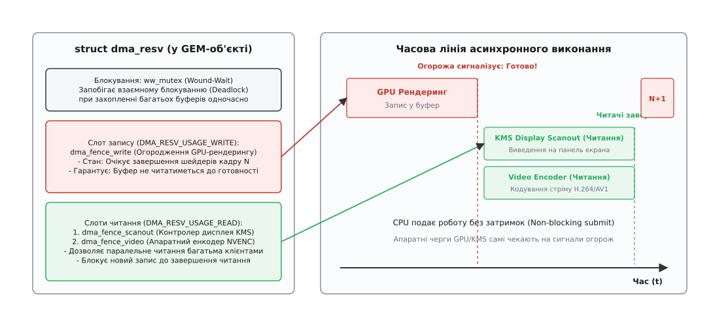

# GEM: об'єкти пам'яті графічного чипа

<preknowlist>
- [DRM і KMS: модель графічного пристрою в ядрі](book:unix-linux/drm-kms) — графічний чип як символьний файл, вузли керування `/dev/dri/cardX` та рендерингу `/dev/dri/renderD128`.
- [Керівний канал до драйвера: ioctl](book:unix-linux/ioctl-interface) — механізм передачі структур керування між простором користувача та ядром.
- [mmap: файл і пам'ять як одне](book:unix-linux/mmap-model) — відображення сторінок пам'яті ядра та пристроїв у віртуальний адресний простір процесу.
- [kobject, kref і час життя об'єктів ядра](book:unix-linux/kobject-kref-lifetime) — лічильники посилань ядра, атомарне відстеження використання та безпечне звільнення структур.
- [dma-buf: спільне використання буферів у ядрі](book:unix-linux/dma-buf) — абстракція експорту та імпорту неперервної фізичної пам'яті через файлові дескриптори.
- [dma-fence і sync_file](book:unix-linux/dma-fence-sync) — примітиви одноразових асинхронних сигналів готовності апаратних операцій.
- [Сторінки, таблиці сторінок і MMU](book:unix-linux/paging-and-mmu) — організація віртуальної пам'яті процесора, трансляція адрес і обробка сторінкових збоїв.
</preknowlist>

Сучасна тривимірна сцена містить сотні мегабайтів геометрії, текстур високої роздільності, карт тіней, проміжних поверхонь рендерингу та фінальних буферів кадру. Усі ці масиви даних повинні оброблятися графічним процесором (GPU) на швидкостях у сотні гігабайтів за секунду, а фінальний результат має своєчасно потрапляти на дисплей із частотою 60, 120 або 240 кадрів за секунду. Здавалося б, для збереження цих даних достатньо виділити звичайну динамічну пам'ять викликом `malloc()`.

Проте процесорна пам'ять не підходить для графічного прискорювача з трьох фундаментальних причин:
1. **Різні адресні простори та MMU**: графічний процесор має власний контролер пам'яті та власні таблиці сторінок, які нічого не знають про віртуальні адреси конкретного процесу Linux.
2. **Типи пам'яті та кеш-домени**: дискретні відеокарти оперують власною високошвидкісною відеопам'яттю (VRAM типу GDDR6 або HBM3), куди центральний процесор не має прямого безперервного доступу. Навіть на інтегрованих чипах кеші процесора й GPU несумісні: запис із боку CPU без явного скидання кеш-ліній призведе до того, що GPU зчитає застарілі дані.
3. **Асинхронний життєвий цикл і спільне використання**: буфер кадру створюється одним процесом (наприклад, грою через Vulkan), передається віконному композитору (Wayland), сканується контролером дисплея (KMS) і паралельно стискається апаратним відеоенкодером. Падіння програми, яка створила буфер, не повинно призводити до збою решти учасників конвеєра або зависання апаратного забезпечення.

Для розв'язання цих проблем у графічній підсистемі Direct Rendering Manager (DRM) ядра Linux було створено підсистему **GEM** (англ. *Graphics Execution Manager* — менеджер графічного виконання). GEM надає уніфіковану модель об'єктів пам'яті, керує їхнім життєвим циклом, організовує безпечне відображення у простір користувача та слугує фундаментом для передавання буферів між процесами.

Історію того, як графічний стек Linux еволюціонував від небезпечного прямого доступу через X-сервер і важковагого TTM до сучасного GEM та PRIME, детально викладено у вставці [Від UMS і TTM до GEM та PRIME: еволюція пам'яті графічного стека Linux](book:unix-linux/gem-buffer-objects/hist-gem-and-ttm-lineage.md).

## Анатомія графічного буфера: struct drm_gem_object

Усі ресурси пам'яті, якими керує підсистема GEM — від 32-кілобайтного курсора миші до гігабайтної текстури у форматі BC7 — на рівні ядра представлені базовою структурою `struct drm_gem_object`. Ця структура визначена в заголовковому файлі `<drm/drm_gem.h>` і слугує спільним предком для всіх драйверо-специфічних буферів пам'яті.

```
+--------------------------------------------------------------------+
| struct drm_gem_object (Ядро Linux DRM)                             |
|--------------------------------------------------------------------|
|  * refcount: struct kref             -> Атомарний лічильник ядра   |
|  * handle_count: unsigned            -> Кількість хендлів у UAPI   |
|  * size: size_t (кратний PAGE_SIZE)  -> Розмір буфера в байтах     |
|  * dev: struct drm_device*           -> Батьківський пристрій DRM  |
|  * filp: struct file*                -> Анонімний файл shmem/tmpfs |
|  * vma_node: drm_vma_offset_node     -> Вузол у дереві fake offset |
|  * resv: struct dma_resv*            -> Огорожі синхронізації      |
|  * funcs: const drm_gem_object_funcs*-> Віртуальні методи драйвера |
+--------------------------------------------------------------------+
                                |
               +----------------+----------------+
               |                                 |
               v                                 v
+-----------------------------+   +-----------------------------+
| Драйвер shmem (Intel/Mali)  |   | Драйвер TTM (AMD/Nvidia/Xe) |
| struct drm_gem_shmem_object |   | struct ttm_buffer_object    |
| - Масив сторінок ОЗП        |   | - Домени: VRAM / GTT / RAM  |
| - sg_table для IOMMU/DMA    |   | - Автоматичне витіснення    |
+-----------------------------+   +-----------------------------+
```

Розглянемо ключові поля структури та їхнє функціональне навантаження:

* `refcount` (тип `struct kref`): атомарний лічильник посилань ядра. Він гарантує, що пам'ять під метадані об'єкта не буде деалокована доти, доки хоча б один компонент ядра (драйвер дисплея, черга команд прискорювача, експортований дескриптор `dma-buf`) утримує покажчик на об'єкт.
* `handle_count`: лічильник реєстрацій об'єкта в просторі користувача. Один і той самий фізичний GEM-об'єкт може бути відкритий декількома процесами або імпортований кілька разів; `handle_count` показує кількість активних користувацьких числових ідентифікаторів.
* `size`: повний розмір виділеної ділянки в байтах. Розмір обов'язково вирівнюється вгору за межею системної сторінки (`PAGE_SIZE`, зазвичай 4096 байтів), оскільки виділення та захист пам'яті здійснюються на рівні сторінок MMU.
* `filp` (тип `struct file *`): покажчик на внутрішній анонімний файл підсистеми `shmem` (tmpfs). Цей файл створюється для буферів, що розміщуються в системній оперативній пам'яті, і дозволяє ядру застосовувати стандартні механізми виділення сторінок на вимогу (англ. *demand paging*) та автоматичного вивантаження у swap за нестачі пам'яті.
* `vma_node` (тип `struct drm_vma_offset_node`): елемент червоно-чорного дерева менеджера адресних зміщень `drm_vma_offset_manager`. Він відповідає за призначення унікального фіктивного зміщення, через яке простір користувача виконує системний виклик `mmap()`.
* `resv` (тип `struct dma_resv *`): покажчик на об'єкт резервації, що містить апаратні огорожі синхронізації (`struct dma_fence`). Завдяки цьому полю ядро знає, які операції читання чи запису виконуються над буфером просто зараз і коли вони завершаться.
* `funcs` (тип `const struct drm_gem_object_funcs *`): таблиця віртуальних функцій драйвера. Через неї викликаються специфічні операції: відображення пам'яті (`mmap`), створення таблиці розсіювання-збирання (`get_sg_table`), фіксація сторінок у пам'яті (`pin`/`unpin`) та деструктор (`free`).

> 🔧 **Навіщо це.** Розділення структури на спільну частину (`drm_gem_object`) та драйверо-специфічну обгортку дозволило прибрати з ядра тисячі рядків дубльованого коду. Усі підсистеми — від віконних серверів до фреймворків мультимедіа — спілкуються з ядром через однаковий базовий контракт, незалежно від того, чи працює система на мобільному ARM-процесорі з єдиною пам'яттю, чи на потужній робочій станції з кількома дискретними відеокартами.

Повний довідник структур, сигнатур функцій ядра та числових констант системних викликів наведено у вставці [Інтерфейс підсистеми GEM: структури ядра, UAPI та ioctl](book:unix-linux/gem-buffer-objects/api-gem-core-and-uapi.md).

## Простір імен і дескриптори: handles у drm_file

Ядро Linux ніколи не повертає прямі покажчики на структури пам'яті у простір користувача. Це порушило б безпеку, ізоляцію процесів і призвело б до аварійного падіння ядра при передачі некоректної адреси. Замість покажчиків GEM використовує систему **числових дескрипторів** (англ. *GEM handles*).

Коли програма відкриває символьний файл графічного пристрою (`/dev/dri/card0` для вузла керування або `/dev/dri/renderD128` для рендерингу), ядро створює унікальний екземпляр структури `struct drm_file`. Ця структура прив'язана до відкритого файлового дескриптора процесу і містить локальну таблицю ідентифікаторів об'єктів — масив `object_idr` (у нових версіях ядра — структуру `xarray`).

```
Процес 1 (відкрив /dev/dri/renderD128 як fd=3):
  struct drm_file A:
    * handle #1 -> покажчик на struct drm_gem_object X (Текстура)
    * handle #2 -> покажчик на struct drm_gem_object Y (Буфер кадру)

Процес 2 (відкрив /dev/dri/card0 як fd=7):
  struct drm_file B:
    * handle #1 -> покажчик на struct drm_gem_object Z (Курсор)
    * handle #5 -> покажчик на той самий struct drm_gem_object Y (Буфер кадру)
```

Хендл GEM — це звичайне 32-бітне беззнакове ціле число (`uint32_t`), яке має значення **виключно в межах конкретного відкритого екземпляра `drm_file`**:

1. **Локальність простору імен**: число `1` у Процесі 1 та число `1` у Процесі 2 посилаються на абсолютно різні графічні об'єкти. Жоден процес не може отримати доступ до чужої відеопам'яті, просто вгадавши числовий ідентифікатор.
2. **Автоматичне захоплення посилань**: створення хендла через функцію ядра `drm_gem_handle_create()` автоматично збільшує `kref` відповідного `struct drm_gem_object` та інкрементує лічильник `handle_count`.
3. **Ізольоване звільнення**: коли процес закриває буфер викликом `DRM_IOCTL_GEM_CLOSE` або повністю завершує роботу, функція `drm_gem_handle_delete()` видаляє запис із таблиці `idr`/`xarray` та зменшує `refcount`. Якщо процес аварійно падає (`SIGSEGV` або `SIGKILL`), VFS ядра автоматично закриває файловий дескриптор пристрою, а деструктор `drm_file` акуратно відпускає всі зареєстровані хендли, унеможливлюючи витоки відеопам'яті.



*Кожен процес оперує власними локальними числами-хендлами, які ядро транслює в спільні об'єкти drm_gem_object із відповідними бекендами пам'яті.*

## Життєвий цикл GEM-об'єктів: виділення, посилання та звільнення

Життєвий цикл будь-якого графічного буфера складається з чітко визначеної послідовності кроків: створення, реєстрація, активне використання, передача володіння та фінальне знищення.

```
Життєвий цикл об'єкта GEM:
+--------------------------------------------------------------------+
| 1. СТВОРЕННЯ:                                                      |
|    ioctl(DRM_IOCTL_*_CREATE) -> kzalloc(struct *_bo)               |
|    drm_gem_object_init() -> kref = 1                               |
|    drm_gem_handle_create() -> kref = 2, handle = 1                 |
+---------------------------------+----------------------------------+
                                  |
                                  v
+--------------------------------------------------------------------+
| 2. ВИКОРИСТАННЯ ТА ВІДОБРАЖЕННЯ:                                  |
|    drm_gem_create_mmap_offset() -> виділення fake offset           |
|    mmap() -> обробник fault() -> виділення сторінок пам'яті        |
|    Подача команд на GPU -> додавання dma_fence у dma_resv          |
+---------------------------------+----------------------------------+
                                  |
                                  v
+--------------------------------------------------------------------+
| 3. ЕКСПОРТ (опціонально):                                          |
|    ioctl(PRIME_HANDLE_TO_FD) -> створення struct dma_buf           |
|    kref збільшується, буфер стає спільним                          |
+---------------------------------+----------------------------------+
                                  |
                                  v
+--------------------------------------------------------------------+
| 4. ЗАКРИТТЯ ТА ЗНИЩЕННЯ:                                           |
|    ioctl(DRM_IOCTL_GEM_CLOSE) -> видалення хендла з idr, kref = 1  |
|    Завершення всіх операцій GPU -> спрацювання огорож dma_fence    |
|    drm_gem_object_put() -> kref = 0 -> виклик funcs->free()        |
|    Звільнення сторінок пам'яті, vma_node та пам'яті структури      |
+------------------------------------+-------------------------------+
```

### Створення буфера

Створення буфера ініціюється простором користувача через системний виклик `ioctl`. Залежно від призначення буфера використовуються два типи системних викликів:

1. **Уніфіковані лінійні буфери (Dumb Buffers)**:
   Системний виклик `DRM_IOCTL_MODE_CREATE_DUMB` підтримується всіма драйверами, які реалізують інтерфейс налаштування відеорежимів ядра (KMS). Він призначений для простих нестиснених поверхонь сканування екрана, курсорів та тестового виводу. Програма передає ширину, висоту та глибину кольору (`bpp`), а ядро повертає вирівняний крок рядка (`pitch`), повний розмір у байтах і числовий `handle`.
2. **Спеціалізовані буфери прискорювачів**:
   Для тривимірної графіки, де потрібні складні структури (двовимірні масиви текстур, тайлінг, z-буфери з апаратним очищенням, пам'ять підвищеної швидкодії), кожен виробник реалізує власні системні виклики. Наприклад, драйвер Intel використовує `DRM_IOCTL_I915_GEM_CREATE`, драйвер AMD — `DRM_IOCTL_AMDGPU_GEM_CREATE`, а мобільний драйвер ARM Mali — `DRM_IOCTL_PANFROST_CREATE_BO`. У цих викликах передаються прапорці розміщення (домени пам'яті VRAM або GTT), шаблони кешування та рівні когерентності.

### Керування посиланнями (kref)

Усередині ядра об'єкт підпорядковується стандартному механізму `kref` (від лат. *refero* — відносити, посилатися). Правила підрахунку посилань є суворими:

* Під час виклику `drm_gem_object_init()` ядро встановлює `kref = 1`.
* Під час реєстрації першого дескриптора через `drm_gem_handle_create()` викликається `drm_gem_object_get()`, збільшуючи `kref` до `2`. Один лічильник утримується таблицею хендлів процесу, другий — кодом, що створив об'єкт. Коли код завершує ініціалізацію, він відпускає свій тимчасовий покажчик через `drm_gem_object_put()`, залишаючи `kref = 1`.
* Будь-яка асинхронна операція (наприклад, завдання рендерингу, передане в чергу планувальника `drm_gpu_scheduler`) бере власне посилання `drm_gem_object_get()`. Завдяки цьому, навіть якщо програма негайно закриє хендл, буфер фізично житиме в пам'яті доти, доки графічний процесор не завершить його опрацювання.
* Коли останній власник викликає `drm_gem_object_put()` і лічильник падає до нуля, автоматично спрацьовує віртуальний метод `funcs->free(obj)`. Драйвер звільняє апаратні таблиці сторінок GPU, повертає фізичні сторінки в пул операційної системи та звільняє виділену пам'ять структури.

## Відображення пам'яті у простір користувача: механізм fake offset

Однією з найскладніших інженерних задач при створенні GEM було проектування механізму відображення буферів у віртуальний адресний простір процесу через системний виклик `mmap()`.

### Головоломка mmap та її причини

Системний виклик POSIX `mmap()` приймає відкритий файловий дескриптор `fd` та числове зміщення `offset` у файлі. Для звичайного дискового файлу зміщення `0` означає початок файлу, а зміщення `4096` — другу сторінку.

Проте у графічній підсистемі весь процес спілкується з ядром через **один-єдиний файловий дескриптор** відкритого пристрою (наприклад, `/dev/dri/card0`). При цьому процес створює сотні незалежних буферів текстур, геометрії та кадру. Якщо б кожен буфер відображався зі зміщенням `offset = 0`, ядро не мало б жодного способу дізнатися, яку саме текстуру чи поверхню процес намагається спроєктувати у свою пам'ять.

Передавати фізичну адресу пам'яті як `offset` категорично заборонено: на 32-бітних системах або за наявності 16 ГБ відеопам'яті фізична адреса просто не вміщується в тип `off_t`, а пряме розкриття фізичних адрес процесу порушує безпеку та захист пам'яті (KASLR).

### Менеджер адресних зміщень (drm_vma_offset_manager)

Для вирішення цієї проблеми DRM реалізує концепцію **фальшивих зміщень** (англ. *DRM fake offset*).

Для кожного графічного пристрою ядро ініціалізує екземпляр менеджера `drm_vma_offset_manager`. Цей менеджер веде власний віртуальний 44-бітний адресний простір сторінок (з місткістю до 16 терабайтів), організований у вигляді червоно-чорного дерева інтервалів (rbtree):

1. Коли буфер готується до відображення, драйвер викликає `drm_gem_create_mmap_offset(obj)`.
2. Менеджер шукає в дереві вільний діапазон сторінок, достатній для розміщення об'єкта розміром `obj->size`, і закріплює його за вузлом `obj->vma_node`.
3. Початковий номер сторінки діапазону зсувається на константу `PAGE_SHIFT` і повертається процесу через спеціалізований ioctl (наприклад, `DRM_IOCTL_MODE_MAP_DUMB`) як 64-бітне число `fake_offset`.

```
Діапазони drm_vma_offset_manager (Єдиний простір для /dev/dri/card0):
[0x00000000 .. 0x00FFFFFF] -> Вузол VMA: GEM Об'єкт #1 (Текстура 16 МБ)
[0x10000000 .. 0x107FFFFF] -> Вузол VMA: GEM Об'єкт #2 (Буфер кадру 8 МБ)
[0x20000000 .. 0x20007FFF] -> Вузол VMA: GEM Об'єкт #3 (Курсор 32 КБ)
```

Коли процес викликає `mmap()` із переданим числом `fake_offset`, ядро VFS передає запит у драйверний диспетчер `drm_gem_mmap()`:
1. Диспетчер витягує передане зміщення сторінки `vma->vm_pgoff`.
2. Виконує швидкий пошук у червоно-чорному дереві `drm_vma_offset_lookup_locked()` і миттєво знаходить точний покажчик на цільовий `struct drm_gem_object`.
3. Прив'язує до створеної віртуальної області пам'яті (`vm_area_struct`) таблицю методів обробки сторінок `drm_gem_vm_ops`.



*Фальшиве зміщення слугує унікальним ключем пошуку в дереві ядра, дозволяючи проектувати сотні буферів через один дескриптор.*

### Сторінкові збої (Page Faults) та кешування Write-Combining

Виклик `mmap()` не виділяє фізичні сторінки пам'яті миттєво. Відображення є «лінивим» (англ. *lazy allocation*).

Коли процесор уперше намагається прочитати або записати байт за отриманою віртуальною адресою, апаратний блок MMU фіксує відсутність відповідного запису в таблиці сторінок процесу і генерує виключення — **сторінковий збій** (англ. *page fault*).

Ядро перехоплює збій і викликає драйверний метод `vm_ops->fault()` (наприклад, `drm_gem_shmem_fault()`):
1. Драйвер звертається до сховища об'єкта, отримує фізичну структуру `struct page` і визначає її фізичну адресу.
2. Встановлює атрибути кешування сторінки. Для графічних буферів майже завжди встановлюється режим **Write-Combining** (прапорець `pgprot_writecombine`): запис даних процесором накопичується в спеціальних буферах об'єднання і скидається у відеопам'ять широкими пачками по 64 байти, оминаючи повільні затримки кеш-промахів.
3. Функція ядра `vmf_insert_pfn()` записує фізичний номер сторінки в таблицю сторінок (PTE) процесу.
4. Процесор повторює інструкцію запису, яка цього разу виконується без жодних затримок на повній швидкості шини.

Повний працюючий приклад виділення dumb-буфера, отримання фальшивого зміщення, відображення через `mmap` та малювання пікселів на C та C++ доступний у вставці [Практичне виділення, відображення та експорт GEM dumb-буфера через PRIME](book:unix-linux/gem-buffer-objects/proj-gem-dumb-alloc-and-mmap.md).

## Бекенди пам'яті: shmem-backed проти TTM

Спосіб, у який GEM-об'єкт фізично виділяє та розміщує сторінки пам'яті, залежить від архітектури графічного процесора. У ядрі Linux сформувалися дві головні парадигми: **shmem-backed GEM** та **TTM**.

```
+-------------------------------------------------------------------------+
| Порівняння бекендів пам'яті: shmem проти TTM                            |
+------------------------------------+------------------------------------+
| shmem-backed GEM                   | TTM (Translation Table Manager)    |
+------------------------------------+------------------------------------+
| Ціль: Інтегровані GPU (UMA)        | Ціль: Дискретні GPU з VRAM         |
| Intel HD/Iris, ARM Mali, Adreno    | AMD Radeon, NVIDIA Nouveau, Intel  |
|                                    |                                    |
| Єдиний пул пам'яті: системне ОЗП   | Багаторівневі домени пам'яті:      |
| Анонімні сторінки ядра (tmpfs)     | - TTM_PL_VRAM (GDDR/HBM пам'ять)   |
| Сторінки виділяються динамічно     | - TTM_PL_TT (GTT / пам'ять шини)   |
|                                    | - TTM_PL_SYSTEM (системне ОЗП)     |
| Проста модель, низький оверхед     |                                    |
| DMA через scatter-gather таблиці   | Складна логіка витіснення          |
| Не підтримує міграцію між VRAM/RAM | Автоматичне копіювання при нестачі |
+------------------------------------+------------------------------------+
```

### 1. shmem-backed GEM (drm_gem_shmem_object)

В інтегрованих графічних адаптерах (Intel Graphics, мобільні SoC Qualcomm Snapdragon, Samsung Exynos, Broadcom VideoCore у Raspberry Pi) центральний процесор та графічний прискорювач ділять спільну фізичну оперативну пам'ять (англ. *Unified Memory Architecture*, UMA).

Для таких систем ядро надає стандартний помічник `struct drm_gem_shmem_object`. Фізичні сторінки пам'яті виділяються зі стандартного пулу сторінкового кешу ядра через анонімний файл `filp` (`shmem_read_mapping_page()`).

Оскільки виділені сторінки системної пам'яті можуть бути фрагментованими (розсіяними по всьому фізичному простору RAM), драйвер створює таблицю розсіювання-збирання `struct sg_table`. Ця таблиця передається блоку IOMMU графічного чипа, який перетворює ланцюжок розрізнених фізичних сторінок на єдиний безперервний віртуальний адресний діапазон для блоків обробки шейдерів і вибірки текстур.

### 2. TTM (Translation Table Manager)

Дискретні відеокарти мають власну фізичну пам'ять надвисокої пропускної здатності (VRAM), розташовану на платі адаптера поруч із кристалом GPU. Ця пам'ять підключена до чипа через шину завширшки 128–384 біти й забезпечує швидкість обміну до 1–2 ТБ/с.

Проте обсяг VRAM обмежений (наприклад, 8, 16 або 24 ГБ). Коли запущені тривимірні ігри та моделі машинного навчання заповнюють усю локальну відеопам'ять, новий запит виділення буфера не може бути відхилений аварійним збоєм `ENOMEM`.

Саме тут у роботу вступає TTM:
* **Керування доменами**: TTM розподіляє буфери за доменами `TTM_PL_VRAM`, `TTM_PL_TT` (системна пам'ять, підготовлена для доступу через PCI Express) та `TTM_PL_SYSTEM` (звичайне ОЗП).
* **Витіснення (Eviction)**: коли вільне місце у VRAM вичерпується, менеджер витіснення TTM знаходить найменш використовувані буфери (алгоритм LRU), ініціює апаратне копіювання їхніх даних через контролер DMA GPU в системне ОЗП, оновлює внутрішні таблиці трансляцій чипа і звільняє блок VRAM під новий пріоритетний ресурс.
* **Міграція на льоту**: коли витіснений буфер знову стає потрібним для рендерингу кадру, TTM автоматично копіює його назад у локальну пам'ять пристрою, призупиняючи виконання залежних команд до завершення DMA-передачі за допомогою механізму апаратних огорож `dma_fence`.

## Спільне використання буферів: dma-buf та PRIME

У сучасній графічній системі буфери постійно мігрують між різними процесами та різними апаратними блоками:
* 3D-гра рендерить кадр у буфер у просторі користувача.
* Віконний композитор (Mutter у GNOME, KWin у KDE, Sway) імпортує цей буфер і накладає поверх нього панелі інтерфейсу та курсор миші.
* Драйвер KMS захоплює фінальний буфер і передає його на контролер дисплея для виведення через порт DisplayPort/HDMI.
* У системах із гібридною графікою (ноутбуки з чипами Intel/AMD та дискретною карткою NVIDIA) кадр рендериться потужним дискретним чипом, а виводиться на вбудовану матрицю екрана енергоефективним інтегрованим чипом.

Копіювання гігабайтів піксельних даних між процесами через системні виклики `read()`/`write()` або сокети створило б колосальне навантаження на процесор і зробило б роботу системи повільною. Розв'язанням є нульове копіювання (англ. *Zero-Copy*) за допомогою підсистеми **dma-buf** та розширення DRM **PRIME**.

```
Спільне використання через PRIME (Zero-Copy):
+--------------------------------------------------------------------+
| Процес A (Виробник / Гра):                                         |
|   1. Створює GEM-буфер (хендл H1)                                  |
|   2. ioctl(DRM_IOCTL_PRIME_HANDLE_TO_FD, H1) -> отримує prime_fd   |
|   3. sendmsg(unix_socket, SCM_RIGHTS, prime_fd)                    |
+---------------------------------+----------------------------------+
                                  | (Передача файлового дескриптора)
                                  v
+--------------------------------------------------------------------+
| Процес B (Споживач / Wayland Композитор):                          |
|   4. recvmsg(unix_socket, &prime_fd)                               |
|   5. ioctl(DRM_IOCTL_PRIME_FD_TO_HANDLE, prime_fd) -> хендл H2     |
|   6. drmModeAddFB2(drm_fd, ..., H2, &fb_id)                        |
|   7. Атомарний коміт у KMS: пряме сканування заліза без копіювання |
+--------------------------------------------------------------------+
```

### Механізм експорту та імпорту

Процес обміну буфером відбувається за наступним протоколом:

1. **Експорт у дескриптор (`HANDLE_TO_FD`)**:
   Процес-виробник викликає системний виклик `DRM_IOCTL_PRIME_HANDLE_TO_FD`, передаючи свій локальний GEM-хендл. Ядро викликає `drm_gem_prime_export()`, створює об'єкт `struct dma_buf` в анонімній файловій системі `anon_inodefs` і повертає процесу новий файловий дескриптор `prime_fd`.
2. **Передача через IPC**:
   Процес надсилає дескриптор `prime_fd` іншому процесу через локальний UNIX-сокет за допомогою системного виклику `sendmsg()` із допоміжними керуючими даними `SCM_RIGHTS`. Ядро Linux дублює запис у таблиці відкритих файлів цільового процесу.
3. **Імпорт у GEM (`FD_TO_HANDLE`)**:
   Отримувач приймає дескриптор викликом `recvmsg()` і виконує системний виклик `DRM_IOCTL_PRIME_FD_TO_HANDLE` над власним відкритим пристроєм `/dev/dri/card0`. Ядро знаходить об'єкт `struct dma_buf`, перевіряє права доступу та реєструє новий локальний GEM-хендл у контексті отримувача.

Якщо обидва процеси працюють на одному графічному чипі, імпортований хендл посилається на той самий вихідний об'єкт `struct drm_gem_object`. Якщо ж імпорт відбувається на іншому пристрої (наприклад, із дискретної GPU на інтегрований контролер дисплея), ядро створює буфер-обгортку, прив'язує його до сторінок вихідного пристрою через `dma_buf_attach()` / `dma_buf_map_attachment()` та налаштовує канали прямого доступу до пам'яті (DMA) через шину PCIe.

### Когерентність кешу та синхронізація через DMA_BUF_IOCTL_SYNC

Коли буфер пам'яті використовується одночасно центральним процесором і пристроями прямого доступу до пам'яті (DMA), виникає проблема узгодженості кешів. Якщо процесор записує дані в кешовану область пам'яті, змінені байти залишаються в L1/L2 кешах процесора й ще не потрапили у фізичну пам'ять. Якщо в цей момент контролер дисплея або відеокарта спробує прочитати пам'ять безпосередньо через шину DMA, вона отримає застаріле сміття.

Для вирішення цієї проблеми у підсистемі dma-buf передбачено системний виклик `DMA_BUF_IOCTL_SYNC` зі структурою `struct dma_buf_sync`:
* Перед початком запису або читання процесором програма викликає ioctl з прапорцем `DMA_BUF_SYNC_START`. Драйвер ядра виконує інвалідність (англ. *invalidation*) кеш-ліній процесора або тимчасово очікує завершення активних апаратних DMA-операцій.
* Після завершення роботи з пам'яттю програма викликає ioctl із прапорцем `DMA_BUF_SYNC_END`. Ядро виконує примусове скидання (англ. *flush / clean*) брудних рядків кешу CPU у фізичну оперативну пам'ять, гарантуючи, що апаратний контролер побачить оновлені пікселі.



*Експорт GEM-хендла в анонімний дескриптор dma-buf дозволяє передавати володіння буфером через UNIX-сокети без копіювання пікселів у пам'яті.*

## Синхронізація доступу: dma_resv, dma_fence та syncobj

Графічний процесор працює повністю асинхронно відносно центрального процесора. Коли програма викликає функцію подачі команд малювання, виклик повертається практично миттєво (за кілька мікросекунд), поставивши завдання в чергу. Сама апаратна обробка тисяч трикутників і пікселів розпочнеться лише через мілісекунди, коли командний процесор GPU дійде до відповідного пакета.

Якщо віконний композитор або контролер дисплея спробує прочитати буфер у той момент, коли GPU ще записує в нього пікселі, на екрані виникнуть візуальні дефекти: розриви зображення (англ. *screen tearing*), мерехтіння або частково відрендерені полігони.

Для координації доступу без зупинки процесора GEM використовує вбудований у кожен буфер **об'єкт резервації** — `struct dma_resv`.

```
+-------------------------------------------------------------------+
| struct dma_resv (Об'єкт резервації всередині GEM-буфера)          |
|-------------------------------------------------------------------|
| * Блокування: ww_mutex (Wound-Wait м'ютекс проти Deadlock)        |
|                                                                   |
| * Слот DMA_RESV_USAGE_WRITE (Ексклюзивний запис):                 |
|   -> dma_fence A: завдання шейдерів 3D-рендерингу                 |
|                                                                   |
| * Слоти DMA_RESV_USAGE_READ (Паралельне читання):                 |
|   -> dma_fence B: апаратне сканування контролера KMS              |
|   -> dma_fence C: читання апаратним відеоенкодером                |
+-------------------------------------------------------------------+
```

### Блокування без тупиків (Wound-Wait Mutex)

Коли гра формує кадр, їй потрібно одночасно заблокувати доступ до десятків ресурсів: буфера кадру, z-буфера, п'яти текстур та вершинних буферів. Якщо два паралельні процеси спробують заблокувати однакові ресурси у різному порядку (Процес 1: Буфер А, потім Б; Процес 2: Буфер Б, потім А), виникне класичний стан мертвого блокування — взаємний тупик (англ. *deadlock*).

Щоб запобігти цьому, об'єкт `dma_resv` використовує спеціальні м'ютекси очікування-поранення — **`ww_mutex`** (англ. *Wound-Wait mutex*):
1. Перед початком транзакції потік створює контекст захоплення `struct ww_acquire_ctx`, отримуючи унікальну мітку часу (пріоритет).
2. Якщо потік намагається захопити буфер, уже заблокований іншим потоком, алгоритм порівнює їхні мітки часу:
   * Якщо новий потік «старший» (має вищий пріоритет), він «ранить» (wound) молодший потік, змушуючи його відпустити всі вже захоплені буфери з кодом помилки `EDEADLK` і спробувати заново.
   * Якщо новий потік «молодший», він чемно чекає звільнення ресурсу.
3. Це математично гарантує неможливість виникнення кругових блокувань, скільки б буферів не брало участь у транзакції одночасно.

### Неявна та явна синхронізація

Історично в Linux DRM використовувалася **неявна синхронізація** (англ. *implicit synchronization*):
* Під час подачі команд на малювання драйвер автоматично додавав апаратну огорожу `dma_fence` у слот запису `dma_resv`.
* Коли композитор передавав цей буфер на виведення в KMS, ядро автоматично перевіряло слот запису `dma_resv` і самостійно затримувало зміну адреси сканування дисплея доти, доки огорожа рендерингу не перейде в сигнальний стан.
* Простір користувача не брав участі в узгодженні залежностей — ядро брало всю роботу на себе.

Проте неявна синхронізація має серйозні обмеження у сучасних багатопотокових API (Vulkan, Direct3D 12), де залежності між обчислювальними та графічними чергами надзвичайно складні, а неявні блокування ядра створюють непередбачувані затримки.

Тому сучасні системи перейшли на **явну синхронізацію** (англ. *explicit synchronization*):
* Синхронізація виноситься в окремі об'єкти — **`drm_syncobj`**.
* Об'єкт `drm_syncobj` містить часову шкалу монотонно зростаючих точок (англ. *timeline points*). Програма в просторі користувача самостійно вказує: «GPU-черга 1 чекає точки 42 у syncobj A, а після виконання сигналізує точку 43 у syncobj B».
* У протоколі Wayland розширення `linux-explicit-synchronization-v1` дозволяє передавати буфер разом із дескриптором `syncobj`. Композитор негайно приймає буфер і планує показ кадру, а контролер дисплея чекає сигналу безпосередньо на рівні апаратного планувальника, не блокуючи ядро та інші клієнтські процеси.



*Об'єкт dma_resv керує огорожами dma_fence, гарантуючи, що читання дисплеєм почнеться лише після завершення рендерингу, а наступний запис зачекає завершення читачів.*

## Діагностика та інструменти налагодження

У процесі налагодження графічного стека розробник може перевірити стан виділених GEM-буферів за допомогою системних файлів у віртуальній файловій системі `debugfs` (зазвичай змонтованій у `/sys/kernel/debug/dri/0/`):

1. **Список клієнтських процесів (`clients`)**:
   Файл `/sys/kernel/debug/dri/0/clients` виводить таблицю відкритих файлових дескрипторів DRM із зазначенням ідентифікатора процесу (PID), кількості виділених числових хендлів та сумарного обсягу утримуваної пам'яті.
2. **Розподіл доменів пам'яті**:
   Для драйверів AMD та Intel файли `/sys/kernel/debug/dri/0/amdgpu_gem_info` та `/sys/kernel/debug/dri/0/i915_gem_objects` показують точний розподіл кожного буфера за доменами: скільки мегабайтів розташовано у VRAM, скільки в GTT і скільки вивантажено в системний swap.
3. **Системні точки трасування (Tracepoints)**:
   Ядро підтримує трасування життєвого циклу через `ftrace` та `perf`:
   * `drm:drm_gem_open` — фіксує створення нового числового хендла процесом;
   * `drm:drm_gem_put` — сигналізує про зменшення лічильника посилань об'єкта;
   * `dma_fence:dma_fence_emit` та `dma_fence:dma_fence_signaled` — відображають моменти встановлення та спрацювання апаратних огорож синхронізації, дозволяючи виявити пляшкові шийки у конвеєрі відображення.

## Підсумок архітектури

Підсистема GEM перетворила керування відеопам'яттю в Linux із хаотичного прямого мапування фізичних регістрів на сувору, надійну та високопродуктивну об'єктну систему.

Об'єднуючи безпечні локальні дескриптори `handle`, уніфіковане відображення віртуальної пам'яті через `drm_vma_offset_manager`, гнучкі бекенди зберігання (`shmem` та TTM), міжпідсистемний обмін нульового копіювання через `dma-buf` / PRIME та неблокуючу синхронізацію через `dma_resv` і `drm_syncobj`, GEM забезпечує стабільну роботу графічного конвеєра від мобільних пристроїв до найпотужніших графічних станцій.
