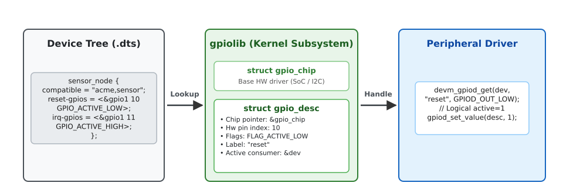
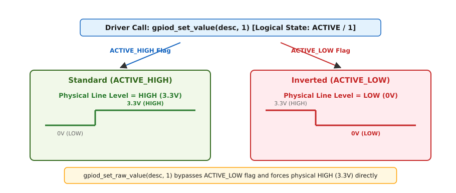
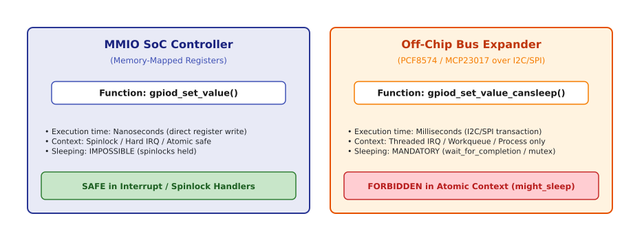

# Ядерний дескрипторний API gpiod (gpiod_get, gpiod_set_value)

<preknowlist>
- [Сучасний дворівневий API GPIO descriptors (gpiod)](topic:unix-linux/gpio-gpiod-descriptor-api) — двоступенева концепція дескрипторів ядра та користувацького ABI v2.
- [Драйвери пристроїв та модель збірки probe](topic:unix-linux/driver-probe-and-binding) — життєвий цикл драйверів у ядрі, функції `probe()` та `remove()`.
- [Дерево пристроїв Device Tree](topic:unix-linux/device-tree) — синтаксис вузлів та властивостей `*-gpios` для зв'язування апаратури.
- [Керування ресурсами devres](topic:unix-linux/devres-managed-resources) — автоматичне вивільнення ресурсів ядра за принципом RAII через `devm_*`.
</preknowlist>

При розробці драйверів периферійних пристроїв у ядрі Linux спроба встановити електричний рівень на фізичному виводі мікроконтролера через застарілі цілочисельні номери GPIO призводить до системних гонок і помилок при зміні ревізії плати. Оскільки номери ліній визначалися порядком ініціалізації контролерів під час завантаження, лінія `42` в одній збірці ядра відповідала виводу скидання датчика, а в іншій — виводу керування живленням. Перехід ядра Linux у версії 3.13 на дескрипторний API **gpiod** (GPIO Descriptors) заклав нову архітектурну абстракцію: замість виклику `gpio_set_value(42, 1)` драйвер отримує непрозорий вказівник `struct gpio_desc *` і працює з логічним станом лінії, залишаючи специфіку топології платформи підсистемі `gpiolib`.

Цей інтерфейс, визначений у заголовковому файлі `<linux/gpio/consumer.h>`, є основою внутрішнього керування лініями загального призначення у просторі ядра (Kernel Space). Він забезпечує абсолютну ізоляцію драйверів від апаратного забезпечення, автоматично обробляє інверсію полярності (Active Low), інтегрується з механізмом вивільнення ресурсів Devres та надає суворі гарантії щодо безпеки контекстів виконання.

---

## 1. Загальна архітектура `gpiolib` та концепція `struct gpio_desc`

У центрі дескрипторної архітектури лежить відмова від уявлення про GPIO як про просту маску бітів у регістрі процесора. Підсистема `gpiolib` розглядає кожну лінію як самостійний системний об'єкт, керований непрозорою структурою `struct gpio_desc`.

### 1.1. Ізоляція драйвера від топології плати

У старому підході драйвер периферійного пристрою мусив самостійно запитувати номери ліній, перевіряти їхню доступність та враховувати інверсію сигналу на рівні прикладного коду. У сучасній архітектурі `gpiod` обов'язки чітко розділені на три шари:

1. **Апаратний шар (Hardware Description):** Опис фізичних підключень та електричних властивостей (полярність, підтяжка) зберігається у Дереві пристроїв (Device Tree), специфікації ACPI або спеціальних таблицях відповідності (`lookup tables`).
2. **Шар підсистеми (`gpiolib`):** Ядро зв'язує фізичний пін апаратного контролера `struct gpio_chip` із непрозорим дескриптором `struct gpio_desc`, відстежує володіння лінією та забезпечує трансляцію викликів.
3. **Шар споживача (Consumer Driver):** Драйвер периферійного пристрою звертається до ядра за функціональним ім'ям лінії (наприклад, `"reset"` або `"enable"`) і оперує виключно логічними станами "активний/неактивний".

> 📜 Детальний аналіз причин відмови від старого цілочисельного API та хронологію великого рефакторингу ядра Linux винесено в окрему вставку [Історія відходу від integer-based API до gpiod у ядрі Linux](topic:unix-linux/gpio-descriptor-based-gpiod-api/hist-legacy-gpio-to-gpiod.md).

### 1.2. Внутрішня будова та поля `struct gpio_desc`

Вказівник `struct gpio_desc *` є повністю непрозорим (opaque Pointer) для драйверів споживачів. Його визначення знаходиться виключно всередині `drivers/gpio/gpiolib.h`. Внутрішній стан дескриптора включає наступні ключові елементи:

- **`gdev` (struct gpio_device *):** Посилання на батьківський пристрій GPIO-контролера, який надає апаратні методи читання та запису регістрів.
- **`hwnum` (u16):** Локальний індекс лінії в межах конкретного контролера (наприклад, пін `10` у контролері `gpiochip1`).
- **`flags` (unsigned long):** Бітова маска внутрішніх прапорів стану підсистеми:
  - `FLAG_REQUESTED`: Лінію захоплено конкретним драйвером.
  - `FLAG_IS_OUT`: Лінію налаштовано в режим виходу (Output).
  - `FLAG_ACTIVE_LOW`: Прапор інверсії сигналу. Активний логічний стан відповідає фізичному нулю (0V).
  - `FLAG_OPEN_DRAIN` / `FLAG_OPEN_SOURCE`: Режими виходу з відкритим стоком або витоком.
  - `FLAG_BIAS_PULL_UP` / `FLAG_BIAS_PULL_DOWN`: Внутрішнє резистивне підтягування.
- **`label` (const char *):** Текстова мітка драйвера-споживача, яка відображається у засобах діагностики DebugFS.

### 1.3. Взаємодія підсистеми `gpiolib` з мультиплексуванням `pinctrl`

Для успішного функціонування лінії GPIO недостатньо лише встановити напрямок у регістрах GPIO-контролера. На багатьох сучасних процесорах (SoC) один і той самий фізичний контакт процесора може виконувати декілька альтернативних функцій (наприклад, працювати як лінія UART, шина SPI або звичайний GPIO). За розподіл режимів контактів відповідає підсистема мультиплексування пінів `pinctrl` (Pin Control Subsystem).

Коли драйвер пристрою викликає `gpiod_get()`, підсистема `gpiolib` викликає метод контролера `chip->request()`. У драйверів, інтегрованих з `pinctrl` (типово це готовий метод `gpiochip_generic_request()`), цей виклик зводиться до `pinctrl_gpio_request()`, і тоді підсистема `pinctrl`:
1. Перевіряє, чи не зайнятий даний контакт іншою апаратною периферією.
2. Перемикає фізичний мультиплексор процесора (Pin Muxing) у режим цифрового вводу-виводу GPIO.
3. Застосовує до контакта електричні налаштування (`pinconf`) — підтяжку, силу драйвера, швидкість фронту, — якщо їх задано в описі відповідного стану `pinctrl` для цього пристрою.

Завдяки цьому драйвер периферійного пристрою повністю звільняється від необхідності маніпулювати регістрами `pinctrl` напряму.


*Архітектура ядерного дескрипторного API gpiod: зв'язок Device Tree, підсистеми gpiolib та драйвера пристрою.*

---

## 2. Життєвий цикл дескрипторів: Отримання, Devres та відкладена ініціалізація

Для використання лінії GPIO драйвер мусить запитати її дескриптор у ядра під час виконання функції ініціалізації пристрою (`probe`).

### 2.1. Механізм пошуку ліній (Connection ID Mapping)

Основна функція отримання дескриптора має сигнатуру:

```c
struct gpio_desc *gpiod_get(struct device *dev, const char *con_id, enum gpiod_flags flags);
```

Параметр `con_id` (Connection ID) визначає функціональну роль лінії у контексті даного пристрою. Ядро використовує `con_id` для автоматичного побудування імен властивостей у файлах опису апаратури:

- **Device Tree:** Якщо `con_id = "reset"`, підсистема `gpiolib` шукає у вузлі пристрою властивість `reset-gpios = <...>` або застарілий варіант `reset-gpio = <...>`. Якщо `con_id = NULL`, шукається анонімна властивість `gpios = <...>`.
- **ACPI:** Ядро шукає ресурс `GpioIo` всередині методу `_CRS` (Current Resource Settings), де назва збігається з `con_id`.
- **Platform Lookup Tables:** На застарілих платформах без DT ядро шукає відповідність у глобальному списку `struct gpiod_lookup_table`.

### 2.2. Покрокове простеження шляху виклику в ядрі

Коли драйвер викликає `devm_gpiod_get(dev, "reset", GPIOD_OUT_LOW)`, ядро виконує наступну послідовність внутрішніх операцій (розбір Дерева пристроїв — у `drivers/gpio/gpiolib-of.c`, захоплення й налаштування лінії — у `drivers/gpio/gpiolib.c`):

1. **Парсинг вузла:** Ядро бере вказівник на вузол Дерева пристроїв `dev->of_node`.
2. **Формування назви:** До суфікса `"reset"` додаються варіанти `-gpios` та `-gpio`, формуючи пошуковий рядок `"reset-gpios"`.
3. **Витягування phandle:** З опису вузла зчитується посилання на контролер (наприклад, `&gpio1`) та парсяться клітинки аргументів (`cells`): індекс лінії (наприклад, `10`) та прапори (наприклад, `GPIO_ACTIVE_LOW`).
4. **Пошук gpio_chip:** Зі списку зареєстрованих у ядрі контролерів знаходиться відповідний екземпляр `struct gpio_chip`.
5. **Ініціалізація дескриптора:** Ядро бере дескриптор `gdev->descs[10]` із таблиці ліній цього контролера, встановлює у ньому прапори `FLAG_REQUESTED` та `FLAG_ACTIVE_LOW`, записує мітку споживача та конфігурує напрямок лінії на вихід із логічним нулем.
6. **Реєстрація у Devres:** У список ресурсів пристрою додається вузол вивільнення пам'яті `devm_gpiod_release`.

### 2.3. Автоматичне керування ресурсами через Devres (`devm_gpiod_get`)

У сучасному ядрі виклики прямого отримання `gpiod_get()` та вивільнення `gpiod_put()` практично не використовуються. Натомість застосовується сімейство функцій з префіксом `devm_` (Device Managed Resources), яке інтегровано з підсистемою Devres:

```c
struct gpio_desc *reset_pin;

reset_pin = devm_gpiod_get(dev, "reset", GPIOD_OUT_LOW);
if (IS_ERR(reset_pin)) {
    return PTR_ERR(reset_pin);
}
```

Викликом `devm_gpiod_get()` дескриптор прив'язується до пристрою `dev`. Коли драйвер відключається від пристрою (при виклику `remove()` або у разі помилки в `probe()`), ядро автоматично викликає `gpiod_put()`, повертаючи лінію в початковий стан і звільняючи пам'ять. Це усуває ризик витоку ресурсів та спрощує обробку помилок.

> 📋 Повний перелік сигнатур функцій, прапорів ініціалізації `enum gpiod_flags` та специфікацію обробки масивів зібрано у вставці [API-довідник сигнатур та прапорів gpiod](topic:unix-linux/gpio-descriptor-based-gpiod-api/api-kernel-gpiod-functions.md).

### 2.4. Обробка помилок та статус `-EPROBE_DEFER`

Функції `gpiod_get*` у разі виникнення проблем не повертають `NULL`. Вони повертають закодований у вказівник код помилки, який перевіряється макросом `IS_ERR()`.

Серед стандартних кодів помилок критично важливими є три:

1. **`-ENOENT` (No Such File or Directory):** Властивість з вказаним `con_id` відсутня у Device Tree. Для обов'язкових ліній це вважається помилкою конфігурації. Для опціональних ліній слід використовувати функцію `devm_gpiod_get_optional()`, яка при відсутності властивості повертає `NULL` замість помилки.
2. **`-EBUSY` (Device or Resource Busy):** Лінію вже захоплено іншим драйвером ядра.
3. **`-EPROBE_DEFER` (Driver Probe Deferral):** Помилка означає, що вузол у Device Tree існує, але драйвер відповідного GPIO-контролера ще не встиг завантажитися і зареєструватися в `gpiolib`.

Обробка `-EPROBE_DEFER` є суворо обов'язковою для всіх драйверів ядра. Отримавши цей код, функція `probe()` драйвера повинна негайно повернути цей самий код `-EPROBE_DEFER` драйверній моделі, не звітуючи про помилку:

```c
priv->reset_gpio = devm_gpiod_get(dev, "reset", GPIOD_OUT_LOW);
if (IS_ERR(priv->reset_gpio)) {
    int err = PTR_ERR(priv->reset_gpio);
    if (err == -EPROBE_DEFER)
        return -EPROBE_DEFER; /* Чекаємо ініціалізації контролера GPIO */
    
    dev_err(dev, "Failed to request reset GPIO: %d\n", err);
    return err;
}
```

Ядро Linux додає пристрій у спеціальну чергу відкладеного сканування і повторно викличе `probe()` після того, як у системі зареєструється новий контролер GPIO.

---

## 3. Логічні значення проти Фізичних рівнів: Механізм Active High / Active Low

Одним із головних досягнень API `gpiod` є повна абстракція драйвера від електричної полярності сигналів на друкованій платі.

### 3.1. Логічна інверсія сигналу

У багатьох електронних схемах керуючі входи (наприклад, `RESET#`, `CS#`, `ENABLE#`) є активними при низькому напруговому рівні (`0V`). При розробці драйвера зручніше оперувати поняттями "активувати пристрій" та "деактивувати пристрій", а не перераховувати їх щоразу в електричні потенціали.

Конфігурація полярності задається у Device Tree за допомогою прапорів `GPIO_ACTIVE_LOW` або `GPIO_ACTIVE_HIGH`:

```dts
reset-gpios = <&gpio1 10 GPIO_ACTIVE_LOW>;
```

Під час виклику `devm_gpiod_get()` підсистема `gpiolib` зчитує цей прапор і зберігає його у бітовій масці дескриптора (`FLAG_ACTIVE_LOW`).

Базові функції маніпуляції станом працюють виключно з **логічними значеннями**:

```c
/* Встановлення логічної одиниці (1 = активний стан) */
gpiod_set_value(desc, 1);

/* Отримання логічного стану (повертає 1, якщо лінія активна) */
int active = gpiod_get_value(desc);
```

Ядро автоматично здійснює інверсію за допомогою підсумкової логічної операції XOR всередині `gpiolib`:

```
Електричний рівень = Логічний рівень ⊕ FLAG_ACTIVE_LOW
```

- Якщо лінія позначена як `GPIO_ACTIVE_HIGH` (`FLAG_ACTIVE_LOW = 0`), виклик `gpiod_set_value(desc, 1)` виставляє на виводі напругу **HIGH (3.3V)** (`1 ⊕ 0 = 1`).
- Якщо лінія позначена як `GPIO_ACTIVE_LOW` (`FLAG_ACTIVE_LOW = 1`), той самий виклик `gpiod_set_value(desc, 1)` виставляє на виводі напругу **LOW (0V)** (`1 ⊕ 1 = 0`).


*Трансляція логічного стану лінії gpiod у фізичний електричний рівень з урахуванням прапора ACTIVE_LOW.*

### 3.2. Емуляція відкритого стоку (Software Open Drain)

Деякі спрощені контролери GPIO в SoC не мають апаратної підтримки режиму відкритого стоку (Open Drain). Якщо драйвер запитує лінію з прапором `GPIOD_OUT_LOW_OPEN_DRAIN`, підсистема `gpiolib` перевіряє можливості контролера:

1. Якщо контролер підтримує апаратний Open Drain (`chip->set_config`), ядро налаштовує відповідний регістр.
2. Якщо апаратна підтримка відсутня, `gpiolib` вмикає **програмну емуляцію відкритого стоку**:
   - Щоб подати на лінію фізичний нуль (`0V`), ядро перемикає лінію у режим виходу (`Output`) і виставляє нуль.
   - Щоб випустити лінію у високоімпедансний стан (Hi-Z, логічна одиниця з зовнішнім pull-up резистором), ядро перемикає лінію у режим входу (`Input`), відключаючи вихідний буфер.

Цей механізм повністю схований всередині `gpiod_set_value()`, що дозволяє використовувати схеми з відкритим стоком на будь-якому залізі.

### 3.3. Прямий доступ до фізичного рівня (`raw`)

У рідкісних випадках (наприклад, при реалізації низькорівневих діагностичних тестів або системних протоколів скидання) драйверу необхідно проігнорувати налаштування Device Tree і встановити точний напруговий рівень на виводі.

Для цього використовуються сирі функції прямого доступу:

```c
/* Примусове встановлення фізичного високого рівня (3.3V) незалежно від ACTIVE_LOW */
gpiod_set_raw_value(desc, 1);

/* Читання точного електричного потенціалу на виводі */
int raw_level = gpiod_get_raw_value(desc);
```

Застосування `raw`-функцій у звичайних драйверах периферії вважається поганим стилем, оскільки це порушує незалежність коду від топології плати.

---

## 4. Контексти виконання та правила розмежування: Атомарність проти `_cansleep`

Ядро Linux є багатозадачним середовищем із суворими обмеженнями щодо можливості перемикання контекстів (сну потоків) усередині обробників переривань та критичних секцій під блокуваннями (Spinlocks).

### 4.1. Двояка природа контролерів GPIO

З точки зору апаратури, контролери GPIO у Linux поділяються на дві принципово різні категорії:

1. **Вбудовані MMIO-контролери (Memory-Mapped I/O):** Контролери, інтегровані безпосередньо в кристал SoC (наприклад, GPIO-блоки процесорів i.MX, STM32 або BCM2711). Керування лінією зводиться до запису слова у відповідний регістр процесора за фіксованою адресою пам'яті. Операція займає десятки наносекунд і не може заснути; на контролерах з окремими регістрами set/clear вона до того ж атомарна апаратно, а там, де потрібне читання-модифікація-запис, `gpiolib` бере власний спінлок.
2. **Зовнішні розширювачі (Off-chip Expanders):** Мікросхеми розширення портів (наприклад, PCF8574, MCP23017), підключені до процесора через зовнішні послідовні шини I2C, SPI або 1-Wire. Щоб змінити стан піна на такій мікросхемі, ядро мусить сформувати пакет даних, надіслати його через драйвер шини I2C/SPI та дочекатися підтвердження від апаратури.

Звернення до шини I2C/SPI вимагає захоплення м'ютексів шини та очікування завершення транзакції через механізми подій (`wait_for_completion`), під час чого процес впадає в сон (Sleeping Context).

### 4.2. Правило розділення API: `gpiod_set_value` проти `gpiod_set_value_cansleep`

Щоб запобігти взаємним блокуванням (Deadlocks) та фатальним падінням ядра (Kernel Panic), підсистема `gpiolib` розділяє функції маніпуляції на дві групи.

```c
/* Атомарна група функцій (Atomic Context Safe) */
void gpiod_set_value(struct gpio_desc *desc, int value);
int gpiod_get_value(const struct gpio_desc *desc);

/* Група функцій із можливим сном (Can Sleep) */
void gpiod_set_value_cansleep(struct gpio_desc *desc, int value);
int gpiod_get_value_cansleep(const struct gpio_desc *desc);
```


*Розділення контекстів виконання: атомарний MMIO-доступ та затримки sleep-контексту на шинах I2C/SPI.*

### 4.3. Суворі правила виклику та перевірки ядра

- **`gpiod_set_value()` / `gpiod_get_value()`:**
  - Гарантують швидке атомарне виконання без виходу в сон.
  - Дозволені для виклику всередині жорстких обробників переривань (Hard IRQ handlers), обробників таймерів та критичних секцій під спінлоками (`spin_lock_irqsave`).
  - Якщо викликати цю функцію для лінії, яка розташована на розширювачі I2C, спрацює перевірка `WARN_ON(desc->gdev->can_sleep)` і ядро виведе попередження зі стек-трейсом у системний журнал.

- **`gpiod_set_value_cansleep()` / `gpiod_get_value_cansleep()`:**
  - Дозволяють внутрішній сон потоку під час очікування транзакцій на шинах I2C/SPI.
  - **Категорично заборонені** у будь-яких атомарних контекстах (Hard IRQ, Spinlock).
  - Дозволені для виклику у контексті процесів (Process Context), потокових обробниках переривань (`threaded_irq`), робочих чергах (Workqueues) та таймерах виклику з можливістю сну.

---

## 5. Інтеграція з перериваннями, масиви ліній та діагностика DebugFS

Окрім базового читання та запису рівнів, підсистема `gpiod` надає потужні засоби інтеграції з перериваннями ядра та інструменти системної діагностики.

### 5.1. Зв'язування дескриптора з підсистемою IRQ

У багатьох пристроях лінії GPIO використовуються як джерела апаратних переривань (наприклад, пін готовності даних датчика `DRDY` або кнопка). Щоб зареєструвати обробник переривання для дескриптора `struct gpio_desc *`, використовується функція трансляції:

```c
int irq_num;

/* Отримання номера системного переривання */
irq_num = gpiod_to_irq(priv->irq_gpio);
if (irq_num < 0) {
    dev_err(dev, "Failed to map GPIO to IRQ: %d\n", irq_num);
    return irq_num;
}

/* Реєстрація обробника через Devres */
ret = devm_request_threaded_irq(dev, irq_num, NULL, sensor_irq_handler,
                                IRQF_TRIGGER_RISING | IRQF_ONESHOT,
                                "sensor_irq", priv);
```

Функція `gpiod_to_irq()` звертається до домену переривань (`irq_domain`) відповідного контролера GPIO і повертає глобальний номер IRQ у ядрі. Якщо контролер лінії не реалізує метод `to_irq()` — тобто пін апаратно не підтримує режим генерації переривань, — функція повертає негативний код помилки `-ENXIO`.

### 5.2. Пакетні операції над масивами ліній

Коли драйвер керує декількома лініями одночасно (наприклад, паралельною шиною даних контролера дисплея або програмуванням Flash-пам'яті), почергове викликання `gpiod_set_value()` для кожної лінії створює високі накладні витрати.

Для оптимізації підсистема надає функції масивного керування:

```c
struct gpio_descs *bus_gpios;

/* Отримання групи ліній з Device Tree (data-gpios = <&gpio1 0 ...>, <&gpio1 1 ...>) */
bus_gpios = devm_gpiod_get_array(dev, "data", GPIOD_OUT_LOW);
if (IS_ERR(bus_gpios))
    return PTR_ERR(bus_gpios);

/* Одночасне встановлення значень для всього масиву */
DECLARE_BITMAP(values, 8);
values[0] = 0xAB; /* 8-бітне значення для шини */

gpiod_set_array_value(bus_gpios->ndescs, bus_gpios->desc, NULL, values);
```

Якщо всі лінії масиву належать одному апаратному контролеру GPIO, `gpiolib` об'єднує маніпуляцію і здійснює один єдиний запис через груповий метод контролера (`chip->set_multiple`), що значно прискорює програмну емуляцію шинних протоколів (bitbanging).

> ⚙️ Повний робочий код драйвера ядра з використанням `devm_gpiod_get`, обробкою `-EPROBE_DEFER` та реєстрацією переривань наведено у вставці [Практична реалізація драйвера ядра Linux із використанням gpiod API](topic:unix-linux/gpio-descriptor-based-gpiod-api/proj-kernel-gpio-driver.md).

### 5.3. Діагностика стану підсистеми через DebugFS та Ftrace

Для інспекції стану всіх зареєстрованих ліній GPIO у завантаженій системі розробники використовують віртуальну файлову систему DebugFS:

```bash
cat /sys/kernel/debug/gpio
```

Типовий вивід ядра демонструє розподіл ліній між контролерами та драйверами:

```
gpiochip1: GPIOs 32-63, parent: platform/30210000.gpio, 30210000.gpio:
 gpio-42  (reset               |acme_sensor         ) out lo active low
 gpio-43  (irq                 |acme_sensor         ) in  hi 
 gpio-44  (enable              |acme_sensor         ) out hi 
```

Аналіз `/sys/kernel/debug/gpio` дозволяє миттєво верифікувати:
- Чи було успішно захоплено лінію драйвером (назва споживача `acme_sensor`).
- Поточний напрямок лінії (`out` / `in`).
- Фізичний рівень сигналу (`lo` / `hi`).
- Наявність прапорів інверсії (`active low`).

Для аналізу часових затримок та перехоплення динамічних змін ліній використовується механізм ядерних трасувальників `ftrace`:

```bash
echo 1 > /sys/kernel/debug/tracing/events/gpio/gpio_value/enable
echo 1 > /sys/kernel/debug/tracing/events/gpio/gpio_direction/enable
cat /sys/kernel/debug/tracing/trace
```

Це дозволяє бачити кожен точний момент часу, коли будь-який драйвер в ядрі змінює рівень на лінії GPIO, із точністю до наносекунд.

---

## 6. Ціна абстракції, крайові випадки та оптимізація

Використання дескрипторного API `gpiod` дає величезну перевагу в надійності та незалежності коду, проте розробник ядра повинен розуміти системну ціну цієї абстракції.

### 6.1. Накладні витрати `gpiolib`

На відміну від прямого запису в регістр (`writel(val, reg_addr)`), виклик `gpiod_set_value()` проходить через кілька шарів перевірок та непрямих викликів:

1. Перевірка вказівника `desc` на `NULL` і на закодовану помилку макросом `IS_ERR`.
2. Зчитування внутрішньої бітової маски прапорів `desc->flags`.
3. Виконання логічної інверсії XOR у разі наявності встановленого прапора `FLAG_ACTIVE_LOW`.
4. Отримання вказівника на батьківську структуру контролера `struct gpio_chip`.
5. Виклик непрямого методу контролера `chip->set(chip, offset, val)`.

Для більшості периферійних драйверів (датчики, реле, дисплеї) ці накладні витрати (близько 10–20 інструкцій процесора) є невідчутними порівняно зі швидкістю фізичних пристроїв. Однак для надшвидкісного програмного синтезу сигналів (наприклад, реалізації bitbanging шини SPI на частотах порядку сотень кілогерц або генерування сигналу ШІМ) ці накладні витрати можуть виявитися помітними. У таких вузьких ситуаціях виправданим є пряме керування регістрами через `ioremap()`, але це повністю позбавляє драйвер переносимості між платами.

### 6.2. Типові пастки та крайові випадки

- **Пастка плутанини `con_id`:** Розробники-початківці іноді передають суфікс `-gpios` у функцію `devm_gpiod_get(dev, "reset-gpios", ...)`. Це є помилкою, оскільки ядро самостійно додає цей суфікс. В результаті ядро шукатиме у Device Tree властивість `reset-gpios-gpios` і поверне помилку `-ENOENT`.
- **Зависання ліній при падінні:** Якщо драйвер виділяє дескриптор через базовий виклик `gpiod_get()` замість Devres-версії `devm_gpiod_get()`, при некоректній зупинці модуля чи помилці у `probe()` лінія залишиться у стані `FLAG_REQUESTED`. Повторна спроба завантаження драйвера завершиться помилкою `-EBUSY`.
- **Забута обробка `-EPROBE_DEFER`:** Ігнорування коду `-EPROBE_DEFER` призводить до того, що драйвер вважає відсутність GPIO-контролера фатальною помилкою і завершує роботу, залишаючи пристрій у неробочому стані при завантаженні системи.

Завдяки суворому дотриманню правил використання `devm_gpiod_get()`, обробці логічних станів та правильно обраним контекстам `_cansleep`, розробник ядра Linux отримує надійний, чистий та повністю незалежний від апаратного забезпечення драйвер периферійного пристрою.
