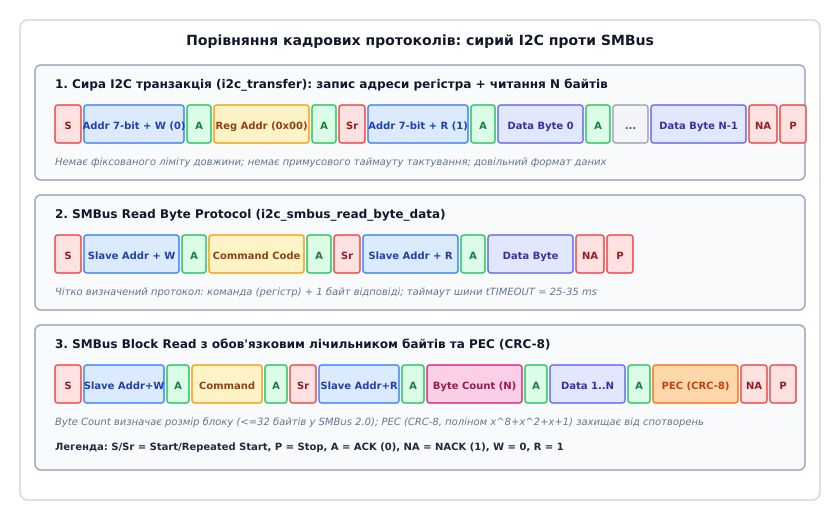
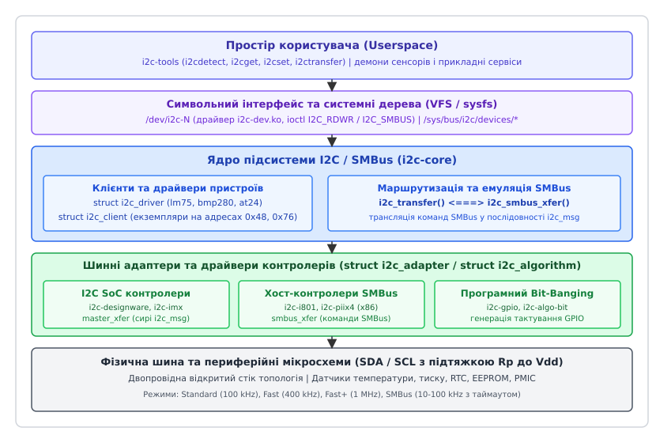
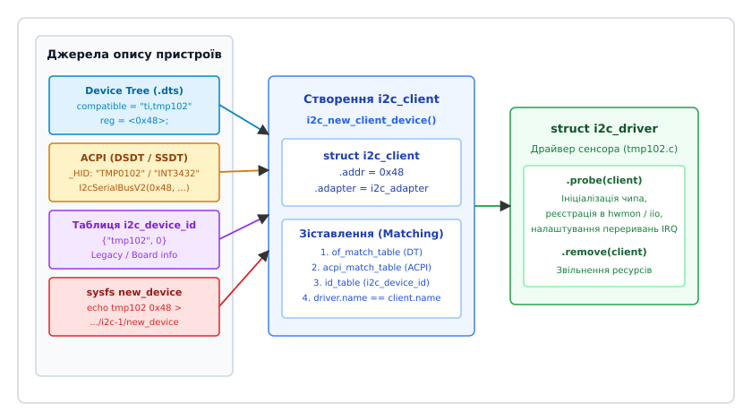

# Шина I²C і SMBus у ядрі: адаптери, клієнти й збіг за таблицею

<preknowlist>
- [Модель пристроїв sysfs](book:unix-linux/sysfs-device-model) — абстракція `device`, `device_driver`, шини `bus_type` та вузли в sysfs.
- [Дерево пристроїв Device Tree](book:unix-linux/device-tree) — опис апаратних вузлів контролерів шин та дочірніх пристроїв у дереві пристроїв.
- [Інтерфейс ioctl](book:unix-linux/ioctl-interface) — системний виклик `ioctl()` для передачі структурованих керуючих команд драйверам пристроїв.
</preknowlist>

Підключення десятків допоміжних цифрових мікросхем — термодатчиків, годинників реального часу (RTC), мікросхем енергонезалежної пам'яті EEPROM, контролерів живлення (PMIC), аудіокодеків та розширювачів портів вводу-виводу — до центрального процесора вимагає мінімізації кількості фізичних контактів і провідників на друкованій платі. Виділення окремих ліній адреси й даних для кожного чипа зробило б трасування плат надмірно складним і дорогим. Двопровідні послідовні шини I²C (Inter-Integrated Circuit, міжінтегральна схема) та SMBus (System Management Bus, шина системного керування) розв'язують цю проблему, об'єднуючи всі периферійні вузли на спільній парі сигнальних ліній із використанням адресації.

У ядрі Linux підсистема I²C та SMBus забезпечує уніфіковану трирівневу модель: вона повністю ізолює драйвери клієнтських мікросхем від апаратної специфіки хост-контролерів шини. Завдяки цьому драйвер температурного датчика чи пам'яті оперує абстрактними транзакціями й не залежить від того, чи виконується передача бітів апаратним контролером системи на кристалі (SoC), PCI-хостом на материнській платі сервера чи програмним смиканням виводів GPIO (bit-banging). Зв'язування між пристроями та їхніми драйверами відбувається автоматично за таблицями Device Tree, ACPI або числовими ідентифікаторами.

---

## 1. Фізична модель і протокольна дихотомія: I²C проти SMBus

Фізично шина I²C складається з двох сигнальних ліній: лінії послідовних даних SDA (Serial Data) та лінії тактування SCL (Serial Clock). Обидві лінії підключені до позитивного джерела живлення через підтягувальні резистори `R_p` і працюють у режимі відкритого колектора або відкритого стоку (Open-Drain). Кожен пристрій на шині може лише притягнути лінію до землі (логічний нуль) або відпустити її у стан високого імпедансу (високий логічний рівень формується пасивно через резистор `R_p`).

Така схемотехніка утворює монтажне «І» (Wired-AND): лінія залишається у високому стані лише тоді, коли всі без винятку підключені пристрої відпустили її. Якщо хоча б один вузол відкриває свій вихідний транзистор, лінія падає в нуль. Це забезпечує апаратний арбітраж між кількома майстрами без короткого замикання та дозволяє веденим пристроям за потреби призупиняти передачу, утримуючи тактову лінію SCL у нулі (механізм розтягування такту — Clock Stretching).

```text
       Vdd (+3.3V / +5V)
         │          │
        [Rp]       [Rp]
         │          │
SDA ─────┴──────────┼─────────────────────
                    │
SCL ────────────────┴─────────────────────
         │          │          │
   ┌─────┴────┐┌────┴─────┐┌───┴──────┐
   │ Master   ││ Target 1 ││ Target 2 │
   │ (SoC)    ││ (LM75)   ││ (24C04)  │
   └──────────┘└──────────┘└──────────┘
```

Базовий цикл передачі починається з кадру START (`S`), коли лінія SDA переходить із високого стану в низький при стабільно високому рівні SCL. Після цього передаються байти даних (по 8 бітів, старшим бітом уперед), причому зміна стану SDA дозволена виключно тоді, коли SCL перебуває в низькому стані. Кожен переданий байт супроводжується дев'ятим тактом SCL, під час якого приймач зобов'язаний підтвердити прийом, виставивши низький рівень на лінії SDA (біт ACK, Acknowledge), або залишити лінію високою (біт NACK, Not-Acknowledge). Завершується транзакція кадром STOP (`P`), коли SDA переходить із низького рівня у високий при високому стані SCL. Якщо майстер хоче продовжити обмін без звільнення шини, він формує повторний старт (Repeated START, `Sr`).

Перший байт після кадру START містить 7 бітів адреси цільового пристрою (`A[6]..A[0]`) та один молодший біт напрямку (`R/W̄`): `0` означає операцію запису (Write), `1` — операцію читання (Read). У разі 10-бітної адресації використовуються два послідовні адресні байти зі спеціальним префіксом `11110xx`.

### 1.1. Багатомайстровий арбітраж та синхронізація тактування

Коли два або більше ведучих контролерів одночасно намагаються розпочати передачу на вільній шині, між ними розгортається побітовий арбітраж без спотворення даних. Кожен ведучий генерує власні тактові імпульси SCL та виставляє біти на лінію SDA, одночасно зчитуючи фактичний рівень напруги з лінії SDA (Loopback).

Якщо перший ведучий намагається передати логічну одиницю (відпускає SDA у високий стан), а другий ведучий передає логічний нуль (притягує SDA до землі), результуючий рівень на шині через монтажне «І» стає низьким (`0`). Перший ведучий, зчитуючи стан лінії, виявляє розбіжність між переданим бітом `1` та реальним рівнем `0` на шині. Це означає програш арбітражу: перший контролер негайно вимикає свій вихідний буфер SDA, припиняє генерацію тактування SCL і переходить у режим очікування або веденого слухача, дозволяючи другому ведучому завершити передачу без жодного бітового збою.

Синхронізація ліній SCL між різними майстрами також базується на схемі монтажного «І»: тривалість низького стану SCL визначається найповільнішим майстром (лінія лишається низькою, поки її тримає хоча б один контролер), а високий стан починається лише тоді, коли всі майстри закінчили низьку фазу такту.

### 1.2. Відмінності I²C та SMBus

Хоча шина SMBus базується на фізичній топології I²C, між ними існують фундаментальні відмінності в електричних параметрах, часових обмеженнях та протокольних форматах.

Детальний аналіз передумов створення обох стандартів, ролі компаній Philips та Intel, а також історії розвитку драйверів у спільноті `lm-sensors` наведено в [історичному нарисі еволюції I²C та SMBus](book:unix-linux/i2c-and-smbus-subsystem/hist-i2c-smbus-evolution.md).

#### Електричні рівні та логічні пороги

В I²C пороги вхідної напруги прив'язані до напруги живлення шини `V_DD`:
- Низький рівень `V_IL ≤ 0.3 · V_DD`;
- Високий рівень `V_IH ≥ 0.7 · V_DD`.

В SMBus логічні пороги є фіксованими незалежно від напруги живлення (`V_DD` від 3.0 В до 5.0 В для SMBus 2.0 / 3.0):
- Низький рівень `V_IL ≤ 0.8 В`;
- Високий рівень `V_IH ≥ 2.1 В`.

Це дозволяє пристроям SMBus із різними робочими напругами (наприклад, контролеру 3.3 В та сенсору 5 В) працювати на одній шині без додаткових перетворювачів рівнів за умови забезпечення спільних порогів.

#### Частоти тактування та таймаут шини (Clock Low Timeout)

Шина I²C є статичною: вона дозволяє тактування від 0 Гц (постійний струм) до 100 кГц (Standard Mode), 400 кГц (Fast Mode), 1 МГц (Fast-mode Plus) або 3.4 МГц (High-Speed Mode). В I²C немає обмеження на максимальний час утримання тактової лінії в нулі (Clock Stretching).

В SMBus введено жорсткі часові рамки для запобігання вічному блокуванню системної шини комп'ютера:
1. **Мінімальна частота тактування:** становить 10 кГц (максимальна — 100 кГц для SMBus 1.x/2.0 та 1 МГц для SMBus 3.0).
2. **Таймаут застрягання такту (`t_TIMEOUT`):** якщо лінія SCL утримується в низькому стані довше 25–35 мс, будь-який пристрій SMBus зобов'язаний скинути свій внутрішній автомат станів і відпустити лінію SDA.
3. **Кумулятивний ліміт розтягування такту:** максимальний сумарний час утримання лінії SCL веденим пристроєм у межах одного байта (`t_LOW:SEXT`) обмежено 25 мс, а ведучим контролером (`t_LOW:MEXT`) — 10 мс.

#### Протокольні формати SMBus та контроль помилок PEC

Якщо I²C сприймає дані як суцільний неструктурований потік байтів довільної довжини, то SMBus стандартизує набір суворих командних шаблонів:
- **Quick Command:** передача лише адреси з бітом R/W без байтів даних (використовується для простого перемикання режимів або виявлення присутності пристрою).
- **Send Byte / Receive Byte:** передача або прийом одного байта даних без вказання внутрішнього регістра.
- **Write Byte / Read Byte Data:** передача 1 байта коду команди (адреси регістра) та запис/читання 1 байта даних.
- **Write Word / Read Word Data:** передача коду команди та 16-бітного слова (два байти, молодшим уперед — little-endian).
- **Block Write / Block Read:** передача коду команди, після якого ведений або ведучий передає байт лічильника довжини (Byte Count, від 1 до 32 байтів у SMBus 2.0 або до 255 байтів у SMBus 3.0), а потім відповідну кількість байтів даних.
- **Packet Error Checking (PEC):** механізм захисту цілісності передачі. До кінця будь-якої транзакції SMBus перед фінальним бітом NACK/STOP додається 8-бітний контрольний байт CRC-8. Розрахунок виконується за поліномом `C(x) = x⁸ + x² + x + 1` з початковим значенням `0x00` над усіма переданими байтами транзакції (включаючи адресні байти та біти напрямку).


*Порівняння послідовностей кадрів сирого I2C та протоколів SMBus: сирий потоковий обмін, протокол читання байта та блокове читання з обов'язковим лічильником байтів і контрольною сумою PEC.*

---

## 2. Архітектура підсистеми I²C/SMBus у ядрі Linux

Підсистема I²C ядра Linux (директорія вихідного коду `drivers/i2c/`) побудована на чіткому модульному розмежуванні обов'язків між трьома фундаментальними рівнями:

1. **Ядро підсистеми (I²C Core):** реалізоване у файлах `i2c-core-base.c`, `i2c-core-smbus.c`, `i2c-core-of.c`, `i2c-core-acpi.c`. Воно реєструє шину `i2c_bus_type` у системній моделі пристроїв Linux, забезпечує облік і реєстрацію адаптерів та клієнтів, реалізує алгоритми зіставлення драйверів із пристроями (matching), керує м'ютексами синхронізації та здійснює трансляцію/емуляцію протоколів SMBus поверх звичайних контролерів I²C.
2. **Драйвери шинних контролерів (Bus Drivers / Adapters):** керують фізичними апаратними блоками вводу-виводу (SoC I²C контролери, хости SMBus на шині PCI, адаптери USB-I2C або алгоритми bit-banging). Вони інкапсулюються структурами `struct i2c_adapter` та `struct i2c_algorithm`.
3. **Драйвери клієнтських пристроїв (Device Drivers):** реалізують логіку конкретних мікросхем (термометри `lm75`, барометри `bmp280`, пам'ять `at24`). Вони представлені структурами `struct i2c_driver` та оперують екземплярами пристроїв `struct i2c_client`.


*Архітектура підсистеми I2C та SMBus у ядрі Linux: взаємодія простору користувача (/dev/i2c-N та sysfs), ядра підсистеми i2c-core, драйверів пристроїв та апаратних шинних адаптерів.*

Крім того, підсистема містить драйвер символьних пристроїв `i2c-dev.ko` (створює вузли `/dev/i2c-N` для прямого керування з простору користувача) та шар підтримки мультиплексорів `i2c-mux.ko` (дозволяє прозоро розгалужувати одну фізичну шину на кілька віртуальних сегментів за допомогою мікросхем на зразок PCA9548).

---

## 3. Ключові структури ядра: адаптери, алгоритми, клієнти й драйвери

Повний опис усіх полів, макросів реєстрації та службових прапорців містить [довідник API підсистеми I²C/SMBus](book:unix-linux/i2c-and-smbus-subsystem/api-i2c-subsystem.md). Нижче розібрано внутрішній устрій та взаємозв'язок головних структур.

### 3.1. `struct i2c_adapter` — представлення шинного хост-контролера

Кожен зареєстрований у системі контролер шини I²C/SMBus описується в ядрі екземпляром структури `struct i2c_adapter`:

```c
struct i2c_adapter {
	struct module *owner;
	unsigned int class;
	const struct i2c_algorithm *algo;
	void *algo_data;

	const struct i2c_lock_operations *lock_ops;
	struct rt_mutex bus_lock;
	struct rt_mutex mux_lock;

	int timeout;
	int retries;
	struct device dev;

	int nr;
	char name[48];
	struct completion dev_released;

	struct mutex userspace_clients_lock;
	struct list_head userspace_clients;

	struct i2c_bus_recovery_info *bus_recovery_info;
	const struct i2c_adapter_quirks *quirks;
};
```

Поле `nr` містить унікальний цілочисельний номер шини (наприклад, `0` для `/dev/i2c-0`). Вбудований об'єкт `dev` зв'язує адаптер із деревом пристроїв ядра: у файловій системі sysfs адаптер з'являється за шляхом `/sys/bus/i2c/devices/i2c-N/` або `/sys/devices/.../i2c-N/`.

Поле `bus_lock` забезпечує потокобезпечність: перед виконанням будь-якої транзакції ядро захоплює м'ютекс шини, блокуючи інші потоки від паралельного надсилання команд на цей же контролер. Поле `bus_recovery_info` містить колбеки для апаратного відновлення шини у разі застрягання лінії SDA в низькому стані.

### 3.2. `struct i2c_algorithm` — методи апаратного доступу

Адаптер шини не містить апаратного коду напряму — він делегує виконання фізичних операцій таблиці методів `struct i2c_algorithm`:

```c
struct i2c_algorithm {
	int (*master_xfer)(struct i2c_adapter *adap, struct i2c_msg *msgs,
			   int num);
	int (*master_xfer_atomic)(struct i2c_adapter *adap,
				  struct i2c_msg *msgs, int num);
	int (*smbus_xfer)(struct i2c_adapter *adap, u16 addr,
			  unsigned short flags, char read_write,
			  u8 command, int size, union i2c_smbus_data *data);
	int (*smbus_xfer_atomic)(struct i2c_adapter *adap, u16 addr,
				 unsigned short flags, char read_write,
				 u8 command, int size, union i2c_smbus_data *data);
	u32 (*functionality)(struct i2c_adapter *adap);
	int (*reg_slave)(struct i2c_client *client);
	int (*unreg_slave)(struct i2c_client *client);
};
```

Контролери шини поділяються на два класи:
1. **Повнофункціональні контролери I²C (SoC, bit-banging):** вони реалізують метод `master_xfer()`, який приймає масив сирих повідомлень `struct i2c_msg` довільної довжини. Метод `smbus_xfer` у таких драйверах зазвичай залишається `NULL`, оскільки команди SMBus автоматично транслюються ядром у виклики `master_xfer`.
2. **Спеціалізовані хост-контролери SMBus (чипсети x86 Intel i801, AMD FCH):** їхня апаратура не вміє генерувати довільні бітові послідовності I²C, а оперує виключно фіксованими регістрами команд SMBus. Такі драйвери реалізують виключно метод `smbus_xfer()`, а поле `master_xfer` лишають рівним `NULL`.

Метод `functionality()` повертає бітову маску констант `I2C_FUNC_*`, яка повідомляє ядру та простору користувача, які саме типи транзакцій підтримує даний контролер (наприклад, `I2C_FUNC_I2C`, `I2C_FUNC_SMBUS_BYTE_DATA`, `I2C_FUNC_SMBUS_WORD_DATA`, `I2C_FUNC_SMBUS_PEC`).

### 3.3. `struct i2c_client` — опис підключеної мікросхеми

Кожен ведений пристрій на шині представляється структурою `struct i2c_client`:

```c
struct i2c_client {
	unsigned short flags;
	unsigned short addr;
	char name[I2C_NAME_SIZE];
	struct i2c_adapter *adapter;
	struct device dev;
	int init_irq;
	int irq;
	struct list_head detected;
};
```

Поле `addr` містить 7-бітну апаратну адресу (без зсуву та без біта R/W, наприклад `0x48` або `0x76`). Поле `adapter` вказує на батьківський шинний контролер. Поле `irq` містить номер лінії переривання процесора, якщо вивід тривоги або готовності мікросхеми підключено до лінії GPIO. Вбудована структура `dev` реєструє клієнт у sysfs за адресою вида `/sys/bus/i2c/devices/1-0048/` (де `1` — номер шинного адаптера, а `0048` — шістнадцяткова адреса мікросхеми).

### 3.4. `struct i2c_driver` — драйвер класу мікросхем

Драйвер конкретного чипа реалізує структуру `struct i2c_driver`:

```c
struct i2c_driver {
	unsigned int class;
	int (*probe)(struct i2c_client *client);
	void (*remove)(struct i2c_client *client);
	void (*shutdown)(struct i2c_client *client);
	void (*alert)(struct i2c_client *client, enum i2c_alert_protocol protocol,
		      unsigned int data);

	int (*detect)(struct i2c_client *client, struct i2c_board_info *info);
	const unsigned short *address_list;
	struct list_head clients;

	struct device_driver driver;
	const struct i2c_device_id *id_table;
};
```

Коли підсистема виявляє збіг між зареєстрованим клієнтом `i2c_client` та драйвером, вона викликає функцію `probe(client)`. Всередині `probe()` драйвер ініціалізує внутрішні регістри чипа, виділяє пам'ять екземпляра та реєструє пристрій у відповідній функціональній підсистемі ядра (`hwmon` для датчиків температури, `iio` для акселерометрів і барометрів, `rtc` для годинників, `regulator` для PMIC).

---

## 4. Механіка емуляції та маршрутизації транзакцій

Головна перевага підсистеми полягає в автоматичній трансляції та емуляції запитів між несумісними класами апаратури.

### 4.1. Виклики `i2c_transfer()`

Коли драйвер пристрою викликає функцію виконання сирих I²C транзакцій:

```c
int i2c_transfer(struct i2c_adapter *adap, struct i2c_msg *msgs, int num);
```

Ядро перевіряє наявність методу `adap->algo->master_xfer`. Якщо контролер підтримує сирий I²C, транзакція передається йому безпосередньо. Якщо ж адаптер є суто SMBus-хостом (як Intel i801 на ПК), `i2c_transfer()` повертає помилку `-EOPNOTSUPP` (Operation not supported). Драйвери пристроїв, які покладаються виключно на довільні масиви `i2c_msg` без стандартного форматування, не зможуть працювати на таких шинах.

### 4.2. Емуляція SMBus через `i2c_smbus_xfer()`

Коли драйвер сенсора викликає функцію SMBus (наприклад, `i2c_smbus_read_byte_data(client, reg)`), виклик потрапляє в функцію ядра `i2c_smbus_xfer()`. Ядро діє за наступним алгоритмом:

1. **Пряме виконання:** Якщо адаптер має реалізований метод `adap->algo->smbus_xfer`, ядро передає запит безпосередньо йому.
2. **Програмна емуляція (SMBus Emulation):** Якщо `smbus_xfer` відсутній, але адаптер має метод `master_xfer`, ядро автоматично синтезує масив структур `struct i2c_msg`, еквівалентний запитаній команді SMBus.

Наприклад, операція `i2c_smbus_read_byte_data(client, 0x10)` автоматично перетворюється на два повідомлення `struct i2c_msg`:
- Повідомлення 1: `flags = 0` (запис), `len = 1`, `buf = { 0x10 }` (номер регістра).
- Повідомлення 2: `flags = I2C_M_RD` (читання), `len = 1`, `buf = &value`.

Обидва повідомлення передаються у виклик `i2c_transfer()`, який генерує послідовність `START -> Addr+W -> 0x10 -> Repeated START -> Addr+R -> Read Byte -> STOP`.

Завдяки цьому драйвери, написані з використанням стандартного API SMBus, працюють на 100% контролерів ядра Linux — як на нативних хостах SMBus, так і на повнофункціональних контролерах I²C.

---

## 5. Механізми парування (Matching) та інстанціювання клієнтів

Оскільки шина I²C не має вбудованого апаратного механізму Plug-and-Play для автоматичного опитування підключених мікросхем (на відміну від PCI чи USB), операційна система повинна знати наперед, які саме чипи та на яких адресах встановлені на платі.

Підсистема I²C ядра Linux підтримує чотири основні способи інстанціювання клієнтів та зіставлення їх із драйверами.


*Ієрархія та шляхи парування i2c_driver та i2c_client: джерела декларації (Device Tree, ACPI, id_table, sysfs) та етапи створення i2c_client і виклику probe().*

### 5.1. Дерево пристроїв (Device Tree) — вбудовані системи (ARM / RISC-V / MIPS)

У вбудованих системах топологія плати описується у файлах `.dts`/`.dtsi`. Вузол контролера I²C містить дочірні вузли для кожного підключеного пристрою:

```dts
&i2c1 {
	status = "okay";
	clock-frequency = <400000>;

	temp_sensor: sensor@48 {
		compatible = "ti,tmp102";
		reg = <0x48>;
		interrupt-parent = <&gpio1>;
		interrupts = <14 IRQ_TYPE_EDGE_FALLING>;
	};

	eeprom: eeprom@50 {
		compatible = "atmel,24c04";
		reg = <0x50>;
		pagesize = <16>;
	};
};
```

Під час ініціалізації шинного адаптера ядро викликає функцію `of_i2c_register_devices()`. Вона перебирає всі дочірні вузли, вичитує адресу з властивості `reg`, лінію переривань `interrupts` та створює об'єкт `struct i2c_client`.

Якщо периферійний модуль (наприклад, датчик на платі розширення або шилді) підключається до системи під час роботи, його опис можна динамічно завантажити за допомогою оверлея дерева пристроїв (Device Tree Overlay, файл `.dtbo`). Підсистема ядра `of_overlay` перехоплює додавання нових вузлів, викликає `of_i2c_notify()` і автоматично інстанціює відповідні клієнтські структури `i2c_client` на цільовому адаптері в режимі реального часу без перезавантаження операційної системи.

Зіставлення з драйвером виконується за таблицею `driver.of_match_table`:

```c
static const struct of_device_id tmp102_of_match[] = {
	{ .compatible = "ti,tmp102" },
	{ }
};
MODULE_DEVICE_TABLE(of, tmp102_of_match);

static struct i2c_driver tmp102_driver = {
	.driver = {
		.name = "tmp102",
		.of_match_table = tmp102_of_match,
	},
	.probe = tmp102_probe,
	.remove = tmp102_remove,
};
module_i2c_driver(tmp102_driver);
```

### 5.2. Таблиці ACPI — платформи x86 та сервери

На материнських платах x86 та серверах ARM64 конфігурація периферії надається прошивкою UEFI/BIOS у таблицях ACPI (DSDT / SSDT). Пристрій I²C описується об'єктом `Device`, де вказується апаратний ідентифікатор `_HID` (Hardware ID) або `_CID` (Compatible ID) та дескриптор підключення `_CRS` (Current Resource Settings):

```asl
Device (TMP0) {
    Name (_HID, "TMP0102")
    Name (_CID, "INT3432")
    Method (_CRS, 0, Serialized) {
        Name (RBUF, ResourceTemplate () {
            I2cSerialBusV2 (
                0x0048,               // 7-бітна I2C адреса
                ControllerInitiated,  // Режим Slave
                400000,               // Частота шини 400 кГц
                AddressingMode7Bit,   // 7-бітна адресація
                "\\_SB.PCI0.I2C1",    // Шлях до шинного адаптера
                0x00, ResourceConsumer, , Exclusive
            )
            GpioInt (Edge, ActiveLow, Exclusive, PullUp, 0, "\\_SB.GPIO", ) { 42 }
        })
        Return (RBUF)
    }
}
```

Ядро парсить ці таблиці за допомогою `acpi_i2c_register_devices()` та зіставляє пристрої з драйверами за таблицею `driver.acpi_match_table`:

```c
static const struct acpi_device_id tmp102_acpi_match[] = {
	{ "TMP0102", 0 },
	{ "INT3432", 0 },
	{ }
};
MODULE_DEVICE_TABLE(acpi, tmp102_acpi_match);
```

### 5.3. Текстова таблиця `i2c_device_id` (Legacy / Board info)

Для систем без Device Tree та ACPI або для зворотної сумісності використовується масив `struct i2c_device_id`:

```c
static const struct i2c_device_id tmp102_id[] = {
	{ "tmp102", 0 },
	{ "tmp102a", 1 },
	{ }
};
MODULE_DEVICE_TABLE(i2c, tmp102_id);
```

Ядро зіставляє текстове поле `client->name` з полем `name` в `id_table`. Цей механізм також слугує резервним варіантом (fallback), якщо драйвер не має окремої таблиці ACPI чи DT.

### 5.4. Динамічне створення з простору користувача через sysfs

Якщо на платі з'явився новий датчик, не описаний у Device Tree чи ACPI, його можна створити наживо через спеціальний файл `new_device` в каталозі потрібного адаптера:

```bash
# Створення пристрою: ім'я_драйвера I2C_адреса
echo tmp102 0x48 > /sys/bus/i2c/devices/i2c-1/new_device

# Видалення динамічно створеного пристрою
echo 0x48 > /sys/bus/i2c/devices/i2c-1/delete_device
```

Ядро миттєво створює новий `struct i2c_client`, шукає відповідний драйвер за іменем `tmp102` і викликає його функцію `probe()`.

---

## 6. Реєстрація регістрів через шар Regmap (regmap-i2c)

Сучасні драйвери периферійних мікросхем у ядрі Linux рідко викликають сирі функції `i2c_transfer()` чи `i2c_smbus_*` безпосередньо. Замість цього вони використовують шар абстракції регістрових карт `regmap` (директорія `drivers/base/regmap/`).

Підсистема `regmap-i2c` надає конструктор `devm_regmap_init_i2c()`, який обгортає виклики I²C у стандартні операції читання та запису регістрів `regmap_read()` / `regmap_write()` / `regmap_update_bits()`:

```c
static const struct regmap_config bmp280_regmap_config = {
	.reg_bits = 8,
	.val_bits = 8,
	.max_register = 0xFF,
	.cache_type = REGCACHE_RBTREE,
};

static int bmp280_i2c_probe(struct i2c_client *client)
{
	struct regmap *regmap;
	unsigned int chip_id;
	int ret;

	regmap = devm_regmap_init_i2c(client, &bmp280_regmap_config);
	if (IS_ERR(regmap))
		return PTR_ERR(regmap);

	ret = regmap_read(regmap, 0xD0, &chip_id);
	if (ret < 0)
		return ret;

	if (chip_id != 0x58)
		return -ENODEV;

	return bmp280_common_probe(&client->dev, regmap);
}
```

Переваги використання Regmap в I²C драйверах:
1. **Прозоре кешування (Regcache):** Незмінні конфігураційні регістри кешуються в оперативній пам'яті, що усуває зайві фізичні транзакції на повільній шині I²C.
2. **Атомарне оновлення бітових масок:** Функція `regmap_update_bits()` зчитує регістр, змінює лише потрібні біти за маскою та записує значення назад під захистом внутрішнього м'ютекса.
3. **Уніфікація шин:** Один і той самий спільний код драйвера сенсора може працювати як по шині I²C (`regmap-i2c`), так і по шині SPI (`regmap-spi`) без дублювання логіки обчислень.

---

## 7. Режим веденого пристрою (I2C Target / Slave Mode)

Ядро Linux підтримує не лише роль ведучого (Master), але й функціонування локального процесора у ролі веденого пристрою (Slave/Target). Це критично для систем керування серверами (BMC — Baseboard Management Controller) на базі чипів ASPEED AST2500/AST2600, де Linux обробляє вхідні запити від головного процесора хоста по шинах IPMB (Intelligent Platform Management Bus).

Драйвер реєструє ведений пристрій функцією `i2c_slave_register()`:

```c
int i2c_slave_register(struct i2c_client *client, i2c_slave_cb_t slave_cb);
```

Коли зовнішній майстер звертається до адреси `client->addr`, апаратний контролер генерує переривання, а ядро викликає функцію зворотного виклику `slave_cb` із відповідною подією:
- `I2C_SLAVE_READ_REQUESTED` — зовнішній майстер хоче прочитати дані (колбек повертає перший байт відповіді).
- `I2C_SLAVE_READ_PROCESSED` — передано попередній байт, майстер запросив наступний (колбек повертає наступний байт).
- `I2C_SLAVE_WRITE_REQUESTED` — майстер ініціював сесію запису даних.
- `I2C_SLAVE_WRITE_RECEIVED` — прийнято черговий байт даних від зовнішнього майстра.
- `I2C_SLAVE_STOP` — майстер згенерував фінальний кадр STOP, транзакцію завершено.

У дереві ядра Linux реалізовано стандартні драйвери ведених пристроїв: `i2c-slave-eeprom.c` (емуляція чипа пам'яті 24Cxx в RAM) та `i2c-slave-mqueue.c` (черга повідомлень між двома процесорами).

---

## 8. Робота з простору користувача: `/dev/i2c-N` та пакет `i2c-tools`

Для взаємодії з мікросхемами безпосередньо з простору користувача застосовується символьний драйвер `i2c-dev.ko`. Він створює пристрої `/dev/i2c-0`, `/dev/i2c-1` тощо, які надають доступ через стандартні системні виклики `open()`, `read()`, `write()`, `close()` та `ioctl()`.

Практичні приклади написання власних програм на C та C++ з використанням викликів `I2C_RDWR` розглянуто в [практичному проєкті взаємодії з I²C/SMBus сенсором](book:unix-linux/i2c-and-smbus-subsystem/proj-i2c-sensor-userspace.md).

### 8.1. Набір діагностичних утиліт `i2c-tools`

Пакет `i2c-tools` є де-факто стандартом для діагностики, перевірки та налагодження I²C/SMBus пристроїв у Linux.

#### 1. `i2cdetect` — виявлення шин та сканування адрес

```bash
# Перелік усіх доступних шинних адаптерів у системі
i2cdetect -l
# Вивід:
# i2c-0  i2c         Synopsys DesignWare I2C adapter  I2C adapter
# i2c-1  smbus       SMBus I801 adapter at f000       SMBus adapter

# Безпечне сканування адрес на шині i2c-1
i2cdetect -y -r 1
```

Результат сканування відображається у вигляді таблиці адрес від `0x03` до `0x77`:
- `--` — пристрій за вказаною адресою не відповів (отримано NACK);
- `48` (шістнадцяткове число) — пристрій відповів ACK, адреса вільна і не обслуговується драйвером ядра;
- `UU` — пристрій присутній, але адреса вже захоплена штатним драйвером ядра (драйвер ядра заблокував її для монопольного використання).

#### 2. `i2cget` та `i2cset` — читання та запис окремих регістрів

```bash
# Читання 1 байта (b) з регістра 0x00 пристрою 0x48 на шині 1
i2cget -y 1 0x48 0x00 b

# Читання 16-бітного слова (w) з регістра 0x00
i2cget -y 1 0x48 0x00 w

# Запис 1 байта 0x57 у регістр конфігурації 0xF4 пристрою 0x76
i2cset -y 1 0x76 0xF4 0x57 b
```

#### 3. `i2cdump` — дампування таблиці регістрів

```bash
# Зчитування вмісту регістрів від 0x00 до 0xFF пристрою 0x50 (EEPROM)
i2cdump -y 1 0x50
```

#### 4. `i2ctransfer` — виконання складених сирих транзакцій

Утиліта `i2ctransfer` використовує виклик `ioctl(I2C_RDWR)` і дозволяє генерувати довільні послідовності повідомлень із повторним стартом:

```bash
# Запис 2 байтів адреси пам'яті (0x00, 0x10) на пристрій 0x50,
# після чого читання 4 байтів без звільнення шини (Repeated START)
i2ctransfer -y 1 w2@0x50 0x00 0x10 r4
```

---

## 9. Блокування, мультиплексування та відновлення шини (Bus Recovery)

### 9.1. Синхронізація доступу та мультиплексування шин

Оскільки до одного адаптера `i2c_adapter` підключено багато незалежних клієнтів `i2c_client`, підсистема захищає апаратний контролер за допомогою м'ютекса `adap->bus_lock`.

Коли в системі використовуються апаратні мультиплексори шини (наприклад, 8-канальний чип PCA9548), підсистема `i2c-mux` створює для кожного вихідного каналу окремий віртуальний адаптер `struct i2c_adapter`. Коли драйвер ініціює передачу на віртуальній шині `i2c-3`, ядро:
1. Захоплює глобальний м'ютекс батьківського адаптера `mux_lock`.
2. Передає команду перемикання каналу на сам мультиплексор.
3. Виконує цільову транзакцію клієнта.
4. Звільняє м'ютекс.

Це забезпечує повну прозорість: драйвери сенсорів навіть не знають, що працюють через мультиплексор.

### 9.2. Аварійне зависання шини та механізм Bus Recovery

Найпоширенішою апаратною проблемою I²C є «зависання» шини: лінія SDA залишається притиснутою до землі (0 В), унеможливлюючи генерацію нових кадрів START або передачу будь-яких адрес.

Причина виникає тоді, коли процесор перезавантажується або аварійно перериває операцію читання посеред передачі байта веденим пристроєм. Якщо ведений чип у цей момент виставляв нульовий біт на лінію SDA, він залишатиметься чекати наступного фронту тактування SCL. Оскільки контролер процесора скинувся і не генерує такти, шина блокується назавжди.

Ядро Linux містить стандартизований механізм відновлення шини (Bus Recovery), описаний структурою `struct i2c_bus_recovery_info`:

```c
int i2c_recover_bus(struct i2c_adapter *adap);
```

Алгоритм відновлення:
1. Підсистема викликає колбек `prepare_recovery()`, який через підсистему `pinctrl` тимчасово перемикає виводи SoC із блоку I²C у режим звичайних ліній GPIO.
2. Програмно генерується до 9 послідовних імпульсів на лінії SCL (тактування вручну).
3. При кожному імпульсі ведений пристрій зсуває свій внутрішній регістр і врешті-решт відпускає лінію SDA у високий стан (ACK/NACK).
4. Щойно SDA стає високою, контролер формує примусовий кадр STOP (`P`), переводячи автомат станів веденого чипа в режим спокою.
5. Колбек `unprepare_recovery()` повертає виводи SoC у режим апаратного контролера I²C.

---

> 🔧 **Навіщо це.**
>
> Підсистема I²C/SMBus у Linux — це класичний зразок багаторівневої системної абстракції. Вона вирішує одвічний компроміс між дешевизною заліза та складністю софту:
> 1. **Ізоляція топології:** Розробник драйвера барометра BMP280 чи регулятора TPS65217 пише код один раз. Цей драйвер працюватиме на крихітному роутері з MIPS, одноплатному комп'ютері з ARM чи 128-ядерному сервері з x86 без жодних змін у вихідному коді.
> 2. **Прозоре згладжування несумісностей:** Завдяки шару емуляції `i2c-core-smbus` жорсткі стандартизовані команди SMBus безшовно транслюються у сирі байти I²C, а складні мультиплексовані топології виглядають для решти ядра як незалежні шини.
> 3. **Жива діагностика без зупинки системи:** Наявність вузлів `/dev/i2c-N` та інструментів `i2c-tools` дозволяє інженерам діагностувати плати наживо, перевіряти зв'язок із чипами та калібрувати сенсори без перезбирання ядра та перезавантаження пристрою.
