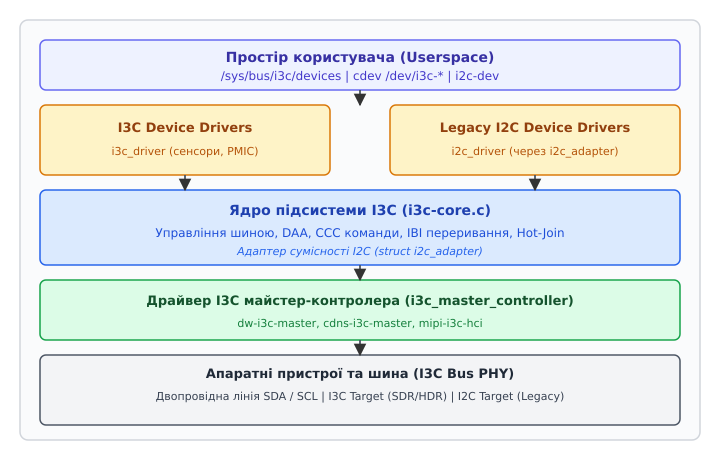
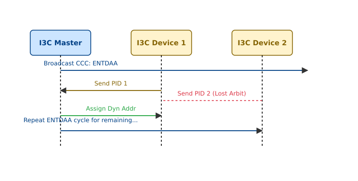

# Підсистема шини I3C (MIPI I3C) в Linux

<preknowlist>
- [Модель пристроїв Linux](topic:unix-linux/sysfs-device-model) — абстракція `device`, `device_driver` та поділ шин і пристроїв у sysfs.
- [Дерево пристроїв Device Tree](topic:unix-linux/device-tree) — опис апаратних вузлів контролера шини та підключених периферійних систем.
- [Обробка переривань і нижні половини](topic:unix-linux/interrupts-bottom-halves) — робота апаратних переривань, workqueue та обробників смугових подій.
</preknowlist>

Стрімке збільшення кількості сенсорів у мобільних та вбудованих системах призвело до вичерпання фізичних контактів процесорних платформ та зростання енергоспоживання через недоліки класичних шин I2C та SPI. Кожен новий датчик на I2C вимагав не лише ліній даних, але й власної апаратної лінії GPIO для передачі переривань, тоді як відкритий стік з пасивною підтяжкою обмежував швидкість сотнями кілогерц. Стандарт MIPI I3C (Improved Inter-Integrated Circuit) розв'язав цю проблему, поєднавши двопровідну топологію із високою швидкістю push-pull передачі, динамічним призначенням адрес та передачею переривань безпосередньо по лініях шини.

Підсистема I3C у ядрі Linux (розташована у директорії `drivers/i3c/`) надає уніфіковану інфраструктуру для управління майстер-контролерами та периферійними пристроями. Вона перебирає на себе складні аспекти протоколу: автовиявлення пристроїв, розподіл 7-бітних динамічних адрес, обробку вбудованих переривань, трансляцію команд CCC та підтримку сумісності зі старими драйверами I2C.

## 1. Електричні та протокольні основи MIPI I3C

Шина I3C зберігає фізичну двопровідну топологію I2C, що складається з лінії даних SDA (Serial Data) та лінії тактування SCL (Serial Clock). Проте на рівні сигналізації та протоколу I3C кардинально змінює принцип роботи.

Детальний аналіз передумов, викликів та етапів розробки стандарту робочою групою Sensor Working Group розглянуто в [історію виникнення та стандартизації MIPI I3C](topic:unix-linux/i3c-bus-subsystem/hist-mipi-i3c.md).

### 1.1. Режими сигналізації та швидкості передачі

На відміну від I2C, де обидві лінії завжди працюють у режимі відкритого стоку (Open-Drain), I3C використовує гібридну схему сигналізації, яка адаптується до поточного стану транзакції:

1. **Режим відкритого стоку (Open-Drain, OD):** Використовується виключно під час ініціалізації шини, арбітражу DAA, передачі кадрів START/STOP та обробки переривань IBI. Швидкість тактування SCL у цьому режимі обмежена діапазоном 1.7–4 МГц через час наростання фронту сигналу на паразитної ємності шини. У цьому режимі високий рівень напруги відновлюється пасивно через підтягувальні резистори.
2. **Базовий режим Push-Pull (Single Data Rate, SDR):** Після виявлення та адресації пристроїв майстер переводить лінію SCL та лінію даних SDA у активний симетричний push-pull режим. Це усуває залежність від підтягувальних резисторів і дозволяє підвищити частоту тактування SCL до 12.5 МГц, забезпечуючи чисту швидкість передачі даних 12.5 Мбіт/с. Обидва каскади (p-канальний та n-канальний транзистори) активуються вихідним драйвером.
3. **Режими високої швидкості (High Data Rate, HDR):** Дозволяють передавати дані зі швидкостями від 25 до 33.3 Мбіт/с без підвищення частоти SCL. Специфікація визначає декілька режимів HDR:
   - **HDR-DDR (Double Data Rate):** Передача даних здійснюється по обох фронтах (наростаючому та спадаючому) тактового сигналу SCL.
   - **HDR-TSP (Ternary Symbol Pure):** Використовує тернарне кодування символів для передачі 3 бітів за 2 такти SCL на двох лініях без використання октавних паузи.
   - **HDR-TSL (Ternary Symbol Legacy):** Тернарний режим із підтримкою присутності I2C пристроїв на шині.

Електричний розрахунок часу наростання фронту, виведення формул швидкості та математичну модель енергоспоживання наведено в [математичний розрахунок електричних параметрів та арбітражу](topic:unix-linux/i3c-bus-subsystem/math-i3c-arbitration.md).

### 1.2. Ідентифікація пристроїв: PID, BCR та DCR

Кожен I3C-пристрій має апаратно зашиті атрибути ідентифікації, які зчитуються майстром під час ініціалізації:

- **Provisional ID (PID):** 48-бітний унікальний ідентифікатор пристрою. Складається з ID виробника (MIPI Manufacturer ID, 15 бітів), прапорця типу ідентифікатора (1 біт), ID моделі (Part ID, 16 бітів) та ID екземпляра чи рандомного числа (Instance ID, 16 бітів). Ці 48 бітів забезпечують абсолютну унікальність кожного чіпа у світі.
- **Bus Characteristics Register (BCR):** 8-бітний регістр характеристик шини. Визначає можливості пристрою: підтримку IBI, можливість виступати Secondary Master, підтримку режимів HDR, обмеження швидкості та потребу у 50ns фільтрі сплесків.
- **Device Characteristics Register (DCR):** 8-бітний регістр типу пристрою. Вказує клас периферії (наприклад, `0x41` для акселерометра, `0x63` для датчика тиску, `0xC6` для PMIC).

Розгляд схемотехніки апаратного контролера I3C, його внутрішніх черг FIFO та каскадів вводу-виводу винесено в [узагальнену апаратну структуру I3C-контролера](topic:unix-linux/i3c-bus-subsystem/comp-i3c-master-controller.md).

## 2. Архітектурний каркас підсистеми I3C у ядрі Linux

Підсистема I3C в ядрі Linux впроваджена починаючи з версії Linux 5.0. Вона побудована за модульним принципом із чітким розмежуванням між закорневою логікою підсистеми (`i3c-core`), драйверами хост-контролерів та драйверами периферійних пристроїв.


*Архітектура підсистеми I3C у ядрі Linux: взаємодія i3c-core із майстер-контролерами, драйверами пристроїв та шаром сумісності з I2C.*

### 2.1. Ключові структури даних ядра

Головною абстракцією апаратного контролера шини є структура `struct i3c_master_controller`, визначена у `include/linux/i3c/master.h`:

```c
struct i3c_master_controller {
	struct device dev;
	const struct i3c_master_controller_ops *ops;
	struct i3c_bus bus;
	struct i2c_adapter i2c_scl_as_i3c;
	/* Внутрішні блоки синхронізації та черг ядра */
};
```

Драйвер апаратного контролера (наприклад, Cadence або Synopsys DesignWare) реєструє контролер у ядрі, передаючи таблицю операцій `struct i3c_master_controller_ops`:

```c
struct i3c_master_controller_ops {
	int (*bus_init)(struct i3c_master_controller *master);
	void (*bus_cleanup)(struct i3c_master_controller *master);
	int (*attach_i3c_dev)(struct i3c_dev_desc *dev);
	int (*reattach_i3c_dev)(struct i3c_dev_desc *dev, u8 old_dyn_addr);
	void (*detach_i3c_dev)(struct i3c_dev_desc *dev);
	int (*do_daa)(struct i3c_master_controller *master);
	int (*send_ccc_cmd)(struct i3c_master_controller *master,
			    struct i3c_ccc_cmd *cmd);
	int (*priv_xfers)(struct i3c_dev_desc *dev,
			  struct i3c_priv_xfer *xfers,
			  int nxfers);
	int (*i2c_xfers)(struct i2c_dev_desc *dev,
			 const struct i2c_msg *xfers, int nxfers);
	int (*request_ibi)(struct i3c_dev_desc *dev,
			   const struct i3c_ibi_setup *req);
	void (*free_ibi)(struct i3c_dev_desc *dev);
	int (*enable_ibi)(struct i3c_dev_desc *dev);
	int (*disable_ibi)(struct i3c_dev_desc *dev);
};
```

Повний довідник по всіх полях даних, параметрах функцій та прапорцях станів містить [структурний довідник API підсистеми](topic:unix-linux/i3c-bus-subsystem/api-i3c-subsystem.md).

### 2.2. Послідовність ініціалізації контролера у ядрі

Коли драйвер апаратного контролера завантажується і знаходить фізичний пристрій у Device Tree, він викликає системну функцію `i3c_master_register()`. Послідовність дій ядра `i3c-core` розворачивається за наступними етапами:

1. **Виділення ресурсів шини:** Створюється унікальний номер шини `bus->id` через інфраструктуру IDA (ID Allocation) ядра. Ініціалізуються внутрішній м'ютекс `bus->lock` та списки пристроїв `bus->devs`.
2. **Виклик `ops->bus_init()`:** Ядро викликає апаратно-залежну функцію драйвера для подачі живлення на фізичний каскад PHY та перевірки готовності регістрів.
3. **Реєстрація адаптера I2C:** Ядро конфігурує об'єкт `struct i2c_adapter`, заповнює таблицю `i2c_algorithm` і реєструє його в підсистемі I2C. Це робить шину I3C видимою для стандартного сканера I2C.
4. **Виконання процедури DAA:** Ядро надсилає широкомовну команду `RSTDAA` і запускає `ops->do_daa()` для автовиявлення всіх підключених периферійних пристроїв.
5. **Створення пристроїв модель драйверів:** Для кожного виявленого I3C та I2C пристрою створюються об'єкти `struct i3c_device` та `struct i2c_client`, після чого викликається стандартна процедура зв'язування з драйверами (`bus_probe_device()`).

### 2.3. Модель представлення шини та пристроїв

Підсистема розділяє представлення пристрою на два рівні:

1. **`struct i3c_dev_desc` (Внутрішній опис пристрою):** Використовується ядрами `i3c-core` та драйверами контролерів для управління адресацією, реєстрами BCR/DCR та виділенням апаратних ресурсів під IBI. Вона містить копію зчитаної інформації `struct i3c_device_info`.
2. **`struct i3c_device` (Пристрій шини):** Представляє екземпляр пристрою для драйверів периферії. Вона містить вбудовану `struct device`, що дозволяє пристрою інтегруватися у загальну модель драйверів Linux (Linux Driver Model).

### 2.4. Безшовна інтеграція з підсистемою I2C

Оскільки шина I3C підтримує підключення класичних I2C-пристроїв, ядро `i3c-core` під час реєстрації майстер-контролера автоматично ініціалізує та реєструє об'єкт `struct i2c_adapter`.

Коли драйвер I2C-пристрою запитує транзакцію `i2c_transfer()`, підсистема I2C спрямовує виклик на адаптер I3C, який викликає callback `ops->i2c_xfers()`. Майстер-контролер I3C транслює ці запити у класичні кадрові послідовності I2C на швидкостях, дозволених поточним режимом шини. Це гарантує, що старі драйвери I2C працюють без жодних змін у коді.

## 3. Протокольна механіка: DAA, CCC, IBI та Hot-Join

### 3.1. Динамічне призначення адрес (DAA)

У шині I2C адреси пристроїв є статичними і часто конфліктують, якщо на одній шині встановлено два однакових сенсори. У шині I3C адреси призначаються динамічно майстром під час ініціалізації за допомогою процедури ENTDAA (Enter Dynamic Address Assignment).


*Послідовність виконання процедури DAA (ENTDAA): побітовий арбітраж 48-бітного Provisional ID на відкритому стоці та призначення динамічної 7-бітної адреси.*

Послідовність виконання DAA у ядрі Linux розворачивається за таким сценарієм:

1. **Скидання адрес (RSTDAA):** Майстер розсилає широкомовну команду `RSTDAA` (Reset Dynamic Address Assignment), змушуючи всі пристрої скинути свої динамічні адреси та перейти у стан очікування DAA.
2. **Старт DAA (ENTDAA):** Майстер видає широкомовну команду `ENTDAA` (`0x07`).
3. **Побітовий арбітраж:** Усі пристрої без адреси починають одночасно передавати свій 48-бітний Provisional ID (PID), регістри BCR та DCR біт за бітом на відкритому стоці.
4. **Визначення переможця:** Лінія SDA працює як логічне І (Wired-AND). Якщо пристрій передає '1', але бачить на шині '0' (оскільки інший пристрій потягнул лінію до землі нижчим значенням біта), він негайно виходить з арбітражу і чекає наступного раунду. Перемагає пристрій із найменшим PID.
5. **Призначення адреси:** Отримавши PID переможця, майстер надсилає йому вільну 7-бітну динамічну адресу (наприклад, `0x08`).
6. **Підтвердження та вихід:** Переможець зберігає нову адресу, відповідає ACK і виходить з процедури ENTDAA.
7. **Цикл:** Майстер повторює раунд арбітражу доти, доки жоден пристрій не відповість на запит DAA, після чого видає умову STOP.

Після завершення DAA ядро `i3c-core` порівнює зчитані PID та DCR із вузлами у Device Tree, створює відповідні об'єкти `struct i3c_device` та викликає `probe()` відповідних драйверів.

### 3.2. Загальні коди команд (Common Command Codes - CCC)

CCC — це стандартизовані системні команди, які майстер використовує для управління станом шини. Команди поділяються на два класи:

- **Broadcast CCC (Широкомовні, адреса `0x7E`):** Отримуються всіма пристроями на шині одночасно.
  - `ENEC` / `DISEC` (Enable/Disable Events Command): Увімкнення або вимкнення подій IBI чи Hot-Join.
  - `RSTDAA` (Reset DAA): Скидання всіх динамічних адрес.
  - `ENTDAA` (Enter DAA): Запуск циклу виявлення та адресації.
  - `SETAASA` (Set All Addresses to Static Addresses): Призначення динамічних адрес, що дорівнюють статичним I2C-адресам пристроїв.
- **Direct CCC (Адресні):** Спрямовуються конкретному пристрою за його динамічною адресою.
  - `SETMWL` / `SETMRL` (Set Max Write/Read Length): Встановлення максимальної довжини пакетів запису та читання.
  - `GETSTATUS`: Зчитування 16-бітного регістра поточного стану пристрою та виявлення помилок.

### 3.3. Внутрішньосмугові переривання (In-Band Interrupts — IBI)

В I2C для сповіщення процесора про події (наприклад, готовність даних сенсора) була потрібна окрема фізична лінія GPIO. В I3C пристрої генерують переривання безпосередньо по лініях SDA/SCL:

1. Коли шина знаходиться в стані спокою (IDLE), периферійний пристрій, який бажає згенерувати переривання, притягує лінію SDA до землі, створюючи умову START.
2. Майстер розпізнає запит і починає подавати тактові імпульси SCL у режимі відкритого стоку.
3. Пристрій передає свою 7-бітну динамічну адресу із встановленим бітом читання `R/W = 1`.
4. Якщо кілька пристроїв одночасно ініціювали IBI, відбувається арбітраж адрес: пристрій із меншою динамічною адресою перемагає і отримує пріоритет обробки.
5. Майстер підтверджує (ACK) адресу пристрою, після чого пристрій може передати один Mandatory Data Byte (MDB), який вказує причину переривання (наприклад, поріг температури перевищено).
6. Підсистема Linux I3C викликає зареєстровану верхню половину обробника IBI у контексті переривання, яка зазвичай планує робочу чергу (workqueue) для зчитування даних.

### 3.4. Механізм Hot-Join

Hot-Join дозволяє пристроям, які були знеструмлені або підключені після ініціалізації шини, динамічно повідомити майстра про свою появу.

Пристрій генерує сигнал IBI, але замість своєї адреси передає спеціальну зарезервовану адресу Hot-Join `0x02`. Отримавши адресу `0x02`, ядро `i3c-core` планує виконання системної робочої черги, яка запускає додатковий раунд DAA (`ENTDAA`) для виявлення нового пристрою, видачі йому динамічної адреси та зв'язування з відповідним драйвером.

## 4. Розробка та життєвий цикл драйвера пристрою

Написання драйвера для I3C-пристрою в Linux здійснюється через виклики API `include/linux/i3c/device.h`.

Готовий працездатний приклад драйвера сенсора з обробкою переривань IBI та атрибутами sysfs винесено в [повний приклад драйвера I3C-пристрою](topic:unix-linux/i3c-bus-subsystem/proj-i3c-driver.md).

### 4.1. Декларація драйвера та таблиця зіставлення

Драйвер реєструє таблицю `struct i3c_device_id`, де вказує 48-бітний Provisional ID або комбінацію MIPI Manufacturer ID та Part ID:

```c
static const struct i3c_device_id my_sensor_ids[] = {
	I3C_DEVICE(0x01B0, 0x0042, NULL),
	{ }
};
MODULE_DEVICE_TABLE(i3c, my_sensor_ids);

static struct i3c_driver my_sensor_driver = {
	.driver = {
		.name = "my_sensor",
	},
	.probe = my_sensor_probe,
	.remove = my_sensor_remove,
	.id_table = my_sensor_ids,
};
module_i3c_driver(my_sensor_driver);
```

### 4.2. Приватні транзакції читання та запису

Передача даних між драйвером та пристроєм виконується через масив структур `struct i3c_priv_xfer` за допомогою функції `i3c_device_do_priv_xfers()`:

```c
static int my_sensor_read_reg(struct i3c_device *i3cdev, u8 reg, void *val, int len)
{
	struct i3c_priv_xfer xfers[2];

	/* Передача адреси регістра (Write) */
	xfers[0].rnw = false;
	xfers[0].len = 1;
	xfers[0].data.out = &reg;

	/* Прийом даних з регістра (Read) */
	xfers[1].rnw = true;
	xfers[1].len = len;
	xfers[1].data.in = val;

	return i3c_device_do_priv_xfers(i3cdev, xfers, 2);
}
```

## 5. Інспекція, діагностика та sysfs-структура

Підсистема I3C експортує детальну інформацію про стан шини та виявлені пристрої у віртуальну файлову систему sysfs за шляхом `/sys/bus/i3c/devices/`.

### 5.1. Структура дерев sysfs

Кожен виявлений пристрій отримує власну директорію виду `i3c-X-Y` (де `X` — номер шини, `Y` — 48-бітний PID або динамічна адреса), яка містить такі атрибути:

- `dcr`: 8-бітний ідентифікатор класу пристрою у шістнадцятковому форматі.
- `bcr`: 8-бітне значення регістра характеристик шини.
- `dynamic_addr`: поточна 7-бітна динамічна адреса, призначена пристрою (наприклад, `0x08`).
- `hdcap`: підтримувані режими високої швидкості (HDR-DDR, HDR-TSP).
- `modalias`: рядок ідентифікації для утиліти `udev` (наприклад, `i3c:dcr41p01B0v0042`).

### 5.2. Режими сумісності шини (Bus Modes)

Ядро I3C автоматично розраховує режим роботи всієї шини залежно від підключених I2C-пристроїв:

- `I3C_BUS_MODE_PURE`: На шині присутні виключно I3C-пристрої. Шина працює на максимальній швидкості SDR (12.5 МГц) без обмежень.
- `I3C_BUS_MODE_MIXED_FAST`: На шині присутні I2C-пристрої з вбудованим 50ns фільтром сплесків. I3C-пристрої працюють на швидкості 12.5 МГц, але відтінки інтервалів підтяжки розширюються.
- `I3C_BUS_MODE_MIXED_SLOW`: На шині присутні старі I2C-пристрої без 50ns фільтра. Частота SCL обмежується діапазоном I2C (до 400 кГц або 1 МГц) для запобігання збоям старого периферійного обладнання.

### 5.3. Відстеження через Ftrace Tracepoints

Для глибокого аналізу таймінгів та діагностики збоїв підсистема I3C містить вбудовані точки трасування Ftrace:

- `i3c:i3c_priv_xfer`: трасування початку та завершення приватних транзакцій.
- `i3c:i3c_ccc_cmd`: фіксація всіх відправлених широкомовних та адресних команд CCC.
- `i3c:i3c_ibi`: реєстрація подій виникнення внутрішньосмугових переривань із зазначенням MDB байта.

Увімкнення трасування виконується через підсистему tracefs:

```bash
echo 1 > /sys/kernel/tracing/events/i3c/enable
cat /sys/kernel/tracing/trace_pipe
```

### 5.4. Крайові випадки та апаратні обмеження

Під час експлуатації підсистеми I3C у реальних системах розробники стикаються із низкою характерних крайових випадків:

- **Збій процедури DAA через ємність шини:** Якщо сумарна паразитна ємність лінії SDA перевищує 50 pF, побітовий арбітраж 48-бітного PID може фіксувати хибні колізії бітів '1'. Ядро I3C реагує на це повторенням спроби ENTDAA із зменшеною частотою тактування SCL у режимі відкритого стоку.
- **Втрата динамічної адреси при просіданні живлення:** Якщо периферійний пристрій перезавантажується внаслідок просідання живлення (Brownout Reset), він втрачає призначену динамічну адресу і перестає відповідати на адресні транзакції. При виявленні `NACK` підсистема `i3c-core` надсилає повторну команду `ENTDAA` для перепідключення пристрою.
- **Шторм переривань IBI:** Якщо периферійний сенсор генерує сигнал IBI із високою частотою (наприклад, у разі несправності апаратного тригера), це може призвести до переповнення кільцевого буфера слотів ядра. Підсистема Linux автоматично деактивує IBI для даного пристрою за допомогою відправки direct CCC команди `DISEC`, запобігаючи вичерпанню ресурсів процесора.

## 6. Порівняльний аналіз I3C з іншими інтерфейсами

Для обґрунтованого вибору шини під час проектування апаратних систем порівняємо MIPI I3C із традиційними та суміжними інтерфейсами вбудованих платформ:

| Параметр порівняння | I2C Fast-Mode Plus | SPI (Quad-SPI) | MIPI I3C SDR / HDR | SPMI (MIPI) |
| :--- | :--- | :--- | :--- | :--- |
| **Кількість сигнальних ліній** | 2 (SDA, SCL) + GPIO IRQ | 4 + N CS ліній | 2 (SDA, SCL) без окремих IRQ | 2 (SDATA, SCLK) |
| **Максимальна швидкість** | 1 Мбіт/с | 50 - 100 Мбіт/с | 12.5 Мбіт/с (SDR), 33 Мбіт/с (HDR) | 26 Мбіт/с |
| **Тип адресації** | Статична 7-бітна | Лінії Chip Select (CS) | Динамічна (DAA, ENTDAA) | Статична 4-бітна |
| **Обробка переривань** | Окремі лінії GPIO | Полінг / окремі лінії | Внутрішньосмугова (IBI + MDB) | Вбудована (In-Band) |
| **Енергоспоживання (nJ/біт)** | 1.78 nJ | 0.45 nJ | 0.16 nJ (Push-Pull SDR) | 0.35 nJ |

Шина I3C займає унікальну нішу: вона забезпечує пропускну здатність, наближену до SPI, зберігаючи при цьому двопровідну топологію I2C та мінімальну кількість фізичних виводів.

> 🔧 **Навіщо це в реальній розробці.**
> 
> Підсистема I3C є критичноважливою для розробників драйверів сучасних мобільних SoC, поліпшених плат систем сенсорів (Sensor Hubs) та серверних платформ на базі специфікацій OCP (Open Compute Project). Впровадження I3C дозволяє скоротити кількість ліній зв'язку на друкованій платі у 3–5 разів, позбувшись десятків окремих провідників переривань GPIO, зменшити споживання енергії сенсорного комплексу в режимі очікування на порядок та підвищити пропускну здатність шини до 12.5–33 Мбіт/с. Знання внутрішньої архітектури `i3c-core`, механізмів DAA та IBI необхідне для ефективного налагодження периферійних драйверів, усунення апаратних колізій на шині та написання надійного програмного забезпечення для вбудованих Linux-систем.
