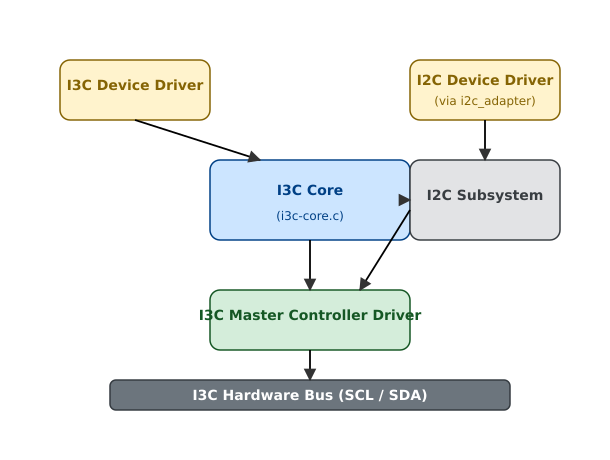

# Підсистема шини I3C (MIPI I3C) в Linux

<preknowlist>
- [Концепції ядра Linux](book:unix-linux/kernel-and-userspace) — базові поняття системних викликів та VFS.
</preknowlist>

Шина I3C (Improved Inter-Integrated Circuit), розроблена альянсом MIPI (Mobile Industry Processor Interface), є еволюційним розвитком класичної шини I2C. Вона була створена для подолання фундаментальних обмежень I2C (низька швидкість, високе енергоспоживання, необхідність додаткових ліній для переривань) та SPI (велика кількість сигнальних ліній), пропонуючи при цьому повну зворотну сумісність з існуючими I2C-пристроями. 

Підсистема I3C в ядрі Linux забезпечує уніфікований інтерфейс для розробки драйверів I3C-контролерів (master) та I3C-пристроїв (slave), керуючи складними аспектами протоколу, такими як динамічне призначення адрес, внутрішньосмугові переривання та узгодження швидкості.

## 1. Огляд технології MIPI I3C

MIPI I3C зберігає двопровідну топологію I2C (лінія даних SDA та лінія тактування SCL), але кардинально змінює електричні та протокольні характеристики, забезпечуючи значно вищу пропускну здатність та нові функціональні можливості.

### 1.1. Ключові особливості I3C

1.  **Динамічне призначення адрес (Dynamic Address Assignment - DAA):** На відміну від I2C, де адреси пристроїв є статичними (часто зашитими апаратно або встановленими за допомогою перемикачів), I3C дозволяє майстру динамічно призначати 7-бітні адреси пристроям під час ініціалізації шини. Це вирішує проблему конфлікту адрес.
2.  **Внутрішньосмугові переривання (In-Band Interrupts - IBI):** В I2C для переривань зазвичай потрібна додаткова виділена лінія (наприклад, GPIO). I3C дозволяє підлеглим пристроям генерувати переривання безпосередньо через лінії SDA/SCL, надсилаючи свою адресу на шину під час періоду очікування. Це економить кількість контактів.
3.  **Висока швидкість (High Data Rate - HDR):** Базовий режим I3C (SDR - Single Data Rate) працює на частоті до 12.5 МГц. Режими HDR дозволяють передавати дані з набагато вищою швидкістю, використовуючи обидва фронти тактового сигналу (DDR) або тернарне кодування.
4.  **Гаряче підключення (Hot-Join):** Пристрої можуть підключатися до шини I3C вже після того, як вона була ініціалізована. Вони генерують спеціальний сигнал Hot-Join (через механізм IBI), щоб повідомити майстра про свою присутність, після чого майстер проводить процедуру DAA для нового пристрою.
5.  **Зворотна сумісність з I2C:** На шині I3C можуть бути присутні класичні I2C-пристрої. Майстер I3C може спілкуватися з ними, використовуючи стандартний протокол I2C, хоча їх наявність може обмежувати використання деяких розширених функцій I3C на шині.
6.  **Загальні коди команд (Common Command Codes - CCC):** I3C визначає стандартизований набір команд, які майстер може розсилати всім пристроям (Broadcast) або конкретному пристрою (Direct). CCC використовуються для керування станом шини, конфігурації DAA, ввімкнення/вимкнення IBI тощо.

### 1.2. Стани пристрою на шині I3C

I3C-пристрій може перебувати в різних станах залежно від того, чи має він призначену динамічну адресу:

*   **Без динамічної адреси:** Пристрій щойно ввімкнений або підключився до шини (Hot-Join). Він відгукується лише на спеціальну адресу розсилки (`0x7E`) та бере участь у процедурі DAA.
*   **З динамічною адресою:** Пристрій отримав свою адресу від майстра. Він може повноцінно комунікувати на шині, ініціювати IBI та переходити в режими HDR.

Кожен I3C-пристрій має унікальний 48-бітний ідентифікатор (Provisional ID), який складається з ідентифікатора виробника (MIPI Manufacturer ID), ідентифікатора частини (Part ID) та ідентифікатора екземпляра. Цей ідентифікатор використовується під час процедури DAA для однозначної ідентифікації пристроїв. Крім того, пристрої можуть мати регістри BCR (Bus Characteristics Register) та DCR (Device Characteristics Register), що описують їхні можливості.

## 2. Архітектура підсистеми I3C в Linux

Підсистема I3C в ядрі Linux (розташована в `drivers/i3c/`) була додана в ядрі 4.20 і побудована навколо концепції майстер-контролерів, шин та пристроїв. Вона надає рівень абстракції, який приховує складнощі протоколу I3C від драйверів конкретних периферійних пристроїв.

### 2.1. Основні компоненти

Підсистема I3C складається з кількох ключових частин:

1.  **I3C Core (`i3c-core.c`):** Серце підсистеми. Реалізує логіку протоколу I3C: ініціалізацію шини, керування процедурою DAA, обробку Hot-Join та IBI, відправлення CCC-команд, а також керування життєвим циклом пристроїв та шин.
2.  **I3C Master Controllers (Майстер-контролери):** Драйвери апаратних контролерів I3C (наприклад, DesignWare I3C IP, Cadence I3C). Вони взаємодіють з апаратурою для відправлення/приймання даних, але логіка керування шиною делегується I3C Core.
3.  **I3C Device Drivers (Драйвери пристроїв):** Драйвери конкретних периферійних пристроїв (сенсорів, пам'яті тощо), що підключаються до шини I3C. Вони використовують API підсистеми (наприклад, `i3c_device_do_priv_xfers()`) для обміну даними зі своїм пристроєм.
4.  **I2C Сумісність:** Оскільки на шині I3C можуть бути I2C-пристрої, підсистема I3C тісно інтегрована з підсистемою I2C. Кожна шина I3C також реєструється як шина I2C (через адаптер `i2c_adapter`), що дозволяє стандартним I2C-драйверам працювати з пристроями, підключеними до I3C-майстра.

Рис. 1. *Загальна архітектура підсистеми I3C в Linux*


### 2.2. Основні структури даних

Ключові структури визначені у файлі `include/linux/i3c/master.h` (для контролерів) та `include/linux/i3c/device.h` (для драйверів пристроїв).

#### 2.2.1. `struct i3c_master_controller`

Ця структура представляє апаратний контролер I3C. Драйвер контролера виділяє цю структуру, заповнює вказівники на функції (ops) та реєструє її в I3C Core.

```c
struct i3c_master_controller {
	struct device dev;
	const struct i3c_master_controller_ops *ops;
	struct i3c_bus bus;
	/* Внутрішні поля I3C core */
};
```

Поле `ops` (структура `i3c_master_controller_ops`) містить вказівники на апаратно-залежні функції, які I3C Core викликає для виконання операцій:

```c
struct i3c_master_controller_ops {
	int (*bus_init)(struct i3c_master_controller *master);
	void (*bus_cleanup)(struct i3c_master_controller *master);
	int (*attach_i3c_dev)(struct i3c_dev_desc *dev);
	int (*reattach_i3c_dev)(struct i3c_dev_desc *dev, u8 old_dyn_addr);
	void (*detach_i3c_dev)(struct i3c_dev_desc *dev);
	int (*do_daa)(struct i3c_master_controller *master);
	int (*supports_ccc_cmd)(struct i3c_master_controller *master,
				const struct i3c_ccc_cmd *cmd);
	int (*send_ccc_cmd)(struct i3c_master_controller *master,
			    struct i3c_ccc_cmd *cmd);
	int (*priv_xfers)(struct i3c_dev_desc *dev,
			  struct i3c_priv_xfer *xfers,
			  int nxfers);
	int (*i2c_xfers)(struct i2c_dev_desc *dev,
			 const struct i2c_msg *xfers, int nxfers);
	int (*request_ibi)(struct i3c_dev_desc *dev,
			   const struct i3c_ibi_setup *req);
	void (*free_ibi)(struct i3c_dev_desc *dev);
	int (*enable_ibi)(struct i3c_dev_desc *dev);
	int (*disable_ibi)(struct i3c_dev_desc *dev);
	void (*recycle_ibi_slot)(struct i3c_dev_desc *dev,
				 struct i3c_ibi_slot *slot);
};
```

*   `bus_init`, `bus_cleanup`: Ініціалізація та очищення апаратного стану шини.
*   `attach_i3c_dev`, `detach_i3c_dev`: Викликаються ядром I3C, коли новий пристрій отримує адресу (attach) або видаляється з шини. Контролер може виділити тут власні апаратно-залежні структури для пристрою.
*   `do_daa`: Виконує процедуру DAA (ENTDAA). Деякі контролери виконують весь процес DAA апаратно, повертаючи ядру список знайдених пристроїв. Інші контролери виконують DAA програмно-апаратно (core надсилає CCC-команду, а контролер обробляє відповіді).
*   `send_ccc_cmd`: Відправка CCC (Common Command Code).
*   `priv_xfers`: Виконання приватних (Private) транзакцій I3C до певного пристрою (з уже призначеною динамічною адресою).
*   `i2c_xfers`: Виконання стандартних I2C-транзакцій.
*   `request_ibi`, `enable_ibi`: Налаштування та ввімкнення In-Band Interrupts для пристрою.

#### 2.2.2. `struct i3c_bus`

Представляє логічну шину I3C, пов'язану з майстром. Містить списки виявлених I3C та I2C пристроїв, поточну інформацію про шину (швидкості SCL) та режим роботи.

```c
struct i3c_bus {
	struct i3c_dev_desc *cur_master;
	int id;
	unsigned long addrslots[256 / BITS_PER_LONG];
	enum i3c_bus_mode mode;
	struct {
		unsigned long i3c;
		unsigned long i2c;
	} scl_rate;
	struct list_head devs;
};
```

Поле `mode` визначає режим роботи шини, що залежить від наявності I2C-пристроїв. Якщо на шині немає I2C-пристроїв, вона працює в режимі `I3C_BUS_MODE_PURE`. Якщо є I2C-пристрої, що підтримують фільтрацію сплесків 50нс (50ns spike filter), шина може працювати на швидкості I3C (до 12.5 МГц), але з деякими обмеженнями (режим Mixed Fast).

#### 2.2.3. `struct i3c_device` та `struct i3c_dev_desc`

`struct i3c_device` — це представлення пристрою для підсистеми драйверів пристроїв (використовується I3C-драйверами). Вона вбудовує стандартну `struct device`.

`struct i3c_dev_desc` — це внутрішнє представлення пристрою для підсистеми I3C Core та драйверів контролера. Вона містить інформацію про динамічну адресу, стаціонарну адресу (якщо є), Provisional ID, BCR, DCR, а також вказівник на `struct i3c_device`.

```c
struct i3c_dev_desc {
	struct i3c_device_info info; /* pid, bcr, dcr, dyn_addr, static_addr */
	struct i3c_device *dev;
	struct i3c_master_controller *master;
	/* ... */
};
```

#### 2.2.4. `struct i3c_driver`

Драйвери I3C-пристроїв реєструються за допомогою структури `i3c_driver`.

```c
struct i3c_driver {
	struct device_driver driver;
	int (*probe)(struct i3c_device *dev);
	void (*remove)(struct i3c_device *dev);
	const struct i3c_device_id *id_table;
};
```

`id_table` використовується для зіставлення драйвера з виявленим на шині пристроєм на основі його Provisional ID або DCR (Device Characteristics Register).

## 3. Життєвий цикл шини та пристроїв

В I3C-підсистемі життєвий цикл виявлення пристроїв значно складніший, ніж в I2C, оскільки адреси не обов'язково відомі заздалегідь (через Device Tree), а призначаються динамічно.

### 3.1. Ініціалізація шини

Коли завантажується драйвер I3C-контролера, він викликає `i3c_master_register()`. Це запускає процес ініціалізації шини (функція `i3c_master_bus_init()` в `i3c-core.c`).

1.  **Створення I2C адаптера:** Ядро реєструє `i2c_adapter`, пов'язаний з цим контролером.
2.  **Побудова таблиці I2C-пристроїв:** Ядро читає Device Tree (DT) вузла контролера і шукає всі дочірні вузли, які є I2C-пристроями (наприклад, мають властивість `compatible` та не мають I3C-специфічних властивостей на кшталт `assigned-address`). Ці пристрої додаються до списку відомих пристроїв.
3.  **Визначення режиму шини:** На основі швидкостей, вказаних в DT, та наявності I2C-пристроїв, I3C Core визначає, в якому режимі буде працювати шина (Pure I3C або Mixed).
4.  **Скидання I3C-пристроїв:** Майстер розсилає команду `RSTDAA` (Reset Dynamic Address Assignment) всім пристроям, змушуючи їх втратити поточні динамічні адреси та перейти в стан очікування DAA. Майстер також може розіслати `DISEC` для вимкнення IBI та Hot-Join на час ініціалізації.
5.  **Призначення адрес за замовчуванням (опціонально):** Деякі I3C-пристрої можуть мати статичні адреси (зашиті). Майстер може спробувати призначити динамічну адресу, рівну статичній, за допомогою команди `SETAASA` (Set All Addresses to Static Addresses).
6.  **Процедура DAA:** Майстер ініціює `ENTDAA` (Enter Dynamic Address Assignment). Це головний механізм виявлення I3C-пристроїв.

### 3.2. Динамічне призначення адрес (DAA)

Процедура DAA (команда `ENTDAA`) дозволяє майстру дізнатися про всі підключені I3C-пристрої та призначити їм унікальні динамічні адреси. Цей процес може виконуватися повністю апаратно контролером або логікою I3C Core (залежно від реалізації контролера).

1.  Майстер видає команду Broadcast `ENTDAA`.
2.  Всі I3C-пристрої, які не мають динамічної адреси, відповідають, відправляючи свій 48-бітний Provisional ID, BCR та DCR.
3.  Оскільки на шині можуть відповідати кілька пристроїв одночасно, I3C використовує механізм арбітражу на основі відкритого стоку (Open Drain). Пристрій, чий біт Provisional ID дорівнює '0' у певній позиції, перемагає пристрій з бітом '1'. (Подібно до арбітражу в CAN або I2C мультимайстер).
4.  Переможець (пристрій з найменшим Provisional ID) успішно передає всі свої дані майстру. Усі інші пристрої, програвши арбітраж, припиняють передачу і чекають наступного раунду.
5.  Отримавши PID переможця, майстер призначає йому 7-бітну динамічну адресу (Dynamic Address) на шині. Цей пристрій вважається "прикріпленим" і більше не бере участі в поточній процедурі `ENTDAA`.
6.  Майстер продовжує видавати цикли призначення адрес в рамках поточної транзакції `ENTDAA`. Ті пристрої, що залишилися, знову борються в арбітражі.
7.  Процес повторюється, доки на шині не залишиться пристроїв без адреси (ніхто не відповідає на запит майстра).

В Linux, після успішного DAA, I3C Core створює структуру `i3c_device` для кожного виявленого пристрою, порівнює його PID з описами у Device Tree (щоб знайти специфічні налаштування або прив'язати драйвер) і реєструє пристрій у моделі драйверів (Driver Model). Якщо для цього пристрою завантажено відповідний `i3c_driver`, викликається його функція `probe()`.

Рис. 2. *Процедура Dynamic Address Assignment (ENTDAA)*


### 3.3. In-Band Interrupts (IBI) та Hot-Join

I3C дозволяє підлеглим пристроям асинхронно ініціювати зв'язок з майстром, коли шина вільна (стан START).

Коли пристрій хоче надіслати переривання, він генерує умову START і починає передавати свою динамічну адресу. Майстер розпізнає це і генерує тактовий сигнал (SCL). Якщо два пристрої одночасно генерують IBI, відбувається арбітраж адреси (менша адреса перемагає, отже, пристрої з меншою адресою мають вищий пріоритет переривань).
Після того, як майстер підтверджує (ACK) адресу пристрою, пристрій може опціонально передати додатковий байт даних, що вказує причину переривання (Mandatory Data Byte, MDB).
В Linux, драйвер пристрою реєструє обробник IBI за допомогою функції `i3c_device_request_ibi()`. Коли контролер отримує IBI від пристрою, I3C Core викликає цей зареєстрований обробник у контексті робочої черги або tasklet-а.

**Hot-Join** — це особливий тип IBI. Коли новий пристрій підключається до шини (або "прокидається"), він генерує START і відправляє зарезервовану адресу розсилки (`0x02` за специфікацією I3C v1.0). Майстер розпізнає цей запит Hot-Join. В I3C підсистемі Linux обробка Hot-Join зазвичай реалізована так: ядро I3C Core планує виконання робочого потоку (workqueue), який ініціює нову процедуру DAA (`ENTDAA`) для пошуку нових пристроїв на шині та призначення їм адрес.

## 4. Написання драйвера I3C-пристрою

Написання драйвера для I3C-пристрою в Linux дуже схоже на написання драйвера I2C або SPI.

### 4.1. Реєстрація драйвера

Драйвер визначає масив `i3c_device_id` та структуру `i3c_driver`.

```c
#include <linux/i3c/device.h>
#include <linux/module.h>

static const struct i3c_device_id my_i3c_sensor_id[] = {
	/* Зіставлення за 48-бітним Provisional ID (PID)
	 * MIPI_MANUF_ID(0x123), PART_ID(0x456)
	 */
	I3C_DEVICE(0x123, 0x456, NULL),
	{ /* масив має закінчуватися нулями */ }
};
MODULE_DEVICE_TABLE(i3c, my_i3c_sensor_id);

static struct i3c_driver my_i3c_sensor_driver = {
	.driver = {
		.name = "my_i3c_sensor",
	},
	.probe = my_i3c_sensor_probe,
	.remove = my_i3c_sensor_remove,
	.id_table = my_i3c_sensor_id,
};
module_i3c_driver(my_i3c_sensor_driver);
```

### 4.2. Функція Probe та передача даних

У функції `probe()` драйвер ініціалізує пристрій. Для комунікації з пристроєм використовується API `i3c_device_do_priv_xfers()`, яке дозволяє виконувати приватні (Private) транзакції I3C.

Приватна транзакція — це комунікація, спрямована на конкретну динамічну адресу. Вона складається зі структури `i3c_priv_xfer`, яка визначає напрямок (читання чи запис) та буфер даних.

```c
static int my_i3c_sensor_read_reg(struct i3c_device *i3cdev, u8 reg, u8 *val)
{
	struct i3c_priv_xfer xfers[2];
	int ret;

	/* Налаштування транзакції запису (передача адреси регістра) */
	xfers[0].rnw = false; // Запис
	xfers[0].len = 1;
	xfers[0].data.out = &reg;

	/* Налаштування транзакції читання (отримання значення) */
	xfers[1].rnw = true;  // Читання
	xfers[1].len = 1;
	xfers[1].data.in = val;

	/* Виконання транзакцій. Вони будуть надіслані одна за одною 
	 * (можливо, з Restart між ними, залежно від контролера) */
	ret = i3c_device_do_priv_xfers(i3cdev, xfers, 2);
	if (ret < 0)
		return ret;

	return 0;
}

static int my_i3c_sensor_probe(struct i3c_device *i3cdev)
{
	u8 dev_id;
	int ret;

	/* Читаємо якийсь ідентифікаційний регістр сенсора */
	ret = my_i3c_sensor_read_reg(i3cdev, 0x00, &dev_id);
	if (ret)
		return ret;

	dev_info(&i3cdev->dev, "Found sensor with ID: 0x%02x\n", dev_id);

	/* Можна також прочитати BCR (Bus Characteristics) та 
	 * DCR (Device Characteristics) пристрою, що були отримані 
	 * I3C Core під час DAA */
	const struct i3c_device_info *info = i3c_device_get_info(i3cdev);
	dev_info(&i3cdev->dev, "BCR: 0x%02x, DCR: 0x%02x\n", info->bcr, info->dcr);

	/* Збереження приватних даних драйвера */
	/* i3cdev_set_drvdata(i3cdev, my_priv_data); */

	return 0;
}
```

### 4.3. Обробка In-Band Interrupts (IBI)

Якщо пристрій (або його BCR) вказує на підтримку IBI, драйвер може запитати їх у I3C Core.

```c
static void my_sensor_ibi_handler(struct i3c_device *i3cdev,
				  const struct i3c_ibi_payload *payload)
{
	/* Обробка переривання. Payload містить Mandatory Data Byte, 
	 * якщо пристрій його надсилає. */
	if (payload->len > 0)
		dev_dbg(&i3cdev->dev, "IBI data: 0x%02x\n", ((u8 *)payload->data)[0]);
	
	/* Планування обробки переривання (наприклад, через workqueue),
	 * оскільки цей обробник може викликатися в атомарному контексті. */
}

static int my_sensor_setup_ibi(struct i3c_device *i3cdev)
{
	struct i3c_ibi_setup req = {
		.max_payload_len = 1,      /* Розмір корисного навантаження (MDB) */
		.num_slots = 4,            /* Кількість слотів у кільцевому буфері (залежить від контролера) */
		.handler = my_sensor_ibi_handler, /* Вказівник на функцію-обробник */
	};
	int ret;

	/* Запит IBI у підсистеми */
	ret = i3c_device_request_ibi(i3cdev, &req);
	if (ret)
		return ret;

	/* Ввімкнення IBI. Це надішле CCC команду ENEC пристрою 
	 * та налаштує контролер на прийом IBI. */
	ret = i3c_device_enable_ibi(i3cdev);
	if (ret) {
		i3c_device_free_ibi(i3cdev);
		return ret;
	}

	return 0;
}
```

Ядро I3C автоматично генерує команду CCC `ENEC` (Enable Events Command) або `DISEC` (Disable Events Command), коли драйвер пристрою вмикає або вимикає IBI, щоб проінформувати підлеглий пристрій про зміну статусу переривань.

## 5. Підсумки

Підсистема I3C в Linux надає сучасний і гнучкий інфраструктурний рівень для підтримки новітніх інтерфейсів підключення периферії. Завдяки абстракції складнощів протоколу, таких як DAA, IBI та арбітраж, написання драйверів I3C-пристроїв залишається простим та інтуїтивно зрозумілим, подібно до I2C, але з доступом до розширених можливостей (більша швидкість, динамічна адресація, переривання без додаткових пінів). Інтеграція з підсистемою I2C гарантує безболісний перехід та сумісність зі старими пристроями на одній апаратній шині.
