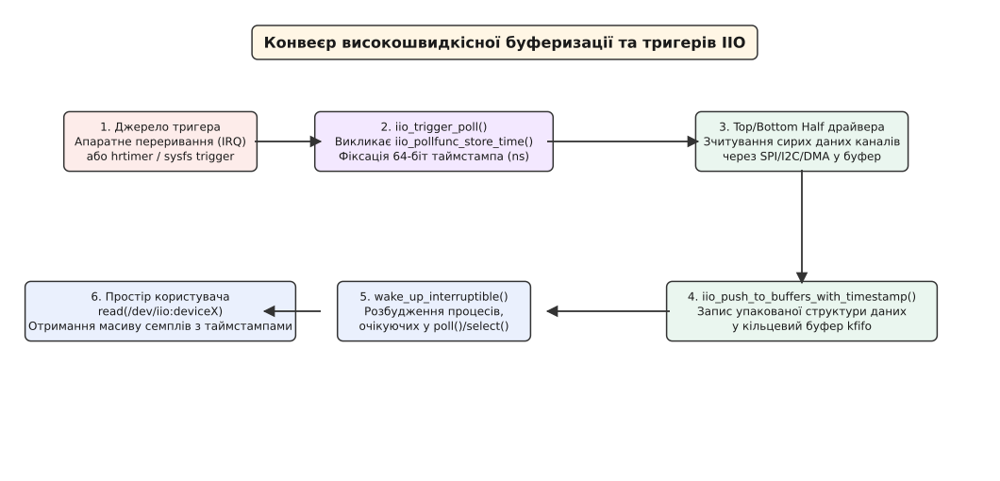

# Підсистема Industrial I/O (IIO) для аналогових сенсорів та ADC/DAC

<preknowlist>
- [Характерні та блочні пристрої](book:unix-linux/character-and-block-devices) — відмінності між символьними та блочними пристроями Linux, роль `dev_t` та VFS.
- [Модель пристроїв Linux](book:unix-linux/device-file-model) — поняття `struct device`, підсистема sysfs та прив'язка пристроїв до шин I2C/SPI.
</preknowlist>

Коли до вбудованої системи під'єднують аналого-цифровий перетворювач (АЦП), цифро-аналоговий перетворювач (ЦАП), 3D-акселерометр, гіроскоп чи термопару, фізичний світ перестає бути набором дискретних подій і перетворюється на безперервний потік напруг та фізичних сигналів, що змінюються у часі. На відміну від клавіатури чи накопичувача, де дані надходять у відповідь на дії користувача або у вигляді блоків фіксованого розміру, аналогові сенсори вимагають безперервного вимірювання із суворим дотриманням частоти дискретизації та точним збереженням часових міток. До появи підсистеми Industrial I/O (IIO) у ядрі Linux не існувало єдиної архітектурної моделі для обробки аналогових пристроїв такого класу.

## 1. Проблема: Чому з'явилася підсистема IIO

У ранніх версіях ядра Linux (до версії 2.6.35, близько 2009 року) розробники драйверів аналогового заліза змушені були обирати між двома існуючими підсистемами ядра, жодна з яких не відповідала фізичній природі аналогового сигналу:

1. **Підсистема Hardware Monitoring (`hwmon`)**: створювалася виключно для повільного моніторингу стану материнських плат (температура процесора, напруга ліній живлення, швидкість обертання вентиляторів). Вона базується на поодинокому опитуванні текстових атрибутів sysfs. У `hwmon` повністю відсутні концепції кільцевих буферів (ring buffer), апаратних тригерів, синхронного багатоканального захоплення або високих частот дискретизації (наприклад, 10–100 кГц для аналізу вібрацій, акустики чи осцилографії).
2. **Підсистема Input (`input`)**: розроблялася для пристроїв людського інтерфейсу (миші, клавіатури, джойстики, тачскріни). Спроба адаптувати високочастотний акселерометр або інерційний модуль (IMU) під підсистему input змушувала драйвер транслювати фізичні виміри у події `EV_ABS`. Це призводило до втрати інформації про фізичні одиниці вимірювання (Вольти, Паскалі, Люкси, м/с²), унеможливлювало налаштування підсилення (gain) чи роздільної здатності АЦП, і генерувало велетенський оверхед ядра на обробку подій підсистеми input для кожного семпла.

Альтернативою була розробка власних приватних символьних пристроїв (`/dev/custom_adc`), де кожен виробник вигадував власний набір системних викликів `ioctl()`. Це призводило до архітектурної фрагментації: додаток для аналізу стану обладнання, написаний під один чип АЦП, не міг працювати з іншим без повного переписання коду простору користувача.

У 2009 році розробник ядра Джонатан Камерон (Jonathan Cameron) створив підсистему **Industrial I/O (IIO)**. Вона об'єднала три фундаментальні потреби аналогового заліза:
- **Стандартизований sysfs ABI** для зчитування поодиноких вимірів та налаштування метаданих (масштаб, зсув, частота дискретизації);
- **Потокову буферизовану передачу даних** через символьний пристрій `/dev/iio:deviceX` із підтримкою `kfifo` та апаратного DMA;
- **Підсистему тригерів та асинхронних подій** для синхронізації збору даних та обробки критичних порогів (перевантаження, вільне падіння, вихід напруги за межі).

| Архітектурний критерій | Підсистема `hwmon` | Підсистема `input` | Підсистема `IIO` |
| :--- | :--- | :--- | :--- |
| **Основне призначення** | Моніторинг плат/процесорів | Пристрої введення (HMI) | Аналогові сенсори, АЦП/ЦАП, IMU |
| **Формат даних у просторі користувача** | Текст у sysfs | Бінарні події `input_event` | Текст у sysfs + бінарний `/dev/iio:deviceX` |
| **Частота дискретизації** | Низька (< 10 Гц) | Середня (50–200 Гц) | Висока (до багатьох МГц через DMA) |
| **Калібрувальні метадані** | Відсутні / обмежені | Відсутні | Стандартизовані (`scale`, `offset`) |
| **Одиниці вимірювання SI** | Не суворі | Відсутні (абстрактні осі) | Суворі одиниці SI (мВ, м/с², rad/s, kPa) |
| **Підсистема тригерів** | Відсутня | Відсутня | Апаратні/програмні тригери ядра |


*Рис. 1. Архітектурне розділення підсистеми IIO між простором користувача, sysfs, символьним пристроєм, IIO Core та апаратурою.*

## 2. Архітектурне ядро та ключові структури ядра

Центральним елементом підсистеми є структура `struct iio_dev`, яка представляє один фізичний або віртуальний пристрій IIO в пам'яті ядра Linux.

### Структура `iio_dev` та життєвий цикл пристрою

Драйвер ядра не створює `struct iio_dev` вручну на стеку чи через прямий виклик `kmalloc()`. Замість цього використовується функція керованого виділення ресурсів `devm_iio_device_alloc()`:

```c
struct my_adc_priv {
    struct spi_device *spi;
    struct regmap *regmap;
    struct mutex lock;
    uint16_t buffer[8];
};

struct iio_dev *indio_dev;
struct my_adc_priv *priv;

// Виділення єдиного блоку пам'яті для iio_dev та приватного контексту
indio_dev = devm_iio_device_alloc(&spi->dev, sizeof(*priv));
if (!indio_dev)
    return -ENOMEM;

priv = iio_priv(indio_dev);
priv->spi = spi;
mutex_init(&priv->lock);
```

Функція `devm_iio_device_alloc()` виділяє єдиний неперервний блок пам'яті, який містить як саму структуру `iio_dev`, так і приватний контекст драйвера (`priv`), доступ до якого здійснюється через вказівник `iio_priv(indio_dev)`. Концепція `devm_` автоматично звільняє виділену пам'ять при відвантаженні драйвера або вилученні пристрою з шини.

Ключові поля структури `struct iio_dev`:
- `name`: текстова назва пристрою (наприклад, `"ads1115"` або `"mpu6050"`), яка експортується у sysfs-атрибут `/sys/bus/iio/devices/iio:deviceX/name`.
- `modes`: бітова маска підтримуваних режимів роботи пристрою (`INDIO_DIRECT_MODE` для sysfs, `INDIO_BUFFER_TRIGGERED` для буферизації через тригер, `INDIO_BUFFER_HARDWARE` для апаратного DMA-буфера).
- `channels`: вказівник на масив структур `struct iio_chan_spec`, що описують аналогові канали сенсора.
- `num_channels`: кількість елементів у масиві каналів.
- `info`: вказівник на структуру `struct iio_info`, яка містить таблицю колбек-функцій для обробки викликів sysfs.

Після ініціалізації всіх полів драйвер реєструє пристрій викликаючи `devm_iio_device_register(&spi->dev, indio_dev)`.

### Режими роботи підсистеми IIO (`modes`)

Ядро розрізняє чотири основні режими роботи пристрою IIO, які комбінуються в бітовій масці `modes`:

1. `INDIO_DIRECT_MODE`: Поодиноке читання та запис через атрибути sysfs (`read_raw`/`write_raw`). Активний за замовчуванням при старті пристрою.
2. `INDIO_BUFFER_TRIGGERED`: Потокова буферизація, яка керується тригером підсистеми IIO (`iio_trigger`). При спрацьовуванні тригера драйвер зчитує активні канали у кільцеву чергу `kfifo`.
3. `INDIO_BUFFER_HARDWARE`: Апаратна потокова буферизація. Сенсор або контролер шини мають власні апаратні буфери FIFO або контролер DMA, який самостійно заповнює сторінки RAM без участі програмних тригерів ядра.
4. `INDIO_EVENT_BIT`: Апаратна або програмна обробка асинхронних подій та порогів.

### Таблиця колбеків `struct iio_info`

Всі операції зчитування та запису атрибутів sysfs адресуються ядром через функціональні вказівники у структурі `struct iio_info`:

```c
static const struct iio_info my_adc_info = {
    .read_raw = my_adc_read_raw,
    .write_raw = my_adc_write_raw,
    .read_event_config = my_adc_read_event_config,
    .write_event_config = my_adc_write_event_config,
};
```

Головною функцією обслуговування sysfs є `read_raw()`. Вона викликається ядром, коли простір користувача читає файл виду `in_voltage0_raw` або `in_voltage0_scale`:

```c
static int my_adc_read_raw(struct iio_dev *indio_dev,
                           struct iio_chan_spec const *chan,
                           int *val, int *val2, long mask)
{
    struct my_adc_priv *priv = iio_priv(indio_dev);

    switch (mask) {
    case IIO_CHAN_INFO_RAW:
        mutex_lock(&priv->lock);
        *val = my_adc_hardware_read(priv, chan->channel);
        mutex_unlock(&priv->lock);
        return IIO_VAL_INT;

    case IIO_CHAN_INFO_SCALE:
        // Масштаб 0.805664 мВ (для 12-біт АЦП при 3.3 В опорної напруги)
        *val = 0;
        *val2 = 805664;
        return IIO_VAL_INT_PLUS_MICRO;

    case IIO_CHAN_INFO_OFFSET:
        *val = -100; // Апаратний зсув нуля
        return IIO_VAL_INT;

    default:
        return -EINVAL;
    }
}
```

Параметр `mask` вказує, який саме атрибут запитується простором користувача. Тип повернення функції повідомляє ядру, як інтерпретувати значення у змінних `val` та `val2`:
- `IIO_VAL_INT`: значення повертається як одне ціле число у змінній `*val`.
- `IIO_VAL_INT_PLUS_MICRO`: підсумкове дробове значення дорівнює `*val + *val2 / 1000000`. Ядро форматує його у sysfs як текстовий дріб (наприклад, `0.805664`).
- `IIO_VAL_INT_PLUS_NANO`: підсумкове значення дорівнює `*val + *val2 / 1000000000`.
- `IIO_VAL_FRACTIONAL_LOG2`: значення розраховується за формулою `*val / 2^*val2` (зручно для показу кроку АЦП з роздільністю `*val2` біт).

Для вихідних каналів цифро-аналогових перетворювачів (ЦАП / DAC) драйвер реалізує функцію `write_raw()`. Коли простір користувача записує значення у sysfs-атрибут `out_voltage0_raw`, ядро передає записане число у `write_raw()`, де драйвер конвертує його у командах для шини SPI або I2C і передає на вихідні ніжки чипа ЦАП.

### Опис аналогових каналів через `struct iio_chan_spec`

Кожен аналоговий канал пристрою (напруга, струм, вісь прискорення, температура) описується структурою `struct iio_chan_spec`:

```c
static const struct iio_chan_spec my_adc_channels[] = {
    {
        .type = IIO_VOLTAGE,
        .indexed = 1,
        .channel = 0,
        .info_mask_separate = BIT(IIO_CHAN_INFO_RAW) | BIT(IIO_CHAN_INFO_SCALE) | BIT(IIO_CHAN_INFO_OFFSET),
        .scan_index = 0,
        .scan_type = {
            .sign = 'u',
            .realbits = 12,
            .storagebits = 16,
            .shift = 0,
            .endianness = IIO_LE,
        },
    },
    {
        .type = IIO_VOLTAGE,
        .indexed = 1,
        .channel = 1,
        .info_mask_separate = BIT(IIO_CHAN_INFO_RAW) | BIT(IIO_CHAN_INFO_SCALE) | BIT(IIO_CHAN_INFO_OFFSET),
        .scan_index = 1,
        .scan_type = {
            .sign = 'u',
            .realbits = 12,
            .storagebits = 16,
            .shift = 0,
            .endianness = IIO_LE,
        },
    },
    IIO_CHAN_SOFT_TIMESTAMP(2),
};
```

Поля масок `info_mask_separate`, `info_mask_shared_by_type` та `info_mask_shared_by_dir` визначають, які саме файли sysfs генеруються ядром автоматично:
- `info_mask_separate`: маска атрибутів, індивідуальних для кожного каналу (`in_voltage0_raw`, `in_voltage1_raw`).
- `info_mask_shared_by_type`: маска атрибутів, спільних для всіх каналів одного типу (наприклад, `in_sampling_frequency` для всіх осей акселерометра).
- `info_mask_shared_by_dir`: атрибути, спільні для всіх вхідних або вихідних каналів.

Повний перелік правил найменування sysfs-файлів та одиниць SI наведено у довіднику `[Sysfs ABI та файлова поверхня підсистеми IIO](book:unix-linux/iio-industrial-io-subsystem/api-iio-sysfs-abi.md)`.

## 3. Потокова буферизація та тригери (Triggered Buffers)

Опитування sysfs-файлів розроблене для повільних операцій (читання температури раз на секунду). Якщо спробувати зчитати 1000 семплів на секунду через `read_raw()`, системні витрати на виклики `open()`, `read()`, переключення контексту користувач/ядро та парсинг текстових рядків `sprintf`/`sscanf` завантажать процесор на 100%.

Для високошвидкісного збору даних IIO використовує **Triggered Buffers** (тригери та кільцеві буфери).


*Рис. 2. Послідовність передачі семплів від апаратного переривання через тригер і kfifo до виклику read() у просторі користувача.*

### Поняття IIO Trigger

**IIO Trigger** (`struct iio_trigger`) — це подія, яка повідомляє драйверу: «настав час зняти семпл з усіх активних каналів».

Джерела тригерів бувають трьох основних типів:
1. **Апаратний тригер (Hardware IRQ)**: лінія `DATA_READY` від датчика або вихід таймера мікроконтролера, підключений до лінії переривання SoC.
2. **Програмний таймер (hrtimer trigger)**: високонадійний таймер ядра Linux, який генерує тригери з заданою частотою (наприклад, 500 Гц).
3. **Sysfs тригер (sysfs trigger)**: тригер, що ініціюється викликом `echo 1 > /sys/bus/iio/devices/triggerX/trigger_now` з простору користувача.

### Каскад обробки у буферизованому режимі

При використанні тригерного буфера підсистема IIO підключає обробник переривання `iio_pollfunc_store_time()`:

1. **Top-Half переривання**: коли спрацьовує лінія IRQ тригера, ядро викликає `iio_trigger_poll()`.
2. **Фіксація часу**: `iio_pollfunc_store_time()` миттєво фіксує системний таймстамп (`ktime_get_boottime_ns()`) у наносекундах. Це мінімізує фазове тремтіння (jitter).
3. **Bottom-Half (Threaded IRQ)**: запускається потоковий обробник драйвера `my_adc_trigger_handler()`. Він виконує пакетне зчитування сирих даних активних каналів через шину SPI або I2C.
4. **Упаковка бінарного кадру**: драйвер формує в оперативній пам'яті бінарну структуру, куди входять вирівняні семпли ввімкнених каналів та 64-бітний таймстамп.
5. **Пуш у kfifo**: драйвер викликає `iio_push_to_buffers_with_timestamp(indio_dev, data, timestamp)`.
6. **Сигналізація VFS**: ядро розміщує кадр у кільцевому буфері `kfifo` і викликає `wake_up_interruptible()`, розбуджуючи додатки простору користувача, які чекають у виклику `poll()` або `read()` на дескрипторі `/dev/iio:deviceX`.

Для реєстрації підтримки тригерних буферів у коді драйвера використовується помічник `devm_iio_triggered_buffer_setup()`:

```c
ret = devm_iio_triggered_buffer_setup(&spi->dev, indio_dev,
                                      iio_pollfunc_store_time,
                                      my_adc_trigger_handler,
                                      NULL);
```

Параметри бінарного упакування задаються у полі `scan_type` структури `iio_chan_spec`:
- `realbits`: ефективна роздільна здатність АЦП (наприклад, 12 біт).
- `storagebits`: розмір контейнера в пам'яті (наприклад, 16 біт).
- `shift`: зміщення корисних бітів всередині контейнера.
- `endianness`: порядок байтів (`IIO_LE` для Little-Endian, `IIO_BE` для Big-Endian).

## 4. Підсистема асинхронних подій (IIO Events)

Деякі сенсори повинні сповіщати систему про виняткові ситуації без постійної буферизації. Наприклад, акселерометр ноутбука повинен видати переривання при виявленні вільного падіння (для парковки головок жорсткого диска), або датчик тиску повинен попередити про критичний стрибок.

Для цього використовується підсистема **IIO Events**:

```c
struct iio_event_spec my_events[] = {
    {
        .type = IIO_EV_TYPE_THRESH,
        .dir = IIO_EV_DIR_RISING,
        .mask_separate = BIT(IIO_EV_INFO_VALUE) | BIT(IIO_EV_INFO_ENABLE),
    },
};
```

Коли датчик виявляє перевищення порогу, драйвер генерує подію в ядрі:

```c
iio_push_event(indio_dev,
               IIO_UNMOD_EVENT_CODE(IIO_VOLTAGE, 0,
                                    IIO_EV_TYPE_THRESH,
                                    IIO_EV_DIR_RISING),
               iio_get_time_ns(indio_dev));
```

Додаток простору користувача отримує спеціальний анонімний файловий дескриптор подій через `ioctl`:

```c
int event_fd;
ioctl(dev_fd, IIO_GET_EVENT_FD_IOCTL, &event_fd);
```

Після цього додаток виконує блокуючий виклик `read(event_fd, &event_data, sizeof(event_data))`, зчитуючи структуру `struct iio_event_data`:

```c
struct iio_event_data {
    uint64_t id;        // Тип події та канал
    int64_t timestamp;  // Час події в наносекундах
};
```

## 5. Практична математика перетворення та sysfs walkthrough

Розглянемо практичний процес зчитування та обчислення фізичних величин на прикладі 12-бітного АЦП та 3D-акселерометра.

### Приклад 1: Обчислення напруги АЦП

У каталозі `/sys/bus/iio/devices/iio:device0/` присутні атрибути:
- `in_voltage0_raw` → повертає `2480`;
- `in_voltage0_offset` → повертає `-100`;
- `in_voltage0_scale` → повертає `0.8056640625`.

Формула перетворення:

```
Physical_Value = (RAW + OFFSET) * SCALE
```

Здійснимо покрокове обчислення у просторі користувача:

```
Покроковий розрахунок напруги для каналу in_voltage0:
1. RAW відлік АЦП               = 2480
2. Зсув нуля (OFFSET)            = -100
3. Скоригований відлік (RAW+OFF) = 2480 + (-100) = 2380
4. Масштаб (SCALE)               = 0.8056640625  [мілівольти / count]
5. Фізична напруга              = 2380 * 0.8056640625
                                 = 1917.48046875 мВ
                                 ≈ 1.9175 В
```

### Приклад 2: Обчислення прискорення акселерометра

Для 16-бітного акселерометра по осі X експортуються атрибути:
- `in_accel_x_raw` → повертає `16384`;
- `in_accel_scale` → повертає `0.000598550415` (що відповідає чутливості ±2g).

```
Покроковий розрахунок лінійного прискорення по осі X:
1. RAW відлік акселерометра     = 16384
2. Зсув нуля (OFFSET)            = 0
3. Скоригований відлік           = 16384
4. Масштаб (SCALE)               = 0.000598550415  [м/с² / count]
5. Лінійне прискорення          = 16384 * 0.000598550415
                                 = 9.80665 м/с²  (дорівнює 1.0 g)
```

Значення `SCALE` за специфікацією IIO ABI завжди переводить скоригований відлік у стандартні одиниці SI (в даному випадку для `voltage` це мілівольти, а для `accel` — метри за секунду в квадраті).

## 6. Приклади коду: Клієнтський додаток простору користувача

Розглянемо реалізацію програми для зчитування потокових буферизованих даних з пристрою `/dev/iio:device0`.

Програма конфігурує буфер sysfs, вмикає канали напруги та таймстампа, після чого виконує читання бінарних кадрів.

:::tabs
```c
#include <stdio.h>
#include <stdlib.h>
#include <fcntl.h>
#include <unistd.h>
#include <stdint.h>
#include <sys/poll.h>

#define DEV_NODE "/dev/iio:device0"

// Бінарна структура кадру, що відповідає scan_type драйвера
struct __attribute__((packed)) iio_adc_frame {
    uint16_t raw_val;
    uint16_t pad[3];    // Паддінг для вирівнювання 64-бітного таймстампа
    int64_t timestamp;  // Таймстамп ядра у наносекундах
};

int main(void) {
    int fd = open(DEV_NODE, O_RDONLY);
    if (fd < 0) {
        perror("Не вдалося відкрити " DEV_NODE);
        return EXIT_FAILURE;
    }

    struct pollfd pfd = { .fd = fd, .events = POLLIN };
    struct iio_adc_frame frame;

    printf("Очікування потокових даних від IIO...\n");
    for (int i = 0; i < 5; ++i) {
        int ret = poll(&pfd, 1, 3000);
        if (ret > 0 && (pfd.revents & POLLIN)) {
            ssize_t len = read(fd, &frame, sizeof(frame));
            if (len == sizeof(frame)) {
                printf("Семпл [%d]: RAW = %5u | Time = %lld ns\n",
                       i, frame.raw_val, (long long)frame.timestamp);
            }
        }
    }

    close(fd);
    return EXIT_SUCCESS;
}
```
```cpp
#include <iostream>
#include <fstream>
#include <string>
#include <vector>
#include <filesystem>
#include <chrono>
#include <expected>
#include <system_error>
#include <fcntl.h>
#include <unistd.h>
#include <sys/poll.h>

namespace fs = std::filesystem;

class IIOBufferReader {
private:
    int dev_fd_ = -1;
    fs::path sysfs_dev_;
    fs::path dev_node_;

    std::expected<void, std::error_code> sysfs_write(const std::string& subpath, const std::string& value) {
        std::ofstream ofs(sysfs_dev_ / subpath);
        if (!ofs.is_open()) {
            return std::unexpected(std::make_error_code(std::errc::no_such_file_or_directory));
        }
        ofs << value << std::endl;
        return ofs.good() ? std::expected<void, std::error_code>{} 
                          : std::unexpected(std::make_error_code(std::errc::io_error));
    }

public:
    struct alignas(8) Frame {
        uint16_t raw_value;
        uint16_t padding[3];
        int64_t timestamp_ns;
    };

    explicit IIOBufferReader(std::string_view dev_name = "iio:device0")
        : sysfs_dev_("/sys/bus/iio/devices" / fs::path(dev_name)),
          dev_node_("/dev" / fs::path(dev_name)) {}

    ~IIOBufferReader() {
        stop();
        if (dev_fd_ >= 0) ::close(dev_fd_);
    }

    std::expected<void, std::error_code> start(std::size_t buffer_depth = 128) {
        (void)sysfs_write("buffer/enable", "0");
        if (auto r = sysfs_write("scan_elements/in_voltage0_en", "1"); !r) return r;
        if (auto r = sysfs_write("scan_elements/in_timestamp_en", "1"); !r) return r;
        if (auto r = sysfs_write("buffer/length", std::to_string(buffer_depth)); !r) return r;
        if (auto r = sysfs_write("buffer/enable", "1"); !r) return r;

        dev_fd_ = ::open(dev_node_.c_str(), O_RDONLY);
        if (dev_fd_ < 0) {
            return std::unexpected(std::make_error_code(static_cast<std::errc>(errno)));
        }
        return {};
    }

    void stop() noexcept {
        (void)sysfs_write("buffer/enable", "0");
    }

    std::expected<Frame, std::error_code> read_frame(int timeout_ms = 2000) {
        if (dev_fd_ < 0) return std::unexpected(std::make_error_code(std::errc::bad_file_descriptor));

        ::pollfd pfd{ .fd = dev_fd_, .events = POLLIN, .revents = 0 };
        int ret = ::poll(&pfd, 1, timeout_ms);
        if (ret == 0) return std::unexpected(std::make_error_code(std::errc::timed_out));
        if (ret < 0)  return std::unexpected(std::make_error_code(static_cast<std::errc>(errno)));

        Frame frame{};
        ssize_t bytes = ::read(dev_fd_, &frame, sizeof(frame));
        if (bytes != sizeof(frame)) {
            return std::unexpected(std::make_error_code(std::errc::io_error));
        }
        return frame;
    }
};

int main() {
    IIOBufferReader reader("iio:device0");

    if (auto res = reader.start(128); !res) {
        std::cerr << "Не вдалося ініціалізувати буфер IIO\n";
        return 1;
    }

    std::cout << "Читання 5 семплів у С++23...\n";
    for (int i = 0; i < 5; ++i) {
        auto frame_res = reader.read_frame();
        if (frame_res) {
            const auto& f = frame_res.value();
            std::cout << "Семпл [" << i << "]: RAW = " << f.raw_value 
                      << " | Time = " << f.timestamp_ns << " ns\n";
        }
    }
    return 0;
}
```
:::

Повний практичний проект із детальною інструкцією збірки знаходиться у вставці `[Практичний проект: зчитування даних IIO у просторі користувача](book:unix-linux/iio-industrial-io-subsystem/proj-iio-user-reader.md)`.

## 7. Крайові випадки, збої та оптимальні конфігурації

Під час використання IIO у реальних серійних вбудованих системах виникає низка критичних нюансів продуктивності та надійності:

### 1. Переповнення буфера (Buffer Overrun)
Якщо простір користувача не встигає зчитувати дані з `/dev/iio:deviceX`, кільцевий буфер `kfifo` переповнюється. Драйвер IIO скидає найстаріші семпли, а у системному логу ядра `dmesg` з'являються повідомлення про переповнення.
- **Рішення**: Збільшення параметра `buffer/length` (наприклад, з 64 до 1024 семплів) та використання налаштування `buffer/watermark`. Налаштування watermark дозволяє розбуджувати процес у `poll()` не на кожен окремий семпл, а лише тоді, коли в буфері накопичилося, наприклад, 32 або 64 семпли. Це на порядок зменшує кількість переключень контексту CPU.

### 2. Паддінг та вирівнювання даних у бінарному кадрі (Memory Alignment)
Архітектура ядра Linux вимагає, щоб 64-бітний таймстамп (`int64_t`) був вирівняний у пам'яті по 8-байтній межі. 
Якщо драйвер передає три 16-бітних канали (6 байт), ядро автоматично додає 2 байти вирівнювального падінгу перед таймстампом, роблячи загальний розмір кадру 16 байт.
- **Помилка розробника**: спроба прочитати кадр як щільну структуру без урахування `padding`. Завжди перевіряйте розшифровку у `scan_elements/in_channel_type` та порядок індексів у `scan_elements/in_channel_index`.

### 3. Синхронізація годинників та дрейф часу (Clock Drift)
За замовчуванням IIO використовує таймстампи `CLOCK_BOOTTIME` або `CLOCK_MONOTONIC`. Якщо системний час коригується через NTP або PTP (IEEE 1588), між апаратним часом збору даних та системним годинником може виникати дрейф.
- **Рішення**: У сучасних ядрах Linux джерело годинника IIO можна переключати через sysfs-атрибут `/sys/bus/iio/devices/iio:deviceX/current_timestamp_clock` між `monotonic`, `realtime` та `boottime`.

### 4. Внутрішньоядерні споживачі IIO (In-Kernel Consumers)
Пристрої IIO можуть використовуватися не лише простором користувача, а й іншими драйверами ядра (наприклад, драйвером термального менеджменту `thermal_zone` або підсистемою контролю батареї `power_supply`).
- Для цього IIO надає ядерний API: `iio_channel_get(&dev->dev, "voltage0")` та `iio_read_channel_raw(chan, &val)`. Це дозволяє прозоро споживати аналогові виміри усередині ядра без виходу у простір користувача.

### 5. Високошвидкісний Нуль-Копійний DMA Буфер (IIO DMA-buf)
Для високочастотних пристроїв (радіосистеми SDR, швидкі осцилографи, високошвидкісні АЦП із частотами десятки-сотні мегагерц) звичайна кільцева черга `kfifo` створює занадто високий оверхед через копіювання пам'яті. Modern Linux IIO підтримує розширення `iio-buffer-dma` та `dma-buf`. Воно дозволяє мапити фізичну DMA-пам'ять пристрою безпосередньо у простір користувача через системний виклик `mmap()`, досягаючи концепції Zero-Copy під час передачі масивних потоків аналогових даних.
