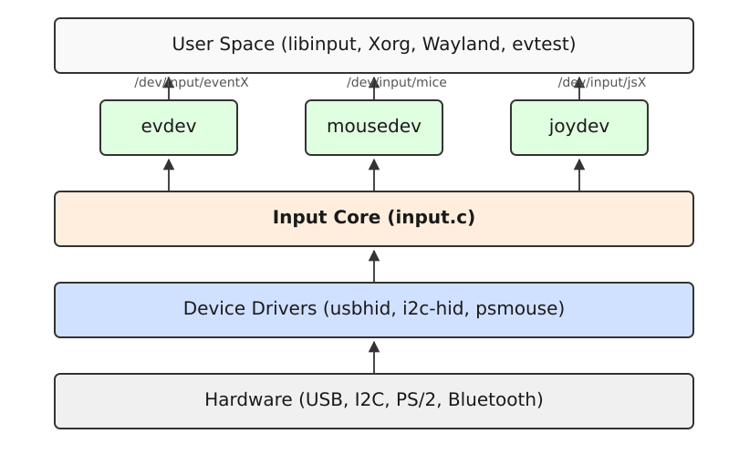

# Підсистема введення evdev та події /dev/input/eventX

<preknowlist>
- [Концепції ядра Linux](book:unix-linux/kernel-and-userspace) — базові поняття системних викликів та VFS.
</preknowlist>

Підсистема введення (Input Subsystem) у ядрі Linux є ключовим компонентом, який відповідає за обробку сигналів від різноманітних пристроїв введення, таких як клавіатури, миші, сенсорні екрани, джойстики, графічні планшети тощо, і їх передачу до простору користувача (User Space). У сучасних системах Linux основним інтерфейсом для взаємодії з пристроями введення є `evdev` (event device), який надає стандартизований потік подій через спеціальні файли пристроїв `/dev/input/eventX`.

Ця стаття детально розглядає архітектуру підсистеми введення, структуру подій, механізми взаємодії з `evdev` за допомогою `ioctl`, роль бібліотеки `libinput` у сучасних графічних середовищах, а також створення віртуальних пристроїв за допомогою `uinput`.

## 1. Архітектура Input Subsystem

Підсистема введення в Linux має багаторівневу архітектуру, що дозволяє абстрагувати апаратні деталі від програмного забезпечення простору користувача. Вона складається з трьох основних рівнів:

1. **Драйвери пристроїв (Device Drivers)**
2. **Ядро підсистеми введення (Input Core)**
3. **Обробники подій (Event Handlers)**


*Рис. 1. Архітектура підсистеми введення Linux.*

### 1.1. Драйвери пристроїв (Device Drivers)

На найнижчому рівні знаходяться драйвери пристроїв, які безпосередньо взаємодіють з апаратним забезпеченням через відповідні шини (USB, I2C, SPI, Bluetooth, PS/2). Їхня головна задача — зчитувати апаратні переривання та дані від контролера пристрою і перетворювати їх на стандартизовані події, які передаються до Input Core.

Приклади драйверів:
- `usbhid` — для USB-пристроїв класу HID (Human Interface Device).
- `i2c-hid` — для сенсорних панелей і екранів, підключених через I2C.
- `psmouse` — для класичних PS/2 мишей та тачпадів (наприклад, Synaptics).

### 1.2. Ядро підсистеми введення (Input Core)

Input Core (`drivers/input/input.c`) — це серцевина підсистеми. Вона виступає маршрутизатором або мультиплексором між драйверами пристроїв на нижньому рівні та обробниками подій на верхньому. Коли драйвер пристрою реєструє новий пристрій, Input Core повідомляє всім зацікавленим обробникам подій про його появу. Аналогічно, коли драйвер генерує подію (наприклад, натискання клавіші), Input Core розсилає цю подію до всіх підключених обробників.

### 1.3. Обробники подій (Event Handlers)

Обробники подій приймають події від Input Core і надають інтерфейси для простору користувача. Існує кілька обробників подій, кожен з яких служить своїм цілям:

- **evdev (Event Device)** — найуніверсальніший обробник. Він створює символьні пристрої `/dev/input/eventX` і передає через них незмінені, сирі події введення (натискання кнопок, зміна координат) у стандартизованому форматі `struct input_event`. У сучасних Linux-системах `evdev` є основним способом отримання подій для Xorg, Wayland та інших додатків.
- **mousedev** — шар сумісності, який емулює поведінку миші з інтерфейсом PS/2 (або ImPS/2). Він отримує події від усіх мишей і тачпадів у системі та об'єднує їх у єдиний пристрій `/dev/input/mice` (або окремі `/dev/input/mouseX`). Це було корисно для старих програм, які не вміли працювати з `evdev`, але сьогодні використовується рідко.
- **joydev** — обробник для джойстиків і геймпадів, що створює вузли `/dev/input/jsX` і надає події у форматі `struct js_event`. Як і `mousedev`, `joydev` вважається застарілим, і сучасні ігри та бібліотеки (наприклад, SDL2) віддають перевагу безпосередньому використанню `evdev` для доступу до геймпадів, оскільки `evdev` підтримує більше кнопок, осей та ефектів зворотного зв'язку (Force Feedback).
- **kbd** — внутрішній обробник, який перехоплює події від клавіатур і направляє їх до підсистеми TTY/консолі ядра, що дозволяє вводити команди у віртуальних терміналах (tty1, tty2 тощо).

## 2. Структура події: struct input_event

Взаємодія з `evdev` у просторі користувача зводиться до читання з файлу `/dev/input/eventX`. Ядро записує в цей файл потоки даних, які складаються з об'єктів структури `input_event`, визначеної у заголовному файлі `<linux/input.h>`.

```c
struct input_event {
    struct timeval time;
    __u16 type;
    __u16 code;
    __s32 value;
};
```

Ця структура має розмір 16 або 24 байти (залежно від архітектури — 32-бітна чи 64-бітна система, що впливає на розмір `timeval`). Розглянемо її поля детальніше:

1. **`time`** (структура `timeval`): Мітка часу, коли відбулася подія. Вона включає секунди (`tv_sec`) та мікросекунди (`tv_usec`) з моменту завантаження системи або епохи.
2. **`type`** (`__u16`): Тип події. Вказує на загальну категорію події (наприклад, клавіша, відносне переміщення, абсолютна координата).
3. **`code`** (`__u16`): Код події, який деталізує `type`. Наприклад, якщо тип — клавіша, то код вказує, яка саме клавіша була натиснута (наприклад, `KEY_A`, `BTN_LEFT`).
4. **`value`** (`__s32`): Значення події. Його семантика залежить від типу та коду. Для клавіш це стан (0 — відпущена, 1 — натиснута, 2 — автоповтор). Для відносних координат — дельта переміщення (наприклад, -5 або +10 пікселів).

### 2.1. Основні типи подій (Event Types)

Типи подій починаються з префікса `EV_`. Їх повний перелік є у `<linux/input-event-codes.h>` (який включається через `<linux/input.h>`).

- **`EV_SYN` (0x00)**: Синхронізація подій. Пристрої введення часто генерують кілька подій одночасно. Наприклад, миша при діагональному русі може одночасно змінити і координату X, і координату Y. Щоб простір користувача не обробив зміну X до того, як отримає зміну Y (що призвело б до ступінчастого руху), ядро надсилає події `EV_REL REL_X`, `EV_REL REL_Y`, а потім `EV_SYN SYN_REPORT`. Отримавши `SYN_REPORT`, програма розуміє, що "кадр" (фрейм) подій завершено, і тепер можна оновлювати стан в інтерфейсі.
- **`EV_KEY` (0x01)**: Зміна стану клавіші або кнопки. Використовується для клавіатур, кнопок миші, геймпадів. Коди — `KEY_*` (наприклад, `KEY_ENTER`, `KEY_ESC`) та `BTN_*` (наприклад, `BTN_LEFT`, `BTN_TOUCH`).
- **`EV_REL` (0x02)**: Відносна зміна координат. Типово для мишей (рух по осях `REL_X`, `REL_Y`) і коліщатка прокрутки (`REL_WHEEL`). Значення (`value`) показує зсув відносно попередньої позиції.
- **`EV_ABS` (0x03)**: Абсолютна позиція. Використовується для сенсорних екранів (тачскрінів), графічних планшетів, джойстиків. Коди включають `ABS_X`, `ABS_Y`, а також параметри сили натискання (`ABS_PRESSURE`), нахилу пера (`ABS_TILT_X`) тощо. Значення — це точна координата в межах апаратного діапазону.
- **`EV_MSC` (0x04)**: Різноманітні події (Miscellaneous). Використовується для передачі специфічних апаратних скан-кодів клавіш (`MSC_SCAN`) або інших нестандартних даних.
- **`EV_SW` (0x05)**: Події перемикачів (Switches). Наприклад, закриття/відкриття кришки ноутбука (`SW_LID`), підключення навушників (`SW_HEADPHONE_INSERT`), апаратний перемикач Wi-Fi (`SW_RFKILL_ALL`).
- **`EV_LED` (0x11)**: Використовується для керування індикаторами пристрою (Caps Lock, Num Lock, Scroll Lock). Цікаво, що події можуть йти не лише від ядра до програми (читання з пристрою), але і від програми до ядра (запис у пристрій). Програма може надіслати подію `EV_LED` у `evdev`, щоб увімкнути світлодіод на клавіатурі.
- **`EV_SND` (0x12)**: Звукові ефекти (наприклад, PC speaker).
- **`EV_FF` (0x15)**: Force Feedback (зворотний зв'язок, вібрація геймпадів чи керма).

### 2.2. Приклад читання подій (C/C++)

Для читання подій з `/dev/input/eventX` достатньо відкрити файл і в циклі читати блоки розміром з `sizeof(struct input_event)`:

```c
#include <stdio.h>
#include <fcntl.h>
#include <unistd.h>
#include <linux/input.h>

int main() {
    const char *dev = "/dev/input/event0";
    int fd = open(dev, O_RDONLY);
    if (fd == -1) {
        perror("Не вдалося відкрити пристрій");
        return 1;
    }

    struct input_event ev;
    while (read(fd, &ev, sizeof(ev)) > 0) {
        if (ev.type == EV_KEY) {
            printf("Key Code: %d, Value: %d (0=Відпущено, 1=Натиснуто, 2=Повтор)\n",
                   ev.code, ev.value);
        } else if (ev.type == EV_SYN) {
            printf("--- SYN_REPORT ---\n");
        }
    }

    close(fd);
    return 0;
}
```
*(Для запуску такого коду часто потрібні права `root` або належність до групи `input`, оскільки вузли `/dev/input/event*` зазвичай мають права `rw-r-----` для `root:input`).*

## 3. Взаємодія через `ioctl` (EVIOCG*)

Окрім потоку подій, `evdev` надає багатий інтерфейс управління та опитування пристрою за допомогою системних викликів `ioctl` (I/O Control). Команди `ioctl` для `evdev` починаються з префікса `EVIOC` (Event I/O Control). Завдяки їм простір користувача може дізнатися про можливості пристрою, його назву, топологію та навіть змінити деякі параметри.

### 3.1. Отримання ідентифікаторів пристрою

- **`EVIOCGNAME(len)`**: Отримати зрозумілу людям назву пристрою.
- **`EVIOCGPHYS(len)`**: Отримати фізичний шлях пристрою у системі (наприклад, `usb-0000:00:14.0-1.2/input0`).
- **`EVIOCGID`**: Отримати структуру `input_id`, яка містить ідентифікатори шини (`bustype`), виробника (`vendor`), продукту (`product`) та версію (`version`).

```c
struct input_id id;
ioctl(fd, EVIOCGID, &id);
printf("Bus: %04x, Vendor: %04x, Product: %04x, Version: %04x\n",
       id.bustype, id.vendor, id.product, id.version);
```

### 3.2. Запит можливостей (Bitmasks)

Найважливішою функцією `ioctl` є можливість запитати, які саме події підтримує пристрій. Це робиться за допомогою команди **`EVIOCGBIT(ev_type, len)`**. Вона повертає бітову маску (bitmask) підтримуваних кодів для заданого типу події `ev_type`.

Якщо передати `ev_type = 0`, функція поверне маску підтримуваних *типів* подій (тобто чи підтримує пристрій `EV_KEY`, `EV_REL`, `EV_ABS` тощо).

Наприклад, як дисплейний сервер (Xorg або Wayland) розуміє, що підключений пристрій — це миша? Він викликає `EVIOCGBIT(0, ...)` і перевіряє, чи підтримуються `EV_KEY` та `EV_REL`. Потім він викликає `EVIOCGBIT(EV_KEY, ...)` і перевіряє, чи є в масці біти для `BTN_LEFT` та `BTN_RIGHT`. Якщо викликати `EVIOCGBIT(EV_REL, ...)` — перевіряє підтримку `REL_X` та `REL_Y`. Якщо всі ці біти встановлені, пристрій класифікується як миша.

### 3.3. Запит глобального стану клавіш (EVIOCGKEY)

`evdev` відстежує поточний стан усіх кнопок і осей. Програма може в будь-який момент запитати, які клавіші зараз натиснуті, не чекаючи подій. Це робиться за допомогою команди **`EVIOCGKEY(len)`**.

Вона заповнює масив байтів, де кожен біт відповідає коду клавіші. Якщо біт дорівнює 1, клавіша наразі натиснута (hold). Це корисно під час ініціалізації програми, щоб дізнатися стан модифікаторів (Shift, Ctrl, Alt) до того, як користувач почне вводити новий текст.

Аналогічно існують `EVIOCGLED` для запиту стану індикаторів, та `EVIOCGSW` для стану перемикачів.

### 3.4. Абсолютні координати (EVIOCGABS)

Для пристроїв, що генерують події `EV_ABS` (тачскріни, планшети), недостатньо просто знати, що вони підтримують `ABS_X` або `ABS_Y`. Програма повинна знати діапазон можливих значень (мінімум і максимум), щоб правильно масштабувати координати тачскріна на роздільну здатність дисплея.

Команда **`EVIOCGABS(abs_axis)`** повертає структуру `input_absinfo` для конкретної осі `abs_axis`:

```c
struct input_absinfo {
    __s32 value;      // Поточне значення
    __s32 minimum;    // Мінімально можливе значення
    __s32 maximum;    // Максимально можливе значення
    __s32 fuzz;       // Похибка (шум), дрібні коливання, які слід ігнорувати
    __s32 flat;       // Розмір "мертвої зони" в центрі (для джойстиків)
    __s32 resolution; // Роздільна здатність (одиниць на міліметр тощо)
};
```

### 3.5. Монопольний доступ (EVIOCGRAB)

Команда **`EVIOCGRAB`** дозволяє програмі захопити монопольний доступ до пристрою введення.

```c
ioctl(fd, EVIOCGRAB, 1); // Захопити
// ...
ioctl(fd, EVIOCGRAB, 0); // Відпустити
```

Якщо програма виконує захоплення, ядро припиняє надсилати події від цього пристрою будь-яким іншим споживачам. Їх не отримуватиме ані графічний сервер, ані консоль. Це часто використовується в таких сценаріях:
1. Ігри, які хочуть напряму читати клавіатуру та мишу, ігноруючи віконного менеджера.
2. Програми для перепризначення клавіш (keymappers): програма захоплює `evdev` фізичної клавіатури, перехоплює події, модифікує їх (наприклад, міняє Caps Lock і Esc місцями) і надсилає їх у систему через віртуальний пристрій `uinput`.
3. Захоплення екрана блокування: коли ви вводите пароль на екрані блокування, програма блокування (наприклад, `i3lock` або `swaylock`) часто робить EVIOCGRAB на клавіатурі, щоб жодна фонова програма не змогла прослухати ваш пароль.

## 4. libinput: Вищий рівень абстракції

Довгий час графічний сервер Xorg (X11) працював з `evdev` напряму (через модуль `xf86-input-evdev` або `xf86-input-synaptics`). Однак з появою різноманітних тачпадів, сенсорних екранів, графічних планшетів та мультитач-жестів, стало очевидно, що обробка "сирих" подій `evdev` у кожній програмі чи віконному менеджері є складною і веде до фрагментації.

Тачпади генерують неймовірну кількість шуму і вимагають складної логіки: ігнорування дотику долонею (palm rejection), розпізнавання жестів (скролінг двома пальцями, масштабування), кінетичної прокрутки (kinetic scrolling), акселерації курсору. Якщо кожен композитор Wayland (Mutter, KWin, Sway) реалізовуватиме це самостійно, поведінка тачпада буде відрізнятися у всіх стільницях.

Тому було створено **libinput** — бібліотеку, яка стоїть між `evdev` (ядром) та композитором/X-сервером.

Функції `libinput`:
- Читає `/dev/input/eventX` пристрої.
- Ідентифікує та класифікує пристрої (клавіатура, миша, тачпад, тачскрін) на основі їх можливостей, часто покладаючись на правила `udev` (hwdb).
- Виконує складну обробку подій: фільтрація шуму, акселерація миші, palm rejection, мультитач-жести (pinch, swipe).
- Надає уніфікований API на основі подій власного формату (`libinput_event`).
- Займається управлінням пристроями при їх гарячому підключенні (Hotplugging), взаємодіючи з `udev` та `libudev`.

Сьогодні майже всі сучасні графічні стеки в Linux покладаються виключно на `libinput` для обробки введення. Модуль `xf86-input-libinput` замінив старі драйвери `evdev` та `synaptics` у Xorg.

## 5. Віртуальні пристрої введення (uinput)

Іноді виникає потреба програмно генерувати події введення так, ніби вони надходять від справжнього апаратного пристрою. Для цього в Linux існує модуль **`uinput`** (User level input subsystem). Він створює символьний пристрій `/dev/uinput` (або `/dev/input/uinput`).

Будь-яка програма простору користувача, що має права на запис у `/dev/uinput`, може створити віртуальний пристрій введення (клавіатуру, мишу, геймпад). Для системи та `evdev` цей віртуальний пристрій виглядатиме абсолютно ідентично фізичному — він з'явиться як новий `/dev/input/eventX` і події від нього маршрутизуватимуться графічним серверам так само.

### 5.1. Для чого використовується `uinput`:
1. **Програми віддаленого доступу (VNC, RDP, Steam In-Home Streaming)**: серверна частина повинна вводити в систему рухи миші і натискання клавіш, які вона отримала по мережі.
2. **Програмні макроси та перепризначення (key remappers)**: утиліти на зразок `xmodmap` працювали лише в X11. На рівні `evdev`/`uinput` працюють сучасні інструменти (наприклад, `keyd`, `interception-tools`, `ydotool`), які перехоплюють фізичну клавіатуру через EVIOCGRAB і випромінюють модифіковані події через `uinput`, працюючи універсально в X11, Wayland і навіть консолі.
3. **Емулятори геймпадів**: наприклад, перетворення рухів миші в сигнали джойстика.
4. **Bluetooth-клавіатури (BlueZ)**: стек Bluetooth отримує натискання клавіш по радіоканалу, і BlueZ-демон використовує `uinput`, щоб передати їх у систему.

### 5.2. Створення пристрою через uinput (C/C++)

Процес створення віртуального пристрою виглядає так:

1. Відкрити `/dev/uinput` на запис.
2. Використати ioctl `UI_SET_EVBIT` та `UI_SET_KEYBIT` для декларації підтримуваних подій (наприклад, що цей пристрій підтримує натискання `KEY_SPACE` і `KEY_A`).
3. Заповнити структуру `uinput_setup` (включаючи `id.bustype = BUS_USB`, назву "Virtual Keyboard" тощо) і відправити її через `ioctl(fd, UI_DEV_SETUP, &setup)`.
4. Викликати `ioctl(fd, UI_DEV_CREATE)`, після чого ядро створить віртуальний пристрій (з'явиться `/dev/input/eventX`).
5. Писати структури `input_event` (так само, як вони читаються) у `/dev/uinput`. Ядро транслюватиме їх як події від цього віртуального пристрою.
6. При закритті файлового дескриптора (або явному `UI_DEV_DESTROY`) ядро знищить пристрій.

## 6. Утиліти для діагностики

Для роботи з `evdev` та підсистемою введення існує кілька корисних інструментів простору користувача:

- **`evtest`**: Найвідоміша утиліта. Вона виводить список усіх пристроїв `/dev/input/event*`, дозволяє обрати один з них, опитує всі його можливості (через EVIOCG*) і виводить їх у термінал. Після цього вона починає читати події в реальному часі і виводити їх у текстовому форматі, розшифровуючи типи та коди. Це незамінний інструмент для дебагінгу зламаних кнопок або перевірки, як саме ядро бачить клавіатуру.
- **`libinput-record`** та **`libinput-debug-events`**: Інструменти з пакету `libinput-tools`. На відміну від `evtest`, який читає сирі події `evdev`, `libinput-debug-events` виводить події вже після їх обробки бібліотекою `libinput`. Це корисно, щоб побачити, наприклад, розпізнаний жест `POINTER_SCROLL_WHEEL` замість сирих координат.
- **`udevadm info -a -p /sys/class/input/event0`**: Дозволяє подивитися ієрархію пристрою в `sysfs` та його властивості `udev`, які впливають на конфігурацію в просторі користувача.

## Висновки

Підсистема введення `evdev` у Linux є прикладом вдалої абстракції: вона надає єдиний уніфікований інтерфейс (`/dev/input/eventX` та стандартні ioctl) для доступу до сотень різноманітних апаратних пристроїв. Вона відокремлює драйвери, що знають про регістри обладнання і переривання, від користувацьких програм, яким достатньо знати лише про те, що була натиснута кнопка або змінена координата. Завдяки доповненням у вигляді `uinput` для віртуалізації та `libinput` для високорівневої обробки ергономіки (жестів і фільтрації шуму), сучасний Linux забезпечує надійний і гнучкий стек вводу, здатний працювати з будь-якими новими типами HID-пристроїв.
