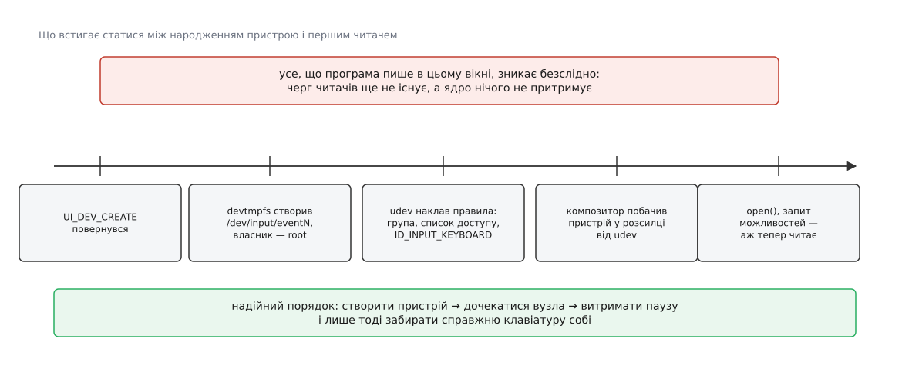

# ⚙️ Свій пристрій вводу через /dev/uinput: перепризначувач клавіш

Зробимо так, щоб Caps Lock працював як Escape — і не в одній програмі, а скрізь: у текстовій консолі, у графічній сесії, у грі, яка читає ввід сама й на розкладку не дивиться. Правити розкладку для цього не годиться: розкладка діє лише на своєму поверсі, а той, хто читає ввід нижче за неї, про неї й не чув. Тож зайдемо з іншого боку — станемо пристроєм. Заберемо справжню клавіатуру собі й видаватимемо виправлений потік від власного пристрою, якого решта системи не відрізнить від залізного.

Для цього є `/dev/uinput` — символьний вузол (старший номер 10, молодший 223), що його дає модуль `uinput`. Відкрити його означає взяти порожню заготовку пристрою. Далі програма перелічує, на що заготовка здатна, дає їй паспорт і просить ядро її створити — і в системі з'являється справжній `/dev/input/eventN`. Події, записані потім у той самий дескриптор, заходять у ядро вводу тим самим шляхом, яким туди заходять виклики драйвера з обробника переривання. Слово «емуляція» тут зайве: з боку читача цей пристрій нічим не гірший за той, у якого є дроти.

## Порядок, який не переставити

Ядро вводу пропускає лише те, що пристрій заздалегідь про себе заявив: подія з кодом, якого немає в бітовій масці, тихо гине. Для залізного пристрою маску виставляє драйвер, для нашого — ми, командами [ioctl](book:unix-linux/ioctl-interface) на дескрипторі `/dev/uinput`. І тут головне: **усі ці команди приймаються лише до `UI_DEV_CREATE`**. Після створення та сама `UI_SET_KEYBIT` поверне `-EINVAL`, а маска лишиться такою, якою була в мить народження. Дописати можливість пристрою на ходу не можна — можна лише зруйнувати пристрій і зібрати новий.

Звідси й будова програми: спершу оголошення, потім паспорт, потім народження, і аж потім — події.

```c
/* capsesc.c — Caps Lock працює як Escape для всієї системи.
 * збірка: cc -O2 -Wall -o capsesc capsesc.c
 * запуск: sudo ./capsesc /dev/input/by-id/…-event-kbd
 */
#define _GNU_SOURCE
#include <dirent.h>
#include <fcntl.h>
#include <linux/input.h>
#include <linux/uinput.h>
#include <stdio.h>
#include <string.h>
#include <sys/ioctl.h>
#include <unistd.h>

#define LBITS         (8 * sizeof(unsigned long))
#define NLONGS(n)     (((n) + LBITS - 1) / LBITS)
#define TESTBIT(a, n) (((a)[(n) / LBITS] >> ((n) % LBITS)) & 1UL)
#define SETBIT(a, n)  ((a)[(n) / LBITS] |= 1UL << ((n) % LBITS))
#define CLRBIT(a, n)  ((a)[(n) / LBITS] &= ~(1UL << ((n) % LBITS)))
#define KEYWORDS      NLONGS(KEY_MAX + 1)

static __u16 remap(__u16 code)
{
        return code == KEY_CAPSLOCK ? KEY_ESC : code;
}

/* Час лишаємо нулями: нуль ядро дійсною позначкою не вважає й ставить свою.
   Чужу воно бере лише в новіших ядрах — і лише не з майбутнього й не старшу за 10 с. */
static int emit(int ui, __u16 type, __u16 code, __s32 value)
{
        struct input_event ev = { .type = type, .code = code, .value = value };
        return write(ui, &ev, sizeof ev) == (ssize_t)sizeof ev ? 0 : -1;
}

static int build_device(int ui, int src)
{
        unsigned long keys[KEYWORDS] = { 0 };
        struct uinput_setup us = {
                .id = { .bustype = BUS_VIRTUAL, .vendor = 0x1d6b,
                        .product = 0x0001,       .version = 1 },
        };

        /* 1. Типи подій. EV_REP тут навмисно немає — див. нижче про автоповтор. */
        if (ioctl(ui, UI_SET_EVBIT, EV_KEY) < 0) return -1;
        if (ioctl(ui, UI_SET_EVBIT, EV_SYN) < 0) return -1;

        /* 2. Клавіші. Беремо маску джерела — але оголошуємо ПІДМІНЕНІ коди:
              з нашого пристрою вилітає KEY_ESC, а KEY_CAPSLOCK — ніколи. */
        if (ioctl(src, EVIOCGBIT(EV_KEY, sizeof keys), keys) < 0) return -1;
        for (unsigned c = 0; c <= KEY_MAX; c++)
                if (TESTBIT(keys, c) && ioctl(ui, UI_SET_KEYBIT, remap(c)) < 0)
                        return -1;

        /* 3. Паспорт: шина, виробник, модель, назва.
              -EINVAL тут означає ядро, старше за 4.5, — там лише старий шлях. */
        snprintf(us.name, sizeof us.name, "capsesc virtual keyboard");
        if (ioctl(ui, UI_DEV_SETUP, &us) < 0) return -1;

        /* 4. Аж тепер пристрій народжується. */
        return ioctl(ui, UI_DEV_CREATE);
}
```

Другий крок вартий погляду: у циклі стоїть `remap(c)`, а не `c`. Оголошувати треба не те, що вміє джерело, а те, що справді вилетить із нашого пристрою. Інакше вийде безглуздя — пристрій, який обіцяє Caps Lock і не обіцяє Escape, тимчасом як видає рівно навпаки.

## Вікно, у якому вас ніхто не чує

`UI_DEV_CREATE` повернувся — здавалося б, можна писати. Пишемо натиск, і його немає.

Річ у тім, що `UI_DEV_CREATE` повертається, щойно пристрій зареєстровано в ядрі вводу. Вузол у `/dev` після цього з'являється майже одразу (його робить `devtmpfs`), але належить він тоді ще `root`. Далі за справу береться [udev](book:unix-linux/udev-rules): накладає правила, віддає вузол [групі `input`](book:unix-linux/device-access-groups) чи додає список доступу для того, хто зараз сидить за машиною, і виставляє властивості на кшталт `ID_INPUT_KEYBOARD`. І лише коли udev закінчив, він розсилає звістку — а вже з неї про новий пристрій дізнаються ті, хто ввід читає: композитор графічної сесії, служба доступності, `X`-сервер. Кожному з них потрібно ще відкрити вузол, розпитати ім'я та можливості, перемкнути годинник — і це ще мілісекунди.

Усе, що ми напишемо доти, дістанеться нікому. Обробник `evdev` розкладає кожну подію по чергах тих клієнтів, які є **в цю мить**; клієнтів нема — розкладати нема куди, і нічого не відкладається «на потім».



*Одну половину цього проміжку видно з програми, другу — принципово ні.*

Половину проміжку закрити можна. Запит `UI_GET_SYSNAME` віддає ім'я нашого пристрою в [sysfs](book:unix-linux/sysfs-device-model) — рядок виду `input27`; серед дітей `/sys/class/input/input27/` є єдиний `eventM`, і це наш вузол. Отже, чекати навмання не треба: чекаємо саме на нього.

```c
static void wait_for_node(int ui)
{
        char sysname[32] = { 0 }, path[64], node[64] = { 0 };
        struct dirent *e;
        DIR *d;

        if (ioctl(ui, UI_GET_SYSNAME(sizeof sysname), sysname) < 0)
                return;                       /* старе ядро — лишиться сама пауза */

        snprintf(path, sizeof path, "/sys/class/input/%s", sysname);
        if ((d = opendir(path))) {
                while ((e = readdir(d)))
                        if (!strncmp(e->d_name, "event", 5)) {
                                snprintf(node, sizeof node, "/dev/input/%s", e->d_name);
                                break;
                        }
                closedir(d);
        }
        for (int i = 0; i < 300 && node[0]; i++) {      /* до 3 с на udev */
                if (access(node, F_OK) == 0) break;
                usleep(10 * 1000);
        }
}
```

А другу половину закрити нічим: жодне ядро не скаже вам, чи вже відкрив ваш вузол композитор. Тому пауза лишається — і в прикладі з документації ядра вона теж є, звичайним `sleep(1)`. Чесна відповідь не в тому, щоб паузи позбутися, а в тому, щоб не ставити її замість перевірки: спершу дочекатися вузла, потім витримати паузу на читачів. Програма, якій треба надійніше, слухає розсилку udev через `libudev` і чекає, поки пристрій позначать як опрацьований, — але пауза на відкриття лишається й там.

> 🔧 **Навіщо це.** Для перепризначувача проміжок небезпечний удвічі, і рятує саме порядок дій. Якщо забрати справжню клавіатуру собі (`EVIOCGRAB`) до того, як читачі знайшли наш пристрій, то на секунду клавіатура просто помре: натиски вже наші, а віддати їх нема кому. Тому `EVIOCGRAB` — остання дія перед циклом, а не перша.

## Цикл

```c
static void resync(int ui, int src, unsigned long *held)
{
        unsigned long now[KEYWORDS] = { 0 };

        if (ioctl(src, EVIOCGKEY(sizeof now), now) < 0) return;
        for (unsigned c = 0; c <= KEY_MAX; c++)
                if (TESTBIT(held, c) != TESTBIT(now, c))
                        emit(ui, EV_KEY, remap(c), TESTBIT(now, c) ? 1 : 0);
        memcpy(held, now, sizeof now);
        emit(ui, EV_SYN, SYN_REPORT, 0);
}

int main(int argc, char **argv)
{
        unsigned long held[KEYWORDS] = { 0 };
        struct input_event ev;
        int src, ui;

        if (argc != 2) {
                fprintf(stderr, "потрібен шлях: %s /dev/input/eventN\n", argv[0]);
                return 2;
        }
        if ((src = open(argv[1], O_RDONLY)) < 0)      { perror(argv[1]);      return 1; }
        if ((ui = open("/dev/uinput", O_WRONLY)) < 0) { perror("/dev/uinput"); return 1; }
        if (build_device(ui, src) < 0)                { perror("створення");   return 1; }

        wait_for_node(ui);
        usleep(400 * 1000);      /* читачам на відкриття: спитати про це нікого не можна */

        if (ioctl(src, EVIOCGRAB, 1) < 0) { perror("EVIOCGRAB"); return 1; }

        while (read(src, &ev, sizeof ev) == (ssize_t)sizeof ev) {
                if (ev.type == EV_SYN && ev.code == SYN_DROPPED) {
                        resync(ui, src, held);        /* наша копія стану — брехня */
                        continue;
                }
                if (ev.type == EV_KEY) {
                        if (ev.value == 1)      SETBIT(held, ev.code);
                        else if (ev.value == 0) CLRBIT(held, ev.code);
                        ev.code = remap(ev.code);
                }
                if (write(ui, &ev, sizeof ev) != (ssize_t)sizeof ev) break;
        }

        ioctl(ui, UI_DEV_DESTROY);
        return 0;
}
```

Подію передаємо цілою — з типом, значенням і чужою позначкою часу. Позначку джерела новіші ядра приймають — вона не з майбутнього й молодша за десять секунд, — і подвійне клацання нижче за течією рахується за справжніми інтервалами, а не за нашими; старіші ядра ставлять власну, на кілька мілісекунд пізнішу. `SYN_REPORT` іде тим самим шляхом і закриває наш кадр рівно там, де його закрило джерело.

Окремо стоїть `SYN_DROPPED`: якщо джерело переповнилося, ми могли не побачити «клавішу відпущено» — і на нашому пристрої вона лишиться натиснутою назавжди. Тому замість передавання ми питаємо в джерела `EVIOCGKEY` («що натиснуте насправді») і доводимо свій пристрій до цього стану власними подіями.

Тепер зрозуміло, чому серед оголошених типів немає `EV_REP`. Автоповтор до нас уже приходить: джерело шле його подіями зі значенням `2`, і ядро вводу пропускає їх окремим шляхом — повтор не змінює стану клавіші, тож перевірку «а це взагалі зміна?» він обминає. Тобто затиснута клавіша повторюється на нашому пристрої задарма. А от якби ми оголосили `EV_REP`, ядро завело б для нашого пристрою **власний** таймер повтору — і людина дістала б два потоки однакових подій замість одного. `EV_REP` потрібен тому, хто натиски вигадує сам (екранна клавіатура), і шкідливий тому, хто передає чужі.

## Чого ядро вам не скаже

**Забутий `SYN_REPORT`.** Обробник `evdev` будить того, хто спить на дескрипторі, лише на межі кадру — і навіть порожній `SYN_REPORT`, за яким нічого не стояло, відкидає. Тож кадр без роздільника не помилка: `write` каже «записано», події лежать у чергах читачів, і нічого не відбувається. Особливо підступно це в програмах, де натиск і відпускання надсилають без роздільників «щоб швидше».

**Неоголошений біт.** Те саме мовчання: `write` успішний, а подія гине в ядрі вводу, бо коду немає в масці. Симптом характерний — з двадцяти клавіш працюють дев'ятнадцять.

**Права.** Вузол `/dev/uinput` за замовчуванням належить `root`, і дистрибутиви окремим правилом udev віддають його групі. Гірше інше: доки модуль не завантажено, вузла просто немає, і `open` дає `ENOENT`. Модуль оголошує про себе рядком `devname:uinput`, за яким `kmod` створює вузол наперед; де цього не налаштовано, `uinput` вантажать через `modules-load.d`. Джерело теж треба мати право читати — тут або та сама група, або список доступу, який [logind](book:unix-linux/logind-sessions-seats) видає тому, хто фізично сидить за машиною.

Ця скупість не випадкова, і варто розуміти, з чого вона росте. Наш пристрій нічим не відрізняється від залізного — а отже, той, хто дістався `/dev/uinput`, уміє друкувати куди завгодно: у вікно термінала із запущеним `sudo`, у поле пароля, у менеджер ключів. Жодна програма не може спитати «звідки цей натиск», бо в події такого поля немає й ніколи не було. Тому право створювати пристрої вводу за вагою дорівнює праву керувати всією сесією, і роздавати його «щоб зручніше» не варто.

**Події до створення.** Найдивніша помилка з усіх: якщо забути `UI_DEV_CREATE` і почати писати `input_event`, `write` поверне `-EINVAL`. До створення `write` на цьому дескрипторі означає зовсім інше — і саме тут криється відповідь на питання про старий інтерфейс.

## Чому старий інтерфейс досі живий

До 2016 року паспорта через `ioctl` не існувало. Пристрій налаштовували так: заповнювали `struct uinput_user_dev` і записували її в дескриптор. Ядро розрізняє два значення `write` за станом: пристрій ще не створено — це налаштування, створено — це події. Тому 24 байти події, надіслані завчасу, ядро міряє на `sizeof(struct uinput_user_dev)` — 1116 байтів — і відповідає `-EINVAL`.

Чому 1116? Бо стара структура несла в собі чотири масиви на всі можливі абсолютні осі — межі, рівень шуму й зону нечутливості, — навіть якщо пристрій має рівно нуль осей. Автор нового шляху, Давід Германн, назвав у супровідному тексті до правки три вади: структура не розширювана, вимагає величезних передач і, головне, навантажує `write` неверсійованим об'єктом, де помилитися легко. `UI_DEV_SETUP` бере лише паспорт, `UI_ABS_SETUP` описує по одній осі — і додає поле `resolution`, якому в старій структурі не було місця. Правка вийшла з рук Германна й Бенжамена Тіссуара наприкінці 2015-го й прийшла до всіх із ядром 4.5 у березні 2016 року.

А старий шлях лишився — і лишиться назавжди. Ядро [не ламає вже зібраних програм](book:unix-linux/userspace-abi-stability), а програм, що налаштовують uinput записом, було написано за півтора десятиліття чимало. Для нового коду правило просте: пробуйте `UI_DEV_SETUP`, а якщо він повернув `-EINVAL`, значить під вами ядро, старше за 4.5, — і тоді доведеться писати структуру. Точну версію протоколу віддає `UI_GET_VERSION`; сьогодні це 5.

Наостанок про завершення: `UI_DEV_DESTROY` прибирає пристрій, не закриваючи дескриптора, — стан повертається до початкового, і на тому самому дескрипторі можна зібрати інший пристрій. Просте `close` робить те саме й саме собою, тож у короткій програмі окремий виклик — радше акуратність, ніж потреба.
