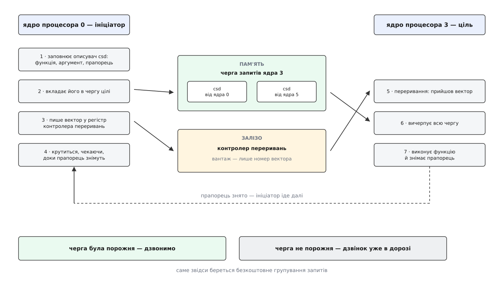
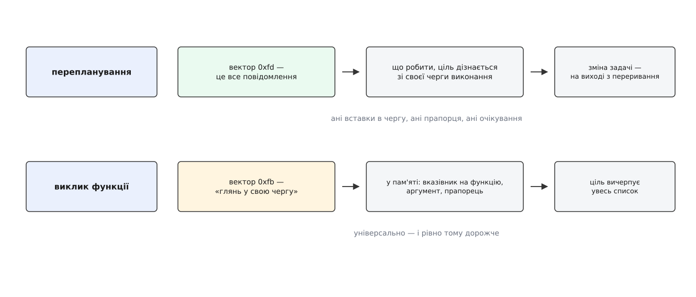
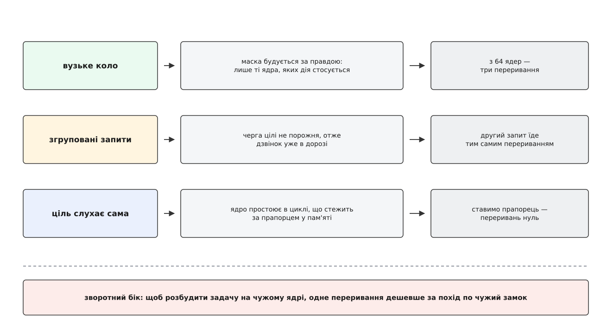

# Міжпроцесорні переривання: як одне ядро змушує інші виконати код

<preknowlist>
- [Переривання](topic:programming/interrupts) — як зовнішня подія вириває ядро процесора з поточного коду й віддає керування обробникові.
- [Контролер і вектор](topic:programming/interrupt-vector) — звідки береться номер вектора і як контролер переривань доставляє його ядру процесора.
- [Багатоядерні процесори](topic:programming/multicore) — кілька ядер виконують код незалежно й одночасно, поділяючи одну пам'ять.
- [Когерентність кешів](topic:programming/cache-coherence) — залізо саме стежить, щоб запис одного ядра врешті став видимим іншим.
- [Ядро й простір користувача](topic:unix-linux/kernel-and-userspace) — код ядра системи живе на кожному ядрі процесора й має привілеї, яких не має програма.
- [Замки в ядрі й атомарний контекст](topic:unix-linux/kernel-locking) — у якому контексті ядро системи не має права спати й брати сплячі замки.
- [Дані свого ядра процесора](topic:unix-linux/per-cpu-data) — структури, у яких кожне ядро процесора має власний примірник.
</preknowlist>

Ядро процесора змінює світ єдиним способом — виконуючи інструкції. Свій буфер записів воно спорожняє своєю інструкцією, свій конвеєр перезапускає своєю, свій кеш перекладів скидає своєю. Інструкцій «дистанційної дії» не буває: те, що виконує ядро 0, змінює стан ядра 0.

А в машині повно станів, які існують по одному примірнику **на кожне ядро**. Кеш перекладів адрес. Черга виконання з тим, що зараз працює. Лічильники, розкладені по ядрах, щоб не битися за один рядок кеша. Конвеєр із уже прочитаними інструкціями. Коли система ухвалює рішення, дійсне для всієї машини — «ця сторінка більше не належить процесові», «цей потік має негайно поступитися місцем», «усі копії цього коду застаріли», — рішення ухвалює одне ядро, а виконати його треба на всіх.

Спокуса очевидна: пам'ять же спільна. Запишімо ознаку в комірку, і сусіди її побачать — залізо саме розішле інвалідації по своєму протоколу. Але тут два провали, і обидва глибокі.

Перший: сусід мусить **подивитися**. Комірка змінилася, та ядро процесора не має жодної причини її читати — воно виконує програму, у якій такої перевірки просто немає. Щоб ознака працювала, кожен мусив би раз у раз опитувати її сам, і чим швидша реакція потрібна, тим частіше. Це плата, яку вносить кожне ядро постійно, за подію, якої майже ніколи немає.

Другий провал серйозніший. Частина того стану **взагалі не є пам'яттю**. Кеш перекладів адрес не має адреси. Буфер записів не має адреси. Конвеєр не має адреси. Жоден запис із ядра 0 не дістане їх фізично — їх торкається лише інструкція, виконана **на тому самому ядрі**, до якого вони належать.

Отже, потрібно змусити чуже ядро виконати наш код — не колись, коли воно саме зволить перевірити, а зараз, хоч би що воно робило. Механізм із такими властивостями в процесора рівно один: **переривання**. Воно виривається в будь-який момент, зберігає поточний стан, віддає керування обробникові й повертається назад. Уся новизна тут лише в джерелі: сигнал надходить не від пристрою, а від сусіднього ядра. Звідси й назва — **міжпроцесорне переривання** (inter-processor interrupt, IPI).

## Дзвінок у двері, а не лист

Надіслати таке переривання коштує одного запису в регістр — і цей запис проходить через контролер переривань, той самий, що роздає сигнали від пристроїв.

На x86 у кожного ядра є власний локальний APIC (Advanced Programmable Interrupt Controller), а в ньому — командний регістр переривання ICR. Ініціатор кладе туди номер вектора й адресу отримувача, і контролер доставляє. Адресу можна не перелічувати поіменно: є скорочення «самому собі», «всім», «усім, крім себе». У режимі x2APIC регістр доступний як машинний регістр, тож усе надсилання — одна інструкція `wrmsr`, без очікування статусу доставки.

На ARM ту саму роботу робить GIC. Переривання, породжені програмою, там навіть виділені в окремий клас — SGI (software generated interrupt), номери від 0 до 15. Ініціатор пише в системний регістр `ICC_SGI1R_EL1` номер SGI і список цілей: або бітову маску до шістнадцяти ядер однієї групи спорідненості, або біт «усім, крім себе». На RISC-V базовий варіант ще простіший — запис слова в комірку контролера, за яким закріплено конкретне ядро.

Спільне в усіх трьох важливіше за відмінності. По-перше, надсилання **нічим не завершується**: ініціатор написав у регістр і пішов далі — він не чекає, поки ціль візьметься до справи, і взагалі не дізнається про це від заліза. По-друге, і це визначає всю подальшу конструкцію, **разом із дзвінком не передається нічого, крім номера**. Кілька біт вектора — це весь вантаж. У ньому немає місця ані для вказівника на функцію, ані для аргументу.

Дзвінок у двері дзвенить, але листа не приносить. Лист доведеться покласти окремо.

## Лист лишають у пам'яті, дзвінок кажуть залізом

Пам'ять для листа якраз годиться: вона спільна, а проблема пам'яті була не в тому, що сусід не побачить, а в тому, що він не гляне. Тепер гляне — його для цього й перервали.

Тому в Linux у кожного ядра процесора є **своя черга запитів**, `call_single_queue`. Ініціатор заповнює описувач `csd` (call single data — вказівник на функцію, аргумент, прапорці), вкладає його в чергу цілі і аж тоді дзвонить у двері. Ціль, отримавши вектор, заходить у `generic_smp_call_function_single_interrupt()`, вичерпує весь список і виконує кожен запит.



*Два незалежні шляхи однієї команди: вантаж іде пам'яттю, сигнал — залізом. Ціль зустрічає їх разом.*

Черга не має замка — це список, у який вставляють однією атомарною операцією. І саме з її будови безкоштовно випливає найважливіша економія. Вставка повертає ознаку «список **був порожній**», і переривання надсилають **тільки за цією ознакою**. Список не порожній — отже, дзвінок для цієї черги вже пролунав, ціль ще не встигла її вичерпати, і новий запит вона підбере тим самим заходом. Десять ядер, що майже одночасно попросили одинадцяте про послугу, коштують одного переривання замість десяти.

Описувач — це ресурс, і його не можна перевикористати раніше, ніж ціль його забрала. Звідси прапорець зайнятості всередині `csd`: ініціатор ставить його перед вставкою, ціль знімає, забравши запит. Хто шле асинхронно, зі свого статичного описувача, отримує на цю перевірку явну відповідь `-EBUSY`: попередній запит ще в дорозі.

## Скільки треба сказати

Черга з описувачем — універсальний спосіб, але він не безкоштовний: атомарна вставка, прапорець, згодом його зняття, а на цілі — обхід списку. Іноді сказати треба менше, і тоді дешевше не казати нічого понад сам номер вектора.

Найяскравіший приклад — **перепланування**. Коли ядро системи вирішує, що на іншому ядрі процесора має піти інша задача, воно спершу ставить у тій задачі прапорець `TIF_NEED_RESCHED`, а тоді шле переривання. Обробник на цілі не робить майже нічого: уся інформація вже лежить у черзі виконання того ядра, а сама зміна задачі станеться на **виході** з переривання, у звичайній точці витіснення. Тобто повідомлення тут — сам факт переривання; вантажу немає взагалі. Тому перепланування має власний вектор і власний шлях, що обходить чергу запитів.



*Коли сказати треба лише «отямся», вантаж не потрібен — і разом із ним зникають вставка в чергу, прапорець і обхід списку.*

Так само окремо винесено роботу, яку треба виконати саме в жорсткому контексті переривання — `irq_work`. Її потребує код, що сам працює там, де не можна брати замки, наприклад лічильники подій продуктивності: він лишає завдання й дзвонить, а виконається воно на найближчому перериванні. Механіку відкладеної роботи в ядрі — від жорсткого контексту до м'якого й до робочих черг — розібрано окремо: [переривання, softirq і робочі черги](topic:unix-linux/interrupts-bottom-halves).

Особливий випадок — переривання, що приходить, коли переривання заборонені. Звичайний IPI до ядра з вимкненими перериваннями просто чекає, і зазвичай це правильно. Але коли машина вже зависла і треба зняти знімок стеків з усіх ядер або зупинити їх перед аварійним записом дампа, чекати нема сенсу — тоді шлють **немасковане** переривання ([NMI](topic:programming/nmi-exceptions)). Воно проходить крізь заборону, і плата за це висока: обробник не має права робити майже нічого, бо міг перервати сам себе посеред будь-якого замка.

Ці класи видно просто за номерами. На x86 перепланування має вектор `0xfd`, виклик функції на одному ядрі — `0xfb`, на групі — `0xfc`, відкладена робота — `0xf6`, зупинка ядер — `0xf8`. Коментар у заголовковому файлі з описом векторів прямо каже, чому так: номери — обмежений ресурс, тож рідкісні речі зводять в один вектор, а критичні за швидкістю — скидання перекладів, перепланування, локальний таймер — тримають окремими.

> 🔧 **Навіщо це.** Класи не декоративні: у `/proc/interrupts` кожен із них — окремий рядок із лічильником на кожне ядро. Машина, що дивно гальмує, розкривається саме тут: мільйони перепланувань за секунду означають, що потоки скачуть між ядрами; вибух викликів функцій — що якийсь підсистемний код розсилає широко й часто. Без поділу на вектори всі ці випадки виглядали б однаково.

## Чекати чи не чекати

Ініціаторові часто мало надіслати — йому треба **знати, що зроблено**. Звільняти сторінку можна лише після того, як усі цілі викинули її переклад; змінювати структуру можна лише тоді, коли ніхто в ній не сидить. Тому в родини викликів є прапорець очікування: ініціатор крутиться, доки цілі не знімуть прапорці у своїх описувачах.

Ціна очікування — не сума робіт на цілях, а **максимум**: усі вони працюють паралельно, і ініціатора тримає найповільніша. Чому цей максимум так погано росте з кількістю ядер і що з цим роблять, докладно розібрано на прикладі [розсилання скидань TLB](topic:unix-linux/tlb-shootdown) — там ця ціна є головною темою.

Тут із очікування випливає інше — жорсткі правила щодо контексту, і кожне з них має один і той самий корінь.

Обробник виконується **в контексті переривання** цілі. Він не може заснути, не може взяти сплячий замок, не може виділити пам'ять способом, що чекає. Ціль була зайнята чимось своїм, і чим довше в ній сидить чужий код, тим гірше всім — це не місце для роботи, це місце для короткої дії.

Ініціатор, що чекає, **не має права вимикати переривання**. Інакше виходить пастка з двох боків: ядро 0 надіслало ядру 1 і крутиться з вимкненими перериваннями, ядро 1 у цю саму мить надіслало ядру 0 і крутиться так само. Жодне не може прийняти чужий дзвінок, обидва чекають вічно. Ядро системи ловить це попередженням прямо в коді надсилання, ще до того, як зависання станеться насправді.

З того самого правила росте і його обхід. Коли надсилати треба саме звідти, де чекати не можна, беруть **асинхронний** варіант: ініціатор володіє власним описувачем, шле й іде далі, а про завершення дізнається інакше — наприклад, із того, що обробник сам щось позначив. Повний перелік функцій родини, їхніх аргументів, дозволених контекстів і кодів помилок винесено окремо: [інтерфейс міжпроцесорних викликів у ядрі](topic:unix-linux/inter-processor-interrupts/api-smp-call.md).

## Коли переривання не приходить

Очікування без відповіді — найнеприємніший сорт зависання: система стоїть, а винний не там, де вона стоїть. Тому в ядрі є сторож. Якщо прапорець не знімається довше за встановлений час (за замовчуванням п'ять секунд), у журнал іде повідомлення про **csd, що не відповідає**: хто чекає, на кого чекає і, у зневаджувальній збірці, яку саме функцію ціль зараз виконує. Є й різкіший режим — паніка після заданого часу очікування, щоб дістати дамп у момент, коли стан ще живий.

Причини, за якими ціль мовчить, ділять надвоє. Або вона працює, але з вимкненими перериваннями — довга критична секція, помилка в драйвері, зациклений код у забороненому контексті. Або **її взагалі немає**: у віртуальній машині віртуальне ядро процесора — це звичайний потік господаря, і поки планувальник господаря його не запустить, дзвінок нікому слухати. Ззовні обидва випадки виглядають однаково, а лікуються протилежно.

## Найдешевше переривання — те, якого не надіслали

Кожне переривання платне з двох боків: ініціатор витрачає на надсилання, а ціль — на вихід із того, чим займалася, і на повернення назад. Тому левова частка інженерії довкола IPI — це не як швидше надіслати, а як **не надсилати**.

Перший спосіб — **звузити коло**. Розсилка йде не «всім», а за маскою, і маску будують так вузько, як дозволяє правда: тільки ті ядра, що завантажили потрібний адресний простір; тільки ті, на яких зараз крутяться потоки цього процесу. Саме на цьому стоїть [membarrier](topic:unix-linux/membarrier) — системний виклик, що ставить бар'єр пам'яті на чужих ядрах, чіпаючи лише ті з них, де справді виконуються потоки викликача.

Другий — **згрупувати**, і він працює сам, з будови черги: доки попередній дзвінок не відпрацьовано, наступний не потрібен.

Третій найцікавіший, бо повертає нас до пам'яті. Ядро процесора, що простоює, часто чекає не в глибокому сні, а в циклі, який **сам стежить за прапорцем** у пам'яті, — і оголошує це прапорцем `TIF_POLLING_NRFLAG`. Побачивши таке оголошення, ініціатор просто атомарно ставить `TIF_NEED_RESCHED` і йде: ціль помітить сама, за частки мікросекунди. Переривання не надсилається взагалі. Пам'яті вистачило рівно тому, чого бракувало на початку, — ціль пообіцяла дивитися.



*Кожен спосіб прибирає переривання з іншої причини: одне не потрібне тому, що ціль не в колі, друге — тому, що дзвінок уже в дорозі, третє — тому, що ціль слухає без дзвінка.*

І є симетричний випадок, де переривання, навпаки, **дешевше за пряму дію**. Щоб розбудити задачу на чужому ядрі, треба вставити її в чергу виконання того ядра, а для цього — взяти його замок. Замок чужої черги — це рядок кеша, який почне гуляти між ядрами, і кожен такий похід коштує сотні тактів. Тому ядро системи чинить інакше: кладе задачу в спеціальний список пробудження й шле одне переривання, а вставку в чергу ціль робить сама — своїм замком, чий рядок кеша в неї й так гарячий. Переривання тут купує тишу на шині.

## Ціна для того, кого перервали

Досі йшлося про роботу. Але IPI забирає ще одне, чого не видно в лічильниках, — **передбачуваність**. Обробник влазить у довільну точку чужої програми, і для задачі з жорстким терміном це стрибок затримки нізвідки: код не зробив нічого поганого, просто комусь на іншому ядрі знадобилася глобальна дія.

Саме тому в системах, де ядра процесора виділяють під одну задачу й вимикають на них усе зайве, полювання на IPI стає окремою дисципліною — а перелік того, звідки вони ще прилітають на нібито тихе ядро, лишається живим списком роботи: [ізоляція ядер процесора](topic:unix-linux/cpu-isolation). Кожен переписаний підсистемний механізм, що навчився обходитися без розсилки, — це не лише зекономлені такти, а й прибраний із гарячого шляху сплеск затримки.

## У віртуальній машині все дорожче

Гість не має власного контролера переривань — його ICR емулюють. Тому запис, що на залізі коштує одну інструкцію, у віртуальній машині обертається **виходом у гіпервізор**, а розсилка на багато цілей — виходом на кожну з них.

**Оцінка розсилки на 63 віртуальні ядра, порядки величин:**

```
поодинці, з емуляцією ICR
  один вихід у гіпервізор     ≈ 1.5 мкс
  63 виходи                   = 94.5 мкс

одним гіпервикликом із бітовою маскою
  один вихід + обхід маски    ≈ 3 мкс
```

Звідси два напрями лікування, і обидва вже в ядрі. Перший — домовитися з гіпервізором явно: гість, що вміє паравіртуалізовані IPI, складає цілі в бітову маску й робить **один** гіпервиклик замість шістдесяти трьох. Таку домовленість для KVM запропонував і провів у ядро 2018 року Wanpeng Li з Tencent Cloud; за один виклик маска покриває до 128 віртуальних ядер. Другий напрям — прибрати вихід зовсім: сучасні процесори вміють доставляти міжпроцесорні переривання між віртуальними ядрами апаратно, без участі гіпервізора. Як залізо взагалі віддає машину гостеві, розібрано окремо: [апаратна віртуалізація](topic:programming/hardware-virtualization).

Лишається третя біда, якої не лікує ні те, ні інше: ціль може бути **знята з виконання**. Дзвінок доставлять, коли віртуальне ядро знову дадуть процесорові, — а це вже не мікросекунди.

## Як побачити свій рахунок

Найпростіший вимірювач — [/proc/interrupts](topic:unix-linux/proc-filesystem): унизу, під рядками пристроїв, ідуть рядки з лічильниками на кожне ядро процесора. `RES` — перепланування, `CAL` — виклики функцій, `TLB` — скидання перекладів, `IWI` — відкладена робота. Абсолютні числа тут майже нічого не кажуть; сенс має **різниця за проміжок часу** і те, як вона розкладена по ядрах: рівний фон чи одне ядро, яке всі смикають.

Наступне питання — «хто саме шле» — лічильники не беруть. На нього відповідають [точки трасування](topic:unix-linux/ftrace-kernel-tracing): від 2023 року в ядрі є спільні для всіх архітектур точки надсилання IPI, які записують не лише отримувача, а й місце в коді ініціатора та функцію, яку той просить виконати. Одне таке трасування зазвичай закриває питання за хвилину.

Як зібрати власний вимірювач — модуль, що шле переривання на сусіднє ядро й міряє час до виконання обробника, а тоді зіставляє результат із лічильниками, — розібрано окремо: [міряємо ціну міжпроцесорного переривання](topic:unix-linux/inter-processor-interrupts/proj-ipi-latency.md).

## Дзвінок як доказ

Найглибше застосування цього механізму — не команда, а **свідчення**.

Ядро процесора, що виконує код із вимкненими перериваннями, дзвінка не приймає. Отже, якщо розсилка завершилася й усі цілі відзвітували, ініціатор дізнався більше, ніж «моє прохання виконано»: він дізнався, що **кожна з цілей уже вийшла з тієї секції з вимкненими перериваннями, у якій була**. На цьому висновку тримаються великі підсистеми — від безпечного звільнення таблиць сторінок до пільгових періодів [RCU](topic:unix-linux/rcu-read-copy-update).

Крайня форма цієї ідеї — [stop_machine](topic:unix-linux/stop-machine): переривання, обробник якого не робить нічого, крім «стій і не рухайся», доки ініціатор не скаже «можна». Команда, доказ і бар'єр — три різні речі, які виявляються одним і тим самим дзвінком, бо всі троє потребують однієї властивості: щоб чуже ядро гарантовано опинилося там, де його поставив хтось інший.
