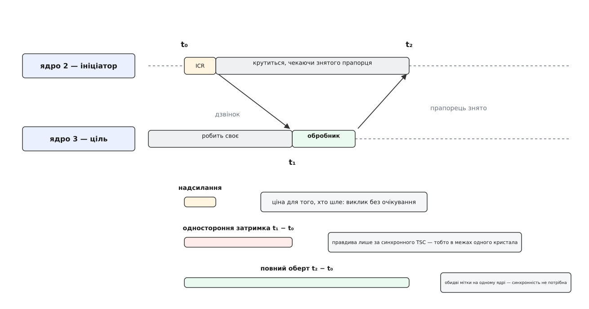

# ⚙️ Міряємо ціну міжпроцесорного переривання

Нижче — [модуль ядра](book:unix-linux/kernel-modules) на сотню рядків, який замість розпливчастого «IPI коштує десь мікросекунду» дістає три різні числа: скільки платить той, хто шле; скільки летить дзвінок до першої інструкції обробника; скільки триває повний оберт із очікуванням. Числа різняться на порядок, кожне відповідає на своє інженерне питання, і плутати їх — найпоширеніша помилка в оцінках.

## Три мітки — три різні числа

Увесь вимір тримається на трьох позначках лічильника тактів. `t₀` ініціатор ставить перед викликом, `t₁` ставить обробник на цілі першою ж своєю дією, `t₂` — знову ініціатор, після повернення.



*Надсилання — це те, що бачить ініціатор; одностороння затримка — те, що відчуває ціль; повний оберт — те, що платить підсистема, якій потрібне підтвердження.*

Різниця між другим і третім числом не арифметична, а принципова. `t₂ − t₀` знято двома читаннями **одного** лічильника на одному ядрі — таке віднімання правдиве завжди. А `t₁ − t₀` — це різниця показів двох різних лічильників, і вона щось означає лише тоді, коли ті йдуть у ногу. Коментар у ядрі до `rdtsc_ordered()` каже це прямо: немонотонність між ядрами неможлива, «поки TSC синхронізований». Поки — а не завжди: функція `unsynchronized_tsc()` виходить із припущення, що на машині з кількома сокетами синхронності немає. Звідси залізне правило заміру: одностороннє число беремо тільки в межах одного кристала, а міжсокетний випадок міряємо повним обертом.

Ще одна пастка спрацьовує раніше за все це. Звичайний `rdtsc()` процесор має право виконати спекулятивно, раніше за сусідні інструкції, — про це попереджає його ж коментар у ядрі. Тому скрізь `rdtsc_ordered()`: він розгортається в `lfence; rdtsc` або `rdtscp` і поводиться як звичайне читання з пам'яті.

## Де такому вимірювачу дозволено жити

Контекстні вимоги до виклику, який ми міряємо, записані прямо в його тілі:

```c
WARN_ON_ONCE(cpu_online(this_cpu) && irqs_disabled() && !oops_in_progress);
WARN_ON_ONCE(!in_task());
```

Звідси дві заборони, і перша знімає найперше бажання — вимкнути переривання довкола заміру, «щоб не заважали». Не можна: ініціатор, що чекає з вимкненими перериваннями, — це половина взаємного зависання. Друга забороняє міряти з обробника чи тасклета: потрібен контекст задачі. Тому вимірювач — потік ядра, прив'язаний до ядра-ініціатора. Прив'язка прибирає міграцію; [витіснення](book:unix-linux/kernel-preemption) лишається й проявляється як викиди, які ми відсіємо статистикою.

Обробник на цілі робить рівно одну дію, і це не лінощі автора. Він виконується в контексті переривання чужого ядра, тож не має права ані заснути, ані взяти сплячий замок ([замки в ядрі й атомарний контекст](book:unix-linux/kernel-locking)). Але важливіше інше: усе, що ви туди допишете, увійде в поміряне число. Один `pr_info` усередині `stamp` подорожчав би оберт на порядок — і поміряв би вам швидкість друку в кільцевий буфер, а не ціну переривання.

## Модуль

```c
/* ipi_lat.c — ціна smp_call_function_single у тактах TSC */
#include <linux/module.h>
#include <linux/kthread.h>
#include <linux/slab.h>
#include <linux/smp.h>
#include <linux/sort.h>
#include <linux/topology.h>
#include <asm/msr.h>
#include <asm/hardirq.h>

static int src = -1, dst = -1, runs = 4000, burst = 32;
module_param(src, int, 0444);
module_param(dst, int, 0444);
module_param(runs, int, 0444);
module_param(burst, int, 0444);

struct probe { u64 t0, t1; };

/* виконується НА ЦІЛІ, у контексті переривання: одна дія й нічого більше */
static void stamp(void *arg)
{
	((struct probe *)arg)->t1 = rdtsc_ordered();
}

static void noop(void *unused) { }

static unsigned int cal(int cpu)        /* той самий лічильник, що й рядок CAL */
{
	return per_cpu(irq_stat, cpu).irq_call_count;
}

static int cmp_u64(const void *a, const void *b)
{
	u64 x = *(const u64 *)a, y = *(const u64 *)b;
	return (x > y) - (x < y);
}

static void report(const char *what, u64 *v, int n)
{
	sort(v, n, sizeof(*v), cmp_u64, NULL);
	pr_info("ipi_lat: %-14s min=%llu med=%llu p99=%llu тактів (медіана %llu нс)\n",
		what, v[0], v[n / 2], v[n / 100 * 99],
		div64_u64(v[n / 2] * 1000000ull, tsc_khz));
}

static int measure(void *unused)
{
	bool same_die = topology_physical_package_id(src) ==
			topology_physical_package_id(dst);
	u64 *rt, *one, *snd, a;
	unsigned int c0, c1;
	struct probe p;
	int i;

	rt  = kmalloc_array(runs, sizeof(u64), GFP_KERNEL);
	one = kmalloc_array(runs, sizeof(u64), GFP_KERNEL);
	snd = kmalloc_array(runs, sizeof(u64), GFP_KERNEL);
	if (!rt || !one || !snd)
		goto out;

	for (i = 0; i < 200; i++)               /* прогрів: холодні кеші брешуть */
		smp_call_function_single(dst, noop, NULL, 1);

	c0 = cal(dst);
	for (i = 0; i < runs; i++) {
		p.t0 = rdtsc_ordered();
		smp_call_function_single(dst, stamp, &p, 1);
		rt[i]  = rdtsc_ordered() - p.t0;
		one[i] = p.t1 - p.t0;

		a = rdtsc_ordered();                    /* те саме, але без очікування */
		smp_call_function_single(dst, noop, NULL, 0);
		snd[i] = rdtsc_ordered() - a;
		smp_call_function_single(dst, noop, NULL, 1);  /* осісти, поза виміром */
	}
	c1 = cal(dst);

	pr_info("ipi_lat: %d→%d, один кристал: %s, tsc_khz=%u\n",
		src, dst, same_die ? "так" : "ні", tsc_khz);
	report("надсилання", snd, runs);
	report("повний оберт", rt, runs);
	if (same_die)
		report("одностороння", one, runs);
	pr_info("ipi_lat: %d запитів → CAL на ядрі %d виріс на %u\n",
		runs * 3, dst, c1 - c0);

	if (burst > 0) {
		call_single_data_t *csd = kcalloc(burst, sizeof(*csd), GFP_KERNEL);

		if (csd) {
			for (i = 0; i < burst; i++)
				csd[i].func = noop;
			c0 = cal(dst);
			for (i = 0; i < burst; i++)
				smp_call_function_single_async(dst, &csd[i]);
			smp_call_function_single(dst, noop, NULL, 1);
			c1 = cal(dst);
			pr_info("ipi_lat: %d незалежних запитів поспіль → CAL +%u\n",
				burst, c1 - c0);
			kfree(csd);
		}
	}
out:
	kfree(rt); kfree(one); kfree(snd);
	while (!kthread_should_stop())
		schedule_timeout_interruptible(HZ / 5);
	return 0;
}

static struct task_struct *th;

static int __init ipi_lat_init(void)
{
	if (src < 0 || dst < 0 || src == dst || runs < 100 ||
	    !cpu_online(src) || !cpu_online(dst))
		return -EINVAL;

	th = kthread_create(measure, NULL, "ipi_lat");
	if (IS_ERR(th))
		return PTR_ERR(th);
	kthread_bind(th, src);            /* ініціатор більше нікуди не поїде */
	wake_up_process(th);
	return 0;
}

static void __exit ipi_lat_exit(void) { kthread_stop(th); }

module_init(ipi_lat_init);
module_exit(ipi_lat_exit);
MODULE_LICENSE("GPL");
```

Збірка й запуск — звичайні для зовнішнього модуля:

```sh
make -C /lib/modules/$(uname -r)/build M=$PWD modules
taskset -c 3 sh -c 'while :; do :; done' &      # ціль навмисно зайнята
sudo insmod ipi_lat.ko src=2 dst=3 runs=4000 burst=32
dmesg | tail -6
awk '/CAL/ {print "CAL ядра 3:", $5}' /proc/interrupts
```

## Що з цих чисел видно

Абсолютні значення різні на кожній машині, тож дивитися треба на відношення — вони стійкі.

**Надсилання майже нічого не варте порівняно з обертом.** Ініціатор платить за вставку в чергу цілі та один запис у регістр контролера; усе інше в оберті — чужа робота: доставка вектора, вихід цілі з того, чим вона займалася, вхід в обробник і повернення знятого прапорця через рядок кеша. Тобто «дзвонити дорого» — неправда для того, хто дзвонить, і правда для системи.

**Машина з `tsc_khz = 2100000`, медіана надсилання 90 тактів, медіана оберту 3400:**

```
2100000 кГц  →  2.1·10⁹ тиків на секунду

надсилання:  90 · 10⁶ / 2100000  ≈    43 нс
оберт:     3400 · 10⁶ / 2100000  ≈  1619 нс  ≈ 1.6 мкс

відношення: 3400 / 90 ≈ 38
```

За сам дзвінок ініціатор віддає десятки наносекунд, за підтвердження — майже в сорок разів більше. Далі рахунок ведуть у бюджеті задачі: якщо шлях обробки пакета вкладається в 10 мкс, один синхронний оберт з'їдає шосту частину цього бюджету — і то лише на одну ціль. Розсилка на вісім ядер коштує не увосьмеро більше, бо цілі працюють паралельно, але й не стільки ж: ініціатора тримає найповільніша з них.

**Сусіднє ядро проти іншого сокета.** Змініть `dst` на ядро другого пакета: одностороннє число модуль сам відмовиться друкувати, а повний оберт помітно виросте. Дорожчає не доставка вектора, а зворотний шлях: прапорець в описувачі — це рядок кеша, який тепер мандрує між кеш-ієрархіями різних пакетів ([когерентність кешів](book:programming/cache-coherence), [NUMA](book:programming/numa)).

**Ціль зайнята проти цілі, що простоює** — і тут результат двомодальний, а не просто «трохи інший». Ядро, що простоює в неглибокому стані з опитуванням прапорця, переривання **не отримує взагалі**:

```c
bool call_function_single_prep_ipi(int cpu)
{
	if (set_nr_if_polling(cpu_rq(cpu)->idle)) {
		trace_sched_wake_idle_without_ipi(cpu);
		return false;
	}
	return true;
}
```

Ініціатор атомарно ставить прапорець «треба перепланувати», і на цьому все — вектор не летить. Модуль показує це найпереконливіше з можливого: `CAL +0` при тисячах виконаних запитів. А ось ціль у глибокому стані сну розтягує оберт на десятки мікросекунд, і платимо ми вже не за переривання, а за пробудження ядра ([простій ядра процесора](book:unix-linux/cpuidle-and-cstates)). Обидва краї відтворюються навмисно: завантаження з `idle=poll` лишає ядру, що простоює, тільки опитування прапорця, а вічний цикл під `taskset` тримає ціль зайнятою. Між цими краями лежить усе, що ви поміряєте на звичайній машині, — і саме тому «затримка IPI», названа одним числом без згадки про стан цілі, нічого не означає.

**Групування видно навіть у головному циклі.** На ітерацію припадає три запити, а `CAL` росте менше ніж на `3 × runs` — розрив і є групуванням, що трапилося саме собою: переривання шлють лише тоді, коли черга цілі **була порожня**. Окремий дослід із `burst` незалежними описувачами робить це очевидним: тридцять два запити поспіль дають одиниці переривань.

**Зіставлення з лічильниками ззовні.** Модуль читає рівно ту саму змінну, яку [/proc](book:unix-linux/proc-filesystem) друкує рядком `CAL` — `irq_stat.irq_call_count` цільового ядра. Тож різниця `CAL` до і після завантаження модуля має збігтися з тим, що модуль надрукував сам, із точністю до фонових IPI від решти системи. Розбіжність більша за фон означає, що ви міряли не те, що думали.

## Пастки

Три числа, які друкує `report()`, — це три різні фізичні історії, а не три способи усереднити те саме. **Мінімум** — найчистіша оцінка самої механіки: усі завади лише додають такти, тож знизу розподіл упирається просто в залізо. **Медіана** — те, що система платить насправді, з усім звичайним фоном. **p99** — хвіст, і в нього завжди є ім'я: або ініціатора витіснили між мітками, або ціль якраз сиділа в довгій ділянці з вимкненими перериваннями. Середнє арифметичне змішує всі три історії в одне число, яке не описує жодної з них, — тому в модулі його немає ([мікробенчмарк](book:programming/microbenchmarking)).

Решта пасток спільна для всіх, хто міряє такти в ядрі.

- **Такт TSC — не такт ядра.** Лічильник цокає зі сталою номінальною частотою, а не з поточною, тож при турбо-режимі та сама робота вкладається в меншу кількість цих тиків. Ділити на `tsc_khz`, щоб дістати наносекунди, — правильно; ототожнювати з тактами ядра — ні ([DVFS](book:programming/dvfs)).
- **Міжсокетна синхронність.** Одностороннє число за межами кристала не має сенсу — модуль тому й не друкує його.
- **Віртуальна машина.** Віртуальне ядро — звичайний потік господаря, і поміряєте ви суму ціни виходу в гіпервізор та планувальника господаря; хвіст розподілу там узагалі не про залізо ([апаратна віртуалізація](book:programming/hardware-virtualization)).
- **Вимір збурює ціль.** Обробник витісняє з її кешів чужі дані. Гарячий цикл під таким обстрілом працює гірше, ніж живе без вас, — і це не похибка, а частина справжньої ціни IPI.
