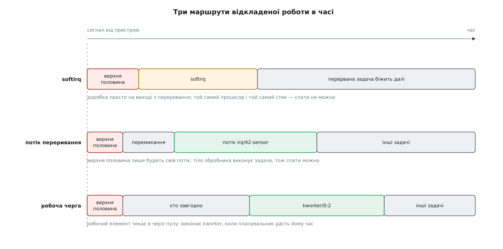
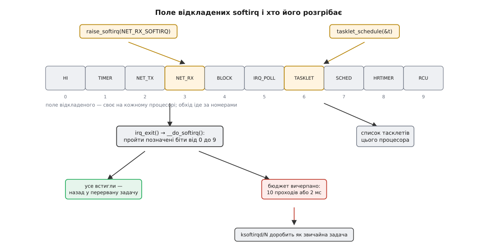
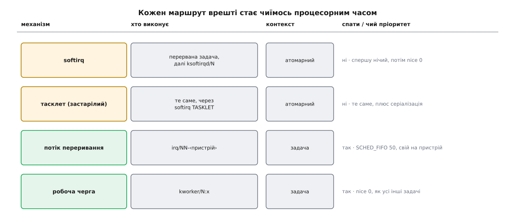

# Переривання, softirq і робочі черги

<preknowlist>
- [Переривання](book:programming/interrupts) — апаратний сигнал силою забирає процесор у того, хто зараз біжить, і передає керування наперед заданій функції.
- [Контролер і вектор](book:programming/interrupt-vector) — контролер зводить лінії пристроїв у номери, а таблиця векторів каже процесорові, куди стрибнути за кожним номером.
- [Ядро й простір користувача](book:unix-linux/kernel-and-userspace) — код ядра виконується на тому самому процесорі, що й програми, і ядро одне на всі задачі.
- [Замки в ядрі й атомарний контекст](book:unix-linux/kernel-locking) — є шляхи виконання, де засинати заборонено, і замок там годиться лише той, на якому крутяться, а не сплять.
- [Планувальник](book:unix-linux/scheduler-model) — `schedule()` знімає поточну задачу з процесора й ставить туди іншу.
- [Витісненість ядра](book:unix-linux/kernel-preemption) — ядро дозволяє спинити себе не всюди, і лічильник `preempt_count` каже, де саме зараз не можна.
- [Потоки ядра](book:unix-linux/kernel-threads) — задачі без простору користувача; це вони видні в `ps` у квадратних дужках.
- [Спін-замок](book:programming/spinlock) — замок, на якому чекають крутінням у порожньому циклі, а не засинанням.
- [Дані свого ядра процесора](book:unix-linux/per-cpu-data) — окремий примірник структури на кожне ядро прибирає боротьбу за спільний рядок кеша.
</preknowlist>

## Спокуса зробити все одразу

Мережева карта прийняла кадр. Фізично це виглядає так: контролер поклав півтори тисячі байтів у свою пам'ять і смикнув лінію переривання — і процесор, хай що він у цю мить рахував, за кілька сотень наносекунд опинився всередині функції драйвера.

Спокуса очевидна: дані вже тут, ми вже в ядрі, то й розберімо їх. Прочитати заголовки, знайти сокет, покласти байти в чергу прийому, розбудити програму, яка висить на `recv()`. Кожен із цих кроків — звичайний код ядра, і ніщо не заважає написати його просто тут, одним шматком.

Ніщо, крім лічби часу. Порахуймо, скільки його є на один кадр:

**Гігабітна лінія, кадри максимального розміру:**

```
на дроті      = 1500 байтів даних + 18 службових + 20 (преамбула й проміжок)
              = 1538 байтів = 12304 біти
час на кадр   = 12304 / 1·10⁹ = 12.3 мкс
частота       = 1 / 12.3 мкс ≈ 81 000 кадрів за секунду
```

Дванадцять мікросекунд — це весь бюджет. Повний розбір пакета аж до пробудження програми коштує десятки мікросекунд, тобто наступний кадр прийде раніше, ніж ми впораємося з попереднім. Але справжня біда не в цьому.

Поки обробник переривання біжить, процесор для решти світу мертвий. Починаючи з ядра 2.6.35 Linux виконує **кожен** апаратний обробник із вимкненими локальними перериваннями — раніше це вибирали прапорцем, тепер так завжди. Отже, всі ті десятки мікросекунд послідовний порт із однобайтовим буфером губить символи, таймер пропускає тик, а диск, що доповів про завершення операції, стоїть у черзі. Один повільний драйвер робить погано всім пристроям машини, а не лише собі.

## Чому тут не можна ні зачекати, ні заснути

Часу мало — це прикро, але вирішується акуратним кодом. Значно жорсткіше друге обмеження: частину роботи в обробнику зробити не можна взагалі, скільки б часу ми на неї не мали.

Слово «зачекати» в ядрі означає цілком конкретну послідовність: позначити себе неготовою, стати в чергу очікування й покликати `schedule()`, щоб процесор дістався комусь іншому. Питання: **кого саме** ми в такий спосіб приспимо? Обробник переривання не має власної задачі — він позичає час у тієї задачі, яку щойно збив із ніг, і `current` показує на неї. Приспати її означає покарати випадкового перехожого за подію, до якої він не має жодного стосунку. Розбудити його теж нікому: подія, на яку ми чекаємо, — це наш власний пристрій, а ми і є той код, що мав би її обробити.

Звідси випливає весь перелік заборон, і випливає механічно, а не за домовленістю. Не можна взяти м'ютекс — на зайнятому м'ютексі сплять. Не можна попросити пам'ять із `GFP_KERNEL` — розподільник має право заснути, доки звільняє сторінки. Не можна прочитати регістр давача через шину I²C — передача на шині триває сотні мікросекунд, і драйвер шини на цей час засинає. Не можна скопіювати щось у простір користувача: адресний простір під нами — чужий, та й `copy_to_user()` цілком може впертися у сторінковий збій, а сторінковий збій — це знову сон.

Обробник затиснуто з двох боків: він мусить бути коротким і не має права чекати. І тут-таки видно розв'язок, бо роботи в обробнику насправді два різні сорти. Зняти запит переривання й забрати байти з апаратного буфера, доки їх не затерли наступні, — це **треба зробити зараз**, пристрій не почекає. Розібрати заголовки, знайти сокет, розбудити програму — від того, станеться це за мікросекунду чи за сто, не залежить нічого. Друге можна відкласти.

## Верхня половина й нижня

Так робота розпадається надвоє. Негайна частина: прочитати регістр стану, переконатися, що переривання наше (лінія буває спільна), зняти апаратний запит — інакше пристрій триматиме лінію й ми повернемося в обробник негайно, — вигребти дані з малого буфера й позначити, що є що доробити. Це все; далі `return`. Відкладена частина робить решту, і робить її вже не з-під вимкнених переривань.

Першу Linux називає **верхньою половиною** (англ. *top half*), другу — **нижньою половиною** (*bottom half*). Назви прийшли з давнього поділу й нічого не описують по суті, тому їх варто читати просто як «негайне» й «відкладене».

Уся змістовна складність — в одному питанні: **«відкласти» — це на коли, і чиїми руками?** Відповідей у ядрі три, і вони не конкурують, а покривають різні випадки.



*Одна й та сама подія, три способи доробити її: різниця не в тому, що робиться, а в тому, хто й коли віддає під це процесор.*

## Доробити просто на виході: softirq

Найдешевша відповідь — «за мить, тут-таки». Обробник повертається не прямо в перервану задачу: перед поверненням ядро виконує `irq_exit()`, і саме там воно дивиться, чи не назбиралося відкладеної роботи. Якщо назбиралося — виконує її негайно, **не виходячи з переривання**, але вже з увімкненими апаратними перериваннями. Так інші пристрої більше не чекають, а робота все одно робиться в найближчу можливу мить.

Цей механізм зветься **softirq** (від *software interrupt*, програмне переривання) — за аналогією: воно так само перериває звичайний хід виконання, тільки джерело в нього не апаратне.

Влаштований він гранично просто. Є десять пронумерованих гнізд, кожне зі своєю функцією, задано на етапі збірки ядра. Є розрядне поле «що чекає» — **своє на кожному процесорі**. `raise_softirq(NET_RX_SOFTIRQ)` просто вмикає розряд у полі свого процесора, і це коштує кількох інструкцій; `__do_softirq()` обходить позначені розряди від нульового до дев'ятого й кличе відповідні функції. Порядок номерів і є пріоритетом: таймери йдуть поперед мережі, мережа — поперед блокових пристроїв.



*Softirq — не окрема сутність із власним стеком, а лише розряд у полі й функція, яку викликають на виході з переривання.*

Із цієї будови випливають дві властивості, які й визначають, що в softirq можна писати.

Перша: **спати тут так само не можна**. Ми все ще їдемо на позиченому часі перерваної задачі — змінилося тільки те, що апаратні переривання ввімкнено. Усі заборони попереднього розділу лишаються чинні: м'ютекс, `GFP_KERNEL`, шина, що засинає, — усе те саме зась.

Друга: **одне й те саме softirq може виконуватися на всіх процесорах одночасно**. Поле в кожного своє, і якщо мережеві карти смикнули два ядра, `NET_RX` побіжить на обох. Це навмисно — саме заради цього softirq свого часу й з'явилися, — але воно означає, що обробник мусить бути придатний до одночасного виконання: спільні лічильники — у [дані свого процесора](book:unix-linux/per-cpu-data), спільні структури — під спін-замком, і замок неодмінно з варіантом, що глушить нижні половини на цьому ядрі.

Нових гнізд softirq драйвери не заводять і завести не можуть: десять номерів прошито в ядро, і це не точка розширення, а гарячий шлях самого ядра. Розширення виглядає інакше — і про нього далі.

## Коли нижня половина не хоче зупинятися

У схемі «доробити на виході з переривання» захована пастка. Обробка мережевого softirq цілком може породити нову роботу: доки ми розбирали кадр, карта прийняла ще три й знову підняла розряд. Обійшли поле — воно знов не порожнє. Обійшли ще раз — знов. Перервана задача при цьому не отримує процесор **ніколи**: формально система нічого не заблокувала й усі при ділі, але корисна робота стоїть. Це не дедлок, а жива блокада: усі рухаються, ніхто не просувається.

Ліки — бюджет. `__do_softirq()` крутить обхід не безмежно, а поки тримаються три умови: не більше **десяти** проходів, не довше **двох мілісекунд** і доки планувальник не попросив перемкнути задачу. Щойно бюджет вичерпано, недороблене не викидають — його передають потокові ядра **`ksoftirqd/N`**, своєму на кожен процесор.

І ось це — найважливіший наслідок у всій темі. Робота, яка мить тому не мала ні пріоритету, ні власника й крала час у випадкової задачі, стає **звичайною задачею** з `nice 0`. Її можна витіснити. Її процесорний час видно в `top`. Вона чесно конкурує з програмами користувача, а не обкрадає їх.

> 🔧 **Навіщо це.** Коли машина під навантаженням «гальмує без причини», а в `top` угорі висить `ksoftirqd/3` — це не збій і не паразитний процес. Це рівно те, що описано вище: відкладеної роботи стало більше, ніж влазить у бюджет на виході з переривань, і надлишок тепер видно як окрему задачу. Дивитися треба, якого саме softirq побільшало, — це показує `/proc/softirqs`, лічильник на процесор і на тип.

Той-таки бюджет пояснює, чому мережевий стек під навантаженням поводиться дивно на перший погляд: він **вимикає переривання карти** й переходить на опитування просто зсередини `NET_RX`. За вісімдесяти тисяч кадрів на секунду переривання перестає бути дешевим сповіщенням і саме стає вузьким місцем; докладніше — у темі про [мережевий стек](book:unix-linux/network-stack).

## Тасклет: нижня половина, яку може завести драйвер

Драйверові теж треба відкладати роботу, а гнізда softirq для нього закриті. Для цього є **тасклет** (англ. *tasklet*, «задачка») — функція, яку драйвер ставить у чергу викликом `tasklet_schedule()`, а виконує її гніздо `TASKLET_SOFTIRQ` звичайним обходом свого списку.

Тасклет дає одну гарантію, якої немає в softirq: **той самий тасклет ніколи не виконується на двох процесорах одночасно**. Драйверний код від цього спрощується — не треба замка навколо власного стану. Але гарантія має ціну: якщо два ядра поставили в чергу той самий тасклет, друге чекатиме, а сама функція виконається на тому процесорі, який поставив її першим, — і затримка стає непередбачуваною.

Сьогодні тасклети вважають застарілими, і не через продуктивність. Їхній інтерфейс має вади будови: код доторкається до структури тасклета вже **після** того, як функцію виконано, — а драйвер на цей момент цілком міг ту пам'ять звільнити; скасувати або дочекатися тасклета теж по-справжньому нічим. У ядрі 6.9 з'явилася заміна: **робоча черга з ознакою `WQ_BH`**, яка виконує елементи в тому самому контексті softirq, але через інтерфейс робочих черг — з нормальними `cancel` і `flush`. Нового коду на тасклетах писати не варто.

Історію цього поділу — від первісних тридцяти двох гнізд, серіалізованих на всю машину, до softirq і тасклетів у ядрі 2.3.43 і до відмови від тасклетів через чверть століття — розгорнуто окремо: [як народжувалася нижня половина](book:unix-linux/interrupts-bottom-halves/hist-bottom-half.md).

## Коли відкласти замало — треба спати

Усе дотепер відкладало роботу **всередині атомарного контексту**: пізніше, але з тими самими заборонами. Для великої частини драйверів цього не досить, і причина не в обсязі роботи, а в її природі.

Давач на шині I²C піднімає лінію переривання й каже цим рівно одне: «щось сталося». **Що саме** сталося, написано в його регістрі, а щоб прочитати регістр, треба провести обмін на шині — а це сотні мікросекунд, під час яких драйвер шини засинає. Ніяке softirq тут не поможе: воно так само не має права спати. Потрібен не відкладений виклик, а **справжня задача**.

Це і є **робоча черга** (англ. *workqueue*). Драйвер описує роботу структурою `struct work_struct` із функцією, ставить її в чергу викликом `schedule_work()` — і колись потім її виконає потік ядра з пулу, той самий `kworker/N:x`, якого видно в `ps`. Усередині цієї функції дозволено все, що дозволено звичайному коду ядра: м'ютекси, `GFP_KERNEL`, обмін на шині, очікування завершення.

Пул влаштовано розумніше, ніж «потік на чергу»: від ядра 2.6.36 у Linux працює схема з керованою одночасністю (Теджун Хео), де робочі потоки спільні для всіх черг, а кількість їх регулюється на ходу. Ключова деталь — коли працівник **засинає**, пул помічає це й запускає наступного, щоб процесор не простоював; а коли роботи мало, зайві потоки згасають. Тому черг у ядрі можуть бути сотні, а потоків — одиниці.

Плата — затримка. Робочий елемент виконається тоді, коли планувальник дасть `kworker` процесор, а це може бути й за мілісекунду, і за десять, якщо система завантажена. Робоча черга годиться для «колись потім»: дозаписати статистику, перечитати конфігурацію пристрою, звільнити ресурси. Для «якнайшвидше, але зі сном» вона завелика.

## Потік, приставлений до конкретного переривання

Останній маршрут закриває саме цей проміжок. Драйвер може попросити ядро зареєструвати переривання **разом із власним потоком**:

```c
/* верхня половина: біжить із вимкненими перериваннями */
static irqreturn_t sensor_hardirq(int irq, void *dev_id)
{
    struct sensor *s = dev_id;

    /* Спитати «чи наше це переривання» нема в кого: регістр стану лежить
       за шиною. Тому лінія цього давача мусить бути лише його.        */
    s->stamp = ktime_get_ns();
    return IRQ_WAKE_THREAD;       /* усе інше вимагає шини, тобто сну */
}

/* нижня половина: окрема задача, тут спати можна */
static irqreturn_t sensor_thread(int irq, void *dev_id)
{
    struct sensor *s = dev_id;
    u8 buf[6];

    i2c_master_recv(s->client, buf, sizeof(buf));  /* сон на шині — дозволено */
    push_sample(s, buf, s->stamp);
    wake_up_interruptible(&s->readers);
    return IRQ_HANDLED;
}

    err = request_threaded_irq(client->irq, sensor_hardirq, sensor_thread,
                               IRQF_ONESHOT, "sensor", s);
```

Верхня половина тут схудла до одного руху: вона лише знімає мітку часу й повертає `IRQ_WAKE_THREAD`. Тіло обробника виконує потік `irq/NN-sensor`, створений ядром під це конкретне переривання, — звичайна задача з усіма її правами.

Прапорець `IRQF_ONESHOT` тут не прикраса, а необхідність. Давач тримає лінію піднятою, доки його регістр не прочитано, а прочитають його лише в потоці. Без `ONESHOT` ядро розмаскувало б лінію одразу після верхньої половини, побачило б її досі піднятою й покликало б обробник знову — і так безкінечно. `ONESHOT` тримає лінію замаскованою до кінця роботи потоку.

Потік переривання дістає реальночасовий пріоритет (`SCHED_FIFO`, 50) — тобто випереджає звичайні задачі, і затримка в нього не залежить від завантаженості машини так, як у `kworker`. При цьому пріоритет **свій на кожен пристрій**: критичному давачеві можна підняти, балакучій мережевій карті — опустити, і зробити це з простору користувача звичайним `chrt` по імені потоку.

Саме цей механізм лежить в основі реальночасового Linux: складання з `PREEMPT_RT` переводить у потоки **майже всі** обробники — крім позначених `IRQF_NO_THREAD`, а на звичайному ядрі те саме вмикає параметр завантаження `threadirqs`. Ціна відома — зайве перемикання контексту на кожне переривання; виграш — обробники перестають бути ділянками, де систему не можна витіснити.

## Що з цього обирати

Питання, яке відсікає половину варіантів, одне: **чи мусить відкладена робота спати?**

Якщо ні — робота лишається в атомарному контексті: у ядрі це softirq, у драйвері — робоча черга з `WQ_BH` (або тасклет у старому коді). Затримка тут мікросекундна, але код мусить обходитися спін-замками й `GFP_ATOMIC`.

Якщо так — потрібна задача, і вибір між двома: **потік переривання**, коли робота нерозривно пов'язана з цим пристроєм і затримка важлива, і **робоча черга**, коли це просто «доробити колись потім». Перше дає керований пріоритет на пристрій, друге — дешевше й не тримає жодних апаратних ліній.

## Кому належить цей час

За всіма цими маршрутами видно одну спільну рису, і вона важливіша за самі назви механізмів. Код у ядрі не виконується сам собою — його завжди хтось виконує, і в кожного маршруту цей «хтось» інший.



*Відкласти роботу — означає вибрати, чиїм процесорним часом за неї заплатять.*

Softirq їде на випадковій задачі, яку перервали, — вона за це платить і ніде цього не побачить. Переповнення переходить до `ksoftirqd`, і час одразу стає видимим і керованим. Потік переривання має власне ім'я, власний пріоритет і власний рядок у `ps`. Робочий елемент розчиняється в безликому `kworker`.

Тому діагностика тут завжди зводиться до одного руху: знайти виконавця. `/proc/interrupts` показує, скільки разів і на якому ядрі спрацювала верхня половина; `/proc/softirqs` — скільки відкладеного пройшло кожним гніздом; `ps` — чи не з'їдає процесор `ksoftirqd` або конкретний `irq/`-потік. Куди саме пішли мікросекунди всередині обробника, показують трасувальні точки `irq_handler_entry` і `irq_handler_exit` — [ftrace і трасувальні точки ядра](book:unix-linux/ftrace-kernel-tracing).

Готовий драйвер, який використовує всі три нижні половини одночасно й показує типові пастки — спільну лінію, забутий `ONESHOT`, гонку між верхньою половиною та потоком, — розібрано окремо: [драйвер із трьома нижніми половинами](book:unix-linux/interrupts-bottom-halves/proj-threaded-irq-driver.md). Точні сигнатури, прапорці `request_irq` і повний перелік того, що дозволено в кожному контексті, зібрано в [довідці з механізмів відкладення](book:unix-linux/interrupts-bottom-halves/api-deferred-work.md).
