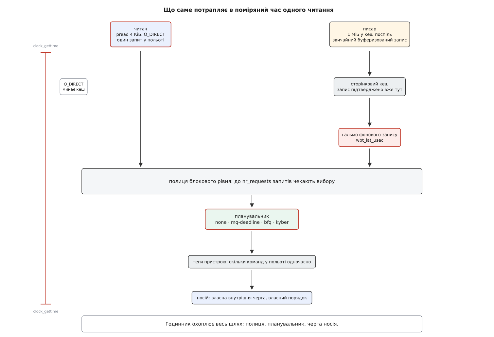

# ⚙️ Стенд: поміряти планувальник власним годинником

Це готова програма на C, яка під фоновою заливкою запису міряє час кожного дрібного читання з носія й видає p50, p99 і p99.9 — саме ті числа, на яких видно, що перемикання планувальника дає на твоєму пристрої, а чого не дає.

## Чому середнє нічого не покаже

Спокуса поміряти «швидкість» одним числом велика й хибна. Планувальник не робить окреме звертання швидшим: він вирішує, чиє звертання піде першим. Тому половина читань, які й так не чекали, лишиться на місці, а зрушиться те, що стояло в кінці, — верхні кілька відсотків розподілу. Середнє змішує обидві частини в одну кашу й показує невелику різницю там, де в хвості вона кратна.

Тому міряємо не середнє, а **перцентилі**: значення, нижче за яке лежить задана частка вимірів. p99.9 — це поріг, який перевищує одне читання з тисячі. Саме воно й псує враження від системи, бо секунда затримки раз на тисячу звертань помітна, а десять зайвих мікросекунд у середньому — ні. Що ця величина означає формально й чому хвіст розподілу не відновлюється з середнього й розкиду, розібрано в [перцентилях і хвостах](topic:math/percentiles-quantiles) — для замірів досить того, що це просто відсортований масив і взятий із нього елемент за номером.

Стенд складається з двох ролей. **Писар** заливає носій — пише великими шматками поспіль, як робить копіювання файлу. **Читач** — жертва: дрібні читання по випадкових зміщеннях, по одному за раз, і час кожного під годинником.

Одна деталь у ролі читача не декоративна: **один запит у польоті**. Якщо читач подасть тридцять два одразу, поміряне число перетвориться на пропускну здатність черги й перестане відповідати на питання «скільки чекає одне маленьке читання». А відповідає на нього саме планувальник.



*Читач іде повз кеш, писар — крізь кеш і крізь гальмо фонового запису; поміряний час містить усе, що нижче.*

Звідси два рішення, і вони навмисно різні. Читач відкриває файл із `O_DIRECT` — інакше сторінковий кеш віддасть дані з пам'яті й ми поміряємо швидкість пам'яті, а не носія; за це доводиться платити вирівнюванням буфера й зміщень, і саме тому в коді є `posix_memalign` (див. [буферизований і прямий ввід-вивід](topic:unix-linux/buffered-and-direct-io)). Писар, навпаки, пише **звичайним буферизованим записом**: механізм, який тут перевіряють, керує фоновим скиданням кешу на носій, а прямий запис проходить повз нього — і сценарій «копіюю файл, система затинається» зникає разом із ним.

Годинник — `CLOCK_MONOTONIC`: він не стрибає від переведення системного часу й читається без входу в ядро, тож коштує кількадесят наносекунд проти сотень мікросекунд виміру ([час у ядрі](topic:unix-linux/kernel-timekeeping)).

## Програма

:::tabs
```c
/* iolat.c — затримка дрібних читань під фоновою заливкою запису
 *   збірка: cc -O2 -D_GNU_SOURCE iolat.c -o iolat -lpthread -lm
 *   запуск: ./iolat <файл-для-читання> <файл-для-запису> <секунд>      */
#include <fcntl.h>
#include <math.h>
#include <pthread.h>
#include <stdatomic.h>
#include <stdint.h>
#include <stdio.h>
#include <stdlib.h>
#include <string.h>
#include <sys/stat.h>
#include <time.h>
#include <unistd.h>

#define READ_BLK    4096u             /* дрібне читання — те, що болить  */
#define WRITE_BLK   (1u << 20)        /* заливка великими шматками       */
#define WRITE_FILE  (4ull << 30)      /* пишемо по колу, щоб не з'їсти диск */
#define WARMUP_NS   2000000000ull     /* перші дві секунди відкидаємо    */
#define MAX_SAMPLES 4000000u          /* 32 МБ під масив вимірів         */

static atomic_int      stop_flag;
static _Atomic uint64_t written;

static uint64_t now_ns(void) {
    struct timespec t;
    clock_gettime(CLOCK_MONOTONIC, &t);
    return (uint64_t)t.tv_sec * 1000000000ull + (uint64_t)t.tv_nsec;
}

static uint64_t rnd(uint64_t *s) {            /* splitmix64: дешево й рівно */
    uint64_t z = (*s += 0x9E3779B97F4A7C15ull);
    z = (z ^ (z >> 30)) * 0xBF58476D1CE4E5B9ull;
    z = (z ^ (z >> 27)) * 0x94D049BB133111EBull;
    return z ^ (z >> 31);
}

/* Вирівнювання для O_DIRECT питаємо в ядра, а не вгадуємо.
   STATX_DIOALIGN є з Linux 6.1; де немає — 4096 безпечне і для 512e, і для 4Kn. */
static size_t dio_align(int fd) {
#ifdef STATX_DIOALIGN
    struct statx st;
    if (statx(fd, "", AT_EMPTY_PATH, STATX_DIOALIGN, &st) == 0 &&
        (st.stx_mask & STATX_DIOALIGN) && st.stx_dio_offset_align) {
        size_t a = st.stx_dio_offset_align;
        if (st.stx_dio_mem_align > a) a = st.stx_dio_mem_align;
        return a;
    }
#endif
    return 4096;
}

static void *flooder(void *arg) {
    int fd = open((const char *)arg, O_WRONLY | O_CREAT, 0644);
    if (fd < 0) { perror("open write"); return NULL; }
    char *buf = malloc(WRITE_BLK);
    memset(buf, 0xA5, WRITE_BLK);
    uint64_t off = 0;
    while (!atomic_load_explicit(&stop_flag, memory_order_relaxed)) {
        ssize_t n = pwrite(fd, buf, WRITE_BLK, (off_t)off);
        if (n <= 0) break;
        atomic_fetch_add(&written, (uint64_t)n);
        off = (off + (uint64_t)n) % WRITE_FILE;
        /* штовхаємо накопичене на носій, не чекаючи на нього:
           це і є фоновий зворотний запис, проти якого воюють планувальники */
        if (off != 0 && off % (64ull << 20) == 0)
            sync_file_range(fd, (off_t)(off - (64ull << 20)),
                            64ll << 20, SYNC_FILE_RANGE_WRITE);
    }
    free(buf);
    close(fd);
    return NULL;
}

static int cmp_u64(const void *a, const void *b) {
    uint64_t x = *(const uint64_t *)a, y = *(const uint64_t *)b;
    return (x > y) - (x < y);
}

static double pct_us(const uint64_t *v, size_t n, double p) {
    size_t i = (size_t)ceil(p / 100.0 * (double)n);   /* найближчий ранг */
    if (i < 1) i = 1;
    if (i > n) i = n;
    return (double)v[i - 1] / 1000.0;
}

int main(int argc, char **argv) {
    if (argc != 4) {
        fprintf(stderr, "usage: %s <read-file> <write-file> <seconds>\n", argv[0]);
        return 2;
    }
    unsigned secs = (unsigned)strtoul(argv[3], NULL, 10);

    int fd = open(argv[1], O_RDONLY | O_DIRECT);
    if (fd < 0) { perror("open read (O_DIRECT)"); return 1; }
    off_t  size  = lseek(fd, 0, SEEK_END);
    size_t align = dio_align(fd);
    size_t blk   = READ_BLK < align ? align : READ_BLK;
    if (size < (off_t)(blk * 262144)) {          /* хоч гігабайт, а краще більше */
        fprintf(stderr, "файл замалий: читання мають розбігтися по носію\n");
        return 1;
    }
    void *buf = NULL;
    if (posix_memalign(&buf, align, blk)) { perror("posix_memalign"); return 1; }

    uint64_t *lat = malloc((size_t)MAX_SAMPLES * sizeof *lat);
    size_t    n = 0;
    uint64_t  nblocks = (uint64_t)size / blk;
    uint64_t  seed = now_ns();

    pthread_t th;
    pthread_create(&th, NULL, flooder, argv[2]);

    uint64_t t0 = now_ns();
    uint64_t deadline = t0 + (uint64_t)secs * 1000000000ull;
    uint64_t warm = t0 + WARMUP_NS, t_first = 0;
    for (;;) {
        uint64_t a = now_ns();
        if (a >= deadline || n == MAX_SAMPLES) break;
        off_t off = (off_t)((rnd(&seed) % nblocks) * blk);
        ssize_t r = pread(fd, buf, blk, off);
        uint64_t b = now_ns();
        if (r != (ssize_t)blk) { perror("pread"); break; }
        if (a >= warm) { if (!t_first) t_first = a; lat[n++] = b - a; }
    }
    uint64_t t_end = now_ns();
    atomic_store(&stop_flag, 1);
    pthread_join(th, NULL);

    if (n < 1000) { fprintf(stderr, "замало вимірів\n"); return 1; }
    qsort(lat, n, sizeof *lat, cmp_u64);
    double span = (double)(t_end - t_first) / 1e9;
    printf("%8.0f %8.0f %8.0f %8.0f %9.0f %8.1f\n",
           pct_us(lat, n, 50), pct_us(lat, n, 99), pct_us(lat, n, 99.9),
           (double)lat[n - 1] / 1000.0,
           (double)n / span,
           (double)atomic_load(&written) / (1u << 20) /
               ((double)(t_end - t0) / 1e9));
    return 0;
}
```
```cpp
// iolat.cpp — затримка дрібних читань під фоновою заливкою запису (C++20)
//   збірка: g++ -O2 -std=c++20 iolat.cpp -o iolat -lpthread
//   запуск: ./iolat <файл-для-читання> <файл-для-запису> <секунд>
#include <fcntl.h>
#include <math.h>
#include <sys/stat.h>
#include <unistd.h>

#include <algorithm>
#include <atomic>
#include <chrono>
#include <cmath>
#include <cstdint>
#include <cstdio>
#include <cstdlib>
#include <cstring>
#include <iostream>
#include <memory>
#include <random>
#include <thread>
#include <vector>

constexpr uint32_t READ_BLK = 4096u;
constexpr uint32_t WRITE_BLK = 1u << 20;
constexpr uint64_t WRITE_FILE = 4ull << 30;
constexpr uint64_t WARMUP_NS = 2000000000ull;
constexpr uint32_t MAX_SAMPLES = 4000000u;

struct ScopedFd {
    int fd{-1};
    ScopedFd() = default;
    explicit ScopedFd(int f) : fd(f) {}
    ~ScopedFd() { if (fd >= 0) ::close(fd); }
    ScopedFd(const ScopedFd&) = delete;
    ScopedFd& operator=(const ScopedFd&) = delete;
    ScopedFd(ScopedFd&& o) noexcept : fd(o.fd) { o.fd = -1; }
    ScopedFd& operator=(ScopedFd&& o) noexcept {
        if (this != &o) {
            if (fd >= 0) ::close(fd);
            fd = o.fd;
            o.fd = -1;
        }
        return *this;
    }
    [[nodiscard]] int get() const { return fd; }
    [[nodiscard]] bool valid() const { return fd >= 0; }
};

static std::atomic<bool> stop_flag{false};
static std::atomic<uint64_t> written_bytes{0};

static uint64_t now_ns() {
    auto t = std::chrono::steady_clock::now().time_since_epoch();
    return static_cast<uint64_t>(std::chrono::duration_cast<std::chrono::nanoseconds>(t).count());
}

static size_t dio_align(int fd) {
#ifdef STATX_DIOALIGN
    struct statx st{};
    if (statx(fd, "", AT_EMPTY_PATH, STATX_DIOALIGN, &st) == 0 &&
        (st.stx_mask & STATX_DIOALIGN) && st.stx_dio_offset_align) {
        size_t a = st.stx_dio_offset_align;
        if (st.stx_dio_mem_align > a) a = st.stx_dio_mem_align;
        return a;
    }
#endif
    return 4096;
}

static void flooder_worker(const std::string& path) {
    ScopedFd fd(::open(path.c_str(), O_WRONLY | O_CREAT, 0644));
    if (!fd.valid()) {
        std::perror("open write");
        return;
    }
    std::vector<char> buf(WRITE_BLK, static_cast<char>(0xA5));
    uint64_t off = 0;
    while (!stop_flag.load(std::memory_order_relaxed)) {
        ssize_t n = ::pwrite(fd.get(), buf.data(), WRITE_BLK, static_cast<off_t>(off));
        if (n <= 0) break;
        written_bytes.fetch_add(static_cast<uint64_t>(n), std::memory_order_relaxed);
        off = (off + static_cast<uint64_t>(n)) % WRITE_FILE;
        if (off != 0 && off % (64ull << 20) == 0) {
            ::sync_file_range(fd.get(), static_cast<off_t>(off - (64ull << 20)),
                              64ll << 20, SYNC_FILE_RANGE_WRITE);
        }
    }
}

static double pct_us(const std::vector<uint64_t>& v, double p) {
    if (v.empty()) return 0.0;
    size_t i = static_cast<size_t>(std::ceil(p / 100.0 * static_cast<double>(v.size())));
    if (i < 1) i = 1;
    if (i > v.size()) i = v.size();
    return static_cast<double>(v[i - 1]) / 1000.0;
}

int main(int argc, char** argv) {
    if (argc != 4) {
        std::cerr << "usage: " << argv[0] << " <read-file> <write-file> <seconds>\n";
        return 2;
    }
    unsigned secs = static_cast<unsigned>(std::strtoul(argv[3], nullptr, 10));

    ScopedFd rfd(::open(argv[1], O_RDONLY | O_DIRECT));
    if (!rfd.valid()) {
        std::perror("open read (O_DIRECT)");
        return 1;
    }
    off_t size = ::lseek(rfd.get(), 0, SEEK_END);
    size_t align = dio_align(rfd.get());
    size_t blk = READ_BLK < align ? align : READ_BLK;
    if (size < static_cast<off_t>(blk * 262144)) {
        std::cerr << "файл замалий: читання мають розбігтися по носію\n";
        return 1;
    }

    void* raw_buf = nullptr;
    if (::posix_memalign(&raw_buf, align, blk) != 0) {
        std::perror("posix_memalign");
        return 1;
    }
    std::unique_ptr<void, void(*)(void*)> buf_holder(raw_buf, ::free);

    std::vector<uint64_t> lat;
    lat.reserve(MAX_SAMPLES);

    uint64_t nblocks = static_cast<uint64_t>(size) / blk;
    std::mt19937_64 rng(now_ns());
    std::uniform_int_distribution<uint64_t> dist(0, nblocks - 1);

    std::string write_path = argv[2];
    std::thread flooder_thread(flooder_worker, write_path);

    uint64_t t0 = now_ns();
    uint64_t deadline = t0 + static_cast<uint64_t>(secs) * 1000000000ull;
    uint64_t warm = t0 + WARMUP_NS;
    uint64_t t_first = 0;

    for (;;) {
        uint64_t a = now_ns();
        if (a >= deadline || lat.size() == MAX_SAMPLES) break;
        off_t off = static_cast<off_t>(dist(rng) * blk);
        ssize_t r = ::pread(rfd.get(), raw_buf, blk, off);
        uint64_t b = now_ns();
        if (r != static_cast<ssize_t>(blk)) {
            std::perror("pread");
            break;
        }
        if (a >= warm) {
            if (!t_first) t_first = a;
            lat.push_back(b - a);
        }
    }
    uint64_t t_end = now_ns();

    stop_flag.store(true, std::memory_order_relaxed);
    if (flooder_thread.joinable()) {
        flooder_thread.join();
    }

    if (lat.size() < 1000) {
        std::cerr << "замало вимірів\n";
        return 1;
    }

    std::sort(lat.begin(), lat.end());
    double span = static_cast<double>(t_end - t_first) / 1e9;
    double written_mb = static_cast<double>(written_bytes.load()) / (1u << 20);
    double elapsed_s = static_cast<double>(t_end - t0) / 1e9;

    std::printf("%8.0f %8.0f %8.0f %8.0f %9.0f %8.1f\n",
                pct_us(lat, 50.0), pct_us(lat, 99.0), pct_us(lat, 99.9),
                static_cast<double>(lat.back()) / 1000.0,
                static_cast<double>(lat.size()) / span,
                written_mb / elapsed_s);
    return 0;
}
```
:::

Три місця тут неочевидні. Вирівнювання не вгадують, а питають: `statx` із прапорцем `STATX_DIOALIGN` (Linux 6.1 і новіші) повертає окремо вимогу до адреси буфера й окремо до зміщення у файлі — на носіях із секторами 4096 байтів звичне припущення про 512 просто не спрацює, і `pread` поверне `EINVAL`. Перцентиль беруть за **найближчим рангом**: масив відсортовано, індекс — стеля від частки, жодної інтерполяції; для мільйона вимірів різниця між способами менша за шум, а помилитися ніде. І перші дві секунди відкидають: поки писар не розігнався, читач міряє порожній носій.

## Перемикач і прогін

Ручка стоїть на **цілому пристрої**, а не на розділі, і працює на ходу.

```sh
#!/bin/sh
set -eu
DEV=$1                      # nvme0n1 або sda — цілий пристрій, не nvme0n1p2
DIR=$2                      # тека на файловій системі цього пристрою
SECS=${3:-60}

# файл для читання створюємо один раз і РЕАЛЬНИМИ даними, не дірою
[ -f "$DIR/rfile" ] || dd if=/dev/urandom of="$DIR/rfile" \
        bs=1M count=8192 oflag=direct status=none

printf '%-12s %8s %8s %8s %8s %9s %8s %8s\n' \
       планувальник p50 p99 p99.9 max читань/с прийн. носій

for s in none mq-deadline bfq kyber; do
    echo "$s" > "/sys/block/$DEV/queue/scheduler" 2>/dev/null || {
        echo "$s недоступний"; continue; }
    sync; echo 3 > /proc/sys/vm/drop_caches
    b=$(awk '{print $7}' "/sys/block/$DEV/stat")     # секторів записано
    out=$(./iolat "$DIR/rfile" "$DIR/wfile" "$SECS")
    a=$(awk '{print $7}' "/sys/block/$DEV/stat")
    dev=$(awk -v a="$a" -v b="$b" -v t="$SECS" \
          'BEGIN{printf "%.1f", (a-b)*512/1048576/t}')
    printf '%-12s %s %8s\n' "$s" "$out" "$dev"
done
```

Скрипт вимагає прав адміністратора (запис у `/sys` і в `/proc/sys`) і місця під файли — вісім гігабайтів на читання плюс чотири на заливку. Окремого `modprobe` не треба: запис назви в `scheduler` сам підвантажує потрібний модуль, а якщо його в системі нема — повертає помилку, і рядок пропускається.

Останній стовпчик — те, скільки мебібайтів за секунду носій **справді** проковтнув: сьоме поле `/sys/block/<пристрій>/stat` рахує записані сектори по 512 байтів завжди, незалежно від розміру сектора носія. Передостанній рахує інше — байти, прийняті в пам'ять, а не доїхані до заліза ([кеш сторінок і довговічність запису](topic:unix-linux/page-cache-durability)). На довгому прогоні числа зближуються, бо ядро притримує писаря, коли брудних сторінок стає забагато; на короткому вони розходяться в рази, і саме передостанній стовпчик спокушає повірити, що носій узяв удвічі більше, ніж насправді.

## Як читається таблиця

Числа нижче — приклад форми відповіді, а не норматив; на твоєму залізі будуть свої.

```
планувальник      p50      p99    p99.9      max  читань/с  прийн.  носій
none              112      340     9800    41000      6900     468    455
mq-deadline       119      395     2100     8700      6300     461    448
bfq               148      520     1400     5200      4100     342    331
kyber             121      360     1750     6900      6700     466    452
```

Читають її **стовпчиками, а не рядками**. p50 між `none`, `mq-deadline` і `kyber` майже не рухається — і не мусить: планувальник не прискорює окреме звертання; помітний приріст лише в `bfq`, і це плата за навмисне чекання без діла. Уся дія в p99.9: різниця між першим і другим рядком у кілька разів — це і є ціна відсутності стелі на очікування. Останні два стовпчики кажуть, чим за це заплачено: рядок із найкращим хвостом має найгіршу пропускну здатність, і якщо вона впала на чверть, то «відгукливіше» коштувало чверті смуги.

Найважливіший результат — коли всі чотири рядки однакові. Це не «планувальники не працюють», а «замір нічого не міряє», і далі йде перелік причин.

> 🔧 **Навіщо це.** Пораду «постав bfq, буде відгукливіше» перевіряє рівно один прогін цього стенда, і після нього розмова йде не про віру, а про два числа: наскільки впав p99.9 і наскільки за це впала пропускна здатність. На одному носії обмін вигідний, на сусідньому — ні, і жодна загальна порада цього не знає.

Сам стенд у поміряне майже не втручається. `clock_gettime(CLOCK_MONOTONIC)` виконується без входу в ядро й коштує кількадесят наносекунд — тисячна частка виміру в сотню мікросекунд. Масив вимірів займає вісім байтів на читання; чотири мільйони — тридцять два мегабайти, і сортування мільйона чисел наприкінці триває частки секунди, уже після зупинки годинника. Витрата, яку варто тримати в голові, — інша: кожен буферизований `pwrite` копіює мегабайт із буфера програми в сторінки кешу, і на цьому писар безперервно з'їдає помітну частку ядра процесора, а на швидкому носії — ціле ядро. На машині з одним ядром читач змагатиметься з ним не за носій, а за процесор — і таблиця вийде про що завгодно, крім планувальників.

## Пастки, кожна з яких перетворює замір на прикрасу

**Кеш замість носія.** Загубився `O_DIRECT` — і читання йдуть із пам'яті. Ознака однозначна: p50 в одиниці мікросекунд. Навіть найшвидший носій дає десятки, а одиниці — це вже швидкість копіювання в пам'яті, а не звертання до пристрою.

**Розріджений файл.** `fallocate` створює незаписані ділянки, і читання з такої ділянки файлова система віддає нулями, взагалі не звертаючись до носія. Тому в скрипті `dd` із `/dev/urandom`, а не `fallocate` чи `truncate`.

**Гальмо фонового запису ховає різницю.** Ще перед планувальником стоїть окремий шар, який обмежує глибину фонового запису за виміряною затримкою читань, — і саме він, а не планувальник, тримає хвіст під `none`. Його ціль лежить у `wbt_lat_usec` тієї ж черги (запис `0` вимикає механізм). Хочеш побачити внесок планувальника окремо — запиши нуль, поміряй, поверни попереднє число; хочеш побачити систему такою, якою вона працює, — не чіпай, але не приписуй планувальникові чужу заслугу. Як цей шар підбирає глибину, описано в [гальмуванні фонового запису](topic:unix-linux/writeback-throttling).

**Глибина полиці змінює відповідь.** `nr_requests` задає, скільки запитів узагалі може чекати вибору. Мала полиця — переставляти нема з чого, і всі чотири рядки зійдуться; велика — хвіст росте в усіх. Порівнювати планувальники можна лише за однакового `nr_requests`, і це число варто друкувати поруч із таблицею.

**Розділ системного диска.** Ручка є лише в цілого пристрою, а не в розділу: `/sys/block/nvme0n1/queue/scheduler` існує, `/sys/block/nvme0n1p2/...` — ні. Гірше інше: на системному диску паралельно працюють журнал, індексатор і оновлення пакунків, і їхній ввід-вивід потрапляє в твій хвіст. Замір на окремому носії коштує пів години пошуків і рятує від тижня хибних висновків.

**Коротка пробіжка.** У носія є власна внутрішня черга, кеш і збирання сміття; перші секунди він працює на свіжому стані й показує те, чого не покаже через хвилину, — уже тому прогін тримають хвилинним. Друга причина рахується не в секундах, а у вимірах: p99.9 — це одна тисячна відсортованого масиву, і з десяти тисяч вимірів її визначають десять значень, тобто чистий шум; тридцять тисяч дають тридцять, і лише тоді число починає щось означати. Скільки це секунд, залежить від носія: на NVMe з таблиці вище тридцять тисяч набігають менш ніж за десять секунд (дві з них ще й відкинуто на розігрів), а на обертовому диску під заливкою — за кілька хвилин, і хвилинного прогону там замало.

**Шаруватий пристрій.** Пристрій, зібраний із шарів через [device mapper](topic:unix-linux/device-mapper) чи програмний масив, власної черги з планувальником не має — він приймає запит і передає нижче. Ставити планувальник треба тому пристрою, що лежить в основі; знайти його — `lsblk -o NAME,TYPE,ROTA`, дно дерева і є ціллю.

Останнє коштує нічого й рятує від найгіршого: перш ніж робити висновок, прожени один і той самий планувальник двічі поспіль. Якщо два прогони `none` різняться між собою більше, ніж `none` від `bfq`, ти міряєш не планувальник, а погоду.
