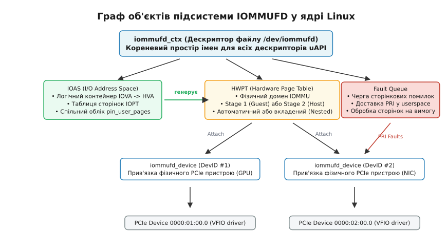
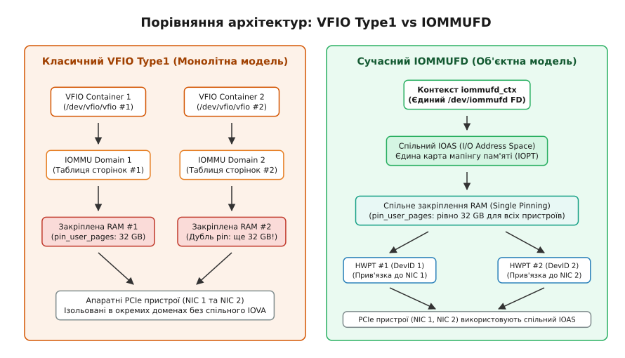
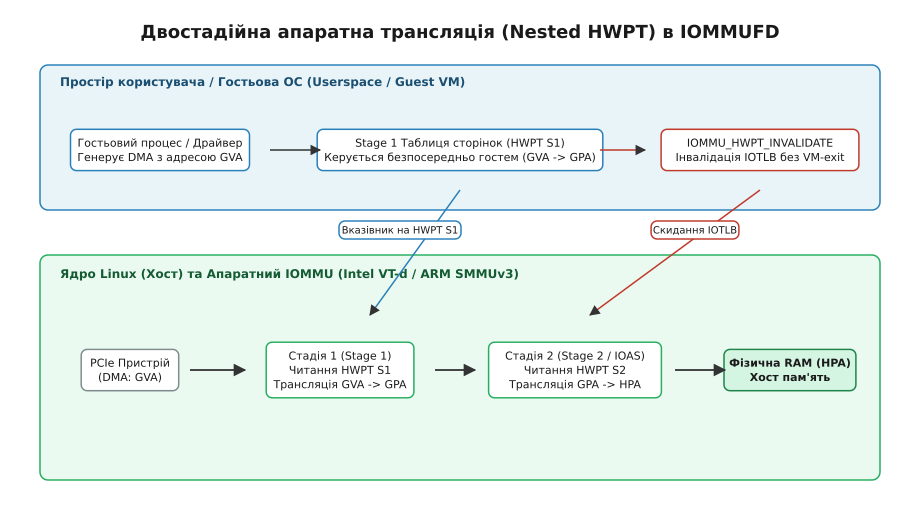
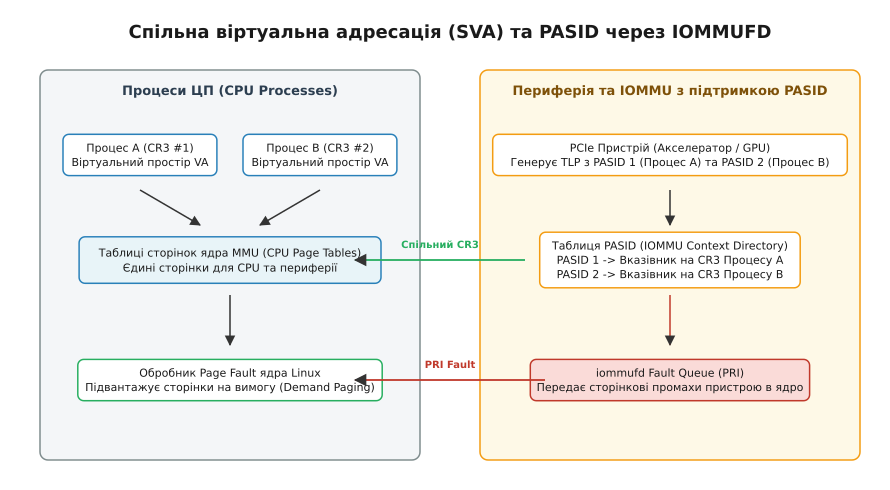

# IOMMUFD: керування таблицями IOMMU з простору користувача

<preknowlist>
- [Шина PCIe та підсистема PCI](topic:unix-linux/pci-in-linux) — ієрархія шин, TLP-транзакції, конфігураційний простір та ідентифікатори BDF.
- [Підсистема DMA та IOMMU](topic:unix-linux/dma-mapping-subsystem-and-iommu) — базові принципи трансляції IOVA в HPA та апаратної ізоляції пам'яті.
- [Парапрохідність пристроїв та IOMMU-групи (VFIO)](topic:unix-linux/vfio-passthrough) — монолітні контейнери VFIO Type1, закріплення сторінок та модель ізоляції.
- [Віртуальний IOMMU (vIOMMU)](topic:unix-linux/viommu-virtual-iommu) — двостадійна вкладена трансляція та емуляція IOMMU для вкладених гостьових ОС.
</preknowlist>

Високонавантажені сервіси обробки мережевого трафіку 100/400 GbE на базі DPDK, розподілені сховища NVMe-over-Fabrics під керуванням SPDK та гіпервізори QEMU/KVM з прокиданням десятків графічних прискорювачів GPU стикаються з критичним падінням продуктивності при використанні класичного фреймворку прямої парапрохідності VFIO Type1. Коли QEMU запускає віртуальну машину з чотирма фізичними PCIe-пристроями, кожен з яких розміщено в окремому монолітному контейнері `/dev/vfio/vfio`, ядро Linux змушене для кожного контейнера незалежно викликати функцію `pin_user_pages()` над тим самим 64-гігабайтним пулом оперативної пам'яті гостя. Це спричиняє чотирикратний дубльований облік пам'яті в системі (лічильник `locked_vm` штучно зростає до 256 GB), призводить до передчасного вичерпання лімітів `RLIMIT_MEMLOCK` і розтягує час ініціалізації віртуальної машини з мілісекунд до десятків секунд. Крім того, монолітна архітектура Type1 не дозволяє процесу простору користувача напряму керувати апаратними двостадійними таблицями вкладеної трансляції (Nested Page Tables) або розділяти адресні простори між процесором та прискорювачем через ідентифікатори процесів PASID.

Цю системну кризу розв'язує підсистема ядра **IOMMUFD** (символьний пристрій `/dev/iommufd`, впроваджений у Linux 6.2). IOMMUFD повністю відокремлює керування адресними просторами вводу-виводу від фізичних дескрипторів пристроїв і надає простору користувача прямий, безпечний та апаратно незалежний об'єктний інтерфейс до таблиць трансляції сторінок I/O Page Tables (IOPT).

---

## 1. Архітектурні обмеження класичного VFIO Type1

Щоб зрозуміти причини появи IOMMUFD, необхідно детально проаналізувати внутрішню модель, яку драйвер `vfio_iommu_type1` використовував понад десять років для організації доступу до IOMMU.

### Монолітна зв'язка «Контейнер = Домен = Закріплення»

У класичному фреймворку VFIO (від англ. *Virtual Function I/O*) базовою одиницею взаємодії з простором користувача є контейнер (`/dev/vfio/vfio`). Контейнер створював жорстку, неподільну сутність, яка одночасно поєднувала в собі три принципово різні системні ролі:

1. **Точка прив'язки IOMMU-групи:** Контейнер слугував дескриптором, до якого процес підключав файли груп `/dev/vfio/<group_id>`.
2. **Апаратний домен IOMMU:** Контейнер безпосередньо керував одним фізичним доменом апаратного контролера IOMMU (Intel VT-d або AMD-Vi).
3. **Адресний простір трансляції:** Контейнер містив єдину карту відповідності адрес `IOVA → HPA` (I/O Virtual Address → Host Physical Address) та відповідав за безпосередній виклик функції `pin_user_pages()`.

```
[ Процес простору користувача (QEMU / DPDK) ]
                    │
                    ▼
       ┌─────────────────────────┐
       │     VFIO Container      │ ◄─── Монолітний блок ядра:
       │    (/dev/vfio/vfio)     │      • IOMMU Domain
       └────────────┬────────────┘      • Адресний простір IOVA
                    │                   • Жорстке закріплення RAM
         ┌──────────┴──────────┐
         ▼                     ▼
┌─────────────────┐   ┌─────────────────┐
│ IOMMU Group #1  │   │ IOMMU Group #2  │
│ (PCIe Device A) │   │ (PCIe Device B) │
└─────────────────┘   └─────────────────┘
```

Така монолітна конструкція унеможливлювала гнучке комбінування системних ресурсів:

* **Проблема надлишкового закріплення пам'яті (Pinning Explosion):** Якщо два пристрої вимагали різних карт адрес або перебували в несумісних апаратних доменах IOMMU, їх доводилося розносити по різних контейнерах. У результаті ядро закріплювало ті самі сторінки оперативної пам'яті хоста двічі, тричі або чотири рази. Витрати системної пам'яті на структури `struct page` та лічильники `pinned_vm` зростали пропорційно кількості відкритих контейнерів.
* **Блокування гарячого підключення (Hotplug Bottleneck):** У Type1 неможливо створити таблицю сторінок заздалегідь. Адресний простір ініціалізувався лише тоді, коли в контейнер додавалася перша група з фізичним пристроєм. Якщо останній пристрій від'єднувався (наприклад, під час вилучення мережевої карти), контейнер автоматично знищував увесь домен і скидав усі налаштовані мапінги сторінок.
* **Відсутність нативної підтримки Nested Paging:** Апаратні контролери IOMMU останніх поколінь здатні виконувати трансляцію у дві стадії: Стадія 1 (Stage 1) транслює віртуальні адреси гостя (GVA) у гостьові фізичні адреси (GPA), а Стадія 2 (Stage 2) транслює GPA у фізичні адреси хоста (HPA). Драйвер Type1 не мав абстракцій для розділення цих стадій, що змушувало виробників обладнання розробляти власні пропрієтарні розширення.

Детальніше про хронологію розвитку парапрохідності та передумови відмови від контейнерів Type1 можна прочитати у вставці [Від монолітного контейнера VFIO Type1 до об'єктної моделі IOMMUFD](topic:unix-linux/iommufd-subsystem/hist-vfio-type1-to-iommufd.md).

---

## 2. Об'єктна декомпозиція та архітектура IOMMUFD

IOMMUFD (від англ. *I/O Memory Management Unit File Descriptor*) докорінно змінює філософію роботи з апаратним IOMMU. Замість єдиного монолітного контейнера підсистема надає процесу простору користувача файловий дескриптор `/dev/iommufd`, усередині якого розгортається зв'язний орієнтований граф незалежних об'єктів ядра.

Кожен об'єкт має чітко розмежовану відповідальність і позначається 32-бітним числовим ідентифікатором (uAPI ID).


*Взаємозв'язок між контекстом iommufd_ctx, логічним адресним простором IOAS, апаратними таблицями HWPT та прив'язаними пристроями.*

### Чотири базові сутності IOMMUFD

1. **`iommufd_ctx` (Контекст файлового дескриптора):** Кореневий простір імен, що створюється під час відкриття файлу `/dev/iommufd`. Усі об'єкти (IOAS, HWPT, DevID, Fault Queue, VIOMMU) існують виключно в межах свого контексту. Закриття дескриптора ініціює безпечне каскадне очищення всіх пов'язаних ресурсів.
2. **`IOAS` (I/O Address Space — логічний адресний простір):** Суто програмна абстракція карти пам'яті вводу-виводу. IOAS містить внутрішнє червоно-чорне дерево інтервалів `iopt_pages` (I/O Page Table). Саме на рівні IOAS викликається системна функція `pin_user_pages()` для фіксації оперативної пам'яті хоста. Головна особливість: IOAS не прив'язаний до жодного фізичного пристрою чи конкретного контролера IOMMU.
3. **`HWPT` (Hardware Page Table — апаратна таблиця сторінок):** Об'єкт, що інкапсулює реальну фізичну таблицю трансляції конкретного апаратного контролера IOMMU (Intel VT-d Extended Context/SLPT, AMD-Vi Device Table або ARM SMMUv3 Stream Table Entry). HWPT транслює IOVA в HPA згідно з апаратними правилами кремнію.
4. **`iommufd_device` (DevID — прив'язаний фізичний пристрій):** Представляє фізичний периферійний пристрій PCIe, підключений до IOMMUFD за допомогою дескриптора пристрою VFIO.

> 🔧 **Навіщо це.** Декомпозиція дозволяє створити єдиний логічний адресний простір IOAS (наприклад, для 128 GB пам'яті віртуальної машини), закріпити фізичні сторінки рівно один раз, а потім підключити до цього простору одночасно мережеву карту Intel, графічний прискорювач NVIDIA та NVMe-контролер. Ядро самостійно згенерує відповідні апаратні таблиці HWPT для різних контролерів IOMMU, уникаючи багаторазового закріплення сторінок.

### Внутрішні структури ядра: дерево інтервалів `IOPT`

Усередині структури `struct iommufd_ioas` ядро Linux підтримує дерево інтервалів `struct io_pagetable` (`IOPT`). Це дерево організовано на базі червоно-чорного дерева з розширенням меж інтервалів (`augmented rbtree`), що дозволяє виконувати пошук довільних діапазонів пам'яті за логарифмічний час `O(log N)`.

Дерево IOPT оперує двома основними типами вузлів:
* `struct iopt_pages`: Представляє неперервний діапазон фізично закріплених сторінок оперативної пам'яті хоста (`HVA → struct page*`), для яких виконано `pin_user_pages()`.
* `struct iopt_area`: Представляє логічне відображення частини діапазону `iopt_pages` на конкретні віртуальні адреси вводу-виводу (`IOVA`).

Завдяки розділенню `pages` та `area`, один масив зафіксованих фізичних сторінок може бути відображений за кількома різними адресами IOVA без повторного виклику важкої процедури блокування пам'яті.

Коли процес викликає `IOMMU_IOAS_UNMAP` для частини великої області (наприклад, розвідображення кількох мегабайтів усередині 1 GB буфера), ядро не руйнує весь масив `iopt_pages`. Замість цього алгоритм розщеплює вузол `iopt_area` на дві частини, оновлює діапазони в апаратних HWPT, скидає IOTLB для видаленого сегмента та зменшує лічильники використання сторінок без зайвих блокувань підсистеми віртуальної пам'яті.

### Автоматичні та явні таблиці HWPT

IOMMUFD підтримує два режими створення апаратних таблиць сторінок:

* **Автоматичний режим (Kernel-Managed HWPT):** Користувацький додаток створює `IOAS`, наповнює його відображеннями через `IOMMU_IOAS_MAP` і підключає пристрій безпосередньо до `ioas_id`. Ядро Linux автоматично знаходить або виділяє сумісний `HWPT` для відповідного IOMMU-домену та транслює логічні інтервали `IOPT` у фізичні сторінки апаратури.
* **Явний режим (User-Managed / Nested HWPT):** Програма явно викликає команду `IOMMU_HWPT_ALLOC`, створюючи спеціалізований домен (наприклад, батьківський домен Стадії 2 для вкладеної віртуалізації або домен з підтримкою апаратного протоколювання брудних сторінок).

---

## 3. Механізм відображення пам'яті (DMA Mapping) та спільне закріплення сторінок

Управління пам'яттю в підсистемі IOMMUFD базується на двошаровій моделі: логічний шар інтервалів (`IOPT`) та апаратний шар драйверів IOMMU.

### Покроковий механізм відображення пам'яті

Коли процес простору користувача виконує системний виклик `ioctl(iommufd, IOMMU_IOAS_MAP)`:

1. **Валідація діапазону:** Ядро перевіряє передані параметри `user_va` (віртуальна адреса процесу хоста HVA), `length` та цільову адресу `iova`. Адреси повинні бути строго вирівняні по межі сторінки апаратного MMU (зазвичай 4096 байтів).
2. **Перевірка накладання (Interval Tree Lookup):** У дереві інтервалів `iopt_pages` виконується пошук на предмет колізій. Якщо встановлено прапорець `IOMMU_IOAS_MAP_FIXED_IOVA`, а діапазон уже зайнятий, повертається помилка `EEXIST`. Якщо прапорець відсутній, алгоритм виділяє перший вільний діапазон у просторі IOVA.
3. **Фіксація сторінок (Page Pinning):** Ядро викликає `pin_user_pages_fast()`. Фізичні сторінки блокуються в оперативній пам'яті: підсистема віртуальної пам'яті ядра позбавляється права переміщувати їх під час дефрагментації (`compaction`), скидати в swap або об'єднувати через KSM. Лічильник `locked_vm` процесу збільшується на кількість заблокованих сторінок.
4. **Синхронізація з HWPT:** Якщо до цього IOAS уже підключено один або кілька об'єктів `HWPT`, ядро паралельно викликає колбеки драйверів відповідних IOMMU (`iommu_map()`). Контролери IOMMU оновлюють свої багаторівневі сторінкові таблиці в фізичній пам'яті.
5. **Інвалідація кешів:** Якщо оновлювався наявний діапазон або пристрій уже був активним, ядро відправляє апаратну команду `IOTLB Flush` для очищення застарілих записів у буферах трансляцій на шині PCIe.


*Порівняння монолітної моделі контейнерів VFIO Type1 та декомпозованої об'єктної архітектури IOMMUFD з єдиним закріпленням фізичної пам'яті.*

### Спільне використання закріплених сторінок (Single Pinning Sharing)

Головний виграш IOMMUFD у продуктивності пам'яті забезпечує внутрішня структура `iopt_pages`. 

Розглянемо випадок підключення трьох PCIe-пристроїв (Device 1, Device 2, Device 3), під'єднаних до двох різних фізичних контролерів IOMMU (IOMMU A та IOMMU B). Всі три пристрої використовують спільний адресний простір віртуальної машини розміром 64 GB.

* У класичному VFIO Type1 потрібно створити 3 контейнери. Ядро виконає три виклики `pin_user_pages()`. Сумарний зафіксований обсяг: `3 · 64 = 192 GB` пам'яті в системному обліку.
* В IOMMUFD створюється один `IOAS`. Виклик `IOMMU_IOAS_MAP` фіксує сторінки один раз: рівно `64 GB`. До цього IOAS підключаються два апаратні домени `HWPT 1` (для IOMMU A) та `HWPT 2` (для IOMMU B). Обидва HWPT посилаються на одне спільне дерево `iopt_pages`. Заощадження пам'яті ядра та ліміту `locked_vm` становить 300%.

### Атомарне копіювання мапінгів `IOMMU_IOAS_COPY`

IOMMUFD вводить системну команду `IOMMU_IOAS_COPY`, яка дозволяє скопіювати карту адрес з одного IOAS в інший IOAS усередині того самого файлового дескриптора. 

Замість повторного сканування сторінок процесу через `pin_user_pages()`, ядро просто збільшує лічильники посилань на внутрішні структури `iopt_pages`. Це зменшує час створення тіньових таблиць сторінок та ізольованих середовищ обробки з сотень мілісекунд до кількох мікросекунд.

---

## 4. Двостадійна апаратна трансляція (Nested Paging) та віртуалізація vIOMMU

Одним із найскладніших завдань віртуалізації є вкладене прокидання пристроїв (Nested Device Passthrough), коли віртуальна машина L1 (гіпервізор гостя) прокидає фізичний PCIe-пристрій у свою власну вкладену віртуальну машину L2.

### Проблема емуляції Shadow IOMMU

Якщо апаратне забезпечення не підтримує двостадійну трансляцію, гіпервізор хоста L0 змушений використовувати **тіньові таблиці сторінок (Shadow IOMMU)**. Кожна спроба гостя L1 змінити свої сторінки IOMMU або скинути IOTLB спричиняє дорогий вихід із режиму віртуалізації (VM-Exit), перехоплення операції емулятором QEMU в L0, виконання системного виклику та перепрограмування фізичного контролера IOMMU. На навантаженнях із динамічним виділенням DMA-буферів (наприклад, обробка дрібних мережевих пакетів) до 80% процесорного часу витрачається виключно на обслуговування перемикань VMX non-root / root.

### Двостадійна трансляція на рівні кремнію

Сучасні процесорні архітектури з підтримкою Intel VT-d 3.0+ Scalable Mode та ARM SMMUv3 містять апаратні блоки двостадійної трансляції (Two-Stage Translation):

* **Стадія 1 (Stage 1 / S1):** Транслює віртуальну адресу гостя (GVA) або віртуальну адресу вводу-виводу гостя (Guest IOVA) у фізичну адресу гостя (GPA). Таблицями сторінок Стадії 1 повністю володіє і керує операційна система гостя L1.
* **Стадія 2 (Stage 2 / S2):** Транслює фізичну адресу гостя (GPA) у справжню апаратну фізичну адресу хоста (HPA). Таблицями сторінок Стадії 2 керує гіпервізор хоста L0.


*Двостадійна апаратна трансляція: пряме читання гостьових таблиць Stage 1 апаратним IOMMU та інвалідація кешу через IOMMU_HWPT_INVALIDATE.*

### Апаратні структури Intel VT-d Scalable Mode та ARM SMMUv3

Щоб краще уявити, як фізичний контролер оперує вкладеними таблицями, розглянемо специфіку двох провідних архітектур:

1. **Intel VT-d Scalable Mode:**
   * Ієрархія трансляції починається з таблиці **Root Table** (256 записів, індексованих за номером шини PCI Bus).
   * Запис Root Table вказує на контекстну таблицю **Context Table** (індексується за номером Device:Function).
   * У масштабованому режимі Context Table вказує на каталог **PASID Directory**, який адресує окремі записи **PASID Table Entry**.
   * Кожен запис PASID Table містить два незалежні вказівники: покажчик на таблиці першої стадії (First-Stage Paging / Stage 1, керовані гостем L1) та покажчик на таблиці другої стадії (Second-Stage Paging / Stage 2 EPT, керовані хостом L0).
2. **ARM SMMUv3:**
   * Контролер використовує таблицю потоків **Stream Table**, записи якої називаються **Stream Table Entries (STE)** та індексуються за ідентифікатором StreamID (відповідає PCI BDF).
   * STE вказує на дескриптор контексту **Context Descriptor (CD)** для трансляції Стадії 1 (GVA → GPA) та безпосередньо містить покажчик на дескриптори трансляції Стадії 2 (GPA → HPA).

### Реалізація Nested HWPT в IOMMUFD

IOMMUFD надає стандартний, не залежний від виробника кремнію інтерфейс для побудови вкладеної трансляції:

1. **Створення батьківської таблиці Stage 2:** Гіпервізор хоста QEMU створює базовий об'єкт `HWPT` за допомогою виклику `IOMMU_HWPT_ALLOC` з прапорцем `IOMMU_HWPT_ALLOC_NESTED_PARENT`. Цей об'єкт прив'язується до пам'яті гостя L1 (GPA → HPA).
2. **Виділення вкладеної таблиці Stage 1:** Коли гостьове ядро L1 ініціалізує власний віртуальний контролер vIOMMU і записує адресу своєї кореневої таблиці сторінок у гостьові регістри, QEMU в L0 викликає `IOMMU_HWPT_ALLOC` з типом `IOMMU_HWPT_TYPE_VTD_S1` або `IOMMU_HWPT_TYPE_ARM_SMMUV3`. У полі `pt_id` передається дескриптор батьківського HWPT Стадії 2, а вказівник на таблиці L1 передається безпосередньо у фізичний IOMMU.
3. **Прямий доступ кремнію:** Відтепер фізичний контролер IOMMU апаратно зчитує таблиці Стадії 1 безпосередньо з оперативної пам'яті гостя. Будь-які модифікації записів у гостьових сторінках виконуються гостем напряму в RAM **без єдиного VM-Exit**.
4. **Пакетна інвалідація `IOMMU_HWPT_INVALIDATE`:** Єдиний випадок, коли гостю потрібна допомога хоста — це скидання кешу IOTLB фізичного IOMMU після видалення сторінок. QEMU перехоплює гостьову команду інвалідації та передає масив записів у ядро через `IOMMU_HWPT_INVALIDATE`. Ядро Linux записує запити в апаратну чергу команд IOMMU (Invalidation Queue) за один атомарний системний виклик.

### Об'єкти `VIOMMU` у IOMMUFD (Linux 6.8+)

Починаючи з версії Linux 6.8, підсистема IOMMUFD отримала розширення у вигляді об'єкта `struct iommufd_viommu`. Об'єкт VIOMMU представляє віртуальний екземпляр IOMMU, асоційований з конкретною гостьовою віртуальною машиною. 

VIOMMU інкапсулює:
* Апаратну конфігурацію віртуальної черги команд інвалідації.
* Виділення віртуальних ідентифікаторів PASID (vPASID).
* Відображення віртуальних векторів переривань MSI/MSI-X для безпечної доставки сповіщень у гостьові процесори (vInterrupt Injection).

---

## 5. Спільна віртуальна адресація (SVA) та ідентифікатори PASID

Традиційна модель парапрохідності вимагає, щоб пристрій працював з окремим адресним простором IOVA, відмінним від віртуального простору процесора. Програма змушена виділяти буфери через спеціальні API, виконувати маршалінг покажчиків і підтримувати складні структури відображення.

Технологія **Shared Virtual Addressing (SVA)** дозволяє периферійному пристрою PCIe розділяти єдиний адресний простір віртуальної пам'яті процесу користувача.

### Ідентифікатори PASID та таблиця контекстів

Для підтримки SVA шина PCIe використовує механізм **PASID (Process Address Space ID)**. PASID — це 20-бітний префікс у заголовку транзакційного пакета TLP, який позначає, якому саме процесу або потоку виконання належить ця транзакція DMA.

Контролер IOMMU перехоплює TLP-пакет із заданим номером шини (BDF) та ідентифікатором PASID. Замість окремої таблиці IOVA, IOMMU вибирає запис у таблиці контекстів PASID (Context Table Entry / Stream Table Entry), який вказує безпосередньо на **кореневу таблицю сторінок MMU процесора (`CR3` в x86-64 або `TTBR0_EL1` в ARM64)**.

```
[ Потік процесора (CR3) ] ──(VA: 0x7FFF0000)──> [ Таблиці MMU ядра ] ──(HPA)──> [ RAM ]
                                                        ▲
[ PCIe Пристрій з PASID ] ──(VA + PASID)──> [ IOMMU PASID Directory ] ─┘
```

Будь-який покажчик на структуру даних (наприклад, складений граф об'єктів або черга завдань), створений процесором у користувацькому просторі, може бути переданий у регістри пристрою без змін: пристрій читає пам'ять за тією ж самою віртуальною адресою `VA`.

### Служби трансляції адрес PCIe ATS та кеш ATC

Для мінімізації затримок на шині пристрої PCIe використовують стандарт **PCIe ATS (Address Translation Services)**. ATS дозволяє периферійному пристрою кешувати результати трансляції адрес у власному внутрішньому апаратному кеші — **ATC (Address Translation Cache)** або Device-IOTLB.

Робота протоколу ATS з IOMMUFD розгортається за три фази:

1. **Запит трансляції (Translation Request):** Перед початком DMA передачі пристрій надсилає пакет `Translation Request TLP` до Root Complex, вказуючи віртуальну адресу `VA` та свій `PASID`.
2. **Відповідь IOMMU (Translation Completion):** Контролер IOMMU виконує пошук у відповідній таблиці контексту `HWPT` і повертає пакет `Translation Completion TLP`, який містить фізичну адресу `HPA` та права доступу (Read/Write). Пристрій зберігає цей запис у своєму локальному ATC.
3. **Прямий DMA за HPA:** Подальші пакети читання/запису даних пристрій надсилає вже безпосередньо з фізичною адресою `HPA`, що усуває накладні витрати на трансляцію IOMMU для кожного окремого пакета на шині.

Коли ядро хоста або гостьова ОС змінює відображення сторінки чи вивільняє пам'ять, підсистема IOMMUFD надсилає команду інвалідації не лише у фізичний IOMMU, а й генерує спеціальний пакет **ATS Invalidation Request TLP** до самого пристрою PCIe, змушуючи його скинути застарілий запис зі свого внутрішнього кешу ATC.


*Механізм спільної віртуальної адресації SVA: використання єдиного адресного простору процесів ЦП та обробка сторінкових помилок пристрою через чергу Fault Queue.*

### Обробка апаратних сторінкових помилок (PCIe PRI та Fault Queue)

Оскільки пристрій працює з віртуальною пам'яттю процесу, окремі сторінки можуть бути ще не виділені в фізичній RAM (Demand Paging), вивантажені у файл підкачки (Swap) або позначені для копіювання при записі (Copy-on-Write).

Коли пристрій звертається до такої сторінки, контролер IOMMU не блокує систему збоєм `DMAR Fault`, а активує стандартний протокол **PCIe Page Request Interface (PRI)**:

1. Пристрій надсилає пакет запиту сторінки `Page Request TLP`.
2. Фізичний IOMMU генерує апаратне переривання та поміщає дескриптор помилки в системну чергу.
3. Підсистема IOMMUFD надає процесу простору користувача спеціальний об'єкт — **Fault Queue** (виділяється командою `IOMMU_FAULT_QUEUE_ALLOC`).
4. Події сторінкових промахів доставляються через неблокуючий файловий дескриптор, сумісний з `epoll()`.
5. Підсистема ядра Linux підвантажує сторінку в оперативну пам'ять (викликаючи стандартний обробник `handle_mm_fault()`) та надсилає пристрою підтвердження `Page Request Response TLP`. Пристрій повторює транзакцію DMA, яка тепер успішно транслюється в HPA.

---

## 6. Порівняльний аналіз: VFIO Type1 проти IOMMUFD

Підсистема IOMMUFD повністю замінює драйвер `vfio_iommu_type1`, забезпечуючи значну перевагу за всіма ключовими технічними критеріями:

| Критерій порівняння | Класичний VFIO Type1 | Сучасний IOMMUFD |
| :--- | :--- | :--- |
| **Архітектурна модель** | Монолітний контейнер (`/dev/vfio/vfio`) | Декомпозований граф об'єктів (`/dev/iommufd`) |
| **Керування пам'яттю** | Жорстке закріплення для кожного контейнера | Єдине закріплення в `IOAS` (Single Pinning) |
| **Накладні витрати пам'яті** | `N · RAM` при `N` контейнерах | `1 · RAM` незалежно від кількості пристроїв |
| **Швидкість гарячого підключення (Hotplug)** | Повільна (потрібна повна перебудова домену) | Миттєва (прив'язка до вже наявного `IOAS`) |
| **Вкладена віртуалізація (Nested)** | Програмний Shadow IOMMU (тисячі VM-Exit) | Апаратний Nested HWPT (прямий доступ кремнію) |
| **Інвалідація IOTLB** | Поодинокі блокуючі виклики | Пакетна інвалідація `IOMMU_HWPT_INVALIDATE` |
| **Підтримка SVA / PASID** | Відсутня або фрагментована | Нативна підтримка PASID та Fault Queue |
| **Зворотна сумісність** | Базовий драйвер ядра | Повна емуляція через `CONFIG_IOMMUFD_VFIO_CONTAINER` |

### Шар зворотної сумісності (Compatibility Layer)

Для забезпечення безшовного переходу існуючого програмного забезпечення ядро Linux надає конфігураційну опцію `CONFIG_IOMMUFD_VFIO_CONTAINER=y`. 

Коли старий додаток (наприклад, застаріла версія QEMU або DPDK) відкриває файл `/dev/vfio/vfio` і викликає команду `ioctl(VFIO_SET_IOMMU, VFIO_TYPE1_IOMMU)`, ядро Linux прозоро транслює ці виклики у створення внутрішнього контексту IOMMUFD та автоматичне виділення об'єктів `IOAS`. Додаток продовжує працювати без перекомпіляції, водночас отримуючи переваги оптимізованого обліку заблокованих сторінок.

Детальний приклад написання коду для прямої взаємодії з IOMMUFD наведено у проектній вставці [Прив'язка PCIe-пристрою та налаштування DMA через /dev/iommufd](topic:unix-linux/iommufd-subsystem/proj-iommufd-device-bind.md).

Вичерпний довідник структур, числових констант та параметрів усіх системних викликів наведено в довідковій вставці [Інтерфейс ioctl підсистеми /dev/iommufd](topic:unix-linux/iommufd-subsystem/api-iommufd-ioctl.md).

---

## 7. Практична інтеграція у виробничі середовища: QEMU, DPDK та SPDK

Сучасні відкриті фреймворки віртуалізації та високопродуктивної обробки даних перейшли на використання IOMMUFD як основного бекенду для роботи з обладнанням.

### Інтеграція в гіпервізор QEMU

Починаючи з версії QEMU 9.0, у гіпервізор додано об'єктний бекенд `iommufd`. Адміністратор може налаштувати віртуальну машину на використання IOMMUFD через параметри командного рядка:

```bash
qemu-system-x86_64 \
    -object iommufd,id=iommufd0 \
    -device vfio-pci,host=0000:01:00.0,iommufd=iommufd0 \
    -device vfio-pci,host=0000:02:00.0,iommufd=iommufd0 \
    -enable-kvm -m 32G -cpu host
```

У цій конфігурації QEMU прив'язує обидва пристрої до єдиного контексту `iommufd0`. Пам'ять віртуальної машини (32 GB) закріплюється в хості рівно один раз. При включенні емульованого віртуального IOMMU (`-device intel-iommu,nested-paging=on`) QEMU автоматично використовує апаратні вкладені таблиці Stage 1 / Stage 2, знижуючи навантаження на хостові процесори на 40–70% під час активної роботи гостьових драйверів.

### Інтеграція в Data Plane Development Kit (DPDK)

У середовищі DPDK новий бекенд шини `rte_bus_pci` з підтримкою IOMMUFD усуває затримки при динамічному виділенні пам'яті:

* Під час запуску застосунку драйвер створює єдиний `IOAS` для пулу пам'яті Hugepages.
* Якщо додаток динамічно підключає додаткові мережеві адаптери (Hotplug NIC) у процесі маршрутизації трафіку, пристрої миттєво підключаються до вже готового `ioas_id`.
* Усувається необхідність зупиняти опитування черг (Poll Mode Queues) для оновлення сторінкових карт сусідніх портів.

### Інтеграція в Storage Performance Development Kit (SPDK)

SPDK використовує IOMMUFD для прямого доступу до просторів імен NVMe через протоколи PCIe та RDMA:

* **Масштабованість черг I/O:** Сотні черг введення-виведення NVMe (`nvme-cli`, SPDK bdev) транслюють буфери передачі блоків даних без блокування таблиць сторінок ядра.
* **Відстеження брудних сторінок (Dirty Page Tracking):** IOMMUFD надає апаратне протоколювання сторінок, у які пристрій виконав запис через DMA (`IOMMU_HWPT_ALLOC_DIRTY_TRACKING`). За допомогою виклику `IOMMU_HWPT_GET_DIRTY_BITMAP` гіпервізор зчитує бітову маску модифікованих сторінок безпосередньо з апаратних таблиць IOMMU хоста. Це дозволяє виконувати живу міграцію високонавантажених баз даних та сховищ віртуальних дисків без відчутних пауз у записі даних.

### Налаштування ядра та діагностика IOMMUFD

Для активації повної функціональності IOMMUFD на хост-системі в параметрах завантаження ядра Linux (`/etc/default/grub`) вказуються відповідні прапорці контролера IOMMU:

```bash
GRUB_CMDLINE_LINUX="intel_iommu=on iommu=pt vfio_pci.enable_sva=1"
```

Перевірити стан підсистеми та доступність символьного пристрою можна через стандартні вікна ядра:

```bash
# Перевірка наявності символьного пристрою
ls -la /dev/iommufd

# Перевірка реєстрації драйвера в sysfs
ls -la /sys/class/iommu/
```

Якщо пристрій `/dev/iommufd` присутній у системі, процеси простору користувача отримують повноцінний доступ до сучасного об'єктного графа IOMMU, усуваючи накладні витрати на дубльоване закріплення пам'яті та забезпечуючи максимальну пропускну здатність вводу-виводу.
