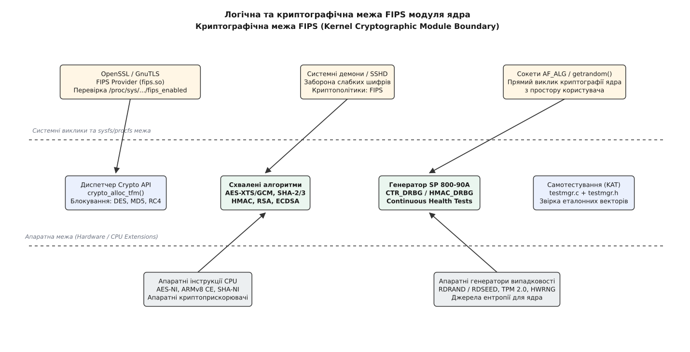
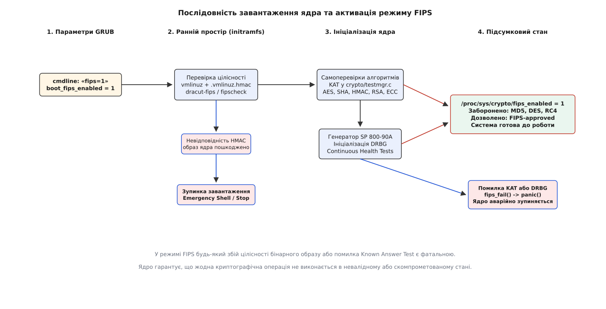
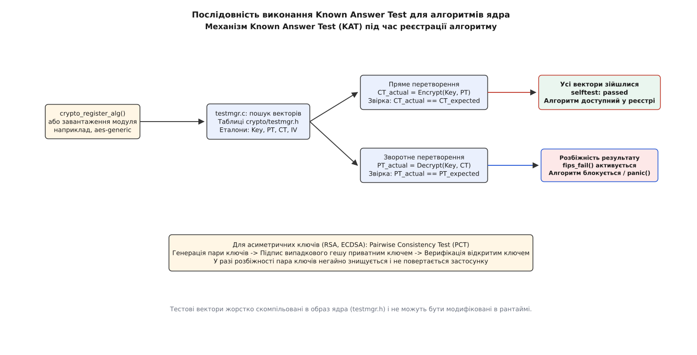

# Режим FIPS у ядрі: fips_enabled, самоперевірки й звужений набір алгоритмів

<preknowlist>
- [Криптографічна підсистема ядра](topic:unix-linux/kernel-crypto-api) — диспетчеризація шифрів, узагальнені й драйверні імена, пріоритети та трансформації.
- [Модулі ядра: завантаження, параметри, залежності](topic:unix-linux/kernel-modules) — динамічне довантаження об'єктного коду в адресний простір ядра.
- [Криптографічні гешфункції](topic:programming/cryptographic-hash) — односторонні перетворення (SHA-2, SHA-3) та коди автентичності повідомлень HMAC.
- [Блоковий шифр](topic:algorithms/block-cipher) — симетричні блокові перетворення (AES, 3DES) та режими зчеплення блоків (CBC, CTR, XTS, GCM).
- [Пристрої генерації випадкових чисел](topic:unix-linux/random-devices) — збір ентропії, криптографічні пули ядра та системний виклик `getrandom()`.
- [Інтерфейс тюнінгу ядра sysctl та /proc/sys](topic:unix-linux/sysctl-kernel-tuning-interface) — динамічне налаштування параметрів ядра через віртуальну файлову систему.
- [Підпис модулів ядра](topic:unix-linux/module-signing) — перевірка автентичності та цілісності коду за допомогою цифрових підписів PKCS#7 / X.509.
</preknowlist>

Коли на сервері обробки банківських транзакцій, вузлі зв'язку критичної інфраструктури чи урядовій робочій станції випадковий збій пам'яті (bit flip), прихована апаратна вада процесора або несанкціонована модифікація бінарного файлу змінює поведінку криптографічного алгоритму, стандартне ядро продовжує роботу. З точки зору звичайної операційної системи, якщо функція шифрування повернула байти без явного аварійного збою пам'яті, операція вважається успішною. Однак у криптографії навіть мінімальне відхилення в обчисленні таблиць підстановок AES або пошкодження внутрішнього стану генератора псевдовипадкових чисел перетворює шифротекст на вразливий потік або робить приватні ключі доступними для відновлення зловмисником.

Усунення цієї невизначеності вимагає переведення операційної системи в стан, де криптографічна правильність гарантується до початку виконання будь-яких прикладних задач. Цю функцію в ядрі Linux виконує режим FIPS.

## Стандарт FIPS 140 та криптографічна межа ядра

Стандарти FIPS 140-2 та FIPS 140-3 (Federal Information Processing Standards Publication 140) визначають вимоги безпеки для криптографічних модулів у державних, фінансових та регульованих секторах. Стандарт класифікує модулі за чотирма рівнями безпеки (Security Levels 1–4):
- **Level 1:** базовий рівень для програмного забезпечення загального призначення, що вимагає специфікації криптографічної межі, повного набору алгоритмічних самоперевірок при старті, перевірки цілісності бінарного образу та застосування виключно схвалених стандартів.
- **Level 2–4:** додають вимоги фізичного захисту від розкриття апаратних корпусів, захист від атак сторонніми каналами (side-channel attacks), виявлення спроб зондування та автоматичне знищення ключів (zeroization) при порушенні фізичної оболонки.

Ядро Linux є монолітним програмним комплексом і сертифікується за рівнем **Security Level 1** як «Kernel Crypto API Cryptographic Module». 

Головним поняттям стандарту є **криптографічна межа** (Cryptographic Boundary) — чітко окреслений логічний периметр, який розділяє довірений криптографічний код від решти системи.



*Криптографічна межа ізолює дозволені алгоритми та детерміністичний генератор випадковості від несхвалених примітивів.*

У ядрі Linux криптографічна межа охоплює:
1. Бінарний образ ядра `vmlinux` / `vmlinuz` у пам'яті (криптографічні примітиви, скомпільовані статично).
2. Криптографічні модулі розширення ядра (`.ko`), розміщені в каталозі `/lib/modules/$(uname -r)/kernel/crypto/`.
3. Внутрішні таблиці векторів та менеджер самоперевірок `testmgr`.
4. Детерміністичний генератор випадкових бітів (DRBG) за стандартом NIST SP 800-90A.

Усе, що знаходиться поза цією межею (простір користувача, системні виклики VFS, сокети `AF_ALG`, зовнішні мережеві стеки), розглядається як зовнішній споживач послуг криптомодуля.

Детальний аналіз переходу від перших патчів сертифікації ядра до сучасного стандарту FIPS 140-3 винесено в окремий історичний нарис [📜 Історія FIPS 140 у ядрі Linux: від RHEL-патчів до FIPS 140-3](topic:unix-linux/kernel-fips-mode/hist-fips140-in-linux.md).

## Увімкнення та стан режиму: `CONFIG_CRYPTO_FIPS`, `fips=1` і `fips_enabled`

Підтримка FIPS закладається на етапі збірки ядра через конфігураційну опцію `CONFIG_CRYPTO_FIPS=y`. Ця опція компілює файл `crypto/fips.c`, де оголошено глобальні змінні стану та модуль sysctl:

```c
int fips_enabled;
EXPORT_SYMBOL_GPL(fips_enabled);
```

Однак наявність скомпільованого коду не активує жорсткі обмеження за замовчуванням. Щоб система перейшла в сертифікований режим, адміністратор зобов'язаний передати параметр у командному рядку завантажувача:

```
fips=1
```

Під час раннього старту ядра функція розбору параметрів `fips_enable()` встановлює значення `fips_enabled = 1`. Після ініціалізації віртуальної файлової системи `procfs` ядро експортує цей прапорець у вузол `/proc/sys/crypto/fips_enabled`.

```bash
$ cat /proc/sys/crypto/fips_enabled
1
```

Файл має права доступу `0444` (тільки читання). Змінити цей параметр під час роботи системи неможливо: будь-яка спроба виклику `write()` повертає помилку `-EACCES` або `-EPERM`. Єдиний спосіб вимкнути FIPS — прибрати параметр із завантажувача та повністю перезавантажити операційну систему.



*Ініціалізація ядра в режимі FIPS: від передачі параметра завантажувача до перевірки цілісності образу та алгоритмічних тестів.*

> 🔧 **Навіщо це.** Багато прикладних служб (OpenSSL, GnuTLS, OpenSSH, NSS, веб-сервери Nginx/Apache) під час старту зчитують `/proc/sys/crypto/fips_enabled`. Якщо цей файл повертає `1`, бібліотеки автоматично переводять себе у сертифікований режим: блокують застарілі шифри у протоколах TLS/SSH, відмовляються підписувати сертифікати за допомогою MD5/SHA-1 та забороняють використання RSA-ключів, коротших за 2048 біт. Таким чином, ядерний прапорець слугує єдиним авторитетним джерелом криптографічної політики для всієї операційної системи.

Повний перелік параметрів ядра, прапорців конфігурації Kconfig та структур C API наведено у довіднику [📋 Інтерфейси та конфігурація FIPS у ядрі: параметри, sysctl та прапорці Crypto API](topic:unix-linux/kernel-fips-mode/api-fips-sysfs-and-crypto.md).

## Перевірка цілісності ядра та модулів: `.vmlinuz.hmac`

Вимога FIPS полягає в тому, що до виконання будь-яких криптографічних операцій модуль повинен довести, що його двійковий образ не був модифікований або пошкоджений на диску.

Для самого ядра перевірка цілісності виконується до старту основних процесів операційної системи за допомогою коду автентичності повідомлень HMAC-SHA256.

```
       Диск /boot/                             Ранній простір (initramfs)
┌─────────────────────────┐               ┌─────────────────────────────────┐
│ vmlinuz-<версія>        │───читання────►│ Обчислення HMAC-SHA256(vmlinuz) │
│ .vmlinuz-<версія>.hmac  │───читання────►│ Порівняння з еталонним файлом   │
└─────────────────────────┘               └────────────────┬────────────────┘
                                                           │
                                        ┌──────────────────┴──────────────────┐
                                        ▼                                     ▼
                                  [Хеш збігся]                        [Розбіжність]
                                        │                                     │
                                        ▼                                     ▼
                               Продовження старту                    Аварійна зупинка
                               монтування /sysroot                  Emergency Shell / Stop
```

### Механізм роботи HMAC-підпису ядра

1. **Генерація еталона під час встановлення:** коли дистрибутив компілює або встановлює пакет ядра (RPM або DEB), спеціальний скрипт пост-інсталяції запускає утиліту `fipscheck` або `sha256hmac`. Вона зчитує стиснений образ ядра `/boot/vmlinuz-$(uname -r)` і обчислює значення HMAC-SHA256 за допомогою заздалегідь визначеного секретного ключа сертифікації постачальника. Результат записується в контрольний файл `/boot/.vmlinuz-$(uname -r).hmac`.
2. **Перевірка в ранньому просторі initramfs:** під час завантаження системи завантажувач передає ядру початковий RAM-диск initramfs. Спеціалізований модуль генератора початкового RAM-диска (зокрема модуль `fips` генератора `dracut`) перехоплює виконання на фазі `pre-mount` / `pre-pivot`. До того як коренева файлова система `/` буде змонтована для читання та запису, initramfs монтує завантажувальний розділ `/boot` (який вказується параметром `boot=` або `fips=boot=`), зчитує `vmlinuz`, розраховує його HMAC і побайтово порівнює його з файлом `.vmlinuz.hmac`.
3. **Реакція на невідповідність або відсутність файлу:** якщо файл `.hmac` відсутній або розрахований геш не збігається хоча б в одному байті, система безпеки вважає образ скомпрометованим. Завантаження негайно припиняється: система виводить критичне повідомлення в системну консоль, скидає керування в аварійну командну оболонку (Emergency Shell) і відмовляється монтувати системний розділ `/sysroot`. Жоден процес простору користувача не запускається.

### Підпис модулів ядра (`CONFIG_MODULE_SIG`)

Криптографічні алгоритми, що реалізовані у вигляді модулів розширення (наприклад, оптимізовані інструкціями процесора `aesni-intel.ko`, `sha512-x86_64.ko`), зберігаються у файловій системі окремо від основного двійкового файлу ядра.

Коли увімкнено режим FIPS, ядро примусово активує суворий режим перевірки підписів модулів (еквівалент параметра `module.sig_enforce=1`). Під час виконання системного виклику `init_module()` або `finit_module()` ядро:
1. Зчитує цифровий підпис PKCS#7, прикріплений до кінця двійкового файлу `.ko`.
2. Перевіряє підпис за допомогою відкритого ключа, який жорстко вбудований у захищений системний брелок ключів ядра (System Keyring).
3. Якщо модуль не підписаний, підписаний невідомим ключем або його двійковий код було модифіковано, завантаження блокується з поверненням системної помилки `-EKEYREJECTED` або `-ELIBBAD`. Несертифікований код не може потрапити в адресний простір ядра.

## Обов'язкові алгоритмічні самоперевірки: Known Answer Tests (KAT)

Навіть якщо бінарний код ядра повністю цілісний, апаратна частина процесора чи пам'ять можуть мати дефекти, що призводять до спотворення результатів обчислень. Тому FIPS вимагає проведення обов'язкових алгоритмічних самоперевірок перед тим, як будь-який зареєстрований алгоритм стане доступним для використання.

У ядрі Linux цей механізм реалізовано в підсистемі менеджера криптотестів `crypto/testmgr.c`.



*Known Answer Test виконує пряме та зворотне шифрування за еталонними векторами до публікації алгоритму в реєстрі.*

### 1. Життєвий цикл реєстрації та перевірки алгоритму

Коли драйвер криптографічного примітиву завантажується в ядро, він викликає функцію реєстрації `crypto_register_alg()` або `crypto_register_skcipher()`. У цей момент алгоритм не стає негайно доступним для споживачів. Замість цього підсистема `algboss` (диспетчер реєстрації) виконує наступну послідовність кроків:

1. **Створення личинкового стану (Larval):** ядро створює тимчасовий об'єкт `struct crypto_larval`, який займає місце в реєстрі та блокує звичайні запити на виділення.
2. **Виклик менеджера тестування:** ядро запускає функцію `alg_test()` з `crypto/testmgr.c`, передаючи драйверне ім'я нової реалізації (наприклад, `xts-aes-aesni`).
3. **Пошук еталонних тестових векторів:** менеджер `testmgr` знаходить у скомпільованих статичних масивах `crypto/testmgr.h` набір офіційних тестових векторів NIST для відповідного класу шифру.
4. **Виконання перевірки Known Answer Test:** ядро виділяє внутрішній контекст трансформації та проганяє вектори. Якщо алгоритм блоковий, тестуються різні розміри ключів (128, 192, 256 біт) та різні довжини блоків.
5. **Публікація або знищення:** якщо всі тести завершилися успішно, ядро виставляє в описі алгоритму прапорець `CRYPTO_ALG_TESTED`, видаляє тимчасовий larval-об'єкт та переводить статус `selftest` у значення `passed`. Тепер алгоритм доступний для споживачів. Якщо тест провалився, алгоритм негайно видаляється з реєстру, а система реагує відповідно до політики помилок FIPS.

### 2. Структура Known Answer Tests для різних класів криптографії

Суть тесту полягає у звірці результату роботи алгоритму на фіксованому наборі вхідних даних із заздалегідь відомим еталонним значенням (Test Vector), отриманим від NIST.

Для симетричного блокового шифру (наприклад, AES у режимі CBC) процедура виконується у два обов'язкових кроки:
- **Пряме перетворення (Encryption KAT):** алгоритму передається фіксований відкритий текст `Plaintext`, еталонний ключ `Key` та вектор ініціалізації `IV`. Алгоритм виконує шифрування. Отриманий шифротекст побайтово порівнюється з еталоном `Ciphertext`.
- **Зворотне перетворення (Decryption KAT):** отриманий або заданий шифротекст розшифровується тим самим ключем. Результат порівнюється з оригінальним `Plaintext`.

Для автентифікованого шифрування (AEAD, наприклад, AES-GCM або AES-CCM) перевірка ускладнюється: крім відкритого тексту та шифротексту, алгоритм обов'язково перевіряє правильність обчислення та верифікації імітовставки (Authentication Tag) над додатковими автентифікованими даними (Additional Authenticated Data, AAD). Якщо пошкоджено хоча б один біт тегу, операція розшифрування зобов'язана повернути помилку цілісності `-EBADMSG`.

Для алгоритмів сімейства SHA-2 (SHA-256, SHA-512), SHA-3 та HMAC менеджер `testmgr` передає тестовий масив байтів і перевіряє, чи збігається обчислений дайджест із зафіксованим стандартом значенням. Для HMAC перевірка обов'язково охоплює операцію внесення ключа та обчислення подвійного гешування:

```
HMAC(K, m) = H((K' ⊕ opad) ∥ H((K' ⊕ ipad) ∥ m))
```

### 3. Тест парної узгодженості (Pairwise Consistency Test — PCT)

Для алгоритмів асиметричної криптографії (RSA, ECDSA), де генерація ключів створює нову пару «приватний ключ — відкритий ключ», FIPS вимагає проведення тесту узгодженості при кожній генерації:

1. **Генерація пари ключів:** модуль обчислює компоненти асиметричної пари `(K_priv, K_pub)`. Для RSA це генерація простих чисел `p` та `q`, розрахунок модуля `n = p · q`, відкритої експоненти `e` та секретної експоненти `d`. Для ECDSA це вибір випадкового секретного скаляра `d` та обчислення точки кривої `Q = d · G`.
2. **Операція підпису:** модуль генерує тестовий геш-дайджест `m` та обчислює цифровий підпис `s = Sign(K_priv, m)`.
3. **Операція верифікації:** модуль виконує перевірку `Verify(K_pub, m, s)`.
4. **Асиметричне шифрування (для схем з підтримкою шифрування):** тестовий блок даних шифрується відкритим ключем `c = Encrypt(K_pub, m)` та розшифровується приватним ключем `m' = Decrypt(K_priv, c)`. Результат `m'` зобов'язаний точно збігтися з вихідним повідомленням `m`.

Якщо операція верифікації або розшифрування зазнає невдачі, новостворена пара ключів негайно затирається нулями в пам'яті (zeroized), не передається викликаючому процесу, а системний виклик генерації повертає помилку.

### Безпека відмови: поведінка `fips_fail()`

У стандартному режимі роботи ядра, якщо якийсь алгоритм провалює самотестування, ядро виводить попередження в `dmesg` і помічає цей конкретний алгоритм прапорцем помилки, дозволяючи решті системи працювати далі.

У режимі FIPS діє принцип **Fail-Safe** (гарантована безпека відмови). При будь-якому збої Known Answer Test викликається функція `fips_fail_notify()` з `crypto/fips.c`. Залежно від конфігурації дистрибутива ядро виконує аварійну паніку:

```c
panic("FIPS self-test failure on algorithm %s\n", driver_name);
```

Ядро повністю зупиняє виконання коду процесора. Це унеможливлює ситуацію, коли скомпрометований алгоритм продовжує обробляти секретні дані.

## Звуження набору алгоритмів: схвалені та заборонені примітиви

У звичайному режимі ядро Linux підтримує десятки застарілих та спеціалізованих алгоритмів (MD4, MD5, DES, 3DES, RC4, Blowfish, Twofish, CAST5), які необхідні для сумісності зі старими мережевими протоколами (наприклад, застарілі версії CIFS/SMB або старі тунелі IPsec).

Коли встановлено `fips_enabled = 1`, ядро проводить жорстку селекцію під час будь-якого виклику створення криптографічного контексту (`crypto_alloc_tfm()`, `crypto_alloc_skcipher()`, `crypto_alloc_shash()`).

```
Запит на створення алгоритму (наприклад, через crypto_alloc_shash("md5", 0, 0))
                                  │
                                  ▼
                   Перевірка прапорця fips_enabled
                     ┌────────────┴────────────┐
                     ▼                         ▼
            [fips_enabled == 0]       [fips_enabled == 1]
                     │                         │
                     ▼                         ▼
             Звичайний пошук           Перевірка схвалення:
           і виділення алгоритму       Чи є алгоритм у FIPS-списку?
                                         ┌─────┴─────┐
                                         ▼           ▼
                                       [Так]       [Ні]
                                         │           │
                                         ▼           ▼
                                     Виділення   Повернення -ENOENT
                                     дозволено   (блокування операції)
```

### Статус алгоритмів за FIPS 140-3

1. **Повністю дозволені (FIPS-approved):**
   - Блокове симетричне шифрування: AES (довжина ключа 128, 192, 256 біт) у режимах CBC, CTR, XTS, GCM, CCM, OFB, CFB.
   - Криптографічні геші: сімейство SHA-2 (SHA-224, SHA-256, SHA-384, SHA-512) та SHA-3 (SHA3-224, SHA3-256, SHA3-384, SHA3-512).
   - Коди автентичності: HMAC на базі схвалених гешів, AES-CMAC, AES-GMAC.
   - Асиметрична криптографія: RSA (ключі ≥ 2048 біт), ECDSA/ECDH (еліптичні криві NIST P-256, P-384, P-521).
2. **Повністю заблоковані (Prohibited / Disallowed):**
   - DES, Blowfish, Twofish, CAST5, Camellia, RC4 (arc4) — блокуються повністю.
   - MD4, MD5 — блокуються для будь-яких криптографічних операцій.
   - Triple-DES (3DES / DES-EDE3) — згідно з ревізією стандарту NIST SP 800-131A Rev 2 повністю заборонений для шифрування нових даних.
3. **Алгоритми внутрішнього використання (`CRYPTO_ALG_FIPS_INTERNAL`):**
   - Деякі примітиви, які втратили стійкість для загального використання, можуть бути дозволені виключно для вузьких внутрішніх потреб ядра.
   - Наприклад, алгоритм SHA-1 заборонено використовувати для створення нових цифрових підписів або сертифікатів. Проте він може бути позначений прапорцем `CRYPTO_ALG_FIPS_INTERNAL` і задіяний ядром для верифікації старих підписів або у складі протоколів генерації псевдовипадкових чисел, де колізійна стійкість не є критичною. Простір користувача не може виділити такий алгоритм через `AF_ALG`.

## Апаратні прискорювачі та драйвери розвантаження

У сучасних серверах шифрування виконується не лише універсальними ядрами процесора через переносний C-код, а й спеціалізованими апаратними блоками:
- Інструкції мікропроцесора: Intel AES-NI, AMD AVX/VAES, ARMv8 Cryptographic Extensions.
- Апаратні карти та інтегровані співпроцесори розвантаження (Hardware Crypto Offload): Intel QuickAssist Technology (QAT), AMD Cryptographic Coprocessor (CCP), NXP CAAM, Marvell NITROX/OCTEON.

Усі ці пристрої реєструються в Crypto API як асинхронні драйвери. У режимі FIPS до них висуваються суворі вимоги:

1. **Індивідуальні KAT для апаратного ASIC:** під час ініціалізації драйвера PCI контролер апаратного прискорювача зобов'язаний виконати власні апаратні Known Answer Tests через свої кільця черг DMA до того, як оголосить ядру про готовність приймати робочі пакети.
2. **Неможливість підміни драйвера:** якщо апаратний прискорювач провалює KAT, ядро в режимі FIPS блокує не лише цей пристрій, а й усю реєстрацію, запобігаючи неконтрольованому тихому перемиканню на неперевірені рушії.
3. **Ізоляція ключів у DMA:** структури пам'яті, що передаються контролеру DMA, повинні очищатися одразу після завершення операції шифрування, щоб запобігти витоку ключів у залишкові сегменти пам'яті хоста.

## Генерація випадкових чисел за стандартом NIST SP 800-90A (DRBG)

Генерація криптографічних ключів, векторів ініціалізації та випадкових міток автентифікації (nonces) критично залежить від генератора псевдовипадкових чисел.

У звичайному режимі сучасне ядро Linux використовує для пулу `/dev/urandom` та системного виклику `getrandom()` швидкий потоковий генератор на базі алгоритму ChaCha20. Хоча ChaCha20 є криптографічно стійким, він не включений до офіційного переліку детерміністичних генераторів випадкових бітів стандарту NIST SP 800-90A.

Тому при компіляції та роботі в режимі FIPS ядро задіює спеціальну підсистему **DRBG** (`crypto/drbg.c`).

```
 Джерела ентропії (Entropy Sources)
 ┌─────────────────────────────────────────────────────────────┐
 │ • Апаратні інструкції CPU (RDRAND / RDSEED)                 │
 │ • Таймінги апаратних переривань та дискових подій           │
 │ • CPU Jitter (флуктуації часу виконання інструкцій)         │
 └──────────────────────────────┬──────────────────────────────┘
                                │
                                ▼
 ┌─────────────────────────────────────────────────────────────┐
 │ Тестування справності ентропії (NIST SP 800-90B Health Tests)│
 │ • Repetition Count Test (перевірка на «залипання»)          │
 │ • Adaptive Proportion Test (перевірка розподілу)            │
 └──────────────────────────────┬──────────────────────────────┘
                                │ внесення ентропії (Seed)
                                ▼
 ┌─────────────────────────────────────────────────────────────┐
 │ Детерміністичний генератор SP 800-90A (DRBG)                │
 │ • CTR_DRBG (на базі AES-256)                                │
 │ • HMAC_DRBG (на базі SHA-512)                               │
 └──────────────────────────────┬──────────────────────────────┘
                                │
                                ▼
         Видача псевдовипадкових бітів у ядро та getrandom()
```

### Механізми DRBG у ядрі

1. **Реалізації алгоритму:** ядро підтримує три схвалені архітектури:
   - `CTR_DRBG`: використовує симетричний шифр AES (128, 192 або 256 біт) у лічильниковому режимі. Внутрішній стан складається з ключа `Key` та вектора `V`. При генерації нового блоку вектор `V` інкрементується та шифрується ключем: `Output = AES_Encrypt(Key, V)`. Це найбільш продуктивний варіант за наявності апаратних інструкцій AES-NI.
   - `HMAC_DRBG`: використовує ітеративне оновлення внутрішнього стану через HMAC-SHA256 або HMAC-SHA512. Внутрішній стан тримає значення `Key` та `V`. Має високу стійкість навіть на апаратних платформах без блокових прискорювачів.
   - `Hash_DRBG`: використовує пряме гешування стану `V` та константи `C`.
2. **Контроль порогу оновлення (Reseed Threshold):** генератор DRBG не може видавати нескінченну кількість псевдовипадкових даних з одного початкового заповнення (seed). Структура `struct drbg_state` веде лічильник згенерованих запитів `reseed_ctr`. Коли лічильник досягає ліміту `reseed_threshold` (наприклад, 2⁴⁸ операцій для CTR_DRBG), генератор блокує видачу даних і примусово запитує нову порцію ентропії від апаратних джерел ядра.
3. **Безперервне тестування ентропії (Health Tests за SP 800-90B):** під час збору шумів від апаратних джерел ядро постійно виконує два обов'язкових статистичних тести:
   - *Repetition Count Test:* перевіряє, чи не повторюється одне й те саме значення вибірки більше допустимої кількості разів поспіль (захист від зависання апаратного сенсора випадковості).
   - *Adaptive Proportion Test:* перевіряє, чи не з'являється певне значення у плаваючому вікні вибірок частіше, ніж дозволяє теоретична ймовірність.

Якщо будь-який тест здоров'я фіксує аномалію, джерело ентропії дискваліфікується, а стан DRBG оновлюється з резервних джерел.

## Мережеві підсистеми та шифрування дисків у режимі FIPS

Вплив прапорця `fips_enabled` поширюється на всі внутрішні споживачі криптографії в ядрі Linux.

### 1. Мережевий стек IPsec (`xfrm`)

Підсистема трансформації мережевих пакетів `xfrm` реалізує протоколи ESP (Encapsulating Security Payload) та AH (Authentication Header). У режимі FIPS база даних асоціацій безпеки (SAD) відхиляє спроби створення тунелів із застосуванням шифрів DES, 3DES, Blowfish або гешів HMAC-MD5. Спроба встановити тунель зі слабкими параметрами завершується помилкою ядра `-EINVAL`.

### 2. Дискове шифрування `dm-crypt` та LUKS2

Підсистема блокового шифрування `dm-crypt` виділяє алгоритми через Crypto API. У режимі FIPS:
- Дозволено створення контейнерів `aes-xts-plain64` з ключами 256 та 512 біт, `aes-cbc-essiv:sha256`.
- Заборонено використання застарілих режимів з одинарним DES або 3DES.
- Функція формування ключа з парольної фрази (KDF): стандарт LUKS2 підтримує Argon2id та PBKDF2. Оскільки NIST SP 800-132 стандартизує PBKDF2, у суворих FIPS-середовищах створення нових заголовків LUKS2 конфігурується з використанням PBKDF2 на базі HMAC-SHA256 або HMAC-SHA512.

### 3. kTLS (Kernel TLS Offload)

Підсистема ядра `kTLS` (`net/tls/`) виконує симетричне шифрування сесійних записів TLS безпосередньо у сокетному шарі ядра або на мережевій карті (NIC Offload). В активному FIPS-режимі `kTLS` дозволяє лише схвалені алгоритми AEAD: `AES_128_GCM`, `AES_256_GCM` та `AES_128_CCM`.

## Взаємодія з простором користувача та системними політиками

Ядро не працює у вакуумі: воно є фундаментом для системних бібліотек та сервісів простору користувача. Активація FIPS у ядрі викликає каскадну перебудову всього стека безпеки операційної системи.

```
       Параметр завантаження ядра: cmdline "fips=1"
                           │
                           ▼
          /proc/sys/crypto/fips_enabled = 1
                           │
       ┌───────────────────┼───────────────────┐
       ▼                   ▼                   ▼
┌──────────────┐    ┌──────────────┐    ┌──────────────┐
│   OpenSSL    │    │    GnuTLS    │    │  libgcrypt   │
│ FIPSProvider │    │ FIPS Policy  │    │  FIPS Mode   │
└──────┬───────┘    └──────┬───────┘    └──────┬───────┘
       │                   │                   │
       └───────────────────┼───────────────────┘
                           ▼
          Системні сервіси (SSHD, Web, VPN)
    • Заборона TLS 1.0 / 1.1 (виключно TLS 1.2 / 1.3)
    • Заборона cipher suites з CBC-3DES, RC4, MD5
    • Відхилення RSA ключів < 2048 біт
```

### Криптопровайдери простору користувача

1. **OpenSSL 3.x FIPS Provider:** починаючи з версії 3.0, OpenSSL розділив алгоритми на модулі. У режимі FIPS завантажується спеціальний динамічний провайдер `fips.so`, який має власний HMAC-підпис та виконує власні алгоритмічні KAT. Провайдер за замовчуванням блокує виклики `EVP_md5()`, `EVP_des_ede3_cbc()` та дозволяє лише сертифіковані операції.
2. **GnuTLS та libgcrypt:** перевіряють статус `/proc/sys/crypto/fips_enabled` під час ініціалізації (`gnutls_global_init()`). Якщо режим активний, бібліотека перемикає внутрішній кінцевий автомат у стан FIPS і відмовляється завантажувати закриті ключі, згенеровані на несертифікованих кривих або з короткими модульними розмірами.
3. **Системні криптополітики (Crypto Policies):** дистрибутиви корпоративного рівня (Red Hat Enterprise Linux, Fedora, SUSE, Ubuntu) використовують утиліту `update-crypto-policies --set FIPS`. Ця утиліта синхронізує конфігураційні файли OpenSSH, BIND, Kerberos, IPsec та системних бібліотек, приводячи їхні дозволені набори шифрів (cipher suites) у сувору відповідність до обмежень ядра.

### Контейнеризація та хмарні середовища

У середовищах Docker, Podman та Kubernetes ізоляція контейнерів через простори імен (`namespaces`) не створює окремого екземпляра ядра. Усі контейнери використовують спільне ядро хоста. Коли хост завантажено з `fips=1`:
- Файл `/proc/sys/crypto/fips_enabled` монтується всередину контейнерів зі значенням `1`.
- Системні бібліотеки всередині контейнера зчитують прапорець хоста та автоматично активують власні обмеження FIPS.
- Спроба запустити всередині контейнера образ із застарілим програмним забезпеченням, скомпільованим на базі жорстко зашитого алгоритму MD5 або 3DES, завершиться збоєм ініціалізації криптографічного контексту.

Практичний приклад створення системної утиліти на C та C++ для інспекції реєстру `/proc/crypto`, аудиту самоперевірок та тестування блокування заборонених шифрів через інтерфейс сокетів `AF_ALG` наведено у практичній роботі [⚙️ Практика: діагностика FIPS-режиму ядра та виклик криптографічних тестів](topic:unix-linux/kernel-fips-mode/proj-fips-status-and-kat.md).

## Діагностика, аудит та системна ціна режиму

Увімкнення FIPS змінює як часові характеристики завантаження системи, так і системні протоколи аудиту.

### 1. Перевірка журналу завантаження ядра (`dmesg`)

Під час старту ядра можна переконатися у проходженні тестів:

```bash
$ dmesg | grep -i fips
[    0.000000] Command line: BOOT_IMAGE=/vmlinuz-6.6.0-fips root=/dev/mapper/rhel-root ro fips=1
[    0.341205] fips: Kernel FIPS mode enabled
[    0.412980] alg: self-tests for xts(aes) passed
[    0.413102] alg: self-tests for gcm(aes) passed
[    0.413890] alg: self-tests for hmac(sha256) passed
[    0.414560] alg: self-tests for drbg_pr_ctr_aes256 passed
```

### 2. Журнал аудиту Linux Audit Framework (`auditd`)

Будь-які аномалії криптографічної підсистеми записуються демоном `auditd` у файл `/var/log/audit/audit.log` зі спеціальним типом події:

```
type=ANOM_CRYPTO_FAIL msg=audit(1692612000.123:45): op=self_test name=xts-aes-aesni res=0
```

Запис `res=0` означає збій перевірки і сигналізує системному адміністратору про критичний дефект обладнання або невідповідність бінарних файлів.

### 3. Продуктивність та накладні витрати

Часто виникає питання, наскільки режим FIPS сповільнює роботу системи:
- **Час холодного старту (Cold Boot):** запуск Known Answer Tests для десятків алгоритмів додає від 50 до 300 мілісекунд до загального часу завантаження ядра. У сучасних ядрах тести виконуються асинхронно в окремих робочих чергах процесора, тому на багатоядерних серверах затримка майже непомітна.
- **Швидкість шифрування в рантаймі (Throughput):** після проходження самоперевірок швидкість шифрування AES або гешування SHA-2 залишається ідентичною до звичайного режиму, оскільки код виконується тими самими апаратними інструкціями процесора (AES-NI / AVX-512 / ARMv8 Crypto).
- **Ціна генерації випадковості:** виклики `getrandom()` з використанням DRBG SP 800-90A мають дещо вищу латентність через суворий контроль лічильника ресідінгу та тести неперервності ентропії порівняно зі стандартним ChaCha20, проте ця різниця компенсується криптографічною детермінованістю та гарантіями NIST.

## Цілісна картина: надійність через передбачуваність

Режим FIPS у ядрі Linux не додає «нової магічної криптографії» — він використовує ті самі математичні алгоритми AES або SHA, що й звичайне ядро. Його фундаментальна цінність полягає в **системній передбачуваності та гарантії стану**:

1. **Гарантія цілісності:** жоден байт криптографічного коду ядра не виконується без попередньої верифікації HMAC бінарного образу та цифрових підписів модулів.
2. **Гарантія працездатності:** жоден алгоритм не допускається до обробки користувацьких даних без успішного проходження перевірки відомими еталонними векторами (KAT) та тестів узгодженості ключів.
3. **Гарантія безпеки за замовчуванням:** застарілі, зламані або потенційно вразливі криптографічні примітиви стають фізично недоступними для прикладних програм через системні інтерфейси ядра.
4. **Гарантія відмови (Fail-Safe):** при виявленні будь-якого внутрішнього збою підсистема переходить у стан аварійної зупинки, захищаючи конфіденційні дані від обробки в скомпрометованому середовищі.
