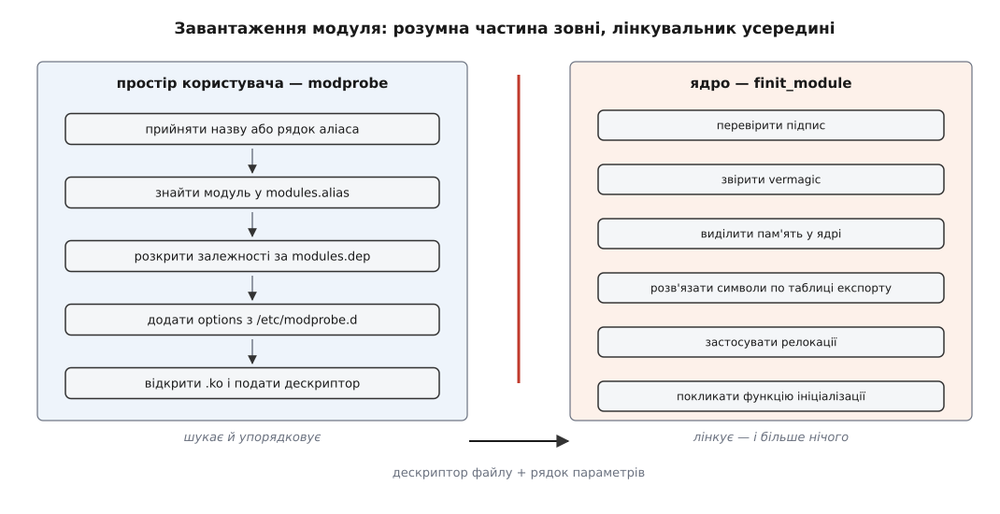
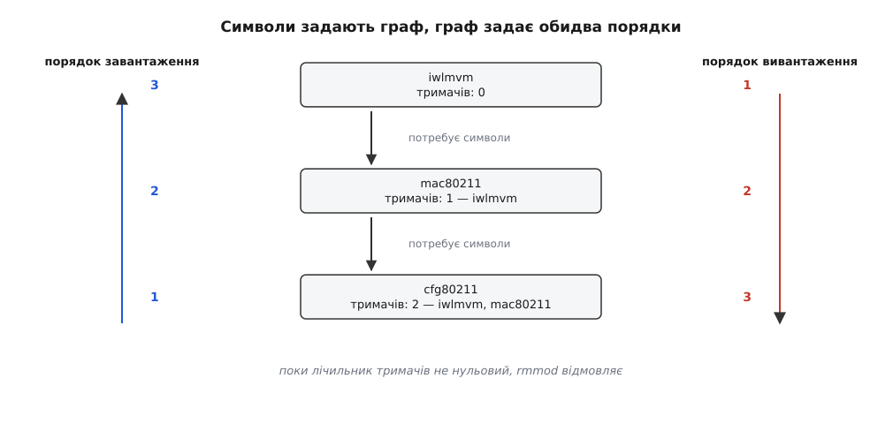
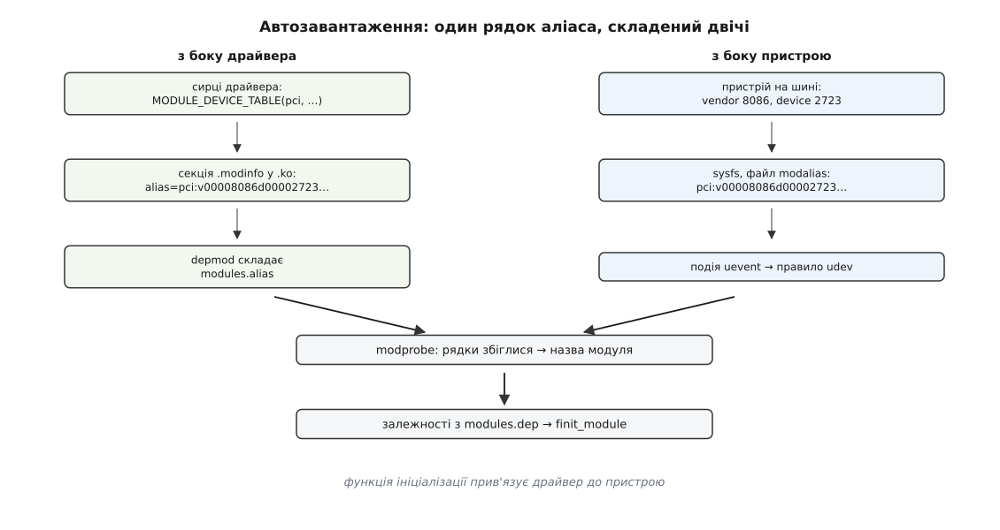

# Модулі ядра: завантаження, параметри, залежності

<preknowlist>
- [Монолітне ядро з модулями](topic:unix-linux/monolithic-with-modules) — модуль не є пісочницею: це шматок ядра, прилінкований пізніше за інші, з тими самими повноваженнями.
- [Ядро й простір користувача](topic:unix-linux/kernel-and-userspace) — де проходить межа привілею і хто з якого її боку живе.
- [Системний виклик](topic:unix-linux/syscall-mechanics) — єдиний спосіб програмі попросити ядро щось зробити.
- [Статичне й динамічне лінкування](topic:unix-linux/static-and-dynamic-linking) — нерозв'язані символи, таблиця експорту, релокації.
- [Псевдо-ФС](topic:unix-linux/pseudo-filesystems) — файли в `/proc` і `/sys` не лежать на диску, це вікна у структури ядра.
- [Модель пристроїв у sysfs](topic:unix-linux/sysfs-device-model) — шини, пристрої й драйвери як об'єкти, які ядро показує назовні.
</preknowlist>

Ви встромляєте в ноутбук USB-адаптер Wi-Fi, і за секунду в системі з'являється новий мережевий інтерфейс. Ніхто нічого не набирав. Тим часом у теці `/lib/modules/$(uname -r)` лежить кілька тисяч файлів `.ko`, і система щойно вибрала з них три-чотири потрібні, завантажила їх у правильному порядку й передала одному з них параметри, записані колись у конфігураційному файлі.

Спокуслива відповідь — «ядро розумне» — хибна, і саме тому вона заважає. Ядро в цій історії не шукає нічого. Воно навіть не знає, що на диску є файли `.ko`: файлову систему воно бачить, але переглядати теку з драйверами йому ніхто не доручав. Уся кмітливість тут — зовні, у просторі користувача, і тримається вона на кількох текстових покажчиках, які треба вміти перебудувати. Розберімо цей поділ праці до кінця, бо з нього випливає геть усе інше — і чому модуль «не вивантажується», і чому параметр, записаний у `/sys`, не подіяв, і чому чорний список іноді не спрацьовує.

## Ядро вміє лінкувати, але не вміє шукати

Усе, що ядро пропонує для роботи з модулями, — два системні виклики. Старіший, `init_module`, бере готовий образ модуля з пам'яті програми. Новіший, `finit_module` (з'явився у версії 3.8, 2013 рік), бере **дескриптор відкритого файлу** й читає образ сам.

Ця дрібна на вигляд різниця принципова. Коли образ приносить програма, ядро має справу лише з байтами, які йому передали, — а що там був за файл на диску, воно не знає. Коли ядро читає файл само, будь-яка політика цілісності, яка судить **файли** (як-от IMA), стосується того самого файлу, що лежить у файловій системі. Підпис, вшитий в образ, ядро перевіряє однаково в обох випадках — а от прив'язати перевірку до шляху на диску можна лише з новим викликом. Сучасні інструменти вживають тільки його: він ще й дозволяє віддати ядру стиснений `.ko` і не розпаковувати його в просторі користувача (у ядрах від 5.17).

Далі ядро робить рівно те, що робив би звичайний лінкувальник, тільки в собі й на ходу: перевіряє підпис, звіряє службовий рядок сумісності `vermagic`, виділяє пам'ять у своїй ділянці, розв'язує кожен нерозв'язаний символ модуля по власній таблиці експорту, застосовує релокації й кличе функцію ініціалізації. Після цього модуль нічим не відрізняється від решти ядра.

Чого ядро не робить — цілий список. Воно не відкриває файлів за назвою. Воно не знає, що модуль `iwlmvm` потребує модуля `mac80211`. Воно не читає конфігураційних файлів і не знає слова «blacklist». Воно навіть не має поняття «модуль, доступний для завантаження»: доки образ не подали через системний виклик, для ядра такого модуля не існує.



*Пошук за назвою, розкриття залежностей, читання конфігурації і збирання рядка параметрів — усе це відбувається в просторі користувача; ядро отримує дескриптор файлу з рядком параметрів і виконує єдину дію — лінкує.*

Отже, весь механізм, який ми звемо «завантаженням модуля», складається з двох дуже нерівних частин: тонкої ядрової (злінкувати те, що подали) і всієї решти — у просторі користувача. Цю решту реалізує бібліотека `libkmod` і набір побудованих на ній інструментів (`modprobe`, `insmod`, `rmmod`, `lsmod`, `modinfo`, `depmod`). Історично це були окремі програми з пакунка `module-init-tools`; наприкінці 2011 року їх переписали поверх спільної бібліотеки в проєкті `kmod`, і саме він живе в дистрибутивах сьогодні.

## Один невідомий символ — і потрібен порядок

Тепер подивімося, звідки взагалі береться поняття залежності. Воно не задеклароване й не вигадане людиною — воно випливає з лінкування.

Наскрізний приклад далі — карта Wi-Fi Intel AX200: не USB-адаптер зі вступу, а сусідній випадок того самого поділу праці, зате з довшим стосом модулів, на якому все видно краще. Її драйвер `iwlmvm` кличе експортовані `mac80211` функції — `ieee80211_alloc_hw`, щоб зареєструвати радіо, і щось із сімейства `ieee80211_rx*`, щоб віддавати підсистемі прийняті кадри. `mac80211` теж є модулем, тож у файлі `iwlmvm.ko` ці символи лишилися нерозв'язаними. Якщо подати такий модуль ядру, коли `mac80211` не завантажено, ядро чесно відмовить: у його таблиці експорту немає таких імен. Помилка виглядає як `Unknown symbol in module` у журналі ядра.

Отже, порядок завантаження диктується графом «хто чиї символи кличе». Хтось має цей граф побудувати — і ядро для цього не годиться, бо воно не читає файлів `.ko`.

Цим займається `depmod`. Він обходить усе дерево `/lib/modules/<версія>`, для кожного файла `.ko` дістає з ELF-таблиць два списки — символи, які модуль **експортує**, і символи, яких йому **бракує**, — і зводить одне з одним. Результат він кладе поруч, у той самий каталог: текстовий `modules.dep` і його двійковий покажчик `modules.dep.bin` для швидкого пошуку. Запускають `depmod` не вручну щодня — його викликає сценарій встановлення пакунка ядра, і саме тому нове ядро одразу має готовий покажчик.

`modprobe` цей покажчик читає. Отримавши назву, він знаходить рядок, розкриває залежності вглиб і подає ядру спершу їх, а потім сам модуль:

**Умова: питаємо, що насправді буде завантажено разом із драйвером `iwlmvm`.**

```
$ modprobe --show-depends iwlmvm
insmod .../kernel/net/wireless/cfg80211.ko.zst
insmod .../kernel/net/mac80211/mac80211.ko.zst
insmod .../kernel/drivers/net/wireless/intel/iwlwifi/iwlwifi.ko.zst
insmod .../kernel/drivers/net/wireless/intel/iwlwifi/mvm/iwlmvm.ko.zst
```

Чотири окремі системні виклики в чітко визначеному порядку — і жоден із них не є «завантаженням із залежностями» з погляду ядра. Ядро чотири рази зробило одну й ту саму просту річ.

Звідси практичний висновок, на якому спотикаються всі, хто вперше копіює зібраний модуль руками. `modules.dep` — **похідні дані**, знімок стану теки на момент останнього запуску `depmod`. Поклали новий `.ko` в дерево модулів — для `modprobe` його ще не існує, хоч файл і на місці; треба перебудувати покажчик (`depmod -a`). Тим часом `insmod`, який бере шлях до файла й нічого не шукає, завантажить його негайно — і саме тому `insmod` зручний під час розробки драйвера й непридатний у житті системи: він не знає ні залежностей, ні конфігурації, ні аліасів.

## Хто кого тримає

Залежність не закінчується на завантаженні. Коли ядро розв'язало символ модуля `iwlmvm` адресою з модуля `mac80211`, воно тим самим зафіксувало: доки перший живий, другий вивантажувати не можна. Ядро збільшує лічильник посилань постачальника і записує споживача до списку тримачів.

Це видно назовні. Третій стовпчик у `lsmod` — значення лічильника, четвертий — імена тримачів; те саме лежить у теці `/sys/module/<назва>/holders`.

```
$ lsmod | head -5
Module          Size  Used by
iwlmvm        602112  0
iwlwifi       434176  1 iwlmvm
mac80211     1355776  1 iwlmvm
cfg80211     1236992  3 iwlmvm,iwlwifi,mac80211
```

Порядок тут зворотний до порядку завантаження: `lsmod` показує `/proc/modules` як є, а ядро додає новий модуль на початок списку. `cfg80211` тримають одразу три модулі, `mac80211` та `iwlwifi` — по одному, а `iwlmvm` не тримає ніхто: він верхівка стосу. Розміри в другому стовпчику гуляють від збірки до збірки — важать саме лічильники.

Лічильник зростає не лише від інших модулів. Драйвер, чий файл пристрою хтось відкрив, і файлова система, чий том змонтовано, теж тримають свій модуль — усередині ядра для цього є функція `try_module_get`, яку підсистеми кличуть, перш ніж почати користуватися чужим кодом. Тому `rmmod` на живому драйвері відмовить із повідомленням «Module is in use», і жодного способу «просто вивантажити» немає: спершу треба прибрати всіх користувачів.

Вивантаження йде у зворотному порядку — від тримача до постачальника; `modprobe -r` робить це сам, `rmmod` вимагає називати модулі руками.

Тепер важливе, чого зазвичай не пояснюють. Вивантаження принципово складніше за завантаження, і не через лічильник. Лічильник рахує **явних** користувачів, а ядровий код устигає лишити по собі вказівники, яких ніхто не рахує: зареєстрований таймер, відкладену роботу в черзі, функцію зворотного виклику в чужій таблиці, елемент у списку. Пам'ять під код модуля звільняється, а таймер за мілісекунду стрибає туди, де вже нічого немає. Тому частина підсистем не підтримує вивантаження свідомо: модуль без функції виходу ядро позначає як `[permanent]`, і вивантажити його не можна взагалі.

Із цієї ж причини `rmmod -f` вимагає ядра, зібраного з окремим налаштуванням `CONFIG_MODULE_FORCE_UNLOAD`, і є не інструментом, а способом обвалити машину: він знімає модуль попри ненульовий лічильник.



*Той самий граф читається у два боки: стрілка «потребує символи» задає порядок завантаження знизу вгору, а лічильник тримачів забороняє вивантажувати постачальника раніше за споживача.*

## Від «встромили пристрій» до «завантажено драйвер»

Тепер повернімося до моменту, коли пристрій з'явився на шині — байдуже, встромлений щойно в USB чи знайдений під час переліку PCI на старті. Ядро знає про нього рівно те, що той сам про себе повідомив: для нашого адаптера Intel це виробник `0x8086` і модель `0x2723`. Яким файлом `.ko` це обслуговується, ядро не знає — ці відомості лежать усередині самих файлів, яких воно не читало.

Розв'язок побудовано на одному текстовому рядку, який складають з двох боків незалежно й порівнюють.

З боку **драйвера**: у сирцях є таблиця підтримуваних ідентифікаторів, і макрос `MODULE_DEVICE_TABLE` перетворює її на набір рядків-аліасів у службовій секції `.modinfo` модуля — на кшталт `pci:v00008086d00002723sv*sd*bc*sc*i*`, де зірочки означають «будь-що». Той самий `depmod` вибирає ці рядки з усіх модулів і складає покажчик `modules.alias`.

З боку **пристрою**: драйвер шини складає для знайденого пристрою такий самий рядок і виставляє його у файлі `modalias` у sysfs, а також вкладає у повідомлення про подію (`uevent`), яке ядро надсилає в простір користувача.

Далі спрацьовує [правило udev](topic:unix-linux/udev-rules), яке в кожному дистрибутиві виглядає приблизно однаково: якщо в події є `MODALIAS` — покликати завантажувач модулів із цим рядком. `modprobe` не знаходить модуля з такою назвою, тому шукає рядок серед аліасів (з урахуванням зірочок), дістає справжню назву модуля — і далі все як завжди: залежності, параметри, `finit_module`.

Є й другі двері — з самого ядра. Функція `request_module` дозволяє ядровому коду попросити завантажити модуль за назвою або аліасом; ядро запускає для цього програму з простору користувача, шлях до якої лежить у `/proc/sys/kernel/modprobe`. Так підтягуються речі, що не є пристроями: `fs-ext4`, коли монтують том невідомого типу, `net-pf-10` для протоколу IPv6, `crypto-sha256` для алгоритму, якого бракує. Механізм той самий, джерело запиту інше.

[Ця автоматика складалася п'ятнадцять років і встигла змінити три різні втілення](topic:unix-linux/kernel-modules/hist-autoload-evolution.md).



*Один і той самий рядок аліаса народжується двічі: із таблиці ідентифікаторів драйвера він потрапляє в `modules.alias`, а з опису знайденого пристрою — в подію; збіг цих двох рядків і є вибором модуля.*

> 🔧 **Навіщо це.** Коли пристрій «не визначається», ця схема дає точну послідовність перевірок замість гадання. Подивитися `cat /sys/bus/pci/devices/*/modalias` — чи взагалі є пристрій і який у нього рядок. Пошукати цей рядок у `modules.alias` — чи знає його хоч один модуль. Якщо не знає, драйвера для цієї моделі в системі просто немає, і жодне налаштування udev не допоможе. Якщо знає, а модуль не завантажився — питання до чорного списку й до журналу ядра.

## Параметри: коли значення потрапляє в змінну

Модуль може мати налаштування. З погляду коду це звичайна глобальна змінна, оголошена макросом:

```c
static int power_save = 1;
module_param(power_save, int, 0644);
MODULE_PARM_DESC(power_save, "увімкнути енергозбереження (1 — так, 0 — ні)");
```

Третій аргумент — права доступу до файлу, який ядро створить у `/sys/module/<модуль>/parameters/`. Нуль означає «файла не робити».

Значення підставляють у трьох місцях, і різниця між ними суттєва:

- у командному рядку інструмента: `modprobe iwlmvm power_save=0` — разово;
- у файлі в `/etc/modprobe.d/`: рядок `options iwlmvm power_save=0` — `modprobe` прочитає його й додасть до кожного завантаження цього модуля;
- у [командному рядку ядра](topic:unix-linux/bootloader-and-cmdline): `iwlmvm.power_save=0` — через крапку, з назвою модуля попереду.

Останній спосіб має особливість, заради якої його й тримають: він працює і для коду, **вкомпільованого в образ ядра**, де жодного `modprobe` не було й бути не могло. Ядро розбирає свій командний рядок на старті й розкладає значення по відповідних змінних.

Прочитати параметр можна завжди — файл у `/sys/module/...` показує справжній вміст змінної. А от запис у цей файл робить рівно одну річ: **міняє змінну**. Ніхто не повідомляє драйвера, що значення змінилося. Якщо драйвер прочитав `power_save` один раз у функції ініціалізації й поклав у свої структури, ваш запис не змінить нічого — саме звідси береться поширене здивування «параметр записався, а поведінка та сама». Драйвер, який хоче реагувати на зміну, мусить оголосити параметр із власними функціями читання-запису (`kernel_param_ops`) — тоді запис у файл покличе його код.

Що саме приймає конкретний модуль і які значення в нього типові, показує `modinfo -p <модуль>`: ці описи лежать у тій самій секції `.modinfo`, з якої `depmod` брав аліаси.

## Важелі: що завантажити, чого не завантажувати, і в якому порядку

Оскільки вибір робить програма в просторі користувача, керують ним звичайні конфігураційні файли в `/etc/modprobe.d/`. Директив небагато, але їхні межі варто розуміти точно.

**`blacklist <модуль>`** знімає з модуля право завантажитися **за аліасом**. Тобто udev, побачивши пристрій, більше не потягне цей драйвер. Але явна команда `modprobe <модуль>` спрацює як і раніше — це не заборона, а зняття з автоматичного добору. Крім того, чорний список нічого не важить для коду, вкомпільованого в ядро, і не діє на ранньому етапі завантаження, поки система живе в [тимчасовому корені](topic:unix-linux/initramfs) — той несе власну копію конфігурації, і після правки його треба перебудувати. Саме тому спроби «вимкнути» відеодрайвер часто виглядають так, ніби нічого не сталося.

**`install <модуль> /bin/false`** — важіль грубіший: він підміняє саму команду завантаження, і тепер жодна дорога до цього модуля не веде.

**`softdep <модуль> pre: <інший>`** описує залежність, якої `depmod` побачити не міг, бо в ELF-таблицях її немає: модуль не кличе чужих символів, але без сусіда не працює або мусить завантажитися після нього.

**`/etc/modules-load.d/`** розв'язує зворотну задачу — завантажити модуль, якого ніхто не просить: жодного пристрою немає, ядро мовчить, а модуль потрібен (типово це `nf_conntrack` чи `vfio-pci`). Список читає служба з набору [systemd](topic:unix-linux/systemd-model) під час старту.

[Повний перелік інструментів, директив і шляхів — з точними формами команд](topic:unix-linux/kernel-modules/api-module-tooling.md).

## Той самий код: модулем і всередині образу

Вибір між `y` і `m` у [конфігурації ядра](topic:unix-linux/kernel-config-and-build) не змінює ані сирців драйвера, ані його повноважень — лише момент лінкування. Наслідки, проте, цілком практичні.

Вкомпільований код ініціалізується під час старту ядра, у порядку, заданому таблицею початкових викликів, і не має ані `vermagic`, ані підпису — він і є ядро. Вивантажити його неможливо, а параметри йому передають лише через командний рядок. Перелік такого коду лежить у файлі `modules.builtin`, і `modprobe` його читає: попросивши завантажити вбудований драйвер, ви отримаєте тиху згоду замість помилки — щоб сценарії, написані для модульних збірок, не ламалися на монолітних.

Модуль натомість з'являється тоді, коли знадобився, і зникає, коли перестав бути потрібним. Ціна — обов'язок мати покажчики в актуальному стані й окремий клопіт із раннім завантаженням: драйвер контролера диска й файлової системи кореня потрібен ще до того, як корінь змонтовано, тож або він вкомпільований, або лежить в initramfs.

## Коли модуль не завантажується

Три відмови трапляються найчастіше, і кожна з них — уже пояснений механізм, який спрацював як належить.

`Unknown symbol in module` означає, що ядро не знайшло в себе імені, потрібного модулю: або не завантажено постачальника (типово — завантажували через `insmod`, а не `modprobe`), або модуль зібрано проти іншого дерева ядра, де цей символ звався інакше чи взагалі не експортувався.

`version magic ... should be ...` — не збігся службовий рядок сумісності. Модуль зібрано проти іншої версії або іншої конфігурації ядра; полагодити його «на місці» неможливо, лише перезібрати. [Чому ядро принципово не дає стабільного внутрішнього інтерфейсу](topic:unix-linux/kernel-abi-stability) — окрема, але дуже дотична розмова.

`Key was rejected by service` — не пройшов перевірку підпис. Так поводиться ядро із увімкненою перевіркою (звично — у режимі захищеного завантаження): самозібраний модуль треба підписати ключем, якому машина довіряє, і зареєструвати цей ключ.

Усі три повідомлення система пише в журнал ядра, а не на екран, тому `dmesg` після невдалого `modprobe` — не порада, а частина процедури.

---

Уся ця конструкція тримається на одному спостереженні: ядро зберігає лише лінкувальник, а знання про те, який файл кому потрібен і як його звати, живе у **похідних покажчиках** над текою файлів — `modules.dep`, `modules.alias`, `modules.symbols`, `modules.devname`. Похідні дані можна перебудувати з нуля однією командою, і в цьому вся зручність: майже кожна загадка виду «модуль не бачиться, не вантажиться, вантажиться не той» — це питання до покажчика або до конфігурації поруч із ним, а не до ядра.

Друге, менш очевидне: рішення «модулем чи вкомпільованим» — це рішення про **постачання**, а не про архітектуру. Дистрибутив робить майже все модулями, бо мусить везти одне ядро на будь-яке залізо; вбудована система, яка знає своє залізо наперед, спокійно вкомпілює все потрібне й узагалі не матиме теки `/lib/modules`. Код у обох випадках той самий, з тими самими повноваженнями, і різниця — лише в тому, коли він потрапляє в адресний простір ядра.
