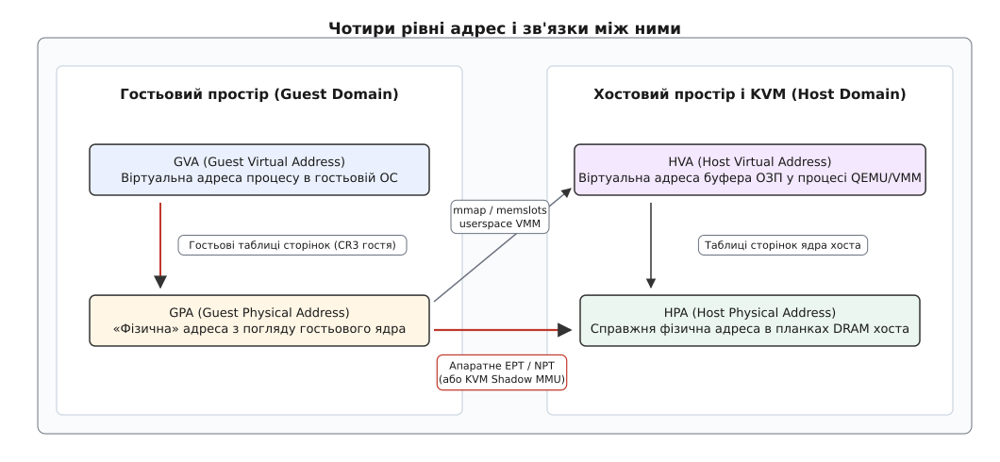
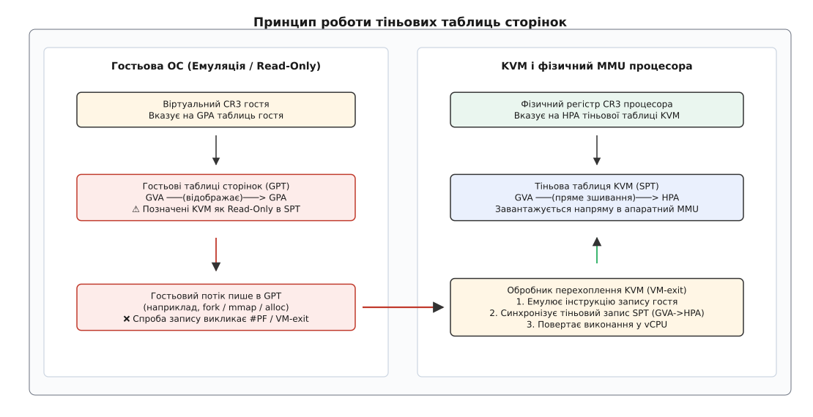
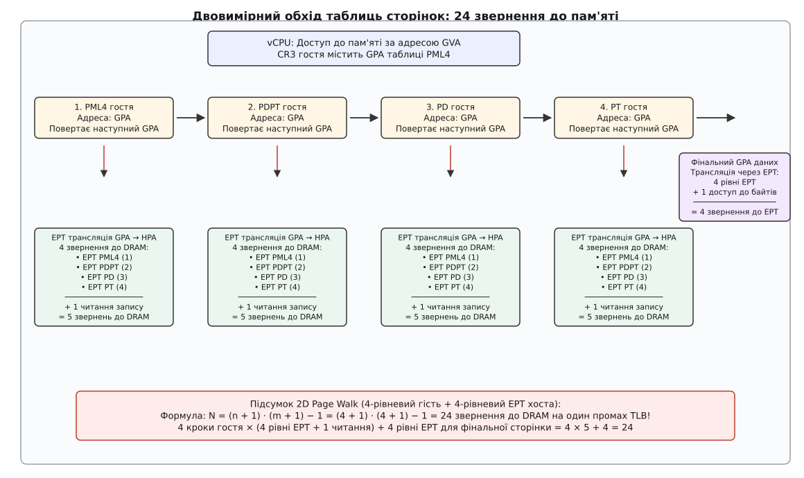
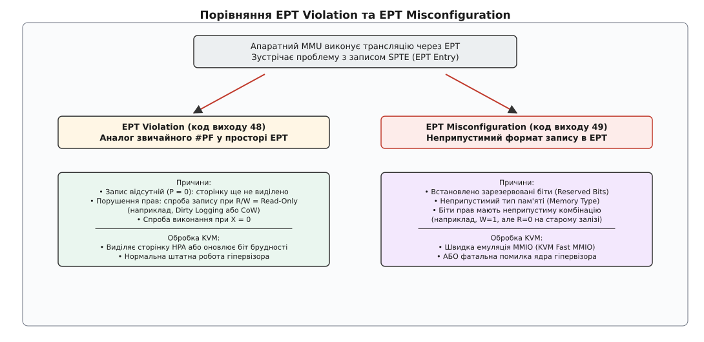
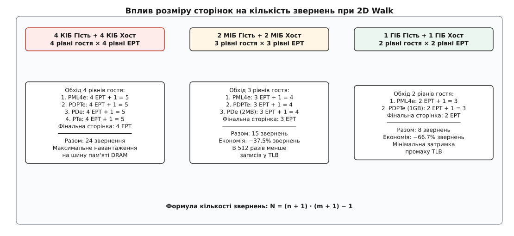
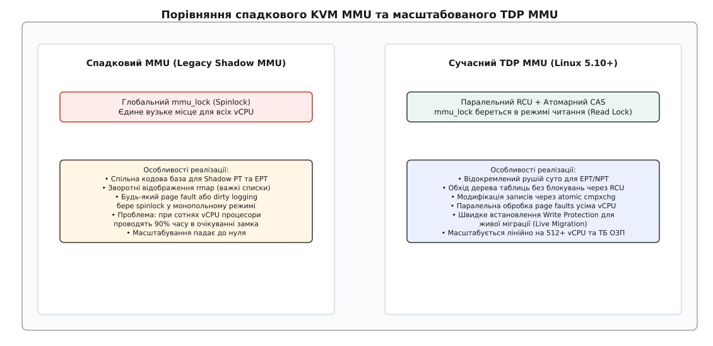

# Пам'ять гостя в KVM: EPT/NPT і тіньові таблиці сторінок

<preknowlist>
- [Сторінкова пам'ять і MMU](topic:unix-linux/paging-and-mmu) — ієрархічні таблиці сторінок, трансляція віртуальних адрес у фізичні та буфер TLB.
- [Збій сторінки: page fault](topic:unix-linux/page-fault) — апаратне переривання процесора при зверненні до невідображеної або захищеної адреси.
- [Великі сторінки: Huge Pages](topic:unix-linux/huge-pages) — сторінки розміром 2 МіБ та 1 ГіБ для зменшення навантаження на TLB.
- [Архітектура KVM і QEMU: як ядро віддає процесор гостю](topic:unix-linux/kvm-and-qemu-architecture) — поділ ролей між VMM у просторі користувача та модулем ядра KVM.
- [Віртуалізація переривань у KVM: vAPIC, APICv і posted interrupts](topic:unix-linux/kvm-irq-virtualization-apicv) — апаратне прискорення контролера переривань гостя.
</preknowlist>

## Проблема подвійного перекладу: чому процесор не розуміє гостьовий CR3

Гостьовий процес виконує інструкцію читання пам'яті за віртуальною адресою `0x7fff_cafe_0000`. Гостьове ядро переконане, що воно повністю контролює апаратне забезпечення: у його власному регістрі `CR3` записано покажчик на кореневу таблицю сторінок, яка пов'язує цю адресу з «фізичним» фреймом `0x1000_0000`.

Проте реальний процесор хоста виконує інструкції в неривілейованому режимі віртуалізації. Фізична адреса `0x1000_0000` з погляду гостя — це лише зсув усередині виділеного процесу емулятора (QEMU) абонента. Якщо апаратний блок керування пам'яттю (MMU, англ. *Memory Management Unit*) завантажить гостьовий `CR3` безпосередньо у фізичні регістри процесора, перше ж звернення гостя прочитає або перезапише справжню фізичну пам'ять хоста за адресою `0x1000_0000`. Там може виявитися код ядра Linux хоста, сторінки іншої віртуальної машини або системний кеш.

Виникає фундаментальний розрив: гостьова операційна система оперує двома рівнями адрес (віртуальні та фізичні), але з погляду реального заліза це лише віртуальні адреси всередині простору хоста. Щоб зберегти ізоляцію й забезпечити коректну роботу, системі потрібна дворівнева трансляція, яка пов'язує між собою чотири незалежні адресні простори.

## Чотири адресні простори

У віртуалізованому середовищі під керуванням KVM будь-який байт даних одночасно існує в чотирьох системах координат.

```
GVA ──(гостьові таблиці)──> GPA ──(memslots/EPT)──> HPA
                             │                       ▲
                             └──(mmap QEMU)──> HVA ──┘
```

1. **GVA (Guest Virtual Address)** — віртуальна адреса, з якою працює конкретний процес усередині гостьової ОС. Транслюється гостьовим ядром за допомогою гостьових таблиць сторінок.
2. **GPA (Guest Physical Address)** — адреса, яку гостьове ядро вважає фізичною оперативною пам'яттю. Для віртуальної машини це лінійний діапазон від `0` до виділеного обсягу ОЗП (наприклад, `0 .. 16 ГіБ`).
3. **HVA (Host Virtual Address)** — віртуальна адреса в адресному просторі процесу гіпервізора простору користувача (VMM, наприклад QEMU або Cloud Hypervisor). Гіпервізор виділяє пам'ять для віртуальної машини звичайним системним викликом `mmap(NULL, size, PROT_READ|PROT_WRITE, MAP_ANONYMOUS|MAP_NORESERVE, -1, 0)`.
4. **HPA (Host Physical Address)** — справжня фізична адреса в мікросхемах DRAM материнської плати хоста. Лише за цими адресами шина процесора здатна виконати апаратне читання чи запис комірки пам'яті.


*Чотири адресні простори: гостьова ОС перетворює GVA на GPA, а ядро хоста та апаратний EPT пов'язують GPA з фізичною пам'яттю HPA.*

Зв'язок між `GPA` та `HVA` встановлюється гіпервізором під час запуску через реєстрацію слотів пам'яті (англ. *memslots*). Процес VMM передає в KVM масив структур `kvm_userspace_memory_region`, де кожен діапазон `GPA` жорстко прив'язується до відповідного діапазону `HVA`. Коли гостьовому vCPU потрібна фізична пам'ять, модуль KVM перетворює `GPA` в `HVA` за таблицею слотів, а потім звертається до підсистеми керування пам'яттю ядра Linux хоста для отримання цільового фрейму `HPA`.

Історично існувало два принципово різних шляхи реалізації цього перетворення: повністю програмний (тіньові таблиці сторінок) та апаратний (вкладені сторінки EPT/NPT). Детальний шлях розвитку цих підходів задокументовано в [історичному нарисі еволюції віртуалізації пам'яті](topic:unix-linux/kvm-mmu-ept-npt/hist-shadow-to-ept.md).

## Програмна віртуалізація: тіньові таблиці сторінок (Shadow Page Tables)

До появи спеціалізованого апаратного забезпечення в мікропроцесорах архітектури x86 єдиним способом запуску гостьової ОС була повна програмна емуляція MMU — **тіньові таблиці сторінок** (англ. *Shadow Page Tables*, SPT).

Ідея полягала в побудові прямого моста між `GVA` та `HPA`, оминаючи проміжний `GPA`. Фізичний блок MMU процесора не знав про існування гостьових таблиць. Натомість гіпервізор KVM підтримував паралельне тіньове дерево сторінок, у якому кожен запис транслював віртуальну адресу гостя безпосередньо у фізичну адресу хоста:

```
GVA ───(Тіньова таблиця KVM)───> HPA
```

У фізичний апаратний регістр `CR3` процесора завантажувалася адреса кореня тіньової таблиці KVM. Коли гостьова ОС намагалася виконати інструкцію запису нового значення в `CR3` (наприклад, при перемиканні процесу `mov %rax, %cr3`), інструкція перехоплювалася: відбувався вихід із віртуальної машини (`VM-exit`). KVM знаходив або створював відповідну тіньову копію для нової гостьової структури сторінок і записував її `HPA` в апаратний `CR3`.

### Захист від запису (Write Protection) та перехоплення змін

Головна складність тіньових таблиць — підтримання когерентності. Якщо гостьове ядро змінювало власний запис у гостьовій таблиці сторінок (виділяло сторінку, скидало прапорець запису чи видаляло відображення), тіньова таблиця процесора миттєво ставала застарілою.

Оскільки процесор не міг повідомити гіпервізор про звичайний запис гостя в пам'ять, KVM застосовував жорсткий механізм: **усі сторінки пам'яті, що містили гостьові таблиці сторінок, позначалися в тіньових таблицях як захищені від запису (Read-Only)**.


*Принцип Shadow Page Tables: гостьові таблиці захищені від запису, будь-яка спроба модифікації викликає пастку в KVM для емуляції та синхронізації тіньового дерева.*

Послідовність подій при будь-якій модифікації сторінок гостем виглядала так:
1. Гостьове ядро виконує запис у пам'ять за адресою власної таблиці сторінок (наприклад, системний виклик `mmap` виділяє буфер).
2. Апаратний MMU процесора бачить, що в тіньовій таблиці сторінка позначена як Read-Only, і генерує виключення збою сторінки `#PF` (Page Fault).
3. Збій перехоплюється гіпервізором KVM, викликаючи вихід із віртуальної машини (`VM-exit`).
4. Емулятор інструкцій KVM (`x86_emulate_instruction`) розбирає машинну інструкцію гостя, обчислює, що саме хотів записати гість, і застосовує цей запис до гостьової таблиці в пам'яті.
5. KVM оновлює відповідний запис у тіньовій таблиці (встановлює новий зв'язок `GVA -> HPA`).
6. Виконання повертається у vCPU на наступну інструкцію гостя.

### Ціна тіньових таблиць

Тіньові таблиці створювали велетенський оверхед. При інтенсивній роботі з пам'яттю (компіляція коду, запуск процесів через `fork`, робота баз даних) кількість перехоплень `VM-exit` сягала мільйонів на секунду. Кожен перехід між гостем і хостом коштував сотні тактів процесора на збереження та відновлення регістрів, не враховуючи витрати на емуляцію інструкцій запису в пам'ять ядра.

Крім того, перемикання контексту між процесами гостя вимагало скидання або валідації тіньових дерев. Щоб пом'якшити удар по швидкодії, KVM реалізував кеш тіньових сторінок і механізм розсинхронізованих тіньових сторінок (англ. *Out-of-Sync Shadow Pages*, OOS), який дозволяв відкладати синхронізацію листових PTE до виконання гостем інструкції `invlpg` або зміни `CR3`. Проте фундаментальне обмеження лишалося: програмна віртуалізація MMU спалювала до третини обчислювальної потужності сервера на обслуговування службових перехоплень.

## Апаратна віртуалізація MMU: Intel EPT та AMD NPT

Проблему усунули виробники процесорів, додавши апаратну підтримку дворівневої трансляції прямо в кремній MMU:
- **Intel Extended Page Tables (EPT)** у мікроархітектурі Nehalem (2008);
- **AMD Nested Page Tables (NPT)**, відомі також як Rapid Virtualization Indexing (RVI), у процесорах K10 Barcelona (2007).

При апаратній віртуалізації процесор отримує два незалежних механізми трансляції адрес, що працюють одночасно:
1. **Перший рівень (Guest Paging)**: Гостьовий блок трансляції перетворює `GVA` на `GPA` за таблицями гостя, на які вказує гостьовий регістр `CR3`.
2. **Другий рівень (Nested / Extended Paging)**: Апаратний блок EPT перетворює кожен отриманий `GPA` на реальний `HPA` за окремим кореневим покажчиком хоста.

На процесорах Intel покажчик на корінь таблиці EPT записується у поле керування віртуальною машиною `EPTP` (EPT Pointer у структурі VMCS). На процесорах AMD адреса кореня NPT завантажується у поле `nCR3` структури VMCB.

Гостьовий регістр `CR3` тепер містить звичайну гостьову фізичну адресу (`GPA`). Гостьова ОС вільно модифікує свої таблиці, виділяє пам'ять, викликає `fork` та змінює `CR3` без жодного втручання гіпервізора і без жодного `VM-exit`. Захист сторінок від запису більше не потрібен.

### Структура дескриптора EPT (SPTE)

Кожен запис у таблицях EPT (Shadow Page Table Entry, `SPTE`) має довжину 64 біти. Його бітова структура суттєво відрізняється від класичного запису x86 PTE:

```
 63    62        51                      12 11   10  9   8   7   6   5     3 2 1 0
┌───┬───────────┬──────────────────────────┬───┬───┬───┬───┬───┬───┬──────┬─┬─┬─┐
│SVE│ Зарезерв. │ Фізична адреса HPA (4KB) │ - │ - │ D │ A │PS │IP │MemTyp│X│W│R│
└───┴───────────┴──────────────────────────┴───┴───┴───┴───┴───┴───┴──────┴─┬─┬─┘
                                                                           │ │ └─ Read (Біт 0)
                                                                           │ └─── Write (Біт 1)
                                                                           └───── Execute (Біт 2)
```

- **Біти 0, 1, 2 (R, W, X)**: Права доступу на читання, запис та виконання. На відміну від стандартних сторінок x86, де читання дозволено завжди, якщо сторінка присутня, EPT дозволяє розділити права: можна заборонити читання, дозволивши лише виконання (`R=0, W=0, X=1`), що використовується для захисту від витоку коду (Execute-Only Memory).
- **Біти 5:3 (Memory Type)**: Тип кешування пам'яті (Uncacheable `0`, Write-Combining `1`, Write-Through `4`, Write-Back `6`).
- **Біт 6 (Ignore PAT)**: Ігнорувати тип пам'яті, вказаний у гостьових таблицях PAT.
- **Біт 7 (Page Size / Large Page)**: Прапорець великої сторінки. Якщо встановлений на рівні PD або PDPT, термінує трансляцію, позначаючи сторінку розміром 2 МіБ або 1 ГіБ відповідно.
- **Біт 8 (Accessed)** та **Біт 9 (Dirty)**: Апаратні біти звернення та запису (підтримуються технологією Intel EPT A/D bits). Якщо увімкнено, MMU оновлює їх автоматично без генерації виходів у гіпервізор.
- **Біти 51:12**: Фізична адреса фрейму (`HPA`), вирівняна на межу 4 КіБ.
- **Біт 63 (Suppress #VE)**: Придушення виключення віртуалізації `#VE` при збоях доступу.

## Ціна двовимірного обходу: 2D Page Walk

Усунення перехоплень `CR3` переклало навантаження на апаратний блок обходу таблиць — Page Table Walker. Якщо процесор звертається до віртуальної адреси, якої немає в кеші буфера асоціативної трансляції (TLB), апаратний MMU мусить розгорнути повний двовимірний обхід (Two-Dimensional Page Walk).

Розглянемо стандартний 64-бітний режим із 4-рівневими сторінками по 4 КіБ у гості та 4-рівневим EPT на хості:
1. vCPU має віртуальну адресу `GVA`. Щоб почати обхід, процесор бере покажчик `CR3` гостя. Але гостьовий `CR3` — це `GPA`.
2. Щоб прочитати перший запис гостьової таблиці PML4, процесор мусить спочатку перекласти `GPA` регістра `CR3` через 4 рівні хостової таблиці EPT (EPT PML4 → EPT PDPT → EPT PD → EPT PT). Це **4 звернення до DRAM**.
3. Процесор читає запис гостьового PML4 (**1 звернення до DRAM**), який повертає `GPA` гостьової таблиці PDPT.
4. Щоб звернутися до гостьового PDPT, процесор знову транслює його `GPA` через усі 4 рівні EPT (**4 звернення до DRAM**).
5. Процесор читає запис гостьового PDPT (**1 звернення**), отримуючи `GPA` таблиці PD.
6. Трансляція `GPA` таблиці PD через 4 рівні EPT (**4 звернення**).
7. Читання запису гостьового PD (**1 звернення**), отримання `GPA` таблиці PT.
8. Трансляція `GPA` таблиці PT через 4 рівні EPT (**4 звернення**).
9. Читання запису гостьового PT (**1 звернення**), отримання фінального `GPA` цільової сторінки даних.
10. Трансляція фінального `GPA` сторінки даних через 4 рівні EPT (**4 звернення**).
11. Читання власне байтів даних за отриманою адресою `HPA` (**1 звернення**).


*Схема 2D Page Walk: кожен крок гостьового обходу вимагає повного проходу хостового дерева EPT, даючи в сумі 24 звернення до фізичної пам'яті.*

Для загального випадку з `n` рівнями сторінок гостя та `m` рівнями таблиць EPT хоста кількість звернень до пам'яті виражається точним співвідношенням:

```
N = (n + 1) · (m + 1) - 1   [двовимірний обхід пам'яті]
```

Для 4-рівневого гостя та 4-рівневого EPT хоста (`n = 4, m = 4`):

```
N = (4 + 1) · (4 + 1) - 1
= 5 · 5 - 1
= 24                        [звернення до оперативної пам'яті хоста на 1 промах TLB]
```

Для новітньої 5-рівневої адресації (PML5 / 57-bit paging, де `n = 5, m = 5`) кількість звернень сягає:

```
N = (5 + 1) · (5 + 1) - 1
= 6 · 6 - 1
= 35                        [звернень до пам'яті]
```

Повний математичний аналіз затримок, вплив кешів трансляції та розрахунок ефективного часу доступу наведено у [вставці про математику 2D-обходу та ціну промахів TLB](topic:unix-linux/kvm-mmu-ept-npt/math-2d-walk-cost.md).

### Апаратне кешування та ідентифікатори VPID

Якби кожне звернення до пам'яті виконувало 24 циклу читання DRAM, швидкодія віртуальних машин була б у десятки разів нижчою за фізичні сервери. Для боротьби з цим процесори реалізують багаторівневе кешування:
- **Combined TLB (Комбінований TLB)**: Кешує кінцевий результат трансляції `GVA -> HPA`. Якщо адреса є в комбінованому TLB, доступ до пам'яті відбувається за 1 такт ЦП без жодного звернення до EPT чи таблиць сторінок.
- **Guest-Physical TLB (GP-TLB)**: Кешує проміжні переклади `GPA -> HPA`, скорочуючи обхід EPT з 4 кроків до нуля або одного.
- **Page Directory Pointers Caches**: Проміжне кешування покажчиків верхніх рівнів у L2/L3 кешах процесора.
- **VPID (Virtual Processor ID)** на Intel та **ASID (Address Space ID)** на AMD: Апаратні числові теги в записах TLB. Без VPID кожен вхід або вихід із віртуальної машини (`VM-exit`/`VM-entry`) вимагав би повного скидання (flush) усіх записів TLB процесора. Завдяки VPID записи гостя та хоста мирно співіснують у TLB, не витісняючи один одного.

## EPT Violation проти EPT Misconfiguration

Під час трансляції адреси через EPT апаратний MMU процесора може зіткнутися з неможливістю завершити переклад. У такому разі апаратний блок генерує `VM-exit`, повертаючи керування в ядро Linux до модуля KVM.

Існує дві принципово різні причини такого виходу: **EPT Violation** та **EPT Misconfiguration**.


*Розподіл причин виходів: EPT Violation обслуговує штатні збої сторінок і захист, тоді як EPT Misconfiguration сигналізує про помилку формату або використовується для Fast MMIO.*

### 1. EPT Violation (Код виходу 48 на Intel / VMEXIT_NPF на AMD)

EPT Violation — це повний функціональний аналог стандартного збою сторінки `#PF`, але на рівні другого виміру трансляції. Подія виникає, коли структура EPT правильна, але операція не може бути виконана.

Типові причини:
- **Сторінка не присутня (Not Present, `R=W=X=0`)**: Гість уперше звернувся до сторінки пам'яті. KVM реалізує відкладене виділення пам'яті (Demand Paging), тому сторінка в EPT з'являється лише в момент першого реального доступу.
- **Порушення прав доступу (Permission Fault)**: Гість намагається виконати запис у сторінку, де біт `W` дорівнює нулю. Це штатний механізм KVM для реалізації:
  - *Dirty Page Logging*: Під час живої міграції гіпервізор скидає біт `W` на всіх сторінках, щоб відстежити, які саме сторінки змінює гість.
  - *Copy-on-Write (CoW)*: При спільному використанні сторінок (KSM — Kernel Samepage Merging).

При виході з причиною EPT Violation процесор передає в структурі VMCS детальну інформацію про збій (`Exit Qualification`): точну фізичну адресу гостя `GPA`, лінійну адресу `GVA`, права запису/читання та причину конфлікту.

KVM викликає обробник збою `kvm_mmu_page_fault()` (або `tdp_page_fault()` у новому MMU):
1. За адресою `GPA` через `memslots` знаходиться віртуальна адреса `HVA`.
2. Ядро хоста знаходить або виділяє реальну фізичну сторінку `HPA` через `gfn_to_pfn()`.
3. KVM створює або оновлює запис у дереві EPT (`SPTE`), прописуючи зв'язок `GPA -> HPA` та відповідні біти доступу `R/W/X`.
4. Виконання vCPU продовжується.

### 2. EPT Misconfiguration (Код виходу 49 на Intel)

EPT Misconfiguration свідчить про **апаратно неприпустимий формат самого запису EPT**. Апаратний MMU процесора зустрів комбінацію бітів, яка заборонена специфікацією архітектури.

Типові причини:
- Встановлено один із зарезервованих бітів процесора (Reserved Bits Violation).
- Задано непідтримуваний або неприпустимий тип пам'яті в бітах `Memory Type` (наприклад, зарезервоване значення `2` чи `3`).
- Неприпустима комбінація бітів прав доступу (наприклад, на старих процесорах без підтримки Execute-Only заборонялася комбінація `W=1, R=0`).

Якщо EPT Misconfiguration виникає випадково — це критичний баг ядра хоста або драйвера KVM, що призводить до падіння віртуальної машини з помилкою `KVM: EPT misconfiguration at GPA 0x...`.

#### KVM Fast MMIO через навмисний Misconfiguration

Проте KVM геніально використовує EPT Misconfiguration як інструмент оптимізації.

Коли віртуальна машина звертається до емульованого пристрою вводу-виводу (Memory-Mapped I/O, MMIO), реальної пам'яті за цією адресою не існує — запит повинен бути переданий емулятору пристрою в QEMU або в ядрі (наприклад, віртуальний контролер переривань `vAPIC`).

Якщо позначити таку MMIO-сторінку відсутньою (`P=0`), кожен доступ викликатиме `EPT Violation`. Але при EPT Violation ядро KVM змушене розбирати повну кваліфікацію виходу, шукати адресу в memslots і перевіряти, чому сторінка відсутня.

Замість цього KVM записує в EPT-дескриптор MMIO-сторінки **заздалегідь некоректне значення із зарезервованим бітом (Reserved Bit)**, закодувавши в інших бітах службову інформацію про пристрій. При першому ж зверненні процесор миттєво генерує `EPT Misconfiguration`. KVM бачить цей код виходу і без жодного пошуку в таблицях адрес негайно передає керування в швидкий обробник `handle_fast_mmio()` / `kvm_io_bus_write()`, заощаджуючи сотні тактів процесора на кожному запиті до віртуального заліза.

## Великі сторінки: Huge Pages гостя та хоста

Найефективніший спосіб боротьби з затримками 2D-обходу — перехід на сторінки збільшеного розміру (2 МіБ та 1 ГіБ).


*Скорочення 2D Walk за допомогою Huge Pages: перехід на сторінки 2 МіБ та 1 ГіБ зрізає кількість рівнів дерева як у гості, так і в EPT хоста.*

### Скорочення ієрархії таблиць

1. **Сторінка 2 МіБ**: Прапорець `Page Size` встановлюється на рівні дескриптора каталогу сторінок (Page Directory Entry, `PDE`). Рівень таблиць сторінок `PT` повністю виключається з ланцюжка. Кількість рівнів трансляції падає з 4 до 3.
2. **Сторінка 1 ГіБ**: Прапорець встановлюється на рівні покажчика на каталог (Page Directory Pointer Table Entry, `PDPTE`). Виключаються рівні `PD` та `PT`. Трансляція має лише 2 рівні.

Порівняємо кількість звернень до фізичної пам'яті хоста за формулою `N = (n + 1) · (m + 1) - 1`:

```
4K гість + 4K хост:  N = (4 + 1) · (4 + 1) - 1 = 24 звернення
2M гість + 2M хост:  N = (3 + 1) · (3 + 1) - 1 = 15 звернень  [скорочення на 37.5%]
1G гість + 1G хост:  N = (2 + 1) · (2 + 1) - 1 = 8 звернень   [скорочення на 66.7%]
```

Зменшення глибини дерева з 24 до 8 звернень знижує затримку обслуговування промаху TLB у три рази.

### Прозорі великі сторінки (THP) та hugetlbfs

Linux-хост підтримує два шляхи надання великих сторінок віртуальній машині:
1. **hugetlbfs**: Пам'ять для віртуальної машини виділяється з пулу попередньо зарезервованих неперервних фізичних сторінок (`1GB` або `2MB`) через монтування `hugetlbfs`. Це гарантує відсутність фрагментації та фіксовану максимальну продуктивність.
2. **Transparent Huge Pages (THP)**: Ядро Linux автоматично намагається виділяти анонімні сторінки розміром 2 МіБ для процесу гіпервізора. Фоновий демон ядра `khugepaged` сканує пам'ять і склеює суміжні 4-кілобайтні сторінки у великі 2-мегабайтні блоки.

### Розбиття та склеювання сторінок (Page Splitting / Collapsing)

Якщо віртуальна машина працює на сторінках 2 МіБ, але виникає необхідність захистити окрему 4-кілобайтну ділянку (наприклад, гіпервізор починає відстежувати брудні сторінки під час Live Migration), KVM виконує **розбиття великої сторінки (Page Splitting)**:
1. Виділяється новий фрейм для таблиці рівня `EPT PT`.
2. 512 записів нової таблиці ініціалізуються покажчиками на відповідні 4-кілобайтні піддіапазони колишньої 2-мегабайтної сторінки.
3. Запис у таблиці `EPT PD` замінюється: прапорець `PS` скидається, а адреса замінюється на покажчик на щойно створену таблицю `EPT PT`.
4. Виконується скидання відповідних записів TLB (через інструкцію `INVEPT`).

Після завершення міграції KVM або демон `khugepaged` хоста знову колапсує розрізнені 4K-сторінки в монолітний 2M блок.

> 🔧 **Навіщо це.** Налаштування Transparent Huge Pages та розміру сторінок пам'яті — ключовий фактор продуктивності будь-яких високоінтенсивних віртуалізованих систем (СУБД, аналітика пам'яті в реальному часі). Використання сторінок по 1 ГіБ через `hugetlbfs` не лише знижує затримки звернення до DRAM на 60–70%, але й унеможливлює виникнення затримок розбиття/склеювання сторінок ядром у пікові моменти навантаження.

## Архітектура KVM TDP MMU

Зі зростанням потужності сучасних серверів (хмарні віртуальні машини з сотнями vCPU та терабайтами оперативної пам'яті) стара архітектура KVM MMU вперлася в нездоланну проблему масштабування.

### Криза спадкового рушія (Legacy MMU)

Історичний код KVM MMU був спроєктований наприкінці 2000-х років і поєднував під одним дахом підтримку як тіньових сторінок (SPT), так і апаратного EPT/NPT.

Усі операції з деревами сторінок захищалися **єдиним глобальним спинлоком на всю віртуальну машину — `kvm->mmu_lock`**. Крім того, ядро вело громіздкі зворотні списки відображень (`rmap`, Reverse Mappings), щоб знайти всі записи в таблицях сторінок, які вказують на конкретний фізичний фрейм хоста.

Коли віртуальна машина з 256 vCPU ініціалізувала великий масив пам'яті або коли запускалася жива міграція (що вимагає встановлення прапорця Write Protection на терабайти адресного простору), виникав колапс:
- 256 ядер процесора одночасно генерували `EPT Violation`.
- Усі vCPU ставали в чергу на захоплення спинлока `mmu_lock`.
- Час очікування спинлока перевищував 90% загального часу виконання, а пропускна здатність віртуальної машини падала майже до нуля.

### Новий рушій: Two-Dimensional Paging MMU (tdp_mmu)

У ядрі Linux 5.10 (2020 рік) з'явився новий рушій підсистеми пам'яті — **KVM TDP MMU**, створений інженерами Google спеціально для апаратного EPT/NPT.


*Архітектурне порівняння: Legacy MMU блокує всі процесори глобальним спинлоком, тоді як TDP MMU дозволяє паралельну обробку через RCU та атомарний cmpxchg.*

Ключові архітектурні принципи TDP MMU:
1. **Повне відокремлення від Shadow MMU**: Новий рушій не містить жодного рядка коду для роботи зі старими тіньовими сторінками. Він оптимізований суто під деревоподібну структуру апаратного EPT/NPT.
2. **Безблокувальний обхід дерева через RCU**: Обхід структури EPT виконується за допомогою механізму Read-Copy-Update (RCU). Віртуальні процесори vCPU читають таблиці сторінок паралельно, утримуючи замок `mmu_lock` у режимі спільного читання (`read_lock`).
3. **Атомарні модифікації записів (`cmpxchg`)**: Оновлення дескрипторів `SPTE` виконується за допомогою атомарних 64-бітних інструкцій порівняння з обміном:
   ```c
   /* Атомарне оновлення запису таблиці сторінок без монопольного блокування */
   bool success = try_cmpxchg64(&sptep->value, &old_spte, new_spte);
   ```
   Якщо два віртуальних процесори одночасно виділяють сусідні сторінки в межах однієї таблиці, вони більше не блокують один одного.
4. **Відмова від rmap**: Дерево EPT є строго ієрархічним і однозначним (кожен `GPA` мапиться рівно в один `HPA`). Відмова від структур зворотного пошуку скоротила споживання оперативної пам'яті ядром хоста на десятки гігабайтів для великих VM.
5. **Масштабована жива міграція**: Встановлення та зняття захисту від запису (`wrprot`) для гігабайтів сторінок виконується паралельними ітераторами, що проходять дерево EPT зверху вниз без заморожування роботи гостьових ядер.

### Програмне керування та діагностика

Системні адміністратори та розробники гіпервізорів можуть безпосередньо керувати роботою KVM MMU через параметри ядра, системні виклики `ioctl` та події `tracefs`. Повний перелік параметрів модулів, структур даних та точок трасування зібрано в [довіднику інтерфейсів керування KVM MMU](topic:unix-linux/kvm-mmu-ept-npt/api-kvm-mmu-controls.md).

Поведінку підсистеми EPT під навантаженням (частоту виникнення EPT Violation, Misconfiguration та зміни SPTE) можна відстежувати безпосередньо в реальному часі за допомогою [утиліти трасування подій KVM MMU](topic:unix-linux/kvm-mmu-ept-npt/proj-ept-walk-tracer.md), розробленої на C та C++.

## Підсумок архітектурної моделі

Віртуалізація пам'яті в KVM пройшла шлях від важкої програмної емуляції тіньових таблиць сторінок із безперервними перехопленнями `CR3` та дорогими пастками захисту від запису до повної апаратної підтримки в кремнії процесорів Intel EPT та AMD NPT.

Плата за апаратну свободу гостьового ядра — затримка двовимірного обходу таблиць при промахах TLB (до 24 звернень до пам'яті на один промах у 4-рівневій системі). Сучасна архітектура KVM TDP MMU нівелює ці витрати завдяки масштабованій безблокувальній моделі оновлення сторінок на основі RCU та широкому застосуванню великих сторінок розміром 2 МіБ та 1 ГіБ.
