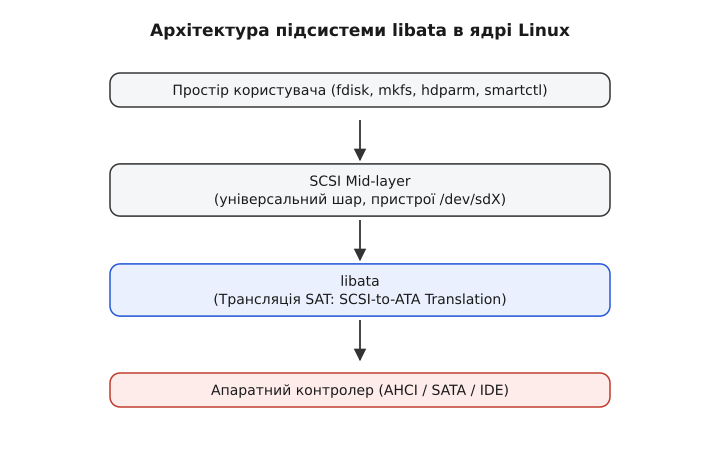

# libata: як ATA-диск потрапляє під SCSI-шар Linux

<preknowlist>
- [Файл пристрою: символьний і блоковий](topic:unix-linux/device-file-model) — чим блоковий пристрій відрізняється від символьного і як залізо стає файлом у `/dev`.
- [Підсистема SCSI](topic:unix-linux/scsi-subsystem) — що таке SCSI-команда, сенс-код і хто в ядрі їх обробляє.
- [Модель пристроїв у sysfs](topic:unix-linux/sysfs-device-model) — як дерево пристроїв, шин і драйверів показане у віртуальній файловій системі `sysfs`.
</preknowlist>

Кожен, хто користувався Linux на початку 2000-х, пам'ятає, що жорсткі диски завжди іменувалися як `/dev/hda`, `/dev/hdb` і так далі. Це було природно: літера "h" означала "hard disk", а точніше — диск, що працює через інтерфейс IDE/ATA. Проте в сучасних дистрибутивах Linux ви майже ніколи не побачите `/dev/hdX`. Усі диски, незалежно від того, чи це SATA-накопичувач, чи [USB-флешка](topic:unix-linux/usb-mass-storage), чи навіть старий IDE-диск (якщо у вас такий ще залишився), визначаються як `/dev/sdX`. Літера "s" історично означає "SCSI". Чому ж сучасні SATA-накопичувачі проходять через SCSI-стек, хоча фізично вони не є SCSI-пристроями? (NVMe сюди не належить: у нього власний стек і власні імена `/dev/nvme0n1`, а ядерну трансляцію SCSI→NVMe з Linux прибрали ще 2017-го.) Відповідь полягає в грандіозній уніфікації стека блокових пристроїв ядра Linux і створенні підсистеми **libata**.

## Проблема застарілого підходу (IDE subsystem)

Історично в ядрі Linux існувала спеціалізована підсистема для роботи з ATA/IDE-дисками. Вона була написана ще тоді, коли диски підключалися через широкі шлейфи (PATA) і працювали в режимі PIO, сильно навантажуючи центральний процесор. З часом підсистема розросталася, додавалася підтримка DMA (Direct Memory Access), різних специфічних контролерів, але її архітектура залишалася монолітною і складною для підтримки.

Коли з'явився інтерфейс Serial ATA (SATA), розробникам стало зрозуміло, що стара IDE-підсистема не здатна ефективно масштабуватися. SATA приніс нові можливості: гарячу заміну (hot-plug), черги команд (NCQ - Native Command Queuing), покращену обробку помилок. Впроваджувати все це в стару, заплутану базу коду було неможливо без порушення стабільності. Крім того, існував паралельний, дуже добре налагоджений і функціональний стек SCSI, який уже вмів усе це робити.

## libata: Міст між світами

Замість того, щоб переписувати IDE-підсистему з нуля або дублювати функціональність SCSI, розробник ядра Джефф Гарзік (Jeff Garzik) запропонував геніально просте рішення: створити бібліотеку **libata**. Заміна тривала майже два десятиліття: власна тека `drivers/ata` й перші PATA-драйвери прийшли з ядром 2.6.19 (2006), а стару підсистему `drivers/ide` позначили застарілою 2019 року й остаточно видалили аж у 5.14 (2021) — [як саме йшов цей перехід](topic:unix-linux/libata/hist-ide-to-libata.md).

Головне завдання `libata` — працювати як транслятор. Вона отримує уніфіковані SCSI-команди від верхніх шарів ядра і перетворює їх на ATA-команди, зрозумілі диску. Таким чином, з погляду ядра (VFS, файлових систем, планувальників вводу-виводу), усі диски виглядають як надійні і передбачувані SCSI-пристрої.


*Чотири шари на шляху запиту: простір користувача → SCSI mid-layer (де живуть пристрої `/dev/sdX`) → libata з трансляцією SAT → апаратний контролер (AHCI / SATA / IDE). Уся ATA-специфіка зібрана в одному шарі — верхні про неї не знають.*

### Трансляція команд (SAT)

Процес перетворення SCSI-команд в ATA називається **SAT (SCSI to ATA Translation)**. Це не просто внутрішній хак ядра Linux, а стандартизований підхід, описаний комітетом T10. 

Коли ви хочете прочитати сектор з диска:
1. Застосунок робить системний виклик (наприклад, `read()`).
2. Запит проходить через VFS і файлову систему, досягаючи [блокового шару](topic:unix-linux/block-device-model), де формується запит (request).
3. SCSI-підсистема приймає цей запит і генерує SCSI CDB (Command Descriptor Block), наприклад, `READ(10)`.
4. `libata` перехоплює цей CDB. Замість того, щоб відправити його на SCSI-контролер (якого немає), вона використовує правила SAT, щоб перетворити `READ(10)` на відповідну ATA-команду, наприклад, `READ DMA EXT` або `READ FPDMA QUEUED` (якщо використовується NCQ).
5. ATA-команда передається в апаратний драйвер контролера (наприклад, `ahci`), який вже безпосередньо взаємодіє з обладнанням.

Цей процес відбувається абсолютно прозоро для користувача. Найцікавіші правила SAT — там, де прямої пари команд немає: SCSI-шне `INQUIRY` доводиться підміняти ATA-шною `IDENTIFY DEVICE` й переформатовувати 512 байтів її відповіді, а `START STOP UNIT` — розкладати на `STANDBY IMMEDIATE` чи `SLEEP`. Кілька таких пар розібрано в [деталях трансляції](topic:unix-linux/libata/api-sat-translation.md).

## Контролери AHCI та нові можливості

Впровадження `libata` збіглося з поширенням стандарту **AHCI (Advanced Host Controller Interface)**. Раніше кожен виробник створював власні регістри та методи спілкування з SATA-контролером. AHCI уніфікував цей процес. Завдяки драйверу `ahci.ko`, що працює поверх `libata`, Linux отримав "з коробки" підтримку практично будь-якого сучасного SATA-контролера без необхідності писати окремі драйвери під кожен чіпсет.

### Native Command Queuing (NCQ)

Однією з найважливіших переваг нового стека стала повноцінна підтримка NCQ. Старі ATA-диски могли приймати лише одну команду за раз. Якщо ядро хотіло прочитати сектори з різних частин диска, воно повинно було чекати виконання першої команди, перш ніж надіслати другу.

З NCQ і `libata` ядро може відправити диску відразу до 32 команд (`READ FPDMA QUEUED` для читання, `WRITE FPDMA QUEUED` для запису). Диск сам аналізує своє поточне положення головок (якщо це HDD) і виконує команди в оптимальному порядку, різко підвищуючи продуктивність (IOPS) за випадкового доступу. `libata` керує цією чергою, відстежуючи "теги" (tags) кожної команди.

Число 32 тут — це про сучасні ядра. SATA справді дає 32 теги, але Linux довго віддавав дискові лише 31: один тег `libata` тримала для власних службових команд (`ATA_TAG_INTERNAL = ATA_MAX_QUEUE - 1` в `include/linux/libata.h`, а драйвер AHCI оголошував `.can_queue = AHCI_MAX_CMDS - 1` в `drivers/ata/ahci.h`). Повні 32 з'явилися у версії 4.18 (коміт `28361c403683` «libata: add extra internal command»), де службовій команді виділили окремий, зайвий слот: `ATA_TAG_INTERNAL = ATA_MAX_QUEUE`, `.can_queue = AHCI_MAX_CMDS`. Тож на ядрах до 4.18 `/sys/block/sdX/device/queue_depth` показував щонайбільше 31, з 4.18 — 32.

### Гаряча заміна (Hot-plug) та керування живленням

`libata` також реалізує обробку подій на рівні фізичного інтерфейсу (PHY). Коли ви підключаєте SATA-диск на ходу, контролер генерує переривання. Драйвер AHCI ловить його і сповіщає `libata`. Та, своєю чергою, ініціює скидання порту (port reset), читає ідентифікаційні дані диска і реєструє його в SCSI-підсистемі. У результаті в `/dev/` миттєво з'являється новий пристрій `sdX`. Те саме стосується Link Power Management (ALPM), що дозволяє економити енергію, переводячи SATA-лінк у режим сну, коли немає передачі даних.

## Практичні виклики та інструменти

Оскільки диск прикидається SCSI, виникає питання: як відправити йому специфічні ATA-команди, яких немає в словнику SCSI? Наприклад, як прочитати S.M.A.R.T.-статус або налаштувати Acoustic Management?

Для цього `libata` підтримує спеціальні SCSI-команди "ATA PASS-THROUGH". Це своєрідний конверт: утиліта в просторі користувача пакує "сиру" ATA-команду всередину SCSI-команди. `libata`, розпаковуючи її, бачить, що трансляція не потрібна, і просто передає вміст контролеру. Сам канал, яким такий конверт доїжджає з простору користувача повз файлові системи й планувальник, — [наскрізні команди `SG_IO`](topic:unix-linux/scsi-generic-passthrough).

Це дозволяє працювати таким інструментам, як:

- **smartctl (smartmontools)**: використовує механізм pass-through для запиту журналів помилок та статистики зносу диска. У старих версіях доводилося вказувати `-d ata`, але зараз smartctl автоматично розуміє, що `/dev/sdX` може бути ATA-диском за SCSI-фасадом.
- **hdparm**: легендарна утиліта, яка раніше була тісно прив'язана до IDE-стека. Сьогодні вона також використовує pass-through (через `SG_IO` ioctl), що дозволяє відправляти команди керування живленням (`-y`), налаштування APM (`-B`) та очищення диска (Secure Erase).

### Робота з sysfs

Уся структура `libata` відображається у віртуальній файловій системі `sysfs`. Якщо ви подивитеся на шлях до диска:

```bash
ls -l /sys/block/sda
```

Ви побачите, що він веде кудись у `/sys/devices/pci.../ata1/host0/target0:0:0/0:0:0:0/block/sda`. 
Тут чітко видно гібридну природу: `ata1` — це порт libata, а далі йдуть традиційні SCSI-ідентифікатори (host, target, LUN). 
У `sysfs` можна безпосередньо керувати деякими параметрами порту, наприклад, ініціювати повторне сканування лінку (rescan):

```bash
echo "- - -" > /sys/class/scsi_host/host0/scan
```

Що ще видно з цієї гілки — шлях від `/sys/block/sda` вгору до вузла `ata1`, поточну швидкість лінку в `/sys/class/ata_link/`, поділ на класи `scsi_device`, `scsi_host` і `ata_link` — показано короткою [вправою з sysfs](topic:unix-linux/libata/proj-libata-sysfs.md).

## Підсумок

Впровадження `libata` стало яскравим прикладом того, як розумна абстракція і перевикористання коду можуть врятувати складну систему. Замість підтримки двох паралельних стеків для різних типів дисків, розробники Linux створили тонкий, елегантний міст, який дозволив ATA-накопичувачам скористатися десятиліттями оптимізацій, закладених у SCSI-підсистему. Це забезпечило плавний перехід від IDE до сучасного стандарту SATA і заклало міцний фундамент для розвитку підсистеми зберігання даних в Linux.
