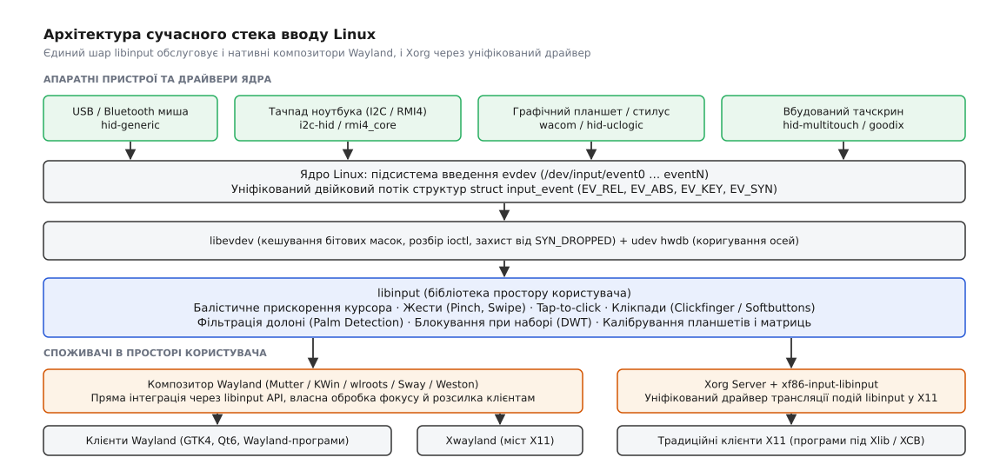
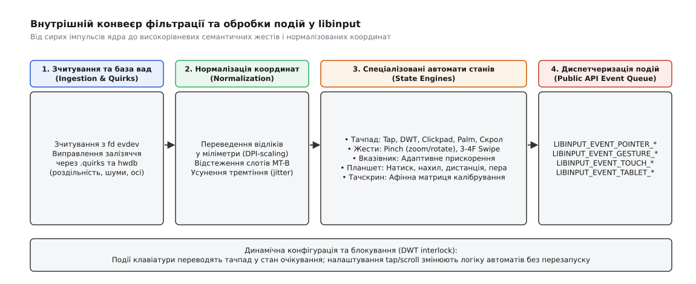
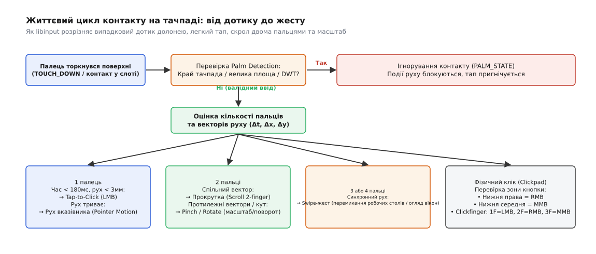

# libinput: спільний шар обробки вводу для Wayland і X

<preknowlist>
- [Файл пристрою](topic:unix-linux/device-file-model) — абстракція ядра, за якою фізичне залізо постає як символьний вузол у `/dev`.
- [Старший і молодший номери](topic:unix-linux/major-minor-numbers) — ідентифікатори драйвера та конкретного екземпляра пристрою в таблицях ядра.
- [Підсистема вводу й evdev](topic:unix-linux/input-evdev) — базовий шар ядра, що транслює імпульси контролерів у двійкові структури `input_event`.
- [Мультитач-протокол ядра](topic:unix-linux/multitouch-protocol) — відстеження кількох одночасних контактів через слоти протоколу MT-B (`ABS_MT_SLOT`, `ABS_MT_TRACKING_ID`).
- [Правила udev](topic:unix-linux/udev-rules) — механізм простору користувача для призначення прав доступу, міток та властивостей вузлам `/dev`.
- [select, poll, epoll](topic:unix-linux/select-poll-epoll) — системні виклики очікування подій готовності на множині файлових дескрипторів.
- [Сесії та робочі місця logind](topic:unix-linux/logind-sessions-seats) — керування локальними робочими місцями (`seat0`) та безпечна передача відкритих дескрипторів без прав суперкористувача.
</preknowlist>

Коли ви проводите двома пальцями по тачпаду ноутбука, підсистема ядра [evdev](topic:unix-linux/input-evdev) генерує сотні сирих подій `ABS_MT_POSITION_X` та `ABS_MT_POSITION_Y` щосекунди. Проте для графічного вікна браузера чи текстового редактора ці координати у відліках сенсора не мають жодної цінності. Програмі потрібна не сітка апаратних ємнісних датчиків, а чітка семантична дія: плавна вертикальна прокрутка на 24 пікселі, масштабування зображення чи перемикання робочого столу свайпом трьох пальців.

Між апаратним потоком імпульсів ядра та графічним оточенням користувача лежить прірва. Сирі відліки сенсорів тремтять через електричні шуми, фізичні розміри тачпадів різняться від 60 до 160 міліметрів, край долоні під час набору тексту створює паразитарні контакти, а ігрова миша видає 8000 звітів на секунду з роздільністю, яка без фільтрації перетворює рух курсора на хаотичні стрибки. 

Усю цю математику, евристики розпізнавання та адаптацію до вад заліза бере на себе **libinput** — фундаментальна бібліотека простору користувача, що стала єдиним стандартом обробки вводу для сучасних композиторів Wayland та серверів X11.

---

## Архітектура сучасного стека вводу Linux

Щоб зрозуміти місце `libinput` у системі, простежимо повний шлях електричного сигналу від фізичного сенсора до кінцевого вікна користувача.


*Ієрархія рівнів стека вводу: сирі події ядра проходять крізь фільтри libinput до композиторів Wayland та сервера Xorg.*

1. **Апаратний рівень і драйвери ядра:** Фізичний контролер (ємнісна матриця тачпада на шині I2C, сенсор оптичної миші на шині USB або дигітайзер графічного планшета) опитується відповідним драйвером ядра (`i2c-hid`, `psmouse`, `hid-generic`, `wacom`). Драйвер зчитує сирі байти специфічного протоколу пристрою і передає їх у ядро підсистеми введення.
2. **Ядро вводу та evdev (`/dev/input/eventN`):** Ядро пакує зміни в уніфіковані структури `struct input_event` (час, тип події `EV_REL`/`EV_ABS`/`EV_KEY`, код осі чи клавіші, числове значення). Будь-який процес із відповідними правами доступу може відкрити цей файл і зчитувати сирий потік двійкових подій.
3. **Проміжний шар `libevdev`:** Тонка системна бібліотека-обгортка над викликами `ioctl`. Вона не виконує високорівневого аналізу жестів чи балістичного прискорення, а лише кешує бітові маски можливостей пристрою, спрощує декодування структур і коректно відновлює стан пристрою після виникнення системного переповнення буфера `SYN_DROPPED`.
4. **Алгоритмічний шар `libinput`:** Головний аналітичний центр простору користувача. Бібліотека відкриває дескриптори пристроїв (зазвичай через посередництво [systemd-logind](topic:unix-linux/logind-sessions-seats)), відстежує їхню динамічну появу та відключення через [udev](topic:unix-linux/udev-rules), нормалізує координати в міліметри, фільтрує апаратні шуми, запускає автомати станів жестів і формує високорівневі семантичні події.
5. **Сервери відображення та композитори:**
   - **Wayland-композитори** (Mutter у GNOME, KWin у KDE, Weston, композитори на базі бібліотеки wlroots, такі як Sway та Hyprland) напряму інтегрують `libinput`. Композитор отримує вже готові вектори руху, кути щипка, коефіцієнти масштабування та дельти скролу, транслюючи їх клієнтам протоколом Wayland.
   - **X.Org Server** використовує уніфікований драйвер-модуль `xf86-input-libinput`. Цей модуль транслює події `libinput` у традиційні події протоколу X11 (XInput2), повністю витіснивши розрізнені драйвери минулого десятиліття.

Чому графічний стек Linux відмовився від десятка спеціалізованих драйверів X11 і як перехід на архітектуру Wayland змусив розробників створити спільну кодову базу вводу, детально розібрано в [історичному нарисі еволюції підсистеми](topic:unix-linux/libinput-input-stack/hist-libinput-wayland-evolution.md).

---

## Внутрішній конвеєр обробки та нормалізація координат

Фізичні сенсори оперують власними апаратними одиницями: дешева офісна миша генерує 400 відліків (counts) на дюйм переміщення, високоточний оптичний сенсор — 16 000, а матриця тачпада видає координати в діапазоні від 0 до 5800 по горизонталі й від 0 до 4200 по вертикалі. 

Якщо передати ці числа композитору напряму, курсор від легкого дотику до ігрової миші миттєво перелетить через чотири 4K-монітори, а на тачпаді рухатиметься з різною швидкістю по осях X та Y через неквадратні сенсорні пікселі.


*Чотири послідовні фази перетворення сигналу всередині libinput: від усунення апаратних дефектів до фінальної черги подій.*

### 1. Зчитування та база апаратних вад (.quirks та hwdb)

Під час ініціалізації пристрою `libinput` звертається до бази даних апаратних вад. Більшість контролерів у масових ноутбуках мають неточності у заводських таблицях ACPI чи дескрипторах HID: некоректно заявлену фізичну роздільність, шуми на нульових швидкостях, нелінійність датчиків сили або «фантомні» сенсорні зони.

База вад формується з двох взаємодоповнюючих рівнів:
- **`udev hwdb` (файл `60-evdev.hwdb`):** Виправляє базові системні властивості ядра (інверсію осей `EVDEV_ABS_00`, фізичну роздільність у точках на міліметр).
- **Файли `.quirks` (`/usr/share/libinput/*.quirks` та `/etc/libinput/local-overrides.quirks`):** Внутрішня база libinput у форматі INI-файлів. Пристрої ідентифікуються за назвою моделі або комбінацією шини, Vendor ID та Product ID:

```ini
# Виправлення для тачпада з некоректним датчиком тиску долоні
[Lenovo ThinkPad T14 Gen 2 Touchpad]
MatchName=*Synaptics TM3471-020*
MatchUdevType=touchpad
MatchDMIModalias=dmi:*svnLENOVO:*pvrThinkPadT14Gen2*
AttrSizeHint=115x68
AttrPressureRange=30:10
AttrPalmPressureThreshold=140
ModelBouncingKeys=1
```

Параметри `AttrSizeHint` примусово задають справжні геометричні розміри робочої поверхні у міліметрах, якщо контролер повертає нульову або спотворену роздільність.

### 2. Переведення координат у метричну систему

Отримавши зміщення у сирих відліках `raw_dx` та `raw_dy`, бібліотека обчислює фізичне зміщення у міліметрах:

```
dx_mm = (raw_dx ÷ resolution_x) · 25.4      [де resolution_x — відліки на дюйм (DPI)]
dy_mm = (raw_dy ÷ resolution_y) · 25.4      [де resolution_y — відліки на дюйм (DPI)]
```

Ця операція повністю усуває асиметрію осей і робить рух фізично передбачуваним незалежно від моделі сенсора.

### 3. Математика балістичного прискорення вказівника

Людська моторика вимагає від миші двох взаємовиключних речей: субпіксельної точності при повільному наведенні на дрібну кнопку та миттєвого подолання всієї діагоналі екрана при різкому помаху кисті. Лінійне масштабування `dx = k · dx_raw` цього не забезпечує: або курсор повзає надто повільно, або тремтить і промахується повз дрібні елементи графічного інтерфейсу.

`libinput` застосовує нелінійну функцію балістичного прискорення. Миттєва швидкість руху руки оцінюється за часовим вікном останніх кількох подій за допомогою фільтра низьких частот для усунення стрибків частоти опитування USB:

1. **Оцінка швидкості (Velocity Calculation):**
   Швидкість `v` обчислюється як відношення фізичної відстані `Δs` (у мм) до часового інтервалу `Δt` (у секундах). Щоб шум одного виміру не спотворював траєкторію, швидкість згладжується експоненційним ковзним середнім:
   ```
   v_filtered(t) = α · v_raw(t) + (1 - α) · v_filtered(t - 1)
   ```
2. **Профіль `Adaptive` (типовий для десктопів):**
   - При низьких швидкостях (рух повільніший за поріг децелерації `v_min ≈ 15 мм/с`) коефіцієнт прискорення стає меншим за одиницю (`accel_factor < 1.0`), штучно сповільнюючи курсор для прецизійного позиціювання піксель-у-піксель.
   - У середньому діапазоні швидкостей коефіцієнт плавно зростає за сигмоїдною функцією.
   - На високих швидкостях (рух швидший за `v_max ≈ 120 мм/с`) крива виходить на стабільне плато (`accel_max`), не дозволяючи курсору телепортуватися за межі поля зору користувача.
3. **Профіль `Flat` (типовий для 3D-ігор та САПР):**
   - Коефіцієнт прискорення є сталою величиною (`accel_factor = const`). Зміщення курсора строго пропорційне кутовому переміщенню миші, що гарантує збереження просторової орієнтації та м'язової пам'яті гравця.
4. **Субпіксельне накопичення (Subpixel Accumulation):**
   Кінцеві зміщення курсора обчислюються у числах із рухомою комою подвійної точності. Оскільки віконна система оперує цілими пікселями, дробова частина не відкидається, а зберігається у внутрішньому акумуляторі до наступного кадру. Це повністю усуває втрату повільного мікроруху вказівника.

### 4. Неприскорений рух та блокування курсора в 3D-іграх

Для тривимірних шутерів від першої особи та симуляторів стандартне прискорення вказівника є шкідливим, оскільки рух миші керує кутом огляду камери, а не позицією 2D-курсора на екрані.

`libinput` одночасно розраховує дві пари координат для кожної події руху:
- **Прискорені дельти `dx`, `dy`:** Передаються композитору для стандартного малювання стрілки вказівника на робочому столі;
- **Неприскорені дельти `dx_unaccelerated`, `dy_unaccelerated`:** Передають чисті фізичні зміщення сенсора у міліметрах.

У середовищі Wayland композитор задіює протоколи `zwp_relative_pointer_v1` та `zwp_pointer_constraints_v1` (Pointer Confinement / Pointer Lock). Коли гра захоплює ввід, композитор блокує системний курсор у центрі вікна і транслює грі виключно неприскорені дельти без втрати точності чи спотворень кривими балістики.

---

## Обробка подій тачпадів: сенсорна механіка та жести

Сучасний тачпад — це безперервна матриця ємнісних перехресть. Він не має фізичних реле під кожною кнопкою, а контролер надсилає координати кількох пальців одночасно через [мультитач-протокол MT-B ядра](topic:unix-linux/multitouch-protocol). Перетворення цього масиву точок на комфортний інтерфейс вимагає узгодженої роботи комплексу автоматів станів.


*Діаграма станів контакту: розгалуження логіки за часом, дистанцією, кількістю пальців та зонами натискання.*

### Відстеження слотів та життєвий цикл контакту

У протоколі MT-B ядро призначає кожному фізичному пальцю окремий слот (`ABS_MT_SLOT`) та унікальний числовий ідентифікатор `ABS_MT_TRACKING_ID`. Коли палець опускається на поверхню, драйвер виділяє вільний слот і генерує `TRACKING_ID > 0`. Коли палець відривається, драйвер надсилає `TRACKING_ID = -1`, звільняючи слот для наступних дотиків.

`libinput` відстежує стан кожного слота в часі:
- **Фаза ініціалізації контакту:** Контакт перевіряється на відповідність геометричним межам долоні та зонам виключення;
- **Фаза акумуляції руху:** Доки вектор переміщення пальця не перевищив поріг мертвої зони (hystersis threshold ≈ 1.5 мм), бібліотека утримує рішення, вибираючи між тапом, рухом вказівника чи скролом;
- **Фаза активного ведення:** Координати фільтруються від високочастотного тремтіння (jitter) через апроксимацію траєкторії сплайном.

### Безкнопкові панелі (Clickpads) та програмні кнопки

Більшість сучасних ноутбуків оснащені клікпадами — суцільними скляними чи пластиковими пластинами, де вся поверхня є однією великою фізичною кнопкою, що механічно опускається вниз при натисканні.

`libinput` підтримує два взаємовиключні методи інтерпретації фізичного натискання клікпада:

1. **Програмні зони кнопок (Software Button Zones / Buttonareas):**
   Нижня частина тачпада (зазвичай нижні 15–20% висоти) умовно ділиться на функціональні зони:
   - Натискання в нижньому правому кутку генерує подію `BTN_RIGHT` (права кнопка миші);
   - Натискання в нижньому центральному сегменті генерує `BTN_MIDDLE` (середня кнопка миші);
   - Натискання в решті площі генерує `BTN_LEFT` (ліва кнопка миші).
   Палець, що спокійно лежить у нижній правій зоні, блокується від генерації руху вказівника: бібліотека вважає, що користувач приготував палець до клацання правою кнопкою.
2. **Верхні програмні зони (Top Softbutton Areas для TrackPoint):**
   На ноутбуках ThinkPad клавіші трекпойнта фізично інтегровано у верхній край сенсорної панелі. `libinput` виділяє верхню смугу тачпада під віртуальні кнопки `BTN_LEFT`, `BTN_RIGHT` та `BTN_MIDDLE`, які спрацьовують при натисканні пальцем одночасно з керуванням трекпойнтом.
3. **Метод кількості пальців (Clickfinger):**
   Уся поверхня тачпада є єдиною кнопкою, а функціональний тип кліку визначається кількістю пальців, які торкаються поверхні в момент механічного клацання:
   - Натискання 1 пальцем → `BTN_LEFT` (лівий клік);
   - Натискання 2 пальцями → `BTN_RIGHT` (правий клік);
   - Натискання 3 пальцями → `BTN_MIDDLE` (середній клік).
   Цей метод є типовим у середовищах GNOME та macOS завдяки відсутності потреби цілитися в нижні кути панелі.

### Автомат розпізнавання Tap-to-Click

Торкання поверхні без фізичного продавлювання пластини (Tap-to-click) реалізовано як часовий автомат:

```
[Стан: Спокій]
       │  (Палець торкнувся поверхні, таймер запущено: t = 0)
       ▼
[Стан: Очікування торкання (Touch Down)]
       │
       ├── Якщо Δx² + Δy² > r_threshold² (зміщення > 2.5 мм)
       │         └── Перехід у [Рух вказівника (Pointer Motion)] (тап скасовується)
       │
       ├── Якщо t > t_timeout (час утримання > 180 мс)
       │         └── Перехід у [Утримання (Touch Hold)] (тап скасовується)
       │
       └── Якщо палець відірвано при t ≤ 180 мс та r ≤ 2.5 мм
                 └── Синтез події BTN_LEFT (Down → Up)
```

Якщо користувач робить повторний тап протягом 200 мс після першого і не відриває палець від поверхні, автомат переходить у стан **Tap-and-Drag** (захоплення вікна або виділення блоку тексту без утримання фізичної кнопки). Багатопальцеві тапи транслюються за картою кнопок: 2 пальці — виклик контекстного меню (правий клік), 3 пальці — вставка виділеного тексту або закриття вкладки браузера (середній клік).

### Розпізнавання багатопальцевих жестів

Коли на поверхні сенсора з'являються два або більше пальців, `libinput` відстежує групову кінематику контактів:

1. **Центр мас контактів `(C_x, C_y)`:**
   ```
   C_x = (x₁ + x₂ + … + xₙ) ÷ n
   C_y = (y₁ + y₂ + … + yₙ) ÷ n
   ```
2. **Середня відстань між пальцями `D(t)`:**
   Для двох пальців це евклідова відстань між точками `(x₁, y₁)` та `(x₂, y₂)`. Відношення поточної відстані до початкової визначає масштабний коефіцієнт жесту **Pinch-to-zoom**:
   ```
   scale(t) = D(t) ÷ D(t_start)
   ```
   Якщо `scale > 1.0`, відбувається наближення (zoom-in); якщо `scale < 1.0` — віддалення (zoom-out).
3. **Кут нахилу лінії між пальцями `θ(t)`:**
   Зміна кута `Δθ = θ(t) - θ(t_start)` транслюється у подію повороту (Rotation).
4. **Багатопальцевий свайп (Swipe):**
   Якщо три або чотири пальці рухаються в одному напрямку (скалярний добуток їхніх векторів швидкості близький до 1.0, а відносні відстані між пальцями майже не змінюються), бібліотека формує події `LIBINPUT_EVENT_GESTURE_SWIPE_UPDATE` із загальним вектором зміщення. Композитори використовують цей жест для плавного перемикання робочих столів або виклику огляду активних вікон.

### Прокрутка: двопальцева, гранева та стандарт високої роздільності

`libinput` підтримує кілька режимів скролу:
- **Двопальцева прокрутка (Two-finger scroll):** Стандарт для всіх сучасних тачпадів. Рух двох пальців в одному напрямку генерує події осей `LIBINPUT_EVENT_POINTER_SCROLL_FINGER`.
- **Гранева прокрутка (Edge scroll):** Рух одним пальцем уздовж крайнього правого або нижнього бортика тачпада (актуально для старих малих панелей без підтримки мультитачу).
- **Висока роздільність (High-Resolution Wheel Scrolling):** Традиційне колесо миші повертає дискретні кроки (1 клік = 15° повороту). Сучасні миші та тачпади надсилають субдискретні події. `libinput` підтримує стандарт **v120**, де один фізичний клік колеса відповідає 120 умовним одиницям, дозволяючи оптичним колесам прокручувати екран абсолютно плавно без ривків по рядках.

---

## Захист від помилкових спрацьовувань

Чим більша фізична площа тачпада на сучасному ноутбуці, тим вища ймовірність того, що користувач зачепить його основою великого пальця чи ребром долоні під час набору тексту. Без надійних алгоритмів фільтрації це спричиняє раптові стрибки курсора в інший рядок коду і руйнує комфорт роботи.

### 1. Відсікання долоні (Palm Detection)

`libinput` використовує багаторівневу евристику для виявлення та придушення випадкових дотиків долоні:

- **Граневі зони виключення (Edge Exclusion Zones):** По периметру тачпада (особливо ліворуч і праворуч на ширину 8–12 мм) діє зона підвищеного контролю. Будь-який контакт, що зародився в цій зоні, автоматично маркується як підозрілий і блокується від створення руху вказівника чи тапу, доки не почнеться явний рух усередину активної робочої зони.
- **Аналіз площі та геометричної форми контакту:** Сучасні контролери надсилають параметри еліпса дотику: велику вісь `ABS_MT_TOUCH_MAJOR`, малу вісь `ABS_MT_TOUCH_MINOR` та орієнтацію `ABS_MT_ORIENTATION`. Якщо площа еліпса перевищує поріг пальця (типово > 15–20 мм²), контакт вважається основою долоні й повністю ігнорується.
- **Аналіз сили тиску (`ABS_MT_PRESSURE`):** При падінні долоні на сенсор тиск зазвичай значно перевищує зусилля легкого дотику кінчиком пальця. Поріг `AttrPalmPressureThreshold` із бази `.quirks` відсікає контакти з надмірним зусиллям.
- **Арбітраж із трекпойнтом (Trackpoint Arbitration):** На ноутбуках бізнес-класу (наприклад, Lenovo ThinkPad), що мають тензометричний джойстик між клавішами G-H-B, тачпад тимчасово блокується на 500 мс щоразу, коли ядро фіксує рух трекпойнта.

### 2. Блокування під час набору тексту (Disable-While-Typing — DWT)

Механізм DWT є одним із найпомітніших елементів щоденного комфорту. Для його роботи `libinput` об'єднує всі пристрої вводу робочого місця в єдиний контекст [logind seat](topic:unix-linux/logind-sessions-seats).

Коли користувач натискає будь-яку літерно-цифрову клавішу на клавіатурі ноутбука:
1. `libinput` фіксує подію `KEY_*` і зводить внутрішній таймер блокування тачпада.
2. Будь-які нові контакти на тачпаді, що виникають під час набору тексту або протягом 500 мс після останнього натискання, повністю блокуються: рух курсора зупиняється, а події тапу не генеруються.
3. **Винятки для модифікаторів:** Натискання клавіш-модифікаторів (`Ctrl`, `Alt`, `Shift`, `Super`), комбінацій для ігор (рух `WASD` у поєднанні з лівою кнопкою миші) або утримування кнопок миші під час набору тексту не викликають блокування DWT, що дозволяє вільно грати в 3D-ігри та використовувати шорткати.

---

## Калібрування тачскринів і графічних планшетів

Крім мишей та тачпадів, `libinput` є стандартним обробником абсолютних координатних пристроїв: сенсорних моніторів (Touchscreens) та професійних графічних планшетів (Graphics Tablets / Digitizers).

### Сенсорні дисплеї та афінне калібрування

На відміну від тачпада, сенсорний екран прив'язаний до конкретної матриці дисплея. Точка дотику пальця на склі мусить точно збігатися з пікселем графічного буфера під ним. Якщо сенсор встановлено з невеликим перекосом, дисплей повернуто в портретний режим або контролер має дзеркально розведені доріжки, виникає потреба в точному перетворенні координат.

`libinput` застосовує до сирих нормалізованих координат `(x, y)` повне двовимірне **афінне перетворення** за допомогою матриці розміром 3 × 3:

```
⎡ x' ⎤   ⎡ a  b  c ⎤   ⎡ x ⎤
⎢ y' ⎥ = ⎢ d  e  f ⎥ · ⎢ y ⎥
⎣ 1  ⎦   ⎣ 0  0  1 ⎦   ⎣ 1 ⎦
```

У розгорнутому вигляді кінцеві екранні координати обчислюються як:

```
x' = a·x + b·y + c
y' = d·x + e·y + f
```

Де:
- `a` та `e` задають масштаб по осях X та Y;
- `b` та `d` відповідають за поворот та скіс (shear);
- `c` та `f` виконують лінійне зміщення (трансляцію) початку координат.

Композитор передає матрицю через функцію `libinput_device_config_calibration_set_matrix()`. Наприклад:
- Для повороту сенсорного екрана на 90° за годинниковою стрілкою використовується матриця `[0, 1, 0, -1, 0, 1]`;
- Для інверсії екрана на 180° використовується матриця `[-1, 0, 1, 0, -1, 1]`;
- Для повороту на 270° проти годинникової стрілки — `[0, -1, 1, 1, 0, 0]`.

### Графічні планшети (Digitizers: Wacom, Huion, XP-Pen)

Графічний планшет принципово відрізняється від тачскрина наявністю бездротового стилуса (пера) з десятками додаткових фізичних ступенів вільності:

1. **Інструменти пера (Tablet Tools):** `libinput` відстежує тип наконечника (звичайне перо, гумка/ластик, аерограф, лінзовий курсор, 3D-стилус). Кожен інструмент має унікальний 64-бітний серійний номер, що дозволяє графічним редакторам (GIMP, Krita) запам'ятовувати індивідуальні налаштування пензля для кожного фізичного пера.
2. **Зона зависання (Proximity):** Планшет відчуває перо на висоті 10–15 мм над поверхнею до фізичного дотику. Бібліотека генерує подію `LIBINPUT_EVENT_TABLET_TOOL_PROXIMITY_IN`, дозволяючи малювати курсор-приціл без залишення сліду фарби на полотні.
3. **Осі тиску, нахилу та обертання:**
   - **Тиск (`Pressure`):** Нормалізується у плаваючий діапазон від `0.0` (ледь торкнувся) до `1.0` (максимальне втискання наконечника).
   - **Нахил (`Tilt X / Y`):** Вимірюється у градусах відхилення поздовжньої осі пера від нормалі до площини планшета (типово від -60° до +60°).
   - **Кручення (`Rotation`):** Обертання пера довкола своєї осі від 0° до 360° (використовується для каліграфічних плоских пензлів).
4. **Кнопкові панелі та кільця (Tablet Pad, Rings, Strips):** Кнопки на корпусі самого планшета, сенсорні смуги прокрутки та диски виділено в окремий клас подій `TABLET_PAD_*`. `libinput` підтримує концепцію **режимних груп (Mode Groups)**: натискання спеціальної кнопки на планшеті перемикає світлодіодний індикатор і змінює функцію сенсорного кільця з масштабування полотна на зміну розміру пензля або обертання шару.

Повний перелік структур даних, енумераторів подій та функцій конфігурації зібрано в [довіднику прикладного інтерфейсу libinput](topic:unix-linux/libinput-input-stack/api-libinput-core-interface.md).

---

## Трансляція у протоколи Wayland

Композитор Wayland транслює оброблені структури `libinput_event` у повідомлення стандартних інтерфейсів протоколу Wayland:

- **Інтерфейс `wl_pointer`:** Отримує події `LIBINPUT_EVENT_POINTER_MOTION` (перетворюються на запити `wl_pointer.motion`), `LIBINPUT_EVENT_POINTER_BUTTON` (`wl_pointer.button`) та `LIBINPUT_EVENT_POINTER_SCROLL_*` (`wl_pointer.axis` зі значенням дельти та джерелом осі: колесо чи палець).
- **Інтерфейс `wl_keyboard`:** Передає коди натиснутих клавіш клієнту, чиє вікно володіє клавіатурним фокусом, разом із бітовою маскою активних модифікаторів XKB.
- **Інтерфейс `wl_touch`:** Передає сирі нормалізовані точки тачскринів через `wl_touch.down`, `wl_touch.motion`, `wl_touch.up` та об'єднує їх подією синхронізації `wl_touch.frame`.
- **Розширення `zwp_pointer_gestures_v1`:** Спеціалізований протокол для тачпадних жестів. Дозволяє сучасним браузерам і графічним переглядачам отримувати нативні щипки (`zwp_pointer_gesture_pinch_v1.scale`) для плавного масштабування веб-сторінок та свайпи (`zwp_pointer_gesture_swipe_v1.update`) для навігації історією переходів назад/вперед.

---

## Програмна інтеграція та диспетчеризація подій

Для композитора чи віконного менеджера взаємодія з `libinput` зводиться до лаконічного та високопродуктивного шаблону на основі системного виклику [epoll](topic:unix-linux/select-poll-epoll):

1. Створюється контекст бібліотеки `libinput_udev_create_context()`, якому передається відкритий дескриптор `udev`.
2. Контекст прив'язується до місця: `libinput_udev_assign_seat(li, "seat0")`.
3. Композитор отримує єдиний файловий дескриптор сповіщень через `libinput_get_fd(li)` і додає його до свого головного циклу подій `epoll_ctl(..., EPOLLIN)`.
4. Коли `epoll_wait()` сигналізує про готовність даних:
   - Викликається `libinput_dispatch(li)`, який вичитує всі накопичені сирі байти з ядерних буферів;
   - У циклі `while ((ev = libinput_get_event(li)) != NULL)` композитор витягує готові події, аналізує їхній тип (`LIBINPUT_EVENT_POINTER_MOTION`, `LIBINPUT_EVENT_GESTURE_PINCH_UPDATE` тощо) і передає вікну у фокусі;
   - Кожна оброблена подія знищується викликом `libinput_event_destroy(ev)`.

Повноцінний, готовий до компіляції проєкт власного сервісу моніторингу вводу на мовах C та C++ з автоматичним налаштуванням тачпадів і декодуванням жестів наведено у [практичному проєкті диспетчера подій](topic:unix-linux/libinput-input-stack/proj-custom-event-dispatcher.md).

---

## Діагностичний інструментарій розробника

Оскільки `libinput` бере на себе всю інтерпретацію низькорівневих сигналів, діагностика проблем (чому не працює жест трьома пальцями, чому смикається миша або чому блокується тачпад) здійснюється за допомогою набору спеціалізованих системних утиліт командного рядка:

### 1. `libinput list-devices`

Виводить вичерпний звіт про всі виявлені пристрої вводу в системі, їхні фізичні параметри, підтримувані жести та поточний стан конфігурації:

```text
$ sudo libinput list-devices
Device:           SynPS/2 Synaptics TouchPad
Kernel:           /dev/input/event5
Group:            9
Seat:             seat0, default subpixel
Size:             100x56mm
Capabilities:     pointer gesture
Tap-to-click:     disabled
Tap-and-drag:     enabled
Tap drag lock:    disabled
Left-handed:      disabled
Nat.scrolling:    disabled
Middle emul:      disabled
Calibration:      identity matrix
Scroll methods:   *two-finger edge 
Click methods:    *button-areas clickfinger 
Disable-w-typing: enabled
Accel profiles:   none
Rotation:         n/a
```

Ця команда дозволяє миттєво перевірити, чи правильно ядро визначило фізичний розмір сенсора (`Size`), чи доступне апаратне розпізнавання жестів (`Capabilities: gesture`) та які методи кліку активовано за замовчуванням.

### 2. `libinput record` та `libinput replay`

Головний інструмент створення звітів про помилки та написання регресійних тестів. Утиліта перехоплює необроблений потік подій безпосередньо з вузла ядра `/dev/input/eventN` і зберігає його у структурований текстовий YAML-файл разом з усіма бітовими масками властивостей пристрою:

```bash
# Запис сесії відтворення дефекту (наприклад, збою свайпу)
sudo libinput record /dev/input/event5 -o touchpad-bug.yaml
```

Отриманий файл містить повну копію конфігурації заліза та точну хронологію пакетів `input_event` з мікросекундними мітками часу. Розробники `libinput` можуть запустити утиліту:

```bash
sudo libinput replay touchpad-bug.yaml
```

Вона створює у системі віртуальний клон пристрою через підсистему ядра [uinput](topic:unix-linux/input-evdev) і з мікросекундною точністю програє записану послідовність жестів на будь-якому комп'ютері без наявності фізичного ноутбука автора багрепорту.

### 3. `libinput debug-events`

Інструмент моніторингу в реальному часі. Друкує у термінал високорівневі події, які `libinput` генерує для композитора після проходження всіх фільтрів, балістичних кривих та автоматів жестів:

```text
$ sudo libinput debug-events --show-keycodes
-event5   DEVICE_ADDED            SynPS/2 Synaptics TouchPad        seat0 default group9  cap:pg  size 100x56mm tap(disabled)
 event5   POINTER_MOTION          +1.12s	  1.42/  0.88 ( +3.00/ +2.00)
 event5   GESTURE_PINCH_BEGIN     +2.45s	2
 event5   GESTURE_PINCH_UPDATE    +2.48s	2  0.00/  0.00 (  0.00/  0.00) 1.08@ -1.45°
 event5   GESTURE_PINCH_END       +2.80s	2
 event5   GESTURE_SWIPE_BEGIN     +4.10s	3
 event5   GESTURE_SWIPE_UPDATE    +4.15s	3 -12.40/ -0.20 (-18.00/ -1.00)
 event5   GESTURE_SWIPE_END       +4.52s	3
```

У стовпчиках чітко видно різницю між прискореними екранними координатами `1.42/ 0.88` та сирими ненормалізованими імпульсами ядра `+3.00/ +2.00`, а також поточні параметри щипка: масштаб `1.08` та кут повороту `-1.45°`.

### 4. `libinput measure` та `libinput debug-gui`

Для створення нових записів у базі апаратних вад `.quirks` використовується сімейство підкоманд вимірювання:
- `libinput measure touchpad-pressure`: Дозволяє визначити реальні порогові значення тиску для конкретної моделі тачпада (поріг легкого дотику та поріг долоні);
- `libinput measure touchpad-size`: Визначає співвідношення між внутрішніми координатами сенсора та реальними фізичними міліметрами;
- `libinput measure touch-size`: Калібрує площу еліпса дотику пальця для надійного відсікання долонь.

Для візуального контролю призначена утиліта **`libinput debug-gui`** — графічний візуалізатор на базі бібліотеки GTK. Вона відкриває вікно, у якому в реальному часі малює сенсорну панель тачпада, контури всіх активних контактів, вектори їхньої швидкості, зони відсікання долонь (Palm Areas), силу натискання стилуса та нахил пера у просторі. Це незамінний засіб для візуальної перевірки правильності геометрії сенсора та тестування калібрувальних матриць.
