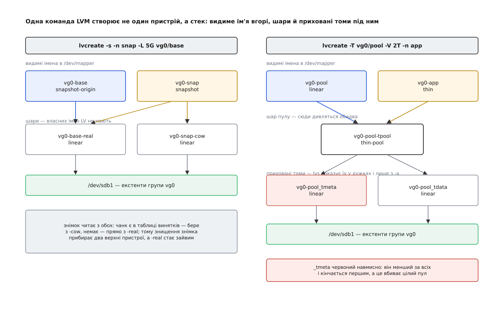

# 📋 LVM назовні: команди, таблиці, імена, поля нагляду

Контракт, який LVM показує світові: три яруси команд із суттєвими параметрами, рядки таблиць, що він складає ядру, правила іменування пристроїв у `/dev`, поля `lvs`, за якими стежать за заповненням, і ті кілька ключів `lvm.conf`, від яких залежить вирівнювання й доля тонкого пулу. Звірено з довідковими сторінками `lvm(8)`, `pvcreate(8)`, `lvcreate(8)`, `lvextend(8)`, `lvconvert(8)`, `lvs(8)`, `lvmthin(7)`, файлом `conf/example.conf.in` із дерева LVM2 й документацією ядра `admin-guide/device-mapper/`.

## Три яруси, один набір дієслів

Команд тут близько сорока, але вчити їх поодинці не треба: ім'я складено з двох частин — ярус (`pv`, `vg`, `lv`) і дія, причому набір дій на всіх трьох ярусах той самий.

| дія | що робить |
| --- | --- |
| `…create` / `…remove` | завести об'єкт або прибрати |
| `…s` | звіт таблицею, один рядок на об'єкт: `pvs`, `vgs`, `lvs` |
| `…display` | те саме багатослівно; з `-m` — розкладка по сегментах |
| `…change` | змінити властивість наявного: `vgchange -ay`, `lvchange --refresh` |
| `…rename` / `…scan` | перейменувати · перечитати пристрої |
| `…extend` / `…reduce` | збільшити або зменшити (тільки `vg` і `lv`) |

Винятків із цієї симетрії два, і обидва промовисті: `pvmove` й `lvconvert` пари на інших ярусах не мають, бо роблять те, чого на інших ярусах не буває, — перекладають екстенти між носіями й міняють сам тип тому.

### Фізичні томи

| команда | суттєві параметри |
| --- | --- |
| `pvcreate <пристрій>…` | `--dataalignment <розмір>` · `--dataalignmentoffset <розмір>` · `--metadatasize <розмір>` · `--pvmetadatacopies 0\|1\|2` (2 — друга копія в кінці носія) · `-u <uuid>` · `--bootloaderareasize <розмір>` |
| `pvs` | `-o +pe_start,pv_used` · `--segments` (по рядку на відрізок) · `-S <вираз>` |
| `pvmove <звідки> [<куди>]` | `-n <vg>/<lv>` — тільки цей том · `-b` — у тло · `--atomic` — усе або нічого · `--abort` |
| `pvchange -x n <пристрій>` | заборонити брати з цього PV нові екстенти — перший крок перед виведенням диска |
| `pvresize` · `pvremove` · `pvck --dump metadata <пристрій>` | підхопити нову ємність · зняти мітку · дістати текст метаданих із ділянки на носії |

Типово перший екстент даних лежить за 1 МіБ від початку пристрою, і саме `pvs -o +pe_start` дає єдину надійну відповідь на питання «а чи вирівняно тут узагалі щось».

Окремо варто знати поведінку `pvmove`, бо вона не така, як у решти команд. Переїзд екстентів іде довго й переживає перерви: таблицю переписують після кожного перенесеного екстента, тож обірваний `pvmove` не втрачає зробленого — запущений без аргументів, він продовжує з того місця, де спинився, а `pvmove --abort` згортає переїзд і лишає екстенти там, де вони вже опинилися. Опитуванням ходу займається окремий демон `lvmpolld`, тому команда з `-b` повертає керування одразу, а `lvs` тим часом показує томові в першій позиції `Attr` літеру `p`.

### Групи томів

| команда | суттєві параметри |
| --- | --- |
| `vgcreate <vg> <pv>…` | `-s\|--physicalextentsize <розмір>` (типово 4 МіБ) — зернистість усіх майбутніх томів групи · `--maxlogicalvolumes` · `--maxphysicalvolumes` |
| `vgextend <vg> <pv>` · `vgreduce <vg> <pv>` | `--removemissing` — виписати з групи носій, якого вже фізично немає |
| `vgchange` | `-a y\|n` — активувати чи погасити всі томи · `--monitor y\|n` — реєстрація в `dmeventd` · `--refresh` |
| `vgcfgbackup` · `vgcfgrestore` | `-f <файл>` · `--list` — вивантажити опис групи текстом і повернути попередню редакцію |
| `vgexport` · `vgimport` · `vgsplit` · `vgmerge` | передати групу іншій машині · поділити чи з'єднати групи |

### Логічні томи

| команда | що робить |
| --- | --- |
| `lvcreate -n <ім'я> -L <розмір> <vg>` | звичайний лінійний том |
| `lvcreate -i <к-сть> -I <розмір> …` | смугастий; `-I` типово 64 КіБ |
| `lvcreate -s -n <ім'я> -L <запас> <vg>/<lv>` | класичний знімок; `-L` тут — запас під зміни, а не розмір оригіналу |
| `lvcreate --type thin-pool -L <розмір> -n <пул> <vg>` | пул; `-c\|--chunksize` від 64 КіБ до 1 ГіБ кратно 64 КіБ · `--poolmetadatasize` (від 2 МіБ до ≈16 ГіБ) |
| `lvcreate -T <vg>/<пул> -V <розмір> -n <том>` | тонкий том; `-V` — оголошений обсяг, місця він поки не займає |
| `lvcreate -s -n <ім'я> <vg>/<тонкий>` | тонкий знімок — без `-L`, бо запасу під нього не резервують |
| `lvextend -L +<розмір> -r <vg>/<lv>` | `-r` тягне за собою й файлову систему через `fsadm(8)` |
| `lvextend --usepolicies <vg>/<пул>` | розширити за правилом із `lvm.conf` — саме цю команду запускає `dmeventd` |
| `lvextend --poolmetadatasize +<розмір> <vg>/<пул>` | окремо метадані пулу: вони не ростуть разом із даними |
| `lvconvert --mergesnapshot <vg>/<знімок>` | влити знімок назад в оригінал і зникнути |
| `lvconvert --type thin-pool <vg>/<lv>` · `--splitsnapshot` · `--repair` | зробити пул із наявного тому · відчепити знімок у самостійний том · полагодити метадані |
| `lvchange -ay -K <vg>/<lv>` | `-K` потрібен томам із прапорцем «пропустити активацію» |

Розмір задають двома ключами, які не змішуються: `-L` бере обсяг із суфіксом (`s` — сектори по 512 Б, далі `k`, `m`, `g`, `t`), `-l` — число екстентів. Обидва округлюються вгору до цілого екстента. Префікс `+` або `-` робить величину відносною (`lvextend -L +10g`), а до `-l` додаються відсоткові форми: `100%FREE` — усе вільне в групі, `50%VG` — половина її обсягу, `100%PVS` — вільне на перелічених у команді носіях, `100%ORIGIN` — розмір оригіналу, зручний для знімків.

## Що LVM кладе в таблицю

Граматика рядка спільна для всього device mapper і розібрана окремо — [початок, довжина, ціль, аргументи](book:unix-linux/device-mapper/api-dm-table.md); тут ідеться лише про те, які саме рядки складає LVM і скільки пристроїв заводить під одним іменем тому.



*Одна команда `lvcreate` створює цілий стек: те, що видно в `/dev/mapper`, стоїть на шарах, яких у переліку `lvs` без `-a` немає зовсім.*

```
# dmsetup table
vg0-base-real:  0     2097152 linear 8:19 384
vg0-snap-cow:   0      204800 linear 8:19 2097536
vg0-base:       0     2097152 snapshot-origin 253:11
vg0-snap:       0     2097152 snapshot 253:11 253:12 P 8

vg0-pool_tmeta: 0        8192 linear 8:17 411648
vg0-pool_tdata: 0     1048576 linear 8:17 2048
vg0-pool-tpool: 0     1048576 thin-pool 253:0 253:1 128 0 0
vg0-pool:       0     1048576 linear 253:2 0
vg0-app:        0  4294967296 thin 253:2 1

vg0-home:       0    41943040 linear 8:17 2048
vg0-fast:       0    41943040 striped 2 128 8:17 2048 8:33 2048
```

Числа тут — в одиницях, якими [блоковий шар](book:unix-linux/block-device-model) міряє все: секторах по 512 байтів, тож `128` означає 64 КіБ, а `8` — 4 КіБ. Пристрої записано [парою номерів](book:unix-linux/major-minor-numbers), а не шляхом: у мить складання стека потрібного імені в `/dev` може ще не бути.

Хвости двох рядків варто вміти читати на око. У `snapshot` це `<оригінал> <COW> P <чанк>`, де `P` — «сховище винятків переживе перезавантаження», а `8` — чанк у 4 КіБ, типовий для LVM (дозволено степені двійки від 4 КіБ до 512 КіБ). У `thin-pool` це `<метадані> <дані> <блок> <нижня позначка> <к-сть опцій>`: `128` — блок пулу в 64 КіБ, `0` — позначка, після якої ядро надсилає подію «місце кінчається», і ще один `0` — опцій немає. Саме в цьому хвості з'являються `skip_block_zeroing`, коли зануляння вимкнено, і `error_if_no_space`, коли пул налаштовано відмовляти замість того, щоб чекати.

Три способи побачити те саме з різних боків: `dmsetup ls --tree` малює залежності стека, `lvs -a -o +seg_type,devices` показує ті самі пристрої словами LVM разом із прихованими томами в квадратних дужках, а `lvdisplay -m` розписує кожен том по сегментах із номерами екстентів.

## Три імені на той самий пристрій

```
/dev/dm-7                справжній вузол; номер нестабільний — ядро роздає їх у порядку появи
/dev/mapper/vg0-home     робить udev; сюди потрапляє ВСЕ, зокрема шари й приховані томи
/dev/vg0/home            робить LVM; лише для томів, які має бачити людина
```

Ім'я в `/dev/mapper` LVM складає, зчіплюючи через дефіс назву групи, назву тому й назву шару, а **дефіси всередині самих назв подвоює**. Тому знімок `vg0/home-snap` стає `/dev/mapper/vg0-home--snap`. Це не косметика: без подвоєння `vg0-home-real` неможливо було б відрізнити від тому з іменем `home-real`, і шари злилися б із томами.

Розрізняє свої пристрої LVM не за іменем, а за рядком UUID, який device mapper зберігає окремо: `LVM-<uuid групи><uuid тому>`. Ім'я можна змінити, UUID перейменування переживає — тому й [правила udev](book:unix-linux/udev-rules), і сам LVM упізнають том саме за ним.

## Поля lvs, за якими наглядають

| поле (`-o`) | заголовок | що показує |
| --- | --- | --- |
| `data_percent` | `Data%` | **три різні речі залежно від типу тому**: у пулі — скільки зайнято місця під дані; у тонкому томі — скільки з оголошеного обсягу справді виділено; у класичному знімку — наскільки заповнено сховище винятків |
| `metadata_percent` | `Meta%` | заповненість `_tmeta`; сотня тут кладе пул навіть тоді, коли даних вдосталь |
| `pool_lv` | `Pool` | у якому пулі живе тонкий том |
| `origin` | `Origin` | чий це знімок |
| `lv_attr` | `Attr` | десять позицій стану |
| `seg_type` | `Type` | `linear`, `striped`, `snapshot`, `thin`, `thin-pool` |
| `chunk_size` | `Chunk` | чанк знімка або блок пулу |
| `lv_when_full` | | `queue` чи `error` — що робити, коли пул повний |
| `devices` | `Devices` | з яких носіїв і яких екстентів складено том |

```
# lvs -o lv_name,lv_attr,lv_size,pool_lv,origin,data_percent,metadata_percent vg0
  LV    Attr       LSize   Pool  Origin Data%  Meta%
  pool  twi-aotz-- 500.00g               73.12 41.55
  app   Vwi-aotz--   2.00t pool          17.94
  snap  Vwi---tz-k   2.00t pool  app
```

Рядок `Attr` має рівно десять позицій, і чотири з них — це весь нагляд:

| позиція | літери, які варто впізнавати |
| --- | --- |
| 1 — тип | `-` звичайний · `s` знімок · `o` оригінал (`O` — у процесі вливання) · `t` тонкий пул · `V` тонкий том · `T`/`e` дані та метадані пулу · `p` том під `pvmove` |
| 5 — стан | `a` активний · `s` призупинений · `I` знімок став недійсним · `S` призупинений знімок · `m` вливання зірвалося · `c` потрібна перевірка |
| 9 — здоров'я | `F` відмовив · `D` скінчилося місце під дані · `M` метадані лише для читання · `p` частини носіїв немає · `r` треба `--refresh` |
| 10 — активація | `k` прапорець «пропустити активацію» |

Остання позиція ловить чи не найчастіше здивування: тонкі знімки дістають прапорець `k` при створенні, тож `lvchange -ay vg0/snap` мовчки не робить нічого, доки не додати `-K`. Для власне спостереження зручний відбір виразом — `lvs -S 'data_percent>80 || metadata_percent>80'` віддає рівно ті томи, через які скоро подзвонять.

Той самий набір ключів звітування мають усі три команди на `…s`, і для програми, а не для ока, важливі чотири. `--units b` разом із `--nosuffix` віддає чисті байти без літери в кінці, `--noheadings` знімає рядок заголовків, `--separator ','` ставить розділювач замість вирівнювання пробілами, а `-O <поле>` сортує. Виходить рядок, який розбирається без здогадок:

```bash
lvs --noheadings --nosuffix --units b --separator , \
    -o vg_name,lv_name,lv_size,data_percent vg0
#   vg0,pool,536870912000,73.12
```

Ще надійніше — `--reportformat json`: тоді поля приходять із іменами й типами, і додане колись `-o +field` не зсуває нічого в тому, що вже написано.

## lvm.conf: вирівнювання й авторозширення

| ключ | типове | що робить |
| --- | --- | --- |
| `devices/data_alignment` | `0` | до якого кратного притискати початок ділянки даних PV; `0` — рахувати самому |
| `devices/data_alignment_detection` | `1` | брати `minimum_io_size` і `optimal_io_size` із sysfs — так екстенти лягають на межу смуги [RAID](book:algorithms/raid-levels) |
| `devices/data_alignment_offset_detection` | `1` | враховувати `alignment_offset` — поправку носія, у якого логічний нуль зсунуто щодо фізичного |
| `devices/issue_discards` | `0` | чи слати [discard](book:unix-linux/discard-and-trim) вниз, коли екстенти звільняються |
| `allocation/thin_pool_chunk_size_policy` | `"generic"` | `generic` бере найменший придатний блок, `performance` — більший, під носії, що люблять великі записи |
| `allocation/thin_pool_zero` | `1` | занулювати щойно виданий блок перед тим, як його побачить том |
| `activation/thin_pool_autoextend_threshold` | `100` | заповнення, після якого пул розширюють; **100 означає «не розширювати ніколи»**, найменше припустиме — 50 |
| `activation/thin_pool_autoextend_percent` | `20` | на скільки відсотків від поточного розміру рости за раз |
| `activation/snapshot_autoextend_threshold` | `100` | те саме для COW-тому класичного знімка |
| `activation/snapshot_autoextend_percent` | `20` | |
| `activation/monitoring` | `1` | реєструвати том у `dmeventd` під час активації |
| `activation/error_when_full` | `0` | `0` — притримати запити (до 60 с) у надії на розширення, `1` — одразу віддати помилку |

Механіка авторозширення складається з двох незалежних частин, і вимкненою може бути кожна. Ціль `thin-pool` сама надсилає подію, коли вільного лишилося менше за нижню позначку; демон `dmeventd`, у якого том зареєстровано, ловить цю подію й запускає `lvextend --usepolicies` на пулі; а вже `lvextend` порівнює заповнення з порогом і, якщо той не досягнутий, спокійно нічого не робить.

> 🔧 **Навіщо це.** Типове значення порога — 100, тобто зі стандартним `lvm.conf` пул не розшириться сам ніколи, хоч би скільки демонів за ним стежило. Живий нагляд вимагає **обох** умов: `monitoring = 1` (або `lvchange --monitor y` на пулі) і поріг, менший за сотню. Що саме стоїть на цій машині, показує `lvmconfig --typeconfig diff` — перелік усього, що відрізняється від типового; його варто прочитати раніше, ніж звинувачувати LVM. Для окремого пулу правило задають профілем: файл у `/etc/lvm/profile/<ім'я>.profile` і `lvchange --metadataprofile <ім'я> vg0/pool`.

## Мінімальний робочий виклик

```bash
# три яруси знизу вгору
pvcreate /dev/sdb1 /dev/sdc1
vgcreate vg0 /dev/sdb1 /dev/sdc1              # екстент типово 4 МіБ
lvcreate -n home -L 20g vg0
mkfs.ext4 /dev/vg0/home && mount /dev/vg0/home /home

lvextend -L +10g -r vg0/home                  # том і ФС однією дією
pvs -o +pe_start /dev/sdb1                    # перевірити вирівнювання

# класичний знімок: -L — це запас під зміни, не розмір оригіналу
lvcreate -s -n home-snap -L 5g vg0/home
mount -o ro /dev/vg0/home-snap /mnt/snap      # у /dev/mapper воно ж — vg0-home--snap

# тонкий пул, том у ньому та знімок тому
lvcreate --type thin-pool -L 500g -n pool vg0
lvcreate -T vg0/pool -V 2t -n app
lvcreate -s -n app-snap vg0/app               # без -L
lvchange -K -ay vg0/app-snap                  # -K знімає прапорець «пропустити активацію»

# нагляд і авторозширення
lvchange --monitor y vg0/pool
lvs -o lv_name,lv_attr,lv_size,pool_lv,origin,data_percent,metadata_percent vg0
dmsetup table vg0-pool-tpool
```

Перевіряти після цього варто не `Data%`, а `Meta%`: том метаданих на два-три порядки менший за том даних, ніколи не росте разом із ним і тому впирається в стелю першим — а розширюють його окремою командою, `lvextend --poolmetadatasize +1g vg0/pool`.
