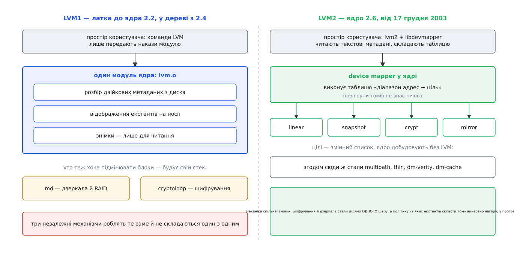

# 📜 Від HP-UX до LVM2: як керівник томів розпався на два шари

Ідею логічних томів Linux не придумав — він її скопіював, з чужої термінології включно. Цікаве почалося пізніше: за п'ять років після першої реалізації її розібрали навпіл, і саме той розбір, а не сама ідея, зробив можливими знімки, шифрування й дзеркала в одному ядрі.

## Звідки взявся взірець

Керівник томів народився не на Linux і не в академії, а там, де диски продавали разом із машиною й обіцянкою безперервної роботи. Першим його дістав AIX 3.0 від IBM 1989 року — саме там з'явилися «фізичні розділи» (PP) і «логічні розділи» (LP), тобто екстенти під іншою назвою. Наступним таку підсистему отримав HP-UX у версії 9.0. *(Черговість — за таблицею реалізацій у довідкових джерелах; вона усталена. А от популярна оповідка, ніби HP-UX дістав свій керівник томів через OSF/1 як посередника, документована слабко, тож приймати її на віру не варто.)*

Причина, чому це зробили саме продавці великих UNIX-ів, буденна. Їхній покупець мав шафу дисків і зобов'язання не зупиняти машину; для нього «розділ скінчився» означало не незручність, а простій, за який платять грішми. У Linux 1998 року такого покупця ще не було — була машина з одним-двома дисками, де перерозмітка на вихідних нікому не шкодила.

## 1998: перший LVM для Linux

Перший LVM для Linux написав 1998 року німецький розробник Гайнц Мауельсгаген (Heinz Mauelshagen), узявши за головний взірець керівник томів HP-UX. Це твердження засвідчене й незаперечне.

Спірна дрібниця поруч: частина джерел додає, що на той момент він уже працював у Sistina Software. Sistina була відгалуженням від Університету Міннесоти й виросла навколо кластерної файлової системи GFS, а не навколо LVM, тож інші описи ставлять її входження в цю історію пізніше — коли компанія перебрала розвиток уже наявного коду. Обидві версії трапляються в поважних довідниках, і надійно розвести їх без первинних документів не вийде; статус — **спірна деталь біографії**, тоді як авторство й рік сумніву не викликають.

Важливо, що саме було скопійовано з HP-UX. Не код — код був новий, під ліцензію ядра. Скопіювали **словник**: фізичний том, група томів, логічний том, фізичний екстент. Завдяки цьому адміністратор, що прийшов з великого UNIX-а, читав команди Linux без перекладу, і це в 1998 році важило більше за будь-яку технічну перевагу.

LVM1 жив спершу як латка до ядра 2.2 (воно вийшло 26 січня 1999 року), а до основного дерева потрапив у серії 2.4, що почалася з ядра 2.4.0 від 4 січня 2001 року. Один модуль ядра робив усе: сам розбирав метадані з диска, сам виконував відображення екстентів, сам обслуговував знімки. Знімки тоді були **лише для читання**.

## Чому одного модуля виявилося замало

Ця конструкція зламалася не від помилок, а від власної форми — і зламалася в трьох місцях одразу.

**Метадані розбирало ядро.** Опис групи томів лежав на диску двійковими структурами наперед заданого розміру, а розбирав їх код усередині ядра. Отже, будь-яка зміна формату означала зміну ядра, а межі, вписані у форму структури, ставали межами самої підсистеми. Рятувати групу томів із побитим заголовком доводилося теж крізь ядро — з боку користувача там не було нічого, що можна просто відкрити й прочитати.

**Механіку підміни блоків було замкнено всередині LVM.** А підміняти блоки — «візьми ці адреси й обслужи їх ось цим кодом» — хотіли не тільки томи. Тим самим за суттю займалося дзеркалення дисків, шифрування розділу, багатошляховий доступ до сховища. Кожен будував собі окремий стек: RAID через `md`, шифрування через `cryptoloop` поверх [пристрою-петлі](book:unix-linux/loop-device). Три незалежні механізми виконували одну роботу й не складалися один з одним: покласти шифрування під логічний том можна було хіба що випадково вдалим порядком шарів.

**Політика сиділа в одній коробці з механікою.** Рішення «з яких саме екстентів скласти том» — це політика, вона змінюється часто й помилка в ній коштує лише неоптимального розкладу. Виконання таблиці відображення — механіка, вона в гарячому шляху вводу-виводу й помилка в ній коштує даних. Спільний модуль тримав їх поруч, порушуючи те саме [розділення механізму й політики](book:unix-linux/unix-philosophy), яке UNIX узагалі-то вважає своїм.

## Розкол: device mapper

Відповіддю стало не поліпшення LVM, а віднімання. З підсистеми витягли все, що не є виконанням, і залишили в ядрі навмисно дурний механізм: [device mapper](book:unix-linux/device-mapper) приймає таблицю рядків «діапазон логічних адрес → ціль» і виконує її. Слів «група томів» чи «фізичний том» він не знає й знати не хоче. Усе, що складає таблицю, поїхало нагору, у програму простору користувача, а метадані стали **текстом** — тим самим, що LVM2 тепер дописує на кожен фізичний том.

Виграш від цього віднімання виявився більшим, ніж просто охайніша будова.

*Політика піднялася в простір користувача, механіка стала спільною — і кожен новий різновид підміни блоків тепер додається як ще одна ціль, а не як ще один стек.*

Оскільки ціль — це просто шматок коду з домовленим інтерфейсом, знімки, дзеркала й шифрування стали цілями **одного** шару: `snapshot`, `mirror`, `crypt`. Шифрування розділу перестало бути окремою спорудою й перетворилося на [dm-crypt](book:unix-linux/dm-crypt) — ціль, яку можна покласти під логічний том або над ним, без переговорів між підсистемами. Тим самим отвором пізніше зайшли багатошляховий доступ, тонке виділення місця, кеш на швидкому носії та перевірка цілісності [dm-verity](book:unix-linux/dm-verity) — жодне з них не вимагало правити LVM.

Текстові метадані дали свій наслідок: формат тепер можна міняти, не чіпаючи ядра, а зіпсовану розмітку групи томів — відновити з попереднього запису, бо кожна зміна дописується поруч зі старою, а не поверх неї. При цьому інструменти LVM2 навмисно лишилися здатними читати й старий формат LVM1, тож перехід не вимагав ані переливання даних, ані зупинки машини на вихідні.

Найкраще суть розколу видно на знімках. У LVM1 знімок був **тільки для читання**, у LVM2 — і для запису теж, і це не додана функція, а прямий наслідок нової форми. Знімок у device mapper — це не один об'єкт, а **пара цілей**: `snapshot-origin` підмінює собою вихідний том і перед кожним записом відкладає стару версію блока, а `snapshot` — окремий пристрій зі своїм сховищем винятків. Щойно вони стали двома незалежними цілями, запитання «а чи можна писати в знімок» звелося до «а чи має ця ціль куди складати власні винятки», і відповідь виявилася ствердною. У модулі, де знімок був вбудованою поведінкою тома, ставити таке запитання не було де.

## Змагання за ядро 2.6 і гроші

Місце в ядрі 2.6 device mapper дістав не без бою. IBM просувала свою EVMS (Enterprise Volume Management System) — за можливостями багатшу, з кращими інструментами, але побудовану так, що керування томами цілком жило в ядрі. Виграла пара «device mapper плюс LVM2», і поширене пояснення чому — саме мінімалізм ядрової частини: розробникам ядра сподобалися не функції, а те, як мало нова підсистема просить ядро знати. Команда EVMS після цього переробила свої інструменти під device mapper; останній випуск, 2.5.5, вийшов 26 лютого 2006 року, невдовзі після чого IBM розвиток зупинила, а 2008 року Novell оголосила про перехід SUSE на LVM.

Ядро 2.6.0 вийшло **17 грудня 2003 року** — і того ж місяця Red Hat купила Sistina Software за 31 мільйон доларів акціями. GFS, доти закрита, була відкрита; супровідники LVM2 й device mapper опинилися в штаті найбільшого постачальника дистрибутива. Звідси й побічний наслідок, який видно донині: саме в родині Red Hat типовий установник багато років розкладав систему на логічні томи за замовчуванням, тож питання «чому мій корінь — це `/dev/mapper/…`» уперше ставили здебільшого її користувачі.

Від HP-UX у підсумку лишився словник. Своїм внеском Linux зробив розкол: керівник томів перестав бути підсистемою й став двома різними речами — програмою, що вирішує, і механізмом, що виконує.
