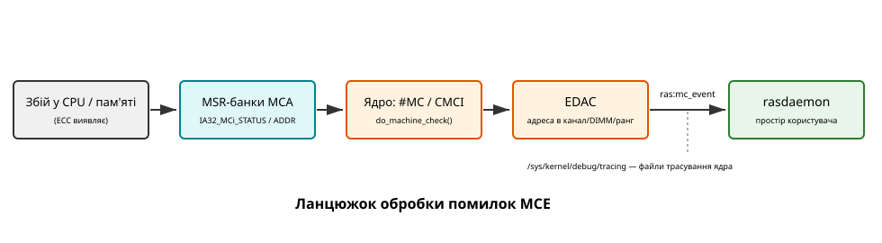

# Апаратні помилки: машинна перевірка (MCE) і як ядро про них дізнається

<preknowlist>
- **Базова архітектура x86/x64**: розуміння того, що таке процесор, кеш-пам'ять, оперативна пам'ять та системна шина.
- **Переривання та винятки (Interrupts and Exceptions)**: загальне уявлення про те, як апаратура може асинхронно повідомляти процесору (і відповідно операційній системі) про події, що вимагають уваги.
- **Регістри MSR (Model Specific Registers)**: знання про те, що в процесорах існують спеціальні регістри, які використовуються для конфігурації, моніторингу та діагностики роботи самого процесора.
- **Ядро Linux**: базове розуміння того, що ядро керує апаратним забезпеченням та реагує на переривання, надаючи інтерфейс для простору користувача (user-space).
</preknowlist>

Коли ми говоримо про надійність комп'ютерних систем, ми зазвичай уявляємо собі програмні помилки: segmentation faults, kernel panics через поганий драйвер, deadlock'и або race conditions. Проте апаратне забезпечення також не є ідеальним. Процесори, оперативна пам'ять, кеші та системні шини можуть давати збої. Космічні промені, альфа-частинки з матеріалів, у які запаковано самі мікросхеми, або просто знос компонентів можуть викликати "перемикання" бітів (bit flips) у пам'яті. Уявіть, що один біт у вказівнику або інструкції процесора раптово змінився. Це може призвести до катастрофічних наслідків, починаючи від пошкодження даних і закінчуючи повним крахом системи.

Саме для вирішення цієї проблеми існує ціла ділянка інженерії, яку позначають абревіатурою RAS (Reliability, Availability, and Serviceability). RAS — це не окрема підсистема ядра, а комплекс апаратних та програмних засобів, які працюють разом, щоб забезпечити безперервну роботу системи навіть у випадку апаратних збоїв. Процесори мають вбудовані механізми виявлення та часто виправлення таких помилок, як-от ECC (Error-Correcting Code) у пам'яті та кешах. Проте сам факт виявлення помилки — це лише половина справи. Операційна система повинна дізнатися про цю помилку, щоб відреагувати: залогувати її, спробувати ізолювати несправний компонент або, у найгіршому випадку, безпечно зупинити систему, щоб уникнути пошкодження даних. І тут на сцену виходить **Machine Check Exception (MCE)**.

У цій статті ми детально розглянемо, що таке Machine Check Exception, як апаратура реєструє помилки за допомогою банків регістрів MSR, як ці помилки передаються ядру Linux через переривання (`#MC` та `CMCI`), та як підсистеми EDAC і `rasdaemon` дозволяють системним адміністраторам моніторити здоров'я свого "заліза".

## Від фізики до логіки: як апаратура виявляє помилки

Будь-яка сучасна серверна (і більшість десктопних) архітектура процесорів включає внутрішні механізми самодіагностики та контролю цілісності. Найпоширеніший метод — використання кодів з корекцією помилок (ECC). ECC додає надлишкові біти до кожного блоку даних (наприклад, 8 біт на кожні 64 біти даних). Коли дані читаються, контролер пам'яті або кешу обчислює контрольне значення і порівнює його з прочитаним. 

Залежно від кількості пошкоджених бітів, помилки поділяються на дві основні категорії:
1. **Виправні помилки (Correctable Errors, CE)**: Помилки, які апаратура (контролер пам'яті або кеш) може виправити самостійно "на льоту". Наприклад, зміна одного біта у 64-бітному слові (Single-Bit Error). Система продовжує працювати без переривання, але сам факт помилки є важливим сигналом про можливе погіршення стану обладнання (деградацію).
2. **Невиправні помилки (Uncorrectable Errors, UE)**: Помилки, які зачіпають більше бітів, ніж дозволяє виправити алгоритм ECC (наприклад, Multi-Bit Error), або критичні помилки на шині. Система не може автоматично відновити правильні дані. Це означає, що продовження виконання програми або роботи ядра з цими даними призведе до непередбачуваної поведінки. Найважчі з них — ті, що зачепили сам контекст процесора, — називають фатальними (**Fatal**); решта невиправних лишає системі шанс вижити, і нижче ми побачимо, як саме.

Коли процесор або його вбудовані контролери виявляють будь-яку з цих помилок, вони повинні зберегти інформацію про неї. Для цього використовується спеціальна архітектура Machine Check Architecture (MCA), яка спирається на банки специфічних регістрів MSR.

## Machine Check Architecture (MCA) та MSR Банки

Архітектура MCA (спільна для Intel та AMD, хоча з певними відмінностями в деталях) надає процесору спосіб звітувати про апаратні помилки операційній системі. 

Основою MCA є набір Model Specific Registers (MSR). Регістри MCA поділяються на глобальні (описують загальний стан машини) та банки (banks) регістрів, кожен з яких відповідає за певну апаратну підсистему (наприклад, банк 0 — кеш даних, банк 1 — кеш інструкцій, банк 2 — контролер пам'яті, банк 3 — інтерфейс шини тощо). Кількість та призначення банків відрізняються залежно від моделі процесора.

### Глобальні регістри MCA

Глобальні регістри контролюють і повідомляють про загальний статус MCA для всього логічного процесора (ядра).
- **IA32_MCG_CAP (Machine Check Global Capability)**: Доступний лише для читання. Вказує на можливості архітектури MCA на цьому процесорі, зокрема кількість банків регістрів (bits 0-7).
- **IA32_MCG_STATUS (Machine Check Global Status)**: Містить базову інформацію про стан процесора після виникнення Machine Check Exception. Наприклад, біт `RIPV` (Restart IP Valid) вказує, чи можна безпечно перезапустити програму після обробки винятку (якщо RIPV=0, контекст виконання втрачено або пошкоджено, і процес/ядро не може продовжити роботу).

### Банки регістрів (MSR Banks)

Кожен банк складається з набору регістрів. Наприклад, для банку `i`, існують такі регістри:
- **IA32_MCi_CTL**: Регістр управління. Кожен біт вмикає або вимикає сигналізацію про певну помилку в цьому банку. Ядро (або BIOS/UEFI) зазвичай встановлює всі підтримувані біти в 1 під час завантаження.
- **IA32_MCi_STATUS**: Найважливіший регістр. Він містить статус помилки. Якщо біт `VAL` (Valid, біт 63) встановлено, це означає, що в цьому банку зафіксована помилка. Тут міститься код помилки (MCA Error Code), статус помилки (біт `UC` — помилка невиправна; знятий `UC` означає, що апаратура впоралася сама; біт `PCC` — контекст процесора пошкоджено), та інша специфічна для процесора інформація.
- **IA32_MCi_ADDR**: Якщо біт `ADDRV` (Address Valid) у `IA32_MCi_STATUS` встановлено в 1, цей регістр містить фізичну адресу пам'яті, де сталася помилка. Це критично важливо для ядра, щоб знати, яка саме пам'ять "посипалася".
- **IA32_MCi_MISC**: Якщо біт `MISCV` (Misc Valid) у `IA32_MCi_STATUS` встановлено в 1, цей регістр містить додаткову специфічну інформацію (наприклад, маску адреси або інформацію про конкретний модуль пам'яті (DIMM)).

Таким чином, коли відбувається помилка, апаратура встановлює відповідні біти в `IA32_MCi_STATUS` і записує адресу в `IA32_MCi_ADDR`. Але як про це дізнається ОС?

## Як ядро дізнається про помилку: `#MC` та CMCI

Запис у регістри MSR — це пасивна дія. Ядру потрібен активний сигнал, щоб відреагувати. Існують два основні механізми: Machine Check Exception (`#MC`) для невиправних помилок, що вимагають негайної реакції, та Corrected Machine Check Interrupt (CMCI) або періодичне опитування для виправних помилок.

### Machine Check Exception (`#MC`)

Якщо помилка є **невиправною (Uncorrectable, UC)** і вимагає негайної уваги (наприклад, процесор спробував прочитати пошкоджені дані, які не зміг виправити ECC, для виконання інструкції), апаратура генерує виняток `#MC` (Machine Check Exception). 

`#MC` — це один із архітектурних винятків x86 (вектор переривання 18, `0x12`). Це немаскований виняток, що має найвищий пріоритет (вищий навіть за NMI — Non-Maskable Interrupt). 

Коли виникає `#MC`:
1. Процесор негайно перериває поточне виконання (навіть якщо переривання були вимкнені через `cli`).
2. Оновлює глобальні регістри (наприклад, `IA32_MCG_STATUS`).
3. Викликає обробник винятку `#MC` у ядрі операційної системи.

Ядро Linux має спеціальний обробник для `#MC` (`do_machine_check` у x86). Цей обробник працює у дуже обмеженому контексті (так званий NMI-подібний контекст). Він не може блокуватися, не може виділяти пам'ять, і часто навіть не може безпечно використовувати звичайні функції логування (`printk`), оскільки сама пам'ять може бути пошкодженою.

Завдання обробника `#MC`:
1. Швидко просканувати всі банки MSR (прочитати `IA32_MCi_STATUS`), щоб знайти, який банк (чи банки) повідомив про помилку (перевірка біта `VAL`).
2. Якщо знайдена фатальна помилка (PCC — Processor Context Corrupted — встановлено в 1), ядро розуміє, що продовження роботи неможливе. Воно спробує вивести повідомлення про паніку (Kernel Panic) на екран або в консоль (часто через спеціальні механізми, які обходять звичайний логер) і зупиняє систему.
3. Якщо помилка є невиправною, але контекст процесора не пошкоджено (наприклад, процес у просторі користувача спробував прочитати "биту" сторінку пам'яті), ядро може вжити "м'яких" заходів. Воно візьме фізичну адресу (з `IA32_MCi_ADDR`), знайде відповідну сторінку, а через зворотне відображення (rmap) — усі процеси, що її відображають, і надішле кожному з них сигнал `SIGBUS` (з кодом `BUS_MCEERR_AR` — Action Required). Процес буде вбито (або він обробить сигнал), але решта системи продовжить працювати. Сама фізична сторінка позначається ядром як `HWPoison` (отруєна апаратним забезпеченням), і ядро більше ніколи не буде виділяти її для використання.

### Повідомлення про виправні помилки: опитування та CMCI

З виправними помилками (CE) ситуація інша. Оскільки апаратура виправила помилку (наприклад, перевернутий біт було відновлено завдяки ECC), дані є правильними, і потік виконання не потрібно негайно переривати. Однак, постійні виправні помилки на тій самій ділянці пам'яті є чітким індикатором того, що модуль пам'яті (DIMM) виходить з ладу і його потрібно замінити до того, як помилки стануть невиправними (Uncorrectable).

Історично операційні системи дізнавалися про виправні помилки за допомогою **періодичного опитування** (англ. polling). Ядро запускало таймер (наприклад, кожні 5 хвилин), який періодично опитував (читав) усі MSR банки `IA32_MCi_STATUS`, щоб перевірити, чи не з'явилися там нові помилки. Якщо помилка знаходилася, ядро логувало її і очищало регістр статусу.

Згодом (починаючи з архітектури Intel Nehalem) був доданий механізм **CMCI (Corrected Machine Check Interrupt)**. Замість того, щоб постійно опитувати регістри, ядро може налаштувати апаратуру генерувати переривання (CMCI) тоді, коли кількість виправних помилок у певному банку перевищить заданий поріг.
Коли генерується CMCI, ядро отримує переривання, швидко читає банк, логує помилку та скидає лічильник. Це значно ефективніше, ніж опитування, і дозволяє швидше реагувати на сплески виправних помилок (так звані error storms).

## Шлях помилки до простору користувача: EDAC та rasdaemon

Отже, ядро отримало інформацію про помилку (через `#MC`, CMCI або опитування) і прочитало "сирі" дані з MSR банків (код помилки, статус, фізичну адресу). Але ця інформація є занадто специфічною (raw). Системному адміністратору мало що скаже "Error in Bank 2, Address 0x1A2B3C4D". Йому потрібно знати: "Який саме модуль пам'яті (DIMM слот на материнській платі) потрібно замінити?".

Тут на допомогу приходять драйвери EDAC (Error Detection and Correction) та простір користувача.

### Підсистема EDAC

EDAC — це підсистема ядра Linux, мета якої — надати уніфікований інтерфейс для звітування про апаратні помилки, незалежно від архітектури (x86, ARM тощо). EDAC має набір драйверів, специфічних для кожного контролера пам'яті (наприклад, `sb_edac` для Sandy Bridge, `skx_edac` для Skylake).

Драйвери EDAC знають "топологію" контролера пам'яті. Коли відбувається помилка і ядро отримує фізичну адресу (з MCA), драйвер EDAC (за допомогою складних розрахунків і таблиць відображення, що їх надає BIOS/ACPI) перетворює цю загальну фізичну адресу (System Physical Address) на конкретні координати в контролері пам'яті: канал (Channel), слот (DIMM), ранг (Rank) і банк.

Механічно це виглядає так. Драйвер вішається на ланцюжок сповіщень MCE і дістає з нього ту саму структуру `struct mce`, яку заповнив обробник машинної перевірки. Далі він розкодовує `m->addr` — або власним декодером, або через таблиці ADXL, що їх дає прошивка, — і передає готові координати вище викликом `edac_mc_handle_error(…, res.channel, res.dimm, …)`. У ядрі Linux це видно в `drivers/edac/skx_common.c` (функції `skx_mce_check_error()`, `skx_adxl_decode()`), спільному для драйверів Skylake-SP та Ice Lake; решта драйверів (`sb_edac`, `amd64_edac`) роблять те саме зі своєю арифметикою адрес.

Саме `edac_mc_handle_error()` і є місцем, де сира адреса стає подією. Усередині (`drivers/edac/edac_mc.c`, функція `edac_raw_mc_handle_error()`) ядро видає точку трасування `mc_event` групи `ras` — її оголошення лежить у `include/ras/ras_event.h`. У події вже немає жодного MSR: там номер контролера `mc_index`, три рівні топології `top_layer`/`middle_layer`/`lower_layer` (що саме вони означають, задає драйвер: у сучасних серверних контролерах це зазвичай канал і слот, а третій рівень лишається невикористаним; у старіших траплялася й гілка), текстова мітка слота `label`, лічильник `error_count`, адреса та синдром. Точки трасування — інтерфейс **ядра**: вони вмикаються й читаються через файли трасування, змонтовані як `/sys/kernel/tracing` або (історично) `/sys/kernel/debug/tracing`. Простір користувача тут лише читач.

### Демон `rasdaemon`

У старих версіях Linux для збору MCE помилок використовувалася утиліта `mcelog` (і спеціальний пристрій `/dev/mcelog`). Однак цей підхід застарів і замінюється на **`rasdaemon`**.

`rasdaemon` — це демон користувацького простору (user-space daemon), який працює у фоновому режимі.
Його основна задача — прослуховувати події трасування (tracepoints) від підсистеми EDAC та інших підсистем ядра (наприклад, AER для PCI Express). Робить він це звичайними файловими операціями над деревом трасування: знаходить каталог (спершу tracefs `/sys/kernel/tracing`, як запасний варіант — `/sys/kernel/debug/tracing`), вмикає потрібну подію рядком `ras:mc_event`, дописаним у файл `set_event`, і далі читає двійковий потік із `per_cpu/cpu*/trace_pipe_raw` по одному дескриптору на процесор, розбираючи записи бібліотекою `libtraceevent` (див. `ras-events.c` у джерелах rasdaemon і man-сторінку `rasdaemon(8)`).

*Спрощена схема шляху апаратної помилки від заліза до користувача: збій фіксується в банках MSR архітектури MCA, ядро дізнається про нього через виняток `#MC` або переривання CMCI, драйвер EDAC перетворює фізичну адресу на координати модуля пам'яті й видає подію трасування `ras:mc_event`, а `rasdaemon` уже в просторі користувача читає її з файлів трасування ядра — тому підпис `/sys/kernel/tracing` стоїть на межі між ядром і демоном, а не всередині демона.*

Коли ядро повідомляє про помилку через `tracepoint` (наприклад, `mc_event`), `rasdaemon` захоплює цю подію. Він робить дві важливі речі:
1. **Зберігає дані в базу даних**: Зазвичай це локальна SQLite база даних (наприклад, `/var/lib/rasdaemon/ras-mc_event.db`), де зберігається повна історія всіх апаратних помилок (CE та UE), включаючи час, координати DIMM, коди помилок.
2. **Логує в Syslog**: Виводить зрозуміле для людини повідомлення в системний журнал (через `journald` або `syslog`).

Системний адміністратор може використовувати утиліту командного рядка `ras-mc-ctl` (яка йде в комплекті з `rasdaemon`), щоб переглянути статистику помилок. Наприклад, команда `ras-mc-ctl --errors` виведе таблицю з кількістю виправних та невиправних помилок на кожному модулі пам'яті, що дозволяє легко ідентифікувати DIMM, який починає деградувати, і запланувати його заміну до того, як виправна помилка перетвориться на фатальну невиправну.

## Висновок

Обробка апаратних помилок у Linux — це складний багаторівневий процес. Він починається з того, що апаратура (ECC) виявляє перемикання біта і фіксує це в регістрах MCA (MSR банках). Далі, через механізми переривань (`#MC` або CMCI), ця інформація передається ядру. Ядро повинно швидко і безпечно відреагувати: зупинити систему, якщо помилка фатальна (Kernel Panic), вбити конкретний процес і ізолювати сторінку пам'яті (HWPoison), якщо контекст збережено, або просто залогувати подію, якщо помилка була виправлена. 

Нарешті, завдяки драйверам EDAC, які розуміють специфічну топологію пам'яті, та демону `rasdaemon`, "сирі" адреси перетворюються на зручну інформацію про конкретні слоти DIMM, дозволяючи адміністраторам підтримувати надійність серверів на найвищому рівні.

